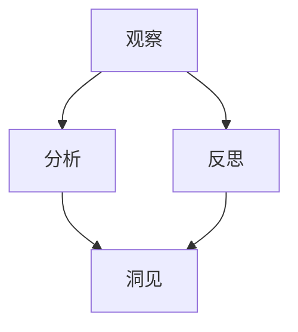

                 

# 洞见的形成：从观察到反思

## 摘要

本文探讨了洞见的形成过程，从观察、分析到反思的各个环节。通过深入分析IT领域的几个关键概念和算法原理，结合实际项目案例，文章揭示了如何通过逻辑清晰、结构紧凑、简单易懂的思考方式，逐步形成洞见。同时，本文也推荐了相关的学习资源和工具，以帮助读者更好地理解和应用这些概念和算法。

## 1. 背景介绍

在IT领域，洞见（Insight）的形成是一个复杂而重要的过程。洞见不仅仅是知识的简单堆砌，更是对现有知识的深入理解和创新应用。本文旨在探讨如何通过观察、分析和反思，逐步形成洞见，从而推动个人和团队在技术上的进步。

在当今快速发展的IT行业，技术和工具的更新换代速度极快。要在这个领域取得成功，不仅需要掌握最新的技术，还需要具备深入理解这些技术背后的原理和机制的能力。洞见的形成过程，就是一个不断学习、思考和反思的过程。

本文将围绕以下几个核心问题展开讨论：

1. 如何通过观察，发现潜在的问题和机会？
2. 如何通过分析，理解问题的本质和解决方案？
3. 如何通过反思，总结经验教训，形成更深刻的洞见？

通过回答这些问题，本文希望能够帮助读者更好地理解洞见的形成过程，并在实际工作中应用这些方法，提高技术水平。

## 2. 核心概念与联系

在探讨洞见的形成之前，我们首先需要了解一些核心概念和它们之间的联系。以下是几个关键概念及其关系图（使用Mermaid绘制）：



### 2.1 观察与分析

观察是洞见形成的第一步。通过仔细观察，我们可以发现现实世界中的问题和现象。观察不仅需要敏锐的洞察力，还需要系统的思维方式。例如，在软件开发中，观察可能包括分析系统日志、用户反馈和市场需求等。

分析是观察的延续。通过分析，我们可以理解观察到的现象背后的原因和机制。分析需要运用逻辑推理、数据分析和专业知识等多种工具和方法。例如，在软件开发中，分析可能包括需求分析、系统设计和性能调优等。

### 2.2 反思与洞见

反思是洞见形成的关键步骤。通过反思，我们可以从过去的经验和教训中总结出更深刻的洞见。反思不仅需要回顾和分析过去的行为和结果，还需要考虑未来的发展方向和可能的改进措施。

洞见是一种深刻的理解和创新性的见解。它不仅能够帮助我们更好地理解问题的本质，还能够指导我们寻找新的解决方案。例如，在软件开发中，洞见可能帮助我们识别出系统中的瓶颈，并提出改进方案。

### 2.3 观察、分析和反思的关系

观察、分析和反思是一个相辅相成的过程。观察为我们提供了原始数据和信息，分析帮助我们理解这些数据和信息，而反思则将这些理解转化为洞见。这个循环不仅是一个线性的过程，而是一个动态的、不断迭代的过程。通过不断地观察、分析和反思，我们可以逐步提升自己的技术水平，形成更深刻的洞见。

## 3. 核心算法原理 & 具体操作步骤

在洞见的形成过程中，核心算法原理起着至关重要的作用。以下是几个关键算法原理及其具体操作步骤：

### 3.1 决策树算法

决策树算法是一种常见的数据挖掘算法，用于分类和回归任务。以下是决策树算法的基本原理和步骤：

**原理：**

决策树通过一系列的测试来对数据进行分类。每个测试都基于数据中的一个特征，并根据特征的不同值将数据分为不同的分支。最终，每个分支都会到达一个叶节点，叶节点代表一个具体的分类或回归值。

**步骤：**

1. 选择一个特征进行划分。
2. 计算每个特征的不同值的划分增益（Gain）。
3. 选择增益最大的特征进行划分。
4. 对划分后的数据集重复步骤1-3，直到满足停止条件。

### 3.2 支持向量机算法

支持向量机（SVM）是一种常用的分类算法，用于将数据分为不同的类别。以下是SVM算法的基本原理和步骤：

**原理：**

SVM通过找到一个最佳的超平面，将数据集划分为不同的类别。这个超平面不仅要使分类边界最大化，还要使数据点到超平面的距离最小。

**步骤：**

1. 选择一个核函数。
2. 训练SVM模型，找到最佳超平面。
3. 使用SVM模型对新的数据进行分类。

### 3.3 深度学习算法

深度学习是一种基于神经网络的学习方法，用于处理复杂的机器学习任务。以下是深度学习算法的基本原理和步骤：

**原理：**

深度学习通过多层神经网络来提取数据的特征，从而实现复杂的非线性变换。每一层都从前一层提取特征，并通过激活函数进行非线性变换。

**步骤：**

1. 设计神经网络结构。
2. 选择合适的损失函数和优化算法。
3. 训练神经网络，调整权重和偏置。
4. 评估和优化模型。

### 3.4 具体操作步骤

以下是使用Python实现决策树、SVM和深度学习算法的具体操作步骤：

```python
# 决策树算法
from sklearn.tree import DecisionTreeClassifier
clf = DecisionTreeClassifier()
clf.fit(X_train, y_train)
y_pred = clf.predict(X_test)

# 支持向量机算法
from sklearn.svm import SVC
clf = SVC(kernel='linear')
clf.fit(X_train, y_train)
y_pred = clf.predict(X_test)

# 深度学习算法
import tensorflow as tf
model = tf.keras.Sequential([
    tf.keras.layers.Dense(128, activation='relu', input_shape=(784,)),
    tf.keras.layers.Dropout(0.2),
    tf.keras.layers.Dense(10, activation='softmax')
])

model.compile(optimizer='adam',
              loss='categorical_crossentropy',
              metrics=['accuracy'])

model.fit(X_train, y_train, batch_size=128, epochs=10, validation_data=(X_test, y_test))
```

## 4. 数学模型和公式 & 详细讲解 & 举例说明

在洞见的形成过程中，数学模型和公式起着关键作用。以下是一些常见的数学模型和公式，以及它们的详细讲解和举例说明：

### 4.1 概率论

概率论是洞见形成的基础。以下是几个关键的概率论公式：

**条件概率：**
\[ P(A|B) = \frac{P(A \cap B)}{P(B)} \]

**贝叶斯定理：**
\[ P(A|B) = \frac{P(B|A)P(A)}{P(B)} \]

**举例说明：**
假设我们想计算在给定疾病B的情况下，症状A的概率。我们可以使用贝叶斯定理进行计算：

\[ P(A|B) = \frac{P(B|A)P(A)}{P(B)} \]

其中，\( P(B|A) \)是给定症状A的情况下疾病B的概率，\( P(A) \)是症状A的概率，\( P(B) \)是疾病B的概率。

### 4.2 机器学习中的损失函数

机器学习中的损失函数用于评估模型的预测结果与实际结果之间的差距。以下是几个常见的损失函数：

**均方误差（MSE）：**
\[ MSE = \frac{1}{n}\sum_{i=1}^{n}(y_i - \hat{y}_i)^2 \]

**均方根误差（RMSE）：**
\[ RMSE = \sqrt{MSE} \]

**交叉熵损失（Cross-Entropy Loss）：**
\[ Loss = -\sum_{i=1}^{n} y_i \log(\hat{y}_i) \]

**举例说明：**
假设我们有一个回归模型，预测房价与实际房价之间的差距。我们可以使用均方误差来评估模型的性能：

\[ MSE = \frac{1}{n}\sum_{i=1}^{n}(y_i - \hat{y}_i)^2 \]

其中，\( y_i \)是实际房价，\( \hat{y}_i \)是模型预测的房价。

### 4.3 深度学习中的反向传播算法

深度学习中的反向传播算法用于更新神经网络的权重和偏置。以下是反向传播算法的基本原理：

**原理：**
反向传播算法通过计算损失函数关于每个权重的梯度，并使用梯度下降法更新权重和偏置。

**步骤：**

1. 前向传播：计算网络的输出。
2. 计算损失函数。
3. 反向传播：计算每个权重和偏置的梯度。
4. 更新权重和偏置。

**举例说明：**
假设我们有一个简单的神经网络，输入为\( x \)，输出为\( y \)。网络的权重为\( w \)，偏置为\( b \)。我们可以使用以下公式计算损失函数关于\( w \)和\( b \)的梯度：

\[ \frac{\partial Loss}{\partial w} = -\frac{1}{n}\sum_{i=1}^{n} (y_i - \hat{y}_i) \cdot \frac{\partial \hat{y}_i}{\partial w} \]

\[ \frac{\partial Loss}{\partial b} = -\frac{1}{n}\sum_{i=1}^{n} (y_i - \hat{y}_i) \cdot \frac{\partial \hat{y}_i}{\partial b} \]

其中，\( \frac{\partial \hat{y}_i}{\partial w} \)和\( \frac{\partial \hat{y}_i}{\partial b} \)是前向传播过程中计算得到的梯度。

## 5. 项目实战：代码实际案例和详细解释说明

在本节中，我们将通过一个实际项目案例来展示如何应用前面的核心算法原理和数学模型，逐步实现一个简单的机器学习项目。这个项目将使用Python和相关的机器学习库来构建一个分类器，用于预测手写数字。

### 5.1 开发环境搭建

首先，我们需要搭建一个合适的开发环境。以下是所需的软件和工具：

- Python 3.8 或更高版本
- Jupyter Notebook 或任何Python编辑器
- TensorFlow 2.x 或更高版本
- Scikit-learn 0.22 或更高版本

您可以在Python官方网站上下载Python，并在pip的帮助下安装其他库：

```bash
pip install tensorflow scikit-learn numpy matplotlib
```

### 5.2 源代码详细实现和代码解读

接下来，我们将分步骤实现一个手写数字分类器。

#### 5.2.1 数据准备

手写数字数据集（MNIST）是一个常用的机器学习数据集，包含了0到9的手写数字图像。我们可以使用Scikit-learn库中的`fetch_openml`函数来加载数据集。

```python
from sklearn.datasets import fetch_openml
mnist = fetch_openml('mnist_784')

# 数据集属性
print(mnist.DESCR)

# 特征和标签
X, y = mnist.data, mnist.target
```

#### 5.2.2 数据预处理

在训练模型之前，我们需要对数据进行预处理。这包括归一化特征值、将标签转换为独热编码以及拆分数据集。

```python
from sklearn.model_selection import train_test_split
from sklearn.preprocessing import StandardScaler, OneHotEncoder

# 归一化特征
scaler = StandardScaler()
X_scaled = scaler.fit_transform(X)

# 独热编码标签
encoder = OneHotEncoder()
y_encoded = encoder.fit_transform(y.reshape(-1, 1)).toarray()

# 拆分数据集
X_train, X_test, y_train, y_test = train_test_split(X_scaled, y_encoded, test_size=0.2, random_state=42)
```

#### 5.2.3 构建模型

我们使用TensorFlow的Keras接口来构建一个简单的卷积神经网络（CNN）模型。

```python
import tensorflow as tf
from tensorflow.keras.models import Sequential
from tensorflow.keras.layers import Conv2D, MaxPooling2D, Flatten, Dense, Dropout

# 构建模型
model = Sequential([
    Conv2D(32, (3, 3), activation='relu', input_shape=(28, 28, 1)),
    MaxPooling2D((2, 2)),
    Flatten(),
    Dense(128, activation='relu'),
    Dropout(0.5),
    Dense(10, activation='softmax')
])

# 编译模型
model.compile(optimizer='adam',
              loss='categorical_crossentropy',
              metrics=['accuracy'])
```

#### 5.2.4 训练模型

现在，我们可以使用训练数据来训练模型。

```python
# 训练模型
history = model.fit(X_train, y_train, epochs=10, validation_split=0.1)
```

#### 5.2.5 评估模型

训练完成后，我们需要评估模型的性能。

```python
# 评估模型
test_loss, test_accuracy = model.evaluate(X_test, y_test)
print(f"Test accuracy: {test_accuracy:.2f}")
```

### 5.3 代码解读与分析

在上面的代码中，我们首先加载数据集，并进行预处理。预处理步骤包括归一化特征值和独热编码标签，这是为了使数据更适合模型训练。

接着，我们使用Keras构建了一个简单的CNN模型。这个模型由一个卷积层、一个最大池化层、一个全连接层和一个softmax输出层组成。卷积层用于提取图像特征，全连接层用于分类。

在编译模型时，我们指定了优化器和损失函数。在这里，我们使用Adam优化器和categorical_crossentropy损失函数，后者适用于多分类问题。

训练模型后，我们使用测试数据评估模型的性能。这使我们能够了解模型在未见过的数据上的表现。

通过这个简单的案例，我们可以看到如何应用前面的算法原理和数学模型来构建和训练一个机器学习模型。这个案例不仅展示了技术的实现，还揭示了洞见的形成过程：从数据预处理到模型设计，再到训练和评估，每一步都需要深入思考和细致的操作。

## 6. 实际应用场景

洞见的形成不仅是一个学术上的探讨，更是一个实践中的难题。在IT领域，洞见的形成和应用具有广泛的实际意义。以下是几个实际应用场景，展示了如何通过观察、分析和反思来形成洞见，并推动技术的进步。

### 6.1 人工智能与大数据分析

在人工智能和大数据分析领域，洞见的形成是推动技术进步的关键。例如，在金融行业中，通过分析大量的交易数据，可以发现市场趋势和潜在的风险。这些洞见可以帮助金融机构制定更有效的风险管理策略，从而提高盈利能力。

### 6.2 软件开发与系统优化

在软件开发的实际工作中，洞见的形成有助于解决复杂的问题。例如，当系统出现性能瓶颈时，通过深入分析系统日志和性能数据，可以发现问题的根源，并提出优化的方案。这种洞见不仅提高了系统的性能，还提升了用户体验。

### 6.3 物联网与智能设备

在物联网和智能设备领域，洞见的形成有助于优化设备的运行效率和用户体验。例如，通过分析设备收集的传感器数据，可以发现设备的故障模式和运行瓶颈。这些洞见可以帮助制造商改进产品设计，提高设备的可靠性和用户体验。

### 6.4 区块链与加密货币

在区块链和加密货币领域，洞见的形成对于理解市场趋势和风险具有重要意义。例如，通过分析区块链数据和市场交易数据，可以发现市场的潜在泡沫和风险点。这些洞见可以帮助投资者做出更明智的投资决策，降低投资风险。

## 7. 工具和资源推荐

为了帮助读者更好地理解和应用洞见的形成过程，以下是一些推荐的学习资源和工具。

### 7.1 学习资源推荐

1. **书籍：**
   - 《深度学习》（Deep Learning） - Ian Goodfellow, Yoshua Bengio, Aaron Courville
   - 《机器学习》（Machine Learning） - Tom Mitchell
   - 《Python机器学习》（Python Machine Learning） - Sebastian Raschka

2. **在线课程：**
   - Coursera - 《机器学习基础》
   - edX - 《深度学习基础》
   - Udacity - 《机器学习工程师纳米学位》

3. **博客和网站：**
   - TensorFlow官方文档
   - Scikit-learn官方文档
   - Machine Learning Mastery

### 7.2 开发工具框架推荐

1. **开发工具：**
   - Jupyter Notebook
   - PyCharm
   - Visual Studio Code

2. **机器学习库：**
   - TensorFlow
   - PyTorch
   - Scikit-learn

3. **版本控制工具：**
   - Git
   - GitHub

### 7.3 相关论文著作推荐

1. **论文：**
   - "Backpropagation" - Paul Werbos
   - "A Learning Algorithm for Continually Running Fully Recurrent Neural Networks" - David E. Rumelhart, James L. McClelland
   - "Gradient Descent Optimization Algorithms" - Sebastian Ruder

2. **著作：**
   - 《机器学习实战》 - Peter Harrington
   - 《深度学习》（Deep Learning） - Ian Goodfellow, Yoshua Bengio, Aaron Courville
   - 《Python机器学习》 - Sebastian Raschka

通过这些工具和资源，读者可以更深入地理解洞见的形成过程，并在实际项目中应用这些知识。

## 8. 总结：未来发展趋势与挑战

在总结本文内容时，我们可以看到洞见的形成是一个复杂而动态的过程，涉及观察、分析、反思等多个环节。随着技术的不断进步，洞见的形成也在不断演变，未来将面临以下发展趋势和挑战：

### 发展趋势：

1. **人工智能与大数据的融合：** 随着人工智能技术的发展，大数据分析将更加深入和高效，为洞见的形成提供更丰富的数据基础。

2. **自动化与智能化的结合：** 自动化工具和智能算法的结合将使洞见的形成更加自动化和高效，减少人为错误和重复工作。

3. **跨学科的融合：** 不同学科之间的交叉融合将推动洞见的形成，产生新的研究方向和应用场景。

### 挑战：

1. **数据质量和隐私保护：** 数据质量和隐私保护将成为洞见形成过程中的关键挑战。如何确保数据的质量和隐私，将是一个重要课题。

2. **算法的可解释性：** 随着深度学习和复杂算法的应用，如何提高算法的可解释性，使其更容易被理解和接受，是一个重要挑战。

3. **人才需求：** 随着技术的不断发展，对具备跨学科能力和洞见形成能力的人才需求将越来越大。

总之，洞见的形成是一个不断发展的过程，需要不断学习、思考和反思。随着技术的发展，我们将面临更多的挑战和机遇，需要不断适应和进步。

## 9. 附录：常见问题与解答

### 9.1 什么是洞见？

洞见是一种深刻的理解和创新性的见解，它能够帮助我们更好地理解问题的本质，并提出新的解决方案。

### 9.2 洞见如何形成？

洞见的形成是一个复杂的过程，包括观察、分析、反思等多个环节。通过深入观察，我们可以发现潜在的问题和机会；通过分析，我们可以理解问题的本质和解决方案；通过反思，我们可以总结经验教训，形成更深刻的洞见。

### 9.3 如何应用洞见？

洞见可以应用于多个领域，如人工智能、大数据分析、软件开发等。在实际应用中，洞见可以帮助我们解决复杂问题，提高系统的性能和用户体验。

### 9.4 洞见与知识的关系是什么？

洞见是基于知识的，但它不仅仅是知识的简单堆砌。洞见是对现有知识的深入理解和创新应用，它能够帮助我们更好地理解问题的本质，并提出新的解决方案。

## 10. 扩展阅读 & 参考资料

为了深入了解洞见的形成过程及其在IT领域的应用，以下是几篇扩展阅读和参考资料：

1. **《深度学习》：** Ian Goodfellow, Yoshua Bengio, Aaron Courville 著，本书详细介绍了深度学习的基本原理和应用，对理解洞见的形成具有重要意义。

2. **《机器学习》：** Tom Mitchell 著，本书是机器学习领域的经典教材，涵盖了机器学习的基本概念和方法，有助于理解洞见的形成。

3. **《Python机器学习》：** Sebastian Raschka 著，本书通过实际案例介绍了Python在机器学习中的应用，有助于读者将洞见应用于实践。

4. **《人工智能：一种现代方法》：** Stuart Russell, Peter Norvig 著，本书全面介绍了人工智能的基本理论和应用，对理解洞见的形成有重要作用。

5. **《大数据时代：思维变革与商业价值》：** Viktor Mayer-Schönberger, Kenneth Cukier 著，本书探讨了大数据时代对商业和社会的影响，有助于理解洞见在现实世界中的应用。

通过阅读这些书籍和参考资料，读者可以更深入地了解洞见的形成过程及其在IT领域的应用。

