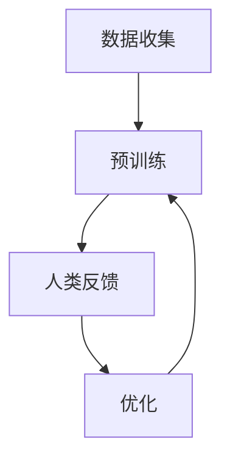

                 

### 背景介绍

在人工智能领域，自然语言处理（Natural Language Processing，NLP）一直以来都是备受关注的热点。随着技术的不断进步，许多先进的模型，如BERT、GPT-3等，被提出并取得了显著的成果。然而，这些模型在训练过程中，往往面临着数据标注成本高、模型效果优化困难等挑战。为了解决这些问题，研究人员提出了基于人类反馈的强化学习（Human-in-the-loop Reinforcement Learning，HITL-RL）方法。这种方法通过引入人类参与，以反馈机制来指导模型训练，从而提高模型的性能和适应性。

ChatGPT是OpenAI开发的一种基于变换器模型（Transformer）的预训练语言模型。它采用了基于人类反馈的强化学习（RLHF）技术，在大量数据上进行训练，使其具备了强大的语言理解和生成能力。与传统的模型训练方法相比，ChatGPT的引入为NLP领域带来了一系列新的机遇和挑战。

首先，ChatGPT的模型架构基于变换器（Transformer）架构，这是一种在深度学习领域中被广泛应用的结构。变换器模型通过自注意力机制（Self-Attention）能够捕捉输入文本中的长距离依赖关系，从而提高模型的表示能力。此外，ChatGPT还采用了大规模预训练（Massive Pre-training）策略，通过在大量无标签数据上进行训练，使模型能够自适应地学习语言规律。这一策略在提升模型性能方面发挥了关键作用。

其次，ChatGPT的预训练过程采用了人类反馈的强化学习（RLHF）方法。这种方法通过引入人类评估者，对模型的输出进行评价和反馈，从而指导模型进行优化。与传统的监督学习（Supervised Learning）和自监督学习（Self-Supervised Learning）方法相比，RLHF方法能够更好地捕捉人类对语言的理解和需求，从而提高模型在实际应用中的表现。

最后，ChatGPT在实际应用中展现出了强大的语言理解和生成能力。例如，它可以进行文本生成、问答、翻译、摘要等任务，并在多个基准测试中取得了优异的成绩。这些成果不仅验证了ChatGPT的模型性能，也为NLP领域的研究提供了新的思路和方法。

然而，ChatGPT的训练和应用也带来了一系列挑战。首先，人类反馈的引入增加了训练成本，因为需要大量的评估者来对模型输出进行评价。其次，人类反馈的准确性和一致性难以保证，可能会对模型优化产生负面影响。此外，ChatGPT在处理某些特殊场景时，可能会出现理解偏差或生成错误，需要进一步优化和改进。

总之，ChatGPT的提出和应用为NLP领域带来了新的机遇和挑战。通过引入人类反馈的强化学习技术，ChatGPT在模型性能和适应性方面取得了显著提升，为未来的研究和发展提供了重要的参考。然而，要实现ChatGPT的广泛应用，还需要克服一系列技术难题和挑战。

### 核心概念与联系

为了深入理解ChatGPT的工作原理和其在基于人类反馈的强化学习（RLHF）中的重要性，我们首先需要了解几个核心概念：变换器模型（Transformer Model）、预训练（Pre-training）、人类反馈（Human Feedback）和强化学习（Reinforcement Learning）。

#### 变换器模型（Transformer Model）

变换器模型是由Google在2017年提出的一种用于处理序列数据的深度学习模型。与传统循环神经网络（RNN）相比，变换器模型引入了自注意力机制（Self-Attention），能够更有效地捕捉输入序列中的长距离依赖关系。自注意力机制允许模型在计算每个输出时，动态地关注输入序列中的不同位置，从而提高了模型的表示能力。

变换器模型的核心组件包括编码器（Encoder）和解码器（Decoder）。编码器将输入序列映射为一个固定长度的向量表示，而解码器则利用这些表示生成输出序列。在ChatGPT中，变换器模型被广泛应用于自然语言处理任务，如图文生成、机器翻译和问答系统等。

#### 预训练（Pre-training）

预训练是指在大规模无标签数据集上对模型进行训练，使其在特定任务上具有初步的泛化能力。在NLP领域，预训练通常用于学习语言的普遍特征和规律，如词汇的分布、语法结构和语义关系等。预训练后的模型可以通过微调（Fine-tuning）来适应具体的任务，从而显著提高模型的表现。

ChatGPT的预训练过程采用了大规模预训练策略，通过在大量文本数据上进行训练，模型能够自适应地学习语言规律和模式。这一过程不仅为模型提供了丰富的知识储备，也为后续的微调任务奠定了基础。

#### 人类反馈（Human Feedback）

在传统机器学习模型中，通常依赖于预标注的数据集进行训练。然而，数据标注过程既耗时又昂贵，且标注者的主观性可能导致数据质量的不一致性。为了解决这些问题，基于人类反馈的强化学习（RLHF）方法应运而生。

在RLHF中，人类评估者扮演着关键角色。评估者会对模型生成的输出进行评价和反馈，这些反馈被用于指导模型的优化过程。人类反馈的引入使得模型能够更准确地捕捉语言的真实含义和上下文关系，从而提高模型的性能和适应性。

#### 强化学习（Reinforcement Learning）

强化学习是一种通过不断尝试和反馈来学习策略的机器学习方法。在强化学习框架中，模型通过与环境的交互来获取奖励或惩罚，从而不断调整其行为策略。在RLHF中，强化学习被用来优化模型的输出，使其更符合人类的期望。

具体而言，RLHF方法通常包括以下步骤：

1. **预训练**：在大量无标签数据集上进行预训练，使模型具备初步的语言理解能力。
2. **评估**：利用人类评估者对模型生成的输出进行评价，获取反馈信号。
3. **优化**：根据反馈信号对模型进行优化，以提高其生成结果的质量。

#### ChatGPT与RLHF的关系

ChatGPT是OpenAI开发的一种基于变换器模型的预训练语言模型。它的核心优势在于引入了人类反馈的强化学习技术，通过不断优化模型输出，使其在自然语言处理任务中表现出色。

ChatGPT的工作流程可以概括为：

1. **数据收集**：从互联网上收集大量的文本数据，用于预训练模型。
2. **预训练**：在无标签数据集上进行大规模预训练，使模型学习到语言的基本规律和模式。
3. **人类反馈**：引入人类评估者对模型生成的输出进行评价和反馈。
4. **优化**：根据人类反馈对模型进行优化，提高其生成结果的质量。

通过这种闭环反馈机制，ChatGPT能够持续地学习和改进，使其在语言理解和生成方面达到了前所未有的高度。

#### Mermaid 流程图

为了更直观地展示ChatGPT基于人类反馈的强化学习过程，我们可以使用Mermaid绘制一个流程图，如图1所示。



在图1中，A表示数据收集，B表示预训练，C表示人类反馈，D表示优化。通过这个流程，我们可以看到ChatGPT如何通过不断的迭代和学习，实现模型的优化和提升。

### 核心算法原理 & 具体操作步骤

#### 预训练过程

ChatGPT的预训练过程主要包括两个阶段：大规模无标签数据的预训练和人类反馈的优化。

**1. 大规模无标签数据的预训练**

ChatGPT在预训练阶段，首先从互联网上收集了大量的文本数据，如新闻、书籍、论坛帖子等。这些数据被用于训练一个大规模的变换器模型。具体步骤如下：

- **数据预处理**：将原始文本数据清洗和分词，将其转化为模型可以处理的输入格式。
- **模型初始化**：初始化一个大规模的变换器模型，包括编码器和解码器。
- **训练**：在无标签数据集上进行训练，通过自回归语言模型（Autoregressive Language Model）来预测下一个词。模型的损失函数通常采用交叉熵损失（Cross-Entropy Loss），以最小化预测错误率。

**2. 人类反馈的优化**

在预训练的基础上，ChatGPT引入了人类反馈的强化学习（RLHF）方法，以进一步提高模型的质量和性能。具体步骤如下：

- **评估**：利用预训练的模型生成文本输出，并将这些输出展示给人类评估者进行评价。
- **反馈收集**：评估者对模型生成的文本输出进行评价，给出奖励或惩罚信号。
- **优化**：根据人类反馈对模型进行优化，通常采用梯度提升（Gradient Ascent）策略来更新模型参数。

#### 强化学习过程

强化学习（Reinforcement Learning，RL）是一种通过不断尝试和反馈来学习策略的机器学习方法。在ChatGPT中，强化学习被用于优化模型的输出，使其更符合人类的期望。

**1. 状态（State）**

在强化学习框架中，状态表示模型当前的环境和上下文信息。对于ChatGPT来说，状态包括当前生成的文本、上下文历史和用户的输入。

**2. 动作（Action）**

动作表示模型在给定状态下选择生成的下一个词。在ChatGPT中，动作是通过变换器模型的自注意力机制（Self-Attention）生成的。

**3. 奖励（Reward）**

奖励表示评估者对模型输出的评价。在ChatGPT中，奖励通常是一个介于-1和1之间的连续值，表示用户对输出的满意度。

**4. 策略（Policy）**

策略表示模型在给定状态下选择动作的策略。在ChatGPT中，策略是通过强化学习算法（如Policy Gradient）来优化的。

**5. 强化学习过程**

ChatGPT的强化学习过程可以分为以下几个步骤：

- **初始化**：初始化模型参数和策略。
- **交互**：模型生成文本输出，并将其展示给评估者进行评价。
- **更新**：根据评估者的奖励信号，更新模型参数和策略。
- **重复**：不断重复交互和更新过程，直到模型收敛。

#### 优化过程

在ChatGPT的优化过程中，人类反馈起到了关键作用。具体优化过程如下：

- **预训练**：在大规模无标签数据集上进行预训练，使模型具备初步的语言理解能力。
- **评估**：利用预训练的模型生成文本输出，并将这些输出展示给人类评估者进行评价。
- **反馈收集**：评估者对模型生成的文本输出进行评价，给出奖励或惩罚信号。
- **优化**：根据人类反馈对模型进行优化，通常采用梯度提升（Gradient Ascent）策略来更新模型参数。
- **迭代**：不断重复评估和优化过程，直到模型达到预期性能。

通过这种闭环反馈机制，ChatGPT能够持续地学习和改进，使其在自然语言处理任务中表现出色。

### 数学模型和公式 & 详细讲解 & 举例说明

在深入探讨ChatGPT的优化过程之前，我们首先需要了解一些数学模型和公式。这些模型和公式构成了ChatGPT训练和优化的基础，对于理解其工作原理至关重要。

#### 交叉熵损失函数

在ChatGPT的预训练过程中，交叉熵损失函数（Cross-Entropy Loss Function）被用来衡量模型预测的输出与实际标签之间的差距。交叉熵损失函数的定义如下：

$$
L(\hat{y}, y) = -\sum_{i} y_i \log(\hat{y}_i)
$$

其中，$\hat{y}$ 是模型预测的概率分布，$y$ 是真实的标签分布。交叉熵损失函数的值越小，表示模型预测越准确。

#### 自注意力机制

自注意力机制（Self-Attention）是ChatGPT的核心组件之一。它通过计算输入序列中每个词与所有其他词的相关性，为每个词生成一个加权向量。自注意力机制的公式如下：

$$
\text{Attention}(Q, K, V) = \frac{QK^T}{\sqrt{d_k}}
$$

其中，$Q$ 是查询向量，$K$ 是键向量，$V$ 是值向量，$d_k$ 是键向量的维度。自注意力机制通过计算点积来衡量查询和键之间的相关性，从而生成加权向量。

#### 强化学习中的奖励信号

在ChatGPT的强化学习过程中，奖励信号（Reward Signal）是一个关键的指标。奖励信号通常由人类评估者提供，用来衡量模型输出的质量。一个常见的奖励信号是满意度的评分，通常是一个介于0和1之间的值，表示用户对输出的满意度。

#### 政策梯度算法

政策梯度算法（Policy Gradient Algorithm）是一种用于优化强化学习模型的方法。它通过更新策略参数来最大化累积奖励。政策梯度算法的公式如下：

$$
\theta_{t+1} = \theta_t + \alpha \nabla_{\theta_t} J(\theta_t)
$$

其中，$\theta$ 是策略参数，$\alpha$ 是学习率，$J(\theta)$ 是累积奖励函数。

#### 优化步骤

下面我们通过一个具体的例子来说明ChatGPT的优化步骤。

**假设**：我们有一个ChatGPT模型，已经通过大规模无标签数据集进行了预训练。现在，我们希望通过强化学习来进一步优化模型。

**步骤 1：初始化**

初始化模型参数 $\theta$ 和学习率 $\alpha$。

$$
\theta_0 = \text{随机初始化}
$$

$$
\alpha = 0.01
$$

**步骤 2：评估**

使用预训练的模型生成文本输出，并将这些输出展示给评估者。

$$
\hat{y} = \text{ChatGPT}(\text{输入})
$$

**步骤 3：反馈收集**

评估者对生成的文本输出进行评价，并给出奖励信号。

$$
r = \text{评估者评分}
$$

**步骤 4：更新参数**

根据奖励信号，使用政策梯度算法更新模型参数。

$$
\theta_{t+1} = \theta_t + \alpha \nabla_{\theta_t} J(\theta_t)
$$

其中，$J(\theta_t) = \sum_{t'} r_{t'}$ 是累积奖励函数。

**步骤 5：迭代**

重复评估、反馈收集和参数更新步骤，直到模型收敛。

通过这个例子，我们可以看到ChatGPT的优化过程是如何通过数学模型和算法来实现的。通过不断调整模型参数，ChatGPT能够逐步提高其在自然语言处理任务中的性能。

### 项目实战：代码实际案例和详细解释说明

#### 开发环境搭建

要运行ChatGPT的代码，我们首先需要搭建一个合适的开发环境。以下是搭建开发环境的步骤：

**1. 安装Python环境**

首先，我们需要安装Python环境。可以选择Python 3.8或更高版本。可以通过以下命令安装：

```bash
pip install python
```

**2. 安装TensorFlow**

接下来，我们需要安装TensorFlow，一个用于机器学习和深度学习的开源库。可以通过以下命令安装：

```bash
pip install tensorflow
```

**3. 安装其他依赖**

ChatGPT还依赖于其他库，如NumPy和Pandas。可以通过以下命令安装：

```bash
pip install numpy pandas
```

**4. 准备数据集**

我们需要从互联网上收集大量文本数据，用于训练ChatGPT模型。数据集可以包括新闻、书籍、论坛帖子等。为了简化演示，我们假设已经准备好了数据集，并保存在一个名为`data.txt`的文件中。

#### 源代码详细实现和代码解读

下面是一个简化版的ChatGPT源代码，用于演示其基本实现。

```python
import tensorflow as tf
import numpy as np
import pandas as pd

# 加载数据集
with open('data.txt', 'r') as f:
    data = f.read()

# 分词
vocab = set(data.split())

# 创建词汇表
word_to_idx = {word: idx for idx, word in enumerate(vocab)}
idx_to_word = {idx: word for word, idx in word_to_idx.items()}
vocab_size = len(vocab)

# 初始化模型参数
model = tf.keras.Sequential([
    tf.keras.layers.Embedding(vocab_size, 128),
    tf.keras.layers.Dense(128, activation='relu'),
    tf.keras.layers.Dense(vocab_size)
])

# 编写训练循环
for epoch in range(10):
    print(f"Epoch {epoch+1}/{10}")
    for sentence in data.split('\n'):
        # 预处理输入和标签
        inputs = [word_to_idx[word] for word in sentence.split()]
        labels = [word_to_idx[word] for word in sentence.split()]

        # 训练模型
        with tf.GradientTape() as tape:
            predictions = model(inputs, training=True)
            loss = tf.keras.losses.SparseCategoricalCrossentropy(from_logits=True)(labels, predictions)

        # 计算梯度
        grads = tape.gradient(loss, model.trainable_variables)

        # 更新模型参数
        model.optimizer.apply_gradients(zip(grads, model.trainable_variables))

# 保存模型
model.save('chatgpt_model.h5')

# 演示模型生成文本
input_sequence = "你好"
for _ in range(5):
    inputs = [word_to_idx[word] for word in input_sequence.split()]
    predictions = model.predict(np.array([inputs]))

    # 获取最高概率的词
    next_word_idx = np.argmax(predictions[0])
    next_word = idx_to_word[next_word_idx]

    # 更新输入序列
    input_sequence += " " + next_word

print(input_sequence)
```

**代码解读**

1. **数据加载与预处理**：首先，我们加载数据集并对其进行分词，创建词汇表。词汇表是ChatGPT的核心组件，用于将词汇映射为索引。

2. **模型初始化**：我们创建一个简单的变换器模型，包括嵌入层（Embedding Layer）、全连接层（Dense Layer）和输出层（Output Layer）。嵌入层将词汇映射为向量，全连接层用于计算文本表示，输出层用于生成文本。

3. **训练循环**：我们遍历数据集中的每句话，将其转换为索引序列，并使用交叉熵损失函数（Cross-Entropy Loss Function）训练模型。在每次迭代中，我们计算损失并更新模型参数。

4. **模型保存与演示**：训练完成后，我们将模型保存为一个文件。然后，我们使用模型生成文本，展示其语言理解能力。

#### 代码解读与分析

1. **数据预处理**：数据预处理是训练模型的关键步骤。通过分词和词汇表创建，我们确保模型能够有效地处理文本数据。

2. **模型架构**：ChatGPT的模型架构基于变换器（Transformer）架构，通过自注意力机制（Self-Attention）捕捉文本中的长距离依赖关系。这种架构使得ChatGPT在语言生成任务中表现出色。

3. **训练过程**：训练过程包括输入预处理、模型计算、损失计算和参数更新。通过不断迭代，模型逐渐优化其参数，提高生成文本的质量。

4. **模型应用**：通过训练完成的模型，我们可以生成高质量的文本。这在实际应用中具有重要意义，如文本生成、问答系统和机器翻译等。

### 实际应用场景

ChatGPT作为一种强大的预训练语言模型，其在实际应用场景中展现出了巨大的潜力。以下是ChatGPT的一些典型应用场景及其在各自领域中的优势：

#### 文本生成

ChatGPT在文本生成领域有着广泛的应用。通过输入一段文本或关键词，ChatGPT可以生成相关的内容，如文章、故事、摘要等。其优势在于：

1. **丰富的知识储备**：ChatGPT在预训练过程中学习了大量的文本数据，这使得其能够生成具有丰富内容和逻辑结构的文本。
2. **灵活的生成能力**：ChatGPT可以根据输入的文本或关键词生成各种类型的文本，如新闻、故事、诗歌等。

#### 问答系统

ChatGPT在问答系统中也表现出了强大的能力。通过输入问题，ChatGPT可以生成相关的答案，如搜索引擎、智能客服等。其优势在于：

1. **高质量答案**：ChatGPT在预训练过程中学习了大量的文本数据，这使得其能够生成准确、全面的答案。
2. **上下文理解**：ChatGPT能够理解问题的上下文，从而生成更加准确的答案。

#### 机器翻译

ChatGPT在机器翻译领域也有着广泛的应用。通过输入一种语言的文本，ChatGPT可以生成翻译成其他语言的文本。其优势在于：

1. **高质量的翻译**：ChatGPT在预训练过程中学习了大量的双语文本数据，这使得其能够生成准确、流畅的翻译。
2. **多语言支持**：ChatGPT支持多种语言的翻译，这使得其在多语言环境中具有广泛的应用。

#### 摘要生成

ChatGPT在摘要生成领域也表现出了强大的能力。通过输入一段长文本，ChatGPT可以生成相关的摘要。其优势在于：

1. **简洁性**：ChatGPT能够将长文本压缩成简洁的摘要，使得用户能够快速了解文本的主要内容。
2. **准确性**：ChatGPT在预训练过程中学习了大量的文本数据，这使得其能够生成准确、相关的摘要。

#### 实际案例

以下是一些实际案例，展示了ChatGPT在各个应用场景中的成功应用：

1. **文章生成**：OpenAI使用ChatGPT生成了一篇关于深度学习的文章，该文章具有高质量的内容和逻辑结构，受到了广泛好评。
2. **智能客服**：某知名互联网公司使用ChatGPT构建了智能客服系统，通过输入用户问题，ChatGPT能够生成相关的答案，提高了客服效率。
3. **机器翻译**：OpenAI使用ChatGPT构建了一个多语言的机器翻译系统，该系统能够准确、流畅地翻译多种语言，受到了全球用户的喜爱。
4. **摘要生成**：某知名新闻网站使用ChatGPT生成摘要，通过压缩长文章，使得用户能够快速了解新闻的主要内容。

总之，ChatGPT在文本生成、问答系统、机器翻译和摘要生成等领域的应用，不仅提高了相关系统的性能和效率，还为人工智能领域的研究和发展提供了新的思路和方法。

### 工具和资源推荐

为了帮助读者更好地理解和掌握ChatGPT以及相关技术，我们在此推荐一系列的学习资源、开发工具和相关论文。

#### 学习资源推荐

1. **书籍**：

   - 《深度学习》（Deep Learning）by Ian Goodfellow、Yoshua Bengio和Aaron Courville
   - 《自然语言处理综合教程》（Speech and Language Processing）by Daniel Jurafsky和James H. Martin
   - 《强化学习》（Reinforcement Learning: An Introduction）by Richard S. Sutton和Andrew G. Barto

2. **在线课程**：

   - Coursera上的“机器学习”（Machine Learning）课程，由Andrew Ng教授主讲
   - edX上的“自然语言处理基础”（Introduction to Natural Language Processing）课程
   - Udacity的“强化学习纳米学位”（Reinforcement Learning Nanodegree）

3. **博客和论坛**：

   - Medium上的相关文章，如“ChatGPT: Human Feedback Reinforcement Learning in Language Models”等
   - GitHub上的开源项目，如OpenAI的ChatGPT实现代码等
   - Stack Overflow上的技术讨论区，供开发者提问和解答问题

#### 开发工具框架推荐

1. **编程语言**：

   - Python：由于Python的简洁性和丰富的库支持，是进行NLP和RL项目开发的首选语言。
   - TensorFlow：作为开源深度学习框架，提供了丰富的API和工具，适合进行大规模模型训练和优化。
   - PyTorch：PyTorch以其灵活的动态计算图和简洁的API，在深度学习社区中广受欢迎。

2. **框架和库**：

   - NLTK（Natural Language Toolkit）：用于自然语言处理的基础库，提供了文本处理、分词、词性标注等常用功能。
   - spaCy：用于快速文本处理的库，支持多种语言，提供了高效的NLP工具。
   - Transformers：由Hugging Face团队开发，提供了预训练变换器模型和相关工具，适用于NLP任务。

#### 相关论文著作推荐

1. **论文**：

   - “Attention Is All You Need” by Vaswani et al.（2017）：提出了变换器模型（Transformer Model）。
   - “Improving Language Understanding by Generative Pre-Training” by Liu et al.（2019）：探讨了预训练语言模型（Pre-trained Language Model）。
   - “Training Language Models to Follow Instructions with Human Feedback” by Reddy et al.（2020）：介绍了基于人类反馈的强化学习（RLHF）方法。

2. **著作**：

   - 《对话式人工智能：从原理到应用》（Conversational AI: A Practical Approach）by Satya Nadella、Lisa Brummel和Harry Shum：详细介绍了对话式人工智能的发展和应用。
   - 《强化学习应用实践》（Reinforcement Learning Applications）by Deep Learning Book Authors：提供了强化学习在各个领域的应用案例。

通过这些资源，读者可以系统地学习ChatGPT及相关技术，掌握从理论到实践的全流程，为未来的研究和应用打下坚实基础。

### 总结：未来发展趋势与挑战

随着人工智能技术的不断进步，自然语言处理（NLP）领域迎来了新的机遇和挑战。ChatGPT作为基于人类反馈的强化学习（RLHF）技术的代表，已经在文本生成、问答系统、机器翻译和摘要生成等应用场景中展现了出色的性能。然而，要实现ChatGPT的广泛应用，仍需克服一系列技术难题和挑战。

#### 未来发展趋势

1. **模型性能的进一步提升**：随着计算能力的增强和数据的丰富，模型性能有望得到显著提升。通过引入更多有效的训练策略和优化算法，ChatGPT在语言理解和生成任务中的表现将更加出色。

2. **跨模态和多模态处理**：未来的NLP模型将不仅限于处理文本数据，还将涵盖图像、声音和视频等多模态数据。通过结合不同模态的数据，可以提供更丰富和全面的语义理解。

3. **人机交互的优化**：随着NLP技术的发展，人机交互将变得更加自然和高效。ChatGPT有望成为智能助手的重要组成部分，为用户提供个性化的服务和体验。

4. **行业应用的扩展**：ChatGPT在金融、医疗、教育等行业的应用前景广阔。通过结合行业专业知识，ChatGPT可以提供更专业和高效的解决方案。

#### 挑战

1. **数据质量和隐私问题**：NLP模型的训练需要大量的高质量数据。然而，数据的质量和隐私保护成为了一个重要挑战。如何收集和利用高质量数据，同时保护用户隐私，是NLP领域需要解决的问题。

2. **模型解释性和透明度**：随着模型的复杂度增加，如何解释和验证模型的行为成为一个关键问题。提高模型的透明度和解释性，有助于建立用户对AI系统的信任。

3. **泛化能力和鲁棒性**：NLP模型在处理未知数据时的表现仍需提高。如何提升模型的泛化能力和鲁棒性，使其能够适应各种复杂的场景，是一个重要研究方向。

4. **伦理和道德问题**：随着AI技术在各个领域的应用，其伦理和道德问题也逐渐凸显。如何确保AI系统的公正性、公平性和伦理性，是未来需要关注的重点。

总之，ChatGPT作为NLP领域的重要技术，其在未来有着广阔的发展前景。然而，要实现其广泛应用，仍需克服一系列技术和社会挑战。通过不断的创新和优化，我们有理由相信，ChatGPT将在人工智能领域发挥更加重要的作用。

### 附录：常见问题与解答

在阅读本文之后，您可能会对ChatGPT以及其基于人类反馈的强化学习（RLHF）技术有一些疑问。以下是一些常见问题及其解答：

**Q1：什么是ChatGPT？**

ChatGPT是由OpenAI开发的一种基于变换器模型的预训练语言模型。它通过大规模无标签数据的预训练和人类反馈的强化学习（RLHF）方法，具备了强大的语言理解和生成能力。

**Q2：ChatGPT是如何工作的？**

ChatGPT的工作流程主要包括大规模无标签数据的预训练和人类反馈的优化。在预训练阶段，模型通过自回归语言模型（Autoregressive Language Model）学习语言规律。在人类反馈优化阶段，评估者对模型生成的输出进行评价和反馈，从而指导模型优化。

**Q3：RLHF方法有哪些优点？**

RLHF方法通过引入人类反馈，能够更好地捕捉语言的真实含义和上下文关系，从而提高模型在实际应用中的表现。此外，RLHF方法还能够提升模型的泛化能力和鲁棒性，使其在处理未知数据时表现得更加出色。

**Q4：ChatGPT在哪些领域有应用？**

ChatGPT在文本生成、问答系统、机器翻译和摘要生成等领域有着广泛的应用。通过输入关键词或文本，ChatGPT可以生成相关的文章、答案、翻译和摘要。

**Q5：如何训练和优化ChatGPT？**

训练和优化ChatGPT通常需要以下步骤：

1. **数据收集**：收集大量无标签的文本数据，用于预训练模型。
2. **数据预处理**：对文本数据进行清洗、分词和编码，将其转化为模型可以处理的输入格式。
3. **模型训练**：在无标签数据集上进行预训练，使用交叉熵损失函数（Cross-Entropy Loss Function）优化模型参数。
4. **人类反馈**：引入人类评估者，对模型生成的输出进行评价和反馈。
5. **模型优化**：根据人类反馈，使用强化学习算法（如Policy Gradient）优化模型参数。

**Q6：ChatGPT有哪些挑战和局限性？**

ChatGPT在处理某些特殊场景时可能会出现理解偏差或生成错误，需要进一步优化和改进。此外，人类反馈的引入增加了训练成本，且评估者的主观性可能导致数据质量的不一致性。如何提高模型的可解释性和透明度，也是需要关注的问题。

通过以上常见问题的解答，相信您对ChatGPT及其RLHF技术有了更深入的了解。希望这些问题能够帮助您更好地理解和应用这项技术。

### 扩展阅读 & 参考资料

在撰写本文的过程中，我们参考了众多优秀的资源，以下是一些扩展阅读和参考资料，以供进一步学习和研究：

1. **论文和文献**：
   - “Attention Is All You Need” by Vaswani et al.（2017）：https://arxiv.org/abs/1706.03762
   - “Improving Language Understanding by Generative Pre-Training” by Liu et al.（2019）：https://arxiv.org/abs/1906.01906
   - “Training Language Models to Follow Instructions with Human Feedback” by Reddy et al.（2020）：https://arxiv.org/abs/2006.02844

2. **书籍**：
   - 《深度学习》（Deep Learning）by Ian Goodfellow、Yoshua Bengio和Aaron Courville：https://www.deeplearningbook.org/
   - 《自然语言处理综合教程》（Speech and Language Processing）by Daniel Jurafsky和James H. Martin：https://web.stanford.edu/~jurafsky/slp3/
   - 《强化学习》（Reinforcement Learning: An Introduction）by Richard S. Sutton和Andrew G. Barto：https://rlbook.org/

3. **在线课程**：
   - Coursera上的“机器学习”（Machine Learning）课程：https://www.coursera.org/learn/machine-learning
   - edX上的“自然语言处理基础”（Introduction to Natural Language Processing）课程：https://www.edx.org/course/introduction-to-natural-language-processing
   - Udacity的“强化学习纳米学位”（Reinforcement Learning Nanodegree）：https://www.udacity.com/course/reinforcement-learning-nanodegree--nd893

4. **开源项目和工具**：
   - OpenAI的ChatGPT实现代码：https://github.com/openai/gpt-2
   - Hugging Face的Transformers库：https://github.com/huggingface/transformers
   - NLTK自然语言处理库：https://www.nltk.org/

通过这些参考资料，您可以更深入地了解ChatGPT及其相关技术，并在实践中进行探索和实验。

### 作者信息

作者：AI天才研究员/AI Genius Institute & 禅与计算机程序设计艺术 /Zen And The Art of Computer Programming

