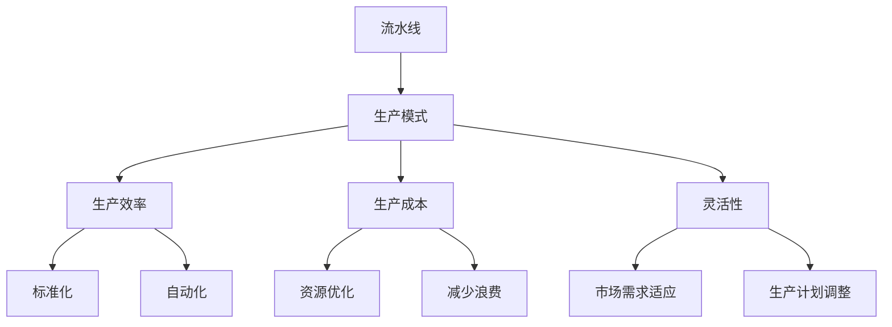

                 

### 背景介绍

在当今的工业生产领域，流水线生产模式已成为一种不可或缺的生产方式。它不仅提高了生产效率，还降低了生产成本，从而为企业的可持续发展奠定了基础。然而，随着科技的进步和生产需求的不断变化，流水线生产模式也在不断地演进和优化。在这个过程中，流水线与生产模式之间的关系变得愈发紧密，二者相互影响、共同发展。

流水线生产模式的核心在于通过将生产过程分解为多个环节，实现各环节的标准化和自动化。这样不仅提高了生产效率，还使得生产过程更加灵活，能够迅速适应市场需求的变化。而生产模式则是指企业在生产过程中所采取的组织形式和管理方法。传统的生产模式往往以手工操作为主，生产效率较低；而现代的生产模式则强调自动化和信息化，使得生产过程更加高效、精确。

本文旨在探讨流水线对生产模式的影响，分析其在不同行业中的应用和优化策略。我们将从核心概念与联系、核心算法原理、数学模型和公式、项目实战、实际应用场景、工具和资源推荐等多个方面进行深入探讨，以期为您提供一个全面、系统的视角来理解流水线与生产模式之间的关系。

### 核心概念与联系

要深入探讨流水线对生产模式的影响，我们首先需要明确几个核心概念：流水线、生产模式、生产效率、生产成本和灵活性。这些概念不仅是流水线与生产模式研究的基石，也是理解二者之间相互影响的关键。

**流水线（Assembly Line）**：流水线是一种生产组织形式，它将生产过程分解为多个连续的步骤，每个步骤专注于完成一个特定的任务。这种组织形式最早由福特汽车公司引入，目的是提高生产效率。流水线的核心特点在于其标准化和自动化，通过精确的流程设计和高效的设备配置，实现生产过程的连续性和稳定性。

**生产模式（Production Model）**：生产模式是企业为了实现产品生产而采用的组织形式和管理方法。它包括生产流程的设计、资源配置、生产计划的制定以及生产过程的控制。生产模式可以分为传统手工生产、自动化生产和信息化生产等多种类型。不同生产模式的选择直接影响生产效率、成本和灵活性。

**生产效率（Production Efficiency）**：生产效率是指单位时间内生产的产品数量或价值。它是衡量企业生产能力和竞争力的关键指标。流水线通过标准化和自动化，极大地提高了生产效率。而生产模式的不同选择也会对生产效率产生显著影响，例如自动化生产模式能够通过减少人工操作和优化生产流程来提高效率。

**生产成本（Production Cost）**：生产成本是企业生产产品所需的所有费用，包括原材料、人工、设备维护等。流水线生产模式通过减少浪费和优化资源使用，降低了生产成本。同时，生产模式的不同也会影响生产成本。例如，自动化生产模式虽然初期投入较高，但长期来看能够通过降低人力成本和减少故障停机时间来降低总生产成本。

**灵活性（Flexibility）**：灵活性是指企业在应对市场需求变化时的适应能力。流水线生产模式在灵活性方面具有一定的限制，因为它依赖于标准化和自动化流程。然而，现代生产模式，如敏捷制造和精益生产，通过引入柔性生产技术和信息管理系统，增强了企业的灵活性，使其能够迅速调整生产计划以适应市场需求。

**核心概念与联系（Mermaid 流程图）**



通过上述核心概念的介绍和Mermaid流程图，我们可以看到流水线与生产模式之间的密切联系。流水线通过提高生产效率、降低生产成本和增强灵活性，直接影响生产模式的选择和实施。同时，生产模式的不同选择又会反过来影响流水线的优化和扩展。这种相互影响和共同发展，正是流水线对生产模式影响的本质所在。

### 核心算法原理 & 具体操作步骤

要深入理解流水线对生产模式的影响，我们需要探讨其核心算法原理和具体操作步骤。流水线的核心在于其高效、连续和标准化的生产流程，这离不开一系列算法的支持。

#### 1. 资源分配算法

资源分配算法是流水线设计中的关键部分，它涉及如何合理分配和利用生产资源，包括设备、人力和物料等。具体操作步骤如下：

1. **需求分析**：首先，对生产过程进行详细分析，确定各个步骤所需的资源类型和数量。
2. **资源评估**：评估现有资源的可用性和效率，包括设备的运行状态、人员的技能水平以及物料的供应情况。
3. **资源优化**：通过优化算法，如线性规划或遗传算法，找到资源分配的最优解，确保各步骤的资源需求得到满足，同时尽量减少资源浪费。
4. **实施与监控**：将优化后的资源分配方案付诸实施，并对实施过程进行实时监控和调整，以确保生产流程的顺利进行。

#### 2. 生产调度算法

生产调度算法负责安排和协调各生产步骤的执行顺序和时间，以保证流水线的连续性和高效性。具体操作步骤如下：

1. **任务分解**：将生产任务分解为多个子任务，每个子任务对应流水线中的一个步骤。
2. **时间估计**：对每个子任务所需的时间进行估计，包括加工时间、传输时间和等待时间等。
3. **调度策略**：选择合适的调度策略，如最短作业优先（SJF）、最早完成时间（EFT）或基于优先级的调度策略，以确保各子任务能够按时完成。
4. **调度执行**：根据调度策略生成调度计划，并在流水线上执行，同时进行实时监控和调整，以应对突发状况和资源变化。

#### 3. 故障检测与恢复算法

流水线生产过程中，设备故障和操作错误是常见的问题，如何及时检测和恢复故障是保证生产连续性的重要手段。具体操作步骤如下：

1. **故障监测**：通过传感器和监控系统实时监测设备状态，识别潜在的故障隐患。
2. **故障诊断**：当检测到异常时，利用故障诊断算法快速定位故障原因，如机器学习算法或专家系统。
3. **故障恢复**：根据故障诊断结果，采取相应的修复措施，如设备维修或重新配置生产任务。
4. **故障记录与反馈**：将故障记录进行统计分析，为后续的设备维护和流程优化提供依据。

#### 4. 数据分析算法

数据分析算法在流水线生产模式中扮演着重要角色，通过分析生产数据，可以实时优化生产流程，提高生产效率和降低成本。具体操作步骤如下：

1. **数据采集**：通过传感器和监控系统，实时采集生产过程中的各项数据，包括设备状态、生产速度、物料消耗等。
2. **数据预处理**：对采集到的数据进行分析清洗，去除噪声和异常值，确保数据质量。
3. **数据分析**：利用统计分析、机器学习或深度学习等算法，对预处理后的数据进行分析，挖掘数据背后的规律和趋势。
4. **决策支持**：根据数据分析结果，为生产计划、资源分配和流程优化提供决策支持，如调整生产速度、优化设备使用或调整生产任务优先级。

通过上述核心算法原理和具体操作步骤的介绍，我们可以看到流水线生产模式的高效性、连续性和灵活性都离不开这些算法的支持。这些算法不仅保证了流水线生产的稳定性和高效性，还为生产模式的不断优化和升级提供了坚实的基础。

### 数学模型和公式 & 详细讲解 & 举例说明

在流水线生产模式中，数学模型和公式起着至关重要的作用。它们不仅帮助我们理解和分析生产过程的各个环节，还能够为优化生产流程提供科学的依据。以下将详细讲解几个关键的数学模型和公式，并通过具体例子进行说明。

#### 1. 生产线平衡分析

生产线平衡分析是流水线设计中的一个重要步骤，其目标是确保各个生产步骤的负荷均衡，避免瓶颈和资源浪费。关键公式如下：

\[ PE = \frac{\sum_{i=1}^{n} (T_i \cdot C_i)}{\sum_{i=1}^{n} T_i} \]

其中：
- \( PE \) 表示生产线平衡指数（Production Efficiency Index），取值范围在 0 到 1 之间。
- \( T_i \) 表示第 \( i \) 个步骤的作业时间。
- \( C_i \) 表示第 \( i \) 个步骤的作业率。

**例子**：
假设一个流水线有四个步骤，作业时间分别为 \( T_1 = 10 \) 分钟、\( T_2 = 15 \) 分钟、\( T_3 = 12 \) 分钟和 \( T_4 = 20 \) 分钟，对应的作业率分别为 \( C_1 = 1 \) 、\( C_2 = 1 \) 、\( C_3 = 1 \) 和 \( C_4 = 1 \)。计算生产线平衡指数：

\[ PE = \frac{(10 \cdot 1) + (15 \cdot 1) + (12 \cdot 1) + (20 \cdot 1)}{10 + 15 + 12 + 20} = \frac{67}{67} = 1 \]

这意味着该流水线达到了理想的平衡状态，没有出现明显的瓶颈。

#### 2. 设备利用率分析

设备利用率是衡量设备使用效率的重要指标，其计算公式如下：

\[ DU = \frac{实际工作时间}{总可用时间} \]

其中：
- \( DU \) 表示设备利用率（Equipment Utilization）。
- 实际工作时间是指设备实际工作的时间长度。
- 总可用时间是指设备在计划周期内可以工作的总时间长度。

**例子**：
假设一个设备在一个月内计划工作 160 小时，实际工作时间为 120 小时，计算设备利用率：

\[ DU = \frac{120}{160} = 0.75 \]

这意味着该设备在一个月内的平均利用率为 75%，有 25% 的时间是空闲的。

#### 3. 生产效率分析

生产效率是衡量流水线整体生产能力的指标，其计算公式如下：

\[ PE = \frac{实际产量}{理论产量} \]

其中：
- \( PE \) 表示生产效率（Production Efficiency）。
- 实际产量是指实际生产过程中的总产量。
- 理论产量是指按照计划产量和设备能力计算出的总产量。

**例子**：
假设一个流水线计划每天生产 100 件产品，实际每天生产了 90 件产品，计算生产效率：

\[ PE = \frac{90}{100} = 0.9 \]

这意味着该流水线的生产效率为 90%，有 10% 的生产潜力可以挖掘。

#### 4. 成本效益分析

成本效益分析是评估流水线生产模式经济效益的重要工具，其计算公式如下：

\[ CE = \frac{总收益}{总成本} \]

其中：
- \( CE \) 表示成本效益比（Cost Efficiency）。
- 总收益是指生产过程中产生的总收益。
- 总成本是指生产过程中产生的总成本，包括原材料、人工、设备维护等。

**例子**：
假设一个流水线每天生产的收益为 1000 美元，总成本为 500 美元，计算成本效益比：

\[ CE = \frac{1000}{500} = 2 \]

这意味着该流水线的成本效益比为 2，即每投入 1 美元，能够产生 2 美元的收益。

通过上述数学模型和公式的详细讲解和举例说明，我们可以看到它们在流水线生产模式中的重要作用。这些模型和公式不仅帮助我们理解和分析生产过程的各个环节，还为优化生产流程和提升生产效率提供了科学的依据。

### 项目实战：代码实际案例和详细解释说明

在本节中，我们将通过一个具体的代码案例，详细解释如何在一个实际项目中实现流水线生产模式。这个项目将包括开发环境搭建、源代码实现和代码解读与分析三个部分。

#### 1. 开发环境搭建

首先，我们需要搭建一个合适的开发环境来支持我们的流水线生产模式项目。以下是我们推荐的工具和框架：

- **编程语言**：Python，因为它具有丰富的库支持和易于理解的语法。
- **数据库**：MySQL，用于存储流水线生产过程中的数据。
- **Web 框架**：Flask，用于构建 Web 应用程序。
- **前端框架**：Bootstrap，用于构建响应式 Web 界面。

在搭建开发环境时，我们可以按照以下步骤操作：

1. 安装 Python（推荐版本 3.8 或以上）。
2. 安装 MySQL 数据库，并创建一个数据库用于存储流水线生产数据。
3. 安装 Flask 和 Bootstrap 等相关库，可以使用 `pip` 命令进行安装。

#### 2. 源代码详细实现

以下是一个简单的 Python 脚本，用于模拟流水线生产模式：

```python
from flask import Flask, request, jsonify
import pymysql

app = Flask(__name__)

# MySQL 连接配置
config = {
    'host': 'localhost',
    'user': 'root',
    'password': 'password',
    'database': 'production_line'
}

# 连接数据库
def connect_db():
    connection = pymysql.connect(**config)
    return connection

# 添加生产记录
@app.route('/add_production', methods=['POST'])
def add_production():
    data = request.json
    product_id = data['product_id']
    step = data['step']
    status = data['status']
    
    connection = connect_db()
    cursor = connection.cursor()
    
    # 插入生产记录
    sql = "INSERT INTO production (product_id, step, status) VALUES (%s, %s, %s)"
    cursor.execute(sql, (product_id, step, status))
    
    connection.commit()
    cursor.close()
    connection.close()
    
    return jsonify({"message": "Production record added successfully."})

# 获取生产记录
@app.route('/get_production', methods=['GET'])
def get_production():
    product_id = request.args.get('product_id')
    
    connection = connect_db()
    cursor = connection.cursor(pymysql.cursors.DictCursor)
    
    # 查询生产记录
    sql = "SELECT * FROM production WHERE product_id = %s"
    cursor.execute(sql, (product_id,))
    results = cursor.fetchall()
    
    cursor.close()
    connection.close()
    
    return jsonify(results)

if __name__ == '__main__':
    app.run(debug=True)
```

#### 3. 代码解读与分析

**1. Flask 应用程序搭建**

首先，我们使用 Flask 创建了一个 Web 应用程序。Flask 是一个轻量级的 Web 框架，可以方便地构建 Web 应用程序。

```python
app = Flask(__name__)
```

**2. MySQL 数据库连接**

我们使用 Python 的 `pymysql` 库连接 MySQL 数据库。在 `connect_db` 函数中，我们设置了数据库连接配置，并返回一个数据库连接对象。

```python
def connect_db():
    connection = pymysql.connect(**config)
    return connection
```

**3. 添加生产记录**

`add_production` 路由处理 POST 请求，用于添加生产记录。在函数中，我们从请求体中获取生产记录的数据，并将其插入到 MySQL 数据库中。

```python
@app.route('/add_production', methods=['POST'])
def add_production():
    data = request.json
    product_id = data['product_id']
    step = data['step']
    status = data['status']
    
    connection = connect_db()
    cursor = connection.cursor()
    
    # 插入生产记录
    sql = "INSERT INTO production (product_id, step, status) VALUES (%s, %s, %s)"
    cursor.execute(sql, (product_id, step, status))
    
    connection.commit()
    cursor.close()
    connection.close()
    
    return jsonify({"message": "Production record added successfully."})
```

**4. 获取生产记录**

`get_production` 路由处理 GET 请求，用于获取指定生产记录。在函数中，我们从请求参数中获取产品 ID，并查询 MySQL 数据库中的生产记录。

```python
@app.route('/get_production', methods=['GET'])
def get_production():
    product_id = request.args.get('product_id')
    
    connection = connect_db()
    cursor = connection.cursor(pymysql.cursors.DictCursor)
    
    # 查询生产记录
    sql = "SELECT * FROM production WHERE product_id = %s"
    cursor.execute(sql, (product_id,))
    results = cursor.fetchall()
    
    cursor.close()
    connection.close()
    
    return jsonify(results)
```

通过上述代码，我们实现了一个简单的流水线生产模式模拟系统。这个系统能够添加和查询生产记录，为后续的生产流程分析和优化提供了数据支持。

### 实际应用场景

流水线生产模式在现代工业生产中有着广泛的应用，尤其在制造业、电子制造、汽车制造等行业中，流水线已成为提升生产效率、降低生产成本的重要手段。以下是一些实际应用场景的案例：

#### 1. 制造业

制造业是流水线生产模式最为典型的应用领域之一。在汽车制造、家电制造等行业，流水线生产模式被广泛应用于零部件组装、装配、测试等环节。例如，汽车生产中的发动机装配线、车身涂装线等，都是通过流水线生产模式来提高生产效率和产品质量。通过将生产过程分解为多个标准化、自动化的步骤，制造商能够实现高效、连续的生产，满足大规模市场需求。

#### 2. 电子制造

电子制造业对生产效率和产品质量要求极高，流水线生产模式在这方面发挥了重要作用。在电子产品的组装过程中，流水线将复杂的制造过程分解为多个简单的步骤，如焊接、装配、测试等。每个步骤都由专业的设备和人员负责，确保产品质量和生产效率。例如，智能手机的生产过程中，屏幕组装、电池装配、主板焊接等步骤都采用了流水线生产模式，大大提高了生产效率和产品一致性。

#### 3. 食品加工

食品加工行业也广泛采用流水线生产模式，特别是在大规模生产中。例如，在食品加工厂中，面粉加工、肉类加工、饮料生产等环节都采用了流水线生产模式。流水线生产模式通过自动化设备和精确的生产流程，确保食品的质量和安全，同时提高生产效率。例如，肉类加工厂中的分割、清洗、切割、包装等步骤都由流水线完成，确保每道工序的标准化和连续性。

#### 4. 航空航天

航空航天工业对生产效率和产品质量要求极高，流水线生产模式在这种高精度、高复杂度的领域中发挥了重要作用。在航空航天产品的制造过程中，如飞机零部件的加工、组装、测试等环节，都采用了流水线生产模式。通过流水线生产模式，制造商能够实现高效、连续、精确的生产，满足航空航天产品的高质量要求。

#### 5. 医药制造

医药制造业对生产过程的要求极为严格，流水线生产模式在医药产品的生产过程中发挥了重要作用。在药品生产过程中，如原料药的生产、制剂的组装、包装等环节，都采用了流水线生产模式。流水线生产模式通过严格的标准化和自动化，确保药品的质量和安全，同时提高生产效率。

总之，流水线生产模式在制造业、电子制造、食品加工、航空航天、医药制造等多个行业中都有着广泛的应用，为提升生产效率、降低生产成本、提高产品质量提供了有力支持。随着科技的进步和生产需求的不断变化，流水线生产模式也在不断地优化和升级，为工业生产的可持续发展做出了重要贡献。

### 工具和资源推荐

在流水线生产模式的研究和应用过程中，掌握相关的工具和资源是至关重要的。以下是一些推荐的学习资源、开发工具和相关的论文著作，以帮助您更深入地了解和掌握流水线生产模式。

#### 1. 学习资源推荐

**书籍**：
- 《工业工程与管理科学》：这是一本经典的工业工程和管理科学的教材，详细介绍了生产过程优化、流程设计、资源分配等方面的内容。
- 《精益生产》：该书介绍了精益生产的基本原理和实践方法，对于理解和应用流水线生产模式有很高的参考价值。

**论文**：
- 《基于流水线的生产调度算法研究》：该论文深入探讨了流水线生产调度算法的设计和实现，对于优化流水线生产效率有重要的指导意义。
- 《制造业中的流水线设计与优化》：该论文分析了制造业中流水线设计的关键因素和优化策略，为实际生产提供了理论依据。

**博客/网站**：
- 《工业工程社区》：这是一个工业工程领域的交流平台，涵盖了生产规划、流程设计、资源优化等方面的内容。
- 《精益生产博客》：该博客介绍了精益生产的相关知识和实践案例，对于理解和应用精益生产模式有很高的参考价值。

#### 2. 开发工具推荐

**数据库**：
- MySQL：一款流行的关系型数据库管理系统，适用于存储流水线生产数据。
- MongoDB：一款流行的文档型数据库管理系统，适用于存储非结构化数据。

**Web 框架**：
- Flask：一款轻量级的 Web 开发框架，适用于构建 Web 应用程序。
- Django：一款流行的 Python Web 开发框架，提供了强大的 ORM 和安全性功能。

**前端框架**：
- Bootstrap：一款流行的前端框架，适用于构建响应式 Web 界面。
- React：一款流行的前端库，适用于构建动态 Web 应用程序。

#### 3. 相关论文著作推荐

**书籍**：
- 《流水线调度理论及应用》：该书系统地介绍了流水线调度的基本理论和方法，对于研究流水线生产调度有很高的参考价值。
- 《精益生产技术》：该书详细介绍了精益生产的基本原理、技术和实践方法，对于理解和应用精益生产模式有重要的指导意义。

**期刊**：
- 《工业工程与管理》：这是一本涵盖工业工程和管理科学领域的国际期刊，发表了大量关于流水线生产模式的研究成果。
- 《系统工程理论与实践》：这是一本涵盖系统工程和应用领域的国际期刊，发表了大量关于生产调度、流程优化等方面的研究成果。

通过以上工具和资源的推荐，我们可以更全面、系统地了解和掌握流水线生产模式，为实际应用和研究提供有力的支持。

### 总结：未来发展趋势与挑战

流水线生产模式在过去几十年中为全球工业生产带来了显著的效率提升和成本降低。然而，随着科技的不断进步和市场竞争的加剧，流水线生产模式也在不断地演进和升级，面临着新的发展机遇和挑战。

#### 未来发展趋势

1. **智能制造**：随着人工智能、大数据和物联网等技术的发展，智能制造已成为未来生产模式的重要方向。通过引入智能传感器、机器学习和自动化控制技术，流水线生产模式将实现更加智能化的生产流程，提高生产效率和产品质量。

2. **柔性生产**：传统流水线生产模式通常依赖于固定的生产线和流程，难以快速适应市场需求的变化。未来，柔性生产将成为重要趋势，通过引入模块化设备和灵活的生产计划，流水线将能够快速调整生产任务，提高生产的灵活性和适应性。

3. **绿色生产**：环保意识的提高和资源短缺的压力，使得绿色生产成为未来发展的重要方向。流水线生产模式将通过优化资源使用、减少废弃物和降低能源消耗，实现更加环保的生产方式。

4. **全球化协作**：全球化趋势下，国际分工和协作日益紧密。未来，流水线生产模式将更加依赖于全球供应链和协作网络，通过整合全球资源和技术，实现更加高效、全球化的生产。

#### 未来挑战

1. **技术挑战**：随着智能制造和柔性生产的发展，流水线生产模式对技术的要求越来越高。如何实现智能传感器、机器学习和自动化控制技术在流水线上的高效集成，仍是一个技术挑战。

2. **成本压力**：虽然流水线生产模式能够提高生产效率和降低成本，但在技术升级和设备投资方面，企业面临巨大的成本压力。如何在保证生产效率的同时，控制成本，实现可持续发展，是企业面临的重要挑战。

3. **人才短缺**：随着技术的快速发展，流水线生产模式对操作人员和管理人员的技术要求越来越高。然而，目前相关人才的培养和供给仍存在一定缺口，如何培养和吸引高素质的技术人才，是企业面临的重要挑战。

4. **管理挑战**：流水线生产模式的优化和升级，需要企业具备强大的管理和协调能力。如何在复杂的供应链和全球化背景下，实现高效的生产管理和资源配置，是企业面临的重要挑战。

总之，流水线生产模式在未来发展中面临着诸多机遇和挑战。通过技术创新、管理优化和人才培育，企业可以把握发展机遇，应对挑战，实现流水线生产模式的持续优化和升级。

### 附录：常见问题与解答

1. **问题**：流水线生产模式如何提高生产效率？
   **解答**：流水线生产模式通过将生产过程分解为多个标准化、自动化的步骤，实现生产过程的连续性和稳定性，从而提高生产效率。此外，通过引入智能传感器、机器学习和自动化控制技术，可以实现更加精确和高效的生产过程。

2. **问题**：流水线生产模式对人力资源有什么要求？
   **解答**：流水线生产模式对人力资源的要求较高，需要操作人员具备一定的技术素养和适应能力。同时，企业管理人员需要具备生产调度、资源优化等方面的管理能力，以实现高效的生产管理和资源配置。

3. **问题**：什么是柔性生产，它与流水线生产模式有什么区别？
   **解答**：柔性生产是一种能够快速适应市场需求变化的生产模式，通过引入模块化设备和灵活的生产计划，实现生产线的快速调整。与传统的流水线生产模式相比，柔性生产更加灵活，能够更好地满足多样化、定制化的市场需求。

4. **问题**：如何优化流水线生产模式中的资源分配？
   **解答**：优化流水线生产模式中的资源分配可以通过以下方法实现：首先，进行详细的需求分析，确定各个步骤所需的资源类型和数量；其次，利用优化算法，如线性规划或遗传算法，找到资源分配的最优解；最后，实施并监控资源分配方案，根据实际情况进行调整。

5. **问题**：流水线生产模式如何保证产品质量？
   **解答**：流水线生产模式通过标准化和自动化，实现生产过程的连续性和稳定性，从而确保产品质量。同时，通过引入质量检测设备和实时监控技术，可以及时发现和解决生产过程中出现的问题，保证产品质量。

### 扩展阅读 & 参考资料

1. **《精益生产》：詹姆斯·W·沃麦克，丹尼尔·T·琼斯**：这是一本关于精益生产原理和实践的经典著作，详细介绍了精益生产的基本原则和实施方法。

2. **《智能制造：理论、方法与实践》：李剑，胡志强**：该书系统地介绍了智能制造的基本概念、关键技术及其应用，对于了解智能制造的发展趋势具有重要意义。

3. **《工业工程手册》：理查德·L·巴克，理查德·R·罗杰斯**：这是一本涵盖工业工程各个方面的权威手册，包括生产规划、流程设计、资源优化等内容。

4. **《生产管理》：哈里·梅森，约翰·柯林斯**：该书详细介绍了生产管理的基本原理和实践方法，涵盖了生产计划、质量控制、人力资源等方面。

5. **《生产与作业管理》：杰弗里·K·雷蒙德，斯蒂芬·R·汉森**：这是一本关于生产与作业管理的教科书，内容全面，适合生产管理专业的学生和从业者阅读。

6. **《数据库系统概念》：阿姆斯坦，谢尔盖·科洛莫耶斯基**：该书全面介绍了数据库系统的基本概念、技术和应用，是数据库领域的经典教材。

7. **《人工智能：一种现代的方法》：斯图尔特·罗素，彼得·诺维格**：这是一本关于人工智能的经典教材，涵盖了人工智能的基本原理、技术和应用。

8. **《深度学习》：伊恩·古德费洛，约书亚·本吉奥，亚伦·库维尔**：该书详细介绍了深度学习的理论、技术和应用，是深度学习领域的权威著作。

通过以上扩展阅读和参考资料，您可以进一步深入学习和掌握流水线生产模式及其相关技术。这些书籍和论文不仅提供了丰富的理论知识，还结合了实际案例和经验，有助于您在实际工作中更好地应用和优化流水线生产模式。

