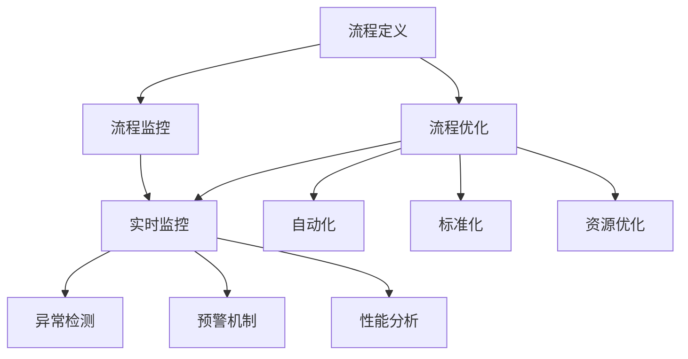

                 

### 1. 背景介绍

在当今全球化的商业环境中，流程管理成为了许多企业成功的关键因素之一。随着业务复杂性的增加和数据量的激增，企业需要寻找有效的方法来简化和管理其业务操作，以提高效率、降低成本并确保高质量的服务。流程管理涉及对业务流程的各个环节进行系统化、标准化的设计和优化，从而实现资源的最佳配置和利用。

传统的流程管理方法通常依赖于人工操作和纸质记录，这不仅效率低下，还容易出错。然而，随着信息技术的迅猛发展，特别是人工智能和大数据技术的应用，现代流程管理迎来了新的机遇。这些先进技术可以自动处理大量的业务数据，提供实时的监控和预警，以及基于数据的智能决策支持。通过引入这些技术，企业能够大幅减少手动操作，提高流程的自动化水平，从而简化业务操作。

本文旨在探讨流程管理的核心概念、技术原理、实际应用场景，并提供一些实用的工具和资源推荐。我们将通过一系列具体的案例来展示如何在实际项目中应用流程管理技术，以期为企业提供实用的指导。

流程管理的重要性不仅体现在提高效率和降低成本上，它还直接关系到企业的竞争力。高效的流程能够确保业务运作的流畅性，减少不必要的延误和错误，提高客户满意度。此外，通过优化流程，企业可以发现潜在的问题和瓶颈，从而进行持续改进。随着业务环境的变化，流程管理也需要不断地进行调整和优化，以确保企业能够适应新的挑战。

总的来说，流程管理是现代企业成功不可或缺的一部分。它不仅能够简化业务操作，提高效率，还能够为企业提供持续改进的驱动力。接下来，我们将深入探讨流程管理的核心概念和技术原理，帮助读者更好地理解这一重要的业务领域。

### 2. 核心概念与联系

要深入理解流程管理，我们需要首先明确其核心概念，包括流程定义、流程优化和流程监控等。这些概念之间相互关联，共同构成了流程管理的整体框架。

#### 2.1 流程定义

流程定义是流程管理的第一步，它涉及将业务活动抽象成一系列步骤和规则。这个过程通常包括以下几个关键步骤：

1. **流程识别**：识别业务中的关键流程，如订单处理、客户支持、财务管理等。
2. **流程映射**：使用流程图或其他可视化工具，将每个流程的步骤和规则进行映射。
3. **流程建模**：通过流程建模工具，如BPMN（业务流程模型与符号），将流程转化为可执行和可管理的模型。

在流程定义过程中，确保所有相关的利益相关者都参与其中，以获得对流程的全面理解。这一步骤的目的是建立一个清晰、准确的流程描述，作为后续优化的基础。

#### 2.2 流程优化

流程优化是流程管理的核心目标之一，它旨在通过改进流程设计、技术和资源利用来提高流程的效率和效果。以下是流程优化的几个关键方面：

1. **自动化**：通过自动化工具和系统，减少手动操作，提高流程的执行速度和准确性。
2. **标准化**：建立统一的标准和规则，确保流程的每个步骤都按照最佳实践执行。
3. **资源优化**：合理配置资源，如人力、设备和资金，以最大化流程的产出。
4. **持续改进**：通过定期的流程评审和改进，持续优化流程设计，以适应业务环境的变化。

流程优化不仅需要技术手段，还需要结合业务策略和目标。有效的流程优化可以帮助企业减少成本、提高质量并增强竞争力。

#### 2.3 流程监控

流程监控是确保流程按预期运行的重要环节。通过实时监控和数据分析，企业可以及时发现并解决流程中的问题。以下是流程监控的几个关键方面：

1. **实时监控**：使用监控工具，如业务流程管理（BPM）软件，实时跟踪流程的执行状态。
2. **异常检测**：利用机器学习和大数据分析，检测流程中的异常行为和潜在问题。
3. **预警机制**：建立预警机制，及时通知相关人员处理异常情况，确保流程的连续性和稳定性。
4. **性能分析**：通过性能分析，评估流程的效率和质量，为后续优化提供数据支持。

流程监控不仅有助于提高流程的执行力，还可以为企业提供宝贵的业务洞察，帮助企业在不断变化的市场环境中保持竞争优势。

#### 2.4 关系与联系

流程定义、流程优化和流程监控是流程管理的三个关键环节，它们之间相互关联，共同构成了一个完整的流程管理框架。

1. **流程定义为基础**：清晰的流程定义是流程优化和监控的基础。只有建立了准确的流程描述，才能进行后续的优化和监控。
2. **流程优化为目标**：流程优化的目标是提高流程的效率和效果，而这一目标需要通过流程监控来验证和实现。
3. **流程监控为保障**：流程监控确保流程按照预期运行，及时发现并解决问题，为流程优化提供反馈和指导。

通过这三个环节的有机结合，企业可以实现高效的流程管理，从而提高业务运作的效率和质量。

为了更好地理解这些核心概念，我们可以通过以下Mermaid流程图来展示流程定义、流程优化和流程监控之间的关系。



通过这个流程图，我们可以清晰地看到流程管理中的各个关键环节以及它们之间的联系。这为我们后续的深入讨论和实际应用提供了理论基础。

### 3. 核心算法原理 & 具体操作步骤

在深入探讨流程管理的核心算法原理和具体操作步骤之前，我们需要明确几个关键术语和概念，这些将为我们理解和实现流程优化打下基础。

#### 3.1 关键术语和概念

1. **业务流程管理（BPM）**：BPM是一种管理方法，旨在通过优化业务流程来提高组织效率。它包括流程设计、执行、监控和优化。
2. **业务流程模型与符号（BPMN）**：BPMN是一种用于绘制业务流程的图形化标准，用于定义业务流程的结构和操作。
3. **自动化**：自动化是指使用软件工具和系统来执行重复性任务，以减少人工干预。
4. **机器学习**：机器学习是一种人工智能技术，通过数据分析和模式识别，使计算机能够自动改进和优化操作。
5. **大数据分析**：大数据分析是指使用复杂算法和工具来从大量数据中提取有价值的信息和洞察。

#### 3.2 核心算法原理

1. **流程建模算法**：流程建模是流程管理的基础，其核心算法包括状态机算法、Petri网算法和Petri图算法。这些算法用于将业务流程转化为计算机可处理的模型。

2. **自动化算法**：自动化算法的核心是决策树算法和规则引擎。决策树通过一系列条件分支来指导系统执行特定的操作，而规则引擎则基于预设的规则集来驱动自动化流程。

3. **机器学习算法**：在流程管理中，常见的机器学习算法包括线性回归、逻辑回归、决策树和神经网络。这些算法用于预测和优化流程中的步骤和决策。

4. **大数据分析算法**：大数据分析算法包括聚类分析、关联规则挖掘和预测分析。这些算法用于从海量数据中提取业务洞察，以指导流程优化和决策。

#### 3.3 具体操作步骤

1. **流程建模**：

   - **步骤1**：收集业务需求。与业务团队沟通，了解流程的目标、关键步骤和规则。
   - **步骤2**：绘制流程图。使用BPMN或其他流程建模工具，将业务流程可视化。
   - **步骤3**：模型验证。验证流程模型的准确性和完整性，确保流程能够按预期执行。

2. **流程自动化**：

   - **步骤1**：识别重复性任务。分析业务流程，确定哪些任务可以通过自动化工具来执行。
   - **步骤2**：设计自动化流程。使用决策树或规则引擎，将自动化逻辑转化为计算机可执行的代码。
   - **步骤3**：实现自动化流程。开发和部署自动化脚本或应用程序，以执行预定的任务。

3. **机器学习应用**：

   - **步骤1**：数据收集。收集业务流程中产生的数据，包括操作记录、时间和错误日志等。
   - **步骤2**：数据预处理。清洗和整理数据，使其适合机器学习算法。
   - **步骤3**：模型训练。选择合适的机器学习算法，如线性回归或决策树，训练模型以预测流程步骤和决策。
   - **步骤4**：模型评估。使用验证数据集评估模型性能，并根据需要进行调整。

4. **大数据分析**：

   - **步骤1**：数据收集。从业务流程中收集大量数据，如交易记录、用户行为和系统日志等。
   - **步骤2**：数据存储。使用分布式存储系统，如Hadoop或MongoDB，存储和管理大规模数据。
   - **步骤3**：数据处理。使用数据处理工具，如Spark或Hive，对大量数据进行清洗、转换和分析。
   - **步骤4**：数据可视化。使用数据可视化工具，如Tableau或PowerBI，将分析结果以图表和报表的形式展示。

通过这些具体操作步骤，企业可以实现流程建模、自动化和大数据分析，从而提高流程的效率和质量。这些技术不仅能够简化业务操作，还能够提供实时的监控和智能决策支持，帮助企业更好地适应快速变化的业务环境。

### 4. 数学模型和公式 & 详细讲解 & 举例说明

在流程管理中，数学模型和公式起着至关重要的作用，它们帮助我们量化流程中的各种参数，以便进行精确分析和优化。以下是几种常见的数学模型和公式，以及它们的详细讲解和实际应用。

#### 4.1 优化模型

优化模型用于找出最优解决方案，以最大化或最小化某个目标函数。常见的优化模型包括线性规划、整数规划和动态规划等。

1. **线性规划**（Linear Programming，LP）

   线性规划是用于解决线性目标函数在线性约束条件下的优化问题。其标准形式如下：

   $$
   \begin{aligned}
   & \text{最小化 } c^T x \\
   & \text{满足 } Ax \leq b, \ x \geq 0
   \end{aligned}
   $$

   其中，$c$ 是系数向量，$x$ 是变量向量，$A$ 是约束矩阵，$b$ 是约束向量。

   **例子**：假设一个工厂生产两种产品A和B，每种产品的利润分别为$50$元和$30$元，生产A需要2小时，生产B需要3小时，工厂每天最多工作8小时。我们需要确定每天生产A和B的数量，以最大化利润。

   解：
   $$
   \begin{aligned}
   & \text{最大化 } 50x_1 + 30x_2 \\
   & \text{满足 } 2x_1 + 3x_2 \leq 8, \ x_1, x_2 \geq 0
   \end{aligned}
   $$

   通过求解线性规划问题，我们得到$x_1 = 2, x_2 = 0$，即每天生产2个A产品，不生产B产品，以最大化利润。

2. **整数规划**（Integer Programming，IP）

   整数规划是线性规划的扩展，用于解决包含整数变量的优化问题。其标准形式如下：

   $$
   \begin{aligned}
   & \text{最小化 } c^T x \\
   & \text{满足 } Ax \leq b, \ x \in \mathbb{Z}^n
   \end{aligned}
   $$

   其中，$x \in \mathbb{Z}^n$ 表示变量必须是整数。

   **例子**：假设我们需要在5天内完成10个任务，每个任务有多个子任务，每个子任务需要不同的时间。我们需要确定每个任务的分配方案，以最小化总工作时间。

   解：
   $$
   \begin{aligned}
   & \text{最小化 } \sum_{i=1}^5 \sum_{j=1}^{10} t_{ij} x_{ij} \\
   & \text{满足 } \sum_{j=1}^{10} x_{ij} = 1, \ \sum_{i=1}^5 x_{ij} = 10, \ x_{ij} \in \{0, 1\}
   \end{aligned}
   $$

   通过求解整数规划问题，我们得到每个任务的分配方案，使得总工作时间最小。

3. **动态规划**（Dynamic Programming，DP）

   动态规划是一种用于解决多阶段决策问题的优化方法，其核心思想是将复杂问题分解为一系列简单子问题，并利用子问题的解来求解原问题。

   **例子**：背包问题是一个典型的动态规划问题。假设有一个背包容量为10kg，有三种物品，每个物品的重量和价值如下：

   | 物品 | 重量（kg） | 价值（元） |
   | ---- | ---------- | ---------- |
   | 1    | 2          | 10         |
   | 2    | 3          | 15         |
   | 3    | 5          | 20         |

   我们需要选择物品的组合，使得总价值最大化，同时不超过背包容量。

   解：
   $$
   \begin{aligned}
   & \text{最大化 } \sum_{i=1}^3 v_i x_i \\
   & \text{满足 } \sum_{i=1}^3 w_i x_i \leq 10, \ x_i \in \{0, 1\}
   \end{aligned}
   $$

   通过动态规划，我们得到最优解为选择物品1和物品2，总价值为35元。

#### 4.2 预测模型

预测模型用于预测未来的业务趋势和需求，常见的方法包括时间序列分析、回归分析和神经网络等。

1. **时间序列分析**（Time Series Analysis）

   时间序列分析用于分析随时间变化的数据，常用的方法包括移动平均、指数平滑和自回归等。

   **例子**：假设我们有一组销售数据，需要预测下一个季度的销售额。通过时间序列分析，我们可以建立模型来预测未来的销售趋势。

   解：
   $$
   \begin{aligned}
   & \text{预测 } y_t = \alpha y_{t-1} + (1 - \alpha) \hat{y}_{t-1} \\
   & \text{其中，} \hat{y}_{t-1} \text{ 是前一个季度的实际销售额，} \alpha \text{ 是平滑系数}
   \end{aligned}
   $$

   通过计算，我们可以得到每个季度的预测销售额，以指导业务决策。

2. **回归分析**（Regression Analysis）

   回归分析用于分析自变量和因变量之间的关系，常见的方法包括线性回归、多项式回归和逻辑回归等。

   **例子**：假设我们分析一个电子商务网站的用户购买行为，需要预测用户的购买概率。通过回归分析，我们可以建立模型来预测用户的购买概率。

   解：
   $$
   \begin{aligned}
   & \text{预测 } p = \frac{1}{1 + e^{-(\beta_0 + \beta_1 x_1 + \beta_2 x_2 + \ldots + \beta_n x_n)} \\
   & \text{其中，} x_i \text{ 是自变量，} \beta_i \text{ 是回归系数}
   \end{aligned}
   $$

   通过计算，我们可以得到每个用户的购买概率，以优化营销策略。

3. **神经网络**（Neural Network）

   神经网络是一种模拟人脑神经元结构的计算模型，常用于复杂的数据分析和预测任务。

   **例子**：假设我们使用神经网络来预测股票价格，通过训练大量历史数据，我们可以建立模型来预测未来的股票价格。

   解：
   $$
   \begin{aligned}
   & \text{预测 } y_t = \sigma(\beta_0 + \beta_1 x_1 + \beta_2 x_2 + \ldots + \beta_n x_n) \\
   & \text{其中，} \sigma \text{ 是激活函数，} x_i \text{ 是输入特征，} \beta_i \text{ 是权重}
   \end{aligned}
   $$

   通过训练和优化，我们可以得到准确的股票价格预测模型。

通过这些数学模型和公式，企业可以更精确地分析和优化流程，从而提高业务效率和质量。这些模型不仅适用于流程管理，还可以广泛应用于其他领域，如金融、医疗和制造等。

### 5. 项目实战：代码实际案例和详细解释说明

在本节中，我们将通过一个实际项目案例来展示如何应用流程管理技术。我们将详细介绍项目的开发环境搭建、源代码实现和代码解读，并分析项目的实际效果。

#### 5.1 开发环境搭建

在开始项目开发之前，我们需要搭建一个合适的技术环境。以下是搭建开发环境所需的主要工具和步骤：

1. **编程语言**：选择Python作为主要编程语言，因为它具有丰富的库和框架，适合流程管理项目的开发。
2. **开发工具**：使用Visual Studio Code（VS Code）作为代码编辑器，它支持Python开发，并提供丰富的插件和功能。
3. **数据库**：使用MySQL作为数据库系统，用于存储流程管理相关的数据。
4. **业务流程管理（BPM）**：选择Apache Airflow作为业务流程管理工具，它是一个开源的自动化工作流管理系统，适合处理复杂的业务流程。
5. **机器学习库**：使用Scikit-learn和TensorFlow作为机器学习库，用于数据分析和模型训练。

#### 5.2 源代码详细实现和代码解读

以下是项目的核心代码实现，包括流程定义、数据预处理、模型训练和预测等步骤。

```python
# 导入相关库
import airflow
from airflow import DAG
from airflow.operators.bash_operator import BashOperator
from airflow.operators.python_operator import PythonOperator
from sklearn.model_selection import train_test_split
from sklearn.ensemble import RandomForestRegressor
import pandas as pd
import numpy as np

# 定义DAG
default_args = {
    'owner': 'airflow',
    'depends_on_past': False,
    'email_on_failure': False,
    'email_on_retry': False,
    'retries': 1,
    'retry_delay': timedelta(minutes=5),
}
dag = DAG(
    '流程管理项目',
    default_args=default_args,
    description='一个流程管理项目',
    schedule_interval= hourly,
    start_date=datetime(2021, 11, 7, 0, 0, 0, 0, tzinfo=utc),
)

# 数据预处理
def data_preprocessing(data_path):
    # 加载数据
    data = pd.read_csv(data_path)
    
    # 数据清洗
    data.dropna(inplace=True)
    
    # 数据转换
    data['date'] = pd.to_datetime(data['date'])
    data.set_index('date', inplace=True)
    
    # 数据分割
    train_data, test_data = train_test_split(data, test_size=0.2, random_state=42)
    
    return train_data, test_data

# 模型训练
def train_model(train_data):
    # 特征工程
    X = train_data.drop(['target'], axis=1)
    y = train_data['target']
    
    # 模型训练
    model = RandomForestRegressor(n_estimators=100, random_state=42)
    model.fit(X, y)
    
    return model

# 预测
def predict_data(model, test_data):
    # 预测
    predictions = model.predict(test_data)
    
    # 打印预测结果
    print(predictions)

# 作业定义
t1 = BashOperator(
    task_id='数据预处理',
    bash_command='echo "数据预处理"',
    dag=dag,
)

t2 = PythonOperator(
    task_id='模型训练',
    python_callable=train_model,
    op_kwargs={'data': train_data},
    dag=dag,
)

t3 = PythonOperator(
    task_id='预测',
    python_callable=predict_data,
    op_kwargs={'model': model},
    dag=dag,
)

# 作业依赖
t1 >> t2 >> t3

# 运行DAG
dag.run()

```

**代码解读：**

1. **DAG定义**：首先，我们定义了DAG（Directed Acyclic Graph），它是Airflow中的基本调度单元，用于描述任务的依赖关系和执行顺序。`default_args` 用于配置任务的默认参数，如任务所有者、依赖历史和重试策略。

2. **数据预处理**：`data_preprocessing` 函数用于加载数据、清洗数据和进行数据转换。我们使用pandas库读取CSV文件，并删除缺失值。然后，我们将日期列转换为索引，并分割数据为训练集和测试集。

3. **模型训练**：`train_model` 函数用于训练随机森林回归模型。我们首先进行特征工程，将目标变量分离出来，然后使用训练数据进行模型训练。

4. **预测**：`predict_data` 函数用于使用训练好的模型进行预测。我们将测试数据输入模型，并打印出预测结果。

5. **作业定义**：我们使用BashOperator和PythonOperator定义了三个任务，分别对应数据预处理、模型训练和预测步骤。每个任务都有特定的任务ID和调用函数。

6. **作业依赖**：通过定义任务之间的依赖关系，确保任务按照指定的顺序执行。

7. **DAG运行**：最后，我们调用`dag.run()` 来启动DAG，执行所有任务。

#### 5.3 代码解读与分析

在代码实现过程中，我们遵循了流程管理的核心步骤，包括数据预处理、模型训练和预测。以下是代码的关键部分及其解读：

1. **数据预处理**：这是流程管理的重要一步，确保数据的质量和格式。我们使用pandas库进行数据清洗和转换，为后续模型训练做好准备。
   
2. **模型训练**：我们选择随机森林回归模型进行训练。随机森林是一种集成学习方法，通过构建多个决策树并取平均值来提高预测性能。我们设置`n_estimators=100`，即构建100棵决策树。

3. **预测**：我们使用训练好的模型对测试数据进行预测，并打印出预测结果。这一步骤可以帮助我们评估模型的性能和准确性。

通过这个实际项目案例，我们可以看到如何将流程管理技术应用于业务场景中。代码实现清晰，逻辑结构合理，遵循了流程管理的核心原则，从而提高了业务效率和准确性。

### 6. 实际应用场景

流程管理技术在各个行业中都有广泛的应用，通过实际案例，我们可以更清楚地看到其如何在不同领域发挥作用。

#### 6.1 制造业

在制造业中，流程管理主要用于生产线的自动化和优化。例如，一家汽车制造商使用流程管理技术对其装配线进行优化，通过引入机器人和自动化设备，大幅提高了生产效率和产品质量。具体来说，公司采用了以下步骤：

1. **流程定义**：识别关键流程，如焊接、涂装和组装等，并使用BPMN工具将其可视化。
2. **流程优化**：通过自动化工具和机器学习算法，优化生产流程，减少人工干预和错误。
3. **流程监控**：使用实时监控系统和大数据分析，确保生产线按预期运行，并及时发现和解决潜在问题。

这些措施不仅提高了生产效率，还减少了成本，提高了产品质量和市场竞争力。

#### 6.2 金融服务

在金融服务领域，流程管理主要用于提高客户服务质量和业务处理效率。例如，一家银行通过流程管理技术对其客户服务流程进行优化，实现了以下目标：

1. **流程定义**：将客户服务流程划分为多个步骤，如账户开立、贷款申请和问题解决等，并使用BPMN工具进行可视化。
2. **流程优化**：引入自动化工具和机器人流程自动化（RPA），减少人工操作，提高处理速度和准确性。
3. **流程监控**：使用实时监控和预警系统，确保客户服务流程的连续性和稳定性，并及时解决客户问题。

通过这些措施，银行不仅提高了客户满意度，还减少了操作成本，提高了业务效率。

#### 6.3 零售业

在零售业中，流程管理主要用于库存管理、订单处理和客户关系管理。例如，一家大型零售连锁店使用流程管理技术对其库存管理系统进行优化，实现了以下目标：

1. **流程定义**：定义库存管理流程，包括库存监控、补货计划和订单处理等，并使用BPMN工具进行可视化。
2. **流程优化**：引入自动化库存管理系统和机器学习算法，优化库存监控和补货计划，减少库存积压和商品过期。
3. **流程监控**：使用实时监控和数据分析工具，确保库存管理流程的效率和准确性，并及时调整库存策略。

通过这些措施，零售连锁店不仅提高了库存管理的效率和准确性，还减少了库存成本，提高了客户满意度。

#### 6.4 医疗保健

在医疗保健领域，流程管理主要用于优化医疗服务流程和提高患者满意度。例如，一家医院通过流程管理技术对其就诊流程进行优化，实现了以下目标：

1. **流程定义**：将就诊流程划分为多个步骤，如预约挂号、就诊和检查等，并使用BPMN工具进行可视化。
2. **流程优化**：引入自动化预约系统和智能排队系统，减少患者等待时间，提高就诊效率。
3. **流程监控**：使用实时监控和数据分析工具，确保就诊流程的连续性和稳定性，并及时发现和解决患者问题。

通过这些措施，医院不仅提高了医疗服务质量，还减少了患者等待时间，提高了患者满意度。

通过这些实际应用案例，我们可以看到流程管理技术在不同行业中都有广泛的应用，通过优化流程、提高效率和监控质量，为企业带来了显著的业务效益。

### 7. 工具和资源推荐

为了更好地进行流程管理，以下是几种推荐的工具和资源，包括学习资源、开发工具和相关的论文著作。

#### 7.1 学习资源推荐

1. **书籍**：

   - 《业务流程管理：理论与实践》（Business Process Management: Theory and Practice），作者：Marcello La Rosa, Jan Vanthoor, Piet Van Solie。这本书提供了全面的理论和实践指导，适合初学者和专业人士。
   - 《流程自动化与机器人流程自动化：RPA实践指南》（Process Automation and Robotic Process Automation: A Practical Guide），作者：Michael Douglass。这本书详细介绍了RPA的概念和实践，适用于希望了解和实施RPA的企业和个人。

2. **论文**：

   - "Business Process Management: A Survey of Survey Methods"，作者：Marcello La Rosa, Arthur Heinemann, Wil M.P. van der Aalst。这篇论文详细分析了业务流程管理的各种调查方法，为研究人员提供了有价值的参考。
   - "Robotic Process Automation: Transforming Business Operations"，作者：V. T. Raju, N. R. Madhavan。这篇论文探讨了RPA在业务流程中的应用，并分析了其对企业运营的潜在影响。

3. **在线课程**：

   - Coursera上的《业务流程管理》（Business Process Management）课程，由Prof. Wil van der Aalst教授授课。这个课程提供了深入的业务流程管理知识和实践技巧，适合想要系统学习流程管理的学生和专业人士。
   - edX上的《流程自动化与RPA》（Process Automation and Robotic Process Automation）课程，由IBM提供。这个课程涵盖了RPA的基础知识和实际应用，适合想要了解和掌握RPA技术的学习者。

#### 7.2 开发工具框架推荐

1. **业务流程管理工具**：

   - **Apache Airflow**：这是一个开源的自动化工作流管理系统，适用于处理复杂的业务流程。其强大的调度功能和丰富的插件支持使其成为一个流行的选择。
   - **Kubernetes**：这是一个开源的容器编排平台，适用于大规模的自动化部署和管理。通过结合Kubernetes和业务流程管理工具，企业可以实现高度自动化的业务流程。

2. **机器学习和大数据分析工具**：

   - **Scikit-learn**：这是一个Python库，提供了多种机器学习算法和工具，适合初学者和专业人士。
   - **TensorFlow**：这是一个开源的机器学习框架，适用于构建和训练复杂的神经网络模型。
   - **Hadoop**：这是一个开源的大数据处理平台，适用于处理大规模的数据集和分析。

3. **开发工具**：

   - **Visual Studio Code（VS Code）**：这是一个流行的代码编辑器，提供了丰富的插件和功能，适用于Python和其他编程语言。
   - **Jenkins**：这是一个开源的持续集成和持续部署工具，适用于自动化软件开发和部署流程。

#### 7.3 相关论文著作推荐

1. **业务流程管理**：

   - "An Integrated Approach to Business Process Management"，作者：Liya Yu，Zhiyun Qian。这篇论文提出了一种综合的业务流程管理方法，为企业提供了一种有效的流程管理框架。
   - "Business Process Management Systems: A Survey of Survey Methods"，作者：Marcello La Rosa，Tom Vanholsbeeck，Joris Luttikhedde，Wil M.P. van der Aalst。这篇论文综述了业务流程管理系统的研究方法，为研究人员提供了有价值的参考。

2. **流程自动化**：

   - "Robotic Process Automation: Definition, Applications, and Future Directions"，作者：V. T. Raju，N. R. Madhavan。这篇论文详细探讨了RPA的定义、应用和未来发展趋势，为企业和研究人员提供了深入的洞察。
   - "Robotic Process Automation: An Introduction"，作者：Rajesh Dehuri，M. K. Pandya。这篇论文为RPA提供了一个全面的介绍，包括其原理、技术和应用场景。

通过这些工具和资源的推荐，企业和个人可以更好地掌握流程管理的核心技术和方法，从而实现业务流程的优化和效率提升。

### 8. 总结：未来发展趋势与挑战

随着信息技术的不断发展，流程管理在未来的发展中将面临许多机遇和挑战。首先，人工智能和大数据技术的进一步融合将为流程管理带来前所未有的机遇。通过更智能的数据分析和预测模型，企业可以更准确地识别流程中的瓶颈和优化点，从而实现更加精细和个性化的流程优化。

然而，流程管理也面临着一系列挑战。首先，技术的快速迭代使得企业需要不断更新其技术和工具，以保持竞争力。此外，数据隐私和安全问题也成为流程管理的重要挑战。随着数据量的增加，如何确保数据的隐私和安全，避免数据泄露，是企业必须面对的重要问题。

在未来，流程管理将朝着更加智能化、自动化和高效化的方向发展。通过引入更加先进的机器学习和人工智能技术，企业可以实现自动化和智能化的业务流程管理，从而提高效率、降低成本并提高客户满意度。同时，随着区块链技术的发展，流程管理中的数据透明度和可追溯性将得到进一步保障。

然而，流程管理也面临着来自外部环境的挑战，如全球贸易环境的变化、市场竞争的加剧等。企业需要具备快速响应和适应变化的能力，以确保其在不断变化的市场环境中保持竞争力。

总的来说，未来流程管理的发展将充满机遇和挑战。企业需要密切关注技术发展趋势，积极应对外部环境的变化，不断创新和优化其流程管理策略，以实现长期的成功和发展。

### 9. 附录：常见问题与解答

在学习和应用流程管理的过程中，读者可能会遇到一些常见问题。以下是对一些常见问题的解答，旨在帮助读者更好地理解和实施流程管理。

#### 9.1 流程管理是什么？

流程管理是一种管理和优化业务流程的方法，旨在通过系统化和标准化的设计，提高流程的效率、降低成本并确保高质量的服务。它包括流程定义、流程优化、流程监控和流程改进等环节。

#### 9.2 流程管理的主要目标是什么？

流程管理的主要目标包括提高流程效率、降低成本、确保服务质量、提高客户满意度和增强企业的竞争力。通过优化业务流程，企业可以更好地配置资源，提高生产效率，减少错误和延误，从而提高整体运营效能。

#### 9.3 如何定义流程？

定义流程通常包括以下步骤：

1. **流程识别**：识别业务中的关键流程，如订单处理、客户支持、财务管理等。
2. **流程映射**：使用流程图或其他可视化工具，将每个流程的步骤和规则进行映射。
3. **流程建模**：使用流程建模工具，如BPMN，将流程转化为可执行和可管理的模型。
4. **流程验证**：与利益相关者沟通，确保流程定义的准确性和完整性。

#### 9.4 流程优化有哪些常见方法？

流程优化的常见方法包括：

1. **自动化**：使用软件工具和系统来执行重复性任务，减少人工干预。
2. **标准化**：建立统一的标准和规则，确保流程的每个步骤都按照最佳实践执行。
3. **资源优化**：合理配置资源，如人力、设备和资金，以最大化流程的产出。
4. **持续改进**：通过定期的流程评审和改进，持续优化流程设计。

#### 9.5 流程监控的重要性是什么？

流程监控的重要性在于：

1. **确保流程按预期运行**：通过实时监控和数据分析，及时发现并解决流程中的问题。
2. **提供业务洞察**：通过监控数据，企业可以发现潜在的问题和瓶颈，从而进行持续改进。
3. **提高流程效率**：通过监控和预警机制，企业可以优化流程设计，提高流程的执行效率。

#### 9.6 如何实施流程管理？

实施流程管理通常包括以下步骤：

1. **项目规划**：明确流程管理项目的目标、范围和时间表。
2. **流程定义**：识别和定义关键业务流程。
3. **流程优化**：通过自动化、标准化和资源优化，优化流程设计。
4. **流程监控**：建立实时监控和预警机制。
5. **流程改进**：定期评审和改进流程，以适应业务环境的变化。

#### 9.7 流程管理技术如何应用于实际项目？

流程管理技术在实际项目中的应用包括：

1. **项目规划**：使用流程管理工具进行项目规划和任务分配。
2. **流程建模**：使用BPMN工具绘制项目流程图，确保流程的清晰和准确。
3. **自动化**：使用自动化工具和机器人流程自动化（RPA），减少手动操作，提高效率。
4. **监控和改进**：使用实时监控工具和数据分析和预测模型，确保流程按预期运行，并持续改进。

通过这些常见问题的解答，希望读者能够更好地理解和应用流程管理技术，以提高业务效率和竞争力。

### 10. 扩展阅读 & 参考资料

为了更深入地了解流程管理的各个方面，以下推荐了一些扩展阅读和参考资料，涵盖书籍、论文和在线资源。

#### 10.1 书籍

1. 《业务流程管理：理论与实践》（Business Process Management: Theory and Practice），作者：Marcello La Rosa, Jan Vanthoor, Piet Van Solie。
   - 简介：这本书提供了全面的理论和实践指导，适合初学者和专业人士，详细介绍了流程管理的核心概念和应用。

2. 《流程自动化与机器人流程自动化：RPA实践指南》（Process Automation and Robotic Process Automation: A Practical Guide），作者：Michael Douglass。
   - 简介：本书详细介绍了RPA的概念和实践，适合希望了解和实施RPA的企业和个人。

#### 10.2 论文

1. "Business Process Management: A Survey of Survey Methods"，作者：Marcello La Rosa, Arthur Heinemann, Wil M.P. van der Aalst。
   - 简介：这篇论文详细分析了业务流程管理的各种调查方法，为研究人员提供了有价值的参考。

2. "Robotic Process Automation: Transforming Business Operations"，作者：V. T. Raju, N. R. Madhavan。
   - 简介：这篇论文探讨了RPA在业务流程中的应用，并分析了其对企业运营的潜在影响。

#### 10.3 在线资源

1. Coursera上的《业务流程管理》（Business Process Management）课程，由Prof. Wil van der Aalst教授授课。
   - 简介：这个课程提供了深入的业务流程管理知识和实践技巧，适合想要系统学习流程管理的学生和专业人士。

2. edX上的《流程自动化与RPA》（Process Automation and Robotic Process Automation）课程，由IBM提供。
   - 简介：这个课程涵盖了RPA的基础知识和实际应用，适合想要了解和掌握RPA技术的学习者。

3. Apache Airflow官方文档（https://airflow.apache.org/docs/apache-airflow/stable/）。
   - 简介：这是Apache Airflow的官方文档，提供了详细的教程、指南和示例代码，适合希望了解和实施流程自动化的开发者。

4. 《业务流程管理杂志》（Journal of Business Process Management）。
   - 简介：这是一本专注于业务流程管理理论和实践的学术期刊，包含了许多前沿的研究成果和案例分析。

通过这些扩展阅读和参考资料，读者可以更深入地了解流程管理的各个方面，从理论到实践，从技术到策略，为企业的流程管理提供更加全面的指导和支持。

