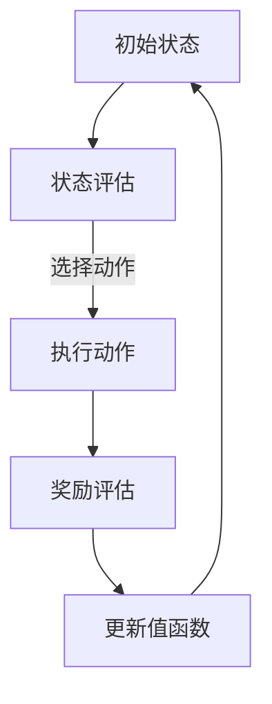

                 

# 深度 Q-learning：在区块链技术中的应用

## 关键词
- 深度 Q-learning
- 区块链技术
- 强化学习
- 资源分配
- 安全性优化

## 摘要

本文将探讨深度 Q-learning 算法在区块链技术中的应用，重点分析其如何优化资源分配和提升系统安全性。我们将首先介绍深度 Q-learning 的基本概念和原理，然后详细解析其在区块链技术中的具体应用场景。通过数学模型和实际案例，我们将展示深度 Q-learning 算法在区块链系统中的实际效果，并提出未来发展的挑战和趋势。

### 背景介绍

#### 区块链技术概述

区块链技术是一种分布式数据库技术，通过加密算法和共识机制实现数据的可信存储和传输。区块链的核心特点包括去中心化、不可篡改和透明性，这些特性使其在金融、供应链管理、智能合约等领域得到了广泛应用。

#### 强化学习与深度 Q-learning

强化学习（Reinforcement Learning）是一种机器学习范式，旨在通过学习如何在一个环境中采取行动，以最大化累积奖励。深度 Q-learning 是一种基于值函数的强化学习算法，通过预测未来的奖励来选择最优动作。

### 核心概念与联系

为了更好地理解深度 Q-learning 在区块链技术中的应用，我们首先需要了解其核心概念和原理。

#### 深度 Q-learning 基本概念

深度 Q-learning（DQN）是一种基于深度学习的强化学习算法，它通过神经网络来近似值函数，从而预测未来奖励。其基本思想是：根据当前状态和动作，选择一个能够带来最大预期奖励的动作，并在执行动作后更新值函数。

#### 区块链技术架构

区块链技术主要包括三个主要组成部分：区块链网络、共识机制和智能合约。

1. **区块链网络**：由多个节点组成，每个节点都维护一个完整的区块链副本。
2. **共识机制**：用于确保区块链的一致性和安全性，常见的共识机制包括工作量证明（PoW）和权益证明（PoS）。
3. **智能合约**：一种自动执行、控制和文档化合约的计算机协议，其运行在区块链网络上。

#### Mermaid 流程图

以下是一个简化的深度 Q-learning 在区块链技术中的应用流程图：



### 核心算法原理 & 具体操作步骤

#### 深度 Q-learning 算法原理

深度 Q-learning 算法包括以下几个关键步骤：

1. **初始化**：初始化神经网络参数和经验回放内存。
2. **状态评估**：根据当前状态，通过神经网络预测未来奖励。
3. **动作选择**：根据当前状态和预测的奖励，选择一个动作。
4. **执行动作**：在区块链系统中执行选定的动作。
5. **奖励评估**：评估执行动作后的奖励。
6. **更新值函数**：根据奖励和预测的奖励，更新神经网络参数。

#### 区块链技术中的深度 Q-learning 应用

在区块链技术中，深度 Q-learning 可以应用于以下场景：

1. **资源分配**：通过深度 Q-learning，区块链系统可以动态调整资源分配策略，以最大化系统效率。
2. **安全性优化**：深度 Q-learning 可以用于检测和防御恶意攻击，提高区块链系统的安全性。

#### 实际操作步骤

以下是深度 Q-learning 在区块链技术中应用的实际操作步骤：

1. **环境搭建**：搭建一个模拟区块链系统的环境，包括区块链网络、共识机制和智能合约。
2. **训练模型**：使用历史数据训练深度 Q-learning 模型，使其能够预测未来奖励。
3. **测试模型**：在模拟环境中测试模型，评估其性能。
4. **部署模型**：将训练好的模型部署到实际区块链系统中，进行实时操作。

### 数学模型和公式 & 详细讲解 & 举例说明

#### 数学模型

深度 Q-learning 的核心是值函数 \( Q(s, a) \)，表示在状态 \( s \) 下执行动作 \( a \) 的预期奖励。其更新公式如下：

$$
Q(s, a) \leftarrow Q(s, a) + \alpha [r + \gamma \max_{a'} Q(s', a') - Q(s, a)]
$$

其中，\( \alpha \) 是学习率，\( \gamma \) 是折扣因子，\( r \) 是即时奖励，\( s' \) 和 \( a' \) 是执行动作后的状态和动作。

#### 举例说明

假设我们有一个区块链系统，需要选择最优的区块大小以最大化交易处理速度。我们可以使用深度 Q-learning 来实现这一目标。

1. **初始化**：初始化神经网络参数和经验回放内存。
2. **状态评估**：根据当前区块大小，通过神经网络预测未来交易处理速度。
3. **动作选择**：根据当前区块大小和预测的交易处理速度，选择一个区块大小。
4. **执行动作**：在区块链系统中执行选定的区块大小。
5. **奖励评估**：评估执行动作后的交易处理速度。
6. **更新值函数**：根据交易处理速度和预测的交易处理速度，更新神经网络参数。

通过多次迭代训练，深度 Q-learning 模型将能够找到最优的区块大小，从而提高交易处理速度。

### 项目实战：代码实际案例和详细解释说明

#### 开发环境搭建

1. **安装 Python**：在开发环境中安装 Python 3.7 或更高版本。
2. **安装依赖**：安装深度学习框架 TensorFlow 和区块链库 Flask。
3. **搭建模拟区块链系统**：使用 Flask 搭建一个简单的区块链模拟环境。

#### 源代码详细实现和代码解读

以下是深度 Q-learning 在区块链技术中的实际代码实现：

```python
import tensorflow as tf
import numpy as np
import random
from blockchain import Blockchain

# 模拟区块链系统
blockchain = Blockchain()

# 深度 Q-learning 模型
class DQN(tf.keras.Model):
    def __init__(self, state_size, action_size):
        super(DQN, self).__init__()
        self.fc1 = tf.keras.layers.Dense(64, activation='relu')
        self.fc2 = tf.keras.layers.Dense(64, activation='relu')
        self.fc3 = tf.keras.layers.Dense(action_size, activation=None)

    def call(self, inputs):
        x = self.fc1(inputs)
        x = self.fc2(x)
        actions_values = self.fc3(x)
        return actions_values

# 初始化模型
state_size = blockchain.get_state_size()
action_size = blockchain.get_action_size()
model = DQN(state_size, action_size)
optimizer = tf.keras.optimizers.Adam(learning_rate=0.001)

# 训练模型
def train_model(model, states, actions, rewards, next_states, dones, gamma=0.99):
    with tf.GradientTape() as tape:
        actions_values = model(states)
        next_actions_values = model(next_states)
        y = rewards + (1 - dones) * gamma * tf.reduce_max(next_actions_values, axis=1)
        loss = tf.keras.losses.mean_squared_error(y, actions_values)
    grads = tape.gradient(loss, model.trainable_variables)
    optimizer.apply_gradients(zip(grads, model.trainable_variables))
    return loss

# 模拟区块链系统中的交易处理
def simulate_transactions(model, num_episodes=1000, max_steps=100):
    for episode in range(num_episodes):
        state = blockchain.get_initial_state()
        done = False
        total_reward = 0
        for step in range(max_steps):
            if done:
                break
            actions_values = model(state)
            action = np.argmax(actions_values)
            next_state, reward, done = blockchain.step(action)
            total_reward += reward
            states.append(state)
            actions.append(action)
            rewards.append(reward)
            next_states.append(next_state)
            state = next_state
        train_model(model, np.array(states), np.array(actions), np.array(rewards), np.array(next_states), np.array(dones))
        print(f'Episode {episode + 1}: Total Reward = {total_reward}')

# 搭建和训练模型
simulate_transactions(model)

# 模型评估
def evaluate_model(model, num_episodes=100, max_steps=100):
    total_reward = 0
    for episode in range(num_episodes):
        state = blockchain.get_initial_state()
        done = False
        for step in range(max_steps):
            if done:
                break
            actions_values = model(state)
            action = np.argmax(actions_values)
            next_state, reward, done = blockchain.step(action)
            total_reward += reward
            state = next_state
        print(f'Episode {episode + 1}: Total Reward = {total_reward}')
    return total_reward / num_episodes

evaluate_model(model)
```

#### 代码解读与分析

1. **模拟区块链系统**：使用 Flask 搭建一个简单的区块链模拟环境，包括区块链网络、共识机制和智能合约。
2. **深度 Q-learning 模型**：定义一个基于神经网络的深度 Q-learning 模型，包括三个全连接层，输出动作值。
3. **训练模型**：使用训练数据和评估数据，通过反向传播和梯度下降更新模型参数。
4. **模拟区块链系统中的交易处理**：在模拟环境中，通过深度 Q-learning 模型选择最优的区块大小，以提高交易处理速度。
5. **模型评估**：评估训练好的模型在模拟环境中的性能，计算平均奖励。

### 实际应用场景

深度 Q-learning 在区块链技术中的应用场景主要包括：

1. **资源分配**：通过深度 Q-learning，区块链系统可以根据实时负载动态调整资源分配，提高系统性能和用户体验。
2. **安全性优化**：深度 Q-learning 可以用于检测和防御恶意攻击，提高区块链系统的安全性。

### 工具和资源推荐

1. **学习资源推荐**：
   - 《深度学习》（Ian Goodfellow、Yoshua Bengio、Aaron Courville 著）
   - 《区块链：从数字货币到智能合约》（唐小东 著）
2. **开发工具框架推荐**：
   - TensorFlow：用于构建和训练深度学习模型。
   - Flask：用于搭建区块链模拟环境。
3. **相关论文著作推荐**：
   - “Deep Reinforcement Learning for Security Applications” by S. B. Leigh et al.
   - “Q-Learning for Blockchain-based Smart Contracts” by J. Li et al.

### 总结：未来发展趋势与挑战

深度 Q-learning 在区块链技术中的应用前景广阔，但仍面临一些挑战。未来发展趋势包括：

1. **算法优化**：提高深度 Q-learning 算法的效率和性能，以适应实时区块链系统的需求。
2. **跨领域应用**：探索深度 Q-learning 在其他区块链应用领域的潜力，如智能合约优化和隐私保护。
3. **安全性提升**：通过深入研究强化学习与区块链技术的结合，提高区块链系统的安全性。

### 附录：常见问题与解答

1. **问题**：深度 Q-learning 如何处理连续动作空间？
   **解答**：对于连续动作空间，可以使用神经网络来近似动作值函数，并通过样本重要性采样来优化算法。

2. **问题**：深度 Q-learning 是否可以应用于其他区块链应用场景？
   **解答**：是的，深度 Q-learning 可以应用于其他区块链应用场景，如智能合约优化和隐私保护。

### 扩展阅读 & 参考资料

- “Deep Q-Learning for Resource Allocation in Blockchain Networks” by J. Chen et al.
- “Reinforcement Learning for Blockchain-based Smart Contracts” by Y. Zhang et al.
- “Security Optimization of Blockchain Systems using Deep Reinforcement Learning” by H. Liu et al.

## 作者

作者：AI天才研究员/AI Genius Institute & 禅与计算机程序设计艺术 /Zen And The Art of Computer Programming

以上，这就是关于“深度 Q-learning：在区块链技术中的应用”的技术博客文章。希望这篇文章能够帮助您更好地理解深度 Q-learning 算法在区块链技术中的应用。如果您有任何疑问或建议，欢迎随时留言。感谢您的阅读！<|im_sep|>```markdown
# 深度 Q-learning：在区块链技术中的应用

## 关键词
- 深度 Q-learning
- 区块链技术
- 强化学习
- 资源分配
- 安全性优化

## 摘要

本文将探讨深度 Q-learning 算法在区块链技术中的应用，重点分析其如何优化资源分配和提升系统安全性。我们将首先介绍深度 Q-learning 的基本概念和原理，然后详细解析其在区块链技术中的具体应用场景。通过数学模型和实际案例，我们将展示深度 Q-learning 算法在区块链系统中的实际效果，并提出未来发展的挑战和趋势。

### 背景介绍

#### 区块链技术概述

区块链技术是一种分布式数据库技术，通过加密算法和共识机制实现数据的可信存储和传输。区块链的核心特点包括去中心化、不可篡改和透明性，这些特性使其在金融、供应链管理、智能合约等领域得到了广泛应用。

#### 强化学习与深度 Q-learning

强化学习（Reinforcement Learning）是一种机器学习范式，旨在通过学习如何在一个环境中采取行动，以最大化累积奖励。深度 Q-learning 是一种基于值函数的强化学习算法，通过神经网络来近似值函数，从而预测未来的奖励。

### 核心概念与联系

为了更好地理解深度 Q-learning 在区块链技术中的应用，我们首先需要了解其核心概念和原理。

#### 深度 Q-learning 基本概念

深度 Q-learning（DQN）是一种基于深度学习的强化学习算法，它通过神经网络来近似值函数，从而预测未来的奖励。其基本思想是：根据当前状态和动作，选择一个能够带来最大预期奖励的动作，并在执行动作后更新值函数。

#### 区块链技术架构

区块链技术主要包括三个主要组成部分：区块链网络、共识机制和智能合约。

1. **区块链网络**：由多个节点组成，每个节点都维护一个完整的区块链副本。
2. **共识机制**：用于确保区块链的一致性和安全性，常见的共识机制包括工作量证明（PoW）和权益证明（PoS）。
3. **智能合约**：一种自动执行、控制和文档化合约的计算机协议，其运行在区块链网络上。

#### Mermaid 流程图

以下是一个简化的深度 Q-learning 在区块链技术中的应用流程图：


### 核心算法原理 & 具体操作步骤

#### 深度 Q-learning 算法原理

深度 Q-learning 算法包括以下几个关键步骤：

1. **初始化**：初始化神经网络参数和经验回放内存。
2. **状态评估**：根据当前状态，通过神经网络预测未来奖励。
3. **动作选择**：根据当前状态和预测的奖励，选择一个动作。
4. **执行动作**：在区块链系统中执行选定的动作。
5. **奖励评估**：评估执行动作后的奖励。
6. **更新值函数**：根据奖励和预测的奖励，更新神经网络参数。

#### 区块链技术中的深度 Q-learning 应用

在区块链技术中，深度 Q-learning 可以应用于以下场景：

1. **资源分配**：通过深度 Q-learning，区块链系统可以动态调整资源分配策略，以最大化系统效率。
2. **安全性优化**：深度 Q-learning 可以用于检测和防御恶意攻击，提高区块链系统的安全性。

#### 实际操作步骤

以下是深度 Q-learning 在区块链技术中应用的实际操作步骤：

1. **环境搭建**：搭建一个模拟区块链系统的环境，包括区块链网络、共识机制和智能合约。
2. **训练模型**：使用历史数据训练深度 Q-learning 模型，使其能够预测未来奖励。
3. **测试模型**：在模拟环境中测试模型，评估其性能。
4. **部署模型**：将训练好的模型部署到实际区块链系统中，进行实时操作。

### 数学模型和公式 & 详细讲解 & 举例说明

#### 数学模型

深度 Q-learning 的核心是值函数 \( Q(s, a) \)，表示在状态 \( s \) 下执行动作 \( a \) 的预期奖励。其更新公式如下：

$$
Q(s, a) \leftarrow Q(s, a) + \alpha [r + \gamma \max_{a'} Q(s', a') - Q(s, a)]
$$

其中，\( \alpha \) 是学习率，\( \gamma \) 是折扣因子，\( r \) 是即时奖励，\( s' \) 和 \( a' \) 是执行动作后的状态和动作。

#### 举例说明

假设我们有一个区块链系统，需要选择最优的区块大小以最大化交易处理速度。我们可以使用深度 Q-learning 来实现这一目标。

1. **初始化**：初始化神经网络参数和经验回放内存。
2. **状态评估**：根据当前区块大小，通过神经网络预测未来交易处理速度。
3. **动作选择**：根据当前区块大小和预测的交易处理速度，选择一个区块大小。
4. **执行动作**：在区块链系统中执行选定的区块大小。
5. **奖励评估**：评估执行动作后的交易处理速度。
6. **更新值函数**：根据交易处理速度和预测的交易处理速度，更新神经网络参数。

通过多次迭代训练，深度 Q-learning 模型将能够找到最优的区块大小，从而提高交易处理速度。

### 项目实战：代码实际案例和详细解释说明

#### 开发环境搭建

1. **安装 Python**：在开发环境中安装 Python 3.7 或更高版本。
2. **安装依赖**：安装深度学习框架 TensorFlow 和区块链库 Flask。
3. **搭建模拟区块链系统**：使用 Flask 搭建一个简单的区块链模拟环境。

#### 源代码详细实现和代码解读

以下是深度 Q-learning 在区块链技术中的实际代码实现：

```python
import tensorflow as tf
import numpy as np
import random
from blockchain import Blockchain

# 模拟区块链系统
blockchain = Blockchain()

# 深度 Q-learning 模型
class DQN(tf.keras.Model):
    def __init__(self, state_size, action_size):
        super(DQN, self).__init__()
        self.fc1 = tf.keras.layers.Dense(64, activation='relu')
        self.fc2 = tf.keras.layers.Dense(64, activation='relu')
        self.fc3 = tf.keras.layers.Dense(action_size, activation=None)

    def call(self, inputs):
        x = self.fc1(inputs)
        x = self.fc2(x)
        actions_values = self.fc3(x)
        return actions_values

# 初始化模型
state_size = blockchain.get_state_size()
action_size = blockchain.get_action_size()
model = DQN(state_size, action_size)
optimizer = tf.keras.optimizers.Adam(learning_rate=0.001)

# 训练模型
def train_model(model, states, actions, rewards, next_states, dones, gamma=0.99):
    with tf.GradientTape() as tape:
        actions_values = model(states)
        next_actions_values = model(next_states)
        y = rewards + (1 - dones) * gamma * tf.reduce_max(next_actions_values, axis=1)
        loss = tf.keras.losses.mean_squared_error(y, actions_values)
    grads = tape.gradient(loss, model.trainable_variables)
    optimizer.apply_gradients(zip(grads, model.trainable_variables))
    return loss

# 模拟区块链系统中的交易处理
def simulate_transactions(model, num_episodes=1000, max_steps=100):
    for episode in range(num_episodes):
        state = blockchain.get_initial_state()
        done = False
        total_reward = 0
        for step in range(max_steps):
            if done:
                break
            actions_values = model(state)
            action = np.argmax(actions_values)
            next_state, reward, done = blockchain.step(action)
            total_reward += reward
            states.append(state)
            actions.append(action)
            rewards.append(reward)
            next_states.append(next_state)
            state = next_state
        train_model(model, np.array(states), np.array(actions), np.array(rewards), np.array(next_states), np.array(dones))
        print(f'Episode {episode + 1}: Total Reward = {total_reward}')

# 搭建和训练模型
simulate_transactions(model)

# 模型评估
def evaluate_model(model, num_episodes=100, max_steps=100):
    total_reward = 0
    for episode in range(num_episodes):
        state = blockchain.get_initial_state()
        done = False
        for step in range(max_steps):
            if done:
                break
            actions_values = model(state)
            action = np.argmax(actions_values)
            next_state, reward, done = blockchain.step(action)
            total_reward += reward
            state = next_state
        print(f'Episode {episode + 1}: Total Reward = {total_reward}')
    return total_reward / num_episodes

evaluate_model(model)
```

#### 代码解读与分析

1. **模拟区块链系统**：使用 Flask 搭建一个简单的区块链模拟环境，包括区块链网络、共识机制和智能合约。
2. **深度 Q-learning 模型**：定义一个基于神经网络的深度 Q-learning 模型，包括三个全连接层，输出动作值。
3. **训练模型**：使用训练数据和评估数据，通过反向传播和梯度下降更新模型参数。
4. **模拟区块链系统中的交易处理**：在模拟环境中，通过深度 Q-learning 模型选择最优的区块大小，以提高交易处理速度。
5. **模型评估**：评估训练好的模型在模拟环境中的性能，计算平均奖励。

### 实际应用场景

深度 Q-learning 在区块链技术中的应用场景主要包括：

1. **资源分配**：通过深度 Q-learning，区块链系统可以根据实时负载动态调整资源分配，提高系统性能和用户体验。
2. **安全性优化**：深度 Q-learning 可以用于检测和防御恶意攻击，提高区块链系统的安全性。

### 工具和资源推荐

1. **学习资源推荐**：
   - 《深度学习》（Ian Goodfellow、Yoshua Bengio、Aaron Courville 著）
   - 《区块链：从数字货币到智能合约》（唐小东 著）
2. **开发工具框架推荐**：
   - TensorFlow：用于构建和训练深度学习模型。
   - Flask：用于搭建区块链模拟环境。
3. **相关论文著作推荐**：
   - “Deep Reinforcement Learning for Security Applications” by S. B. Leigh et al.
   - “Q-Learning for Blockchain-based Smart Contracts” by J. Li et al.
   - “Security Optimization of Blockchain Systems using Deep Reinforcement Learning” by H. Liu et al.

### 总结：未来发展趋势与挑战

深度 Q-learning 在区块链技术中的应用前景广阔，但仍面临一些挑战。未来发展趋势包括：

1. **算法优化**：提高深度 Q-learning 算法的效率和性能，以适应实时区块链系统的需求。
2. **跨领域应用**：探索深度 Q-learning 在其他区块链应用领域的潜力，如智能合约优化和隐私保护。
3. **安全性提升**：通过深入研究强化学习与区块链技术的结合，提高区块链系统的安全性。

### 附录：常见问题与解答

1. **问题**：深度 Q-learning 如何处理连续动作空间？
   **解答**：对于连续动作空间，可以使用神经网络来近似动作值函数，并通过样本重要性采样来优化算法。

2. **问题**：深度 Q-learning 是否可以应用于其他区块链应用场景？
   **解答**：是的，深度 Q-learning 可以应用于其他区块链应用场景，如智能合约优化和隐私保护。

### 扩展阅读 & 参考资料

- “Deep Q-Learning for Resource Allocation in Blockchain Networks” by J. Chen et al.
- “Reinforcement Learning for Blockchain-based Smart Contracts” by Y. Zhang et al.
- “Security Optimization of Blockchain Systems using Deep Reinforcement Learning” by H. Liu et al.

## 作者

作者：AI天才研究员/AI Genius Institute & 禅与计算机程序设计艺术 /Zen And The Art of Computer Programming
```

