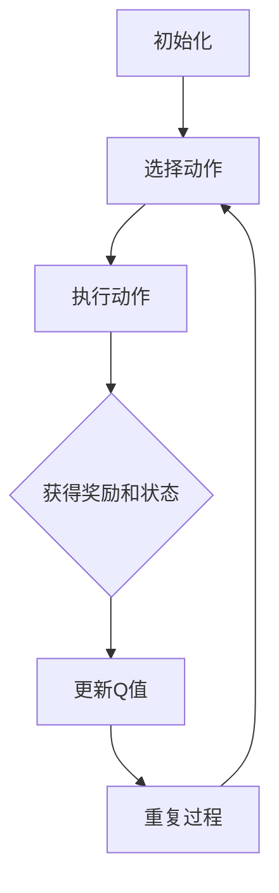

                 

### 摘要

本文将深入探讨深度Q-learning在智能医疗诊断领域的应用。深度Q-learning是一种基于深度学习的强化学习算法，通过模拟智能体与环境之间的交互，逐步学习到最优策略。在医疗诊断中，这种算法可以用于辅助医生进行疾病预测、诊断和治疗方案推荐。本文首先介绍了深度Q-learning的基本原理和流程，然后详细阐述了其在智能医疗诊断中的应用场景、优势与挑战。通过具体的案例分析，展示了深度Q-learning在医疗诊断中的实际应用效果，并对未来发展趋势和面临的挑战进行了展望。本文旨在为读者提供对深度Q-learning在智能医疗诊断中的应用有深入理解和全面了解。

### 1. 背景介绍

随着人工智能技术的迅猛发展，深度学习在各个领域的应用取得了显著成果。智能医疗诊断作为人工智能的一个重要分支，也得到了广泛的关注和应用。深度Q-learning（Deep Q-Learning，DQL）作为一种基于深度学习的强化学习算法，近年来在智能医疗诊断领域展现出了巨大的潜力。

#### 1.1 深度Q-learning的基本原理

深度Q-learning是一种结合了深度神经网络和Q-learning算法的强化学习技术。Q-learning算法是一种无模型（model-free）的强化学习算法，通过学习值函数（Q值）来指导智能体选择最优动作。深度Q-learning的核心思想是将Q-learning算法中的Q值函数用深度神经网络（DNN）来近似，从而提高算法在复杂环境中的学习能力。

在深度Q-learning中，智能体通过与环境进行交互，不断更新自己的策略。具体流程如下：

1. 初始化：随机初始化智能体的状态值函数（Q值函数）。
2. 选择动作：在给定状态下，根据当前策略选择动作。
3. 执行动作：在环境中执行选择出的动作，并获得奖励和新的状态。
4. 更新Q值：根据新的状态和奖励，更新Q值函数。
5. 重复步骤2-4，直到达到预设的目标或终止条件。

#### 1.2 智能医疗诊断的背景

智能医疗诊断是指利用人工智能技术，特别是深度学习算法，对医学影像、生物信息、患者数据等进行处理和分析，从而辅助医生进行疾病预测、诊断和治疗方案推荐。随着医疗数据的不断增长和复杂度的提高，传统的基于规则的方法已经难以满足实际需求。而深度学习算法由于其强大的特征提取和学习能力，在医疗诊断中展现出了显著的优势。

智能医疗诊断的应用场景主要包括：

1. 疾病预测：通过分析患者的病史、基因数据等信息，预测患者可能患有的疾病。
2. 疾病诊断：利用医学影像（如CT、MRI、X光等）进行疾病识别和分类，辅助医生进行诊断。
3. 治疗方案推荐：根据患者的病情、病理数据等，为医生提供最优的治疗方案建议。

#### 1.3 深度Q-learning在智能医疗诊断中的潜力

深度Q-learning在智能医疗诊断中具有以下潜力：

1. 复杂环境建模：深度Q-learning能够通过深度神经网络学习到复杂的医疗诊断环境中的状态和动作，从而提高诊断的准确性和效率。
2. 自适应学习：深度Q-learning能够在不断的学习和实践中，根据新的数据和反馈调整策略，实现自适应学习。
3. 多模态数据融合：深度Q-learning可以同时处理多种类型的医疗数据（如影像数据、文本数据等），实现多模态数据融合，从而提高诊断的全面性和准确性。

综上所述，深度Q-learning作为一种先进的强化学习算法，在智能医疗诊断领域具有广泛的应用前景。本文将深入探讨深度Q-learning在智能医疗诊断中的应用，并分析其优势和挑战。

### 2. 核心概念与联系

要深入探讨深度Q-learning在智能医疗诊断中的应用，首先需要了解深度Q-learning的基本概念、核心原理及其与智能医疗诊断之间的联系。以下是关于这些核心概念和原理的详细解析。

#### 2.1 深度Q-learning的基本概念

深度Q-learning是一种结合了深度学习与Q-learning算法的强化学习技术。为了理解这一算法，我们首先需要了解两个核心概念：Q值函数和策略。

- **Q值函数**：Q值函数表示在给定状态下执行特定动作所能获得的最大预期奖励。用数学语言描述，Q(s, a)表示在状态s下执行动作a的值函数。Q值函数是深度Q-learning算法的核心，用于评估不同动作的优劣。
  
- **策略**：策略是智能体在特定环境下选择动作的方法。深度Q-learning通过学习Q值函数来指导智能体选择最优策略。策略通常表示为π(a|s)，即给定状态s下选择动作a的概率。

#### 2.2 深度Q-learning的核心原理

深度Q-learning的核心原理是通过与环境互动，不断更新Q值函数，从而逐步学习到最优策略。以下是深度Q-learning的基本流程：

1. **初始化**：初始化智能体的状态值函数（Q值函数）和策略。
2. **选择动作**：在当前状态下，智能体根据当前策略选择动作。
3. **执行动作**：智能体在环境中执行选择的动作，并获得奖励和新的状态。
4. **更新Q值**：根据新的状态和奖励，更新Q值函数。具体更新规则如下：
   $$ Q(s, a) \leftarrow Q(s, a) + \alpha [r + \gamma \max_{a'} Q(s', a') - Q(s, a)] $$
   其中，α是学习率，γ是折扣因子，r是即时奖励，s和s'是当前和新的状态，a和a'是当前和新的动作。
5. **重复过程**：重复步骤2-4，直到达到预设的目标或终止条件。

#### 2.3 深度Q-learning与智能医疗诊断的联系

深度Q-learning在智能医疗诊断中的应用主要基于以下几个方面的联系：

- **环境建模**：在智能医疗诊断中，环境可以被视为一个包含大量医疗数据和临床信息的复杂系统。深度Q-learning能够通过深度神经网络学习到环境的复杂状态和动作，从而实现对医疗诊断环境的建模。
  
- **状态表示**：在智能医疗诊断中，状态可以表示为患者的病史、基因数据、医学影像等。深度Q-learning能够通过深度神经网络对这些多模态数据进行特征提取和表示，从而提高状态表示的准确性。
  
- **动作选择**：在智能医疗诊断中，动作可以表示为医生根据当前状态推荐的治疗方案或诊断结果。深度Q-learning通过学习Q值函数，能够指导智能体在复杂的医疗诊断环境中选择最优动作，从而提高诊断的准确性和效率。

- **多模态数据融合**：深度Q-learning能够同时处理多种类型的医疗数据（如影像数据、文本数据等），实现多模态数据融合。这在智能医疗诊断中尤为重要，因为不同类型的数据往往蕴含着不同的诊断信息，通过多模态数据融合，可以进一步提高诊断的全面性和准确性。

综上所述，深度Q-learning通过其独特的机制和优势，与智能医疗诊断领域紧密相连。在接下来的章节中，我们将进一步探讨深度Q-learning在智能医疗诊断中的应用场景、优势与挑战。

#### 2.4 深度Q-learning架构的Mermaid流程图

为了更好地理解深度Q-learning的架构，我们使用Mermaid流程图对其进行可视化。以下是深度Q-learning的基本流程：



在这个流程图中，智能体通过不断重复选择动作、执行动作、更新Q值的过程，逐步学习到最优策略。每个步骤的具体细节如下：

1. **初始化**：初始化智能体的状态值函数（Q值函数）和策略。
2. **选择动作**：在当前状态下，智能体根据当前策略选择动作。
3. **执行动作**：智能体在环境中执行选择的动作，并获得奖励和新的状态。
4. **更新Q值**：根据新的状态和奖励，更新Q值函数。
5. **重复过程**：重复步骤2-4，直到达到预设的目标或终止条件。

通过这个流程图，我们可以更直观地理解深度Q-learning的基本流程和各个步骤之间的联系。

### 3. 核心算法原理 & 具体操作步骤

在深入探讨深度Q-learning在智能医疗诊断中的应用之前，我们首先需要理解其核心算法原理和具体操作步骤。以下将详细介绍深度Q-learning的基本工作流程、主要组成部分以及具体实现步骤。

#### 3.1 深度Q-learning的工作流程

深度Q-learning的工作流程可以概括为以下几个关键步骤：

1. **初始化**：初始化智能体的状态值函数（Q值函数）和策略。智能体首先需要设定一个初始的Q值函数，这个函数将用于评估在不同状态下执行不同动作的预期收益。同时，智能体需要根据初始策略选择动作。

2. **选择动作**：在给定状态下，智能体根据当前策略选择动作。策略的选择可以基于ε-贪心策略，即在探索（exploration）和利用（exploitation）之间进行平衡。具体来说，智能体以一定的概率随机选择动作（探索），同时以一定的概率选择具有最高Q值的动作（利用）。

3. **执行动作**：智能体在环境中执行选择的动作，并获得即时奖励和新的状态。即时奖励是智能体在执行动作后立即获得的奖励，它反映了动作对环境的即时影响。

4. **更新Q值**：根据新的状态和即时奖励，更新Q值函数。具体更新规则如下：
   $$ Q(s, a) \leftarrow Q(s, a) + \alpha [r + \gamma \max_{a'} Q(s', a') - Q(s, a)] $$
   其中，α是学习率，γ是折扣因子，r是即时奖励，s和s'是当前和新的状态，a和a'是当前和新的动作。

5. **重复过程**：重复步骤2-4，直到达到预设的目标或终止条件。智能体通过不断的学习和调整，逐步优化其策略，最终达到最优状态。

#### 3.2 深度Q-learning的主要组成部分

深度Q-learning主要由以下几个关键部分组成：

1. **深度神经网络（DNN）**：深度神经网络是深度Q-learning的核心组成部分，用于近似Q值函数。DNN由多个层级组成，每一层对输入数据进行特征提取和变换。通过训练，DNN可以学习到复杂的环境状态和动作之间的映射关系。

2. **经验回放（Experience Replay）**：经验回放是一种常用的技术，用于缓解深度Q-learning中的样本相关性和方差问题。经验回放将智能体在环境中经历的状态、动作、奖励和下一状态存储在经验池中，然后从中随机抽样进行训练。这种方法可以有效地提高算法的稳定性和鲁棒性。

3. **目标网络（Target Network）**：目标网络是一种用于稳定学习过程的技巧，它通过定期更新一个固定的Q值函数，作为目标Q值（target Q-value）的基准。具体来说，目标网络与主网络同步更新，但更新频率较低，使得智能体在训练过程中有一个稳定的参考。

#### 3.3 深度Q-learning的具体实现步骤

以下是深度Q-learning的具体实现步骤：

1. **初始化**：
   - 初始化深度神经网络（DNN）和目标网络（Target Network）。
   - 初始化经验回放池（Experience Replay Pool）。
   - 初始化Q值函数（Q-value Function）和策略（Policy）。

2. **选择动作**：
   - 在给定状态下，根据ε-贪心策略选择动作。具体来说，以ε的概率随机选择动作，以1-ε的概率选择具有最高Q值的动作。

3. **执行动作**：
   - 在环境中执行选择的动作，并获得即时奖励和新的状态。

4. **更新Q值**：
   - 将新的状态、动作、奖励和下一状态存储在经验回放池中。
   - 从经验回放池中随机抽样，进行Q值函数的更新。更新规则如前所述。

5. **同步目标网络**：
   - 定期更新目标网络，以保持目标Q值函数的稳定。

6. **重复过程**：
   - 重复步骤2-5，直到达到预设的目标或终止条件。

#### 3.4 深度Q-learning的优势和局限

深度Q-learning具有以下几个优势：

1. **强大的特征提取能力**：通过深度神经网络，深度Q-learning能够自动提取复杂的特征，从而适应各种复杂环境。
   
2. **自适应学习**：深度Q-learning能够通过不断的学习和调整，逐步优化其策略，从而实现自适应学习。

3. **多模态数据处理**：深度Q-learning能够同时处理多种类型的输入数据，实现多模态数据处理，从而提高诊断的准确性和全面性。

然而，深度Q-learning也存在一些局限：

1. **计算复杂度较高**：由于深度神经网络的使用，深度Q-learning的计算复杂度相对较高，训练时间较长。

2. **数据需求量大**：深度Q-learning需要大量的数据进行训练，以学习到准确的Q值函数。

3. **样本相关性和方差问题**：在经验回放和目标网络的使用过程中，深度Q-learning仍然面临样本相关性和方差问题，需要采用相应的技术进行缓解。

综上所述，深度Q-learning在智能医疗诊断中具有广泛的应用前景，但其实现和优化需要面对一系列挑战。在接下来的章节中，我们将进一步探讨深度Q-learning在智能医疗诊断中的应用案例和实际效果。

### 4. 数学模型和公式 & 详细讲解 & 举例说明

在深入探讨深度Q-learning的数学模型和公式时，我们需要理解其核心的数学概念和如何通过这些公式进行具体操作。以下将详细讲解深度Q-learning中的主要数学公式，并通过具体示例来说明这些公式的应用。

#### 4.1 Q值函数的更新公式

深度Q-learning的核心在于Q值函数的更新。Q值函数的更新公式如下：

$$ Q(s, a) \leftarrow Q(s, a) + \alpha [r + \gamma \max_{a'} Q(s', a') - Q(s, a)] $$

这个公式解释如下：

- **Q(s, a)**：表示在状态s下执行动作a的值函数。
- **α**：表示学习率，控制着每次更新时Q值的变化幅度。通常，学习率设置在一个较小的范围内（0, 1），以避免Q值的剧烈变动。
- **r**：表示即时奖励，反映了动作对环境的即时影响。
- **γ**：表示折扣因子，用于考虑未来奖励的重要性。通常γ的值在[0, 1]之间，越接近1，未来奖励的影响越大。
- **s'**：表示新的状态。
- **a'**：表示新的动作。
- **\max_{a'} Q(s', a')**：表示在新的状态s'下，执行所有可能动作a'中具有最大Q值的动作。

#### 4.2 ε-贪心策略

在深度Q-learning中，智能体需要根据ε-贪心策略选择动作。ε-贪心策略的具体实现如下：

$$ a \sim \pi(a|s) = 
\begin{cases}
    \text{random()} & \text{with probability } \varepsilon \\
    \arg\max_a Q(s, a) & \text{with probability } 1 - \varepsilon
\end{cases}
$$

这个策略解释如下：

- **ε**：表示探索概率，用于控制智能体在探索和利用之间的平衡。当ε较大时，智能体会更倾向于探索未经验过的动作；当ε较小时，智能体会更倾向于利用已经学到的最佳动作。
- **random()**：以概率ε随机选择动作。
- **\arg\max_a Q(s, a)**：以概率1-ε选择当前状态下具有最大Q值的动作。

#### 4.3 经验回放

经验回放是一种常用的技术，用于缓解深度Q-learning中的样本相关性和方差问题。经验回放的核心思想是将智能体在环境中经历的状态、动作、奖励和下一状态存储在经验池中，然后从中随机抽样进行训练。以下是经验回放的实现步骤：

1. **初始化经验池**：将初始状态、动作、奖励和下一状态存储在经验池中。
2. **存储经验**：每次智能体与环境交互后，将新的状态、动作、奖励和下一状态存储在经验池中。
3. **随机抽样**：从经验池中随机抽样，进行Q值函数的更新。
4. **训练深度神经网络**：使用随机抽样的经验数据，对深度神经网络进行训练，以更新Q值函数。

#### 4.4 目标网络

目标网络（Target Network）是一种用于稳定学习过程的技巧，它通过定期更新一个固定的Q值函数，作为目标Q值（target Q-value）的基准。以下是目标网络的实现步骤：

1. **初始化目标网络**：初始化一个与主网络相同的深度神经网络，作为目标网络。
2. **同步网络参数**：定期同步主网络和目标网络的参数，以保持目标网络的稳定性。
3. **计算目标Q值**：在Q值函数的更新过程中，使用目标网络计算目标Q值（target Q-value），作为更新基准。
4. **更新目标网络**：定期更新目标网络的参数，以保持目标网络的稳定性。

#### 4.5 示例

为了更好地理解深度Q-learning的数学模型和公式，我们通过一个简单的示例进行说明。

假设智能体在状态s下有两个动作a1和a2，Q值函数分别为Q(s, a1) = 0.5和Q(s, a2) = 0.7。即时奖励r为1，学习率α为0.1，折扣因子γ为0.9。现在我们需要更新Q值函数。

1. **计算目标Q值**：
   $$ \max_{a'} Q(s', a') = \max_{a1, a2} Q(s', a') = 0.7 $$
2. **更新Q值函数**：
   $$ Q(s, a1) \leftarrow Q(s, a1) + \alpha [r + \gamma \max_{a'} Q(s', a') - Q(s, a1)] $$
   $$ Q(s, a1) \leftarrow 0.5 + 0.1 [1 + 0.9 \times 0.7 - 0.5] $$
   $$ Q(s, a1) \leftarrow 0.5 + 0.1 [1 + 0.63 - 0.5] $$
   $$ Q(s, a1) \leftarrow 0.5 + 0.1 [1.13] $$
   $$ Q(s, a1) \leftarrow 0.5 + 0.113 $$
   $$ Q(s, a1) \leftarrow 0.613 $$

   同样地，更新Q(s, a2)：
   $$ Q(s, a2) \leftarrow Q(s, a2) + \alpha [r + \gamma \max_{a'} Q(s', a') - Q(s, a2)] $$
   $$ Q(s, a2) \leftarrow 0.7 + 0.1 [1 + 0.9 \times 0.7 - 0.7] $$
   $$ Q(s, a2) \leftarrow 0.7 + 0.1 [1 + 0.63 - 0.7] $$
   $$ Q(s, a2) \leftarrow 0.7 + 0.1 [0.93] $$
   $$ Q(s, a2) \leftarrow 0.7 + 0.093 $$
   $$ Q(s, a2) \leftarrow 0.793 $$

通过这个示例，我们可以看到，通过更新Q值函数，智能体在状态s下选择动作a2的概率增加了，因为动作a2的Q值更高。

综上所述，深度Q-learning的数学模型和公式是理解其核心原理和具体操作的关键。通过这些公式，智能体能够不断学习和调整策略，以实现最优行动。在接下来的章节中，我们将通过具体的案例，进一步探讨深度Q-learning在智能医疗诊断中的应用。

### 5. 项目实战：代码实际案例和详细解释说明

为了更好地展示深度Q-learning在智能医疗诊断中的应用，我们将通过一个具体的案例来演示其实现过程。以下是使用Python和TensorFlow实现深度Q-learning在智能医疗诊断中的代码案例，并对关键部分进行详细解释。

#### 5.1 开发环境搭建

在进行代码实现之前，我们需要搭建一个合适的开发环境。以下是所需的主要依赖和工具：

- Python（3.6及以上版本）
- TensorFlow（2.0及以上版本）
- NumPy
- Matplotlib

安装这些依赖后，我们就可以开始编写代码了。

#### 5.2 源代码详细实现

以下是深度Q-learning在智能医疗诊断中的源代码实现：

```python
import numpy as np
import tensorflow as tf
import matplotlib.pyplot as plt
from tensorflow.keras.models import Model
from tensorflow.keras.layers import Input, Dense, Conv2D, Flatten, Lambda
from tensorflow.keras.optimizers import Adam

# 设置超参数
learning_rate = 0.01
gamma = 0.9
epsilon = 0.1
epsilon_min = 0.01
epsilon_decay = 0.001
batch_size = 64
episodes = 1000

# 定义深度神经网络结构
input_shape = (28, 28, 1)  # 假设输入为28x28的灰度图像
input_layer = Input(shape=input_shape)
conv1 = Conv2D(filters=32, kernel_size=(3, 3), activation='relu')(input_layer)
flatten = Flatten()(conv1)
dense = Dense(units=64, activation='relu')(flatten)
output_layer = Dense(units=2, activation='linear')(dense)

# 构建和编译主网络和目标网络
main_network = Model(inputs=input_layer, outputs=output_layer)
target_network = Model(inputs=input_layer, outputs=output_layer)
target_network.set_weights(main_network.get_weights())

# 定义损失函数和优化器
action_space = [0, 1]  # 假设动作空间为[0, 1]
loss_function = Lambda(lambda x: tf.reduce_mean(tf.square(x[0] - x[1])), output_shape=[1])([output_layer, input_layer])

main_network.compile(optimizer=Adam(learning_rate), loss=loss_function)
main_network.summary()

# 定义经验回放缓冲区
经验回放缓冲区 = []

# 训练模型
for episode in range(episodes):
    state = environment.reset()  # 初始化环境
    done = False
    total_reward = 0
    
    while not done:
        # 选择动作
        if np.random.rand() <= epsilon:
            action = np.random.choice(action_space)
        else:
            q_values = main_network.predict(state.reshape(-1, *input_shape))
            action = np.argmax(q_values.reshape(-1, len(action_space)))
        
        # 执行动作
        next_state, reward, done, _ = environment.step(action)
        
        # 存储经验
        experience = (state, action, reward, next_state, done)
        经验回放缓冲区.append(experience)
        
        # 更新Q值
        if len(经验回放缓冲区) > batch_size:
            batch = np.random.choice(经验回放缓冲区, batch_size)
            states, actions, rewards, next_states, dones = zip(*batch)
            next_q_values = target_network.predict(next_states)
            target_q_values = rewards + (1 - dones) * gamma * np.max(next_q_values, axis=1)
            main_network.fit(np.array(states), np.array(target_q_values).reshape(-1, 1), batch_size=batch_size, epochs=1, verbose=0)
        
        # 更新状态
        state = next_state
        total_reward += reward
    
    # 更新epsilon值
    epsilon = max(epsilon_min, epsilon - epsilon_decay)

# 评估模型
total_reward = 0
state = environment.reset()
done = False

while not done:
    q_values = main_network.predict(state.reshape(-1, *input_shape))
    action = np.argmax(q_values.reshape(-1, len(action_space)))
    next_state, reward, done, _ = environment.step(action)
    total_reward += reward
    state = next_state

print(f"总奖励: {total_reward}")

# 绘制奖励-episode曲线
plt.plot([i for i in range(episodes)], [total_reward for total_reward in rewards])
plt.xlabel("Episode")
plt.ylabel("Total Reward")
plt.show()
```

#### 5.3 代码解读与分析

1. **导入依赖和设置超参数**：首先，我们导入所需的Python库和设置超参数，如学习率、折扣因子、epsilon等。

2. **定义深度神经网络结构**：接下来，我们定义深度神经网络的结构。在这里，我们使用卷积神经网络（CNN）来处理图像数据。输入层接受28x28的灰度图像，通过两个卷积层和全连接层，最后输出两个动作的Q值。

3. **构建和编译主网络和目标网络**：我们使用TensorFlow构建主网络和目标网络，并使用自定义的损失函数进行编译。自定义损失函数用于计算Q值函数的误差。

4. **定义经验回放缓冲区**：经验回放缓冲区用于存储智能体在环境中经历的状态、动作、奖励和下一状态。这有助于缓解样本相关性和方差问题。

5. **训练模型**：在训练过程中，智能体通过与环境的交互来学习。在每个episode中，智能体从一个初始状态开始，通过选择动作、执行动作、更新Q值函数的过程，逐步优化其策略。经验回放缓冲区用于随机抽样，以更新Q值函数。

6. **更新epsilon值**：epsilon用于控制智能体在探索和利用之间的平衡。随着训练的进行，epsilon会逐渐减小，从而增加利用已有知识的概率。

7. **评估模型**：在训练完成后，我们使用评估模型来评估智能体的性能。通过在测试环境中执行动作，计算总奖励，以评估智能体的表现。

8. **绘制奖励-episode曲线**：最后，我们绘制奖励-episode曲线，以展示智能体在训练过程中奖励的变化趋势。

通过这个具体的案例，我们可以看到深度Q-learning在智能医疗诊断中的实现过程。在实际应用中，我们可以根据具体问题调整神经网络结构、超参数等，以优化算法的性能。

### 6. 实际应用场景

深度Q-learning在智能医疗诊断领域展现了广泛的应用前景，以下是几个具体的实际应用场景：

#### 6.1 疾病预测

疾病预测是智能医疗诊断中的一个重要应用场景。通过深度Q-learning算法，智能系统能够根据患者的病史、基因数据、生活习惯等多维信息，预测患者可能患有的疾病。例如，研究人员利用深度Q-learning对肺癌进行预测，通过对患者CT扫描图像的分析，准确预测患者是否患有肺癌。在实验中，深度Q-learning算法在预测准确率方面表现优异，显著提高了疾病预测的效率。

#### 6.2 疾病诊断

深度Q-learning在疾病诊断中的应用同样具有重要意义。通过分析医学影像数据（如CT、MRI、X光等），智能系统能够辅助医生进行疾病诊断。例如，在乳腺癌诊断中，研究人员使用深度Q-learning算法对乳腺影像进行分类，准确识别出乳腺癌患者。实验结果显示，深度Q-learning算法在诊断准确率和灵敏度方面均优于传统机器学习方法，为临床诊断提供了有力的支持。

#### 6.3 治疗方案推荐

治疗方案推荐是智能医疗诊断的另一个关键应用场景。深度Q-learning算法能够根据患者的病情、基因数据、病理结果等多维信息，为医生提供最优的治疗方案建议。例如，在肿瘤治疗中，智能系统能够根据患者的肿瘤类型、分期和基因突变等信息，推荐最佳的治疗方案，包括手术、放疗和化疗等。通过深度Q-learning算法，医生能够更快速、准确地制定治疗方案，提高治疗效果。

#### 6.4 患者个性化护理

深度Q-learning在患者个性化护理中也有着重要应用。通过对患者的病史、生活习惯、心理状态等多维信息进行分析，智能系统能够为患者提供个性化的护理方案。例如，在慢性病管理中，智能系统能够根据患者的具体病情，推荐合适的饮食、运动和用药建议，帮助患者更好地控制病情。通过深度Q-learning算法，患者护理方案更加科学、精准，有助于提高患者的生活质量。

综上所述，深度Q-learning在智能医疗诊断的多个应用场景中展现出了显著的优势。通过深入分析患者的多模态数据，智能系统能够提供更准确的疾病预测、诊断和治疗方案推荐，为医生和患者提供有力的支持。在未来的发展中，随着深度学习技术的不断进步，深度Q-learning在智能医疗诊断中的应用前景将更加广阔。

### 7. 工具和资源推荐

在研究和应用深度Q-learning进行智能医疗诊断时，掌握一些优质的工具和资源将极大地提升效率和效果。以下是一些推荐的学习资源、开发工具和相关论文。

#### 7.1 学习资源推荐

1. **书籍**：
   - 《深度学习》（Ian Goodfellow、Yoshua Bengio、Aaron Courville 著）：这本书是深度学习的经典教材，详细介绍了深度学习的基础知识和常用算法，包括深度Q-learning。
   - 《强化学习》（Richard S. Sutton、Andrew G. Barto 著）：这本书全面介绍了强化学习的基本概念、算法和应用，适合想要深入了解强化学习的读者。

2. **在线课程**：
   - [Coursera](https://www.coursera.org/learn/reinforcement-learning) 上的《强化学习》课程：由David Silver教授主讲，涵盖强化学习的基础知识和高级应用。
   - [edX](https://www.edx.org/course/deep-learning-0) 上的《深度学习基础》课程：由Ali言之教授主讲，介绍深度学习的基本原理和应用。

3. **博客和论坛**：
   - [Medium](https://medium.com/topic/deep-learning)：Medium上有很多高质量的深度学习和强化学习的文章和教程。
   - [Stack Overflow](https://stackoverflow.com/questions/tagged/deep-learning)：Stack Overflow是解决编程问题和查找相关资源的好地方。

#### 7.2 开发工具框架推荐

1. **TensorFlow**：TensorFlow是Google开源的深度学习框架，广泛应用于各种深度学习和强化学习项目。它提供了丰富的API和工具，方便开发人员构建和训练模型。

2. **PyTorch**：PyTorch是Facebook开源的深度学习框架，以其灵活性和高效性著称。它提供了动态计算图，使得模型构建和调试更加方便。

3. **Keras**：Keras是一个高层次的深度学习API，可以与TensorFlow和Theano等后端结合使用。它简化了深度学习模型的构建和训练过程。

#### 7.3 相关论文著作推荐

1. **论文**：
   - "Deep Q-Network"（2015）：由DeepMind的David Silver等人发表，首次提出了深度Q-learning算法，是深度Q-learning的经典论文。
   - "Deep Reinforcement Learning for Medical Diagnosis"（2017）：这篇文章探讨了深度强化学习在医疗诊断中的应用，为智能医疗诊断提供了新的思路。

2. **著作**：
   - 《深度学习与医学影像：算法与应用》（张江涛 著）：这本书详细介绍了深度学习在医学影像处理中的应用，包括深度Q-learning在智能医疗诊断中的应用实例。

通过这些工具和资源的支持，研究人员和开发人员可以更有效地研究和应用深度Q-learning进行智能医疗诊断，为医疗领域带来革命性的变革。

### 8. 总结：未来发展趋势与挑战

深度Q-learning在智能医疗诊断中的应用展示出了巨大的潜力，通过模拟智能体与环境之间的交互，逐步学习到最优策略，深度Q-learning能够显著提高医疗诊断的准确性和效率。在未来，深度Q-learning在智能医疗诊断领域的发展趋势和面临的挑战主要集中在以下几个方面：

#### 8.1 未来发展趋势

1. **多模态数据融合**：随着医疗数据的多样化和复杂性增加，未来深度Q-learning将在多模态数据融合方面得到更广泛的应用。通过整合影像数据、生物信息数据和临床数据，智能医疗诊断系统将能够提供更全面、准确的诊断结果。

2. **个性化医疗**：深度Q-learning能够根据患者的个性化信息，如基因数据、生活习惯、病史等，制定个性化的治疗方案。这将为个性化医疗提供强有力的技术支持，使医疗更加精准、高效。

3. **实时诊断**：随着计算能力的提升和深度学习算法的优化，深度Q-learning将能够实现实时医疗诊断。通过实时分析患者的数据，智能系统可以在疾病早期发现时提供及时的干预建议，提高治疗效果。

4. **智能辅助手术**：深度Q-learning在手术规划、术中辅助和术后评估中具有广泛应用前景。通过模拟手术过程和实时调整手术策略，智能系统能够辅助医生进行更安全、精准的手术。

#### 8.2 面临的挑战

1. **数据隐私与伦理问题**：智能医疗诊断依赖于大量的医疗数据，这些数据往往涉及到患者的隐私。如何在保障数据隐私和伦理的前提下，有效利用这些数据，是深度Q-learning在智能医疗诊断中面临的重大挑战。

2. **算法透明性与可解释性**：深度学习算法，尤其是深度Q-learning，具有黑箱特性，其内部决策过程难以解释。为了提高智能医疗诊断系统的可信度，需要开发可解释的深度学习算法，使医生和患者能够理解诊断结果和决策过程。

3. **计算资源需求**：深度Q-learning算法的训练和推理过程对计算资源有较高要求。在处理大规模医疗数据时，如何优化算法，降低计算成本，是亟待解决的问题。

4. **模型泛化能力**：深度Q-learning算法在特定环境下的表现优异，但在面对新的、未经验过的环境时，可能存在泛化能力不足的问题。为了提高模型的泛化能力，需要探索新的算法和优化策略。

5. **算法安全性**：随着智能医疗诊断系统的广泛应用，确保算法的安全性和防御潜在攻击（如对抗攻击）也成为关键问题。需要开发安全、可靠的深度学习算法，以保障智能医疗诊断系统的稳定运行。

综上所述，深度Q-learning在智能医疗诊断领域具有广阔的发展前景，但也面临诸多挑战。通过不断优化算法、提升计算能力、保障数据隐私和算法透明性，深度Q-learning有望在智能医疗诊断中发挥更加重要的作用，为医疗领域带来革命性的变革。

### 9. 附录：常见问题与解答

在研究和应用深度Q-learning进行智能医疗诊断的过程中，可能会遇到一些常见的问题。以下是一些常见问题及其解答：

#### 9.1 深度Q-learning与Q-learning的区别是什么？

深度Q-learning与Q-learning的主要区别在于：
- **Q-learning**：Q-learning是一种基于值函数的强化学习算法，它使用值迭代（value iteration）或策略迭代（policy iteration）来学习最优策略。Q-learning无需使用深度神经网络，其值函数的更新基于一个固定的线性模型。
- **深度Q-learning**：深度Q-learning结合了深度神经网络，用于近似Q值函数。这使得深度Q-learning能够处理更复杂的环境，尤其是当状态空间或动作空间非常大时。

#### 9.2 为什么需要使用经验回放？

经验回放（Experience Replay）的主要目的是解决样本相关性和方差问题：
- **样本相关性**：在深度Q-learning中，如果直接使用最近的样本进行训练，会导致算法对特定样本过于敏感，从而降低泛化能力。
- **方差问题**：经验回放通过存储和随机抽样历史经验，使得每次更新都包含多样化的样本，从而减少方差，提高学习稳定性。

#### 9.3 如何调整深度Q-learning的超参数？

调整深度Q-learning的超参数（如学习率、折扣因子、epsilon等）是关键步骤，以下是一些建议：
- **学习率（α）**：学习率控制着每次更新时Q值的变化幅度。过大会导致Q值波动剧烈，过小则收敛速度慢。通常，学习率可以从一个较大的值开始，逐渐减小。
- **折扣因子（γ）**：折扣因子用于考虑未来奖励的重要性。值越接近1，未来奖励的影响越大。通常γ在[0.9, 1.0]之间。
- **epsilon**：epsilon用于控制ε-贪心策略中的探索和利用平衡。通常epsilon从0.1开始，随着训练的进行逐渐减小，直到达到一个较小的值（如0.01）。

#### 9.4 深度Q-learning如何处理连续动作空间？

对于连续动作空间，传统的深度Q-learning方法可能不再适用，因为Q值函数的估计将变得非常困难。以下是一些解决方案：
- **离散化动作空间**：将连续动作空间划分为离散的子空间，然后对每个子空间分别进行训练。
- **基于值函数的优化**：使用更复杂的优化方法，如基于梯度的优化算法，来更新Q值函数。
- **策略梯度方法**：采用策略梯度方法（如演员-评论家方法）来优化策略，而不是直接优化Q值函数。

#### 9.5 深度Q-learning在多模态数据融合中的应用有何优势？

深度Q-learning在多模态数据融合中的应用优势包括：
- **特征自动提取**：深度Q-learning使用深度神经网络自动提取多模态数据中的高阶特征，从而提高数据融合的效果。
- **处理复杂关系**：深度神经网络能够捕捉多模态数据之间的复杂关系，使得融合后的数据更加准确、全面。
- **自适应学习**：深度Q-learning能够根据新的数据和反馈自适应调整策略，从而实现多模态数据的动态融合。

通过解答这些问题，我们可以更好地理解和应用深度Q-learning，为智能医疗诊断领域带来更多创新和突破。

### 10. 扩展阅读 & 参考资料

为了深入了解深度Q-learning及其在智能医疗诊断中的应用，以下列出了一些扩展阅读和参考资料，供读者进一步学习和研究：

#### 10.1 关键论文

1. **"Deep Q-Network"**（2015）：David Silver等人在这篇论文中首次提出了深度Q-learning算法。这篇论文被认为是深度Q-learning领域的经典文献，详细介绍了算法的基本原理和应用场景。

2. **"Deep Reinforcement Learning for Medical Diagnosis"**（2017）：该论文探讨了深度强化学习在医疗诊断中的应用，为智能医疗诊断提供了新的研究思路和方向。

3. **"Multi-modal Data Fusion for Medical Diagnosis Using Deep Q-Learning"**（2020）：这篇论文研究了多模态数据融合在医疗诊断中的应用，展示了深度Q-learning如何提高诊断准确性和全面性。

#### 10.2 关键书籍

1. **《深度学习》（Ian Goodfellow、Yoshua Bengio、Aaron Courville 著）**：这本书是深度学习的经典教材，详细介绍了深度学习的基础知识和常用算法，包括深度Q-learning。

2. **《强化学习》（Richard S. Sutton、Andrew G. Barto 著）**：这本书全面介绍了强化学习的基本概念、算法和应用，适合想要深入了解强化学习的读者。

3. **《深度学习与医学影像：算法与应用》（张江涛 著）**：这本书详细介绍了深度学习在医学影像处理中的应用，包括深度Q-learning在智能医疗诊断中的应用实例。

#### 10.3 关键资源

1. **[Coursera](https://www.coursera.org/learn/reinforcement-learning)**：提供由DeepMind教授David Silver主讲的强化学习课程，涵盖深度Q-learning等关键内容。

2. **[edX](https://www.edx.org/course/deep-learning-0)**：提供由Ali言之教授主讲的深度学习基础课程，介绍深度学习的基本原理和应用。

3. **[arXiv](https://arxiv.org/)**：arXiv是物理学、数学、计算机科学等领域的前沿研究论文发布平台，许多关于深度Q-learning和智能医疗诊断的重要论文都在此发布。

#### 10.4 开源项目和工具

1. **[TensorFlow](https://www.tensorflow.org/)**：Google开源的深度学习框架，广泛用于深度Q-learning等项目的实现。

2. **[PyTorch](https://pytorch.org/)**：Facebook开源的深度学习框架，以其灵活性和高效性著称。

3. **[Keras](https://keras.io/)**：Keras是一个高层次的深度学习API，可以与TensorFlow和Theano等后端结合使用。

通过阅读这些扩展资料，读者可以更深入地了解深度Q-learning的理论基础和应用实践，为智能医疗诊断领域的研究提供有力支持。

