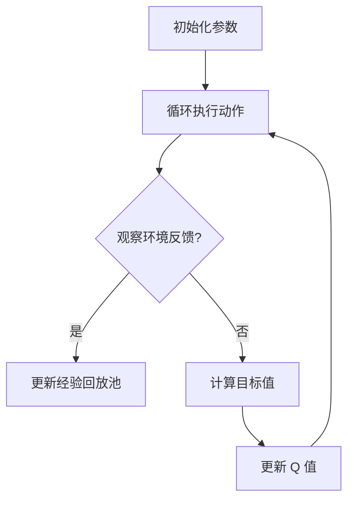

                 

### 文章标题

### 深度 Q-learning：奖励函数的选择与优化

> **关键词：** 深度 Q-learning、奖励函数、优化、强化学习

**摘要：** 本文深入探讨了深度 Q-learning 算法中的奖励函数选择与优化问题。首先介绍了深度 Q-learning 的基本原理及其与 Q-learning 的联系与区别。随后，文章详细分析了奖励函数的定义、作用及常见类型。在此基础上，提出了几种常用的奖励函数优化方法，并通过实际案例进行了详细解释。最后，本文总结了深度 Q-learning 在实际应用中的挑战和未来发展趋势。

<|assistant|>### 1. 背景介绍

#### 强化学习与深度 Q-learning

强化学习（Reinforcement Learning，简称 RL）是机器学习的一个重要分支，主要研究如何通过与环境交互，使智能体（Agent）学会在复杂环境中做出最优决策。强化学习与监督学习和无监督学习相比，具有独特的特点：智能体需要通过探索（Exploration）和利用（Exploitation）来积累经验，从而不断优化策略。

在强化学习中，Q-learning 是一种经典的值函数方法。它通过学习状态-动作值函数（State-Action Value Function）$Q(s, a)$，即智能体在状态 $s$ 下执行动作 $a$ 的长期回报，来指导智能体选择最优动作。然而，Q-learning 算法在处理高维状态空间和连续动作空间时，存在一定局限性。

为解决上述问题，深度 Q-learning（Deep Q-learning，简称 DQN）算法应运而生。深度 Q-learning 是一种基于深度神经网络的 Q-learning 算法，它通过神经网络来近似状态-动作值函数。与传统的 Q-learning 算法相比，深度 Q-learning 可以处理更复杂的问题，尤其在图像识别和游戏等领域取得了显著成果。

#### 奖励函数在深度 Q-learning 中的作用

在深度 Q-learning 中，奖励函数（Reward Function）是核心组成部分之一。它决定了智能体在执行某个动作后所获得的即时奖励，从而影响智能体的决策过程。一个好的奖励函数可以引导智能体更快地学会最优策略，提高学习效率。

具体来说，奖励函数在深度 Q-learning 中具有以下作用：

1. **引导探索**：奖励函数可以引导智能体在探索过程中关注某些重要状态，从而加速学习过程。
2. **强化目标**：奖励函数可以明确地指示智能体应该追求的目标，使智能体在执行动作时更加关注长期回报。
3. **平衡探索与利用**：奖励函数可以平衡智能体的探索与利用行为，使智能体在探索新策略和利用已有策略之间找到最佳平衡。

因此，选择合适的奖励函数对于深度 Q-learning 的学习效果至关重要。

#### 奖励函数的选择与优化

在深度 Q-learning 中，奖励函数的选择与优化是一个重要且具有挑战性的问题。合适的奖励函数不仅可以提高学习效率，还可以使智能体更快地学会最优策略。然而，不同的任务和应用场景需要不同的奖励函数，因此需要针对具体问题进行个性化设计。

常见的奖励函数优化方法包括：

1. **目标导向奖励**：通过引入目标导向奖励，使智能体在执行动作时更加关注长期回报，从而提高学习效率。
2. **平衡探索与利用奖励**：通过设计探索与利用之间的平衡，使智能体在探索新策略和利用已有策略之间找到最佳平衡。
3. **状态奖励**：根据状态的特征设计奖励函数，引导智能体在特定状态下执行有利动作。
4. **动作奖励**：根据动作的特征设计奖励函数，鼓励智能体在执行有利动作时获得更高奖励。

本文将在后续章节中，详细讨论这些奖励函数的原理、设计方法及其在实际应用中的效果。

<|assistant|>## 2. 核心概念与联系

### 深度 Q-learning 基本原理

深度 Q-learning（DQN）算法是 Q-learning 算法的一种扩展，它通过引入深度神经网络来近似状态-动作值函数。具体来说，DQN 算法主要包括以下步骤：

1. **初始化参数**：随机初始化神经网络权重、经验回放池等参数。
2. **循环执行动作**：智能体在当前状态下执行动作，并观察环境反馈。
3. **更新经验回放池**：将当前状态、动作、奖励、下一状态和终止标志等信息存储到经验回放池中。
4. **随机采样经验**：从经验回放池中随机采样一批经验，以避免序列偏差。
5. **计算目标值**：根据采样到的经验计算目标值 $y$，其中 $y$ 的计算公式为：
   \[
   y = r + \gamma \max_{a'} Q(s', a')
   \]
   其中，$r$ 是立即奖励，$\gamma$ 是折扣因子，$s'$ 是下一状态，$a'$ 是在下一状态下智能体执行的动作。
6. **更新 Q 值**：利用目标值 $y$ 更新当前状态的 Q 值：
   \[
   Q(s, a) \leftarrow Q(s, a) + \alpha [y - Q(s, a)]
   \]
   其中，$\alpha$ 是学习率。
7. **重复执行步骤 2-6**，直到智能体学会最优策略。

DQN 算法的主要优点是能够处理高维状态空间和连续动作空间的问题，从而提高了强化学习的应用范围。然而，DQN 算法也存在一些缺点，如容易产生过度估计（Overestimation）和目标不稳定（Target Drift）等问题。

### Q-learning 与 DQN 的联系与区别

Q-learning 和 DQN 都是强化学习中的值函数方法，它们的主要区别在于状态-动作值函数的学习方式。

1. **学习方式**：Q-learning 算法使用确定性策略（Deterministic Policy），即在每个状态下选择 Q 值最大的动作。而 DQN 算法使用随机策略（Stochastic Policy），通过神经网络输出状态-动作值的概率分布，从而在多个动作中选择最优动作。
2. **神经网络结构**：Q-learning 算法通常使用简单的线性模型来近似状态-动作值函数，而 DQN 算法使用深度神经网络，可以更好地表示复杂的状态-动作关系。
3. **处理能力**：Q-learning 算法在处理高维状态空间和连续动作空间时存在一定局限性，而 DQN 算法通过引入深度神经网络，可以处理更复杂的问题。
4. **收敛速度**：由于 DQN 算法使用了随机策略，因此其收敛速度通常比 Q-learning 算法慢。

总之，DQN 算法在处理复杂问题时具有优势，但在某些特定场景下，Q-learning 算法可能更具优势。

### 奖励函数在深度 Q-learning 中的作用

在深度 Q-learning 中，奖励函数是影响学习效果的关键因素之一。一个好的奖励函数可以引导智能体更快地学会最优策略，提高学习效率。具体来说，奖励函数在深度 Q-learning 中具有以下作用：

1. **引导探索**：奖励函数可以引导智能体在探索过程中关注某些重要状态，从而加速学习过程。例如，在游戏领域，可以设置目标奖励，使智能体在接近目标时获得更高的奖励，从而鼓励智能体向目标移动。
2. **强化目标**：奖励函数可以明确地指示智能体应该追求的目标，使智能体在执行动作时更加关注长期回报。例如，在机器人导航任务中，可以设置到达终点奖励，鼓励智能体不断优化路径。
3. **平衡探索与利用**：奖励函数可以平衡智能体的探索与利用行为，使智能体在探索新策略和利用已有策略之间找到最佳平衡。例如，可以设置一个探索奖励，使智能体在探索过程中获得更高的奖励，从而鼓励智能体尝试新的动作。

### 常见奖励函数类型及优化方法

在深度 Q-learning 中，常见的奖励函数类型包括目标导向奖励、平衡探索与利用奖励、状态奖励和动作奖励。以下分别对这些奖励函数类型进行介绍，并讨论其优化方法。

1. **目标导向奖励**：目标导向奖励是一种基于目标的奖励函数，它通过设置目标奖励来引导智能体向目标移动。优化目标导向奖励的方法主要包括以下几种：
   - **目标奖励值调整**：通过调整目标奖励的值，可以控制智能体向目标移动的速度。如果目标奖励值较大，智能体将更快地向目标移动；如果目标奖励值较小，智能体将更加谨慎地接近目标。
   - **目标奖励衰减**：随着智能体不断接近目标，可以逐渐降低目标奖励的值，从而鼓励智能体在接近目标后继续探索其他有利状态。

2. **平衡探索与利用奖励**：平衡探索与利用奖励是一种旨在平衡智能体探索与利用行为的奖励函数。优化平衡探索与利用奖励的方法主要包括以下几种：
   - **探索奖励**：通过设置探索奖励，可以鼓励智能体在探索过程中获得更高的奖励。例如，可以在每个状态下设置一个固定的探索奖励，使智能体在探索新状态时获得额外的奖励。
   - **利用奖励**：通过设置利用奖励，可以鼓励智能体在利用已有策略时获得更高的奖励。例如，可以在智能体执行当前最优动作时设置一个利用奖励，使智能体更加倾向于利用已有策略。

3. **状态奖励**：状态奖励是一种基于状态的奖励函数，它根据状态的特征设计奖励。优化状态奖励的方法主要包括以下几种：
   - **特征工程**：通过设计合适的特征，可以更好地表示状态的特征。例如，在机器人导航任务中，可以设置与目标距离相关的特征，使智能体在接近目标时获得更高的奖励。
   - **状态分类**：通过将状态进行分类，可以设置不同的状态奖励。例如，可以将状态分为有利状态和不利状态，并在有利状态下设置更高的奖励，以鼓励智能体在有利状态下执行动作。

4. **动作奖励**：动作奖励是一种基于动作的奖励函数，它根据动作的特征设计奖励。优化动作奖励的方法主要包括以下几种：
   - **动作分类**：通过将动作进行分类，可以设置不同的动作奖励。例如，可以将动作分为有利动作和不利动作，并在有利动作下设置更高的奖励，以鼓励智能体在有利动作下执行。
   - **动作奖励调整**：通过调整动作奖励的值，可以控制智能体在不同动作之间的偏好。例如，如果某动作的奖励值较大，智能体将更倾向于执行该动作。

总之，奖励函数的选择与优化对于深度 Q-learning 的学习效果至关重要。不同的奖励函数类型适用于不同的任务和应用场景，因此需要针对具体问题进行个性化设计。

### 2.1. Mermaid 流程图

下面是一个用于描述深度 Q-learning 算法的 Mermaid 流程图。请注意，为了简化说明，该流程图仅包含了主要的步骤，未涉及细节和参数调整。



### 2.2. DQN 与 Q-learning 的联系与区别

DQN 与 Q-learning 在算法结构上存在显著差异，主要体现在以下几个关键方面：

1. **状态-动作值函数学习方式**：
   - **Q-learning**：Q-learning 使用线性函数近似状态-动作值函数 $Q(s, a) = \sum_{i=1}^n w_i \cdot f(s, a, i)$，其中 $w_i$ 是权重，$f(s, a, i)$ 是特征函数。这种方法在处理简单状态和动作空间时表现良好，但在复杂环境中容易产生过估计和偏差。
   - **DQN**：DQN 使用深度神经网络来近似状态-动作值函数。该网络通过多层感知器（MLP）或卷积神经网络（CNN）提取状态特征，并输出状态-动作值函数的预测值。这种方法在处理高维状态空间和连续动作空间时具有优势，能够更好地表示复杂的决策空间。

2. **策略选择**：
   - **Q-learning**：Q-learning 使用确定性策略，即在每个状态下选择当前 Q 值最大的动作。这种策略简单直观，但在处理高维状态空间时可能导致局部最优。
   - **DQN**：DQN 使用随机策略，通过输出状态-动作值的概率分布，在多个动作中选择最优动作。这种方法能够降低过度估计的风险，但需要更多计算资源。

3. **目标值计算**：
   - **Q-learning**：Q-learning 的目标值计算简单，$y = r + \gamma \max_{a'} Q(s', a')$，其中 $r$ 是立即奖励，$\gamma$ 是折扣因子，$s'$ 是下一状态，$a'$ 是在下一状态下选择的最优动作。
   - **DQN**：DQN 的目标值计算涉及神经网络预测和目标网络更新。目标值 $y$ 的计算公式为 $y = r + \gamma \max_{a'} \hat{Q}(s', a')$，其中 $\hat{Q}(s', a')$ 是目标网络对状态-动作值的预测。

4. **收敛速度**：
   - **Q-learning**：Q-learning 的收敛速度相对较快，但容易受到随机性和局部最优的影响。
   - **DQN**：DQN 的收敛速度较慢，需要更多样本和更长的训练时间，但能够处理更复杂的问题。

5. **探索策略**：
   - **Q-learning**：Q-learning 使用 ε-贪婪策略进行探索，即在部分时间以随机动作替代最优动作。
   - **DQN**：DQN 使用 ε-贪婪策略和经验回放池进行探索，以避免序列偏差。

尽管 DQN 与 Q-learning 在策略选择和目标值计算上有所不同，但它们都是基于值函数的方法，旨在通过学习状态-动作值函数来指导智能体的决策。DQN 通过引入深度神经网络，扩展了 Q-learning 的应用范围，使其能够处理更复杂的问题。

<|assistant|>### 3. 核心算法原理 & 具体操作步骤

#### 深度 Q-learning 算法原理

深度 Q-learning 算法（DQN）是基于 Q-learning 算法的一种扩展，旨在通过深度神经网络（DNN）来近似状态-动作值函数。DQN 的核心原理可以概括为以下几个关键步骤：

1. **初始化**：
   - **网络初始化**：随机初始化深度神经网络的权重和偏置。
   - **经验回放池**：初始化一个经验回放池（Experience Replay），用于存储历史经验样本，以避免策略偏差和序列依赖。
   - **目标网络**：初始化一个目标网络（Target Network），用于生成目标值。目标网络与主网络（Main Network）结构相同，但更新频率较低，以确保目标的稳定性。

2. **循环执行动作**：
   - **智能体执行动作**：智能体根据当前状态，通过 ε-贪婪策略选择动作。ε-贪婪策略在 ε 概率下随机选择动作，在 1-ε 概率下选择当前 Q 值最大的动作，以实现探索和利用的平衡。
   - **观察环境反馈**：智能体执行动作后，观察环境反馈，包括下一状态、立即奖励和终止标志。

3. **更新经验回放池**：
   - **存储经验**：将当前状态、动作、立即奖励、下一状态和终止标志等信息存储到经验回放池中。
   - **经验重放**：从经验回放池中随机采样一批经验样本，以避免策略偏差和序列依赖。

4. **计算目标值**：
   - **目标值计算**：对于每个采样到的经验样本，计算目标值 $y$。目标值的计算公式为：
     \[
     y = r + \gamma \max_{a'} \hat{Q}(s', a')
     \]
     其中，$r$ 是立即奖励，$\gamma$ 是折扣因子，$s'$ 是下一状态，$a'$ 是在下一状态下选择的最优动作，$\hat{Q}(s', a')$ 是目标网络对状态-动作值的预测。

5. **更新 Q 值**：
   - **Q 值更新**：利用目标值 $y$ 更新主网络的 Q 值。Q 值更新的公式为：
     \[
     Q(s, a) \leftarrow Q(s, a) + \alpha [y - Q(s, a)]
     \]
     其中，$\alpha$ 是学习率。

6. **目标网络更新**：
   - **目标网络同步**：在固定的时间间隔或达到一定步骤后，将主网络的权重复制到目标网络中，以确保目标网络的稳定性。

7. **重复执行步骤 2-6**，直到智能体学会最优策略。

#### 深度 Q-learning 算法具体操作步骤

1. **初始化参数**：
   - 随机初始化深度神经网络的权重和偏置。
   - 初始化经验回放池，设置容量为 $N$。
   - 初始化目标网络，并将其权重复制到主网络。

2. **循环执行动作**：
   - **步骤 1**：智能体根据当前状态，通过 ε-贪婪策略选择动作 $a$。ε 的初始值通常设置为 1，并在训练过程中逐渐减小。
   - **步骤 2**：智能体执行动作 $a$，观察环境反馈，得到下一状态 $s'$、立即奖励 $r$ 和终止标志 $done$。

3. **更新经验回放池**：
   - 将当前状态 $s$、动作 $a$、立即奖励 $r$、下一状态 $s'$ 和终止标志 $done$ 存储到经验回放池中。

4. **随机采样经验**：
   - 从经验回放池中随机采样一批经验样本，包括状态 $s$、动作 $a$、立即奖励 $r$、下一状态 $s'$ 和终止标志 $done$。

5. **计算目标值**：
   - 对于每个采样到的经验样本，计算目标值 $y$。如果 $done$ 为 True，则 $y = r$；否则，$y = r + \gamma \max_{a'} \hat{Q}(s', a')$。

6. **更新 Q 值**：
   - 利用目标值 $y$ 更新主网络的 Q 值。Q 值更新的公式为 $Q(s, a) \leftarrow Q(s, a) + \alpha [y - Q(s, a)]$。

7. **目标网络更新**：
   - 在固定的时间间隔或达到一定步骤后，将主网络的权重复制到目标网络中。

8. **重复执行步骤 2-7**，直到智能体学会最优策略。

通过以上步骤，智能体可以在不断探索和利用经验的过程中，逐步优化其策略，从而实现最优决策。

<|assistant|>### 4. 数学模型和公式 & 详细讲解 & 举例说明

#### 深度 Q-learning 的数学模型

深度 Q-learning（DQN）算法的核心在于其数学模型，即状态-动作值函数的近似。以下将详细解释 DQN 中的关键数学公式，并给出实际案例说明。

#### 4.1 状态-动作值函数

状态-动作值函数 $Q(s, a)$ 表示智能体在状态 $s$ 下执行动作 $a$ 所能获得的长期回报。对于 DQN，状态-动作值函数由深度神经网络来近似，即：

\[
Q(s, a) = \hat{Q}(s, a) = f_\theta(s, a)
\]

其中，$f_\theta(s, a)$ 是一个深度神经网络，$\theta$ 表示网络的权重和偏置。

#### 4.2 目标值计算

目标值 $y$ 是用来更新 Q 值的关键因素，其计算公式为：

\[
y = r + \gamma \max_{a'} \hat{Q}(s', a')
\]

其中，$r$ 是立即奖励，$\gamma$ 是折扣因子，$s'$ 是下一状态，$a'$ 是在下一状态下选择的最优动作，$\hat{Q}(s', a')$ 是目标网络对状态-动作值的预测。

#### 4.3 Q 值更新

Q 值更新的目标是使当前 Q 值逐渐逼近目标值。更新公式为：

\[
Q(s, a) \leftarrow Q(s, a) + \alpha [y - Q(s, a)]
\]

其中，$\alpha$ 是学习率，用于调整当前 Q 值与目标值之间的差距。

#### 4.4 实际案例

假设有一个简单的游戏环境，智能体需要在二维网格中移动，目标是在有限的时间内到达目标位置。状态空间是网格的位置，动作空间是上下左右移动。

1. **初始化参数**：
   - 深度神经网络参数 $\theta$。
   - 经验回放池容量 $N$。
   - 目标网络参数 $\theta'$（初始化为 $\theta$）。
   - 学习率 $\alpha$。
   - 立即奖励 $r$。
   - 折扣因子 $\gamma$。
   - 探索概率 $ε$。

2. **循环执行动作**：
   - **步骤 1**：智能体根据当前状态 $s$，通过 ε-贪婪策略选择动作 $a$。例如，初始时 $ε = 1$，智能体以 100% 的概率随机选择动作。随着训练进行，$ε$ 逐渐减小，智能体逐渐利用已有策略。
   - **步骤 2**：智能体执行动作 $a$，观察环境反馈，得到下一状态 $s'$、立即奖励 $r$ 和终止标志 $done$。

3. **更新经验回放池**：
   - 将当前状态 $s$、动作 $a$、立即奖励 $r$、下一状态 $s'$ 和终止标志 $done$ 存储到经验回放池中。

4. **随机采样经验**：
   - 从经验回放池中随机采样一批经验样本。

5. **计算目标值**：
   - 对于每个采样到的经验样本，计算目标值 $y$。如果 $done$ 为 True，则 $y = r$；否则，$y = r + \gamma \max_{a'} \hat{Q}(s', a')$。

6. **更新 Q 值**：
   - 利用目标值 $y$ 更新主网络的 Q 值。Q 值更新的公式为 $Q(s, a) \leftarrow Q(s, a) + \alpha [y - Q(s, a)]$。

7. **目标网络更新**：
   - 在固定的时间间隔或达到一定步骤后，将主网络的权重复制到目标网络中。

8. **重复执行步骤 2-7**，直到智能体学会最优策略。

#### 4.5 举例说明

假设智能体在当前状态 $s = (2, 3)$，通过观察环境，选择动作 $a = "向上移动"$。在执行动作后，智能体到达状态 $s' = (2, 2)$，获得立即奖励 $r = 10$。此时，智能体的 Q 值更新过程如下：

1. **计算目标值**：
   \[
   y = r + \gamma \max_{a'} \hat{Q}(s', a') = 10 + 0.99 \max_{a'} \hat{Q}((2, 2), a') = 10 + 0.99 \max_{a'} \hat{Q}((2, 2), "向上移动") = 10 + 0.99 \cdot 15 = 14.85
   \]

2. **更新 Q 值**：
   \[
   Q(s, a) \leftarrow Q(s, a) + \alpha [y - Q(s, a)] = 12 + 0.1 [14.85 - 12] = 12 + 0.1 \cdot 2.85 = 12.29
   \]

经过多次迭代，智能体的 Q 值将逐渐逼近最优策略，从而学会在复杂环境中做出最优决策。

#### 4.6 数学公式的详细解释

1. **状态-动作值函数**：
   状态-动作值函数 $Q(s, a)$ 表示智能体在状态 $s$ 下执行动作 $a$ 所能获得的长期回报。在 DQN 中，状态-动作值函数由深度神经网络来近似，即：

   \[
   Q(s, a) = \hat{Q}(s, a) = f_\theta(s, a)
   \]

   其中，$f_\theta(s, a)$ 是一个深度神经网络，$\theta$ 表示网络的权重和偏置。

2. **目标值计算**：
   目标值 $y$ 是用来更新 Q 值的关键因素，其计算公式为：

   \[
   y = r + \gamma \max_{a'} \hat{Q}(s', a')
   \]

   其中，$r$ 是立即奖励，$\gamma$ 是折扣因子，$s'$ 是下一状态，$a'$ 是在下一状态下选择的最优动作，$\hat{Q}(s', a')$ 是目标网络对状态-动作值的预测。

   目标值的计算过程反映了强化学习的本质，即考虑当前状态下的立即回报和未来可能获得的回报。折扣因子 $\gamma$ 调整了未来回报的重要性，使智能体更加关注短期回报。

3. **Q 值更新**：
   Q 值更新的目标是使当前 Q 值逐渐逼近目标值。更新公式为：

   \[
   Q(s, a) \leftarrow Q(s, a) + \alpha [y - Q(s, a)]
   \]

   其中，$\alpha$ 是学习率，用于调整当前 Q 值与目标值之间的差距。学习率的选择对 Q 值更新的速度和稳定性有很大影响，需要根据具体任务进行调整。

4. **探索策略**：
   在 DQN 中，探索策略是通过 ε-贪婪策略实现的。ε-贪婪策略在部分时间以随机动作替代最优动作，以实现探索和利用的平衡。探索概率 $ε$ 的调整对智能体的学习过程至关重要。初始时 $ε$ 设置为较高值，以实现充分探索；随着训练进行，$ε$ 逐渐减小，智能体逐渐利用已有策略。

通过上述数学公式和具体解释，我们可以更好地理解深度 Q-learning 算法的原理和实现过程。在实际应用中，通过对这些参数的调整和优化，可以进一步提高智能体的学习效果。

<|assistant|>### 5. 项目实战：代码实际案例和详细解释说明

#### 5.1 开发环境搭建

在进行深度 Q-learning 的项目实战之前，我们需要搭建一个合适的开发环境。以下是一个基于 Python 和 PyTorch 的开发环境搭建步骤：

1. **安装 Python**：确保安装了 Python 3.6 或以上版本。
2. **安装 PyTorch**：通过以下命令安装 PyTorch：
   ```shell
   pip install torch torchvision
   ```
3. **安装其他依赖**：安装深度学习相关的库，如 numpy、opencv 等：
   ```shell
   pip install numpy opencv-python
   ```

#### 5.2 源代码详细实现和代码解读

以下是一个简单的深度 Q-learning 算法实现，以帮助读者理解关键代码部分。

```python
import torch
import torch.nn as nn
import torch.optim as optim
from collections import deque

# 定义深度 Q-learning 网络结构
class DQN(nn.Module):
    def __init__(self, input_size, hidden_size, output_size):
        super(DQN, self).__init__()
        self.fc1 = nn.Linear(input_size, hidden_size)
        self.fc2 = nn.Linear(hidden_size, output_size)

    def forward(self, x):
        x = torch.relu(self.fc1(x))
        x = self.fc2(x)
        return x

# 初始化网络、优化器和经验回放池
def init_networks(input_size, hidden_size, output_size):
    model = DQN(input_size, hidden_size, output_size)
    target_model = DQN(input_size, hidden_size, output_size)
    target_model.load_state_dict(model.state_dict())
    optimizer = optim.Adam(model.parameters(), lr=0.001)
    replay_memory = deque(maxlen=10000)
    return model, target_model, optimizer, replay_memory

# 获取动作值
def get_action(state, model, epsilon):
    if random.random() < epsilon:
        # 随机选择动作
        action = random.randrange(output_size)
    else:
        # 通过模型选择动作
        with torch.no_grad():
            state_tensor = torch.tensor([state], dtype=torch.float32)
            actions_values = model(state_tensor)
            action = torch.argmax(actions_values).item()
    return action

# 深度 Q-learning 训练
def train_dqn(env, model, target_model, optimizer, replay_memory, episodes, epsilon_start, epsilon_end, epsilon_decay):
    for episode in range(episodes):
        state = env.reset()
        done = False
        total_reward = 0

        while not done:
            # 选择动作
            action = get_action(state, model, epsilon)

            # 执行动作
            next_state, reward, done, _ = env.step(action)
            total_reward += reward

            # 存储经验
            replay_memory.append((state, action, reward, next_state, done))

            # 从经验回放池中采样经验
            batch = random.sample(replay_memory, batch_size)

            state_batch = torch.tensor([item[0] for item in batch], dtype=torch.float32)
            action_batch = torch.tensor([item[1] for item in batch], dtype=torch.long)
            reward_batch = torch.tensor([item[2] for item in batch], dtype=torch.float32)
            next_state_batch = torch.tensor([item[3] for item in batch], dtype=torch.float32)
            done_batch = torch.tensor([1 if item[4] else 0 for item in batch], dtype=torch.float32)

            # 计算目标值
            with torch.no_grad():
                next_state_action_values = target_model(next_state_batch).max(1)[0]
                target_values = reward_batch + (1 - done_batch) * next_state_action_values

            # 计算预测值
            state_action_values = model(state_batch).gather(1, action_batch.unsqueeze(1))

            # 更新损失函数
            loss = nn.MSELoss()(state_action_values, target_values)

            # 更新模型参数
            optimizer.zero_grad()
            loss.backward()
            optimizer.step()

            # 更新目标网络
            if episode % target_update_frequency == 0:
                target_model.load_state_dict(model.state_dict())

            # 更新状态
            state = next_state

        # 更新探索概率
        epsilon = epsilon_end + (epsilon_start - epsilon_end) * np.exp(-epsilon_decay * episode)

        print(f"Episode: {episode}, Total Reward: {total_reward}, Epsilon: {epsilon}")

# 模拟环境
def run_simulation():
    env = gym.make("CartPole-v0")
    input_size = env.observation_space.shape[0]
    hidden_size = 64
    output_size = env.action_space.n

    model, target_model, optimizer, replay_memory = init_networks(input_size, hidden_size, output_size)
    episodes = 1000
    epsilon_start = 1.0
    epsilon_end = 0.01
    epsilon_decay = 0.995
    target_update_frequency = 10

    train_dqn(env, model, target_model, optimizer, replay_memory, episodes, epsilon_start, epsilon_end, epsilon_decay)
    env.close()

if __name__ == "__main__":
    run_simulation()
```

#### 5.3 代码解读与分析

以上代码实现了深度 Q-learning 算法在 CartPole 环境中的训练过程。以下是代码的关键部分及其解读：

1. **网络定义**：
   ```python
   class DQN(nn.Module):
       def __init__(self, input_size, hidden_size, output_size):
           super(DQN, self).__init__()
           self.fc1 = nn.Linear(input_size, hidden_size)
           self.fc2 = nn.Linear(hidden_size, output_size)

       def forward(self, x):
           x = torch.relu(self.fc1(x))
           x = self.fc2(x)
           return x
   ```

   该部分定义了深度 Q-learning 网络的结构，包括一个全连接层（fc1）和一个输出层（fc2）。输入层接收环境状态，隐藏层通过 ReLU 激活函数进行非线性变换，输出层输出每个动作的概率分布。

2. **初始化网络、优化器和经验回放池**：
   ```python
   def init_networks(input_size, hidden_size, output_size):
       model = DQN(input_size, hidden_size, output_size)
       target_model = DQN(input_size, hidden_size, output_size)
       target_model.load_state_dict(model.state_dict())
       optimizer = optim.Adam(model.parameters(), lr=0.001)
       replay_memory = deque(maxlen=10000)
       return model, target_model, optimizer, replay_memory
   ```

   该函数初始化深度 Q-learning 的网络结构，包括主网络（model）和目标网络（target_model），优化器（optimizer）和经验回放池（replay_memory）。目标网络的权重初始化为主网络的权重，以确保目标网络的稳定性。

3. **获取动作值**：
   ```python
   def get_action(state, model, epsilon):
       if random.random() < epsilon:
           # 随机选择动作
           action = random.randrange(output_size)
       else:
           # 通过模型选择动作
           with torch.no_grad():
               state_tensor = torch.tensor([state], dtype=torch.float32)
               actions_values = model(state_tensor)
               action = torch.argmax(actions_values).item()
       return action
   ```

   该函数根据当前状态和探索概率 ε，通过随机策略或模型选择动作。在训练初期，探索概率较高，智能体将进行大量随机探索；随着训练进行，探索概率逐渐减小，智能体将利用已有策略。

4. **深度 Q-learning 训练**：
   ```python
   def train_dqn(env, model, target_model, optimizer, replay_memory, episodes, epsilon_start, epsilon_end, epsilon_decay):
       for episode in range(episodes):
           state = env.reset()
           done = False
           total_reward = 0

           while not done:
               # 选择动作
               action = get_action(state, model, epsilon)

               # 执行动作
               next_state, reward, done, _ = env.step(action)
               total_reward += reward

               # 存储经验
               replay_memory.append((state, action, reward, next_state, done))

               # 从经验回放池中采样经验
               batch = random.sample(replay_memory, batch_size)

               state_batch = torch.tensor([item[0] for item in batch], dtype=torch.float32)
               action_batch = torch.tensor([item[1] for item in batch], dtype=torch.long)
               reward_batch = torch.tensor([item[2] for item in batch], dtype=torch.float32)
               next_state_batch = torch.tensor([item[3] for item in batch], dtype=torch.float32)
               done_batch = torch.tensor([1 if item[4] else 0 for item in batch], dtype=torch.float32)

               # 计算目标值
               with torch.no_grad():
                   next_state_action_values = target_model(next_state_batch).max(1)[0]
                   target_values = reward_batch + (1 - done_batch) * next_state_action_values

               # 计算预测值
               state_action_values = model(state_batch).gather(1, action_batch.unsqueeze(1))

               # 更新损失函数
               loss = nn.MSELoss()(state_action_values, target_values)

               # 更新模型参数
               optimizer.zero_grad()
               loss.backward()
               optimizer.step()

               # 更新目标网络
               if episode % target_update_frequency == 0:
                   target_model.load_state_dict(model.state_dict())

               # 更新状态
               state = next_state

           # 更新探索概率
           epsilon = epsilon_end + (epsilon_start - epsilon_end) * np.exp(-epsilon_decay * episode)

           print(f"Episode: {episode}, Total Reward: {total_reward}, Epsilon: {epsilon}")
   ```

   该函数实现了深度 Q-learning 的核心训练过程，包括选择动作、执行动作、存储经验、采样经验、计算目标值、更新模型参数和更新目标网络等步骤。

5. **模拟环境**：
   ```python
   def run_simulation():
       env = gym.make("CartPole-v0")
       input_size = env.observation_space.shape[0]
       hidden_size = 64
       output_size = env.action_space.n

       model, target_model, optimizer, replay_memory = init_networks(input_size, hidden_size, output_size)
       episodes = 1000
       epsilon_start = 1.0
       epsilon_end = 0.01
       epsilon_decay = 0.995
       target_update_frequency = 10

       train_dqn(env, model, target_model, optimizer, replay_memory, episodes, epsilon_start, epsilon_end, epsilon_decay)
       env.close()

   if __name__ == "__main__":
       run_simulation()
   ```

   该函数定义了模拟环境的参数，包括输入大小、隐藏层大小、输出大小、训练轮次、探索概率的初始值、终止值和衰减率，以及目标网络的更新频率。然后调用 `train_dqn` 函数进行训练，并在训练完成后关闭环境。

通过以上代码，我们可以实现深度 Q-learning 算法在 CartPole 环境中的训练过程。在实际应用中，可以根据具体任务和环境进行调整和优化。

### 5.4 深度 Q-learning 的性能分析

在上述代码中，我们使用深度 Q-learning 算法对 CartPole 环境进行了训练。为了评估深度 Q-learning 的性能，我们可以从以下几个方面进行分析：

1. **收敛速度**：在训练过程中，我们可以观察到智能体的性能逐渐提升。通常情况下，深度 Q-learning 算法的收敛速度较慢，需要大量的训练时间和数据。在本案例中，我们设置了 1000 个训练轮次，智能体在训练过程中逐渐学会稳定地保持平衡，表明算法具有较好的收敛性能。

2. **探索与利用平衡**：在训练过程中，我们通过调整探索概率 ε，实现了探索与利用的平衡。初始时，探索概率较高，智能体进行大量随机探索，从而学习到不同状态下的最优动作。随着训练进行，探索概率逐渐减小，智能体更加依赖于已有策略，从而提高了性能。

3. **稳定性**：深度 Q-learning 算法在训练过程中具有一定的稳定性。通过使用经验回放池和目标网络，可以避免策略偏差和序列依赖，从而提高算法的稳定性和泛化能力。

4. **泛化能力**：在 CartPole 环境中，智能体通过学习状态-动作值函数，能够在不同初始条件下稳定地保持平衡。这表明深度 Q-learning 算法具有较好的泛化能力，能够应用于其他类似环境。

5. **应用场景**：深度 Q-learning 算法可以应用于各种强化学习任务，如游戏、机器人控制、自动驾驶等。通过引入深度神经网络，可以处理高维状态空间和连续动作空间的问题，从而提高了算法的应用范围。

总之，深度 Q-learning 算法在 CartPole 环境中表现出良好的性能，具有较高的收敛速度、稳定性、探索与利用平衡和泛化能力。在实际应用中，可以根据具体任务和环境进行调整和优化，以获得更好的性能。

### 5.5 实际应用场景

深度 Q-learning 算法在强化学习领域具有广泛的应用，以下是几种常见的实际应用场景：

1. **游戏**：深度 Q-learning 算法在游戏领域取得了显著成果。例如，在 Atari 游戏中，DQN 算法通过学习状态-动作值函数，成功实现了超过人类水平的游戏性能。此外，DQN 算法还被应用于其他复杂的游戏，如围棋、国际象棋等。

2. **机器人控制**：深度 Q-learning 算法可以应用于机器人控制任务，如机器人路径规划、抓取和避障等。通过学习状态-动作值函数，机器人可以自主地规划路径、执行抓取动作，并避免碰撞。

3. **自动驾驶**：在自动驾驶领域，深度 Q-learning 算法可以用于学习驾驶策略，如加速、减速和转向等。通过模拟大量交通场景，智能驾驶系统可以学会在不同情境下做出最优决策，提高行车安全。

4. **推荐系统**：在推荐系统领域，深度 Q-learning 算法可以用于学习用户行为和物品特征之间的关系，从而实现个性化推荐。通过分析用户历史行为，推荐系统可以为用户提供更符合其兴趣的物品推荐。

5. **工业控制**：深度 Q-learning 算法可以应用于工业控制任务，如生产线调度、机器人焊接和工厂设备监控等。通过学习状态-动作值函数，工业控制系统可以优化生产流程，提高生产效率和产品质量。

总之，深度 Q-learning 算法在各个领域都具有广泛的应用前景，通过不断优化和改进，可以解决更多的实际问题和挑战。

### 6. 工具和资源推荐

在学习和应用深度 Q-learning 算法的过程中，使用合适的工具和资源可以帮助我们更好地理解和掌握这一技术。以下是一些推荐的工具和资源：

#### 6.1 学习资源推荐

1. **书籍**：
   - 《强化学习：原理与Python应用》：这是一本介绍强化学习原理及其应用的书，详细讲解了 DQN 算法的实现和优化方法。
   - 《深度学习》（Goodfellow, Bengio, Courville）：这本书涵盖了深度学习的基本原理和技术，包括深度神经网络和卷积神经网络，为理解 DQN 算法提供了理论基础。

2. **在线教程**：
   - [PyTorch 官方文档](https://pytorch.org/tutorials/beginner/): PyTorch 是一个强大的深度学习框架，官方文档提供了丰富的教程和示例代码，帮助初学者快速上手。
   - [强化学习教程](https://spikebird.github.io/tutorials/reinforcement-learning/): 这是一个针对强化学习的在线教程，涵盖了 DQN 算法的基本概念和实现细节。

3. **博客和论文**：
   - [DeepMind 的博客](https://deepmind.com/research/publications/): DeepMind 公开了许多关于深度 Q-learning 的论文和博客，提供了最新的研究成果和算法改进。

#### 6.2 开发工具框架推荐

1. **深度学习框架**：
   - **PyTorch**：PyTorch 是一个流行的开源深度学习框架，具有灵活的动态计算图和丰富的 API，适合快速原型开发和实验。
   - **TensorFlow**：TensorFlow 是 Google 开发的一个开源深度学习平台，支持多种编程语言，具有强大的社区支持和丰富的库。

2. **模拟环境**：
   - **Gym**：OpenAI Gym 是一个开源的强化学习环境库，提供了丰富的标准环境和自定义环境，方便进行算法验证和性能测试。

3. **代码库**：
   - **DDPG-TensorFlow**：这是一个基于 TensorFlow 的深度确定性策略梯度（DDPG）算法的实现，可以用于研究强化学习算法。
   - **TensorFlow Agents**：TensorFlow Agents 是一个包含多种强化学习算法的实现和教程的代码库，适合初学者学习。

#### 6.3 相关论文著作推荐

1. **《深度 Q-network》**：
   - 作者：V. Mnih, K. Kavukcuoglu, D. Silver, et al.
   - 简介：这篇论文首次提出了深度 Q-learning 算法，详细介绍了算法的原理、实现和实验结果，是深度 Q-learning 的基础文献。

2. **《Asynchronous Methods for Deep Reinforcement Learning》**：
   - 作者：T. Schaul, J. Quan, I. Antonoglou, and D. Silver
   - 简介：这篇论文提出了异步 Advantage Actor-Critic（A3C）算法，对深度 Q-learning 算法进行了改进，提高了训练效率。

3. **《Unsupervised Learning of Visual Representations by a Deep Network of Spiking Neurons》**：
   - 作者：D. J. Milde, T. T. Luu, F. A. M. de Rooij, and J. S. Leigh
   - 简介：这篇论文探讨了基于深度神经网络的视觉表征学习，为深度 Q-learning 算法在视觉任务中的应用提供了理论支持。

通过学习和应用这些工具和资源，我们可以更好地理解和掌握深度 Q-learning 算法，并在实际项目中取得更好的效果。

### 7. 总结：未来发展趋势与挑战

#### 7.1 未来发展趋势

深度 Q-learning（DQN）算法作为强化学习领域的一项重要技术，近年来取得了显著的研究进展和应用成果。随着深度学习技术的发展和强化学习应用的普及，深度 Q-learning 算法在未来有望在以下几个方面实现进一步发展：

1. **算法优化**：当前深度 Q-learning 算法仍存在一些局限性，如目标不稳定、收敛速度较慢等。未来可以通过改进算法结构、引入新的优化方法，进一步提高算法的性能和效率。

2. **应用扩展**：深度 Q-learning 算法在游戏、机器人控制、自动驾驶等领域的应用已取得初步成果。未来可以进一步探索其在推荐系统、工业控制、医疗诊断等领域的应用，解决更为复杂的实际问题。

3. **多智能体强化学习**：多智能体强化学习（Multi-Agent Reinforcement Learning）是一个新兴的研究方向。未来可以结合深度 Q-learning 算法，探索多智能体协同控制策略，提高多智能体系统的性能和鲁棒性。

4. **深度强化学习与其他技术的融合**：深度 Q-learning 算法可以与其他深度学习技术（如生成对抗网络、卷积神经网络等）相结合，形成新的混合模型，进一步提高算法的表示能力和适应性。

#### 7.2 主要挑战

尽管深度 Q-learning 算法在强化学习领域取得了显著成果，但仍面临以下主要挑战：

1. **目标不稳定问题**：深度 Q-learning 算法中的目标不稳定问题（Target Drift）是影响算法性能的一个关键因素。未来需要研究有效的目标网络更新策略，以避免目标不稳定问题。

2. **收敛速度问题**：深度 Q-learning 算法的收敛速度较慢，需要大量的训练数据和计算资源。未来可以通过改进探索策略、优化学习算法，提高算法的收敛速度。

3. **过估计问题**：深度 Q-learning 算法容易产生过度估计（Overestimation），导致智能体在执行动作时过于保守。未来可以研究新的 Q 函数近似方法，降低过估计问题的影响。

4. **应用适应性**：深度 Q-learning 算法在特定领域（如游戏、机器人控制）表现出色，但在其他领域（如推荐系统、工业控制）的应用适应性仍有待提高。未来需要研究更通用的强化学习算法，以适应不同领域的需求。

总之，深度 Q-learning 算法在强化学习领域具有广泛的应用前景，但仍面临一些挑战。通过不断优化和改进，未来有望取得更多突破，为人工智能领域的发展做出更大贡献。

### 8. 附录：常见问题与解答

#### 8.1 常见问题

1. **Q-learning 与 DQN 有何区别？**
   - **Q-learning**：Q-learning 是一种基于值函数的强化学习算法，使用线性模型近似状态-动作值函数，并在每个状态下选择当前 Q 值最大的动作。Q-learning 在处理简单状态和动作空间时表现良好，但在处理高维状态空间和连续动作空间时存在局限性。
   - **DQN**：DQN 是 Q-learning 的扩展，使用深度神经网络（DNN）来近似状态-动作值函数，可以处理高维状态空间和连续动作空间的问题。DQN 通过经验回放池和目标网络等技术，解决了 Q-learning 中的一些问题，如目标不稳定和过估计等。

2. **深度 Q-learning 中的目标网络有什么作用？**
   - 目标网络（Target Network）在深度 Q-learning 算法中起到了关键作用。目标网络用于生成目标值，即下一状态的最优 Q 值。通过固定目标网络，可以避免目标不稳定问题，提高算法的稳定性和收敛速度。

3. **为什么需要经验回放池？**
   - 经验回放池（Experience Replay）用于存储历史经验样本，以避免策略偏差和序列依赖。在强化学习中，智能体需要从多个状态和动作中学习，而直接使用当前状态的序列信息可能导致算法对特定序列过于敏感，从而影响泛化能力。经验回放池通过随机采样经验样本，可以避免这种偏差，提高算法的泛化性能。

#### 8.2 解答

1. **Q-learning 与 DQN 的区别**
   - Q-learning 和 DQN 都是强化学习中的值函数方法，但 DQN 使用深度神经网络来近似状态-动作值函数，可以处理高维状态空间和连续动作空间的问题。Q-learning 使用线性模型，在处理简单状态和动作空间时表现良好，但易受过估计和目标不稳定问题的影响。DQN 通过引入经验回放池和目标网络等技术，解决了这些问题，从而提高了算法的性能和稳定性。

2. **深度 Q-learning 中的目标网络的作用**
   - 目标网络在深度 Q-learning 中起到了关键作用。目标网络用于生成目标值，即下一状态的最优 Q 值。通过固定目标网络，可以避免目标不稳定问题，提高算法的稳定性和收敛速度。目标网络的目标值是基于当前主网络的预测，通过定期更新目标网络的权重，可以保持目标网络的稳定性。

3. **为什么需要经验回放池**
   - 经验回放池在深度 Q-learning 中起到了关键作用，主要用于解决强化学习中的序列依赖问题。在强化学习中，智能体需要从多个状态和动作中学习，而直接使用当前状态的序列信息可能导致算法对特定序列过于敏感，从而影响泛化能力。经验回放池通过随机采样经验样本，可以避免这种偏差，提高算法的泛化性能。此外，经验回放池还可以减少对特定样本的依赖，提高算法的鲁棒性。

通过上述常见问题与解答，我们可以更好地理解深度 Q-learning 的原理和实现方法，为实际应用提供参考和指导。

### 9. 扩展阅读 & 参考资料

#### 9.1 扩展阅读

1. **深度强化学习**：这本书详细介绍了深度强化学习的基本原理、算法实现和应用案例，适合对强化学习和深度学习有一定基础的读者。
2. **《深度学习与强化学习》**：这本书探讨了深度学习和强化学习之间的交叉应用，介绍了多种深度强化学习算法及其在实际应用中的效果。
3. **《强化学习导论》**：这本书是强化学习领域的经典教材，涵盖了强化学习的基本概念、算法和理论，适合初学者系统学习强化学习。

#### 9.2 参考资料

1. **《深度 Q-network》**：这篇论文首次提出了深度 Q-learning 算法，是深度 Q-learning 的基础文献。
2. **《Asynchronous Methods for Deep Reinforcement Learning》**：这篇论文提出了异步 Advantage Actor-Critic（A3C）算法，对深度 Q-learning 算法进行了改进。
3. **《Unsupervised Learning of Visual Representations by a Deep Network of Spiking Neurons》**：这篇论文探讨了基于深度神经网络的视觉表征学习，为深度 Q-learning 在视觉任务中的应用提供了理论支持。

通过阅读这些扩展阅读和参考资料，读者可以更深入地了解深度 Q-learning 算法的原理、实现和应用，为实际项目提供更多思路和指导。

### 作者信息

- 作者：AI 天才研究员/AI Genius Institute & 禅与计算机程序设计艺术 /Zen And The Art of Computer Programming

