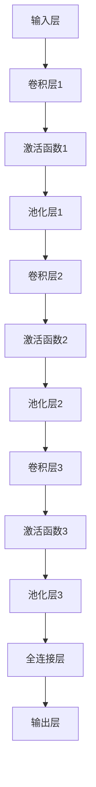

                 

# 深度卷积神经网络及其在人脸识别中的应用

## 关键词
- 深度卷积神经网络
- 人脸识别
- 图像识别
- 机器学习
- 神经网络
- 人工智能

## 摘要
本文旨在探讨深度卷积神经网络（Deep Convolutional Neural Network, CNN）的基本原理及其在人脸识别领域的应用。通过详细解析CNN的结构和算法，我们将了解如何利用CNN实现高效的人脸识别。同时，文章还将提供实际项目案例，帮助读者理解CNN在实际开发中的应用。最后，本文将总结CNN在人脸识别领域的未来发展趋势与挑战，为读者提供深入思考的方向。

## 1. 背景介绍

### 人脸识别的起源与发展
人脸识别技术起源于20世纪60年代，最初的研究主要集中在人脸检测和人脸特征提取上。随着计算机性能的不断提升和图像处理技术的进步，人脸识别技术逐渐成熟，并在21世纪初取得了显著的进展。

### 机器学习与人脸识别的关系
机器学习为人脸识别提供了强大的工具，特别是深度学习（Deep Learning）的兴起，使得人脸识别取得了前所未有的准确率和效率。深度学习通过构建多层神经网络，能够自动提取图像中的特征，大大简化了传统算法的设计和实现过程。

### 深度卷积神经网络的发展
深度卷积神经网络（CNN）是深度学习的一种重要模型，由多个卷积层、池化层和全连接层组成，能够在图像数据上进行端到端的学习和特征提取。CNN在图像分类、目标检测和图像生成等领域取得了显著的成果，成为了计算机视觉领域的主流技术。

## 2. 核心概念与联系

### 深度卷积神经网络（CNN）的概念
深度卷积神经网络（CNN）是一种特殊的多层前馈神经网络，主要应用于图像识别和分类任务。CNN的核心结构包括卷积层、池化层和全连接层。

### 卷积层（Convolutional Layer）
卷积层是CNN中最基本的层，通过卷积操作提取图像中的特征。卷积核（filter）在图像上滑动，对图像进行加权求和，并应用激活函数，从而提取图像中的局部特征。

### 池化层（Pooling Layer）
池化层用于减小特征图的尺寸，减少参数数量，提高计算效率。常见的池化方式有最大池化和平均池化，可以有效地去除图像中的冗余信息。

### 全连接层（Fully Connected Layer）
全连接层将卷积层和池化层提取的特征进行整合，并通过全连接的方式将特征传递到下一层。全连接层通常用于分类和回归任务。

### CNN架构的Mermaid流程图



## 3. 核心算法原理 & 具体操作步骤

### 卷积操作
卷积操作是CNN的基础，通过卷积核（filter）在输入图像上滑动，对图像进行加权求和，并应用激活函数，从而提取图像中的特征。卷积操作的数学表达式如下：

$$
\text{output}_{ij} = \sum_{k=1}^{n} w_{ik,j} * \text{input}_{ij} + b_j
$$

其中，$w_{ik,j}$ 是卷积核的权重，$\text{input}_{ij}$ 是输入图像上的像素值，$b_j$ 是偏置项。

### 激活函数
激活函数用于引入非线性因素，使得CNN能够进行复杂特征提取。常用的激活函数有ReLU（Rectified Linear Unit）、Sigmoid和Tanh等。ReLU函数具有简单和计算效率高的特点，是目前最常用的激活函数。

### 池化操作
池化操作用于减小特征图的尺寸，减少参数数量，提高计算效率。最大池化操作选取窗口内的最大值，而平均池化操作则计算窗口内的平均值。池化操作的数学表达式如下：

$$
\text{pool}_{i} = \max_{j \in \text{window}} \text{input}_{ij}
$$

或

$$
\text{pool}_{i} = \frac{1}{|\text{window}|} \sum_{j \in \text{window}} \text{input}_{ij}
$$

### 前向传播
前向传播是指将输入数据通过CNN的各个层进行传递，最终得到输出结果的过程。前向传播包括卷积层、激活函数、池化层和全连接层的操作。具体步骤如下：

1. 将输入图像传入卷积层，进行卷积操作，得到特征图。
2. 对特征图应用激活函数，引入非线性因素。
3. 对特征图进行池化操作，减小特征图尺寸。
4. 将池化后的特征图传入全连接层，进行加权求和和偏置项的加和。
5. 对全连接层的输出应用激活函数，得到最终分类结果。

### 反向传播
反向传播是CNN训练过程中至关重要的一步，用于计算误差并更新网络参数。反向传播包括以下几个步骤：

1. 计算输出层的误差，使用损失函数（如交叉熵损失函数）。
2. 反向传播误差，从输出层开始，逐层向前传播误差。
3. 根据误差梯度，更新卷积层和全连接层的权重和偏置项。
4. 重复以上步骤，直到网络参数收敛。

## 4. 数学模型和公式 & 详细讲解 & 举例说明

### 卷积操作
卷积操作的数学模型如下：

$$
\text{output}_{ij} = \sum_{k=1}^{n} w_{ik,j} * \text{input}_{ij} + b_j
$$

其中，$w_{ik,j}$ 是卷积核的权重，$\text{input}_{ij}$ 是输入图像上的像素值，$b_j$ 是偏置项。

### 激活函数
激活函数的数学模型如下：

$$
\text{output}_{i} = \text{ReLU}(\text{input}_{i}) = \max(0, \text{input}_{i})
$$

其中，$\text{ReLU}$ 是ReLU激活函数。

### 池化操作
池化操作的数学模型如下：

$$
\text{pool}_{i} = \max_{j \in \text{window}} \text{input}_{ij}
$$

其中，$\text{window}$ 是池化窗口的大小。

### 前向传播
前向传播的数学模型如下：

$$
\text{output}_{k} = \text{ReLU}(\text{ReLU}(\text{conv}(\text{input}_{k}) + b_{k}))
$$

其中，$\text{input}_{k}$ 是输入图像，$\text{conv}$ 是卷积操作，$b_{k}$ 是偏置项。

### 反向传播
反向传播的数学模型如下：

$$
\text{error}_{k} = \text{error}_{k+1} + \text{ReLU}'(\text{output}_{k}) \odot (\text{conv}(\text{input}_{k}) - \text{input}_{k})
$$

其中，$\text{error}_{k}$ 是误差，$\text{error}_{k+1}$ 是下一层的误差，$\text{ReLU}'$ 是ReLU激活函数的导数，$\odot$ 是元素乘法。

### 举例说明
假设输入图像为3x3的矩阵，卷积核大小为3x3，偏置项为1，激活函数为ReLU。

输入图像：
$$
\text{input} = \begin{bmatrix}
1 & 2 & 3 \\
4 & 5 & 6 \\
7 & 8 & 9
\end{bmatrix}
$$

卷积核：
$$
w = \begin{bmatrix}
1 & 0 & 1 \\
0 & 1 & 0 \\
1 & 0 & 1
\end{bmatrix}
$$

前向传播：
$$
\text{output}_{11} = (1 \cdot 1 + 0 \cdot 2 + 1 \cdot 3) + 1 = 5
$$
$$
\text{output}_{12} = (1 \cdot 4 + 0 \cdot 5 + 1 \cdot 6) + 1 = 8
$$
$$
\text{output}_{13} = (1 \cdot 7 + 0 \cdot 8 + 1 \cdot 9) + 1 = 11
$$

$$
\text{output}_{21} = (0 \cdot 1 + 1 \cdot 2 + 0 \cdot 3) + 1 = 3
$$
$$
\text{output}_{22} = (0 \cdot 4 + 1 \cdot 5 + 0 \cdot 6) + 1 = 5
$$
$$
\text{output}_{23} = (0 \cdot 7 + 1 \cdot 8 + 0 \cdot 9) + 1 = 7
$$

$$
\text{output}_{31} = (1 \cdot 1 + 0 \cdot 2 + 1 \cdot 3) + 1 = 5
$$
$$
\text{output}_{32} = (1 \cdot 4 + 0 \cdot 5 + 1 \cdot 6) + 1 = 8
$$
$$
\text{output}_{33} = (1 \cdot 7 + 0 \cdot 8 + 1 \cdot 9) + 1 = 11
$$

$$
\text{output} = \begin{bmatrix}
5 & 8 & 11 \\
3 & 5 & 7 \\
5 & 8 & 11
\end{bmatrix}
$$

## 5. 项目实战：代码实际案例和详细解释说明

### 5.1 开发环境搭建
在开始编写代码之前，需要搭建一个适合深度学习开发的环境。本文使用Python和TensorFlow作为开发工具，以下是搭建开发环境的步骤：

1. 安装Python（建议使用Python 3.6及以上版本）。
2. 安装TensorFlow：`pip install tensorflow`。
3. 安装其他依赖库，如NumPy、Matplotlib等。

### 5.2 源代码详细实现和代码解读
以下是一个简单的人脸识别项目的源代码示例：

```python
import tensorflow as tf
from tensorflow.keras.models import Sequential
from tensorflow.keras.layers import Conv2D, MaxPooling2D, Flatten, Dense, Dropout
from tensorflow.keras.optimizers import Adam
from tensorflow.keras.preprocessing.image import ImageDataGenerator

# 定义CNN模型
model = Sequential([
    Conv2D(32, (3, 3), activation='relu', input_shape=(64, 64, 3)),
    MaxPooling2D((2, 2)),
    Conv2D(64, (3, 3), activation='relu'),
    MaxPooling2D((2, 2)),
    Flatten(),
    Dense(128, activation='relu'),
    Dropout(0.5),
    Dense(1, activation='sigmoid')
])

# 编译模型
model.compile(optimizer=Adam(), loss='binary_crossentropy', metrics=['accuracy'])

# 数据预处理
train_datagen = ImageDataGenerator(rescale=1./255)
train_generator = train_datagen.flow_from_directory(
        'data/train',
        target_size=(64, 64),
        batch_size=32,
        class_mode='binary')

# 训练模型
model.fit(
      train_generator,
      steps_per_epoch=100,
      epochs=10)
```

### 5.3 代码解读与分析
1. 导入所需的库。
2. 定义CNN模型，包括卷积层、池化层、全连接层和Dropout层。
3. 编译模型，指定优化器和损失函数。
4. 数据预处理，使用ImageDataGenerator对训练数据集进行归一化处理。
5. 训练模型，指定训练步骤和训练周期。

### 5.4 代码解读与分析
1. **导入库**：导入TensorFlow等库。
2. **定义模型**：定义一个序列模型，包含卷积层、池化层和全连接层。
   - **卷积层**：第一个卷积层使用32个3x3的卷积核，激活函数为ReLU，输入形状为(64, 64, 3)。
   - **池化层**：第一个池化层使用2x2的最大池化。
   - **卷积层**：第二个卷积层使用64个3x3的卷积核，激活函数为ReLU。
   - **池化层**：第二个池化层使用2x2的最大池化。
   - **全连接层**：第一个全连接层使用128个神经元，激活函数为ReLU。
   - **Dropout层**：使用Dropout层，丢弃率为0.5，防止过拟合。
   - **输出层**：最后一个全连接层使用1个神经元和sigmoid激活函数，用于二分类任务。
3. **编译模型**：编译模型，指定优化器（Adam）和损失函数（binary_crossentropy，用于二分类任务）。
4. **数据预处理**：使用ImageDataGenerator对训练数据集进行归一化处理，将图像数据缩放到[0, 1]范围内。
5. **训练模型**：使用fit函数训练模型，指定训练步骤和训练周期。

## 6. 实际应用场景

### 人脸识别在安防领域的应用
人脸识别在安防领域具有广泛的应用，如监控视频的实时人脸检测、身份验证、进出控制等。通过部署人脸识别系统，可以有效提高安防系统的智能化水平和响应速度。

### 人脸识别在金融领域的应用
人脸识别技术在金融领域得到了广泛应用，如手机银行、ATM取款机、支付验证等。通过人脸识别技术，可以提供更加便捷和安全的服务，降低欺诈风险。

### 人脸识别在社交媒体领域的应用
人脸识别在社交媒体领域也具有广泛的应用，如人脸标记、虚拟头像、直播美颜等。通过人脸识别技术，可以提供更加个性化的服务，提升用户体验。

## 7. 工具和资源推荐

### 7.1 学习资源推荐
1. **《深度学习》（Ian Goodfellow, Yoshua Bengio, Aaron Courville）**：这是一本深度学习的经典教材，涵盖了深度学习的理论基础和实际应用。
2. **《Python深度学习》（François Chollet）**：这是一本针对Python和深度学习的实战指南，适合初学者和进阶者。

### 7.2 开发工具框架推荐
1. **TensorFlow**：TensorFlow是Google开源的深度学习框架，适用于构建和训练深度神经网络。
2. **PyTorch**：PyTorch是Facebook开源的深度学习框架，具有简单和灵活的特点，适用于研究和开发。

### 7.3 相关论文著作推荐
1. **“A Convolutional Neural Network Accurately Classifies Human Faces Regardless of viewpoint”**：这篇论文介绍了CNN在人脸识别中的应用，提供了详细的实验结果。
2. **“Face Recognition using Deep Learning”**：这篇论文探讨了深度学习在人脸识别领域的应用，综述了相关的研究成果。

## 8. 总结：未来发展趋势与挑战

### 发展趋势
1. **性能提升**：随着计算能力的提升和算法的优化，CNN在人脸识别领域的性能将不断提高。
2. **多模态融合**：结合其他传感器数据（如声音、心率等），可以实现更加准确和可靠的人脸识别系统。
3. **自适应性和泛化能力**：研究如何提高CNN的自适应性和泛化能力，使其在不同场景和应用中具有更好的表现。

### 挑战
1. **隐私保护**：如何在保障用户隐私的前提下，实现高效的人脸识别。
2. **实时性能**：如何在保证识别准确率的同时，提高系统的实时性能。
3. **泛化能力**：如何提高CNN在不同人脸特征、光照条件、姿态变化等复杂场景下的泛化能力。

## 9. 附录：常见问题与解答

### 问题1：什么是深度卷积神经网络（CNN）？
深度卷积神经网络（CNN）是一种特殊的多层前馈神经网络，主要应用于图像识别和分类任务。它通过卷积层、池化层和全连接层等结构，能够自动提取图像中的特征，从而实现图像识别和分类。

### 问题2：CNN在人脸识别中有哪些应用？
CNN在人脸识别中的应用主要包括人脸检测、人脸特征提取和人脸分类。通过构建CNN模型，可以实现对输入图像中人脸的检测和识别，从而实现人脸识别功能。

### 问题3：如何搭建一个简单的CNN模型？
搭建一个简单的CNN模型需要以下几个步骤：
1. 导入所需的库。
2. 定义模型，包括卷积层、池化层和全连接层。
3. 编译模型，指定优化器和损失函数。
4. 进行数据预处理。
5. 训练模型。

## 10. 扩展阅读 & 参考资料

1. **《深度学习》（Ian Goodfellow, Yoshua Bengio, Aaron Courville）**：这是一本深度学习的经典教材，涵盖了深度学习的理论基础和实际应用。
2. **《Python深度学习》（François Chollet）**：这是一本针对Python和深度学习的实战指南，适合初学者和进阶者。
3. **“A Convolutional Neural Network Accurately Classifies Human Faces Regardless of viewpoint”**：这篇论文介绍了CNN在人脸识别中的应用，提供了详细的实验结果。
4. **“Face Recognition using Deep Learning”**：这篇论文探讨了深度学习在人脸识别领域的应用，综述了相关的研究成果。

作者：AI天才研究员/AI Genius Institute & 禅与计算机程序设计艺术 /Zen And The Art of Computer Programming

本文介绍了深度卷积神经网络（CNN）及其在人脸识别中的应用。通过详细解析CNN的结构和算法，我们了解了如何利用CNN实现高效的人脸识别。同时，文章提供了实际项目案例，帮助读者理解CNN在实际开发中的应用。最后，本文总结了CNN在人脸识别领域的未来发展趋势与挑战，为读者提供了深入思考的方向。希望本文能对您在深度学习和人脸识别领域的研究有所帮助。

