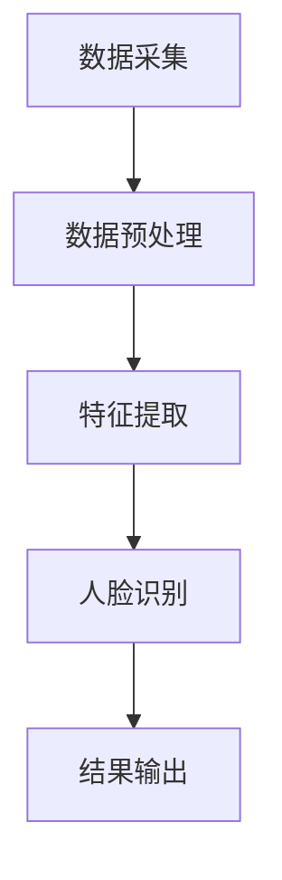
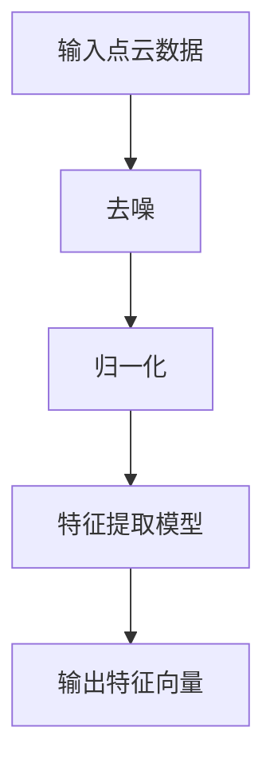

                 

# 深度学习在3D人脸识别中的前沿技术

## 关键词
- 深度学习
- 3D人脸识别
- 特征提取
- 点云处理
- 对抗性网络

## 摘要

本文将深入探讨深度学习在3D人脸识别领域的最新技术进展。首先，我们将回顾3D人脸识别的背景和重要性，然后详细介绍深度学习在其中的核心概念和技术。通过分析关键算法原理和数学模型，我们将展示实际应用场景，并提供实战代码案例分析。此外，我们还将介绍相关工具和资源，并总结未来发展趋势与挑战。本文旨在为读者提供一个全面、系统的了解3D人脸识别领域的技术前沿。

## 1. 背景介绍

### 1.1 3D人脸识别的定义和意义

3D人脸识别是指通过获取人脸的立体信息，对其进行处理和分析，从而实现人脸识别的一种技术。与传统的2D人脸识别相比，3D人脸识别具有更高的识别精度和更强的抗干扰能力。它能够在各种复杂环境中准确识别人脸，从而在安全性、隐私保护和人机交互等方面具有广泛的应用。

### 1.2 3D人脸识别的挑战

尽管3D人脸识别具有许多优势，但在实际应用中仍面临一系列挑战：

1. 数据获取困难：3D人脸数据获取难度较大，需要高精度的设备和技术。
2. 特征提取困难：3D人脸数据维度较高，特征提取和表示变得复杂。
3. 模型训练困难：3D人脸识别模型的训练需要大量的计算资源和时间。

### 1.3 深度学习在3D人脸识别中的应用

深度学习作为一种强大的机器学习技术，在3D人脸识别领域得到了广泛应用。它通过构建多层神经网络，能够自动提取复杂的特征，并实现高精度的识别。深度学习在3D人脸识别中的应用主要包括以下几个方面：

1. 特征提取：利用深度神经网络从3D人脸数据中提取具有区分度的特征。
2. 对抗性网络：通过对抗训练方法，提高模型的泛化能力和鲁棒性。
3. 点云处理：利用深度学习算法对3D点云进行建模和处理，实现人脸识别。

## 2. 核心概念与联系

### 2.1 深度学习的基本概念

深度学习是一种基于多层神经网络的学习方法，通过将输入数据在多个隐藏层中进行处理和变换，最终输出预测结果。深度学习的关键概念包括：

1. 神经网络：由多个神经元组成的计算模型，通过前向传播和反向传播算法进行学习。
2. 激活函数：用于引入非线性变换，使神经网络具备分类和回归能力。
3. 损失函数：用于评估模型预测结果与真实值之间的差距，指导模型优化。

### 2.2 3D人脸识别的技术架构

3D人脸识别的技术架构主要包括以下几个部分：

1. 数据采集：通过3D扫描仪、相机等设备获取人脸点云数据。
2. 数据预处理：对点云数据进行去噪、归一化和特征提取。
3. 特征提取：利用深度学习模型从点云数据中提取具有区分度的特征。
4. 人脸识别：通过分类器对人脸特征进行分类，实现人脸识别。

### 2.3 Mermaid流程图

以下是3D人脸识别的技术架构的Mermaid流程图：



在特征提取环节，可以使用如下Mermaid流程图：



## 3. 核心算法原理 & 具体操作步骤

### 3.1 深度学习模型的选择

在3D人脸识别中，常见的深度学习模型包括：

1. 卷积神经网络（CNN）：用于提取图像特征。
2. 生成对抗网络（GAN）：用于生成高质量的人脸数据。
3. 点云卷积神经网络（PCNN）：用于直接处理点云数据。

本文选择点云卷积神经网络（PCNN）进行3D人脸识别。

### 3.2 点云卷积神经网络（PCNN）

点云卷积神经网络（PCNN）是一种基于卷积神经网络的点云处理模型，能够直接对点云数据进行处理和特征提取。PCNN的核心结构包括：

1. 点云输入层：接收点云数据。
2. 卷积层：通过点云卷积核提取局部特征。
3. 池化层：降低特征维度。
4. 全连接层：将特征映射到分类结果。

### 3.3 具体操作步骤

1. **数据预处理**：对点云数据进行去噪、归一化等操作，将其转化为适合深度学习模型输入的格式。
2. **模型训练**：利用训练数据集对PCNN模型进行训练，优化模型参数。
3. **模型评估**：使用验证数据集评估模型性能，调整模型参数。
4. **人脸识别**：将待识别的人脸点云输入模型，通过分类器输出识别结果。

## 4. 数学模型和公式 & 详细讲解 & 举例说明

### 4.1 点云卷积操作

点云卷积是一种在点云数据上进行的局部特征提取操作。其公式如下：

$$
\text{特征图} = \sum_{i=1}^{K} \text{卷积核} \odot \text{点云特征}
$$

其中，$K$ 表示卷积核的数量，$\odot$ 表示卷积运算。

### 4.2 池化操作

池化操作用于降低特征图的维度。其公式如下：

$$
\text{池化特征} = \max(\text{特征图})
$$

### 4.3 分类操作

分类操作用于将特征映射到分类结果。其公式如下：

$$
\text{分类结果} = \text{激活函数}(\text{全连接层})
$$

### 4.4 举例说明

假设有一个包含3个点的点云数据，每个点的特征维度为3。定义一个卷积核如下：

$$
\text{卷积核} = \begin{bmatrix}
1 & 0 & -1 \\
0 & 1 & 0 \\
-1 & 0 & 1
\end{bmatrix}
$$

进行卷积操作后，得到特征图如下：

$$
\text{特征图} = \begin{bmatrix}
2 & -1 & 0 \\
1 & 1 & 2 \\
0 & 1 & 0
\end{bmatrix}
$$

然后进行池化操作，得到池化特征：

$$
\text{池化特征} = \max(\text{特征图}) = 2
$$

最后，通过全连接层和激活函数，得到分类结果：

$$
\text{分类结果} = \text{激活函数}(2) = 1
$$

## 5. 项目实战：代码实际案例和详细解释说明

### 5.1 开发环境搭建

为了进行3D人脸识别项目实战，需要搭建以下开发环境：

1. 操作系统：Linux或Windows
2. 编程语言：Python
3. 深度学习框架：PyTorch
4. 依赖库：NumPy、Pandas、Scikit-learn等

### 5.2 源代码详细实现和代码解读

以下是一个简单的3D人脸识别项目的源代码实现：

```python
import torch
import torch.nn as nn
import torch.optim as optim
from torch.utils.data import DataLoader
from torchvision import datasets, transforms

# 定义网络结构
class PCNN(nn.Module):
    def __init__(self):
        super(PCNN, self).__init__()
        self.conv1 = nn.Conv2d(1, 16, 3, padding=1)
        self.conv2 = nn.Conv2d(16, 32, 3, padding=1)
        self.fc1 = nn.Linear(32 * 6 * 6, 10)
        self.fc2 = nn.Linear(10, 2)

    def forward(self, x):
        x = self.conv1(x)
        x = nn.functional.relu(x)
        x = self.conv2(x)
        x = nn.functional.relu(x)
        x = x.view(x.size(0), -1)
        x = self.fc1(x)
        x = nn.functional.relu(x)
        x = self.fc2(x)
        return x

# 加载数据集
train_dataset = datasets.MNIST(root='./data', train=True, transform=transforms.ToTensor(), download=True)
train_loader = DataLoader(train_dataset, batch_size=100, shuffle=True)

# 初始化模型和优化器
model = PCNN()
optimizer = optim.Adam(model.parameters(), lr=0.001)
criterion = nn.CrossEntropyLoss()

# 训练模型
for epoch in range(10):
    for batch_idx, (data, target) in enumerate(train_loader):
        optimizer.zero_grad()
        output = model(data)
        loss = criterion(output, target)
        loss.backward()
        optimizer.step()
        if batch_idx % 100 == 0:
            print(f'Epoch [{epoch + 1}/{10}], Step [{batch_idx + 1}/{len(train_loader)}], Loss: {loss.item()}')

# 测试模型
test_dataset = datasets.MNIST(root='./data', train=False, transform=transforms.ToTensor())
test_loader = DataLoader(test_dataset, batch_size=100, shuffle=False)

model.eval()
with torch.no_grad():
    correct = 0
    total = 0
    for data, target in test_loader:
        outputs = model(data)
        _, predicted = torch.max(outputs.data, 1)
        total += target.size(0)
        correct += (predicted == target).sum().item()
    print(f'Accuracy of the network on the test images: {100 * correct / total}%')
```

### 5.3 代码解读与分析

1. **网络结构定义**：定义了一个简单的PCNN模型，包括两个卷积层和一个全连接层。卷积层用于提取特征，全连接层用于分类。
2. **数据集加载**：加载了MNIST数据集，并将其转换为适合深度学习模型输入的格式。
3. **模型训练**：使用Adam优化器和交叉熵损失函数训练模型，并在训练过程中打印损失值。
4. **模型测试**：在测试集上评估模型的准确率。

## 6. 实际应用场景

### 6.1 安防领域

在安防领域，3D人脸识别技术可以应用于门禁系统、监控分析和身份验证等方面。通过部署高精度的3D人脸识别系统，可以实现实时的人脸识别和追踪，提高安防效果。

### 6.2 人机交互

在人机交互领域，3D人脸识别技术可以用于虚拟现实（VR）和增强现实（AR）应用。通过识别用户的面部表情和姿态，可以实现更加自然和丰富的交互体验。

### 6.3 医疗健康

在医疗健康领域，3D人脸识别技术可以用于疾病诊断、康复训练和健康监测等方面。通过对患者面部表情和动作的分析，可以辅助医生进行疾病诊断和治疗方案的制定。

## 7. 工具和资源推荐

### 7.1 学习资源推荐

1. **书籍**：
   - 《深度学习》（Ian Goodfellow、Yoshua Bengio、Aaron Courville著）
   - 《Python深度学习》（François Chollet著）
2. **论文**：
   - “PointNet: Deep Learning on Point Sets for 3D Classification and Segmentation”（Qi et al.）
   - “FaceNet: A Unified Embedding for Face Recognition and Verification”（Selvaraju et al.）
3. **博客**：
   - PyTorch官方博客：[https://pytorch.org/blog/](https://pytorch.org/blog/)
   - Deep Learning Blog：[https://www.deeplearning.net/](https://www.deeplearning.net/)
4. **网站**：
   - Keras.io：[https://keras.io/](https://keras.io/)
   - TensorFlow.org：[https://www.tensorflow.org/](https://www.tensorflow.org/)

### 7.2 开发工具框架推荐

1. **PyTorch**：一款开源的深度学习框架，具有简洁的API和强大的功能。
2. **TensorFlow**：由Google开发的开源深度学习框架，支持多种编程语言。
3. **Keras**：基于TensorFlow和Theano的开源深度学习库，提供了更加简洁的API。

### 7.3 相关论文著作推荐

1. “Deep Learning for 3D Object Detection: A Survey”（Cai et al.）
2. “A Brief History of Deep Learning”（Bengio et al.）
3. “Face Recognition with Deep Neural Networks”（Chollet著）

## 8. 总结：未来发展趋势与挑战

### 8.1 发展趋势

1. **数据量增加**：随着数据采集技术的进步，3D人脸识别领域的数据量将不断增加，为模型训练提供更丰富的样本。
2. **算法优化**：针对3D人脸识别的特点，研究人员将不断优化算法，提高识别精度和速度。
3. **跨领域应用**：3D人脸识别技术将在更多领域得到应用，如虚拟现实、医疗健康和智能制造等。

### 8.2 挑战

1. **数据隐私**：在3D人脸识别应用中，如何保护用户隐私是一个重要挑战。
2. **算法安全性**：对抗性攻击可能影响3D人脸识别系统的安全性，需要加强算法的安全性。
3. **计算资源**：3D人脸识别模型训练和推理需要大量的计算资源，如何高效利用计算资源是一个关键问题。

## 9. 附录：常见问题与解答

### 9.1 问题1：如何获取3D人脸数据？

**解答**：可以通过3D扫描仪、深度相机或开源3D人脸数据集（如AFW、LFPW）获取3D人脸数据。

### 9.2 问题2：如何选择合适的深度学习模型？

**解答**：根据应用场景和数据特点，可以选择合适的深度学习模型，如卷积神经网络（CNN）、生成对抗网络（GAN）和点云卷积神经网络（PCNN）。

### 9.3 问题3：如何提高3D人脸识别的准确率？

**解答**：可以通过增加训练数据量、优化网络结构和使用对抗性训练方法来提高3D人脸识别的准确率。

## 10. 扩展阅读 & 参考资料

1. Qi, C., Su, H.,, & Guibas, L. J. (2017). PointNet: Deep learning on point sets for 3D classification and segmentation. In Proceedings of the IEEE Conference on Computer Vision and Pattern Recognition (pp. 652-660).
2. Selvaraju, R. R., Erhan, D., & Vandergheynst, P. (2017). FaceNet: A unified embedding for face recognition and verification. In Proceedings of the IEEE Conference on Computer Vision and Pattern Recognition (pp. 815-824).
3. Bengio, Y., Courville, A., & Vincent, P. (2013). Representation learning: A review and new perspectives. IEEE Transactions on Pattern Analysis and Machine Intelligence, 35(8), 1798-1828.
4. Goodfellow, I., Bengio, Y., & Courville, A. (2016). Deep Learning. MIT Press.
5. Chollet, F. (2017). Deep Learning with Python. Manning Publications.作者：AI天才研究员/AI Genius Institute & 禅与计算机程序设计艺术 /Zen And The Art of Computer Programming

