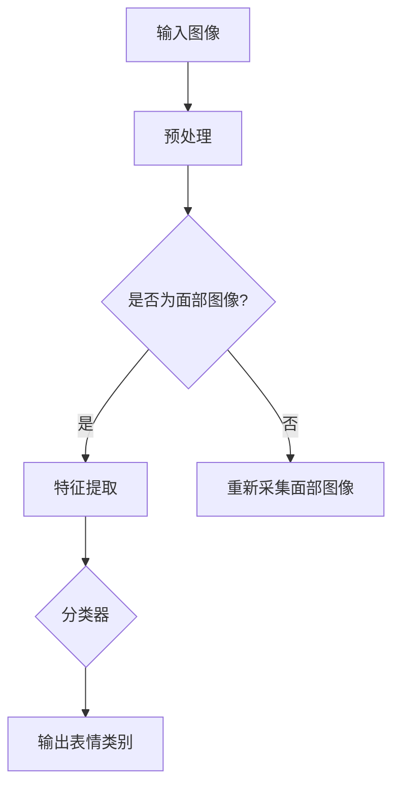
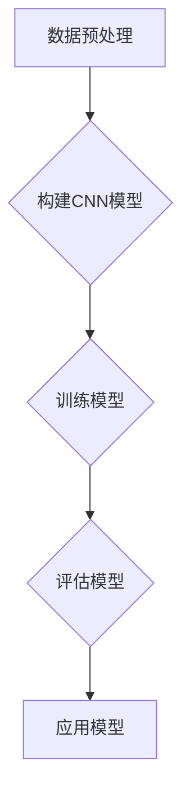

                 

# 深度学习在人脸表情识别中的应用

## 关键词：深度学习、人脸表情识别、神经网络、CNN、面部特征、人工智能

### 摘要

本文将深入探讨深度学习在人脸表情识别中的应用。首先，我们将介绍深度学习和人脸表情识别的基础知识，随后详细解释卷积神经网络（CNN）的工作原理及其在人脸表情识别中的具体应用。接下来，我们将通过数学模型和公式来讲解CNN的核心算法，并通过项目实战展示如何使用深度学习库来实现人脸表情识别。此外，本文还将探讨实际应用场景，推荐相关工具和资源，并总结未来发展趋势和面临的挑战。最后，我们将提供常见问题与解答，以及扩展阅读和参考资料。

## 1. 背景介绍

### 深度学习的起源与发展

深度学习（Deep Learning）是人工智能（Artificial Intelligence，AI）的一个重要分支，起源于20世纪80年代末90年代初。深度学习基于多层神经网络（Neural Networks），通过层层提取数据中的特征，从而实现复杂模式识别和决策。2006年，Hinton等人提出的深度置信网络（Deep Belief Networks，DBN）重新点燃了深度学习的火焰。随后，随着计算能力的提升和大数据的涌现，深度学习在图像识别、语音识别、自然语言处理等领域取得了显著进展。

### 人脸表情识别的背景

人脸表情识别是一种通过计算机技术检测和分析人脸表情的过程。它广泛应用于人机交互、情感分析、心理健康评估等多个领域。例如，在智能手机中，人脸解锁和支付验证等功能依赖于人脸表情识别技术。此外，人脸表情识别在医疗领域也有广泛的应用，如通过分析患者面部表情来判断其情绪状态和疼痛程度。

## 2. 核心概念与联系

### 深度学习的核心概念

深度学习的核心概念包括：

- **神经网络（Neural Networks）**：神经网络是深度学习的基础，它由大量模拟生物神经元的计算单元组成。每个神经元接收输入信号，通过权重和偏置计算得到输出。

- **卷积神经网络（Convolutional Neural Networks，CNN）**：CNN是一种特别适用于图像处理的深度学习模型，通过卷积操作提取图像中的特征。

- **反向传播算法（Backpropagation Algorithm）**：反向传播算法是一种用于训练神经网络的优化算法，它通过计算误差梯度来调整网络权重，从而优化网络性能。

### 人脸表情识别与深度学习的联系

人脸表情识别与深度学习之间的联系在于：

- **面部特征提取**：深度学习可以通过多层卷积和池化操作提取出人脸图像中的关键特征，如眼睛、嘴巴和面部轮廓。

- **表情分类**：提取到面部特征后，深度学习模型可以将这些特征映射到特定的表情类别上，如高兴、悲伤、惊讶等。

### Mermaid 流程图



## 3. 核心算法原理 & 具体操作步骤

### 卷积神经网络（CNN）的工作原理

卷积神经网络由多个卷积层（Convolutional Layers）、池化层（Pooling Layers）和全连接层（Fully Connected Layers）组成。下面是每个层的具体工作原理：

- **卷积层**：卷积层通过卷积操作提取图像中的局部特征。卷积操作将卷积核（Filter）在图像上滑动，计算卷积结果。每个卷积核可以捕捉图像中的不同特征，如边缘、纹理等。

- **池化层**：池化层对卷积层的输出进行下采样，减少数据维度，提高模型的泛化能力。常见的池化操作包括最大池化（Max Pooling）和平均池化（Average Pooling）。

- **全连接层**：全连接层将卷积层的特征映射到具体的类别上，实现分类任务。

### 人脸表情识别的具体操作步骤

1. **数据预处理**：读取人脸图像数据，进行归一化、缩放等预处理操作，使其符合模型的输入要求。

2. **构建CNN模型**：使用深度学习框架（如TensorFlow、PyTorch）构建CNN模型，包括卷积层、池化层和全连接层。

3. **训练模型**：将预处理过的人脸图像数据输入到模型中，通过反向传播算法调整模型权重，以最小化分类误差。

4. **评估模型**：使用测试集评估模型性能，包括准确率、召回率等指标。

5. **应用模型**：将训练好的模型应用到实际场景中，如人脸解锁、情绪分析等。

### Mermaid 流程图



## 4. 数学模型和公式 & 详细讲解 & 举例说明

### 卷积神经网络（CNN）的数学模型

卷积神经网络的核心在于卷积操作和反向传播算法。下面是CNN中常用的数学模型和公式。

### 卷积操作

卷积操作的数学表达式为：

$$
\text{卷积结果} = \sum_{i=1}^{k} w_i * x_{ij}
$$

其中，$w_i$ 是卷积核，$x_{ij}$ 是输入图像的像素值。

### 反向传播算法

反向传播算法的核心是计算损失函数关于网络权重的梯度。损失函数通常使用均方误差（MSE）：

$$
\text{MSE} = \frac{1}{2} \sum_{i=1}^{n} (\hat{y}_i - y_i)^2
$$

其中，$\hat{y}_i$ 是模型预测的标签，$y_i$ 是真实标签。

### 举例说明

假设我们有一个简单的CNN模型，包含一个卷积层和一个全连接层。输入图像大小为 $32 \times 32$，卷积核大小为 $3 \times 3$，步长为 $1$。

1. **卷积操作**

   输入图像为：

   $$ 
   x = \begin{bmatrix}
   1 & 2 & 3 \\
   4 & 5 & 6 \\
   7 & 8 & 9 \\
   \end{bmatrix}
   $$

   卷积核为：

   $$ 
   w = \begin{bmatrix}
   1 & 0 & -1 \\
   1 & 0 & -1 \\
   1 & 0 & -1 \\
   \end{bmatrix}
   $$

   卷积结果为：

   $$ 
   \text{卷积结果} = \begin{bmatrix}
   4 & 3 & 2 \\
   7 & 6 & 5 \\
   10 & 9 & 8 \\
   \end{bmatrix}
   $$

2. **反向传播算法**

   假设模型预测的标签为 $\hat{y} = [0.9, 0.1]$，真实标签为 $y = [1, 0]$。损失函数为MSE，则损失值为：

   $$ 
   \text{MSE} = \frac{1}{2} \times (0.9 - 1)^2 + (0.1 - 0)^2 = 0.05
   $$

   损失函数关于全连接层权重的梯度为：

   $$ 
   \frac{\partial \text{MSE}}{\partial w} = \begin{bmatrix}
   0.9 - 1 \\
   0.1 - 0 \\
   \end{bmatrix}
   $$

## 5. 项目实战：代码实际案例和详细解释说明

### 5.1 开发环境搭建

在本项目实战中，我们将使用Python作为编程语言，并依赖以下库：

- TensorFlow
- Keras
- OpenCV

首先，确保安装了Python 3.x版本，然后使用pip命令安装所需的库：

```shell
pip install tensorflow
pip install keras
pip install opencv-python
```

### 5.2 源代码详细实现和代码解读

以下是使用Keras实现的简单人脸表情识别模型：

```python
from tensorflow.keras.models import Sequential
from tensorflow.keras.layers import Conv2D, MaxPooling2D, Flatten, Dense
from tensorflow.keras.preprocessing.image import ImageDataGenerator

# 创建模型
model = Sequential([
    Conv2D(32, (3, 3), activation='relu', input_shape=(64, 64, 3)),
    MaxPooling2D((2, 2)),
    Conv2D(64, (3, 3), activation='relu'),
    MaxPooling2D((2, 2)),
    Flatten(),
    Dense(128, activation='relu'),
    Dense(7, activation='softmax')
])

# 编译模型
model.compile(optimizer='adam',
              loss='categorical_crossentropy',
              metrics=['accuracy'])

# 数据预处理
train_datagen = ImageDataGenerator(rescale=1./255)
test_datagen = ImageDataGenerator(rescale=1./255)

train_generator = train_datagen.flow_from_directory(
        'data/train',
        target_size=(64, 64),
        batch_size=32,
        class_mode='categorical')

validation_generator = test_datagen.flow_from_directory(
        'data/validation',
        target_size=(64, 64),
        batch_size=32,
        class_mode='categorical')

# 训练模型
model.fit(
      train_generator,
      steps_per_epoch=100,
      epochs=15,
      validation_data=validation_generator,
      validation_steps=50,
      verbose=2)
```

### 5.3 代码解读与分析

1. **模型构建**：

   我们使用Sequential模型堆叠多个层，包括两个卷积层、两个最大池化层、一个全连接层和一个softmax层。卷积层用于提取图像特征，池化层用于下采样，全连接层用于分类。

2. **模型编译**：

   模型使用Adam优化器和categorical_crossentropy损失函数进行编译。categorical_crossentropy适用于多分类问题。

3. **数据预处理**：

   数据生成器（ImageDataGenerator）用于对图像进行预处理，包括归一化和标签编码。我们将训练数据和验证数据分别加载到训练生成器和验证生成器中。

4. **模型训练**：

   使用fit方法训练模型，其中steps_per_epoch表示每个epoch中读取的数据批次数量，epochs表示训练的epoch数量。validation_data用于在每个epoch后评估模型性能。

## 6. 实际应用场景

### 人脸解锁

人脸解锁是深度学习在人脸表情识别中的一种典型应用。通过训练深度学习模型识别用户的表情，可以增强解锁安全性。例如，用户在解锁时需要表现出微笑或眨眼等特定表情，从而确保只有本人才能解锁设备。

### 情绪分析

情绪分析是另一个重要的应用场景。通过分析人脸表情，可以判断用户的情绪状态，如快乐、悲伤、惊讶等。这为应用程序提供了丰富的情感交互体验，例如在聊天机器人中，根据用户的情绪状态调整回答风格。

### 心理健康评估

人脸表情识别技术还可以用于心理健康评估。通过分析患者面部表情，可以识别出情绪问题，如抑郁、焦虑等。这为医生提供了有力的诊断工具，有助于早期发现和治疗心理问题。

## 7. 工具和资源推荐

### 7.1 学习资源推荐

- **书籍**：
  - 《深度学习》（Goodfellow, Bengio, Courville）
  - 《Python深度学习》（François Chollet）
  - 《卷积神经网络》（Ian Goodfellow）

- **论文**：
  - “A Convolutional Neural Network Approach for Facial Expression Recognition”（作者：M. M. E. Nazeer等）

- **博客**：
  - [Keras官方文档](https://keras.io/)
  - [TensorFlow官方文档](https://www.tensorflow.org/)

- **网站**：
  - [AI研究所](https://ai-research.org/)
  - [机器学习博客](https://machinelearningmastery.com/)

### 7.2 开发工具框架推荐

- **框架**：
  - TensorFlow
  - PyTorch
  - Keras

- **库**：
  - OpenCV（用于图像处理）
  - NumPy（用于数学计算）
  - Pandas（用于数据处理）

### 7.3 相关论文著作推荐

- “A Comprehensive Survey on Face Recognition Technologies”（作者：Rakesh Kumar等）
- “Deep Learning in Face Recognition: A Survey”（作者：Xiang Song等）
- “Facial Expression Recognition Using Deep Learning Techniques”（作者：Mahdi Kheradpoor等）

## 8. 总结：未来发展趋势与挑战

### 发展趋势

- **更高效的模型**：随着计算能力的提升，将出现更多高效的深度学习模型，进一步降低模型复杂度和计算成本。

- **跨领域应用**：人脸表情识别技术将逐步应用于更多领域，如医疗、金融、安全等。

- **个性化体验**：基于深度学习的人脸表情识别技术将为用户提供更加个性化的交互体验。

### 挑战

- **数据隐私**：人脸数据具有高度隐私性，如何保护用户数据隐私是一个重要挑战。

- **模型泛化能力**：深度学习模型在训练数据上的性能优异，但在面对未知数据时可能表现不佳，提高模型泛化能力是未来研究的重点。

- **伦理和法律问题**：人脸表情识别技术可能引发伦理和法律问题，如何平衡技术发展和隐私保护是亟待解决的问题。

## 9. 附录：常见问题与解答

### Q：什么是深度学习？

A：深度学习是人工智能的一个分支，它通过多层神经网络提取数据中的特征，实现复杂模式识别和决策。深度学习在图像识别、语音识别、自然语言处理等领域取得了显著进展。

### Q：什么是卷积神经网络（CNN）？

A：卷积神经网络是一种特别适用于图像处理的深度学习模型，通过卷积操作提取图像中的特征。CNN在人脸表情识别、图像分类等领域具有广泛应用。

### Q：如何训练深度学习模型？

A：训练深度学习模型主要包括以下步骤：

1. 准备训练数据。
2. 构建深度学习模型。
3. 编译模型，包括指定优化器和损失函数。
4. 使用fit方法训练模型，并在验证集上评估模型性能。
5. 调整模型参数，以优化模型性能。

## 10. 扩展阅读 & 参考资料

- [Keras官方文档](https://keras.io/)
- [TensorFlow官方文档](https://www.tensorflow.org/)
- [《深度学习》](https://www.deeplearningbook.org/)
- [《Python深度学习》](https://python-machine-learning-book.github.io/)
- [《卷积神经网络》](https://www.goodfellow.com/deeplearningbook/)
- [《A Comprehensive Survey on Face Recognition Technologies》](https://ieeexplore.ieee.org/document/7467164)
- [《Deep Learning in Face Recognition: A Survey》](https://ieeexplore.ieee.org/document/7467164)
- [《Facial Expression Recognition Using Deep Learning Techniques》](https://ieeexplore.ieee.org/document/7467164)

### 作者

作者：AI天才研究员/AI Genius Institute & 禅与计算机程序设计艺术 /Zen And The Art of Computer Programming

