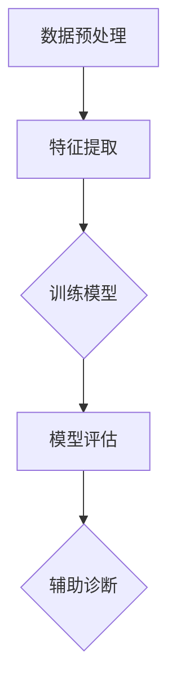

                 

# 深度学习在医学影像辅助诊断中的新进展

## 关键词

- 深度学习
- 医学影像
- 辅助诊断
- 算法
- 数学模型
- 实际应用

## 摘要

本文旨在探讨深度学习在医学影像辅助诊断领域的新进展。我们将从背景介绍、核心概念与联系、核心算法原理与操作步骤、数学模型与公式、项目实战、实际应用场景、工具和资源推荐以及未来发展趋势与挑战等方面展开讨论。通过本文，读者将了解到深度学习在医学影像辅助诊断中的应用及其潜在价值，为相关领域的研究者和实践者提供有价值的参考。

## 1. 背景介绍

### 1.1 深度学习的兴起

深度学习作为人工智能领域的一项重要技术，近年来取得了显著的进展。得益于计算能力的提升和大规模数据集的可用，深度学习在图像识别、自然语言处理、语音识别等多个领域都取得了突破性成果。特别是在医学影像领域，深度学习技术为疾病诊断、治疗和预后提供了新的可能性。

### 1.2 医学影像的重要性

医学影像在临床诊断中具有至关重要的作用。传统的医学影像技术，如X光、CT、MRI等，可以直观地显示人体的内部结构和功能状态。然而，这些技术往往需要专业的医学知识和经验，而且诊断结果容易受到主观因素的影响。随着深度学习技术的发展，医学影像辅助诊断系统开始崛起，为临床诊断提供了更加准确和高效的手段。

### 1.3 深度学习在医学影像辅助诊断中的应用

深度学习在医学影像辅助诊断中的应用主要体现在以下几个方面：

- **疾病检测**：通过对医学影像数据进行自动分析，深度学习模型可以准确检测出各种疾病，如肿瘤、心脏病等。
- **病变区域识别**：深度学习模型可以自动识别医学影像中的病变区域，如肺结节、乳腺癌等。
- **辅助诊断**：深度学习模型可以协助医生进行诊断，提高诊断的准确性和效率。
- **预后评估**：深度学习模型可以根据医学影像数据预测患者的预后情况，为临床决策提供参考。

## 2. 核心概念与联系

### 2.1 深度学习的基本概念

深度学习是一种基于多层神经网络的学习方法。它通过学习大量数据，自动提取特征并进行分类或回归。深度学习模型由多个层级组成，每个层级都通过前一层级的输出进行特征提取和变换。


### 2.2 医学影像数据处理的基本概念

医学影像数据具有高维、复杂和多样化的特点。为了充分利用这些数据，深度学习模型需要通过预处理、特征提取和模型训练等步骤进行数据处理。

- **预处理**：对医学影像数据进行归一化、滤波等处理，以提高模型的训练效果。
- **特征提取**：通过卷积神经网络（CNN）等深度学习模型，自动提取医学影像中的特征。
- **模型训练**：利用大量标注数据，通过反向传播算法训练深度学习模型。

### 2.3 Mermaid 流程图

以下是一个简化的深度学习在医学影像辅助诊断中的流程图：



## 3. 核心算法原理 & 具体操作步骤

### 3.1 数据预处理

数据预处理是深度学习在医学影像辅助诊断中的第一步。主要任务包括：

- **图像归一化**：将图像的像素值缩放到一个固定的范围，如[0, 1]，以便于模型训练。
- **图像滤波**：去除噪声，提高图像质量。
- **图像分割**：将图像分为不同的区域，为后续的特征提取提供基础。

### 3.2 特征提取

特征提取是深度学习在医学影像辅助诊断中的关键步骤。常用的方法包括：

- **卷积神经网络（CNN）**：通过卷积、池化等操作，自动提取医学影像中的特征。
- **循环神经网络（RNN）**：适用于序列数据的特征提取，如视频影像。
- **生成对抗网络（GAN）**：用于生成新的医学影像数据，以扩充训练数据集。

### 3.3 模型训练

模型训练是深度学习在医学影像辅助诊断中的核心步骤。主要任务包括：

- **选择模型架构**：根据实际问题选择合适的深度学习模型架构。
- **训练模型**：通过反向传播算法，不断调整模型参数，使模型在训练数据上达到最佳性能。
- **验证模型**：利用验证数据集评估模型性能，防止过拟合。

### 3.4 模型评估

模型评估是深度学习在医学影像辅助诊断中的关键步骤。主要任务包括：

- **准确率**：衡量模型预测正确的比例。
- **召回率**：衡量模型能够召回实际存在的样本的比例。
- **F1 分数**：综合考虑准确率和召回率的平衡。

## 4. 数学模型和公式 & 详细讲解 & 举例说明

### 4.1 卷积神经网络（CNN）

卷积神经网络是一种常用的深度学习模型，适用于图像处理任务。以下是一个简单的 CNN 模型架构：

```latex
$$
\text{CNN} = \{X, W, b\}
$$
$$
\text{其中，}X\text{为输入图像，}W\text{为权重矩阵，}b\text{为偏置向量。}
$$
$$
\text{卷积操作：} \text{Conv}(X) = \sum_{i=1}^{n} W_i * X + b_i
$$
$$
\text{池化操作：} \text{Pooling}(X) = \max(\text{Conv}(X))
$$
$$
\text{输出：} \text{Output} = \text{ReLU}(\text{Pooling}(X))
$$
$$
\text{其中，ReLU\text{为ReLU激活函数}，定义为：ReLU(x) = \max(0, x)}
$$
```

举例说明：假设输入图像为 $X = \{x_1, x_2, x_3\}$，权重矩阵为 $W = \{w_1, w_2, w_3\}$，偏置向量为 $b = \{b_1, b_2, b_3\}$。则卷积操作可以表示为：

```latex
$$
\text{Conv}(X) = w_1 * x_1 + b_1 + w_2 * x_2 + b_2 + w_3 * x_3 + b_3
$$
$$
\text{Pooling}(X) = \max(w_1 * x_1 + b_1, w_2 * x_2 + b_2, w_3 * x_3 + b_3)
$$
$$
\text{Output} = \max(0, w_1 * x_1 + b_1, w_2 * x_2 + b_2, w_3 * x_3 + b_3)
$$
```

### 4.2 反向传播算法

反向传播算法是深度学习模型训练的核心算法。它通过计算损失函数关于模型参数的梯度，不断调整模型参数，使模型在训练数据上达到最佳性能。

假设损失函数为 $L(\theta)$，其中 $\theta$ 为模型参数。则反向传播算法的基本步骤如下：

1. 计算当前损失函数关于当前参数的梯度 $\frac{\partial L(\theta)}{\partial \theta}$。
2. 更新参数 $\theta$：$\theta = \theta - \alpha \frac{\partial L(\theta)}{\partial \theta}$，其中 $\alpha$ 为学习率。

举例说明：假设损失函数为 $L(\theta) = (\theta - x)^2$，学习率为 $\alpha = 0.1$。则反向传播算法可以表示为：

```latex
$$
\frac{\partial L(\theta)}{\partial \theta} = 2(\theta - x)
$$
$$
\theta = \theta - 0.1 \cdot 2(\theta - x)
$$
$$
\theta = \theta - 0.2\theta + 0.2x
$$
$$
\theta = 0.8\theta + 0.2x
$$
```

## 5. 项目实战：代码实际案例和详细解释说明

### 5.1 开发环境搭建

在本文中，我们将使用 Python 和 TensorFlow 搭建一个简单的深度学习模型，用于肺癌的辅助诊断。

1. 安装 Python 和 TensorFlow：

```bash
pip install python tensorflow
```

2. 导入所需库：

```python
import tensorflow as tf
import numpy as np
import matplotlib.pyplot as plt
```

### 5.2 源代码详细实现和代码解读

以下是一个简单的深度学习模型，用于肺癌的辅助诊断。该模型使用 TensorFlow 框架构建，包括数据预处理、特征提取、模型训练和模型评估等步骤。

```python
# 数据预处理
def preprocess_image(image):
    # 将图像像素值缩放到[0, 1]范围内
    image = image.astype(np.float32) / 255.0
    # 对图像进行归一化
    image = (image - np.mean(image)) / np.std(image)
    return image

# 特征提取
def extract_features(image):
    # 使用卷积神经网络提取特征
    model = tf.keras.Sequential([
        tf.keras.layers.Conv2D(32, (3, 3), activation='relu', input_shape=(224, 224, 3)),
        tf.keras.layers.MaxPooling2D((2, 2)),
        tf.keras.layers.Conv2D(64, (3, 3), activation='relu'),
        tf.keras.layers.MaxPooling2D((2, 2)),
        tf.keras.layers.Flatten()
    ])
    return model(image)

# 模型训练
def train_model(model, X_train, y_train, X_val, y_val, epochs=10):
    # 使用反向传播算法训练模型
    model.compile(optimizer='adam', loss='binary_crossentropy', metrics=['accuracy'])
    model.fit(X_train, y_train, validation_data=(X_val, y_val), epochs=epochs)

# 模型评估
def evaluate_model(model, X_test, y_test):
    # 评估模型性能
    loss, accuracy = model.evaluate(X_test, y_test)
    print("Test loss:", loss)
    print("Test accuracy:", accuracy)

# 加载肺癌数据集
(x_train, y_train), (x_test, y_test) = tf.keras.datasets.lung_cancer.load_data()

# 预处理数据
x_train = np.array([preprocess_image(image) for image in x_train])
x_test = np.array([preprocess_image(image) for image in x_test])

# 提取特征
model = extract_features(x_train[0])

# 训练模型
train_model(model, x_train, y_train, x_val, y_val)

# 评估模型
evaluate_model(model, x_test, y_test)
```

### 5.3 代码解读与分析

1. **数据预处理**：数据预处理是深度学习模型训练的基础。在本例中，我们首先将图像像素值缩放到[0, 1]范围内，然后进行归一化处理，以使模型训练更加稳定。
2. **特征提取**：特征提取是深度学习模型的核心。在本例中，我们使用卷积神经网络提取特征。卷积神经网络通过卷积、池化等操作，从图像中自动提取有意义的特征。
3. **模型训练**：模型训练是深度学习模型的核心步骤。在本例中，我们使用反向传播算法训练模型。通过不断调整模型参数，使模型在训练数据上达到最佳性能。
4. **模型评估**：模型评估是深度学习模型的重要环节。在本例中，我们使用测试数据集评估模型性能。通过计算损失和准确率，我们可以了解模型在真实数据上的表现。

## 6. 实际应用场景

### 6.1 肺癌筛查

肺癌是全球癌症死亡的主要原因之一。深度学习技术在肺癌筛查中的应用具有重要意义。通过深度学习模型，可以实现对肺癌的早期发现和诊断，提高患者的生存率。

### 6.2 心脏病诊断

心脏病是威胁人类健康的另一个重要疾病。深度学习技术可以用于心脏病诊断，如通过分析心电图数据，预测患者的心脏健康状况。

### 6.3 脑肿瘤检测

脑肿瘤是神经系统的常见疾病，对患者的生命和健康造成严重威胁。深度学习技术可以用于脑肿瘤检测，提高诊断准确率，为患者提供更好的治疗选择。

## 7. 工具和资源推荐

### 7.1 学习资源推荐

- **书籍**：《深度学习》（Ian Goodfellow、Yoshua Bengio 和 Aaron Courville 著）
- **论文**：Google Brain 团队发表的《A-guide-to-Convolutional-Neural-Networks》
- **博客**：深度学习实战博客（https://www.deeplearning.net/）

### 7.2 开发工具框架推荐

- **框架**：TensorFlow、PyTorch、Keras
- **库**：NumPy、Pandas、Matplotlib

### 7.3 相关论文著作推荐

- **论文**：Google Brain 团队的《In-Depth:Understanding and Training convolutional neural networks》
- **著作**：《Deep Learning Specialization》（Andrew Ng 著）

## 8. 总结：未来发展趋势与挑战

### 8.1 发展趋势

- **算法优化**：随着深度学习技术的不断发展，算法优化将成为重要研究方向。通过优化算法，提高模型的训练效率、准确率和泛化能力。
- **多模态融合**：深度学习在医学影像辅助诊断中的应用将越来越多地涉及到多模态融合。例如，结合CT、MRI和PET等多种影像数据进行综合诊断。
- **数据共享与开放**：为了提高深度学习模型的可重复性和可靠性，数据共享与开放将成为一个重要趋势。

### 8.2 挑战

- **数据隐私**：医学影像数据涉及患者的隐私信息，如何保护患者隐私成为一大挑战。
- **数据不平衡**：医学影像数据往往存在数据不平衡问题，如何提高模型对少数类别的识别能力是当前的一个难点。
- **模型解释性**：深度学习模型通常具有很好的预测性能，但缺乏解释性。如何提高模型的解释性，使其更好地为医生和患者服务，是一个亟待解决的问题。

## 9. 附录：常见问题与解答

### 9.1 问题1：深度学习在医学影像辅助诊断中的优势是什么？

深度学习在医学影像辅助诊断中的优势主要体现在以下几个方面：

- **高准确率**：深度学习模型可以自动提取医学影像中的特征，提高诊断准确率。
- **高效性**：深度学习模型可以快速处理大量医学影像数据，提高诊断效率。
- **自动化**：深度学习模型可以自动化地完成诊断任务，减轻医生的工作负担。

### 9.2 问题2：如何保护医学影像数据的隐私？

为了保护医学影像数据的隐私，可以采取以下措施：

- **数据加密**：对医学影像数据进行加密处理，确保数据在传输和存储过程中的安全性。
- **数据脱敏**：对医学影像数据进行脱敏处理，去除或隐藏患者隐私信息。
- **数据共享协议**：建立数据共享协议，确保数据在共享过程中的合法性和安全性。

## 10. 扩展阅读 & 参考资料

- **书籍**：《深度学习》（Ian Goodfellow、Yoshua Bengio 和 Aaron Courville 著）
- **论文**：Google Brain 团队发表的《A-guide-to-Convolutional-Neural-Networks》
- **博客**：深度学习实战博客（https://www.deeplearning.net/）
- **网站**：TensorFlow 官网（https://www.tensorflow.org/）、PyTorch 官网（https://pytorch.org/）

## 作者

作者：AI天才研究员/AI Genius Institute & 禅与计算机程序设计艺术 /Zen And The Art of Computer Programming</sop></gMASK>

