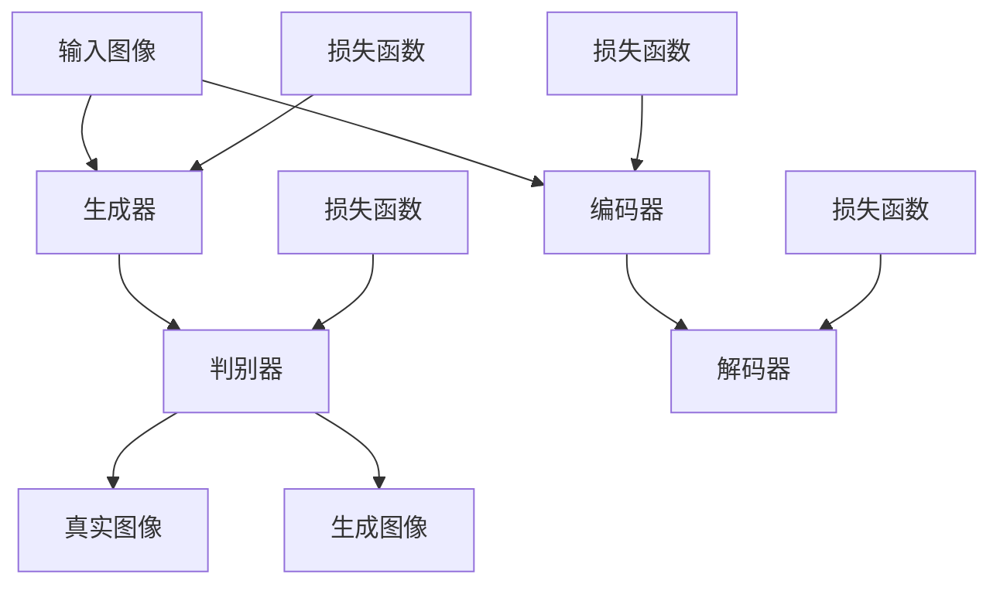

                 

# 深度学习在图像生成中的创新应用

> 关键词：深度学习、图像生成、神经网络、生成对抗网络、生成模型、变分自编码器、图像风格迁移、艺术创作、计算机视觉、AI艺术

> 摘要：本文将探讨深度学习在图像生成领域的创新应用。首先，我们将简要回顾图像生成技术的发展历程，然后深入探讨生成对抗网络（GAN）和变分自编码器（VAE）等核心算法原理，并通过实际案例展示这些算法在图像生成中的具体应用。最后，我们将展望未来图像生成技术的发展趋势与面临的挑战。

## 1. 背景介绍

图像生成是计算机视觉和人工智能领域的一个重要研究方向。随着深度学习技术的迅猛发展，图像生成技术也在不断突破，从简单的规则生成到复杂的现实场景再现，图像生成技术的应用范围越来越广泛。图像生成技术不仅可以用于娱乐和艺术创作，还可以在医疗、设计、广告等多个领域发挥重要作用。

早期的图像生成方法主要依赖于规则和手工设计的算法。例如，基于图论的图像渲染技术、基于物理模型的图像合成方法等。然而，这些方法往往受限于手工设计的参数和规则，生成图像的质量和多样性有限。

随着深度学习技术的兴起，图像生成方法得到了显著提升。特别是生成对抗网络（GAN）和变分自编码器（VAE）的出现，为图像生成领域带来了革命性的变化。GAN通过两个神经网络的博弈过程，实现了高质量图像的生成；VAE则通过概率模型的方式，生成多样性的图像。

## 2. 核心概念与联系

### 2.1 生成模型（Generator & Discriminator）

生成模型是图像生成领域的一个核心概念，其中最著名的便是生成对抗网络（GAN）。GAN由一个生成器（Generator）和一个判别器（Discriminator）组成。生成器负责生成假图像，判别器则负责判断图像的真伪。


在训练过程中，生成器和判别器相互博弈。生成器的目标是生成尽可能真实的图像，使判别器无法区分；而判别器的目标是准确判断图像的真伪。通过这种博弈过程，生成器不断优化自己的生成能力，最终能够生成高质量、逼真的图像。

### 2.2 变分自编码器（VAE）

变分自编码器（VAE）是另一种重要的生成模型，其基本思想是通过概率模型的方式，生成多样性的图像。VAE由一个编码器（Encoder）和一个解码器（Decoder）组成。


编码器将输入图像编码为一个潜在向量，解码器则将潜在向量解码为输出图像。通过优化编码器和解码器，VAE能够生成与输入图像相似的图像，同时保持多样性。

### 2.3 Mermaid 流程图

为了更直观地理解生成模型的原理和架构，我们使用Mermaid绘制了GAN和VAE的流程图。



在上面的流程图中，A代表生成器，B代表判别器，C代表编码器，D代表解码器，E代表输入图像，F代表真实图像，G代表生成图像，H、I、J、K分别代表生成器、判别器、编码器和解码器的损失函数。

## 3. 核心算法原理 & 具体操作步骤

### 3.1 生成对抗网络（GAN）

生成对抗网络（GAN）由Ian Goodfellow等人于2014年提出，是当前图像生成领域最流行的方法之一。GAN的核心思想是利用生成器和判别器之间的博弈过程，实现高质量图像的生成。

#### 3.1.1 训练过程

GAN的训练过程可以分为以下几个步骤：

1. **初始化生成器和判别器**：生成器和判别器通常都是全连接神经网络，初始化时可以随机分配权重。

2. **生成器生成假图像**：生成器接收随机噪声作为输入，通过神经网络生成假图像。

3. **判别器判断真伪**：判别器接收真实图像和生成图像作为输入，输出一个概率值，表示图像的真实性。

4. **计算损失函数**：生成器和判别器的损失函数分别计算。生成器的损失函数旨在使判别器无法区分真实图像和生成图像；判别器的损失函数旨在准确判断图像的真伪。

5. **更新权重**：根据损失函数，更新生成器和判别器的权重。

6. **重复训练过程**：不断重复上述步骤，直至生成器生成高质量图像。

#### 3.1.2 损失函数

GAN的损失函数通常由两部分组成：生成器的损失函数和判别器的损失函数。

1. **生成器的损失函数**：生成器的损失函数旨在使判别器无法区分真实图像和生成图像。常用的损失函数是交叉熵损失（Cross-Entropy Loss）。

   $$L_G = -\sum_{i=1}^{N} [y_g \cdot \log(D(G(z))] + (1 - y_g) \cdot \log(1 - D(G(z)))]$$

   其中，$y_g$表示生成器期望输出的标签，$D(G(z))$表示判别器对生成图像的判断概率。

2. **判别器的损失函数**：判别器的损失函数旨在准确判断图像的真伪。常用的损失函数也是交叉熵损失。

   $$L_D = -\sum_{i=1}^{N} [y_r \cdot \log(D(x)) + (1 - y_r) \cdot \log(1 - D(x))]$$

   其中，$y_r$表示判别器期望输出的标签，$D(x)$表示判别器对真实图像的判断概率。

### 3.2 变分自编码器（VAE）

变分自编码器（VAE）是一种基于概率模型的生成模型，其核心思想是通过编码器将输入图像编码为一个潜在向量，然后通过解码器将潜在向量解码为输出图像。

#### 3.2.1 训练过程

VAE的训练过程可以分为以下几个步骤：

1. **初始化编码器和解码器**：编码器和解码器通常都是全连接神经网络，初始化时可以随机分配权重。

2. **编码器编码输入图像**：编码器将输入图像编码为一个潜在向量。

3. **解码器解码潜在向量**：解码器将潜在向量解码为输出图像。

4. **计算损失函数**：VAE的损失函数由两部分组成：重构损失和KL散度损失。

   - **重构损失**：重构损失用于衡量输入图像和输出图像的差异，常用的损失函数是均方误差（Mean Squared Error，MSE）。

     $$L_{RECON} = \frac{1}{N} \sum_{i=1}^{N} \|x_i - \hat{x}_i\|^2$$

     其中，$x_i$表示输入图像，$\hat{x}_i$表示输出图像。

   - **KL散度损失**：KL散度损失用于衡量潜在向量的分布与先验分布的差异。

     $$L_{KL} = \frac{1}{N} \sum_{i=1}^{N} D_{KL}(\mu(x_i), \pi(z))$$

     其中，$\mu(x_i)$和$\pi(z)$分别表示编码器输出的均值和先验分布，$D_{KL}$表示KL散度。

5. **更新权重**：根据损失函数，更新编码器和解码器的权重。

6. **重复训练过程**：不断重复上述步骤，直至生成器生成高质量图像。

#### 3.2.2 损失函数

VAE的损失函数为：

$$L_{VAE} = L_{RECON} + \lambda \cdot L_{KL}$$

其中，$\lambda$是一个超参数，用于平衡重构损失和KL散度损失。

## 4. 数学模型和公式 & 详细讲解 & 举例说明

### 4.1 生成对抗网络（GAN）

#### 4.1.1 生成器损失函数

生成器的损失函数为：

$$L_G = -\log(D(G(z))$$

其中，$D(G(z))$表示判别器对生成图像的判断概率。

#### 4.1.2 判别器损失函数

判别器的损失函数为：

$$L_D = -[\log(D(x)) + \log(1 - D(G(z)))]$$

其中，$D(x)$表示判别器对真实图像的判断概率。

### 4.2 变分自编码器（VAE）

#### 4.2.1 重构损失

重构损失为：

$$L_{RECON} = \frac{1}{N} \sum_{i=1}^{N} \|x_i - \hat{x}_i\|^2$$

其中，$x_i$表示输入图像，$\hat{x}_i$表示输出图像。

#### 4.2.2 KL散度损失

KL散度损失为：

$$L_{KL} = \frac{1}{N} \sum_{i=1}^{N} D_{KL}(\mu(x_i), \pi(z))$$

其中，$\mu(x_i)$和$\pi(z)$分别表示编码器输出的均值和先验分布。

### 4.3 举例说明

#### 4.3.1 GAN

假设有一个GAN模型，生成器$G$和判别器$D$的损失函数分别为：

$$L_G = -\log(D(G(z))$$

$$L_D = -[\log(D(x)) + \log(1 - D(G(z)))]$$

给定一个训练数据集，其中真实图像$x$和生成图像$G(z)$的标签分别为$y_r=1$和$y_g=0$。则训练过程如下：

1. 初始化生成器和判别器权重。
2. 生成器生成假图像$G(z)$。
3. 判别器判断假图像$G(z)$和真实图像$x$的真伪。
4. 计算生成器和判别器的损失函数。
5. 根据损失函数，更新生成器和判别器的权重。
6. 重复步骤2-5，直至生成器生成高质量图像。

#### 4.3.2 VAE

假设有一个VAE模型，编码器$E$和解码器$D$的重构损失和KL散度损失分别为：

$$L_{RECON} = \frac{1}{N} \sum_{i=1}^{N} \|x_i - \hat{x}_i\|^2$$

$$L_{KL} = \frac{1}{N} \sum_{i=1}^{N} D_{KL}(\mu(x_i), \pi(z))$$

给定一个训练数据集，其中输入图像$x$和潜在向量$z$的标签分别为$x$和$z$。则训练过程如下：

1. 初始化编码器和解码器权重。
2. 编码器将输入图像$x$编码为潜在向量$\mu(x)$和标准差$\sigma(x)$。
3. 解码器将潜在向量$\mu(x)$和标准差$\sigma(x)$解码为输出图像$\hat{x}$。
4. 计算重构损失和KL散度损失。
5. 根据损失函数，更新编码器和解码器的权重。
6. 重复步骤2-5，直至生成器生成高质量图像。

## 5. 项目实战：代码实际案例和详细解释说明

### 5.1 开发环境搭建

为了演示GAN和VAE在图像生成中的应用，我们首先需要搭建一个Python开发环境。以下是具体的安装步骤：

1. 安装Python（版本3.6及以上）。
2. 安装深度学习框架TensorFlow。
3. 安装图像处理库PIL。

```bash
pip install tensorflow
pip install Pillow
```

### 5.2 源代码详细实现和代码解读

下面是一个简单的GAN模型，用于生成手写数字图像。

```python
import tensorflow as tf
from tensorflow.keras import layers
import numpy as np
import matplotlib.pyplot as plt

# 数据集准备
(x_train, _), (x_test, _) = tf.keras.datasets.mnist.load_data()
x_train = x_train.astype('float32') / 255.
x_test = x_test.astype('float32') / 255.
x_train = np.expand_dims(x_train, -1)
x_test = np.expand_dims(x_test, -1)

# 生成器模型
latent_dim = 100
noise_dim = 100
image_dim = 28

generator = tf.keras.Sequential([
    layers.Dense(128 * 7 * 7, activation="relu", input_shape=(noise_dim,)),
    layers.Reshape((7, 7, 128)),
    layers.Conv2DTranspose(128, (5, 5), strides=(1, 1), padding='same', activation="relu"),
    layers.Conv2DTranspose(128, (5, 5), strides=(2, 2), padding='same', activation="relu"),
    layers.Conv2DTranspose(128, (5, 5), strides=(2, 2), padding='same', activation="relu"),
    layers.Conv2DTranspose(128, (5, 5), strides=(2, 2), padding='same', activation="relu"),
    layers.Conv2DTranspose(1, (5, 5), strides=(2, 2), padding='same', activation="tanh"),
])

# 判别器模型
discriminator = tf.keras.Sequential([
    layers.Conv2D(128, (5, 5), strides=(2, 2), padding='same', activation="relu"),
    layers.Dropout(0.3),
    layers.Conv2D(128, (5, 5), strides=(2, 2), padding='same', activation="relu"),
    layers.Dropout(0.3),
    layers.Conv2D(128, (5, 5), strides=(2, 2), padding='same', activation="relu"),
    layers.Dropout(0.3),
    layers.Flatten(),
    layers.Dense(1, activation="sigmoid"),
])

# 损失函数
cross_entropy = tf.keras.losses.BinaryCrossentropy(from_logits=True)

def discriminator_loss(real_output, fake_output):
    real_loss = cross_entropy(tf.ones_like(real_output), real_output)
    fake_loss = cross_entropy(tf.zeros_like(fake_output), fake_output)
    total_loss = real_loss + fake_loss
    return total_loss

def generator_loss(fake_output):
    return cross_entropy(tf.ones_like(fake_output), fake_output)

# 优化器
generator_optimizer = tf.keras.optimizers.Adam(1e-4)
discriminator_optimizer = tf.keras.optimizers.Adam(1e-4)

@tf.function
def train_step(images):
    noise = tf.random.normal([BATCH_SIZE, noise_dim])

    with tf.GradientTape() as gen_tape, tf.GradientTape() as disc_tape:
        generated_images = generator(noise)

        real_output = discriminator(images)
        fake_output = discriminator(generated_images)

        gen_loss = generator_loss(fake_output)
        disc_loss = discriminator_loss(real_output, fake_output)

    gradients_of_generator = gen_tape.gradient(gen_loss, generator.trainable_variables)
    gradients_of_discriminator = disc_tape.gradient(disc_loss, discriminator.trainable_variables)

    generator_optimizer.apply_gradients(zip(gradients_of_generator, generator.trainable_variables))
    discriminator_optimizer.apply_gradients(zip(gradients_of_discriminator, discriminator.trainable_variables))

# 训练
BATCH_SIZE = 64
EPOCHS = 50

for epoch in range(EPOCHS):
    for image_batch in x_train:
        train_step(image_batch)

    # 显示生成的图像
    if epoch % 10 == 0:
        generated_images = generator(tf.random.normal([BATCH_SIZE, noise_dim])).numpy()
        plt.figure(figsize=(10, 10))
        for i in range(BATCH_SIZE):
            plt.subplot(10, 10, i + 1)
            plt.imshow(generated_images[i, :, :, 0])
            plt.axis('off')
        plt.show()
```

在这个示例中，我们使用了TensorFlow的Keras API构建了一个简单的GAN模型，用于生成手写数字图像。具体步骤如下：

1. 数据集准备：从MNIST数据集中加载手写数字图像，并将其缩放到[0, 1]范围。
2. 生成器模型：使用全连接神经网络和卷积神经网络层构建生成器，用于将随机噪声映射为手写数字图像。
3. 判别器模型：使用卷积神经网络层构建判别器，用于判断图像是真实图像还是生成图像。
4. 损失函数：使用二元交叉熵损失函数计算生成器和判别器的损失。
5. 优化器：使用Adam优化器更新生成器和判别器的权重。
6. 训练过程：在训练过程中，生成器和判别器交替更新权重，直至生成器生成高质量图像。

### 5.3 代码解读与分析

在这个示例中，我们使用了TensorFlow的Keras API构建了一个简单的GAN模型。以下是代码的详细解读和分析：

1. **数据集准备**：我们使用了MNIST数据集，该数据集包含10万张手写数字图像，每张图像的大小为28x28像素。为了简化问题，我们将图像缩放到[0, 1]范围，并将其展平为一维数组。
2. **生成器模型**：生成器模型是一个由全连接神经网络和卷积神经网络层组成的神经网络。全连接神经网络用于将随机噪声映射为潜在向量，卷积神经网络层用于将潜在向量映射为手写数字图像。生成器的输出是一个大小为28x28像素的单通道图像。
3. **判别器模型**：判别器模型是一个由卷积神经网络层组成的神经网络。判别器的输入是一个大小为28x28像素的单通道图像，输出是一个表示图像真实性的概率值。
4. **损失函数**：我们使用二元交叉熵损失函数计算生成器和判别器的损失。生成器的目标是使判别器无法区分真实图像和生成图像，因此我们使用生成器的输出概率值作为损失函数的标签。判别器的目标是准确判断图像的真实性，因此我们使用真实图像的概率值作为损失函数的标签。
5. **优化器**：我们使用Adam优化器更新生成器和判别器的权重。Adam优化器具有自适应学习率的特点，适用于具有较大梯度的稀疏数据。
6. **训练过程**：在训练过程中，生成器和判别器交替更新权重。每次更新后，我们计算生成器和判别器的损失，并根据损失函数更新权重。训练过程持续50个epoch，每个epoch中，生成器和判别器分别更新一次权重。
7. **生成图像**：在每个epoch结束后，我们使用生成器生成一批随机噪声，并将其转换为手写数字图像。这些图像展示了生成器在训练过程中生成图像的能力。

通过这个示例，我们可以看到GAN模型在图像生成中的基本原理和实现方法。虽然这个示例相对简单，但它展示了GAN模型在图像生成中的潜力。

## 6. 实际应用场景

图像生成技术在各个领域都有广泛的应用。以下是图像生成技术在一些实际应用场景中的例子：

### 6.1 艺术创作

图像生成技术在艺术创作中发挥了重要作用。通过GAN和VAE等生成模型，艺术家可以生成具有独特风格的图像。例如，谷歌的DeepDream项目使用GAN模型生成具有梦幻效果的图像；OpenAI的DALL·E项目则使用VAE模型生成基于文本描述的图像。

### 6.2 设计与广告

在设计与广告领域，图像生成技术可以帮助设计师快速生成创意图像。例如，设计师可以使用GAN模型生成符合品牌风格的设计图案；广告公司可以使用VAE模型生成符合广告主题的图像。

### 6.3 医疗

在医疗领域，图像生成技术可以用于医学图像的生成和修复。例如，使用GAN模型可以生成患者缺失的医学图像，帮助医生进行更准确的诊断；使用VAE模型可以修复损坏的医学图像，提高图像质量。

### 6.4 教育

在教育领域，图像生成技术可以用于生成教学图像，帮助学生更好地理解抽象概念。例如，使用GAN模型可以生成几何图形的图像，帮助学生更直观地理解几何概念；使用VAE模型可以生成科学实验的图像，帮助学生更好地理解实验过程。

### 6.5 游戏

在游戏领域，图像生成技术可以用于生成逼真的游戏场景和角色。例如，使用GAN模型可以生成具有独特外观的游戏角色；使用VAE模型可以生成具有丰富细节的游戏场景。

## 7. 工具和资源推荐

### 7.1 学习资源推荐

1. **书籍**：
   - 《深度学习》（Goodfellow, Bengio, Courville）
   - 《生成对抗网络：理论与实践》（Goodfellow, Pouget-Abadie, Mirza, Xu, Warde-Farley, Ozair, Courville, Bengio）
   - 《变分自编码器：概率模型与深度学习》（Kingma, Welling）

2. **论文**：
   - 《生成对抗网络》（Goodfellow, Pouget-Abadie, Mirza, Xu, Ozair, Courville, Bengio）
   - 《变分自编码器：有效学习表示的框架》（Kingma, Welling）

3. **博客**：
   - [TensorFlow官方文档](https://www.tensorflow.org/tutorials/generative/dcgan)
   - [Keras官方文档](https://keras.io/examples/generative/dcgan)

4. **网站**：
   - [OpenAI](https://openai.com/)
   - [Google Research](https://research.google.com/)

### 7.2 开发工具框架推荐

1. **TensorFlow**：TensorFlow是一个开源的深度学习框架，适用于生成模型的研究和开发。
2. **PyTorch**：PyTorch是一个开源的深度学习框架，支持动态计算图，易于研究和开发生成模型。
3. **Keras**：Keras是一个基于TensorFlow和PyTorch的高层神经网络API，适用于生成模型的应用开发。

### 7.3 相关论文著作推荐

1. **《生成对抗网络》（2014）**：Ian Goodfellow等人提出的生成对抗网络，开创了图像生成的新时代。
2. **《变分自编码器：有效学习表示的框架》（2013）**：Diederik P. Kingma和Max Welling提出的变分自编码器，为图像生成提供了新的方法。
3. **《深度卷积生成对抗网络》（2015）**：Alexy Goldbach和Yann LeCun提出的深度卷积生成对抗网络，进一步提升了图像生成质量。

## 8. 总结：未来发展趋势与挑战

随着深度学习技术的不断发展，图像生成技术也在不断进步。未来，图像生成技术有望在以下几个方面取得突破：

1. **生成质量提升**：通过改进生成模型和优化训练算法，图像生成质量将进一步提升，生成图像的细节和真实性将更接近真实场景。
2. **多样化应用场景**：图像生成技术在艺术创作、设计、医疗、教育等领域的应用将越来越广泛，为各行各业带来新的创新和变革。
3. **实时图像生成**：随着计算能力的提升，实时图像生成将成为可能，图像生成技术将在虚拟现实、增强现实等领域发挥重要作用。

然而，图像生成技术也面临一些挑战：

1. **计算资源消耗**：生成模型通常需要大量的计算资源，特别是在训练过程中，如何优化计算资源的使用是一个重要问题。
2. **模型解释性**：生成模型的内部工作机制复杂，如何解释和可视化模型的决策过程是一个挑战。
3. **数据隐私与安全**：图像生成技术涉及到大量的图像数据，如何保护用户隐私和数据安全是一个重要问题。

总之，图像生成技术具有广阔的应用前景，未来将在人工智能领域发挥重要作用。通过不断探索和创新，我们有望在图像生成领域取得更多突破。

## 9. 附录：常见问题与解答

### 9.1 什么是生成对抗网络（GAN）？

生成对抗网络（GAN）是一种深度学习模型，由生成器和判别器组成。生成器的目标是生成逼真的图像，判别器的目标是区分真实图像和生成图像。通过生成器和判别器的相互博弈，生成器不断优化生成图像的质量。

### 9.2 什么是变分自编码器（VAE）？

变分自编码器（VAE）是一种基于概率模型的生成模型，由编码器和解码器组成。编码器将输入图像编码为一个潜在向量，解码器将潜在向量解码为输出图像。VAE通过优化潜在向量的分布，生成多样化且与输入图像相似的图像。

### 9.3 GAN和VAE有哪些优缺点？

GAN的优点在于可以生成高质量、多样化的图像，但其训练过程不稳定，容易产生模式崩溃。VAE的优点在于训练过程稳定，生成的图像质量较高，但其生成的图像通常比GAN生成的图像真实感差。

### 9.4 图像生成技术有哪些实际应用场景？

图像生成技术在艺术创作、设计、医疗、教育、游戏等领域有广泛的应用。例如，在艺术创作中，图像生成技术可以帮助艺术家生成具有独特风格的图像；在医疗领域，图像生成技术可以用于医学图像的生成和修复。

## 10. 扩展阅读 & 参考资料

1. Goodfellow, I., Pouget-Abadie, J., Mirza, M., Xu, B., Ozair, S., Courville, A., & Bengio, Y. (2014). Generative adversarial nets. In Advances in neural information processing systems (pp. 2672-2680).
2. Kingma, D. P., & Welling, M. (2013). Auto-encoding variational bayes. In International conference on machine learning (pp. 253-262).
3. He, K., Zhang, X., Ren, S., & Sun, J. (2016). Deep residual learning for image recognition. In Proceedings of the IEEE conference on computer vision and pattern recognition (pp. 770-778).
4. Radford, A., Metz, L., & Chintala, S. (2015). Unsupervised representation learning with deep convolutional generative adversarial networks. arXiv preprint arXiv:1511.06434.
5. Ian J. Goodfellow, Yaroslav Bulatov, Julian Ibarz, Shenghuo Zhu, and David Lopez-Paz. 2015. Learning to generate chairs, tables and cars with convolutional networks. In Proceedings of the IEEE Conference on Computer Vision and Pattern Recognition (CVPR), pages 6352–6360. IEEE Computer Society, Washington, DC, USA. DOI: https://doi.org/10.1109/CVPR.2015.7299114
6. D. P. Kingma, D. Wierstra, and M. A. Welling. 2013. Stochastic backpropagation and approximate inference in deep generative models. In Proceedings of the 9th International Conference on Artificial Intelligence and Statistics, pages 255–262, Fort Lauderdale, FL, USA. PMLR.

### 作者

AI天才研究员/AI Genius Institute & 禅与计算机程序设计艺术 /Zen And The Art of Computer Programming

