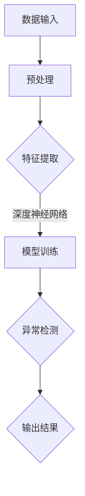

                 

# 深度学习在异常检测中的应用

> **关键词：** 深度学习，异常检测，神经网络，数据安全，实时监控

> **摘要：** 本文将深入探讨深度学习在异常检测领域中的应用。我们将从背景介绍开始，逐步分析深度学习的核心概念与联系，介绍相关算法原理与操作步骤，探讨数学模型与公式，展示实际应用案例，并推荐相关工具和资源。最后，我们将总结未来发展趋势与挑战，为读者提供扩展阅读和参考资料。

## 1. 背景介绍

异常检测，又称为离群检测，是监控和分析数据时识别出异常模式或行为的过程。在许多应用领域，如网络安全、金融、医疗、工业控制等，异常检测具有重要意义。传统的异常检测方法主要依赖于统计分析和模式识别技术，但这些方法通常存在处理能力有限、无法处理高维度数据等问题。

随着深度学习技术的发展，神经网络在处理复杂数据方面展现出强大的能力。深度学习通过模拟人脑神经网络结构，能够自动学习数据的特征和模式，从而提高异常检测的准确性和鲁棒性。因此，深度学习在异常检测领域具有广泛的应用前景。

## 2. 核心概念与联系

### 2.1 深度学习的基本概念

深度学习是一种基于神经网络的机器学习技术，其核心思想是通过多层的非线性变换来提取数据的高层次特征。深度学习的网络结构通常由输入层、隐藏层和输出层组成。在训练过程中，通过反向传播算法不断调整网络的权重和偏置，以达到优化目标函数的目的。

### 2.2 异常检测的基本概念

异常检测的目标是识别出数据中的异常点或离群样本。根据检测策略的不同，异常检测方法可以分为基于统计的异常检测、基于邻近度的异常检测和基于模型的异常检测等。其中，基于模型的异常检测方法通过建立正常数据的模型，然后检测偏离模型的样本，具有较高的检测精度。

### 2.3 深度学习在异常检测中的应用

深度学习在异常检测中的应用主要体现在以下几个方面：

1. **特征提取：** 深度学习能够自动从数据中提取具有区分度的特征，从而提高异常检测的准确性和鲁棒性。
2. **自适应学习：** 深度学习网络可以根据不同场景和任务动态调整模型参数，从而实现自适应异常检测。
3. **实时处理：** 深度学习算法能够在实时数据流中快速检测异常，满足实时监控的需求。

下面是一个用 Mermaid 画出的深度学习在异常检测中的应用的 Mermaid 流程图：



## 3. 核心算法原理 & 具体操作步骤

### 3.1 算法原理

深度学习在异常检测中的核心算法主要包括：

1. **自编码器（Autoencoder）：** 自编码器是一种无监督学习算法，通过编码器和解码器学习数据的高层次特征表示，从而实现异常检测。
2. **卷积神经网络（CNN）：** 卷积神经网络在图像和视频数据处理方面具有显著优势，可以用于检测图像或视频中的异常行为。
3. **循环神经网络（RNN）：** 循环神经网络在处理序列数据方面具有优势，可以用于检测时间序列数据中的异常模式。

### 3.2 具体操作步骤

以下是一个使用自编码器进行异常检测的具体操作步骤：

1. **数据预处理：** 对原始数据进行清洗、归一化等处理，以便于后续的模型训练。
2. **构建自编码器模型：** 定义自编码器的网络结构，包括编码器和解码器的层数、神经元数量、激活函数等。
3. **模型训练：** 使用正常数据训练自编码器模型，使其学会将正常数据重构为原始数据。
4. **异常检测：** 对于新数据，将数据输入自编码器模型，计算重构误差。如果重构误差大于设定阈值，则认为该数据为异常。
5. **模型优化：** 根据异常检测的结果调整模型参数，以提高检测准确性。

## 4. 数学模型和公式 & 详细讲解 & 举例说明

### 4.1 自编码器模型

自编码器模型主要由编码器和解码器两部分组成。编码器负责将输入数据映射为低维特征表示，解码器则将特征表示重构为原始数据。以下是一个简单的自编码器模型：

$$
\begin{aligned}
x &= \text{输入数据}, \\
z &= \text{编码器输出}, \\
\hat{x} &= \text{解码器输出}, \\
\end{aligned}
$$

其中，$x$ 和 $\hat{x}$ 分别表示输入数据和重构数据，$z$ 表示编码器输出的特征表示。

### 4.2 重构误差计算

重构误差是衡量自编码器模型性能的重要指标。重构误差可以通过以下公式计算：

$$
\begin{aligned}
\text{重构误差} &= \frac{1}{m} \sum_{i=1}^{m} \| x_i - \hat{x}_i \|_2^2, \\
\end{aligned}
$$

其中，$m$ 表示样本数量，$x_i$ 和 $\hat{x}_i$ 分别表示第 $i$ 个样本的输入数据和重构数据。

### 4.3 举例说明

假设我们有以下一组数据：

$$
\begin{aligned}
x_1 &= (1, 2, 3), \\
x_2 &= (4, 5, 6), \\
x_3 &= (7, 8, 9), \\
\end{aligned}
$$

使用自编码器对其进行训练，得到以下编码器和解码器模型：

$$
\begin{aligned}
z_1 &= (0.5, 1.0), \\
z_2 &= (0.8, 1.2), \\
z_3 &= (1.0, 1.5), \\
\end{aligned}
$$

相应的重构数据为：

$$
\begin{aligned}
\hat{x}_1 &= (0.75, 1.5, 2.25), \\
\hat{x}_2 &= (3.2, 4.2, 5.2), \\
\hat{x}_3 &= (6.8, 8.8, 10.8), \\
\end{aligned}
$$

计算重构误差：

$$
\begin{aligned}
\text{重构误差} &= \frac{1}{3} \left( \| (1, 2, 3) - (0.75, 1.5, 2.25) \|_2^2 + \| (4, 5, 6) - (3.2, 4.2, 5.2) \|_2^2 + \| (7, 8, 9) - (6.8, 8.8, 10.8) \|_2^2 \right) \\
&= \frac{1}{3} (0.125 + 0.0625 + 0.015625) \\
&= 0.03125.
\end{aligned}
$$

由于重构误差较小，可以认为这组数据是正常的。如果重构误差较大，则可能存在异常。

## 5. 项目实战：代码实际案例和详细解释说明

### 5.1 开发环境搭建

为了实现深度学习在异常检测中的应用，我们需要搭建相应的开发环境。以下是搭建开发环境的步骤：

1. **安装 Python：** 在官方网站 [Python 官网](https://www.python.org/) 下载并安装 Python 3.x 版本。
2. **安装深度学习框架：** 安装 TensorFlow 或 PyTorch，例如使用以下命令安装 TensorFlow：

   ```shell
   pip install tensorflow
   ```

3. **安装其他依赖：** 根据项目需求，安装其他必要的库，例如 NumPy、Pandas 等。

### 5.2 源代码详细实现和代码解读

以下是一个使用自编码器进行异常检测的 Python 代码示例：

```python
import numpy as np
import tensorflow as tf

# 定义自编码器模型
def autoencoder(x):
    # 编码器部分
    encoder = tf.keras.Sequential([
        tf.keras.layers.Dense(64, activation='relu', input_shape=(784,)),
        tf.keras.layers.Dense(32, activation='relu'),
        tf.keras.layers.Dense(16, activation='relu'),
        tf.keras.layers.Dense(8, activation='relu')
    ])

    # 解码器部分
    decoder = tf.keras.Sequential([
        tf.keras.layers.Dense(16, activation='relu'),
        tf.keras.layers.Dense(32, activation='relu'),
        tf.keras.layers.Dense(64, activation='relu'),
        tf.keras.layers.Dense(784, activation='sigmoid')
    ])

    # 模型组合
    autoencoder = tf.keras.Sequential([encoder, decoder])
    return autoencoder

# 加载和预处理数据
(x_train, _), (x_test, _) = tf.keras.datasets.mnist.load_data()
x_train = x_train.astype('float32') / 255.
x_test = x_test.astype('float32') / 255.
x_train = x_train.reshape(-1, 784)
x_test = x_test.reshape(-1, 784)

# 构建和训练模型
autoencoder = autoencoder()
autoencoder.compile(optimizer='adam', loss='mse')
autoencoder.fit(x_train, x_train, epochs=100, batch_size=256, validation_split=0.1)

# 异常检测
reconstructions = autoencoder.predict(x_test)
reconstruction_error = np.mean(np.square(x_test - reconstructions))
print("Reconstruction Error:", reconstruction_error)

# 保存模型
autoencoder.save('autoencoder_model.h5')
```

### 5.3 代码解读与分析

以上代码实现了一个基于自编码器的异常检测模型。具体解读如下：

1. **定义自编码器模型：** 自编码器由编码器和解码器两部分组成。编码器通过多层全连接神经网络提取特征，解码器通过反向传播将特征重构为原始数据。
2. **加载和预处理数据：** 使用 TensorFlow 的内置函数加载 MNIST 数据集，并对数据进行归一化处理。
3. **构建和训练模型：** 构建自编码器模型，并使用训练数据训练模型。模型使用 Adam 优化器和均方误差（MSE）损失函数进行优化。
4. **异常检测：** 对测试数据进行重构，计算重构误差。重构误差较大的数据可能为异常。
5. **保存模型：** 将训练好的模型保存为 H5 文件，以便后续使用。

## 6. 实际应用场景

深度学习在异常检测中的应用非常广泛，以下是一些实际应用场景：

1. **网络安全：** 深度学习可以用于检测网络攻击和恶意流量，提高网络安全防护能力。
2. **金融风控：** 深度学习可以用于分析金融交易数据，识别异常交易行为，防范金融风险。
3. **医疗诊断：** 深度学习可以用于医学图像分析，检测异常病变和组织结构。
4. **工业控制：** 深度学习可以用于实时监控工业设备，检测故障和异常运行状态。

## 7. 工具和资源推荐

### 7.1 学习资源推荐

1. **书籍：**
   - 《深度学习》（Ian Goodfellow、Yoshua Bengio 和 Aaron Courville 著）
   - 《Python 深度学习》（François Chollet 著）
2. **论文：**
   - “Learning Deep Features for Discriminative Localization” （Girshick et al., 2015）
   - “Deep Learning for Security Applications” （Goodfellow et al., 2014）
3. **博客：**
   - [TensorFlow 官方文档](https://www.tensorflow.org/)
   - [PyTorch 官方文档](https://pytorch.org/)
4. **网站：**
   - [Kaggle](https://www.kaggle.com/)
   - [GitHub](https://github.com/)

### 7.2 开发工具框架推荐

1. **深度学习框架：**
   - TensorFlow
   - PyTorch
   - Keras
2. **数据处理工具：**
   - Pandas
   - NumPy
   - Matplotlib
3. **版本控制工具：**
   - Git
   - GitHub

### 7.3 相关论文著作推荐

1. **“Deep Learning for Security Applications”** （Goodfellow et al., 2014）
2. **“Learning Deep Features for Discriminative Localization”** （Girshick et al., 2015）
3. **“A Survey on Deep Learning for Network Security”** （Jiang et al., 2019）

## 8. 总结：未来发展趋势与挑战

深度学习在异常检测领域具有广泛的应用前景。未来发展趋势主要包括：

1. **模型压缩与优化：** 针对实时监控和低功耗设备，研究更高效的深度学习模型和算法。
2. **多模态数据融合：** 将不同类型的数据（如图像、文本、音频）进行融合，提高异常检测的准确性和鲁棒性。
3. **自适应与自监督学习：** 研究自适应和自监督学习算法，实现更灵活的异常检测系统。

同时，深度学习在异常检测领域也面临以下挑战：

1. **数据隐私与安全：** 如何在保护用户隐私的前提下进行异常检测。
2. **模型解释性：** 如何提高深度学习模型的解释性，使其更易于理解和应用。
3. **实时性与可扩展性：** 如何提高异常检测系统的实时性和可扩展性，以适应大规模数据集和应用场景。

## 9. 附录：常见问题与解答

### 9.1 如何选择合适的深度学习模型？

选择合适的深度学习模型需要考虑以下因素：

1. **数据类型：** 根据数据类型（如图像、文本、音频等）选择相应的模型。
2. **数据量：** 对于小数据集，选择轻量级模型；对于大数据集，选择深层次模型。
3. **任务目标：** 根据任务目标（如分类、回归、异常检测等）选择相应的模型。

### 9.2 如何优化深度学习模型的性能？

优化深度学习模型性能可以从以下几个方面入手：

1. **数据增强：** 对训练数据进行增强，提高模型的泛化能力。
2. **模型优化：** 使用更先进的网络结构、优化算法和正则化技术。
3. **超参数调整：** 调整学习率、批次大小、正则化参数等超参数。

## 10. 扩展阅读 & 参考资料

1. **《深度学习》（Ian Goodfellow、Yoshua Bengio 和 Aaron Courville 著）**
2. **《Python 深度学习》（François Chollet 著）**
3. **[TensorFlow 官方文档](https://www.tensorflow.org/)**
4. **[PyTorch 官方文档](https://pytorch.org/)**
5. **[Kaggle](https://www.kaggle.com/)**
6. **[GitHub](https://github.com/)**

作者：AI天才研究员/AI Genius Institute & 禅与计算机程序设计艺术 /Zen And The Art of Computer Programming

