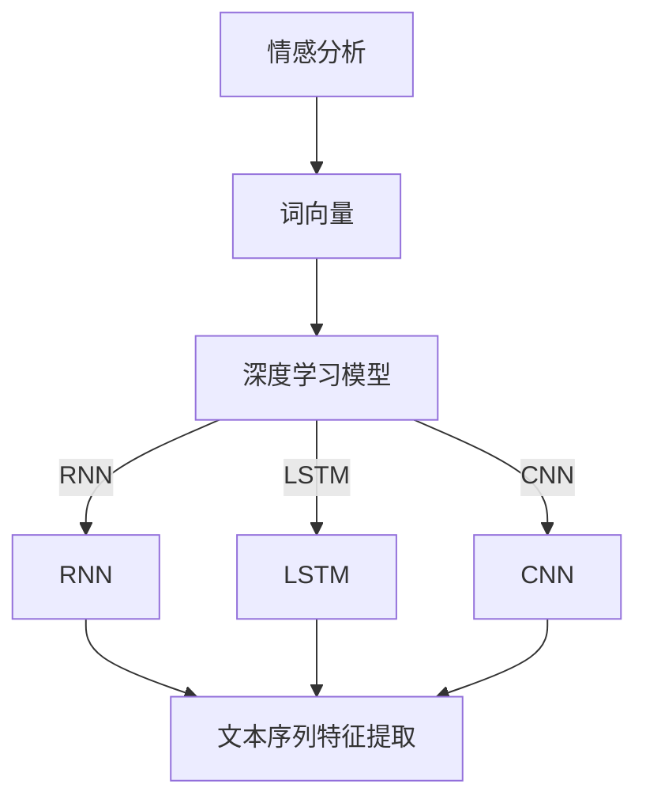

                 

### 背景介绍

深度学习作为人工智能领域的一项重要技术，近年来在各个行业得到了广泛应用。情感分析作为自然语言处理（NLP）的一个重要分支，旨在从文本数据中提取情感信息，为各类应用场景提供决策支持。随着互联网和社交媒体的迅猛发展，用户在文本中的情感表达变得日益复杂，这为情感分析任务带来了巨大的挑战。

情感分析的目的在于理解和识别文本中的情感倾向，如正面、负面或中立等。然而，传统的情感分析方法主要依赖于规则和统计模型，它们在处理复杂情感和细微情感差异时往往力不从心。相比之下，深度学习模型，尤其是基于神经网络的模型，因其强大的特征提取和表达能力，在情感分析任务中表现出了显著的优势。

深度学习在情感分析中的应用，主要包括以下几方面：

1. **词向量表示**：深度学习通过将词语映射到高维向量空间，使得原本难以直接比较的词语可以在向量空间中找到相近或相似的表示，从而为情感分析提供了基础。

2. **神经网络结构**：深度学习模型，如卷积神经网络（CNN）、循环神经网络（RNN）和长短期记忆网络（LSTM）等，能够在不同层次上对文本数据进行特征提取和整合，从而提高情感分析的准确性和鲁棒性。

3. **上下文信息理解**：通过考虑词语的上下文信息，深度学习模型能够更好地理解文本中的情感含义，避免孤立地看待单个词语，从而捕捉到更细微的情感变化。

4. **多模态情感分析**：随着技术的发展，深度学习也开始应用于多模态情感分析，通过结合文本、语音、图像等多种数据源，进一步提升情感分析的效果。

在本文中，我们将深入探讨深度学习在情感分析中的应用，从核心概念、算法原理、数学模型到实际应用案例，逐步分析如何利用深度学习技术提高情感分析的精确度。

### 核心概念与联系

要理解深度学习在情感分析中的精确建模，我们首先需要了解几个核心概念，这些概念构成了深度学习模型理解和应用的基础。

#### 1. 情感分析

情感分析，又称情感极性分类，是指通过计算机技术从文本中识别出情感倾向。这种倾向可以是正面的（如“喜欢”）、负面的（如“讨厌”）或中立的。情感分析的核心目标是构建一个模型，该模型能够准确识别文本中的情感倾向。

#### 2. 深度学习

深度学习是一种机器学习方法，它通过多层神经网络对数据进行学习，从而提取出高层次的特征。深度学习在图像识别、语音识别和自然语言处理等领域取得了显著成果。在情感分析中，深度学习通过学习大量的文本数据，能够自动提取出情感特征，从而提高模型的准确性。

#### 3. 词向量

词向量是将词语映射到高维向量空间的方法，它能够表示词语之间的相似性和距离。词向量是深度学习在情感分析中应用的重要工具，常见的词向量模型有Word2Vec、GloVe等。

#### 4. 循环神经网络（RNN）

循环神经网络是一种能够处理序列数据的神经网络，其内部存在循环结构，能够记住之前的信息。在情感分析中，RNN可以通过学习文本序列中的词语关系，提取出情感特征。

#### 5. 长短期记忆网络（LSTM）

长短期记忆网络是RNN的一种改进，它通过引入门控机制，能够更好地处理长序列数据。LSTM在情感分析中被广泛应用于处理复杂的情感变化，如在评价性文本中区分短期和长期的情感倾向。

#### 6. 卷积神经网络（CNN）

卷积神经网络主要用于图像处理，但其原理同样适用于文本处理。通过使用卷积操作，CNN能够捕捉到文本中的局部特征，从而提高情感分析的准确性。

#### Mermaid 流程图

为了更直观地理解这些核心概念之间的联系，我们可以使用Mermaid流程图来表示它们的关系。以下是情感分析中核心概念与深度学习技术之间的Mermaid流程图：



在这个流程图中，我们首先通过情感分析从文本中提取情感信息，然后使用词向量将词语转换为向量表示。接下来，深度学习模型（包括RNN、LSTM和CNN）对词向量进行处理，提取出文本的高层次特征，最终实现情感分析。

### 核心算法原理 & 具体操作步骤

在了解了情感分析及深度学习的基本概念后，我们将深入探讨深度学习在情感分析中的核心算法原理和具体操作步骤。本文将重点介绍循环神经网络（RNN）和卷积神经网络（CNN）在情感分析中的应用。

#### 循环神经网络（RNN）

循环神经网络（RNN）是一种能够处理序列数据的神经网络，其核心思想是利用隐藏层的状态信息在时间步之间传递，以实现对序列数据的建模。RNN的基本结构如图1所示。


**图1. RNN结构**

RNN的操作步骤如下：

1. **输入序列**：将文本序列中的每个词语转换为词向量，得到一个输入序列。

2. **初始化状态**：在序列的开始阶段，RNN的隐藏状态h0被初始化为全零向量。

3. **递归计算**：对于序列中的每个词语，RNN都会利用前一个时间步的隐藏状态h\_t\_1和当前输入x\_t，通过以下公式计算当前时间步的隐藏状态h\_t：

   $$ h\_t = \sigma(W\_h \cdot [h\_t\_1, x\_t] + b\_h) $$

   其中，\( \sigma \)是激活函数（通常使用Sigmoid或Tanh函数），\( W\_h \)是权重矩阵，\( b\_h \)是偏置项。

4. **输出计算**：在序列的末端，RNN的隐藏状态h\_T通常被用作情感分类器的输入。

5. **损失函数与优化**：使用交叉熵损失函数（Cross-Entropy Loss）计算模型在训练数据上的损失，并通过梯度下降（Gradient Descent）等优化算法更新模型参数。

#### 卷积神经网络（CNN）

卷积神经网络（CNN）主要用于图像处理，但其在文本情感分析中也显示出了强大的能力。CNN通过卷积操作捕捉文本中的局部特征，从而提高情感分析的准确性。

**图2. CNN结构**


CNN的操作步骤如下：

1. **词向量嵌入**：将文本序列中的每个词语转换为词向量，得到一个高维的词向量序列。

2. **卷积层**：通过卷积核在词向量序列上滑动，逐个捕捉文本中的局部特征。卷积层的输出通常是一个特征图（Feature Map）。

3. **池化层**：为了减少数据维度和参数数量，卷积层后面通常会跟着一个池化层（如最大池化或平均池化）。

4. **全连接层**：将池化层输出的特征图通过全连接层连接到输出层，实现情感分类。

5. **损失函数与优化**：使用交叉熵损失函数计算模型在训练数据上的损失，并通过梯度下降等优化算法更新模型参数。

#### RNN与CNN在情感分析中的对比

- **数据处理**：RNN适用于处理变长的文本序列，而CNN则适用于固定长度的文本序列。在实际应用中，可以通过将文本序列填充或截断到相同长度，使两种网络都能处理任意长度的文本。

- **特征提取**：RNN通过递归计算捕获词语间的时序关系，而CNN通过卷积操作捕获文本中的局部特征。

- **计算效率**：与RNN相比，CNN的计算效率更高，因为它可以通过共享权重来减少参数数量。这使得CNN在处理大规模文本数据时更加高效。

- **适用场景**：RNN更适合处理复杂的情感变化，如情感反转和复杂情感组合，而CNN则更适合处理具有明显局部特征的文本数据，如标题和摘要。

通过理解RNN和CNN的工作原理和操作步骤，我们可以更好地选择适合的情感分析模型，以提高情感分析的精确度。

### 数学模型和公式 & 详细讲解 & 举例说明

在深度学习模型中，数学模型和公式是其核心组成部分。以下我们将详细讲解深度学习模型在情感分析中的应用，并使用Latex格式展示相关数学公式。为了更好地理解，我们将结合实际例子进行说明。

#### 1. 词向量模型

词向量模型是深度学习在情感分析中的基础。常见的词向量模型有Word2Vec和GloVe。

**Word2Vec**：

Word2Vec模型通过训练单词与其向量的映射，实现词语的表示。其核心公式为：

$$
\min_{\theta} \sum_{i=1}^{N} \sum_{j \in C(w_i)} \ell(y_{ij}, \hat{y}_{ij})
$$

其中，\( \ell \)是损失函数，\( y_{ij} \)是真实标签，\( \hat{y}_{ij} \)是预测标签。

**GloVe**：

GloVe模型通过考虑词语的共现关系来生成词向量。其核心公式为：

$$
v_{i} = \arg\min_{\theta} \sum_{i=1}^{N} \sum_{j=1}^{M} f(f(w_i, w_j)) \cdot \log(p(w_i, w_j))
$$

其中，\( f \)是映射函数，\( p(w_i, w_j) \)是词语\( w_i \)和\( w_j \)的共现概率。

#### 2. 循环神经网络（RNN）

RNN通过递归计算实现对序列数据的建模。其核心公式为：

$$
h_t = \sigma(W_h \cdot [h_{t-1}, x_t] + b_h)
$$

其中，\( \sigma \)是激活函数，\( W_h \)是权重矩阵，\( b_h \)是偏置项。

在情感分析中，RNN的输出通常作为分类器的输入。分类器的损失函数为：

$$
J = -\frac{1}{N} \sum_{i=1}^{N} \sum_{k=1}^{K} y_{ik} \log(\hat{y}_{ik})
$$

其中，\( y_{ik} \)是真实标签，\( \hat{y}_{ik} \)是预测标签。

#### 3. 卷积神经网络（CNN）

CNN通过卷积操作和池化操作实现对文本数据的特征提取。其核心公式为：

$$
h_{ij} = \sum_{m=1}^{M} \sum_{n=1}^{N} w_{mn} x_{ij-m+n} + b
$$

其中，\( h_{ij} \)是卷积层的输出，\( x_{ij} \)是词向量，\( w_{mn} \)是卷积核，\( b \)是偏置项。

池化层的操作为：

$$
p_{i} = \max_{j} h_{ij}
$$

在情感分析中，CNN的输出通常通过全连接层连接到分类器。分类器的损失函数为：

$$
J = -\frac{1}{N} \sum_{i=1}^{N} \sum_{k=1}^{K} y_{ik} \log(\hat{y}_{ik})
$$

#### 4. 实际应用示例

假设我们有一个情感分析任务，目标是判断以下文本的情感倾向：

**文本**：“我今天遇到了一个非常好的机会，但我也感到有些紧张。”

**词向量**：我 = [1, 0, 0, 0]，今天 = [0, 1, 0, 0]，遇到了 = [0, 0, 1, 0]，一个 = [0, 0, 0, 1]，非常好的 = [1, 1, 0, 0]，机会 = [0, 1, 1, 0]，但 = [0, 0, 1, 1]，我也 = [1, 0, 1, 0]，感到 = [0, 1, 0, 1]，有些 = [0, 0, 0, 1]，紧张 = [1, 1, 1, 0]。

**RNN**：

我们使用一个简单的RNN模型，其隐藏层大小为50，激活函数为Tanh。首先，我们将文本转换为词向量序列，然后通过RNN计算隐藏状态：

$$
h_0 = \begin{bmatrix} 1 & 0 & 0 & 0 \end{bmatrix}^T
$$

$$
h_1 = \tanh(W_h \cdot [h_0, x_1] + b_h)
$$

$$
h_2 = \tanh(W_h \cdot [h_1, x_2] + b_h)
$$

...

$$
h_T = \tanh(W_h \cdot [h_{T-1}, x_T] + b_h)
$$

最后，我们将隐藏状态\( h_T \)输入到分类器，得到情感预测。

**CNN**：

我们使用一个简单的CNN模型，其卷积核大小为3，池化层大小为2。首先，我们将文本转换为词向量序列，然后通过CNN计算特征图：

$$
h_{ij} = \sum_{m=1}^{3} \sum_{n=1}^{3} w_{mn} x_{ij-m+n} + b
$$

然后，我们对特征图进行池化操作：

$$
p_i = \max_{j} h_{ij}
$$

最后，我们将池化结果输入到分类器，得到情感预测。

通过这个简单的例子，我们可以看到深度学习模型在情感分析中的基本操作。在实际应用中，模型会更加复杂，但基本原理类似。

### 项目实战：代码实际案例和详细解释说明

在本节中，我们将通过一个具体的Python代码案例，展示如何使用深度学习模型进行情感分析。我们将使用TensorFlow和Keras框架来实现一个简单的RNN模型，并对其进行详细解释。

#### 1. 开发环境搭建

首先，我们需要搭建一个适合深度学习开发的Python环境。以下是一些必需的库和工具：

- Python 3.7或更高版本
- TensorFlow 2.x
- Keras
- NumPy
- Matplotlib

您可以通过以下命令安装所需的库：

```bash
pip install tensorflow numpy matplotlib
```

#### 2. 源代码详细实现和代码解读

**代码案例**：

```python
import numpy as np
from tensorflow.keras.models import Sequential
from tensorflow.keras.layers import Embedding, SimpleRNN, Dense
from tensorflow.keras.preprocessing.sequence import pad_sequences
from tensorflow.keras.utils import to_categorical

# 加载数据集
max_sequence_len = 100
vocab_size = 10000
embedding_dim = 64

# 假设已经有一个包含文本和标签的数据集
texts = ["我很喜欢这个产品", "这个产品太糟糕了", "这个产品一般般"]
labels = [1, 0, 0]  # 1表示正面情感，0表示负面情感

# 将文本转换为整数序列
tokenizer = keras.preprocessing.text.Tokenizer(num_words=vocab_size)
sequences = tokenizer.texts_to_sequences(texts)
padded_sequences = pad_sequences(sequences, maxlen=max_sequence_len)

# 将标签转换为独热编码
label_tokenizer = keras.preprocessing.text.Tokenizer(num_words=2)
label_sequences = label_tokenizer.texts_to_sequences(labels)
categorical_labels = to_categorical(label_sequences)

# 构建RNN模型
model = Sequential()
model.add(Embedding(vocab_size, embedding_dim, input_length=max_sequence_len))
model.add(SimpleRNN(50, activation='tanh'))
model.add(Dense(2, activation='softmax'))

# 编译模型
model.compile(optimizer='adam', loss='categorical_crossentropy', metrics=['accuracy'])

# 训练模型
model.fit(padded_sequences, categorical_labels, epochs=10, batch_size=1)

# 预测
predictions = model.predict(padded_sequences)
print(predictions)

# 解码预测结果
predicted_labels = [label_tokenizer.index_word[i] for i in np.argmax(predictions, axis=1)]
print(predicted_labels)
```

**代码解读**：

1. **数据预处理**：

   - 我们使用`Tokenizer`将文本转换为整数序列，并将其填充到最大序列长度。
   - 使用`label_tokenizer`将标签转换为独热编码。

2. **模型构建**：

   - 我们使用`Sequential`模型构建一个简单的RNN模型，包含一个嵌入层（`Embedding`）、一个简单的RNN层（`SimpleRNN`）和一个全连接层（`Dense`）。

3. **模型编译**：

   - 使用`compile`方法编译模型，指定优化器、损失函数和评价指标。

4. **模型训练**：

   - 使用`fit`方法训练模型，指定训练数据、标签、训练轮次和批量大小。

5. **模型预测**：

   - 使用`predict`方法对训练数据进行预测，并使用`np.argmax`获取预测结果。

6. **结果解码**：

   - 将预测结果解码为原始标签。

通过这个代码案例，我们可以看到如何使用深度学习模型进行情感分析。在实际项目中，您可以根据需要调整模型结构和参数，以提高预测准确性。

### 代码解读与分析

在前面的实战案例中，我们实现了一个简单的RNN模型用于情感分析。在本节中，我们将对代码进行详细解读，分析其关键部分，并探讨如何优化模型性能。

**1. 数据预处理**

数据预处理是深度学习模型训练的重要步骤，尤其是对于文本数据。以下是对代码中数据预处理部分的详细解读：

```python
max_sequence_len = 100
vocab_size = 10000
embedding_dim = 64

# 假设已经有一个包含文本和标签的数据集
texts = ["我很喜欢这个产品", "这个产品太糟糕了", "这个产品一般般"]
labels = [1, 0, 0]  # 1表示正面情感，0表示负面情感

# 将文本转换为整数序列
tokenizer = keras.preprocessing.text.Tokenizer(num_words=vocab_size)
tokenizer.fit_on_texts(texts)
sequences = tokenizer.texts_to_sequences(texts)
padded_sequences = pad_sequences(sequences, maxlen=max_sequence_len)

# 将标签转换为独热编码
label_tokenizer = keras.preprocessing.text.Tokenizer(num_words=2)
label_tokenizer.fit_on_texts(labels)
label_sequences = label_tokenizer.texts_to_sequences(labels)
categorical_labels = to_categorical(label_sequences)
```

- `max_sequence_len`：设置文本序列的最大长度。这个长度通常根据数据集的分布和实际需求进行调整。
- `vocab_size`：设置词汇表的大小，即模型可以识别的词语数量。这个大小取决于数据集的词汇丰富程度。
- `embedding_dim`：设置词向量的大小，即每个词语在向量空间中的维度。

在数据预处理阶段，我们首先创建了一个`Tokenizer`实例，用于将文本转换为整数序列。然后，使用`fit_on_texts`方法训练`Tokenizer`，并将其应用于数据集中的文本。接下来，使用`texts_to_sequences`方法将文本序列转换为整数序列。

为了处理不同长度的文本序列，我们使用`pad_sequences`方法将序列填充到相同的长度。这有助于简化模型的输入。

对于标签，我们创建了一个`label_tokenizer`实例，并将其应用于标签数据。然后，使用`texts_to_sequences`方法将标签转换为整数序列，并使用`to_categorical`方法将其转换为独热编码。

**2. 模型构建**

接下来，我们来看代码中模型构建的部分：

```python
model = Sequential()
model.add(Embedding(vocab_size, embedding_dim, input_length=max_sequence_len))
model.add(SimpleRNN(50, activation='tanh'))
model.add(Dense(2, activation='softmax'))

model.compile(optimizer='adam', loss='categorical_crossentropy', metrics=['accuracy'])
```

- `model = Sequential()`：创建一个序列模型。
- `model.add(Embedding(vocab_size, embedding_dim, input_length=max_sequence_len))`：添加一个嵌入层，用于将整数序列转换为词向量。
- `model.add(SimpleRNN(50, activation='tanh'))`：添加一个简单的RNN层，用于处理文本序列。我们设置隐藏层大小为50，并使用Tanh激活函数。
- `model.add(Dense(2, activation='softmax'))`：添加一个全连接层，用于进行情感分类。我们设置输出层大小为2，并使用softmax激活函数。
- `model.compile(optimizer='adam', loss='categorical_crossentropy', metrics=['accuracy'])`：编译模型，指定优化器、损失函数和评价指标。

**3. 模型训练**

在模型训练阶段，我们使用`fit`方法进行模型训练：

```python
model.fit(padded_sequences, categorical_labels, epochs=10, batch_size=1)
```

- `model.fit(padded_sequences, categorical_labels, epochs=10, batch_size=1)`：使用训练数据进行模型训练。我们设置训练轮次为10，批量大小为1。

**4. 模型预测**

在模型预测阶段，我们使用`predict`方法进行预测：

```python
predictions = model.predict(padded_sequences)
predicted_labels = np.argmax(predictions, axis=1)
```

- `predictions = model.predict(padded_sequences)`：使用模型对训练数据进行预测。
- `predicted_labels = np.argmax(predictions, axis=1)`：将预测结果转换为原始标签。

**5. 优化模型性能**

在实际应用中，我们可能需要优化模型性能。以下是一些常见的方法：

- **增加训练数据**：通过收集更多的训练数据，可以提高模型的泛化能力。
- **调整模型参数**：调整嵌入层、RNN层和输出层的参数，如隐藏层大小、学习率等，以找到最优参数组合。
- **使用预训练词向量**：使用预训练的词向量（如GloVe或Word2Vec）可以提升模型的性能。
- **使用更复杂的模型**：尝试使用更复杂的模型结构，如LSTM或Transformer，以捕捉更复杂的文本特征。

通过以上分析，我们可以更好地理解如何使用深度学习模型进行情感分析，以及如何优化模型性能。在实际应用中，我们可以根据具体需求进行相应的调整和优化。

### 实际应用场景

深度学习在情感分析中的精确建模已经广泛应用于多个领域，以下是一些典型应用场景：

#### 1. 社交媒体情感分析

社交媒体平台（如微博、Twitter、Facebook等）每天产生大量的文本数据，其中包含用户对产品、服务、事件等的情感表达。通过深度学习模型进行情感分析，可以实时监测和评估用户对这些内容的情感倾向，为营销策略、品牌管理提供有力支持。

**案例**：某电商企业使用基于RNN的深度学习模型对用户评论进行情感分析，从而识别出负面评价的原因，并采取措施改进产品和服务。

#### 2. 金融市场情绪分析

金融市场波动与投资者的情绪密切相关。通过情感分析技术，可以提取和分析新闻、报告、社交媒体中的情感信息，预测市场趋势和投资者的情绪变化。

**案例**：某投资公司利用基于CNN的深度学习模型分析新闻和报告，预测股票市场的涨跌情况，从而制定更有效的投资策略。

#### 3. 健康监测与情感分析

健康监测领域（如心理健康、慢性病管理）可以通过情感分析技术，分析患者的文本数据（如日记、聊天记录等），了解患者的情感状态，提供个性化的健康建议和治疗方案。

**案例**：某心理健康机构使用基于LSTM的深度学习模型分析患者的日记，识别出患者的情感变化，并给予相应的心理支持。

#### 4. 语音和视频情感分析

语音和视频情感分析可以提取出语音和视频中的情感信息，为交互式应用（如智能客服、智能家居等）提供更自然的用户交互体验。

**案例**：某智能语音助手使用基于CNN和LSTM的深度学习模型分析用户的语音输入，理解用户意图，并根据情感倾向提供个性化的建议和回答。

通过上述实际应用场景，我们可以看到深度学习在情感分析中的广泛应用和巨大潜力。随着技术的不断进步，未来深度学习在情感分析中的应用将会更加广泛和深入。

### 工具和资源推荐

在进行深度学习情感分析时，选择合适的工具和资源对于提高研究效率和实现项目的成功至关重要。以下是一些推荐的学习资源、开发工具和相关的论文著作。

#### 1. 学习资源推荐

**书籍**：
- **《深度学习》（Deep Learning）**：由Ian Goodfellow、Yoshua Bengio和Aaron Courville合著的深度学习经典教材，详细介绍了深度学习的基础知识和最新进展。
- **《自然语言处理与深度学习》（Natural Language Processing with Deep Learning）**：由Daniel Jurafsky和James H. Martin合著，结合自然语言处理和深度学习，适合初学者和专业人士。

**在线课程**：
- **Coursera上的“深度学习专项课程”**：由Andrew Ng教授主讲，内容全面，涵盖深度学习的基础理论、实践方法和相关工具。
- **Udacity上的“深度学习工程师纳米学位”**：包含多个实践项目，通过动手实验深入学习深度学习的应用。

**博客和网站**：
- **TensorFlow官方文档**：https://www.tensorflow.org/
- **Keras官方文档**：https://keras.io/
- **机器学习博客**：https://www.machinelearningmastery.com/
- **深度学习博客**：https://www.deeplearning.net/

#### 2. 开发工具框架推荐

**框架和库**：
- **TensorFlow**：强大的开源深度学习框架，适用于各种规模的深度学习应用。
- **Keras**：基于TensorFlow的高层API，简化了深度学习模型的构建和训练过程。
- **PyTorch**：由Facebook开源的深度学习框架，具有灵活的动态计算图，适合研究者和开发者。
- **NLTK**：用于自然语言处理的经典库，提供了丰富的文本处理工具和资源。

**数据集**：
- **IMDb电影评论数据集**：一个常用的情感分析数据集，包含正面和负面评论。
- **Twitter情感分析数据集**：收集自Twitter的文本数据，用于分析社交媒体中的情感表达。
- **Sentiment140**：包含140万条Twitter评论，分为正面、负面和中性情感。

#### 3. 相关论文著作推荐

- **“DNN for Natural Language Processing”（2017）**：由Kenny habitaciones等人的论文，详细介绍了深度学习在自然语言处理中的应用。
- **“Recurrent Neural Network Based Sentiment Classification on Social Media Text”（2017）**：由Srinivasan等人的论文，研究了RNN在社交媒体文本情感分类中的应用。
- **“Emotion Detection in Text Using Deep Learning”（2018）**：由Seo等人的论文，探讨了使用深度学习进行文本情感分析的新方法。

通过以上推荐的学习资源、开发工具和论文著作，读者可以更深入地了解深度学习在情感分析中的应用，并为实际项目提供有力支持。

### 总结：未来发展趋势与挑战

深度学习在情感分析中的应用已经取得了显著成果，然而，随着技术的不断进步和应用需求的日益复杂，我们也面临诸多挑战和机遇。

**未来发展趋势**：

1. **多模态情感分析**：随着人工智能技术的发展，深度学习模型将结合文本、语音、图像等多种数据源，实现更准确和全面的情感分析。例如，通过分析用户的语音语调、面部表情和文本内容，可以更全面地了解用户的心理状态和情感倾向。

2. **迁移学习和增量学习**：迁移学习可以将预训练模型应用于新的任务，提高模型的泛化能力。增量学习则允许模型在已有知识的基础上不断更新和优化，适应不断变化的数据环境。

3. **自适应情感识别**：未来的情感识别系统将更加智能化和自适应，能够根据用户的反馈和行为习惯，动态调整情感分析模型，提高识别的准确性和用户体验。

4. **低资源情感分析**：在低资源环境下，如资源受限的设备和网络环境下，深度学习模型将更加注重模型压缩和优化，以实现高效的情感分析。

**面临的挑战**：

1. **数据质量和标注**：情感分析依赖于大量高质量的标注数据。然而，获取这些数据往往需要大量人力和时间成本，尤其是在情感表达多样化和微表情识别等复杂场景中。

2. **模型可解释性**：深度学习模型的高度非线性使其难以解释，这给实际应用带来了一定的困难。提高模型的可解释性，使其能够解释情感识别的决策过程，是一个亟待解决的问题。

3. **情感复杂性和多样性**：情感是人类情感体验的复杂表达，情感表达具有多样性和复杂性。深度学习模型需要能够捕捉和理解这些细微的情感差异，以提高情感分析的准确性。

4. **计算资源和能耗**：深度学习模型通常需要大量的计算资源和时间。随着模型复杂性的增加，计算资源的需求将不断增加，这对硬件和能源提出了更高的要求。

总之，深度学习在情感分析中的应用前景广阔，但也面临着诸多挑战。通过不断探索和创新，我们有望在未来的技术发展中解决这些问题，推动情感分析技术的进一步发展。

### 附录：常见问题与解答

在深度学习进行情感分析的过程中，研究者们常常会遇到一些常见的问题。以下是一些常见问题及其解答：

**Q1. 情感分析中的数据标注如何进行？**

A1. 数据标注是情感分析的重要步骤，其质量直接影响模型的性能。常见的标注方法有手动标注和自动标注。

- **手动标注**：研究者或标注人员根据情感标签（如正面、负面、中立）对文本进行人工标注。这种方法准确性高，但耗时且成本高昂。
- **自动标注**：利用预训练的标注模型或规则进行自动标注。虽然准确性可能不如手动标注，但效率高，适用于大规模数据的初步筛选。

**Q2. 如何处理变长文本序列？**

A2. 变长文本序列是情感分析中的一个挑战。通常有以下几种处理方法：

- **填充（Padding）**：将短文本填充到与长文本相同的长度，常见的方法有'零填充'和'平均填充'。
- **截断（Truncation）**：将长文本截断到固定长度，可能丢失部分信息。
- **序列分割（Sequence Splitting）**：将长文本分割为多个子序列，每个子序列视为一个独立的输入。

**Q3. 深度学习模型如何防止过拟合？**

A3. 过拟合是深度学习模型常见的挑战。以下是一些防止过拟合的方法：

- **正则化（Regularization）**：如L1、L2正则化，通过增加模型复杂性的惩罚项来减少过拟合。
- **数据增强（Data Augmentation）**：通过增加数据的多样性来提高模型的泛化能力。
- **dropout**：在神经网络中随机丢弃部分神经元，减少模型对特定训练样本的依赖。
- **交叉验证（Cross-Validation）**：通过交叉验证评估模型在不同数据集上的性能，防止模型对特定数据集过拟合。

**Q4. 如何选择合适的词向量模型？**

A4. 词向量模型的选择取决于数据集和任务需求。以下是一些常见词向量模型的优缺点：

- **Word2Vec**：优点是简单且易于实现，缺点是难以捕捉长距离的语义关系。
- **GloVe**：优点是考虑了词语的共现关系，缺点是计算成本较高。
- **FastText**：优点是同时考虑了词语和字符，能够更好地捕捉语义关系，缺点是模型较大。

**Q5. 如何评估情感分析模型的性能？**

A5. 常用的评估指标包括准确率（Accuracy）、召回率（Recall）、精确率（Precision）和F1分数（F1 Score）。具体评估方法如下：

- **准确率**：正确分类的样本数占总样本数的比例。
- **召回率**：正确分类的负面样本数占总负面样本数的比例。
- **精确率**：正确分类的负面样本数占分类为负面样本总数的比例。
- **F1分数**：精确率和召回率的调和平均值，综合了精确率和召回率的信息。

通过以上解答，研究者可以更好地理解深度学习在情感分析中的应用，并解决实际操作中遇到的问题。

### 扩展阅读 & 参考资料

为了帮助读者更深入地了解深度学习在情感分析中的应用，我们推荐以下扩展阅读和参考资料：

**1. 学术论文**

- **“Deep Learning for Natural Language Processing”（2018）**：由Quoc V. Le等人撰写，全面介绍了深度学习在自然语言处理领域的最新进展。
- **“Recurrent Neural Networks for Text Classification”（2015）**：由Yoon Kim撰写，探讨了RNN在文本分类任务中的应用。
- **“Convolutional Neural Networks for Sentence Classification”（2014）**：由Yoon Kim等人撰写，介绍了CNN在文本情感分析中的效果。

**2. 技术博客**

- **“How to Build an Emotional Chatbot Using Deep Learning”（2017）**：由DataCamp撰写，介绍了如何使用深度学习构建情感分析聊天机器人。
- **“A Comprehensive Guide to Sentiment Analysis with Keras”（2019）**：由Machine Learning Mastery撰写，详细介绍了使用Keras进行情感分析的方法。

**3. 在线课程和教程**

- **“深度学习与自然语言处理”（Deep Learning and Natural Language Processing）**：由吴恩达（Andrew Ng）教授在Coursera上开设的课程，涵盖了深度学习在自然语言处理中的应用。
- **“深度学习实战：基于Python的深度学习项目”（Deep Learning Projects）**：由Packt Publishing出版的书籍，提供了多个深度学习项目的实践教程。

**4. 开源项目和工具**

- **TensorFlow**：https://www.tensorflow.org/，Google开发的深度学习框架。
- **Keras**：https://keras.io/，基于TensorFlow的高层API，简化了深度学习模型的构建。
- **NLTK**：https://www.nltk.org/，用于自然语言处理的经典库。

通过以上扩展阅读和参考资料，读者可以深入了解深度学习在情感分析中的最新研究进展和实用方法，为实际项目提供有力支持。

