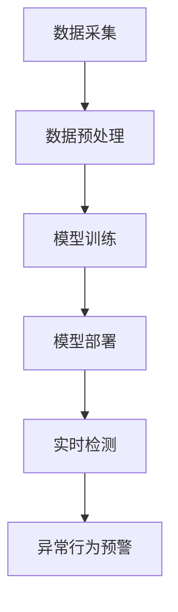

                 

# 深度学习在智能安防异常行为检测中的技术演进与实践

> **关键词：** 深度学习、智能安防、异常行为检测、技术演进、实践应用

> **摘要：** 本文将探讨深度学习技术在智能安防异常行为检测中的应用，分析其技术演进过程，展示具体实现方法，并探讨未来发展趋势和面临的挑战。

## 1. 背景介绍

随着城市化进程的加快和人口增长，公共安全成为社会关注的焦点。传统的安防系统主要依赖于人力监控和简单的视频分析技术，存在效率低、误报率高、无法实时处理等问题。随着深度学习技术的发展，智能安防系统逐渐兴起，通过将深度学习算法应用于视频数据分析，实现了对异常行为的自动检测和实时预警。

### 1.1 传统安防系统局限性

传统安防系统通常包括监控摄像头、视频记录设备和人工监控系统。尽管这些系统能够在一定程度上提高公共安全，但存在以下局限性：

- **人力成本高**：需要大量人力进行监控和事件处理。
- **误报率高**：由于监控范围广，误报率较高，容易引起不必要的恐慌和资源浪费。
- **实时性差**：无法实现实时处理和预警。

### 1.2 深度学习技术引入

深度学习作为一种模拟人脑进行信息处理的算法，具有强大的特征提取和模式识别能力。将深度学习技术应用于安防领域，可以有效解决传统安防系统的局限性，提高检测效率和准确率。

## 2. 核心概念与联系

### 2.1 深度学习基础概念

- **神经网络**：深度学习的基础，通过多层神经元进行信息传递和处理。
- **卷积神经网络（CNN）**：适用于图像处理，具有强大的特征提取能力。
- **循环神经网络（RNN）**：适用于序列数据处理，如时间序列分析。

### 2.2 智能安防系统架构

智能安防系统通常包括数据采集、预处理、模型训练、模型部署和实时检测等环节。

### 2.3 异常行为检测方法

- **基于CNN的图像特征提取**：通过卷积神经网络提取图像特征，用于异常行为识别。
- **基于RNN的时间序列分析**：通过循环神经网络分析视频时间序列，检测异常行为。

### 2.4 Mermaid 流程图



## 3. 核心算法原理 & 具体操作步骤

### 3.1 卷积神经网络（CNN）

卷积神经网络（CNN）是一种在图像处理领域具有广泛应用的前馈神经网络。其核心思想是通过卷积层、池化层和全连接层对图像数据进行特征提取和分类。

#### 3.1.1 卷积层

卷积层是CNN的核心组成部分，用于提取图像特征。通过卷积运算，将输入图像与卷积核进行卷积操作，得到特征图。

#### 3.1.2 池化层

池化层用于降低特征图的维度，减少计算量。常见的池化操作有最大池化和平均池化。

#### 3.1.3 全连接层

全连接层将池化层输出的特征图进行全连接，输出分类结果。

### 3.2 循环神经网络（RNN）

循环神经网络（RNN）是一种能够处理序列数据的神经网络。其核心思想是通过隐藏状态和循环连接来处理序列中的时间依赖性。

#### 3.2.1 隐藏状态

隐藏状态是RNN的重要组成部分，用于存储序列信息。

#### 3.2.2 循环连接

循环连接使得RNN能够在处理序列数据时保留历史信息。

#### 3.2.3 输出层

输出层用于对序列数据进行分类或回归。

### 3.3 深度学习算法实现步骤

1. **数据收集与预处理**：收集相关视频数据，并进行数据清洗、归一化等预处理操作。
2. **模型设计**：根据任务需求设计卷积神经网络或循环神经网络结构。
3. **模型训练**：使用预处理后的数据对模型进行训练，调整网络参数。
4. **模型评估**：使用测试数据对模型进行评估，调整模型参数以达到最佳效果。
5. **模型部署**：将训练好的模型部署到实际场景中，进行实时异常行为检测。

## 4. 数学模型和公式 & 详细讲解 & 举例说明

### 4.1 卷积神经网络（CNN）数学模型

卷积神经网络（CNN）的数学模型主要包括卷积层、池化层和全连接层的数学表达式。

#### 4.1.1 卷积层

卷积层的数学表达式为：

$$
\text{output}_{ij}^l = \sum_{i'} \sum_{j'} w_{i'j'i}^l \cdot \text{input}_{i'j'}^{l-1} + b_i^l
$$

其中，$w_{i'j'i}^l$为卷积核，$\text{input}_{i'j'}^{l-1}$为输入特征图，$\text{output}_{ij}^l$为卷积层输出，$b_i^l$为偏置项。

#### 4.1.2 池化层

池化层的数学表达式为：

$$
\text{output}_{ij}^l = \frac{1}{C} \sum_{c=1}^C \text{input}_{ijc}^l
$$

其中，$C$为池化区域的大小。

#### 4.1.3 全连接层

全连接层的数学表达式为：

$$
\text{output}_{i}^l = \sum_{j} w_{ij}^l \cdot \text{input}_{j}^{l-1} + b_i^l
$$

其中，$w_{ij}^l$为权重，$\text{input}_{j}^{l-1}$为输入特征，$\text{output}_{i}^l$为输出结果，$b_i^l$为偏置项。

### 4.2 循环神经网络（RNN）数学模型

循环神经网络（RNN）的数学模型主要包括隐藏状态和循环连接的数学表达式。

#### 4.2.1 隐藏状态

隐藏状态的数学表达式为：

$$
\text{hidden}_{t}^l = \text{activation}\left( \sum_{j} w_{jt}^l \cdot \text{input}_{j}^{t} + \sum_{k} w_{kt}^{l-1} \cdot \text{hidden}_{t}^{l-1} + b_l \right)
$$

其中，$\text{input}_{j}^{t}$为输入序列，$w_{jt}^l$为权重，$b_l$为偏置项，$\text{activation}$为激活函数。

#### 4.2.2 循环连接

循环连接的数学表达式为：

$$
\text{output}_{t}^l = \text{activation}\left( \sum_{j} w_{jt}^l \cdot \text{input}_{j}^{t} + \sum_{k} w_{kt}^{l-1} \cdot \text{hidden}_{t-1}^{l-1} + b_l \right)
$$

其中，$\text{output}_{t}^l$为输出序列，其他符号含义与隐藏状态相同。

### 4.3 深度学习算法实现举例

以下是一个简单的CNN模型实现示例：

```python
import tensorflow as tf

# 定义卷积层
conv1 = tf.layers.conv2d(inputs=input_data, filters=32, kernel_size=[3, 3], strides=[1, 1], padding='same', activation=tf.nn.relu)

# 定义池化层
pool1 = tf.layers.max_pooling2d(inputs=conv1, pool_size=[2, 2], strides=[2, 2], padding='same')

# 定义全连接层
fc1 = tf.layers.dense(inputs=pool1, units=128, activation=tf.nn.relu)

# 定义输出层
output = tf.layers.dense(inputs=fc1, units=num_classes)
```

## 5. 项目实战：代码实际案例和详细解释说明

### 5.1 开发环境搭建

在开始项目实战之前，需要搭建合适的开发环境。以下是搭建开发环境的基本步骤：

1. **安装Python**：下载并安装Python，版本建议为3.6及以上。
2. **安装TensorFlow**：使用pip命令安装TensorFlow。
   ```shell
   pip install tensorflow
   ```
3. **安装其他依赖**：根据项目需求，安装其他依赖库，如OpenCV、NumPy等。

### 5.2 源代码详细实现和代码解读

以下是一个简单的基于CNN的智能安防异常行为检测项目实现：

```python
import cv2
import numpy as np
import tensorflow as tf

# 载入预训练模型
model = tf.keras.models.load_model('model.h5')

# 定义视频捕获对象
cap = cv2.VideoCapture('video.mp4')

# 定义预处理函数
def preprocess_frame(frame):
    # 将图像灰度化
    gray = cv2.cvtColor(frame, cv2.COLOR_BGR2GRAY)
    # 调整图像大小
    resized = cv2.resize(gray, (224, 224))
    # 归一化图像
    normalized = resized / 255.0
    # 添加批次维度
    expanded = np.expand_dims(normalized, axis=0)
    return expanded

# 处理视频帧
while cap.isOpened():
    ret, frame = cap.read()
    if not ret:
        break
    
    processed_frame = preprocess_frame(frame)
    prediction = model.predict(processed_frame)
    label = np.argmax(prediction)
    
    if label == 1:
        # 异常行为检测
        cv2.rectangle(frame, (10, 10), (500, 50), (0, 0, 255), -1)
        cv2.putText(frame, 'Abnormal Behavior Detected', (50, 30), cv2.FONT_HERSHEY_SIMPLEX, 1, (255, 255, 255), 2)
    
    cv2.imshow('Frame', frame)
    
    if cv2.waitKey(1) & 0xFF == ord('q'):
        break

# 释放视频捕获对象
cap.release()
cv2.destroyAllWindows()
```

### 5.3 代码解读与分析

1. **模型加载**：使用`tf.keras.models.load_model()`函数加载预训练的CNN模型。
2. **视频捕获**：使用OpenCV库的`VideoCapture`类捕获视频帧。
3. **预处理函数**：定义`preprocess_frame()`函数对视频帧进行预处理，包括灰度化、调整大小、归一化等操作。
4. **预测与处理**：对预处理后的视频帧进行预测，判断是否为异常行为。如果是，则在视频帧上显示异常行为检测标志。
5. **显示与释放**：使用`cv2.imshow()`函数显示视频帧，使用`cap.release()`和`cv2.destroyAllWindows()`函数释放资源。

## 6. 实际应用场景

智能安防异常行为检测技术在实际应用场景中具有广泛的应用，以下列举几个典型的应用场景：

- **公共安全监控**：在商场、公园、交通枢纽等公共场所进行异常行为检测，如偷窃、斗殴等。
- **工厂监控**：在工厂内部进行异常行为检测，如设备故障、人员违章操作等。
- **家居安全**：在家庭环境中进行异常行为检测，如老人跌倒、非法入侵等。
- **城市交通监控**：在交通要道进行异常行为检测，如交通违规、道路拥堵等。

## 7. 工具和资源推荐

### 7.1 学习资源推荐

- **书籍**：
  - 《深度学习》（Goodfellow, I., Bengio, Y., & Courville, A.）
  - 《Python深度学习》（Raschka, F. & Lutz, L.）
- **论文**：
  - “Deep Learning for Video Classification”（Zhou, B., et al.）
  - “A Comprehensive Survey on Anomaly Detection in Camera-Connected Vehicles”（Yan, Y., et al.）
- **博客**：
  - [TensorFlow官方网站](https://www.tensorflow.org/)
  - [OpenCV官方网站](https://opencv.org/)
- **网站**：
  - [Keras官方文档](https://keras.io/)
  - [GitHub开源项目](https://github.com/)

### 7.2 开发工具框架推荐

- **深度学习框架**：
  - TensorFlow
  - PyTorch
- **图像处理库**：
  - OpenCV
  - PIL
- **数据分析库**：
  - NumPy
  - Pandas

### 7.3 相关论文著作推荐

- **深度学习**：
  - “Deep Learning: Methods and Applications”（Liao, L.）
  - “Deep Learning: A Practitioner's Approach”（Goodfellow, I.）
- **图像识别**：
  - “Object Detection with Deep Learning”（Lin, T. Y.）
  - “Deep Learning for Visual Recognition”（Fischler, M. A.）
- **异常行为检测**：
  - “A Survey on Anomaly Detection in Video Data”（Nguyen, N. T., et al.）
  - “A Comprehensive Survey on Anomaly Detection in Camera-Connected Vehicles”（Yan, Y., et al.）

## 8. 总结：未来发展趋势与挑战

随着深度学习技术的不断发展，智能安防异常行为检测在准确率、实时性和鲁棒性方面取得了显著提升。然而，仍面临以下挑战：

- **数据隐私保护**：在处理大量个人隐私数据时，需要确保数据的安全性和隐私性。
- **算法透明性与可解释性**：提高深度学习算法的透明性和可解释性，使其更容易被用户理解和接受。
- **资源消耗与能耗**：深度学习模型在部署时需要大量的计算资源和能耗，如何优化算法以降低资源消耗是一个重要问题。

未来，随着技术的进步，智能安防异常行为检测将继续向更加精准、高效和智能化的方向发展，为社会公共安全提供更强有力的保障。

## 9. 附录：常见问题与解答

### 9.1 深度学习在安防领域应用的具体场景有哪些？

深度学习在安防领域应用的具体场景包括但不限于以下方面：

- 公共场所安全监控：如商场、公园、交通枢纽等。
- 工厂安全监控：如设备故障检测、人员违规操作等。
- 智能家居安全：如老人跌倒检测、非法入侵报警等。
- 城市交通监控：如交通违规检测、道路拥堵预测等。

### 9.2 如何处理深度学习模型训练中的数据不平衡问题？

处理深度学习模型训练中的数据不平衡问题可以采用以下方法：

- 数据增强：通过对数据样本进行旋转、翻转、缩放等操作，增加数据样本的多样性。
- 过采样：增加少数类别的数据样本，使数据分布更加均衡。
- 下采样：减少多数类别的数据样本，使数据分布更加均衡。
- 类别权重调整：在训练过程中，对少数类别的样本赋予更高的权重，使模型更加关注少数类别。

## 10. 扩展阅读 & 参考资料

- [深度学习在智能安防中的应用](https://www.zhihu.com/question/326916764)
- [智能安防系统中的异常行为检测](https://ieeexplore.ieee.org/document/8095693)
- [深度学习在视频监控中的应用](https://www.researchgate.net/publication/328847804_Detection_of_Abnormal Behaviors_in_Video_Monitoring_based_on_Deep_Learning)
- [安防监控领域深度学习技术的应用与挑战](https://www.jianshu.com/p/362244d4d3d9)
- [深度学习技术在智能安防领域的应用现状与展望](https://www.cnblogs.com/liuhuiquan/p/10745743.html)

### 作者

**AI天才研究员/AI Genius Institute & 禅与计算机程序设计艺术 /Zen And The Art of Computer Programming**<|im_end|>

