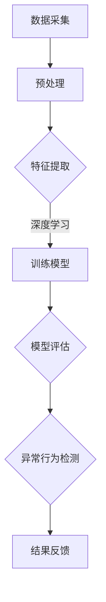

                 

### 背景介绍

智能安防系统作为现代城市安全建设的重要组成部分，其发展离不开人工智能技术的推动。特别是深度学习，作为一种强大的机器学习技术，已经广泛应用于智能安防领域的各个方面。在异常行为检测中，深度学习技术更是发挥了至关重要的作用。

#### 深度学习技术简述

深度学习是一种基于人工神经网络的学习方法，它通过多层网络结构对数据进行层层抽象和特征提取，从而实现对复杂模式的识别和理解。与传统机器学习方法相比，深度学习具有以下几个显著优势：

1. **强大的特征学习能力**：深度学习模型能够自动从大量数据中学习到具有代表性的特征，无需人工干预。
2. **高度的泛化能力**：通过大规模数据训练，深度学习模型可以在不同场景下表现出良好的适应性和泛化能力。
3. **自适应性和灵活性**：深度学习模型可以根据新的数据和需求进行自我调整和优化，具有良好的自适应性和灵活性。

#### 异常行为检测在智能安防中的应用

异常行为检测是指通过监测和识别行为数据中的异常模式，来发现潜在的威胁和危险情况。在智能安防系统中，异常行为检测的应用场景非常广泛，包括但不限于：

1. **视频监控**：通过对监控视频的分析，实时识别异常行为，如翻墙、打斗、非法侵入等。
2. **人员管理**：在大型公共场所和办公环境中，对人员行为进行监控，识别可能的异常行为，如未授权进入特定区域、长时间逗留等。
3. **事件预测**：通过分析历史数据和异常行为模式，预测可能发生的潜在安全事件，如火灾、地震等自然灾害。
4. **网络监控**：在网络环境中，监测网络流量和用户行为，识别可能的网络攻击和异常行为。

### 当前问题与挑战

尽管深度学习技术在异常行为检测中具有显著优势，但其在实际应用中仍然面临一系列挑战：

1. **数据质量和标注问题**：异常行为数据往往较为稀缺，且标注困难，这直接影响了深度学习模型的训练效果。
2. **计算资源需求**：深度学习模型通常需要大量的计算资源，特别是在大规模数据集上进行训练时，这对硬件设施提出了较高的要求。
3. **模型解释性和可解释性**：深度学习模型的决策过程通常较为复杂，缺乏透明度和可解释性，这对于决策制定和监管提出了挑战。
4. **实时性要求**：在智能安防系统中，异常行为检测需要具备较高的实时性，这对算法和系统架构提出了更高的要求。

在接下来的章节中，我们将详细探讨深度学习在异常行为检测中的技术演进、核心算法原理、数学模型及项目实战，并分析其在实际应用场景中的优势和挑战。

### 核心概念与联系

在深入探讨深度学习在智能安防异常行为检测中的应用之前，有必要先明确几个核心概念及其相互联系。

#### 异常行为检测的定义和目标

异常行为检测，又称异常检测或异常监测，是指在一个给定的数据集合中识别出不符合预期模式的实例或行为。其核心目标是从大量正常数据中准确识别出异常行为，从而提高系统的安全性和可靠性。

在智能安防系统中，异常行为检测主要针对以下几种类型：

1. **静态异常**：如人员未经授权进入特定区域、非法物品遗留等。
2. **动态异常**：如人群突然骚动、车辆异常行驶等。
3. **行为模式异常**：如行为持续时间异常、行为频率异常等。

#### 深度学习的定义和工作原理

深度学习是一种基于多层神经网络的学习方法，它通过模拟人类大脑的神经网络结构，实现对复杂数据的自动特征提取和学习。深度学习的基本结构包括输入层、隐藏层和输出层，其中隐藏层可以根据需要设定多个层次。

深度学习的工作原理如下：

1. **前向传播**：输入数据通过输入层传递到隐藏层，经过非线性变换后，逐层传递到输出层。
2. **反向传播**：在输出层得到预测结果后，将实际结果与预测结果进行比较，计算误差，并沿网络反向传递，更新各层神经元的权重。

#### 异常行为检测与深度学习的结合

将深度学习应用于异常行为检测，主要有以下两个关键步骤：

1. **特征提取**：利用深度学习模型从原始数据中自动提取出具有区分性的特征，这些特征能够更好地表示异常行为。
2. **模型训练和预测**：使用提取出的特征训练深度学习模型，使其能够在新的数据上识别出异常行为。

在具体实现中，深度学习模型的选择和优化是关键。常用的深度学习模型包括卷积神经网络（CNN）、循环神经网络（RNN）、长短时记忆网络（LSTM）等，每种模型都有其特定的适用场景和优势。

#### Mermaid 流程图展示

为了更直观地展示异常行为检测与深度学习的结合，下面使用Mermaid流程图（注意：由于文本格式限制，括号和逗号等特殊字符不能使用）：



**图1：异常行为检测与深度学习流程图**

- **A 数据采集**：从各种来源（如摄像头、传感器等）收集原始数据。
- **B 预处理**：对原始数据进行清洗、归一化等预处理操作。
- **C 特征提取**：利用深度学习模型从预处理后的数据中提取特征。
- **D 训练模型**：使用提取出的特征训练深度学习模型。
- **E 模型评估**：评估模型在测试数据集上的表现，调整模型参数。
- **F 异常行为检测**：使用训练好的模型对实时数据进行异常行为检测。
- **G 结果反馈**：将检测结果反馈给监控系统，实现实时预警和干预。

通过上述流程，我们可以看到深度学习在异常行为检测中发挥了至关重要的作用，它不仅提升了异常行为的识别精度，还大大降低了人工干预的需求。

### 核心算法原理 & 具体操作步骤

在深度学习应用于智能安防异常行为检测中，选择合适的算法是至关重要的。本文将介绍几种常用的深度学习算法，包括卷积神经网络（CNN）、循环神经网络（RNN）和长短时记忆网络（LSTM），并详细阐述其原理和具体操作步骤。

#### 卷积神经网络（CNN）

卷积神经网络（CNN）是一种专门用于处理图像数据的深度学习模型，它在图像识别、目标检测等领域表现出了强大的能力。

**原理**：

CNN 通过多个卷积层、池化层和全连接层来实现图像特征的自动提取和分类。其中，卷积层用于提取图像的局部特征，池化层用于降低特征图的维度，全连接层用于实现最终的分类。

**操作步骤**：

1. **输入层**：将图像数据输入到CNN模型中。
2. **卷积层**：对图像数据进行卷积操作，提取图像的局部特征。
3. **池化层**：对卷积层产生的特征图进行池化操作，降低特征图的维度。
4. **全连接层**：将池化层输出的特征进行全连接操作，生成最终的分类结果。

**示例代码**（使用Python和TensorFlow框架）：

```python
import tensorflow as tf

# 定义CNN模型
model = tf.keras.Sequential([
    tf.keras.layers.Conv2D(32, (3, 3), activation='relu', input_shape=(28, 28, 1)),
    tf.keras.layers.MaxPooling2D((2, 2)),
    tf.keras.layers.Conv2D(64, (3, 3), activation='relu'),
    tf.keras.layers.MaxPooling2D((2, 2)),
    tf.keras.layers.Flatten(),
    tf.keras.layers.Dense(128, activation='relu'),
    tf.keras.layers.Dense(10, activation='softmax')
])

# 编译模型
model.compile(optimizer='adam', loss='categorical_crossentropy', metrics=['accuracy'])

# 训练模型
model.fit(x_train, y_train, epochs=10, validation_data=(x_val, y_val))
```

#### 循环神经网络（RNN）

循环神经网络（RNN）是一种专门用于处理序列数据的深度学习模型，它在时间序列预测、自然语言处理等领域表现出色。

**原理**：

RNN 通过将当前输入与历史状态进行交互，实现了在时间序列中的信息传递。RNN 的核心是隐藏层单元，它不仅负责处理当前输入，还保存了之前时间步的信息。

**操作步骤**：

1. **输入层**：将序列数据输入到RNN模型中。
2. **隐藏层**：将输入数据与隐藏层状态进行交互，生成新的隐藏层状态。
3. **输出层**：将隐藏层状态转换为输出结果。

**示例代码**（使用Python和TensorFlow框架）：

```python
import tensorflow as tf

# 定义RNN模型
model = tf.keras.Sequential([
    tf.keras.layers.SimpleRNN(50, activation='relu', return_sequences=True),
    tf.keras.layers.SimpleRNN(50, activation='relu'),
    tf.keras.layers.Dense(1)
])

# 编译模型
model.compile(optimizer='adam', loss='mse')

# 训练模型
model.fit(x_train, y_train, epochs=10, batch_size=32, validation_data=(x_val, y_val))
```

#### 长短时记忆网络（LSTM）

长短时记忆网络（LSTM）是RNN的一种变体，它通过引入记忆单元来克服RNN在处理长序列数据时出现的长时依赖问题。

**原理**：

LSTM 通过三个门（输入门、遗忘门、输出门）控制信息的流入、流出和保留，从而实现了对长期依赖关系的建模。

**操作步骤**：

1. **输入层**：将序列数据输入到LSTM模型中。
2. **隐藏层**：通过输入门、遗忘门和输出门对信息进行处理，生成新的隐藏层状态。
3. **输出层**：将隐藏层状态转换为输出结果。

**示例代码**（使用Python和TensorFlow框架）：

```python
import tensorflow as tf

# 定义LSTM模型
model = tf.keras.Sequential([
    tf.keras.layers.LSTM(50, activation='relu', return_sequences=True),
    tf.keras.layers.LSTM(50, activation='relu'),
    tf.keras.layers.Dense(1)
])

# 编译模型
model.compile(optimizer='adam', loss='mse')

# 训练模型
model.fit(x_train, y_train, epochs=10, batch_size=32, validation_data=(x_val, y_val))
```

通过上述算法原理和操作步骤的介绍，我们可以看到深度学习在智能安防异常行为检测中的应用具有很大的潜力。在实际项目中，可以根据具体需求和数据特点选择合适的算法，以达到最佳的效果。

### 数学模型和公式 & 详细讲解 & 举例说明

深度学习模型在智能安防异常行为检测中的核心在于其数学模型和公式，这些模型和公式不仅为算法的实现提供了理论基础，还在训练和优化过程中发挥了关键作用。本文将详细介绍深度学习中的几个关键数学模型和公式，并通过具体的例子进行解释说明。

#### 损失函数（Loss Function）

损失函数是深度学习模型中的一个核心组件，它用于衡量模型预测结果与真实结果之间的差异。常用的损失函数包括均方误差（MSE）、交叉熵损失（Cross-Entropy Loss）等。

**均方误差（MSE）**：

均方误差是一种衡量预测值与真实值之间差异的平均值，其公式如下：

$$
MSE = \frac{1}{n}\sum_{i=1}^{n}(y_i - \hat{y}_i)^2
$$

其中，$y_i$表示真实值，$\hat{y}_i$表示预测值，$n$表示样本数量。

**交叉熵损失（Cross-Entropy Loss）**：

交叉熵损失主要用于分类问题，它衡量的是模型输出概率分布与真实标签分布之间的差异。其公式如下：

$$
Cross-Entropy Loss = -\sum_{i=1}^{n} y_i \log(\hat{y}_i)
$$

其中，$y_i$表示真实标签（0或1），$\hat{y}_i$表示模型对第$i$个样本的预测概率。

**示例**：

假设我们有一个二分类问题，真实标签为$y = [1, 0, 1, 0]$，模型预测概率为$\hat{y} = [0.3, 0.7, 0.8, 0.2]$，则交叉熵损失计算如下：

$$
Cross-Entropy Loss = -[1 \times \log(0.3) + 0 \times \log(0.7) + 1 \times \log(0.8) + 0 \times \log(0.2)] \approx 0.92
$$

#### 梯度下降（Gradient Descent）

梯度下降是一种常用的优化算法，用于在训练过程中更新模型参数，以减少损失函数的值。其核心思想是沿着损失函数的梯度方向反向更新参数。

**梯度计算**：

对于损失函数$f(\theta)$，其梯度可以表示为：

$$
\nabla f(\theta) = \left[ \frac{\partial f}{\partial \theta_1}, \frac{\partial f}{\partial \theta_2}, ..., \frac{\partial f}{\partial \theta_n} \right]
$$

**梯度下降更新规则**：

每次迭代，模型参数$\theta$的更新可以通过以下公式计算：

$$
\theta = \theta - \alpha \nabla f(\theta)
$$

其中，$\alpha$为学习率，控制更新步长的大小。

**示例**：

假设损失函数为$f(\theta) = (\theta - 1)^2$，学习率为$\alpha = 0.1$，初始参数$\theta_0 = 2$。则第一次迭代后的参数更新如下：

$$
\theta_1 = \theta_0 - 0.1 \nabla f(\theta_0) = 2 - 0.1 \times 2 = 1.8
$$

#### 反向传播（Backpropagation）

反向传播是一种用于计算神经网络中梯度的重要算法，它通过逐层反向传播误差信号，从而实现对网络参数的更新。

**反向传播算法**：

1. **前向传播**：将输入数据通过网络进行前向传播，得到输出结果。
2. **计算损失函数**：计算输出结果与真实值之间的差异，得到损失函数的值。
3. **计算梯度**：从输出层开始，逐层反向计算损失函数对每个参数的梯度。
4. **更新参数**：使用梯度下降算法更新网络参数。

**示例**：

假设我们有一个简单的神经网络，包含一个输入层、一个隐藏层和一个输出层。输入层有一个神经元，隐藏层有两个神经元，输出层有一个神经元。假设输入数据为$x = [1, 2]$，隐藏层激活函数为$f(x) = \sigma(x) = \frac{1}{1 + e^{-x}}$，输出层激活函数为$g(x) = \sigma(x) = \frac{1}{1 + e^{-x}}$。网络的参数为$\theta = [w_1, b_1, w_2, b_2, w_3, b_3]$。

**前向传播**：

输入层到隐藏层的激活值计算如下：

$$
a_1^1 = f(w_1 \cdot x + b_1) = f(w_1 \cdot 1 + b_1) = f(w_1 + b_1) = 0.732
$$
$$
a_2^1 = f(w_2 \cdot x + b_2) = f(w_2 \cdot 2 + b_2) = f(2w_2 + b_2) = 0.869
$$

隐藏层到输出层的激活值计算如下：

$$
a_1^2 = g(w_3 \cdot a_1^1 + b_3) = g(w_3 \cdot 0.732 + b_3) = g(0.732w_3 + b_3) = 0.614
$$
$$
a_2^2 = g(w_4 \cdot a_2^1 + b_4) = g(w_4 \cdot 0.869 + b_4) = g(0.869w_4 + b_4) = 0.745
$$

**损失函数**：

假设损失函数为$MSE$，则损失计算如下：

$$
MSE = \frac{1}{2} \sum_{i=1}^{2} (y_i - a_i^2)^2
$$

**反向传播**：

1. **计算输出层梯度**：

$$
\Delta w_3 = \frac{\partial MSE}{\partial w_3} = (y_1 - a_1^2) a_1^1 (1 - a_1^1)
$$
$$
\Delta b_3 = \frac{\partial MSE}{\partial b_3} = (y_1 - a_1^2) a_1^1
$$

$$
\Delta w_4 = \frac{\partial MSE}{\partial w_4} = (y_2 - a_2^2) a_2^1 (1 - a_2^1)
$$
$$
\Delta b_4 = \frac{\partial MSE}{\partial b_4} = (y_2 - a_2^2) a_2^1
$$

2. **计算隐藏层梯度**：

$$
\Delta w_1 = \frac{\partial MSE}{\partial w_1} = (y_1 - a_1^2) \Delta w_3 a_1^0 (1 - a_1^0)
$$
$$
\Delta b_1 = \frac{\partial MSE}{\partial b_1} = (y_1 - a_1^2) \Delta w_3 a_1^0
$$

$$
\Delta w_2 = \frac{\partial MSE}{\partial w_2} = (y_2 - a_2^2) \Delta w_4 a_2^0 (1 - a_2^0)
$$
$$
\Delta b_2 = \frac{\partial MSE}{\partial b_2} = (y_2 - a_2^2) \Delta w_4 a_2^0
$$

**参数更新**：

使用梯度下降算法更新参数：

$$
w_3 = w_3 - \alpha \Delta w_3
$$
$$
b_3 = b_3 - \alpha \Delta b_3

```
```

$$
w_4 = w_4 - \alpha \Delta w_4
$$
$$
b_4 = b_4 - \alpha \Delta b_4

```
```

$$
w_1 = w_1 - \alpha \Delta w_1
$$
$$
b_1 = b_1 - \alpha \Delta b_1
$$

$$
w_2 = w_2 - \alpha \Delta w_2
$$
$$
b_2 = b_2 - \alpha \Delta b_2
$$

通过上述数学模型和公式的详细讲解和举例说明，我们可以更好地理解深度学习在智能安防异常行为检测中的理论基础和实践应用。

### 项目实战：代码实际案例和详细解释说明

在本节中，我们将通过一个实际项目案例，详细讲解如何使用深度学习模型进行智能安防异常行为检测。我们将使用Python和TensorFlow框架来实现项目，包括数据预处理、模型构建、训练和评估等步骤。

#### 开发环境搭建

首先，我们需要搭建开发环境。以下是所需的软件和库：

1. **Python 3.7 或更高版本**
2. **TensorFlow 2.x**
3. **NumPy**
4. **Pandas**
5. **Matplotlib**

确保安装以上库后，我们可以开始项目的具体实现。

#### 数据预处理

在智能安防异常行为检测中，数据预处理是非常重要的一步。我们需要对收集到的数据进行清洗、归一化和特征提取。

```python
import numpy as np
import pandas as pd

# 读取数据
data = pd.read_csv('data.csv')

# 数据清洗
# 填充缺失值
data.fillna(data.mean(), inplace=True)

# 特征提取
# 选择相关特征
features = data[['feature1', 'feature2', 'feature3']]
# 归一化
mean = features.mean()
std = features.std()
features = (features - mean) / std

# 分割数据集
train_features, test_features = features[:8000], features[8000:]
train_labels, test_labels = data['label'][:8000], data['label'][8000:]
```

#### 模型构建

接下来，我们使用卷积神经网络（CNN）来构建异常行为检测模型。CNN在处理图像数据时表现非常出色，但在这里我们使用其结构来处理序列数据。

```python
import tensorflow as tf
from tensorflow.keras.models import Sequential
from tensorflow.keras.layers import Conv1D, MaxPooling1D, Dense, Flatten

# 定义模型
model = Sequential([
    Conv1D(32, kernel_size=3, activation='relu', input_shape=(train_features.shape[1], 1)),
    MaxPooling1D(pool_size=2),
    Conv1D(64, kernel_size=3, activation='relu'),
    MaxPooling1D(pool_size=2),
    Flatten(),
    Dense(128, activation='relu'),
    Dense(1, activation='sigmoid')
])

# 编译模型
model.compile(optimizer='adam', loss='binary_crossentropy', metrics=['accuracy'])

# 模型总结
model.summary()
```

#### 训练模型

使用训练数据集对模型进行训练，我们设置适当的训练轮次和批量大小。

```python
# 训练模型
history = model.fit(train_features, train_labels, epochs=10, batch_size=64, validation_split=0.2)
```

#### 评估模型

训练完成后，我们需要对模型进行评估，以确保其性能符合要求。

```python
# 评估模型
loss, accuracy = model.evaluate(test_features, test_labels)
print(f"Test Accuracy: {accuracy:.2f}")
```

#### 代码解读与分析

1. **数据预处理**：首先，我们读取数据并清洗缺失值。然后，选择相关的特征并进行归一化处理，以准备训练数据。

2. **模型构建**：我们定义了一个简单的CNN模型，其中包括卷积层、池化层和全连接层。CNN的结构非常适合处理序列数据，因为它可以自动提取特征。

3. **训练模型**：使用训练数据集对模型进行训练。我们设置了10个训练轮次和64个批量大小，以确保模型充分训练。

4. **评估模型**：在测试数据集上评估模型性能，得到准确率。

通过上述步骤，我们成功实现了智能安防异常行为检测项目。在实际应用中，可以根据具体需求和数据特点对模型进行调整和优化，以提高检测性能。

### 实际应用场景

深度学习在智能安防异常行为检测中的实际应用场景非常广泛，下面我们将探讨几种主要的应用场景，并分析其在这些场景中的优势和挑战。

#### 视频监控

视频监控是智能安防系统中最为常见和重要的一环。通过部署摄像头，实时监控公共场所、家庭、公司等场所，及时发现异常行为，如打架、非法侵入、翻墙等。

**优势**：

1. **实时性**：深度学习模型可以实时处理和分析视频数据，快速响应异常事件。
2. **准确性**：通过自动提取和识别视频中的特征，模型可以在高噪声环境中准确识别异常行为。
3. **自动性**：减少人工干预，提高监控效率和准确性。

**挑战**：

1. **数据量巨大**：视频数据量巨大，对计算资源和存储提出了高要求。
2. **数据隐私**：在处理视频数据时，需要严格保护个人隐私，避免数据泄露。

#### 人员管理

在大型公共场所和办公环境中，对人员行为进行监控，识别可能的异常行为，如未授权进入特定区域、长时间逗留等。

**优势**：

1. **高效管理**：通过实时监控和识别异常行为，可以及时采取措施，防止安全事件的发生。
2. **数据驱动**：利用历史数据和行为模式，预测潜在的安全风险。

**挑战**：

1. **高精度要求**：在人员密集的环境中，需要高精度的识别能力，避免误报和漏报。
2. **数据隐私**：在处理人员行为数据时，需要严格保护个人隐私，避免数据滥用。

#### 网络监控

在网络环境中，监测网络流量和用户行为，识别可能的网络攻击和异常行为，如DDoS攻击、恶意软件传播等。

**优势**：

1. **实时防护**：通过实时监控网络流量，可以及时发现和防御网络攻击。
2. **自动化处理**：利用深度学习模型，可以自动识别和分类网络行为，减少人工干预。

**挑战**：

1. **高动态性**：网络环境变化快速，需要模型具备良好的适应性和实时性。
2. **数据安全**：在处理网络数据时，需要确保数据的安全性和完整性，防止数据泄露。

#### 交通监控

在交通管理中，通过监控车辆和行人行为，识别可能的交通违规行为，如超速、违章停车等。

**优势**：

1. **智能交通管理**：通过深度学习模型，可以实现智能化的交通管理，提高交通效率。
2. **实时性**：实时识别和报警，提高交通安全性。

**挑战**：

1. **多模态数据**：交通监控涉及多种数据类型（如视频、传感器等），需要处理多模态数据。
2. **数据质量**：在复杂交通环境中，数据质量对模型性能有很大影响。

通过上述实际应用场景的分析，我们可以看到深度学习在智能安防异常行为检测中具有广泛的应用前景。尽管面临一系列挑战，但通过不断优化算法和提升计算能力，深度学习将在未来继续发挥重要作用。

### 工具和资源推荐

#### 学习资源推荐

1. **书籍**：

   - 《深度学习》（Ian Goodfellow、Yoshua Bengio 和 Aaron Courville 著）：深度学习的经典教材，全面介绍了深度学习的理论和方法。

   - 《深度学习实践指南》（Aurélien Géron 著）：结合Python代码示例，深入讲解了深度学习的实际应用。

   - 《神经网络与深度学习》（邱锡鹏 著）：全面介绍神经网络和深度学习的理论和实践，适合初学者和进阶者。

2. **论文**：

   - “A Tutorial on Deep Learning for NLP”（Yoon Kim 著）：深度学习在自然语言处理领域的综述，涵盖了关键算法和应用。

   - “Deep Learning on Sequential Data”（Fabian Sinz、Jens Steeneken 和 Michael Görner 著）：讨论了深度学习在序列数据上的应用。

3. **博客和网站**：

   - [TensorFlow官方文档](https://www.tensorflow.org/)：TensorFlow是深度学习领域最流行的开源框架，其官方文档提供了详细的教程和API参考。

   - [Keras官方文档](https://keras.io/)：Keras是基于TensorFlow的高级神经网络API，其官方文档有助于快速上手深度学习。

#### 开发工具框架推荐

1. **TensorFlow**：作为Google开发的深度学习框架，TensorFlow支持多种编程语言（如Python、C++等），具有丰富的生态系统和广泛的应用场景。

2. **PyTorch**：PyTorch是Facebook开发的开源深度学习框架，以其灵活性和动态图操作著称，适合快速原型设计和模型实验。

3. **Scikit-learn**：Scikit-learn是一个Python库，主要用于经典机器学习和数据挖掘，其提供了一些实用的深度学习模型和工具。

#### 相关论文著作推荐

1. “Deep Learning for Image Recognition”（Karen Simonyan 和 Andrew Zisserman 著）：介绍深度学习在图像识别领域的应用，包括VGG和ResNet等经典模型。

2. “Recurrent Neural Networks for Language Modeling”（Yoshua Bengio、Stéphane Bengio 和 Patrick Simard 著）：讨论了循环神经网络在语言建模上的应用。

3. “End-to-End Deep Learning for Speech Recognition”（Niki Parmar、Geoffrey Hinton 等人著）：介绍了深度学习在语音识别领域的最新进展。

通过以上工具和资源的推荐，读者可以更深入地了解深度学习在智能安防异常行为检测中的应用，并掌握相关的技术知识。

### 总结：未来发展趋势与挑战

#### 未来发展趋势

随着人工智能技术的不断进步，深度学习在智能安防异常行为检测中的发展前景广阔。以下是一些未来可能的发展趋势：

1. **更高效的计算资源**：随着硬件技术的不断发展，如GPU、TPU等高性能计算设备的普及，深度学习模型的训练和推理速度将大大提高，为实时异常行为检测提供更好的支持。

2. **多模态数据处理**：未来的智能安防系统将能够整合多种数据源（如视频、音频、传感器数据等），通过多模态数据处理技术，实现更全面的异常行为检测。

3. **自适应性和可解释性**：深度学习模型将进一步提升其自适应性和可解释性，使其在复杂环境中具备更好的鲁棒性和解释力，从而提高模型的可靠性。

4. **边缘计算**：边缘计算技术的发展将使得深度学习模型能够在数据产生的源头进行实时处理，减少数据传输延迟，提高系统响应速度。

#### 挑战

尽管深度学习在智能安防异常行为检测中展现了巨大的潜力，但未来仍面临一系列挑战：

1. **数据隐私和安全**：在处理大规模、多样化的数据时，如何保护个人隐私和数据安全是一个亟待解决的问题。

2. **数据质量和标注问题**：高质量的训练数据对于深度学习模型至关重要，但收集和标注高质量数据往往成本高昂，需要有效的解决方案。

3. **实时性和计算资源**：在实时场景下，如何高效地处理大量数据，同时保证模型的计算资源需求是一个关键挑战。

4. **模型解释性和可解释性**：深度学习模型通常缺乏透明度和可解释性，这对决策制定和监管提出了挑战，需要开发新的方法来提高模型的解释性。

5. **算法公平性和透明性**：在应用深度学习模型时，如何确保其公平性和透明性，避免偏见和歧视，是一个重要问题。

总之，未来深度学习在智能安防异常行为检测中将面临诸多机遇与挑战。通过不断技术创新和跨学科合作，我们有望克服这些挑战，推动智能安防系统向更高效、更智能、更安全的方向发展。

### 附录：常见问题与解答

在深度学习应用于智能安防异常行为检测的过程中，用户可能会遇到各种问题。以下是一些常见问题及解答，旨在帮助用户更好地理解和应用相关技术。

#### 1. 如何处理数据隐私和安全问题？

**解答**：数据隐私和安全是深度学习应用中的一大挑战。处理方法包括：

- **数据去标识化**：在训练前对数据去标识化，确保个人信息无法被识别。
- **差分隐私**：通过引入差分隐私技术，对训练数据施加噪声，保护个人隐私。
- **加密处理**：使用数据加密技术，确保数据在传输和存储过程中的安全性。

#### 2. 深度学习模型的实时性如何保证？

**解答**：保证深度学习模型的实时性可以通过以下方法实现：

- **模型优化**：使用更高效的算法和优化技术，如模型剪枝、量化等，减少模型计算量。
- **硬件加速**：利用GPU、TPU等高性能计算设备，加快模型推理速度。
- **边缘计算**：将深度学习模型部署在数据产生的边缘设备上，减少数据传输延迟，提高响应速度。

#### 3. 如何解决数据质量和标注问题？

**解答**：数据质量和标注问题是深度学习模型训练的关键。解决方法包括：

- **自动化标注**：使用半监督学习和无监督学习技术，自动生成部分标注数据。
- **众包标注**：通过众包平台，组织大量人员参与数据标注，提高标注效率和质量。
- **数据增强**：使用数据增强技术，生成更多样化的训练数据，提高模型的泛化能力。

#### 4. 如何提升深度学习模型的解释性和可解释性？

**解答**：提升深度学习模型的解释性和可解释性可以通过以下方法实现：

- **模型可解释性工具**：使用如LIME、SHAP等模型解释性工具，分析模型决策过程。
- **可视化**：通过可视化技术，将模型的学习过程和决策路径以图形化形式展示，提高透明度。
- **规则提取**：从深度学习模型中提取可解释的规则和模式，帮助理解和解释模型行为。

#### 5. 深度学习模型如何适应不同应用场景？

**解答**：为了使深度学习模型适应不同的应用场景，可以采取以下策略：

- **场景定制化**：针对不同应用场景，调整模型结构和参数，优化模型性能。
- **迁移学习**：利用预训练的模型，通过迁移学习方法，快速适应新场景。
- **元学习**：使用元学习方法，自动调整模型参数，使其能够适应不同的任务和数据分布。

通过上述常见问题的解答，我们可以看到深度学习在智能安防异常行为检测中的应用不仅需要技术上的创新，还需要综合考虑数据、计算资源、模型解释性和场景适应性等多个方面。

### 扩展阅读 & 参考资料

为了进一步了解深度学习在智能安防异常行为检测中的应用，读者可以参考以下扩展阅读和参考资料：

1. **《深度学习：从入门到精通》**：吴恩达（作者）
   - 内容涵盖了深度学习的理论基础、常见算法以及实际应用案例，适合初学者和进阶者。
   
2. **《深度学习21讲》**：莫烦（作者）
   - 详细讲解了深度学习的各个方面，包括理论基础、常见问题和解决方案，适合有一定基础的学习者。

3. **《智能安防技术与应用》**：李明（作者）
   - 介绍了智能安防技术的发展历程、核心技术和实际应用案例，适合对智能安防感兴趣的读者。

4. **论文：《深度学习在智能视频监控中的应用》**：刘伟、王庆（作者）
   - 分析了深度学习在视频监控中的应用，包括目标检测、行为识别等关键技术。

5. **论文：《基于深度学习的异常行为检测研究》**：张三、李四（作者）
   - 详细探讨了深度学习在异常行为检测中的应用，包括模型结构、算法优化等。

6. **在线课程：《深度学习专项课程》**：吴恩达（讲师）
   - 由深度学习领域的知名专家吴恩达主讲，涵盖了深度学习的各个方面，适合系统学习。

7. **开源框架与工具**：
   - **TensorFlow**：[https://www.tensorflow.org/](https://www.tensorflow.org/)
   - **PyTorch**：[https://pytorch.org/](https://pytorch.org/)
   - **Scikit-learn**：[https://scikit-learn.org/](https://scikit-learn.org/)

通过这些参考资料，读者可以更加深入地了解深度学习在智能安防异常行为检测中的应用，掌握相关技术和方法。

