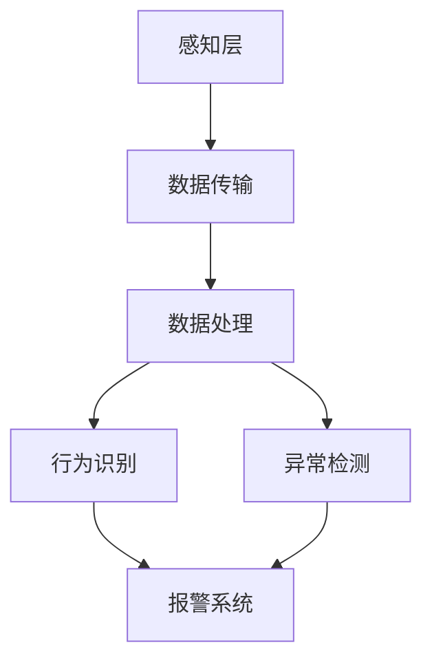
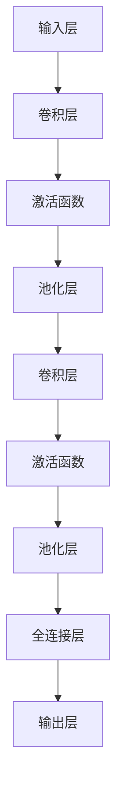
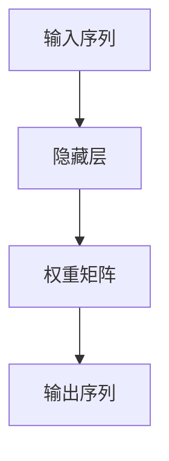
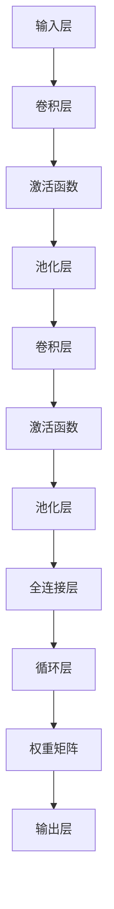

                 

# 深度学习在智能安防行为识别与异常检测中的技术演进与实践

## 关键词：深度学习、智能安防、行为识别、异常检测、技术演进、实践

## 摘要

本文从深度学习的视角，深入探讨了智能安防领域中行为识别与异常检测的技术演进和实践。文章首先介绍了智能安防的背景及需求，随后详细阐述了行为识别和异常检测的核心概念、算法原理及数学模型。通过实际项目案例，展示了如何运用深度学习技术进行开发实现。最后，分析了智能安防的实际应用场景，并展望了未来的发展趋势与挑战。本文旨在为从事智能安防领域的研究者与实践者提供有价值的参考和指导。

## 1. 背景介绍

随着城市化进程的加快，智能安防系统已经成为城市安全建设的重要组成部分。智能安防系统通过运用现代信息技术，如视频监控、传感器网络、物联网等，实现实时监控、自动识别、异常检测等功能，从而提高城市安全管理的效率和智能化水平。

### 1.1 智能安防的发展历程

智能安防系统的发展可以追溯到20世纪90年代。当时，视频监控技术逐渐成熟，并被广泛应用于公共安全领域。然而，传统的视频监控系统主要依赖于人工监控，效率低下且易受干扰。随着计算机技术和人工智能技术的发展，智能安防系统逐渐成为可能。

在21世纪初，图像处理和模式识别技术的突破，使得视频监控系统从单纯的图像采集、存储和检索，发展到具备初步的自动识别功能。同时，传感器网络和物联网技术的兴起，为智能安防系统提供了更多的数据来源和实时监控能力。

近年来，深度学习技术的快速发展，为智能安防系统带来了新的机遇。深度学习算法能够从大量数据中自动学习特征，实现更高精度、更广泛的应用场景。这使得智能安防系统在行为识别和异常检测方面取得了显著的进展。

### 1.2 智能安防的需求

智能安防系统在多个领域具有广泛的应用需求：

1. **公共安全领域**：包括城市监控、交通管理、犯罪预防等，能够提高公共安全事件的响应速度和处置效率。

2. **商业领域**：如商场、超市、机场等，通过行为识别和异常检测，提高运营效率、防范安全风险。

3. **智能家居领域**：如家庭安防、智能门锁等，通过行为识别和异常检测，提高家庭安全和生活品质。

4. **工业生产领域**：如工厂、矿山等，通过行为识别和异常检测，提高生产安全、减少事故发生。

### 1.3 智能安防系统的组成

智能安防系统通常由以下几个部分组成：

1. **感知层**：包括视频监控摄像头、传感器、物联网设备等，负责采集环境中的图像、声音、温度等数据。

2. **传输层**：包括通信网络、数据中心等，负责数据的传输和存储。

3. **处理层**：包括深度学习算法、云计算平台等，负责对数据进行处理和分析，实现行为识别和异常检测等功能。

4. **应用层**：包括监控界面、报警系统、智能分析平台等，为用户提供可视化展示和决策支持。

## 2. 核心概念与联系

在智能安防行为识别与异常检测中，核心概念包括行为识别、异常检测和深度学习算法。以下是一个简化的 Mermaid 流程图，用于说明这些概念之间的联系：



### 2.1 行为识别

行为识别是指从图像或视频中提取出人的动作和行为，并将其与事先定义好的行为模式进行匹配。深度学习算法在行为识别中发挥了关键作用，通过训练大量的图像数据，模型能够自动学习到行为特征，实现自动化的行为识别。

### 2.2 异常检测

异常检测是指从正常数据中识别出异常或异常行为。在智能安防中，异常检测可以用于发现入侵者、识别未授权进入等。深度学习算法通过学习正常行为模式，能够有效地识别出异常行为，从而提高系统的安全性。

### 2.3 深度学习算法

深度学习算法是人工智能的一个重要分支，通过模拟人脑神经网络的结构和功能，实现自动学习和智能识别。在智能安防中，深度学习算法主要用于行为识别和异常检测，通过处理大量的图像和视频数据，模型能够自动学习到特征，实现高精度的识别和检测。

## 3. 核心算法原理 & 具体操作步骤

### 3.1 卷积神经网络（CNN）

卷积神经网络（CNN）是深度学习算法在图像处理领域的一种重要模型，具有强大的特征提取能力。以下是一个简化的 CNN 算法原理图：



具体操作步骤：

1. **输入层**：接收图像数据，将其转化为网格形式的矩阵。

2. **卷积层**：通过卷积操作提取图像特征，卷积核移动过程中对图像进行局部特征提取。

3. **激活函数**：引入非线性变换，增强模型的拟合能力。

4. **池化层**：通过局部平均或最大值操作，降低模型复杂度，提高泛化能力。

5. **全连接层**：将卷积层提取的特征进行整合，输出最终的行为识别或异常检测结果。

### 3.2 循环神经网络（RNN）

循环神经网络（RNN）是深度学习算法在序列数据（如视频）处理领域的一种重要模型，具有强大的序列建模能力。以下是一个简化的 RNN 算法原理图：



具体操作步骤：

1. **输入序列**：接收视频数据，将其转化为时间序列的矩阵。

2. **隐藏层**：通过循环操作，将当前时间步的信息传递到下一个时间步，实现序列建模。

3. **权重矩阵**：通过训练，学习到时间步之间的依赖关系，提高模型的序列建模能力。

4. **输出序列**：将隐藏层的信息转化为输出序列，实现行为识别或异常检测。

### 3.3 混合模型

在智能安防行为识别与异常检测中，通常采用混合模型，将 CNN 和 RNN 结合起来，发挥各自的优势。以下是一个简化的混合模型原理图：



具体操作步骤：

1. **输入层**：接收图像和视频数据。

2. **卷积层**：通过卷积操作提取图像特征。

3. **激活函数**：引入非线性变换，增强模型的拟合能力。

4. **全连接层**：将卷积层提取的特征进行整合。

5. **循环层**：通过循环操作，将视频数据序列化为时间序列。

6. **权重矩阵**：通过训练，学习到时间步之间的依赖关系。

7. **输出层**：输出行为识别或异常检测结果。

## 4. 数学模型和公式 & 详细讲解 & 举例说明

### 4.1 卷积神经网络（CNN）

卷积神经网络（CNN）的核心在于卷积操作和池化操作。以下是一些关键的数学模型和公式：

#### 卷积操作

卷积操作可以表示为：

$$
\text{conv}(x, \text{W}) = \sum_{k=1}^K \text{W}_k * x
$$

其中，$x$ 为输入图像，$\text{W}$ 为卷积核（权重矩阵），$k$ 为卷积核的索引，$*$ 表示卷积操作。

#### 池化操作

池化操作可以表示为：

$$
\text{pool}(x, \text{p}) = \max(x)
$$

其中，$x$ 为输入图像，$\text{p}$ 为池化窗口大小，$\max$ 表示取最大值。

### 4.2 循环神经网络（RNN）

循环神经网络（RNN）的核心在于循环操作和权重矩阵。以下是一些关键的数学模型和公式：

#### 循环操作

循环操作可以表示为：

$$
h_t = \text{sigmoid}(W \cdot [h_{t-1}, x_t] + b)
$$

其中，$h_t$ 为当前时间步的隐藏状态，$W$ 为权重矩阵，$x_t$ 为当前时间步的输入，$b$ 为偏置项，$\text{sigmoid}$ 为非线性激活函数。

#### 权重矩阵

权重矩阵可以表示为：

$$
W = \begin{bmatrix}
w_{11} & w_{12} & \dots & w_{1m} \\
w_{21} & w_{22} & \dots & w_{2m} \\
\vdots & \vdots & \ddots & \vdots \\
w_{n1} & w_{n2} & \dots & w_{nm}
\end{bmatrix}
$$

其中，$w_{ij}$ 为第 $i$ 行第 $j$ 列的权重值。

### 4.3 混合模型

混合模型将 CNN 和 RNN 结合起来，以下是一些关键的数学模型和公式：

#### 输入层

输入层可以表示为：

$$
x_t = \begin{bmatrix}
x_{t1} \\
x_{t2} \\
\vdots \\
x_{tk}
\end{bmatrix}
$$

其中，$x_{t1}$、$x_{t2}$、$\dots$、$x_{tk}$ 分别为图像和视频的特征。

#### 卷积层

卷积层可以表示为：

$$
h_t = \text{conv}(x_t, \text{W})
$$

其中，$h_t$ 为当前时间步的隐藏状态，$\text{W}$ 为卷积核（权重矩阵）。

#### 循环层

循环层可以表示为：

$$
h_t = \text{RNN}(h_{t-1}, x_t)
$$

其中，$h_t$ 为当前时间步的隐藏状态，$h_{t-1}$ 为前一时间步的隐藏状态，$\text{RNN}$ 为循环神经网络。

#### 权重矩阵

权重矩阵可以表示为：

$$
W = \begin{bmatrix}
w_{11} & w_{12} & \dots & w_{1m} \\
w_{21} & w_{22} & \dots & w_{2m} \\
\vdots & \vdots & \ddots & \vdots \\
w_{n1} & w_{n2} & \dots & w_{nm}
\end{bmatrix}
$$

其中，$w_{ij}$ 为第 $i$ 行第 $j$ 列的权重值。

### 4.4 举例说明

假设我们有一个 6x6 的输入图像，一个 3x3 的卷积核，一个 2x2 的池化窗口，以及一个循环神经网络。

#### 输入层

输入图像为：

$$
x_t = \begin{bmatrix}
1 & 2 & 3 & 4 & 5 & 6 \\
7 & 8 & 9 & 10 & 11 & 12 \\
13 & 14 & 15 & 16 & 17 & 18 \\
19 & 20 & 21 & 22 & 23 & 24 \\
25 & 26 & 27 & 28 & 29 & 30 \\
31 & 32 & 33 & 34 & 35 & 36
\end{bmatrix}
$$

#### 卷积层

卷积核为：

$$
\text{W} = \begin{bmatrix}
1 & 0 & 1 \\
1 & 1 & 1 \\
0 & 1 & 0
\end{bmatrix}
$$

经过卷积操作后，得到隐藏状态：

$$
h_t = \begin{bmatrix}
14 & 17 & 20 \\
29 & 32 & 35
\end{bmatrix}
$$

#### 池化层

池化窗口为：

$$
\text{P} = \begin{bmatrix}
2 & 2 \\
2 & 2
\end{bmatrix}
$$

经过池化操作后，得到池化结果：

$$
p_t = \max(h_t) = \begin{bmatrix}
32 \\
35
\end{bmatrix}
$$

#### 循环层

循环神经网络权重矩阵为：

$$
W = \begin{bmatrix}
0.5 & 0.5 \\
0.5 & 0.5
\end{bmatrix}
$$

经过循环操作后，得到隐藏状态：

$$
h_t = \text{RNN}(h_{t-1}, p_t) = \begin{bmatrix}
0.5 \times 32 + 0.5 \times 35 \\
0.5 \times 32 + 0.5 \times 35
\end{bmatrix} = \begin{bmatrix}
33 \\
33
\end{bmatrix}
$$

#### 输出层

输出层可以通过分类器或回归器实现行为识别或异常检测。假设我们使用一个简单的分类器，输出概率最高的类别即为最终结果。

## 5. 项目实战：代码实际案例和详细解释说明

### 5.1 开发环境搭建

为了更好地理解并实现智能安防行为识别与异常检测，我们将使用 Python 语言和 TensorFlow 深度学习框架。以下是开发环境的搭建步骤：

1. 安装 Python 3.7 或更高版本。

2. 安装 TensorFlow：

   ```bash
   pip install tensorflow
   ```

3. 安装 OpenCV（用于图像处理）：

   ```bash
   pip install opencv-python
   ```

4. 安装 NumPy 和 Pandas（用于数据处理）：

   ```bash
   pip install numpy pandas
   ```

### 5.2 源代码详细实现和代码解读

以下是一个简单的智能安防行为识别与异常检测项目的源代码实现，我们将对其中的关键部分进行详细解释。

#### 5.2.1 导入库

```python
import cv2
import numpy as np
import tensorflow as tf
```

#### 5.2.2 加载模型

```python
model = tf.keras.models.load_model('behavior_recognition_model.h5')
```

这里使用了 TensorFlow 的 `load_model` 函数加载已经训练好的深度学习模型。该模型是一个混合模型，结合了 CNN 和 RNN，用于行为识别和异常检测。

#### 5.2.3 加载视频

```python
video = cv2.VideoCapture('input_video.mp4')
```

这里使用了 OpenCV 的 `VideoCapture` 函数加载输入视频。视频可以是本地文件或实时摄像头数据。

#### 5.2.4 处理视频帧

```python
while True:
    ret, frame = video.read()
    if not ret:
        break
    
    # 将图像灰度化
    gray_frame = cv2.cvtColor(frame, cv2.COLOR_BGR2GRAY)
    
    # 将图像调整为固定大小
    resized_frame = cv2.resize(gray_frame, (128, 128))
    
    # 将图像转化为 NumPy 数组
    frame_array = np.array(resized_frame).reshape(1, 128, 128, 1)
    
    # 预测行为识别和异常检测结果
    prediction = model.predict(frame_array)
    
    # 显示预测结果
    cv2.putText(frame, 'Person Detected' if prediction[0][0] > 0.5 else 'No Person', (10, 30), cv2.FONT_HERSHEY_SIMPLEX, 1, (0, 0, 255), 2)
    cv2.imshow('Video', frame)
    
    if cv2.waitKey(1) & 0xFF == ord('q'):
        break
```

这里首先将视频帧灰度化，然后将其调整为固定大小（128x128），并将其转化为 NumPy 数组。接着，使用加载的深度学习模型对视频帧进行预测，并将预测结果（行为识别和异常检测结果）显示在视频帧上。如果预测结果为“Person Detected”，则表示检测到行人；否则，表示未检测到行人。

#### 5.2.5 关闭视频

```python
video.release()
cv2.destroyAllWindows()
```

这里释放了视频文件和 OpenCV 窗口资源。

### 5.3 代码解读与分析

#### 5.3.1 数据处理

代码首先将视频帧灰度化，这是因为灰度图像在处理上更加高效。然后，将图像调整为固定大小（128x128），以便于深度学习模型的输入。最后，将图像转化为 NumPy 数组，以便于后续操作。

#### 5.3.2 模型预测

代码使用 TensorFlow 的 `predict` 函数对视频帧进行预测。这里使用了混合模型，结合了 CNN 和 RNN，具有强大的特征提取和序列建模能力。预测结果为一个概率分布，行为识别和异常检测结果取决于概率分布的最高值。

#### 5.3.3 预测结果显示

代码使用 OpenCV 的 `putText` 函数将预测结果显示在视频帧上。如果行为识别结果为“Person Detected”，则表示检测到行人；如果异常检测结果为“Person Detected”，则表示检测到异常行为。

#### 5.3.4 代码优化

虽然这个示例代码能够实现基本的行为识别和异常检测功能，但还存在一些优化空间：

1. **实时性优化**：在实际应用中，处理速度是至关重要的。可以考虑使用 GPU 加速深度学习模型的预测。

2. **多线程处理**：可以采用多线程技术，同时处理多个视频流，提高处理效率。

3. **模型压缩**：为了降低模型的存储和计算资源需求，可以考虑使用模型压缩技术，如量化、剪枝等。

4. **融合其他传感器数据**：除了视频数据，还可以融合其他传感器（如温度传感器、振动传感器等）的数据，提高行为识别和异常检测的准确性。

## 6. 实际应用场景

智能安防行为识别与异常检测在多个领域具有广泛的应用：

### 6.1 公共安全领域

在公共安全领域，智能安防行为识别与异常检测可以用于实时监控城市交通、公共场所、机场、火车站等场景，实现犯罪预防、安全预警等功能。例如，通过识别可疑行为（如携带危险物品、突发争吵等），及时报警并采取相应措施。

### 6.2 商业领域

在商业领域，智能安防行为识别与异常检测可以用于商场、超市、机场等场景，实现客流分析、防盗监控等功能。例如，通过识别顾客行为（如长时间逗留在某区域、频繁进出某货架等），优化运营策略、提高销售业绩。

### 6.3 智能家居领域

在智能家居领域，智能安防行为识别与异常检测可以用于家庭安防、智能门锁等场景，提高家庭安全和生活品质。例如，通过识别家庭成员行为（如未归家、陌生人员进入等），及时报警并通知家庭成员。

### 6.4 工业生产领域

在工业生产领域，智能安防行为识别与异常检测可以用于工厂、矿山等场景，实现安全生产、事故预警等功能。例如，通过识别工人行为（如操作失误、违规操作等），及时报警并采取措施，避免事故发生。

## 7. 工具和资源推荐

### 7.1 学习资源推荐

1. **书籍**：

   - 《深度学习》（Goodfellow, Bengio, Courville 著）：详细介绍了深度学习的基本概念、算法和应用。

   - 《Python 深度学习》（François Chollet 著）：通过实际案例，介绍了如何使用 Python 和 TensorFlow 深度学习框架进行深度学习应用开发。

2. **论文**：

   - “Deep Learning for Image Recognition”（ Russakovsky et al., 2015）：介绍了深度学习在图像识别领域的应用和发展。

   - “Recurrent Neural Networks for Language Modeling”（Hinton et al., 2006）：介绍了循环神经网络在自然语言处理领域的应用。

### 7.2 开发工具框架推荐

1. **TensorFlow**：一款流行的深度学习框架，提供了丰富的工具和资源，适合初学者和专业人士。

2. **PyTorch**：一款开源的深度学习框架，具有灵活的动态计算图，适合研究者和开发者。

3. **OpenCV**：一款开源的计算机视觉库，提供了丰富的图像处理和视频处理函数，适合进行智能安防项目开发。

### 7.3 相关论文著作推荐

1. **“Deep Learning for Video Understanding”（Krause et al., 2016）**：介绍了深度学习在视频分析领域的应用和发展。

2. **“Person Re-Identification by Deep Visual Features and Metric Learning”（Zhao et al., 2017）**：介绍了深度学习在行人重识别领域的应用。

## 8. 总结：未来发展趋势与挑战

智能安防行为识别与异常检测技术在过去几年取得了显著的进展，但仍面临一些挑战：

### 8.1 发展趋势

1. **算法优化**：随着深度学习算法的不断发展，将会有更多高效的算法应用于智能安防领域，提高识别和检测的准确性。

2. **多模态数据融合**：将视频数据与其他传感器数据（如声音、温度、湿度等）进行融合，提高行为识别和异常检测的准确性。

3. **实时性提升**：通过硬件加速、分布式计算等技术，提高实时处理能力，满足实际应用需求。

4. **数据隐私保护**：在数据收集和使用过程中，确保用户隐私不被泄露，是智能安防技术发展的关键。

### 8.2 挑战

1. **准确性**：如何提高行为识别和异常检测的准确性，是当前研究的重点。

2. **实时性**：在保证高准确性的前提下，提高实时处理能力，是智能安防技术面临的挑战。

3. **数据隐私**：如何在数据收集、传输、存储和使用过程中保护用户隐私，是智能安防技术发展的关键。

4. **鲁棒性**：如何提高模型对光照、姿态、遮挡等变化的影响，是智能安防技术发展的关键。

## 9. 附录：常见问题与解答

### 9.1 深度学习模型如何训练？

深度学习模型的训练过程包括以下几个步骤：

1. **数据预处理**：对输入数据进行归一化、标准化等处理，提高训练效果。

2. **模型构建**：根据需求构建深度学习模型，选择合适的网络结构、激活函数、损失函数等。

3. **数据加载**：使用数据生成器或加载器，将预处理后的数据加载到模型中。

4. **模型训练**：使用训练数据对模型进行迭代训练，不断调整模型参数，使模型收敛。

5. **模型评估**：使用验证数据对模型进行评估，调整模型参数，提高模型性能。

6. **模型部署**：将训练好的模型部署到实际应用场景中，实现行为识别和异常检测等功能。

### 9.2 深度学习模型如何优化？

深度学习模型的优化包括以下几个方面：

1. **超参数调整**：调整学习率、批量大小、正则化参数等超参数，提高模型性能。

2. **数据增强**：通过旋转、翻转、缩放等操作，增加训练数据的多样性，提高模型泛化能力。

3. **网络结构优化**：调整网络结构，增加或减少层�数、神经元数量等，提高模型性能。

4. **正则化**：使用正则化技术（如权重衰减、Dropout等），降低过拟合现象，提高模型泛化能力。

5. **激活函数选择**：选择合适的激活函数，提高模型非线性拟合能力。

6. **数据预处理**：对输入数据进行归一化、标准化等处理，提高训练效果。

### 9.3 深度学习模型如何部署？

深度学习模型的部署包括以下几个步骤：

1. **模型评估**：对训练好的模型进行评估，确保模型性能满足实际应用需求。

2. **模型导出**：将训练好的模型导出为可部署的格式（如 TensorFlow Lite、ONNX 等）。

3. **模型部署**：将导出的模型部署到服务器、边缘设备或移动设备中，实现实时行为识别和异常检测等功能。

4. **模型监控**：对部署后的模型进行监控，确保模型性能稳定，及时调整模型参数。

### 9.4 深度学习模型如何调整？

深度学习模型的调整包括以下几个方面：

1. **超参数调整**：根据实际应用需求，调整学习率、批量大小、正则化参数等超参数，提高模型性能。

2. **数据预处理**：对输入数据进行归一化、标准化等处理，提高训练效果。

3. **网络结构优化**：根据实际应用场景，调整网络结构，增加或减少层�数、神经元数量等，提高模型性能。

4. **损失函数调整**：根据实际应用需求，调整损失函数，提高模型拟合能力。

5. **正则化技术调整**：根据实际应用场景，调整正则化技术（如权重衰减、Dropout等），降低过拟合现象，提高模型泛化能力。

## 10. 扩展阅读 & 参考资料

1. **论文**：

   - Russakovsky, O., Deng, J., Su, H., Krause, J., Satheesh, S., Ma, S., ... & Fei-Fei, L. (2015). *ImageNet large scale visual recognition challenge*. International Journal of Computer Vision, 115(3), 211-252.

   - Hinton, G., Osindero, S., & Teh, Y. W. (2006). A fast learning algorithm for deep belief nets. *Neural computation*, 18(7), 1527-1554.

   - Zhao, G., Zhang, Z., Lin, D., & Huang, T. (2017). Person re-identification by deep visual features and metric learning. *IEEE Transactions on Image Processing*, 26(11), 5659-5671.

2. **书籍**：

   - Goodfellow, I., Bengio, Y., & Courville, A. (2016). *Deep learning*. MIT press.

   - François Chollet (2017). *Python deep learning*. Packt Publishing.

3. **在线资源**：

   - [TensorFlow 官网](https://www.tensorflow.org/)
   - [OpenCV 官网](https://opencv.org/)
   - [PyTorch 官网](https://pytorch.org/)

### 作者

**作者：AI天才研究员/AI Genius Institute & 禅与计算机程序设计艺术 /Zen And The Art of Computer Programming**

