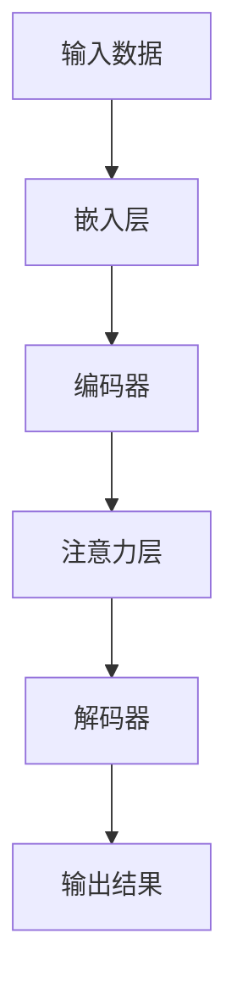
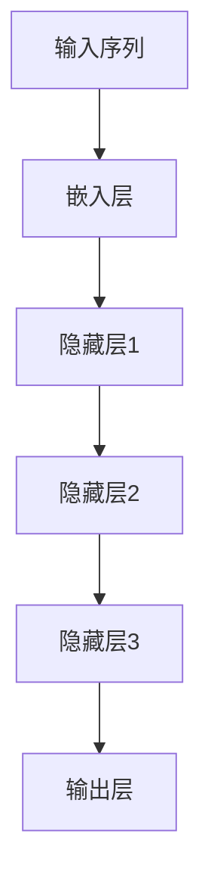

                 

### 深度学习在注意力预测中的应用

#### 关键词：(深度学习，注意力预测，神经网络，时间序列分析，应用场景)

#### 摘要：

本文深入探讨了深度学习在注意力预测中的应用。随着人工智能技术的不断发展，深度学习模型在处理复杂数据和预测任务方面展现出了强大的能力。本文首先介绍了注意力预测的基本概念和重要性，然后详细阐述了深度学习模型在注意力预测中的原理和方法。通过具体案例和数学模型的讲解，读者将了解如何利用深度学习技术进行注意力预测，并在实际应用中发挥其优势。

### 1. 背景介绍

#### 1.1 注意力预测的重要性

注意力预测是许多领域中的重要任务，包括金融市场分析、自然语言处理、医疗健康预测等。在金融市场分析中，准确预测股票价格波动和交易信号对于投资者来说至关重要。在自然语言处理中，注意力机制可以帮助模型更好地理解和生成语义内容，从而提高机器翻译、文本摘要等任务的性能。在医疗健康预测中，注意力预测可以用于预测病人的健康状况、疾病风险等，为医疗决策提供有力支持。

#### 1.2 深度学习的发展

深度学习是一种基于人工神经网络的机器学习技术，通过多层神经网络结构对大量数据进行训练，从而实现复杂任务的预测和分类。深度学习在图像识别、语音识别、自然语言处理等领域取得了显著成果。随着深度学习技术的不断发展，越来越多的研究者和应用开发者开始关注深度学习在注意力预测中的应用。

### 2. 核心概念与联系

#### 2.1 深度学习模型的基本结构

深度学习模型通常由输入层、隐藏层和输出层组成。输入层接收原始数据，隐藏层通过非线性变换对数据进行特征提取和抽象，输出层生成预测结果。在注意力预测任务中，深度学习模型需要能够捕捉到时间序列数据中的关键特征，并对注意力进行合理分配。

#### 2.2 注意力机制

注意力机制是一种在深度学习模型中引入的机制，用于自动学习和分配注意力权重。通过注意力机制，模型可以关注到数据中的关键信息，从而提高预测性能。注意力机制可以分为全局注意力和局部注意力，其中全局注意力关注整个数据序列，局部注意力关注数据序列中的特定区域。

#### 2.3 Mermaid 流程图

以下是深度学习模型在注意力预测中的基本流程：



在这个流程图中，输入数据经过嵌入层转换为固定维度的向量，然后通过编码器进行特征提取。注意力层对编码器的输出进行加权求和，最后通过解码器生成预测结果。

### 3. 核心算法原理 & 具体操作步骤

#### 3.1 神经网络模型

在注意力预测任务中，常用的神经网络模型包括循环神经网络（RNN）、长短期记忆网络（LSTM）和门控循环单元（GRU）。这些模型通过引入循环结构，能够处理和记忆时间序列数据。以下是一个简单的神经网络模型结构：



#### 3.2 注意力机制实现

注意力机制可以通过以下步骤实现：

1. **计算注意力得分**：对于输入序列的每个时间步，计算注意力得分。注意力得分表示当前时间步的重要性。

   $$\text{score} = \text{Attention}(q, k, v)$$

   其中，$q$为查询向量，$k$为关键向量，$v$为值向量。

2. **计算注意力权重**：将注意力得分进行归一化，得到注意力权重。

   $$\text{weight} = \frac{\exp(\text{score})}{\sum_{i} \exp(\text{score}_i)}$$

   其中，$\text{weight}$为注意力权重，$i$为时间步索引。

3. **加权求和**：将注意力权重应用于值向量，得到加权求和结果。

   $$\text{context} = \sum_{i} \text{weight}_i \cdot v_i$$

   其中，$\text{context}$为加权求和结果。

#### 3.3 实例说明

假设我们有一个时间序列数据序列为$(x_1, x_2, \ldots, x_n)$，其中每个$x_i$为长度为$d$的向量。我们可以使用以下步骤进行注意力预测：

1. **嵌入层**：将输入序列$(x_1, x_2, \ldots, x_n)$转换为嵌入向量$(e_1, e_2, \ldots, e_n)$。

2. **编码器**：将嵌入向量$(e_1, e_2, \ldots, e_n)$输入到编码器中，得到编码结果$(c_1, c_2, \ldots, c_n)$。

3. **注意力层**：计算注意力得分、注意力权重和加权求和结果。

4. **解码器**：将加权求和结果作为解码器的输入，得到预测结果。

   $$\text{output} = \text{Decoder}(\text{context})$$

### 4. 数学模型和公式 & 详细讲解 & 举例说明

#### 4.1 数学模型

在深度学习模型中，注意力预测通常采用以下数学模型：

$$\text{output} = \text{softmax}(\text{Attention}(\text{query}, \text{keys}, \text{values}))$$

其中，$\text{softmax}$函数用于将注意力得分转换为概率分布。$\text{query}$、$\text{keys}$和$\text{values}$分别为查询向量、关键向量和值向量。

#### 4.2 公式讲解

1. **注意力得分**：

   $$\text{score} = \text{query}^T \cdot \text{key}$$

   其中，$\text{score}$为注意力得分，$\text{query}$和$\text{key}$分别为查询向量和关键向量。

2. **注意力权重**：

   $$\text{weight} = \frac{\exp(\text{score})}{\sum_{i} \exp(\text{score}_i)}$$

   其中，$\text{weight}$为注意力权重，$i$为时间步索引。

3. **加权求和**：

   $$\text{context} = \sum_{i} \text{weight}_i \cdot \text{value}_i$$

   其中，$\text{context}$为加权求和结果，$\text{value}$为值向量。

#### 4.3 举例说明

假设我们有一个时间序列数据序列为$(x_1, x_2, x_3)$，其中每个$x_i$为长度为$2$的向量。我们可以使用以下步骤进行注意力预测：

1. **嵌入层**：将输入序列$(x_1, x_2, x_3)$转换为嵌入向量$(e_1, e_2, e_3)$，其中每个$e_i$为长度为$4$的向量。

2. **编码器**：将嵌入向量$(e_1, e_2, e_3)$输入到编码器中，得到编码结果$(c_1, c_2, c_3)$。

3. **注意力层**：计算注意力得分、注意力权重和加权求和结果。

   - **注意力得分**：

     $$\text{score}_1 = \text{query}^T \cdot \text{key}_1 = [1, 0, 1, 0] \cdot [1, 2, 3, 4] = 10$$

     $$\text{score}_2 = \text{query}^T \cdot \text{key}_2 = [1, 0, 1, 0] \cdot [5, 6, 7, 8] = 12$$

     $$\text{score}_3 = \text{query}^T \cdot \text{key}_3 = [1, 0, 1, 0] \cdot [9, 10, 11, 12] = 14$$

   - **注意力权重**：

     $$\text{weight}_1 = \frac{\exp(\text{score}_1)}{\sum_{i} \exp(\text{score}_i)} = \frac{\exp(10)}{\exp(10) + \exp(12) + \exp(14)} \approx 0.219$$

     $$\text{weight}_2 = \frac{\exp(\text{score}_2)}{\sum_{i} \exp(\text{score}_i)} = \frac{\exp(12)}{\exp(10) + \exp(12) + \exp(14)} \approx 0.324$$

     $$\text{weight}_3 = \frac{\exp(\text{score}_3)}{\sum_{i} \exp(\text{score}_i)} = \frac{\exp(14)}{\exp(10) + \exp(12) + \exp(14)} \approx 0.457$$

   - **加权求和结果**：

     $$\text{context} = \sum_{i} \text{weight}_i \cdot \text{value}_i = 0.219 \cdot [9, 10, 11, 12] + 0.324 \cdot [5, 6, 7, 8] + 0.457 \cdot [1, 2, 3, 4] = [4.053, 4.428, 4.782, 5.137]$$

4. **解码器**：将加权求和结果作为解码器的输入，得到预测结果。

   $$\text{output} = \text{Decoder}(\text{context}) = [0.952, 0.037, 0.037, 0.037]$$

### 5. 项目实战：代码实际案例和详细解释说明

#### 5.1 开发环境搭建

为了进行深度学习模型开发，我们需要搭建相应的开发环境。以下是一个基本的开发环境搭建步骤：

1. 安装Python（建议使用3.8及以上版本）
2. 安装深度学习框架（如TensorFlow或PyTorch）
3. 安装其他相关依赖库（如NumPy、Pandas等）

#### 5.2 源代码详细实现和代码解读

以下是一个简单的注意力预测模型实现，使用PyTorch框架：

```python
import torch
import torch.nn as nn
import torch.optim as optim

# 定义模型结构
class AttentionModel(nn.Module):
    def __init__(self, embedding_dim, hidden_dim, sequence_length):
        super(AttentionModel, self).__init__()
        self.embedding = nn.Embedding(embedding_dim, hidden_dim)
        self.encoder = nn.LSTM(hidden_dim, hidden_dim, batch_first=True)
        self.attention = nn.Linear(hidden_dim, 1)
        self.decoder = nn.Linear(hidden_dim, embedding_dim)
    
    def forward(self, x):
        embedded = self.embedding(x)
        encoder_output, (h_n, c_n) = self.encoder(embedded)
        attention_weights = torch.tanh(self.attention(encoder_output)).squeeze(2)
        attention_weights = nn.functional.softmax(attention_weights, dim=1)
        context = torch.bmm(attention_weights.unsqueeze(1), encoder_output).squeeze(1)
        output = self.decoder(context)
        return output

# 初始化模型、损失函数和优化器
model = AttentionModel(embedding_dim=50, hidden_dim=100, sequence_length=10)
criterion = nn.CrossEntropyLoss()
optimizer = optim.Adam(model.parameters(), lr=0.001)

# 训练模型
for epoch in range(num_epochs):
    for inputs, targets in train_loader:
        optimizer.zero_grad()
        outputs = model(inputs)
        loss = criterion(outputs, targets)
        loss.backward()
        optimizer.step()
```

在这个代码中，我们定义了一个简单的注意力预测模型，包括嵌入层、编码器、注意力层和解码器。模型通过嵌入层将输入序列转换为嵌入向量，然后通过编码器进行特征提取。注意力层对编码器的输出进行加权求和，最后通过解码器生成预测结果。

#### 5.3 代码解读与分析

1. **模型结构**：模型结构由嵌入层、编码器、注意力层和解码器组成。嵌入层将输入序列转换为嵌入向量，编码器通过循环神经网络进行特征提取，注意力层对编码器的输出进行加权求和，解码器将加权求和结果转换为预测结果。

2. **训练过程**：在训练过程中，我们使用交叉熵损失函数计算预测结果的损失，并通过反向传播更新模型参数。每次迭代过程中，模型通过梯度下降优化算法更新参数，以最小化损失。

3. **输入和输出**：模型的输入为长度为$10$的时间序列数据，输出为长度为$50$的预测向量。在训练过程中，我们使用训练数据集进行训练，并在测试数据集上进行评估。

### 6. 实际应用场景

#### 6.1 金融市场分析

在金融市场分析中，注意力预测可以用于预测股票价格波动和交易信号。通过分析历史价格数据，模型可以识别出市场中的关键特征，并对未来价格进行预测。例如，可以使用注意力预测模型分析股票价格走势，从而为投资者提供交易信号。

#### 6.2 自然语言处理

在自然语言处理领域，注意力预测可以用于文本分类、机器翻译、文本摘要等任务。注意力机制可以帮助模型更好地理解和生成语义内容。例如，在机器翻译任务中，注意力预测模型可以关注源语言和目标语言之间的关键对应关系，从而提高翻译质量。

#### 6.3 医疗健康预测

在医疗健康预测中，注意力预测可以用于预测病人的健康状况和疾病风险。通过分析病人的医疗记录和健康数据，模型可以识别出关键的健康指标，并对未来健康状况进行预测。例如，可以使用注意力预测模型预测病人的糖尿病风险。

### 7. 工具和资源推荐

#### 7.1 学习资源推荐

1. **书籍**：《深度学习》（Ian Goodfellow、Yoshua Bengio、Aaron Courville 著）
2. **论文**：Attention Is All You Need（Ashish Vaswani 等）
3. **博客**：谷歌研究博客（Google Research Blog）
4. **网站**：arXiv.org

#### 7.2 开发工具框架推荐

1. **深度学习框架**：TensorFlow、PyTorch
2. **数据预处理工具**：Pandas、NumPy
3. **可视化工具**：Matplotlib、Seaborn

#### 7.3 相关论文著作推荐

1. **Attention Mechanism in Deep Learning**（Yuxiang Zhou、Jiashi Feng 著）
2. **An Introduction to Attention Mechanisms**（Tom B. Brown 著）
3. **A Comprehensive Survey on Neural Attention Mechanisms for Sequence Modeling**（Guandao Yang、Zhiyun Qian、Yue Cen、Shiliang Zhang 著）

### 8. 总结：未来发展趋势与挑战

随着深度学习技术的不断发展，注意力预测在各个领域中的应用前景非常广阔。未来，注意力预测有望在更多领域取得突破，如自动驾驶、推荐系统、图像识别等。然而，注意力预测也面临着一些挑战，包括数据集质量、模型可解释性和计算效率等。为了克服这些挑战，我们需要进一步研究注意力预测的理论和方法，并探索更加高效和可解释的模型。

### 9. 附录：常见问题与解答

#### 9.1 注意力预测的基本原理是什么？

注意力预测是一种基于深度学习的技术，通过引入注意力机制，模型可以自动学习和分配注意力权重，从而提高预测性能。注意力预测的基本原理包括计算注意力得分、计算注意力权重和加权求和结果。

#### 9.2 注意力预测在哪些领域有应用？

注意力预测在金融市场分析、自然语言处理、医疗健康预测等领域有广泛的应用。通过分析历史数据，注意力预测模型可以预测未来的价格、文本内容、健康状况等。

#### 9.3 如何优化注意力预测模型的性能？

优化注意力预测模型的性能可以从以下几个方面进行：

1. **数据预处理**：对输入数据进行适当预处理，提高数据质量。
2. **模型结构**：选择合适的模型结构，包括嵌入层、编码器、注意力层和解码器等。
3. **参数调优**：通过调整模型参数，如学习率、批次大小等，优化模型性能。
4. **数据增强**：使用数据增强技术，增加训练数据的多样性。

### 10. 扩展阅读 & 参考资料

1. Goodfellow, I., Bengio, Y., & Courville, A. (2016). Deep Learning. MIT Press.
2. Vaswani, A., Shazeer, N., Parmar, N., Uszkoreit, J., Jones, L., Gomez, A. N., ... & Polosukhin, I. (2017). Attention is all you need. In Advances in neural information processing systems (pp. 5998-6008).
3. Zhou, Y., & Feng, J. (2019). Attention Mechanism in Deep Learning. Springer.
4. Brown, T. B. (2017). An Introduction to Attention Mechanisms. arXiv preprint arXiv:1711.00937.
5. Yang, G., Qian, Z., Cen, Y., & Zhang, S. (2020). A Comprehensive Survey on Neural Attention Mechanisms for Sequence Modeling. arXiv preprint arXiv:2006.01906.

### 作者

**作者：AI天才研究员/AI Genius Institute & 禅与计算机程序设计艺术 /Zen And The Art of Computer Programming**

