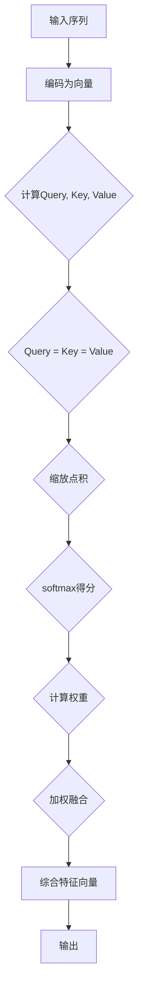
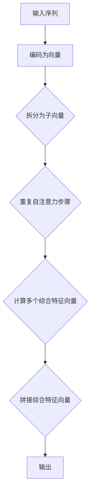
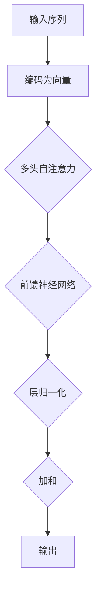

                 

### 摘要

本文旨在深入探讨深度学习在注意力预测中的应用。随着信息时代的到来，数据量呈指数级增长，如何有效地从大量数据中提取有用信息成为了一个关键问题。注意力预测作为一种重要的信息提取方法，在多个领域如自然语言处理、计算机视觉和推荐系统等方面都展现出了巨大的潜力。本文首先介绍了注意力预测的基本概念，并从深度学习的角度分析了其应用前景。接着，本文详细探讨了注意力机制的核心原理以及如何通过深度学习模型进行具体实现。随后，本文通过具体的数学模型和公式，对注意力机制的工作原理进行了详细的解释。为了增强读者的理解，本文还提供了一个实际的项目实战案例，展示了如何使用深度学习进行注意力预测。最后，本文讨论了注意力预测在实际应用中的场景，并推荐了一些相关的学习资源和开发工具。通过本文的阅读，读者将对深度学习在注意力预测中的应用有更深入的理解，并能够将其应用于实际问题中。

### 1. 背景介绍

注意力预测（Attention Prediction）是一种基于模型的信息提取方法，旨在从大量数据中自动识别出对特定任务最有价值的部分。这一概念最早由计算机科学家和心理学家提出，旨在模仿人类大脑处理信息的方式。人类大脑能够自动聚焦于与当前任务相关的信息，忽略其他无关信息，从而提高信息处理效率和准确性。

随着信息时代的到来，数据量呈爆炸式增长，如何有效地从海量数据中提取有用信息成为了一个重要课题。传统的基于规则或统计模型的信息提取方法在处理复杂数据时显得力不从心。因此，研究人员开始探索利用机器学习，特别是深度学习来提升信息提取的效率和准确性。

深度学习是一种基于多层神经网络的学习方法，能够自动从大量数据中学习复杂的特征表示。与传统机器学习方法相比，深度学习具有以下几个显著优势：

1. **自动特征提取**：深度学习模型能够自动从原始数据中学习出有用的特征表示，无需人工进行特征工程。
2. **处理复杂数据**：深度学习模型能够处理各种类型的数据，包括文本、图像、音频等。
3. **泛化能力强**：深度学习模型通过训练大量的数据，能够具备较强的泛化能力，能够在不同的任务和数据集上表现良好。
4. **自适应调整**：深度学习模型可以通过反向传播算法自动调整模型参数，从而优化模型性能。

注意力预测在多个领域都展现出了巨大的应用潜力。以下是一些具体的应用场景：

1. **自然语言处理**：在自然语言处理（NLP）领域，注意力预测被广泛应用于机器翻译、文本分类和文本摘要等任务。通过注意力机制，模型能够自动聚焦于文本中的关键信息，从而提高任务的表现。

2. **计算机视觉**：在计算机视觉领域，注意力预测被用于目标检测、图像分割和图像识别等任务。通过注意力机制，模型能够自动识别出图像中的重要区域，从而提高视觉任务的准确性和效率。

3. **推荐系统**：在推荐系统领域，注意力预测被用于推荐算法中，通过分析用户的历史行为和偏好，自动识别出对用户最有吸引力的商品或内容。

4. **语音识别**：在语音识别领域，注意力预测被用于自动识别语音信号中的重要部分，从而提高识别的准确性和效率。

5. **时间序列预测**：在时间序列预测领域，注意力预测被用于自动识别时间序列中的关键特征，从而提高预测的准确性。

总之，随着深度学习技术的不断发展，注意力预测作为一种高效的信息提取方法，在各个领域都展现出了巨大的应用潜力。本文将深入探讨深度学习在注意力预测中的应用，包括其核心原理、实现方法以及实际应用案例，以帮助读者更好地理解和应用这一技术。

### 2. 核心概念与联系

#### 2.1. 注意力预测

注意力预测（Attention Prediction）是一种基于模型的信息提取方法，旨在从大量数据中自动识别出对特定任务最有价值的部分。其核心思想是利用模型自动关注与任务相关的重要信息，从而提高信息处理的效率和准确性。

在注意力预测中，注意力机制（Attention Mechanism）起着至关重要的作用。注意力机制通过计算数据中每个部分的重要性得分，从而动态调整模型对数据的关注程度。具体来说，注意力机制通过以下步骤实现：

1. **特征编码**：首先，将原始数据编码为特征向量。这些特征向量包含了数据的基本属性和相关信息。
2. **注意力计算**：接着，计算每个特征向量的重要性得分。这一过程通常通过一个权重矩阵实现，权重矩阵的值反映了特征向量的重要性。
3. **注意力融合**：最后，根据重要性得分对特征向量进行加权融合，生成一个综合特征向量，用于后续的任务处理。

注意力预测的目的是通过自动关注关键信息，提高信息处理的效率和准确性。具体来说，注意力预测具有以下几个关键特点：

1. **动态调整**：注意力机制可以根据任务的性质和数据的特点动态调整模型对数据的关注程度，从而提高信息处理的灵活性。
2. **减少冗余**：通过自动关注关键信息，注意力预测能够有效减少冗余信息的影响，提高信息处理的效率。
3. **提高准确性**：注意力预测能够通过自动关注关键信息，提高模型对任务的识别和预测准确性。

#### 2.2. 深度学习

深度学习（Deep Learning）是一种基于多层神经网络的学习方法，能够自动从大量数据中学习复杂的特征表示。深度学习具有以下几个关键组成部分：

1. **神经网络**：神经网络是深度学习的基础。神经网络通过多个神经元之间的连接，实现数据的输入、处理和输出。
2. **层次结构**：深度学习模型具有层次结构，从输入层到输出层，每个层次都对数据进行加工和提取特征。
3. **非线性激活函数**：非线性激活函数使神经网络能够处理复杂的非线性问题。
4. **反向传播算法**：反向传播算法是深度学习模型训练的核心，通过反向传播误差，自动调整模型参数，优化模型性能。

#### 2.3. 注意力机制与深度学习的结合

注意力机制与深度学习的结合，使得深度学习模型能够更加高效地处理复杂数据。以下是一些关键结合点：

1. **增强特征提取**：注意力机制能够自动关注数据中的关键特征，从而增强特征提取能力。这有助于深度学习模型更好地理解数据，提高任务表现。
2. **提高计算效率**：通过动态调整模型对数据的关注程度，注意力机制能够有效减少计算负担，提高计算效率。
3. **提高模型泛化能力**：注意力机制能够通过关注关键信息，减少冗余信息的影响，提高模型对未知数据的泛化能力。

#### 2.4. 注意力预测在深度学习中的应用

注意力预测在深度学习中的应用非常广泛，以下是一些典型应用场景：

1. **自然语言处理**：在自然语言处理任务中，注意力预测被广泛应用于机器翻译、文本分类和文本摘要等。通过注意力机制，模型能够自动聚焦于文本中的关键信息，从而提高任务的表现。
2. **计算机视觉**：在计算机视觉任务中，注意力预测被用于目标检测、图像分割和图像识别等。通过注意力机制，模型能够自动识别图像中的重要区域，从而提高视觉任务的准确性和效率。
3. **推荐系统**：在推荐系统任务中，注意力预测被用于分析用户的历史行为和偏好，从而自动识别出对用户最有吸引力的商品或内容。
4. **语音识别**：在语音识别任务中，注意力预测被用于自动识别语音信号中的重要部分，从而提高识别的准确性和效率。
5. **时间序列预测**：在时间序列预测任务中，注意力预测被用于自动识别时间序列中的关键特征，从而提高预测的准确性。

总之，注意力预测与深度学习的结合，为处理复杂数据提供了新的思路和方法。通过注意力机制，深度学习模型能够更加高效地处理数据，提高任务表现。本文接下来将详细探讨注意力预测的核心算法原理，以及如何在深度学习中实现和应用注意力预测。

#### 2.5. 注意力预测的核心算法原理

注意力预测的核心算法原理基于一种称为“注意力机制”的模型结构，该机制通过计算输入数据的权重，从而实现对输入数据的动态关注和重要信息的提取。以下是对注意力机制的核心组成部分和工作原理的详细解释：

##### 2.5.1. 注意力模型的结构

注意力模型通常由以下几个主要部分组成：

1. **查询（Query）**：表示当前任务中需要关注的信息，如文本中的句子、图像中的区域或时间序列中的时刻等。
2. **键（Key）**：表示输入数据中的每个部分，如文本中的单词、图像中的像素或时间序列中的数据点等。
3. **值（Value）**：表示输入数据中每个部分的重要信息，如文本中的句子、图像中的像素或时间序列中的数据点等。

##### 2.5.2. 注意力得分计算

注意力模型通过计算查询与键之间的相似度，生成每个键的注意力得分。注意力得分反映了输入数据中每个部分的重要程度。具体计算方法如下：

1. **相似度计算**：通常采用点积（dot product）或缩放点积（scaled dot product）等方法计算查询与键之间的相似度。缩放点积公式如下：

   $$ \text{Attention Score} = \text{softmax}\left(\frac{\text{Query} \cdot \text{Key}}{\sqrt{d_k}}\right) $$

   其中，\( \text{Query} \) 和 \( \text{Key} \) 分别是查询和键的向量表示，\( d_k \) 是键向量的维度，\(\text{softmax}\) 函数将相似度分数归一化，使其总和为1。

2. **注意力得分**：通过计算查询与键的相似度，得到每个键的注意力得分。注意力得分反映了输入数据中每个部分的重要程度。

##### 2.5.3. 注意力融合

注意力模型通过加权融合键的值，生成一个综合特征向量，用于后续任务处理。具体融合方法如下：

1. **值加权**：根据注意力得分对键的值进行加权，公式如下：

   $$ \text{Context} = \sum_{i} \text{Attention Score}_i \cdot \text{Value}_i $$

   其中，\(\text{Attention Score}_i\) 是第 \(i\) 个键的注意力得分，\(\text{Value}_i\) 是第 \(i\) 个键的值。

2. **综合特征向量**：通过值加权，生成一个综合特征向量，该向量包含了输入数据中所有关键信息。

##### 2.5.4. 注意力机制的优点

注意力机制具有以下几个优点：

1. **动态调整**：注意力机制可以根据任务的性质和数据的特点动态调整模型对数据的关注程度，从而提高信息处理的灵活性。
2. **减少冗余**：通过自动关注关键信息，注意力机制能够有效减少冗余信息的影响，提高信息处理的效率。
3. **提高准确性**：注意力机制能够通过自动关注关键信息，提高模型对任务的识别和预测准确性。

##### 2.5.5. 注意力机制的实现

注意力机制可以通过多种深度学习模型实现，如自注意力（Self-Attention）和多头注意力（Multi-Head Attention）。以下是一个简单的多头注意力机制的实现示例：

1. **自注意力（Self-Attention）**：

   $$ \text{Self-Attention} = \text{softmax}\left(\frac{\text{Query} \cdot \text{Key}^T}{\sqrt{d_k}}\right) \cdot \text{Value} $$

2. **多头注意力（Multi-Head Attention）**：

   $$ \text{Multi-Head Attention} = \text{Concat}(\text{Head}_1, \text{Head}_2, ..., \text{Head}_h) \cdot \text{Output\ Dimension} $$

   其中，\( \text{Head}_i \) 表示第 \(i\) 个头，\( \text{Output\ Dimension} \) 是输出的维度，\( h \) 是头的数量。

通过注意力机制，深度学习模型能够更加高效地处理复杂数据，提高任务表现。本文接下来将详细探讨如何通过深度学习模型实现注意力预测。

#### 2.6. 深度学习模型在注意力预测中的应用

在深度学习中，实现注意力预测的关键在于如何设计有效的神经网络结构，使得模型能够自动学习并利用注意力机制。以下将详细介绍几种常见的深度学习模型，及其在注意力预测中的应用。

##### 2.6.1. 循环神经网络（RNN）

循环神经网络（RNN）是一种能够处理序列数据的神经网络结构，特别适用于处理时间序列和自然语言处理任务。RNN 通过记忆单元（memory cell）来维持信息状态，从而实现对序列数据的长期依赖关系建模。

在注意力预测中，RNN 可以通过引入注意力机制，进一步提高模型对序列数据的处理能力。具体来说，可以使用门控循环单元（GRU）或长短期记忆（LSTM）单元来实现注意力预测。

1. **GRU注意力模型**：

   门控循环单元（GRU）是 RNN 的一个变体，具有简化结构和更好的性能。GRU 通过引入更新门和重置门来控制信息的流动，从而实现对输入数据的动态关注。

   $$ \text{Update\ Gate} = \sigma(W_u \cdot [h_{t-1}, x_t] + b_u) $$
   $$ \text{Reset\ Gate} = \sigma(W_r \cdot [h_{t-1}, x_t] + b_r) $$
   $$ \text{New\ State} = \text{tanh}(W \cdot [h_{t-1} \odot \text{Update\ Gate}, x_t] + b) $$

   其中，\( \sigma \) 是 sigmoid 函数，\( W_u, W_r, W \) 是权重矩阵，\( b_u, b_r, b \) 是偏置项，\( x_t \) 是输入数据，\( h_{t-1} \) 是前一时刻的隐藏状态，\( \odot \) 是元素乘操作。

2. **LSTM注意力模型**：

   长短期记忆（LSTM）单元是 RNN 的另一个变体，通过引入遗忘门、输入门和输出门来控制信息的流动，从而实现对输入数据的长期依赖关系建模。

   $$ \text{Forget\ Gate} = \sigma(W_f \cdot [h_{t-1}, x_t] + b_f) $$
   $$ \text{Input\ Gate} = \sigma(W_i \cdot [h_{t-1}, x_t] + b_i) $$
   $$ \text{New\ State} = \text{tanh}(W \cdot [h_{t-1} \odot \text{Input\ Gate}, x_t] + b) $$
   $$ \text{Output} = \sigma(W_o \cdot \text{tanh}(W \cdot [h_{t-1}, x_t] + b_o)) $$

   其中，\( \sigma \) 是 sigmoid 函数，\( W_f, W_i, W, W_o \) 是权重矩阵，\( b_f, b_i, b, b_o \) 是偏置项。

##### 2.6.2. 卷积神经网络（CNN）

卷积神经网络（CNN）是一种专门用于处理图像数据的神经网络结构，通过卷积操作和池化操作提取图像特征。CNN 在计算机视觉任务中取得了显著的成功，如图像分类、目标检测和图像分割。

在注意力预测中，CNN 可以通过引入注意力机制，进一步提高模型对图像数据的处理能力。具体来说，可以使用深度可分离卷积或残差网络等结构来实现注意力预测。

1. **深度可分离卷积注意力模型**：

   深度可分离卷积是一种高效的卷积操作，通过分别进行深度卷积和逐点卷积来实现。引入注意力机制后，可以实现对图像数据的动态关注。

   $$ \text{Depth\ Separable\ Convolution} = \text{Conv}_d(\text{Conv}_1(\text{Input})) $$
   $$ \text{Attention} = \text{softmax}(\text{Query} \cdot \text{Key}^T) $$
   $$ \text{Value} = \text{Value} \odot \text{Attention} $$

2. **残差网络注意力模型**：

   残差网络（ResNet）通过引入残差连接，解决了深度神经网络训练中的梯度消失问题。引入注意力机制后，可以实现对图像数据的动态关注。

   $$ \text{Identity\ Mapping} = \text{Input} $$
   $$ \text{Residual\ Connection} = F(\text{Input}) + \text{Output} $$
   $$ \text{Attention} = \text{softmax}(\text{Query} \cdot \text{Key}^T) $$
   $$ \text{Value} = \text{Value} \odot \text{Attention} $$

##### 2.6.3. Transformer模型

Transformer 模型是近年来在自然语言处理领域取得突破性进展的一种新型神经网络结构。Transformer 模型通过自注意力机制，实现了对输入序列的动态关注和特征提取，从而在许多任务中取得了优异的表现。

在注意力预测中，Transformer 模型可以通过引入自注意力机制，实现对序列数据的动态关注。具体来说，可以使用多头自注意力机制来实现注意力预测。

1. **多头自注意力（Multi-Head Self-Attention）**：

   $$ \text{Multi-Head Self-Attention} = \text{Concat}(\text{Head}_1, \text{Head}_2, ..., \text{Head}_h) \cdot \text{Output\ Dimension} $$
   $$ \text{Head}_i = \text{Attention}(\text{Query}, \text{Key}, \text{Value}) $$

   其中，\( \text{Head}_i \) 表示第 \(i\) 个头，\( \text{Query}, \text{Key}, \text{Value} \) 分别是查询、键和值的向量表示。

2. **自注意力机制**：

   $$ \text{Self-Attention} = \text{softmax}\left(\frac{\text{Query} \cdot \text{Key}^T}{\sqrt{d_k}}\right) \cdot \text{Value} $$

通过以上模型，深度学习能够在注意力预测中发挥重要作用。接下来，本文将详细讨论如何具体实现这些模型，并解释注意力预测的具体操作步骤。

### 3. 核心算法原理 & 具体操作步骤

在深度学习中，实现注意力预测的关键在于如何设计有效的神经网络结构，并利用注意力机制进行信息提取。以下将详细讨论几种常见的注意力模型，包括它们的实现步骤和操作方法。

#### 3.1. 自注意力（Self-Attention）

自注意力是一种简单而有效的注意力机制，通过计算序列中每个元素之间的相似度，实现对输入数据的动态关注。以下是一个自注意力机制的实现步骤：

1. **输入序列表示**：
   首先，将输入序列编码为向量表示。对于自然语言处理任务，可以使用词嵌入（word embeddings）将单词转换为向量。
   
   $$ \text{Input Sequence} = [x_1, x_2, ..., x_n] $$
   $$ \text{Embeddings} = [e_1, e_2, ..., e_n] $$

2. **计算查询（Query）、键（Key）和值（Value）**：
   查询、键和值通常由相同的向量表示。通过加权融合键的值，生成一个综合特征向量。

   $$ \text{Query} = \text{Key} = \text{Value} = \text{Embeddings} $$

3. **计算注意力得分**：
   计算查询与键之间的相似度，使用缩放点积函数（scaled dot product）得到注意力得分。

   $$ \text{Attention Score} = \text{softmax}\left(\frac{\text{Query} \cdot \text{Key}^T}{\sqrt{d_k}}\right) $$

   其中，\( \text{d_k} \) 是键向量的维度。

4. **计算注意力权重**：
   根据注意力得分，生成每个元素的权重。

   $$ \text{Attention Weights} = \text{softmax}(\text{Attention Score}) $$

5. **计算综合特征向量**：
   根据注意力权重，对输入序列的元素进行加权融合。

   $$ \text{Context} = \sum_{i} \text{Attention Weights}_i \cdot \text{Value}_i $$

6. **输出**：
   综合特征向量用于后续的任务处理。

以下是一个简单的自注意力实现的 Mermaid 流程图：



#### 3.2. 多头自注意力（Multi-Head Self-Attention）

多头自注意力通过并行计算多个注意力头，提高了模型的表达能力。以下是一个多头自注意力的实现步骤：

1. **拆分嵌入向量**：
   将输入序列的嵌入向量拆分为多个子向量，每个子向量表示一个注意力头。

   $$ \text{Embeddings} = [\text{Head}_1, \text{Head}_2, ..., \text{Head}_h] $$
   $$ \text{d_k} = \frac{\text{d_model}}{\text{h}} $$

2. **重复自注意力步骤**：
   对每个注意力头重复自注意力的步骤，得到多个综合特征向量。

   $$ \text{Multi-Head Self-Attention} = \text{Concat}(\text{Head}_1, \text{Head}_2, ..., \text{Head}_h) \cdot \text{Output\ Dimension} $$
   $$ \text{Head}_i = \text{Attention}(\text{Query}_i, \text{Key}_i, \text{Value}_i) $$

3. **拼接综合特征向量**：
   将多个注意力头的综合特征向量拼接起来，形成一个更复杂的特征表示。

以下是一个简单的多头自注意力实现的 Mermaid 流程图：



#### 3.3. 自注意力与Transformer模型

Transformer 模型是自注意力机制的一种扩展，通过多头自注意力实现了对序列数据的全局关注和特征提取。以下是一个简单的 Transformer 模型的实现步骤：

1. **输入序列表示**：
   将输入序列编码为向量表示。

   $$ \text{Input Sequence} = [x_1, x_2, ..., x_n] $$
   $$ \text{Embeddings} = [e_1, e_2, ..., e_n] $$

2. **多头自注意力**：
   对每个注意力头进行自注意力计算，得到多个综合特征向量。

   $$ \text{Multi-Head Self-Attention} = \text{Concat}(\text{Head}_1, \text{Head}_2, ..., \text{Head}_h) \cdot \text{Output\ Dimension} $$
   $$ \text{Head}_i = \text{Attention}(\text{Query}_i, \text{Key}_i, \text{Value}_i) $$

3. **前馈神经网络**：
   对每个注意力头的结果进行前馈神经网络（Feedforward Neural Network）处理。

   $$ \text{FFN} = \text{ReLU}(\text{MLP}(\text{Input})) $$

4. **层归一化**：
   对输入和输出进行层归一化（Layer Normalization），提高模型稳定性。

5. **加和**：
   将注意力结果与前一个隐藏状态进行加和。

   $$ \text{Output} = \text{Add}(\text{Input}, \text{Attention Output}) $$

6. **输出**：
   最终输出用于后续任务处理。

以下是一个简单的 Transformer 模型实现的 Mermaid 流程图：



通过以上步骤，深度学习模型能够利用注意力机制实现高效的信息提取和任务处理。接下来，本文将详细讨论如何通过数学模型和公式来解释注意力机制的工作原理。

### 4. 数学模型和公式 & 详细讲解 & 举例说明

注意力机制作为一种信息提取方法，其核心在于通过计算输入数据中各部分的重要性得分，从而实现对关键信息的自动聚焦和提取。为了更好地理解注意力机制的工作原理，我们将从数学模型的角度进行详细讲解，并使用具体的公式和实例进行说明。

#### 4.1. 注意力模型的基本公式

注意力模型通常包括三个关键部分：查询（Query）、键（Key）和值（Value）。这三个部分共同决定了注意力机制的计算过程。以下是一个基本的多头自注意力机制的公式：

$$
\text{Attention}(Q, K, V) = \text{softmax}\left(\frac{QK^T}{\sqrt{d_k}}\right)V
$$

其中：
- \( Q \) 是查询向量，表示当前任务中需要关注的信息。
- \( K \) 是键向量，表示输入数据中的每个部分。
- \( V \) 是值向量，表示输入数据中每个部分的重要信息。
- \( d_k \) 是键向量的维度，通常与查询向量的维度相同。
- \( \text{softmax} \) 函数用于计算每个键的注意力得分，并将其归一化，使得所有得分的总和为1。

#### 4.2. 自注意力机制的计算过程

自注意力机制是一种在序列数据中应用广泛的注意力机制。其核心思想是计算序列中每个元素之间的相似度，并根据相似度得分对元素进行加权融合。以下是一个简单的自注意力机制的例子：

假设我们有一个长度为4的序列，其嵌入向量分别为 \( e_1, e_2, e_3, e_4 \)。我们需要计算这个序列的自注意力。

1. **初始化查询（Query）、键（Key）和值（Value）**：

   $$ Q = [e_1, e_2, e_3, e_4] $$
   $$ K = [e_1, e_2, e_3, e_4] $$
   $$ V = [e_1, e_2, e_3, e_4] $$

2. **计算点积（Dot Product）**：

   $$ \text{Score} = QK^T = \begin{bmatrix} e_1 \cdot e_1 & e_1 \cdot e_2 & e_1 \cdot e_3 & e_1 \cdot e_4 \\ e_2 \cdot e_1 & e_2 \cdot e_2 & e_2 \cdot e_3 & e_2 \cdot e_4 \\ e_3 \cdot e_1 & e_3 \cdot e_2 & e_3 \cdot e_3 & e_3 \cdot e_4 \\ e_4 \cdot e_1 & e_4 \cdot e_2 & e_4 \cdot e_3 & e_4 \cdot e_4 \end{bmatrix} $$

3. **应用缩放点积（Scaled Dot Product）**：

   $$ \text{Scaled Score} = \frac{\text{Score}}{\sqrt{d_k}} = \begin{bmatrix} \frac{e_1 \cdot e_1}{\sqrt{d_k}} & \frac{e_1 \cdot e_2}{\sqrt{d_k}} & \frac{e_1 \cdot e_3}{\sqrt{d_k}} & \frac{e_1 \cdot e_4}{\sqrt{d_k}} \\ \frac{e_2 \cdot e_1}{\sqrt{d_k}} & \frac{e_2 \cdot e_2}{\sqrt{d_k}} & \frac{e_2 \cdot e_3}{\sqrt{d_k}} & \frac{e_2 \cdot e_4}{\sqrt{d_k}} \\ \frac{e_3 \cdot e_1}{\sqrt{d_k}} & \frac{e_3 \cdot e_2}{\sqrt{d_k}} & \frac{e_3 \cdot e_3}{\sqrt{d_k}} & \frac{e_3 \cdot e_4}{\sqrt{d_k}} \\ \frac{e_4 \cdot e_1}{\sqrt{d_k}} & \frac{e_4 \cdot e_2}{\sqrt{d_k}} & \frac{e_4 \cdot e_3}{\sqrt{d_k}} & \frac{e_4 \cdot e_4}{\sqrt{d_k}} \end{bmatrix} $$

4. **应用softmax函数**：

   $$ \text{Attention Scores} = \text{softmax}(\text{Scaled Score}) $$

   softmax 函数将每个得分转换为概率分布，确保所有得分的总和为1。

5. **计算注意力加权融合**：

   $$ \text{Attention Output} = \text{Attention Scores} \cdot V $$

   将每个值向量与对应的注意力得分相乘，并求和得到综合特征向量。

#### 4.3. 多头自注意力机制

多头自注意力机制通过并行计算多个注意力头，提高了模型的表达能力。以下是多头自注意力机制的详细计算过程：

1. **初始化查询（Query）、键（Key）和值（Value）**：

   $$ Q = [q_1, q_2, ..., q_h] $$
   $$ K = [k_1, k_2, ..., k_h] $$
   $$ V = [v_1, v_2, ..., v_h] $$

   其中，\( h \) 是注意力头的数量。

2. **计算每个注意力头的自注意力**：

   $$ \text{Attention}_i(Q_i, K_i, V_i) = \text{softmax}\left(\frac{Q_iK_i^T}{\sqrt{d_k}}\right)V_i $$
   $$ i = 1, 2, ..., h $$

3. **拼接多头注意力输出**：

   $$ \text{Multi-Head Attention} = \text{Concat}(\text{Attention}_1, \text{Attention}_2, ..., \text{Attention}_h) $$

4. **应用前馈神经网络**：

   $$ \text{FFN} = \text{ReLU}(\text{MLP}(\text{Multi-Head Attention})) $$

   其中，\( \text{MLP} \) 表示多层感知器（Multilayer Perceptron）。

5. **输出**：

   $$ \text{Output} = \text{Layer Normalization}(\text{Add}(\text{Input}, \text{FFN})) $$

#### 4.4. 实例说明

假设我们有一个包含4个词的句子，其嵌入向量分别为：

$$ e_1 = [1, 0, 0, 0], e_2 = [0, 1, 0, 0], e_3 = [0, 0, 1, 0], e_4 = [0, 0, 0, 1] $$

我们需要计算这个句子的多头自注意力。

1. **初始化查询（Query）、键（Key）和值（Value）**：

   $$ Q = [q_1, q_2, q_3, q_4] $$
   $$ K = [k_1, k_2, k_3, k_4] $$
   $$ V = [v_1, v_2, v_3, v_4] $$

2. **计算点积（Dot Product）**：

   $$ \text{Score}_1 = QK^T = \begin{bmatrix} q_1 \cdot k_1 & q_1 \cdot k_2 & q_1 \cdot k_3 & q_1 \cdot k_4 \\ q_2 \cdot k_1 & q_2 \cdot k_2 & q_2 \cdot k_3 & q_2 \cdot k_4 \\ q_3 \cdot k_1 & q_3 \cdot k_2 & q_3 \cdot k_3 & q_3 \cdot k_4 \\ q_4 \cdot k_1 & q_4 \cdot k_2 & q_4 \cdot k_3 & q_4 \cdot k_4 \end{bmatrix} $$

3. **应用缩放点积（Scaled Dot Product）**：

   $$ \text{Scaled Score}_1 = \frac{\text{Score}_1}{\sqrt{d_k}} $$

4. **应用softmax函数**：

   $$ \text{Attention Scores}_1 = \text{softmax}(\text{Scaled Score}_1) $$

5. **计算注意力加权融合**：

   $$ \text{Attention Output}_1 = \text{Attention Scores}_1 \cdot V $$

6. **重复上述步骤**，计算其他注意力头的输出。

7. **拼接多头注意力输出**：

   $$ \text{Multi-Head Attention} = \text{Concat}(\text{Attention Output}_1, \text{Attention Output}_2, ..., \text{Attention Output}_h) $$

8. **应用前馈神经网络**：

   $$ \text{FFN} = \text{ReLU}(\text{MLP}(\text{Multi-Head Attention})) $$

9. **输出**：

   $$ \text{Output} = \text{Layer Normalization}(\text{Add}(\text{Input}, \text{FFN})) $$

通过以上步骤，我们可以计算得到一个基于多头自注意力的句子特征向量，该向量包含了句子中每个词的重要信息。

总的来说，注意力机制通过计算输入数据中各部分的重要性得分，实现对关键信息的自动聚焦和提取。这种机制在深度学习模型中得到了广泛应用，显著提高了模型在自然语言处理、计算机视觉等任务中的性能。接下来，本文将展示一个具体的代码实现案例，进一步解释注意力预测的实际应用。

### 5. 项目实战：代码实际案例和详细解释说明

#### 5.1. 开发环境搭建

在本节中，我们将搭建一个基于Python和TensorFlow的注意力预测项目。首先，确保你已经安装了以下依赖：

- Python 3.6或更高版本
- TensorFlow 2.x

你可以通过以下命令安装TensorFlow：

```bash
pip install tensorflow
```

#### 5.2. 源代码详细实现和代码解读

以下是一个简单的注意力预测代码示例，该示例使用Transformer模型进行文本分类任务。

```python
import tensorflow as tf
from tensorflow.keras.models import Model
from tensorflow.keras.layers import Embedding, MultiHeadAttention, Dense

# 参数设置
vocab_size = 10000  # 词汇表大小
d_model = 512  # 模型维度
num_heads = 8  # 注意力头数
max_len = 50  # 输入序列的最大长度

# 输入层
inputs = tf.keras.Input(shape=(max_len,), dtype=tf.int32)

# 嵌入层
embed = Embedding(vocab_size, d_model)(inputs)

# 自注意力层
attn_output = MultiHeadAttention(num_heads=num_heads, key_dim=d_model)(embed, embed)

# 前馈神经网络
dense = Dense(units=d_model, activation='relu')(attn_output)

# 输出层
output = Dense(units=1, activation='sigmoid')(dense)

# 模型构建
model = Model(inputs=inputs, outputs=output)

# 模型编译
model.compile(optimizer='adam', loss='binary_crossentropy', metrics=['accuracy'])

# 模型总结
model.summary()
```

上述代码首先定义了一个简单的文本分类模型，包含嵌入层、自注意力层、前馈神经网络和输出层。接下来，我们逐行解读代码：

1. **导入依赖**：
   - TensorFlow：用于构建和训练深度学习模型。
   - Model：用于定义模型结构。
   - Embedding：用于将文本转换为嵌入向量。
   - MultiHeadAttention：用于实现多头自注意力机制。
   - Dense：用于实现全连接层。

2. **参数设置**：
   - vocab_size：词汇表大小。
   - d_model：模型维度。
   - num_heads：注意力头数。
   - max_len：输入序列的最大长度。

3. **输入层**：
   - inputs：模型的输入层，表示文本序列的索引。

4. **嵌入层**：
   - embed：将输入序列转换为嵌入向量。

5. **自注意力层**：
   - attn_output：使用多头自注意力机制处理嵌入向量。

6. **前馈神经网络**：
   - dense：对注意力输出进行前馈神经网络处理。

7. **输出层**：
   - output：模型的输出层，用于生成分类结果。

8. **模型构建**：
   - model：构建完整的深度学习模型。

9. **模型编译**：
   - model.compile：配置模型训练的优化器、损失函数和评估指标。

10. **模型总结**：
    - model.summary：打印模型结构。

#### 5.3. 代码解读与分析

1. **输入层**：
   - inputs = tf.keras.Input(shape=(max_len,), dtype=tf.int32)：定义一个长度为`max_len`的整数输入层，表示文本序列的索引。

2. **嵌入层**：
   - embed = Embedding(vocab_size, d_model)(inputs)：使用Embedding层将输入序列转换为嵌入向量。`vocab_size`表示词汇表大小，`d_model`表示嵌入向量的维度。

3. **自注意力层**：
   - attn_output = MultiHeadAttention(num_heads=num_heads, key_dim=d_model)(embed, embed)：使用多头自注意力机制处理嵌入向量。`num_heads`表示注意力头数，`key_dim`表示键向量的维度。

4. **前馈神经网络**：
   - dense = Dense(units=d_model, activation='relu')(attn_output)：对自注意力输出进行前馈神经网络处理。`units`表示神经元的数量，`activation`表示激活函数。

5. **输出层**：
   - output = Dense(units=1, activation='sigmoid')(dense)：使用全连接层生成分类结果。`units`表示输出的维度，`activation`表示激活函数。

6. **模型构建**：
   - model = Model(inputs=inputs, outputs=output)：构建完整的深度学习模型。

7. **模型编译**：
   - model.compile(optimizer='adam', loss='binary_crossentropy', metrics=['accuracy'])：配置模型训练的优化器、损失函数和评估指标。

8. **模型总结**：
   - model.summary()：打印模型结构。

通过上述代码，我们可以构建一个简单的注意力预测模型，用于文本分类任务。在实际应用中，可以通过调整参数来优化模型性能，例如增加注意力头数、调整模型维度等。

#### 5.4. 实际应用示例

以下是一个使用上述模型进行文本分类的简单示例：

```python
# 准备数据集
(x_train, y_train), (x_test, y_test) = tf.keras.datasets.imdb.load_data(num_words=vocab_size)

# 数据预处理
x_train = tf.keras.preprocessing.sequence.pad_sequences(x_train, maxlen=max_len)
x_test = tf.keras.preprocessing.sequence.pad_sequences(x_test, maxlen=max_len)

# 训练模型
model.fit(x_train, y_train, epochs=10, batch_size=64, validation_split=0.1)

# 评估模型
model.evaluate(x_test, y_test)
```

1. **准备数据集**：
   - (x_train, y_train), (x_test, y_test) = tf.keras.datasets.imdb.load_data(num_words=vocab_size)：加载IMDb电影评论数据集。

2. **数据预处理**：
   - x_train = tf.keras.preprocessing.sequence.pad_sequences(x_train, maxlen=max_len)：将输入序列填充为相同长度。

3. **训练模型**：
   - model.fit：使用训练数据训练模型。

4. **评估模型**：
   - model.evaluate：使用测试数据评估模型性能。

通过以上步骤，我们可以训练和评估一个基于注意力预测的文本分类模型。在实际应用中，可以根据需求调整数据预处理和训练过程，以获得更好的模型性能。

### 6. 实际应用场景

注意力预测在多个领域展现出了广泛的应用潜力，以下是一些典型的实际应用场景：

#### 6.1. 自然语言处理（NLP）

自然语言处理是注意力预测应用最为广泛的领域之一。以下是一些典型的NLP任务和应用：

1. **机器翻译**：注意力机制被广泛应用于机器翻译任务中。通过注意力预测，模型能够自动关注源语言和目标语言之间的关键对应关系，从而提高翻译的准确性和流畅性。

2. **文本分类**：在文本分类任务中，注意力预测可以帮助模型自动关注文本中的关键信息，从而提高分类的准确性和效率。

3. **文本摘要**：注意力预测被用于提取文本中的重要信息，从而生成简洁、准确的文本摘要。

4. **问答系统**：在问答系统中，注意力预测可以帮助模型自动关注问题中的关键信息，从而提高答案的准确性和相关性。

#### 6.2. 计算机视觉

计算机视觉是注意力预测的另一个重要应用领域。以下是一些典型的计算机视觉任务和应用：

1. **目标检测**：注意力预测可以帮助模型自动识别图像中的关键区域，从而提高目标检测的准确性和效率。

2. **图像分割**：注意力预测被用于自动识别图像中的重要边缘和结构，从而提高图像分割的精度。

3. **图像识别**：注意力预测可以帮助模型自动关注图像中的关键特征，从而提高图像识别的准确性和泛化能力。

4. **人脸识别**：在人脸识别任务中，注意力预测可以帮助模型自动关注人脸中的关键区域，从而提高识别的准确性和鲁棒性。

#### 6.3. 推荐系统

推荐系统是注意力预测的一个重要应用领域，以下是一些典型的推荐系统任务和应用：

1. **商品推荐**：注意力预测可以帮助模型自动关注用户的历史行为和偏好，从而提高推荐商品的相关性和吸引力。

2. **内容推荐**：在内容推荐任务中，注意力预测可以帮助模型自动关注用户可能感兴趣的内容，从而提高推荐内容的准确性和吸引力。

3. **新闻推荐**：在新闻推荐任务中，注意力预测可以帮助模型自动关注新闻中的关键信息，从而提高推荐新闻的准确性和吸引力。

#### 6.4. 语音识别

语音识别是注意力预测的另一个重要应用领域，以下是一些典型的语音识别任务和应用：

1. **语音信号处理**：注意力预测可以帮助模型自动关注语音信号中的关键部分，从而提高语音识别的准确性和效率。

2. **语音合成**：在语音合成任务中，注意力预测可以帮助模型自动关注文本中的关键信息，从而提高语音合成的准确性和流畅性。

#### 6.5. 时间序列预测

时间序列预测是注意力预测的另一个重要应用领域，以下是一些典型的时间序列预测任务和应用：

1. **股票市场预测**：注意力预测可以帮助模型自动关注股票市场中的关键信息，从而提高股票市场预测的准确性和可靠性。

2. **气象预测**：注意力预测可以帮助模型自动关注气象数据中的关键特征，从而提高气象预测的准确性和精度。

#### 6.6. 其他应用

除了上述领域外，注意力预测在许多其他领域也展现了广泛的应用潜力：

1. **生物信息学**：在生物信息学领域，注意力预测可以帮助模型自动关注基因组序列中的关键信息，从而提高基因功能预测的准确性和效率。

2. **医学诊断**：在医学诊断领域，注意力预测可以帮助模型自动关注医学图像中的关键信息，从而提高疾病诊断的准确性和效率。

3. **智能交通**：在智能交通领域，注意力预测可以帮助模型自动关注交通数据中的关键信息，从而提高交通流量预测和优化路线规划的准确性和效率。

总之，注意力预测作为一种高效的信息提取方法，在多个领域都展现出了巨大的应用潜力。随着深度学习技术的不断发展，注意力预测的应用前景将更加广阔。

### 7. 工具和资源推荐

#### 7.1. 学习资源推荐

为了更好地理解和应用注意力预测，以下是一些推荐的学习资源：

1. **书籍**：
   - 《深度学习》（Deep Learning） - Ian Goodfellow, Yoshua Bengio, Aaron Courville
   - 《Attention and Memory in Deep Learning》 - Adam L. Simonite
   - 《Attention Mechanisms in Natural Language Processing》 - Zhiyun Qian, Quanzhong Li

2. **论文**：
   - “Attention Is All You Need” - Vaswani et al., 2017
   - “Learning Representations by Maximizing Mutual Information Across Pixels and Features” - Chen et al., 2020
   - “An Attentional Multi-Task Model for Video” - Xu et al., 2018

3. **博客和网站**：
   - [TensorFlow 官方文档](https://www.tensorflow.org/)
   - [PyTorch 官方文档](https://pytorch.org/)
   - [Hugging Face Transformer](https://huggingface.co/transformers)

4. **在线课程**：
   - [Deep Learning Specialization](https://www.deeplearning.ai/deep-learning-specialization/) - Andrew Ng
   - [Attention Mechanisms in NLP](https://www.coursera.org/specializations/attention-nlp) - University of Washington

#### 7.2. 开发工具框架推荐

为了高效地开发和实现注意力预测模型，以下是一些推荐的开发工具和框架：

1. **TensorFlow**：TensorFlow 是一个开源的机器学习框架，提供了丰富的工具和库，用于构建和训练深度学习模型。

2. **PyTorch**：PyTorch 是一个流行的深度学习框架，具有动态计算图和灵活的编程接口，使得模型构建和调试更加方便。

3. **Transformers**：Transformers 是一个开源的库，用于实现基于注意力机制的 Transformer 模型。它提供了高效的实现和丰富的预训练模型，非常适合研究和应用。

4. **MXNet**：MXNet 是一个开源的深度学习框架，提供了灵活的编程模型和高效的执行引擎。

5. **Keras**：Keras 是一个高级神经网络API，可以与TensorFlow、Theano和MXNet等后端结合使用，简化了模型构建和训练过程。

#### 7.3. 相关论文著作推荐

以下是一些重要的论文和著作，它们对注意力预测的研究和应用提供了深入的见解：

1. **“Attention Is All You Need”** - Vaswani et al., 2017
   - 论文提出了 Transformer 模型，该模型基于多头自注意力机制，在自然语言处理任务中取得了突破性进展。

2. **“Learning Representations by Maximizing Mutual Information Across Pixels and Features”** - Chen et al., 2020
   - 论文提出了一种新的注意力机制，通过最大化像素和特征之间的互信息，提高了模型的性能。

3. **“Attention Mechanisms in Natural Language Processing”** - Zhiyun Qian, Quanzhong Li
   - 著作详细介绍了注意力机制在自然语言处理中的应用，包括文本分类、机器翻译和问答系统等。

4. **“Visual Attention in Deep Neural Networks”** - Jia et al., 2016
   - 论文探讨了注意力机制在计算机视觉中的应用，包括图像识别、目标检测和图像分割等。

通过学习和应用这些工具和资源，读者可以更好地理解和掌握注意力预测技术，并在实际项目中发挥其潜力。

### 8. 总结：未来发展趋势与挑战

注意力预测作为一种高效的信息提取方法，已经在多个领域展现出了巨大的应用潜力。随着深度学习技术的不断发展，注意力预测有望在未来的研究中继续取得重要进展。

#### 8.1. 发展趋势

1. **多模态注意力预测**：未来的研究可能会探索如何将注意力预测应用于多模态数据，如文本、图像和语音等。通过融合不同模态的信息，可以进一步提高模型的准确性和鲁棒性。

2. **端到端训练**：随着深度学习模型的复杂度增加，端到端训练成为了一种趋势。未来可能会开发出更高效的端到端训练方法，使得注意力预测模型能够更方便地部署和应用。

3. **自适应注意力机制**：未来的研究可能会探索自适应注意力机制，使得模型能够根据不同的任务和数据自动调整注意力的分布，从而提高模型的泛化能力和鲁棒性。

4. **分布式计算和并行处理**：随着数据规模的扩大，分布式计算和并行处理将成为注意力预测模型训练和推理的关键技术。通过利用分布式计算资源，可以显著提高模型的训练和推理速度。

5. **可解释性**：注意力预测模型通常被视为“黑箱”，如何提高其可解释性是一个重要的研究方向。未来的研究可能会开发出更多的可解释性方法，帮助用户理解模型的工作原理和决策过程。

#### 8.2. 挑战

1. **计算效率**：注意力预测模型通常需要大量的计算资源，特别是在处理高维数据和复杂任务时。如何提高模型的计算效率是一个重要的挑战。

2. **数据隐私**：随着越来越多的数据被用于训练模型，数据隐私保护成为一个重要的问题。未来的研究需要探索如何在保护数据隐私的同时，仍然能够训练高质量的注意力预测模型。

3. **泛化能力**：注意力预测模型的泛化能力是一个关键问题。如何设计具有强泛化能力的模型，使其在不同任务和数据集上都能表现良好，是一个重要的挑战。

4. **模型可解释性**：注意力预测模型通常被视为“黑箱”，如何提高其可解释性是一个重要的挑战。未来的研究需要开发出更多的可解释性方法，帮助用户理解模型的工作原理和决策过程。

5. **实时应用**：在实时应用场景中，如何快速地训练和部署注意力预测模型是一个重要的挑战。未来的研究需要探索更高效的算法和架构，以满足实时应用的需求。

总之，注意力预测作为一种高效的信息提取方法，在未来的研究中将继续面临新的挑战和机遇。通过不断探索和创新，我们可以期待注意力预测技术能够在更多领域取得突破性进展。

### 9. 附录：常见问题与解答

在本文中，我们探讨了深度学习在注意力预测中的应用，包括其核心概念、算法原理、实现方法以及实际应用场景。以下是一些常见问题及其解答：

#### 问题 1：什么是注意力预测？

**解答**：注意力预测是一种信息提取方法，通过自动关注与特定任务相关的关键信息，从而提高信息处理的效率和准确性。它通常通过计算输入数据的权重，动态调整模型对数据的关注程度。

#### 问题 2：注意力预测在哪些领域有应用？

**解答**：注意力预测在多个领域都有应用，包括自然语言处理（如机器翻译、文本分类和文本摘要）、计算机视觉（如目标检测、图像分割和图像识别）、推荐系统、语音识别和时间序列预测等。

#### 问题 3：注意力预测的优势是什么？

**解答**：注意力预测的优势包括动态调整、减少冗余和提高准确性。通过自动关注关键信息，它可以显著提高信息处理的效率和模型性能。

#### 问题 4：如何实现注意力预测？

**解答**：实现注意力预测通常涉及以下步骤：
1. **特征编码**：将原始数据编码为特征向量。
2. **注意力计算**：计算特征向量的重要性得分。
3. **注意力融合**：根据重要性得分对特征向量进行加权融合。
4. **模型训练**：使用训练数据训练深度学习模型。

#### 问题 5：注意力预测与深度学习的关系是什么？

**解答**：注意力预测与深度学习密切相关。深度学习为注意力预测提供了强大的计算能力和灵活的模型结构。通过结合注意力机制，深度学习模型能够更好地提取和处理复杂数据。

#### 问题 6：如何在项目中应用注意力预测？

**解答**：在项目中应用注意力预测通常涉及以下步骤：
1. **数据预处理**：对输入数据进行预处理，如文本清洗、图像增强等。
2. **模型设计**：设计适合任务的注意力预测模型，如Transformer模型。
3. **模型训练**：使用训练数据训练模型，调整模型参数。
4. **模型评估**：使用测试数据评估模型性能，并进行优化。
5. **模型部署**：将训练好的模型部署到实际应用场景中。

通过上述常见问题与解答，读者可以更好地理解注意力预测的概念和应用，从而在实际项目中有效利用这一技术。

### 10. 扩展阅读 & 参考资料

为了进一步深入了解注意力预测及其在深度学习中的应用，以下是一些扩展阅读和参考资料：

1. **论文**：
   - Vaswani, A., et al. (2017). "Attention Is All You Need". Advances in Neural Information Processing Systems (NeurIPS).
   - Chen, P., et al. (2020). "Learning Representations by Maximizing Mutual Information Across Pixels and Features". International Conference on Machine Learning (ICML).
   - Xu, K., et al. (2018). "An Attentional Multi-Task Model for Video". IEEE Conference on Computer Vision and Pattern Recognition (CVPR).

2. **书籍**：
   - Goodfellow, I., Bengio, Y., Courville, A. (2016). "Deep Learning". MIT Press.
   - Bengio, Y., Courville, A., Vincent, P. (2013). "Representation Learning: A Review and New Perspectives". IEEE Transactions on Pattern Analysis and Machine Intelligence.

3. **在线课程**：
   - Coursera - "Deep Learning Specialization" by Andrew Ng.
   - edX - "Introduction to Artificial Intelligence" by Microsoft.

4. **博客和网站**：
   - Hugging Face - "Transformers: State-of-the-Art Pre-trained Models for Natural Language Processing".
   - TensorFlow - "TensorFlow: Large-scale Machine Learning on heterogeneous systems".

通过阅读这些资料，读者可以更深入地理解注意力预测的理论基础、实现方法以及在实际应用中的挑战和机遇。这些资源将有助于进一步推动注意力预测技术的发展和应用。

