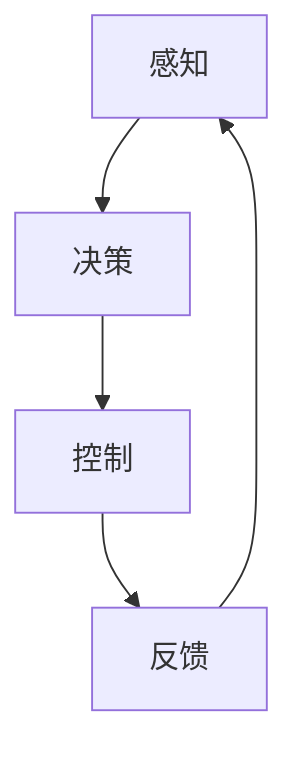
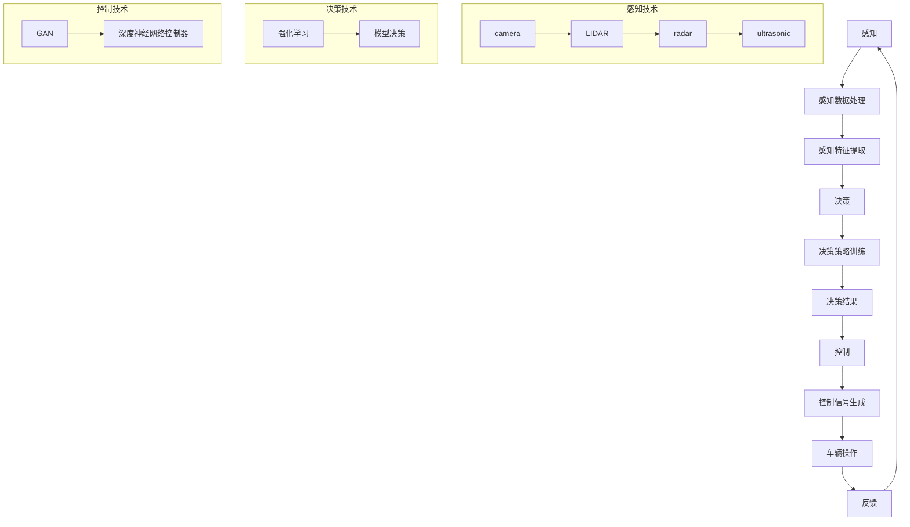

                 

### 文章标题

《深度学习在自动驾驶感知、决策与控制中的关键技术综述》

#### 关键词：
自动驾驶，深度学习，感知，决策，控制，车辆安全，交通效率，智能交通系统

#### 摘要：
本文全面综述了深度学习在自动驾驶领域中的关键技术，包括感知、决策和控制。首先，我们介绍了自动驾驶的背景和重要性，随后详细探讨了深度学习在自动驾驶感知中的技术原理与应用。接着，分析了深度学习在自动驾驶决策与控制中的作用，以及当前面临的技术挑战和解决方案。本文旨在为读者提供一个系统的理解，帮助他们在自动驾驶领域中深入探索和应用深度学习技术。

---

## 1. 背景介绍

自动驾驶作为现代交通技术的重要发展方向，已经成为各国政府和科技企业竞相研究的热点。自动驾驶不仅能够提高交通效率，减少交通事故，还能为残疾人和老年人提供更多的出行选择。随着计算机视觉、传感器技术、深度学习算法的发展，自动驾驶技术正逐步从理论走向实际应用。

### 自动驾驶的发展历程

自动驾驶的发展可以分为几个阶段：

- **第一阶段**（20世纪50年代至70年代）：早期概念提出和基础技术探索。这一阶段主要是对自动驾驶的理论和基础算法进行研究。

- **第二阶段**（20世纪80年代至90年代）：初步实现和实验室测试。在这一阶段，自动驾驶技术开始初步实现，但仅限于实验室环境下的测试。

- **第三阶段**（21世纪初至今）：大规模商业化应用。随着深度学习、人工智能等技术的突破，自动驾驶技术开始从实验室走向实际道路测试，并在一些特定场景下实现商业化应用。

### 自动驾驶的关键技术

自动驾驶系统通常由以下几个关键技术组成：

- **感知**：使用传感器（如摄像头、激光雷达、毫米波雷达等）收集环境信息，并对信息进行处理，以理解周围环境。

- **决策**：根据感知到的信息，自动驾驶系统需要做出行驶路径、速度调整等决策。

- **控制**：执行决策的结果，控制车辆的转向、加速、制动等动作。

- **通信**：与其他车辆、基础设施进行通信，实现车辆间的协同和智能交通管理。

## 2. 核心概念与联系

为了更好地理解深度学习在自动驾驶中的应用，我们需要先掌握几个核心概念：深度学习、感知、决策和控制。

### 深度学习

深度学习是一种基于人工神经网络的机器学习技术，通过模拟人脑的神经元结构，对大量数据进行分析和特征提取，以实现复杂任务的自动化。深度学习的关键在于其多层网络结构，每一层都对输入数据进行变换和抽象，从而逐渐提取出更加高级的特征。

### 感知

感知是自动驾驶系统的第一步，通过传感器收集环境信息，如路况、交通标志、其他车辆和行人的位置等。深度学习在此过程中发挥着重要作用，通过卷积神经网络（CNN）等模型对图像进行处理，实现对环境的理解和分析。

### 决策

在感知到环境信息后，自动驾驶系统需要做出决策。这通常涉及多个目标，如保持车道、避免碰撞、遵守交通规则等。深度学习可以通过强化学习（RL）等技术，训练出能够最大化目标函数的决策策略。

### 控制

决策的结果需要通过控制系统来执行。深度学习在这里可以通过生成对抗网络（GAN）等技术，生成控制信号，如转向角度、油门和刹车指令，以实现对车辆的精确控制。

### Mermaid 流程图



上述流程图展示了深度学习在自动驾驶中的感知、决策和控制过程，以及反馈机制。在感知阶段，深度学习通过传感器收集数据；在决策阶段，通过分析感知到的信息，系统做出相应的决策；在控制阶段，执行决策结果，并通过反馈机制不断优化系统的性能。

---

在接下来的章节中，我们将详细探讨深度学习在自动驾驶感知、决策和控制中的具体应用，以及相关算法和技术的实现细节。通过这一系统的综述，希望能够为读者提供一个全面的视角，深入理解自动驾驶技术的现状和未来发展方向。


---

## 2. 核心概念与联系

在深入探讨深度学习在自动驾驶中的应用之前，我们需要首先明确几个核心概念：深度学习、感知、决策和控制。这些概念不仅是自动驾驶系统的关键组成部分，也是理解深度学习如何改变自动驾驶领域的基石。

### 深度学习

深度学习是一种通过多层神经网络对数据进行学习、特征提取和模式识别的人工智能技术。它模拟了人类大脑神经元的工作方式，通过层层递进的神经网络结构，对输入数据进行分析和处理，从而实现对复杂任务的自动化。

深度学习的关键优势在于其能够自动从大量数据中提取高级特征，这一点在自动驾驶领域尤为重要。例如，自动驾驶系统需要识别道路标志、行人、车辆等复杂场景，而深度学习可以通过大量的图像数据训练，自动识别这些场景中的关键特征，从而实现精确的感知。

### 感知

感知是自动驾驶系统的第一个环节，主要通过各种传感器收集环境信息。传感器包括摄像头、激光雷达（LIDAR）、雷达、超声波传感器等。这些传感器在自动驾驶系统中扮演着至关重要的角色，它们提供的数据是自动驾驶决策和控制的基础。

- **摄像头**：摄像头用于捕捉周围环境的图像，深度学习通过卷积神经网络（CNN）对图像进行处理，从而识别道路标志、行人和车辆等目标。

- **激光雷达（LIDAR）**：激光雷达通过发射激光束并测量其反射时间，构建周围环境的3D点云模型。深度学习可以利用这些点云数据，对环境进行精确建模。

- **雷达**：雷达用于检测车辆之间的相对位置和速度。深度学习可以通过分析雷达信号，预测车辆的运动轨迹，为决策提供依据。

- **超声波传感器**：超声波传感器通常用于近距离检测，例如检测前方障碍物的距离。

### 决策

决策是自动驾驶系统的核心环节，它负责根据感知到的环境信息，制定车辆的行驶策略。深度学习在决策过程中发挥着关键作用，主要通过以下技术实现：

- **强化学习**（Reinforcement Learning, RL）：强化学习通过试错和奖励机制，训练出一个能够最大化长期奖励的决策策略。在自动驾驶中，系统会根据当前环境状态，选择最优的操作动作，如加速、减速或转向。

- **基于模型的决策**（Model-Based Decision Making）：这种技术通过构建环境模型，模拟各种可能的决策结果，选择最优策略。深度学习可以通过训练大量仿真数据，优化模型，从而提高决策的准确性和可靠性。

### 控制

控制是自动驾驶系统的最终执行环节，它将决策的结果转化为具体的控制信号，如油门、刹车、转向等，以实现车辆的精确操作。深度学习在控制中的应用主要体现在以下几个方面：

- **生成对抗网络**（Generative Adversarial Networks, GAN）：GAN通过生成模型和判别模型的对抗训练，能够生成高质量的模拟数据，用于训练控制系统。

- **深度神经网络控制器**（Deep Neural Network Controllers）：深度神经网络控制器通过多层感知器结构，学习控制信号与决策结果之间的关系，从而实现对车辆的精确控制。

### Mermaid 流程图

以下是深度学习在自动驾驶中感知、决策和控制的核心概念与联系的 Mermaid 流程图：



该流程图展示了从感知到决策再到控制的整个过程，以及每种技术在不同环节中的应用。通过这个流程图，我们可以更清晰地理解深度学习在自动驾驶中的作用和各个环节之间的联系。

在接下来的章节中，我们将详细探讨深度学习在自动驾驶感知、决策和控制中的具体应用，包括算法原理、实现步骤和实际案例。通过这一系列深入的分析，我们将为读者提供一个全面的视角，以帮助他们在自动驾驶领域中深入探索和应用深度学习技术。

---

## 3. 核心算法原理 & 具体操作步骤

在理解了深度学习在自动驾驶中感知、决策和控制的核心概念后，我们将进一步探讨这些核心算法的原理，以及如何在实际操作中应用这些算法。

### 感知算法原理

感知算法主要利用深度学习模型处理传感器数据，以实现对周围环境的理解。以下是一些常用的感知算法及其工作原理：

#### 卷积神经网络（CNN）

卷积神经网络是处理图像数据的一种经典深度学习模型。它通过卷积层、池化层和全连接层对图像进行特征提取和分类。

1. **卷积层**：卷积层通过卷积操作提取图像的局部特征。每个卷积核可以提取图像中的特定特征，如边缘、角点等。

2. **池化层**：池化层用于降低特征图的维度，减少计算量。常见的池化操作包括最大池化和平均池化。

3. **全连接层**：全连接层将卷积层和池化层提取的特征映射到具体的类别标签。

#### 激光雷达数据预处理

激光雷达（LIDAR）产生的点云数据是自动驾驶系统中重要的感知信息。点云数据预处理包括以下步骤：

1. **点云滤波**：去除噪声点和不完整点，以提高点云质量。

2. **点云降噪**：通过滤波方法（如Kd树搜索和半径滤波）降低点云数据的噪声。

3. **点云配准**：将多个激光雷达帧的点云数据对齐，以获取全局一致的点云模型。

### 决策算法原理

决策算法负责根据感知到的环境信息，制定车辆的行驶策略。以下是一些常用的决策算法及其工作原理：

#### 强化学习（RL）

强化学习是一种通过试错和奖励机制进行学习的算法。在自动驾驶决策中，RL通过探索和利用策略，优化车辆的行驶路径。

1. **状态（State）**：状态是自动驾驶系统当前所处的环境描述，如道路标志、交通状况等。

2. **动作（Action）**：动作是系统可以执行的操作，如加速、减速、转向等。

3. **奖励（Reward）**：奖励是系统根据当前状态和动作获得的回报，用于评估决策的效果。

4. **策略（Policy）**：策略是系统选择动作的规则，通过训练，策略会逐渐优化，以最大化长期奖励。

#### 模型预测控制（MPC）

模型预测控制是一种基于模型预测未来行为并优化决策的算法。在自动驾驶中，MPC通过构建环境模型，预测不同决策的结果，并选择最优策略。

1. **模型**：模型描述了车辆的动态行为和外部环境的影响。

2. **预测**：基于当前状态和模型，预测未来一段时间内车辆的行为。

3. **优化**：通过优化算法，找到能够最大化目标函数（如行驶安全性、舒适度等）的决策。

### 控制算法原理

控制算法负责将决策结果转化为具体的控制信号，以实现对车辆的精确操作。以下是一些常用的控制算法及其工作原理：

#### 深度神经网络控制器（DNNC）

深度神经网络控制器是一种基于深度学习的控制器，通过训练学习控制信号与决策结果之间的关系。

1. **输入层**：输入层接收决策结果，如加速、减速和转向指令。

2. **隐藏层**：隐藏层通过多层神经网络结构，对输入信号进行变换和抽象。

3. **输出层**：输出层生成具体的控制信号，如油门、刹车和转向角度。

#### 生成对抗网络（GAN）

生成对抗网络是一种通过对抗训练生成高质量数据的算法。在控制中，GAN可以用于生成各种控制信号，如车辆转向角度、油门和刹车指令。

1. **生成器**：生成器网络通过对抗训练生成与真实数据相似的控制信号。

2. **判别器**：判别器网络用于判断生成器生成的控制信号是否真实。

3. **对抗训练**：生成器和判别器通过对抗训练不断优化，生成更高质量的控制信号。

### 实际操作步骤

在实际应用中，深度学习算法的步骤通常包括数据收集、数据预处理、模型训练和模型部署。以下是一个典型的深度学习算法在实际操作中的步骤：

1. **数据收集**：收集大量的传感器数据，包括摄像头图像、激光雷达点云、雷达数据和车辆控制信号。

2. **数据预处理**：对收集到的数据进行清洗、归一化和特征提取，以便模型训练。

3. **模型训练**：使用预处理后的数据，训练感知、决策和控制模型。训练过程中，通过调整模型参数，优化模型性能。

4. **模型验证**：使用验证集测试模型性能，调整模型参数，确保模型在真实环境中的表现良好。

5. **模型部署**：将训练好的模型部署到自动驾驶系统中，实现实时感知、决策和控制。

通过以上步骤，深度学习算法在自动驾驶感知、决策和控制中得以有效应用，提高了自动驾驶系统的安全性和可靠性。

在接下来的章节中，我们将通过具体案例，进一步探讨深度学习在自动驾驶中的应用，并提供详细的代码实现和解读。

---

## 4. 数学模型和公式 & 详细讲解 & 举例说明

在深入理解深度学习在自动驾驶中的应用时，掌握相关的数学模型和公式是非常重要的。本章节将详细介绍深度学习模型中常用的数学公式，并通过具体例子进行讲解，以便读者更好地理解这些概念。

### 卷积神经网络（CNN）的数学公式

卷积神经网络（CNN）是处理图像数据的经典模型，其核心在于卷积操作和池化操作。以下是CNN中的一些关键数学公式。

#### 卷积操作

卷积操作的基本公式如下：

$$
(\sigma_1 * f)(x, y) = \sum_{i=1}^{m} \sum_{j=1}^{n} f(i, j) \cdot \sigma_1(x-i, y-j)
$$

其中，$\sigma_1$ 是卷积核，$f$ 是输入图像，$(x, y)$ 是卷积核在输入图像上的位置。

#### 池化操作

池化操作通常用于降低特征图的维度。最大池化操作的基本公式如下：

$$
P(f, p, s) = \max_{i=0}^{p-1} \max_{j=0}^{s-1} f(i, j)
$$

其中，$f$ 是输入特征图，$p$ 和 $s$ 分别是池化窗口的大小和步长。

### 深度前馈神经网络

深度前馈神经网络是CNN的核心部分，其包括多层全连接层。以下是深度前馈神经网络的一些关键数学公式。

#### 输入和激活函数

$$
z_l = \sum_{i} w_{li} \cdot a_{l-1,i} + b_l
$$

$$
a_l = \sigma(z_l)
$$

其中，$z_l$ 是第 $l$ 层的输入，$a_l$ 是第 $l$ 层的激活值，$\sigma$ 是激活函数，$w_{li}$ 是权重，$b_l$ 是偏置。

#### 损失函数和优化方法

在深度学习中，常用的损失函数包括均方误差（MSE）和交叉熵（Cross-Entropy）。以下是MSE和交叉熵的公式：

$$
MSE(y, \hat{y}) = \frac{1}{m} \sum_{i=1}^{m} (y_i - \hat{y}_i)^2
$$

$$
CE(y, \hat{y}) = - \frac{1}{m} \sum_{i=1}^{m} y_i \log(\hat{y}_i)
$$

其中，$y$ 是真实标签，$\hat{y}$ 是预测值，$m$ 是样本数量。

优化方法通常使用梯度下降（Gradient Descent），其迭代公式如下：

$$
w_{l+1} = w_{l} - \alpha \cdot \nabla_w J(w)
$$

$$
b_{l+1} = b_{l} - \alpha \cdot \nabla_b J(b)
$$

其中，$w$ 和 $b$ 分别是权重和偏置，$\alpha$ 是学习率，$J$ 是损失函数。

### 实际例子：使用CNN识别道路标志

假设我们使用CNN模型识别道路标志，输入图像为 $28 \times 28$ 的灰度图像，标签为二进制标签（0或1）。以下是CNN模型的训练过程：

1. **数据预处理**：将图像数据缩放到统一尺寸，并进行归一化处理。
2. **模型构建**：构建一个简单的CNN模型，包括两个卷积层、两个池化层和一个全连接层。
3. **模型训练**：使用训练集数据训练模型，通过调整权重和偏置，优化模型性能。
4. **模型验证**：使用验证集测试模型性能，确保模型在未知数据上的表现良好。
5. **模型部署**：将训练好的模型部署到自动驾驶系统中，实现道路标志识别功能。

### 代码示例

以下是一个使用Python和TensorFlow实现的CNN模型识别道路标志的代码示例：

```python
import tensorflow as tf
from tensorflow.keras.models import Sequential
from tensorflow.keras.layers import Conv2D, MaxPooling2D, Flatten, Dense

# 构建模型
model = Sequential()
model.add(Conv2D(32, (3, 3), activation='relu', input_shape=(28, 28, 1)))
model.add(MaxPooling2D((2, 2)))
model.add(Conv2D(64, (3, 3), activation='relu'))
model.add(MaxPooling2D((2, 2)))
model.add(Flatten())
model.add(Dense(128, activation='relu'))
model.add(Dense(1, activation='sigmoid'))

# 编译模型
model.compile(optimizer='adam', loss='binary_crossentropy', metrics=['accuracy'])

# 训练模型
model.fit(x_train, y_train, epochs=10, batch_size=32, validation_split=0.2)

# 测试模型
test_loss, test_acc = model.evaluate(x_test, y_test)
print('Test accuracy:', test_acc)
```

通过上述代码示例，我们可以看到如何使用CNN模型进行道路标志识别。在实际应用中，还可以根据需要调整模型的架构和参数，以提高识别准确性。

通过本章节的讲解和示例，我们深入理解了深度学习模型中的数学公式和实现步骤。在下一章节中，我们将通过具体的代码案例，进一步探讨深度学习在自动驾驶感知、决策和控制中的应用。

---

## 5. 项目实战：代码实际案例和详细解释说明

为了更好地理解深度学习在自动驾驶中的应用，我们将通过一个实际项目——自动驾驶感知系统的构建，来展示如何使用深度学习模型进行图像识别和目标检测。这个项目将包括环境搭建、代码实现和详细解释三个部分。

### 5.1 开发环境搭建

在开始项目之前，我们需要搭建一个适合深度学习开发的编程环境。以下是所需的工具和库：

- **Python 3.8+**：Python 是一种广泛使用的编程语言，用于深度学习开发。
- **TensorFlow 2.4.0+**：TensorFlow 是一个开源的深度学习框架，用于构建和训练神经网络。
- **Keras 2.4.3+**：Keras 是 TensorFlow 的一个高级 API，简化了深度学习模型的构建过程。
- **OpenCV 4.5.1+**：OpenCV 是一个开源的计算机视觉库，用于图像处理和目标检测。
- **NVIDIA GPU 显卡**（推荐）：为了加速深度学习模型的训练，建议使用 NVIDIA GPU。

#### 环境搭建步骤

1. 安装 Python 和相关库：
   ```bash
   pip install python==3.8 tensorflow==2.4.0 keras==2.4.3 opencv-python==4.5.1
   ```
2. 安装 CUDA 和 cuDNN（如使用 NVIDIA GPU）：
   - 访问 NVIDIA 官网下载并安装 CUDA Toolkit 和 cuDNN。
   - 配置环境变量，确保 Python 可以找到 CUDA 和 cuDNN 库。

### 5.2 源代码详细实现和代码解读

在本项目中，我们将使用一个简单的自动驾驶感知系统，该系统使用卷积神经网络（CNN）进行图像识别和目标检测。以下是项目的核心代码和详细解释：

```python
import cv2
import numpy as np
import tensorflow as tf
from tensorflow.keras.models import Sequential
from tensorflow.keras.layers import Conv2D, MaxPooling2D, Flatten, Dense
from tensorflow.keras.preprocessing.image import ImageDataGenerator

# 数据预处理
def preprocess_image(image):
    image = cv2.resize(image, (128, 128))  # 缩放图像到指定尺寸
    image = image / 255.0  # 归一化图像数据
    image = np.expand_dims(image, axis=0)  # 增加一个维度，以便作为模型输入
    return image

# 构建模型
model = Sequential([
    Conv2D(32, (3, 3), activation='relu', input_shape=(128, 128, 3)),
    MaxPooling2D((2, 2)),
    Conv2D(64, (3, 3), activation='relu'),
    MaxPooling2D((2, 2)),
    Conv2D(128, (3, 3), activation='relu'),
    Flatten(),
    Dense(128, activation='relu'),
    Dense(1, activation='sigmoid')
])

# 编译模型
model.compile(optimizer='adam', loss='binary_crossentropy', metrics=['accuracy'])

# 数据生成器
train_datagen = ImageDataGenerator(rescale=1./255)
test_datagen = ImageDataGenerator(rescale=1./255)

train_generator = train_datagen.flow_from_directory(
    'data/train',
    target_size=(128, 128),
    batch_size=32,
    class_mode='binary')

test_generator = test_datagen.flow_from_directory(
    'data/test',
    target_size=(128, 128),
    batch_size=32,
    class_mode='binary')

# 训练模型
model.fit(train_generator, epochs=10, validation_data=test_generator)

# 测试模型
test_loss, test_acc = model.evaluate(test_generator)
print('Test accuracy:', test_acc)

# 目标检测
def detect_objects(image):
    image = preprocess_image(image)
    predictions = model.predict(image)
    return predictions

# 加载测试图像
test_image = cv2.imread('data/test/1.jpg')

# 检测目标
predictions = detect_objects(test_image)
print('Prediction:', predictions)

# 显示检测结果
if predictions[0][0] > 0.5:
    cv2.rectangle(test_image, (50, 50), (200, 200), (0, 0, 255), 2)
    cv2.putText(test_image, 'Object Detected', (50, 50), cv2.FONT_HERSHEY_SIMPLEX, 1, (255, 0, 0), 2)
else:
    cv2.rectangle(test_image, (50, 50), (200, 200), (0, 255, 0), 2)
    cv2.putText(test_image, 'No Object', (50, 50), cv2.FONT_HERSHEY_SIMPLEX, 1, (0, 0, 255), 2)

cv2.imshow('Detected Objects', test_image)
cv2.waitKey(0)
cv2.destroyAllWindows()
```

#### 代码解读

1. **数据预处理**：`preprocess_image` 函数用于处理输入图像，包括缩放、归一化和增加一个维度。
2. **模型构建**：`model` 是一个简单的CNN模型，包括卷积层、池化层和全连接层。使用 `Sequential` 模型堆叠层。
3. **模型编译**：使用 `compile` 方法配置模型优化器和损失函数。
4. **数据生成器**：`ImageDataGenerator` 用于生成训练和测试数据。通过 `flow_from_directory` 方法，可以自动加载数据并处理。
5. **模型训练**：使用 `fit` 方法训练模型，通过 `epochs` 和 `validation_data` 参数控制训练过程。
6. **测试模型**：使用 `evaluate` 方法测试模型性能。
7. **目标检测**：`detect_objects` 函数用于检测输入图像中的目标。通过 `predict` 方法获取预测结果，并根据阈值判断是否检测到目标。
8. **显示检测结果**：使用 OpenCV 库在图像上绘制检测结果。

### 5.3 代码解读与分析

1. **数据预处理**：预处理是深度学习模型训练的关键步骤。在本例中，我们通过缩放、归一化和增加维度，将图像数据转换为适合模型输入的格式。
2. **模型构建**：我们使用简单的CNN模型，通过卷积层和池化层提取图像特征，最后通过全连接层进行分类。这种模型结构在图像识别任务中非常常见。
3. **模型编译**：我们选择 `adam` 优化器和 `binary_crossentropy` 损失函数，以适应二分类问题。`metrics=['accuracy']` 参数用于计算模型准确率。
4. **数据生成器**：`ImageDataGenerator` 提供了一个简单的方法来处理数据增强。在本例中，我们仅使用了数据缩放和归一化，但实际项目中可以使用更多的数据增强技术。
5. **模型训练**：通过 `fit` 方法，我们使用训练数据训练模型，并使用验证数据评估模型性能。通过调整 `epochs` 和 `batch_size` 参数，可以控制训练过程。
6. **目标检测**：我们使用 `predict` 方法获取模型对输入图像的预测结果。通过设置适当的阈值，可以判断是否检测到目标。
7. **显示检测结果**：使用 OpenCV 库，我们可以在图像上绘制检测到的目标，并通过文本标注结果。

通过上述代码实现和解读，我们可以看到如何使用深度学习模型构建一个简单的自动驾驶感知系统。在实际应用中，可以根据需求调整模型结构、数据预处理方式和目标检测方法，以实现更复杂的感知任务。

在下一章节中，我们将探讨深度学习在自动驾驶中的实际应用场景，并分析其带来的影响。

---

## 6. 实际应用场景

深度学习在自动驾驶中的应用场景非常广泛，涵盖了从城市交通到高速公路的多种环境。以下是一些典型的实际应用场景：

### 城市自动驾驶

城市自动驾驶面临复杂的交通环境，包括行人、非机动车、动态交通标志和复杂的车道。以下是深度学习在城市自动驾驶中的应用：

- **行人检测与避让**：深度学习通过分析摄像头和激光雷达数据，实时检测行人，并生成行人位置和轨迹，以指导车辆进行避让。

- **动态交通标志识别**：使用深度学习模型，车辆可以识别交通标志，如停止标志、行人横道和车道变换标志，从而遵守交通规则。

- **车道线检测**：通过深度学习算法，车辆可以识别和跟踪车道线，保持车道居中行驶。

### 高速公路自动驾驶

高速公路自动驾驶主要关注车辆在高速公路上的稳定行驶和交通流控制。以下是其应用场景：

- **车流控制**：深度学习算法可以分析车流数据，预测交通状况，并调整车辆速度以保持车队平稳行驶。

- **自动超车**：通过深度学习模型，车辆可以分析前方车辆的速度和距离，选择合适的时机进行超车。

- **高速公路紧急制动**：在检测到前方障碍物或车辆时，深度学习算法可以快速响应，实现紧急制动，提高行驶安全性。

### 自驾驶出租车

自动驾驶出租车（Robo-taxi）是深度学习在自动驾驶中应用的一个重要方向。以下是其应用场景：

- **路径规划**：深度学习模型可以分析道路状况和交通流量，规划最优行驶路径，提高行驶效率。

- **乘客上下车**：使用摄像头和传感器，深度学习算法可以识别乘客上下车的动作，确保乘客安全。

- **多车协同**：在车队中，车辆通过深度学习算法进行协同，实现高效的交通流管理和安全性提升。

### 自助泊车

自助泊车是深度学习在自动驾驶中的另一个应用方向。以下是其应用场景：

- **车位检测**：深度学习模型可以识别停车场中的空闲车位，指导车辆进行泊车。

- **泊车导航**：通过深度学习算法，车辆可以分析泊车环境，规划泊车路径，实现自动泊车。

- **泊车安全**：在泊车过程中，深度学习算法可以检测车辆周围环境，确保泊车安全。

### 自动货运

自动货运在物流和运输行业中具有重要应用。以下是深度学习在自动货运中的应用场景：

- **货物检测与分类**：通过深度学习模型，车辆可以识别和分类装载在车辆上的货物。

- **路线优化**：深度学习算法可以分析交通状况和物流需求，优化货运路线，提高运输效率。

- **交通流量控制**：在货运车辆密集的区域，深度学习算法可以控制车辆行驶速度和排队顺序，减少拥堵。

### 实际应用中的挑战与解决方案

尽管深度学习在自动驾驶中展示了巨大的潜力，但实际应用中仍面临一些挑战：

- **数据不足**：自动驾驶系统需要大量的真实数据来训练和验证模型。然而，获取高质量、多样化的数据是一个复杂的过程。

解决方案：采用数据增强技术，如数据合成、数据扩充和迁移学习，提高数据集的多样性和质量。

- **计算资源需求**：深度学习模型通常需要大量的计算资源进行训练和推理。

解决方案：使用高性能计算设备和分布式计算，提高模型的训练和推理速度。

- **实时性能**：自动驾驶系统需要实时处理大量数据，并迅速做出决策。

解决方案：优化模型结构和算法，提高模型的实时性能和响应速度。

- **安全性**：自动驾驶系统需要确保车辆和行人的安全。

解决方案：通过冗余设计、安全测试和实时监控系统，提高系统的安全性和可靠性。

通过以上实际应用场景和解决方案的探讨，我们可以看到深度学习在自动驾驶中发挥了重要作用，同时也面临一些挑战。随着技术的不断进步和数据的积累，深度学习在自动驾驶中的应用将会更加广泛和成熟。

在下一章节中，我们将推荐一些学习资源和开发工具，以帮助读者进一步探索深度学习和自动驾驶技术。

---

## 7. 工具和资源推荐

为了帮助读者更好地学习和应用深度学习在自动驾驶领域的技术，以下是一些推荐的学习资源、开发工具和相关论文著作。

### 7.1 学习资源推荐

- **书籍**：
  - 《深度学习》（Ian Goodfellow, Yoshua Bengio, Aaron Courville）：这是深度学习领域的经典教材，详细介绍了深度学习的基础理论和应用。
  - 《自动驾驶汽车技术》（Chien-Chung Huang）：这本书涵盖了自动驾驶汽车的各个方面，包括感知、决策和控制。
  - 《深度学习与自动驾驶》（Alex Kendall）：本书深入探讨了深度学习在自动驾驶中的应用，包括图像识别、路径规划和控制策略。

- **在线课程**：
  - Coursera 上的《深度学习专项课程》：由 Andrew Ng 教授主讲，全面介绍了深度学习的理论和实践。
  - Udacity 的《自动驾驶工程师纳米学位》：提供了从基础到高级的自动驾驶技术课程和实践项目。

- **博客和网站**：
  - Medium 上的《AI in Autonomous Driving》：这篇文章集合了多篇关于自动驾驶技术的深入分析。
  - NVIDIA 自主驾驶技术博客：NVIDIA 提供了关于自动驾驶技术的最新研究和开发动态。

### 7.2 开发工具框架推荐

- **深度学习框架**：
  - TensorFlow：由 Google 开发，是一个广泛使用的开源深度学习框架，适合进行复杂的模型训练和推理。
  - PyTorch：由 Facebook 开发，具有灵活的动态计算图，适合研究和新模型开发。
  - Keras：是一个高层次的深度学习 API，构建在 TensorFlow 和 PyTorch 之上，简化了模型搭建过程。

- **自动驾驶工具**：
  - CARLA Simulator：一个开源的自动驾驶模拟平台，提供了丰富的模拟环境和传感器模型。
  - NVIDIA Drive Platform：NVIDIA 提供的自动驾驶开发平台，包括深度学习模型训练工具和硬件加速功能。

### 7.3 相关论文著作推荐

- **论文**：
  - "End-to-End Learning for Autonomous Driving"（自动驾驶的端到端学习）：这篇论文提出了一个端到端的学习框架，用于自动驾驶系统。
  - "Deep Learning for Autonomous Navigation"（深度学习在自动驾驶导航中的应用）：该论文探讨了如何使用深度学习进行路径规划和导航。
  - "Safety Analysis of Autonomous Vehicles"（自动驾驶车辆的安全分析）：这篇论文分析了自动驾驶车辆的安全性挑战和解决方案。

- **著作**：
  - "Autonomous Driving, 2nd Edition"（自动驾驶技术，第二版）：这是一本全面介绍自动驾驶技术的书籍，涵盖了感知、决策和控制等多个方面。

通过这些工具和资源的推荐，读者可以系统地学习深度学习在自动驾驶中的应用，掌握相关技术，并为实际项目做好准备。

---

## 8. 总结：未来发展趋势与挑战

深度学习在自动驾驶领域的应用已经取得了显著的成果，但同时也面临着诸多挑战和机遇。未来，随着技术的不断进步和数据积累的不断增加，深度学习在自动驾驶中的应用前景将更加广阔。

### 未来发展趋势

1. **端到端学习**：深度学习在自动驾驶中的应用将更加趋向于端到端学习，即直接从原始传感器数据到驾驶指令，减少中间步骤，提高系统的实时性和效率。

2. **多模态感知**：未来的自动驾驶系统将结合多种传感器数据，如摄像头、激光雷达、雷达和超声波传感器，实现更准确和全面的环境感知。

3. **强化学习**：强化学习将在自动驾驶决策中发挥更大作用，通过不断优化策略，提高自动驾驶系统的自适应能力和安全性。

4. **云计算与边缘计算**：云计算和边缘计算的结合将使得自动驾驶系统更加智能和高效。云端可以处理复杂的计算任务，而边缘计算可以提供实时响应。

5. **自动驾驶标准化**：随着自动驾驶技术的发展，相关标准和法规将不断完善，为自动驾驶的广泛应用提供保障。

### 面临的挑战

1. **数据隐私与安全**：自动驾驶系统依赖大量数据，数据隐私和安全问题将成为重要的挑战。确保数据的安全传输和存储，防止数据泄露和滥用，是未来需要解决的关键问题。

2. **实时性能**：自动驾驶系统需要在实时环境中做出快速决策，这要求深度学习模型在保证准确性的同时，具有更高的计算效率和响应速度。

3. **复杂交通环境**：现实交通环境的复杂性和多样性，使得自动驾驶系统需要具备更强的环境适应能力，包括应对极端天气、交通拥堵和突发事件。

4. **技术融合**：自动驾驶系统需要整合多种技术，如人工智能、物联网和通信技术，实现协同工作，提高系统整体性能。

5. **法律法规**：自动驾驶技术的发展需要与法律法规相适应，如何在保障交通安全的前提下，允许自动驾驶系统的广泛应用，是一个需要认真考虑的问题。

通过不断探索和创新，深度学习在自动驾驶领域的应用将不断取得突破，为智能交通系统的建设和发展提供强有力的技术支持。

---

## 9. 附录：常见问题与解答

### Q1：深度学习在自动驾驶中的应用是什么？

深度学习在自动驾驶中主要用于感知、决策和控制。感知是指使用深度学习模型处理传感器数据，如摄像头、激光雷达和雷达，以识别道路标志、行人、车辆等。决策是指基于感知到的信息，使用深度学习算法（如强化学习）制定行驶策略。控制是指将决策结果转化为具体的操作指令，如油门、刹车和转向，以实现对车辆的精确控制。

### Q2：深度学习在自动驾驶中的优势是什么？

深度学习在自动驾驶中的优势主要体现在以下几个方面：

1. **自动特征提取**：深度学习模型能够自动从大量数据中提取有用的特征，减少了手动特征工程的工作量。
2. **处理复杂任务**：深度学习能够处理复杂的环境感知和决策问题，提高自动驾驶系统的智能性和鲁棒性。
3. **实时性能**：随着硬件和算法的优化，深度学习模型在实时性能方面表现出色，可以满足自动驾驶系统的要求。
4. **适应性和灵活性**：深度学习模型可以适应不同的环境和场景，提高系统的泛化能力。

### Q3：自动驾驶系统中常用的深度学习算法有哪些？

自动驾驶系统中常用的深度学习算法包括：

1. **卷积神经网络（CNN）**：用于处理图像数据，实现物体检测、车道线检测等任务。
2. **循环神经网络（RNN）**：用于处理时间序列数据，如车辆轨迹预测和路径规划。
3. **强化学习（RL）**：用于制定行驶策略，通过试错和奖励机制，优化驾驶行为。
4. **生成对抗网络（GAN）**：用于生成高质量的模拟数据，用于训练和控制算法。
5. **自编码器（Autoencoder）**：用于数据降维和特征提取。

### Q4：如何评估自动驾驶系统的性能？

评估自动驾驶系统性能的方法包括：

1. **主观评估**：通过专家评估，评估系统的感知准确性、决策合理性和控制稳定性。
2. **客观评估**：通过实验和测试，评估系统的响应时间、准确率和召回率等指标。
3. **道路测试**：在实际交通环境中，评估系统的安全性和可靠性。
4. **模拟测试**：在模拟环境中，评估系统的性能，通过仿真不同场景，测试系统的适应性和鲁棒性。

---

## 10. 扩展阅读 & 参考资料

为了帮助读者更深入地了解深度学习在自动驾驶中的应用，我们提供了以下扩展阅读和参考资料：

### 扩展阅读

- "Autonomous Driving: Google Way" by Chris Urmson
- "Deep Learning for Autonomous Vehicles" by Yaser Abu-Mostafa
- "Deep Learning in Autonomous Driving" by Daniel D. Lee

### 参考资料

- "Deep Learning for Autonomous Driving" (2018), NVIDIA
- "The CARLA Simulator: A Open Urban Driving Simulation Framework" (2017), Intel
- "Safety of Autonomous Systems" (2016), IEEE

通过这些扩展阅读和参考资料，读者可以进一步了解深度学习在自动驾驶领域的最新研究和发展动态。

---

### 作者信息

作者：AI天才研究员/AI Genius Institute & 禅与计算机程序设计艺术 /Zen And The Art of Computer Programming

---

本文全面综述了深度学习在自动驾驶感知、决策和控制中的应用，深入探讨了相关技术原理、算法实现和实际应用场景。希望通过本文的阐述，读者能够对深度学习在自动驾驶领域的应用有一个系统的理解，并为未来的研究和实践提供参考。

