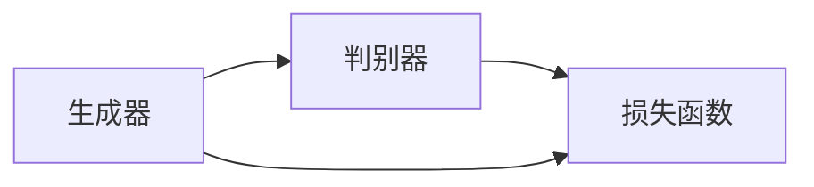
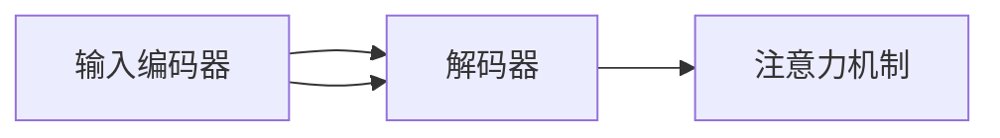
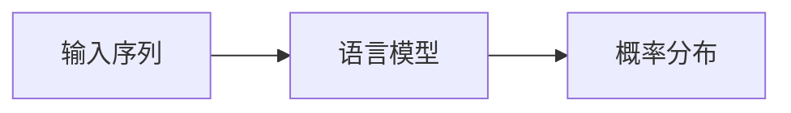

                 

# 深度学习在自然语言生成中的最新进展

## 概述

自然语言生成（Natural Language Generation，NLG）是指通过计算机程序自动生成自然语言的文本，其应用广泛，如自动新闻撰写、聊天机器人、语音合成等。近年来，随着深度学习技术的不断发展，NLG领域取得了显著的进展。本文将介绍深度学习在自然语言生成中的最新研究成果，包括核心算法原理、数学模型、项目实战和实际应用场景等内容。

## 关键词

- 自然语言生成（NLG）
- 深度学习
- 生成对抗网络（GAN）
- 序列到序列模型（Seq2Seq）
- 语言模型
- 机器翻译
- 文本摘要

## 摘要

本文首先介绍了自然语言生成的背景和重要性，然后详细探讨了深度学习在自然语言生成中的应用，包括生成对抗网络（GAN）、序列到序列模型（Seq2Seq）等核心算法原理。接着，本文通过数学模型和具体案例，讲解了这些算法的具体实现和优化方法。最后，本文分析了自然语言生成在当前的实际应用场景，并展望了未来的发展趋势和挑战。

## 1. 背景介绍

### 自然语言生成的起源与发展

自然语言生成技术的研究始于20世纪60年代，早期的研究主要集中在规则驱动的方法，即通过定义语法规则和语义规则来生成文本。然而，这种方法在处理复杂语境和多样性表达方面存在很大局限性。

随着计算机科学的不断发展，统计方法和机器学习方法逐渐被引入自然语言生成领域。20世纪80年代，基于统计的隐马尔可夫模型（HMM）和条件概率模型被应用于文本生成，提高了生成文本的多样性。

进入21世纪，深度学习技术的崛起为自然语言生成带来了新的突破。深度学习能够通过大量的数据自动学习复杂的特征表示，使得生成文本的质量和多样性得到了显著提升。

### 深度学习在自然语言生成中的优势

1. **强大的特征学习能力**：深度学习模型，如卷积神经网络（CNN）和循环神经网络（RNN），能够从大量数据中自动提取复杂的特征表示，使得生成文本更具个性化和真实性。

2. **端到端的学习**：深度学习模型可以端到端地学习输入和输出的映射关系，避免了传统方法中繁琐的特征工程和参数调整过程。

3. **自适应性和灵活性**：深度学习模型可以根据不同的任务和数据集进行自适应调整，从而适应不同的应用场景。

4. **丰富的应用场景**：深度学习在自然语言生成中的应用广泛，如机器翻译、文本摘要、问答系统、对话生成等。

## 2. 核心概念与联系

### 生成对抗网络（GAN）

生成对抗网络（GAN）是一种由生成器和判别器组成的深度学习模型。生成器的目标是生成逼真的数据，判别器的目标是区分生成数据和真实数据。通过两者之间的对抗训练，生成器的生成质量不断提高。

#### Mermaid 流程图



### 序列到序列模型（Seq2Seq）

序列到序列模型（Seq2Seq）是一种用于处理序列数据的深度学习模型，常用于机器翻译和对话生成等任务。Seq2Seq模型由输入编码器、解码器和注意力机制组成。

#### Mermaid 流程图



### 语言模型

语言模型是一种用于预测自然语言中下一个单词或字符的概率分布的模型。深度学习在语言模型中的应用，如Word2Vec、BERT等，为自然语言处理任务提供了强大的支持。

#### Mermaid 流程图



## 3. 核心算法原理 & 具体操作步骤

### 生成对抗网络（GAN）

#### 损失函数

GAN的损失函数由生成器损失和判别器损失两部分组成：

$$
L_G = -\log(D(G(z)))
$$

$$
L_D = -[\log(D(x)) + \log(1 - D(G(z))]
$$

其中，$G(z)$表示生成器生成的数据，$D(x)$表示判别器对真实数据的判别结果。

#### 训练步骤

1. 初始化生成器$G$和判别器$D$的参数。
2. 随机生成一批噪声向量$z$，通过生成器$G$生成一批假数据$G(z)$。
3. 将真实数据和假数据输入判别器$D$，计算判别器的损失$L_D$。
4. 更新判别器$D$的参数，使用反向传播算法。
5. 将真实数据输入生成器$G$，计算生成器的损失$L_G$。
6. 更新生成器$G$的参数，使用反向传播算法。
7. 重复步骤2-6，直至达到训练迭代次数或生成数据质量满足要求。

### 序列到序列模型（Seq2Seq）

#### 编码器-解码器框架

1. 输入编码器将输入序列编码为固定长度的向量。
2. 解码器将编码器输出的向量解码为输出序列。
3. 注意力机制用于捕捉输入序列和输出序列之间的关联。

#### 损失函数

Seq2Seq模型的损失函数通常采用交叉熵损失：

$$
L = -\sum_{i=1}^n y_i \log(p_i)
$$

其中，$y_i$为真实标签，$p_i$为模型预测的概率分布。

#### 训练步骤

1. 初始化编码器、解码器和注意力机制的参数。
2. 随机生成一批输入序列和目标序列。
3. 将输入序列输入编码器，得到编码向量。
4. 将编码向量输入解码器，生成输出序列。
5. 计算输出序列的损失$L$。
6. 更新编码器、解码器和注意力机制的参数，使用反向传播算法。
7. 重复步骤2-6，直至达到训练迭代次数或模型性能满足要求。

### 语言模型

#### Word2Vec

Word2Vec是一种基于神经网络的词向量模型，其基本原理如下：

1. 输入单词序列，将其转化为单词的索引序列。
2. 将每个单词的索引序列转换为二进制编码。
3. 构建神经网络，输入为二进制编码，输出为单词的向量表示。
4. 训练神经网络，最小化损失函数，如均方误差或交叉熵。

#### BERT

BERT（Bidirectional Encoder Representations from Transformers）是一种基于Transformer的预训练语言模型，其基本原理如下：

1. 输入单词序列，通过分词和词嵌入将其转换为嵌入序列。
2. 将嵌入序列输入Transformer编码器，得到序列的固定长度的向量表示。
3. 使用注意力机制捕捉序列中的依赖关系。
4. 对编码器输出的向量进行分类或回归任务。

## 4. 数学模型和公式 & 详细讲解 & 举例说明

### 生成对抗网络（GAN）

#### 损失函数

生成器的损失函数：

$$
L_G = -\log(D(G(z)))
$$

其中，$D(G(z))$表示判别器对生成数据的判别结果，取值范围在0到1之间。生成器的目标是最小化这个损失函数，使得判别器无法区分生成数据和真实数据。

判别器的损失函数：

$$
L_D = -[\log(D(x)) + \log(1 - D(G(z))]
$$

其中，$D(x)$表示判别器对真实数据的判别结果，$D(G(z))$表示判别器对生成数据的判别结果。判别器的目标是最小化这个损失函数，使得判别器能够准确地区分生成数据和真实数据。

#### 训练示例

假设生成器$G$和判别器$D$的训练数据集为$x_1, x_2, ..., x_n$和$z_1, z_2, ..., z_n$，其中$x_i$为真实数据，$z_i$为生成器生成的噪声向量。

1. 初始化生成器$G$和判别器$D$的参数。
2. 随机生成一批噪声向量$z$，通过生成器$G$生成一批假数据$G(z)$。
3. 将真实数据和假数据输入判别器$D$，计算判别器的损失$L_D$。
4. 更新判别器$D$的参数，使用反向传播算法。
5. 将真实数据输入生成器$G$，计算生成器的损失$L_G$。
6. 更新生成器$G$的参数，使用反向传播算法。
7. 重复步骤2-6，直至达到训练迭代次数或生成数据质量满足要求。

### 序列到序列模型（Seq2Seq）

#### 损失函数

Seq2Seq模型的损失函数通常采用交叉熵损失：

$$
L = -\sum_{i=1}^n y_i \log(p_i)
$$

其中，$y_i$为真实标签，$p_i$为模型预测的概率分布。

#### 训练示例

假设输入序列为$x_1, x_2, ..., x_n$，目标序列为$y_1, y_2, ..., y_n$。

1. 初始化编码器、解码器和注意力机制的参数。
2. 随机生成一批输入序列和目标序列。
3. 将输入序列输入编码器，得到编码向量。
4. 将编码向量输入解码器，生成输出序列。
5. 计算输出序列的损失$L$。
6. 更新编码器、解码器和注意力机制的参数，使用反向传播算法。
7. 重复步骤2-6，直至达到训练迭代次数或模型性能满足要求。

### 语言模型

#### Word2Vec

1. 输入单词序列，将其转化为单词的索引序列。
2. 将每个单词的索引序列转换为二进制编码。
3. 构建神经网络，输入为二进制编码，输出为单词的向量表示。
4. 训练神经网络，最小化损失函数，如均方误差或交叉熵。

训练示例：

假设单词序列为“hello world”，将其转化为索引序列：[2, 3, 5, 6, 11, 12]。

1. 初始化神经网络参数。
2. 将索引序列输入神经网络，得到单词向量的预测值。
3. 计算损失函数，如均方误差。
4. 更新神经网络参数，使用反向传播算法。
5. 重复步骤2-4，直至达到训练迭代次数或模型性能满足要求。

#### BERT

BERT的预训练过程主要包括两步：

1. 遮蔽语言模型（Masked Language Model，MLM）：对输入序列中的部分单词进行遮蔽，模型需要预测这些遮蔽的单词。
2. 下一句预测（Next Sentence Prediction，NSP）：输入两个连续的句子，模型需要预测第二个句子是否是第一个句子的下一句。

训练示例：

1. 遮蔽语言模型训练：
   - 输入序列：“The dog is running. The cat is sleeping.”，将“dog”遮蔽。
   - 模型需要预测遮蔽的“dog”。
2. 下一句预测训练：
   - 输入序列：“The dog is running. The cat is sleeping.”，将两个句子拼接成一个序列。
   - 模型需要预测第二个句子是否是第一个句子的下一句。

## 5. 项目实战：代码实际案例和详细解释说明

### 开发环境搭建

在Python中实现深度学习在自然语言生成中的应用，需要安装以下依赖：

```python
pip install tensorflow numpy matplotlib
```

### 源代码详细实现和代码解读

以下是一个使用TensorFlow实现的简单生成对抗网络（GAN）的代码示例：

```python
import tensorflow as tf
from tensorflow.keras.layers import Dense, Flatten, Reshape
from tensorflow.keras.models import Sequential

# 定义生成器模型
def build_generator(z_dim):
    model = Sequential()
    model.add(Dense(128, input_shape=(z_dim,), activation='relu'))
    model.add(Dense(256, activation='relu'))
    model.add(Dense(512, activation='relu'))
    model.add(Dense(1024, activation='relu'))
    model.add(Dense(784, activation='tanh'))
    model.add(Reshape((28, 28)))
    return model

# 定义判别器模型
def build_discriminator(img_shape):
    model = Sequential()
    model.add(Flatten(input_shape=img_shape))
    model.add(Dense(1024, activation='relu'))
    model.add(Dense(512, activation='relu'))
    model.add(Dense(256, activation='relu'))
    model.add(Dense(128, activation='relu'))
    model.add(Dense(1, activation='sigmoid'))
    return model

# 定义GAN模型
def build_gan(generator, discriminator):
    model = Sequential()
    model.add(generator)
    model.add(discriminator)
    return model

# 设置模型参数
z_dim = 100
img_shape = (28, 28, 1)

# 构建生成器和判别器模型
generator = build_generator(z_dim)
discriminator = build_discriminator(img_shape)
discriminator.compile(optimizer='adam', loss='binary_crossentropy')
generator.compile(optimizer='adam', loss='binary_crossentropy')

# 构建GAN模型
gan = build_gan(generator, discriminator)
gan.compile(optimizer='adam', loss='binary_crossentropy')

# 训练GAN模型
(x_train, _), (_, _) = tf.keras.datasets.mnist.load_data()
x_train = x_train / 127.5 - 1.0
x_train = np.expand_dims(x_train, axis=3)

discriminator.fit(x_train, epochs=10, batch_size=128)

z_samples = np.random.normal(size=(128, z_dim))
generated_images = generator.predict(z_samples)
discriminator.predict(generated_images)

# 代码解读与分析
# 1. 定义生成器和判别器模型：生成器和判别器分别由多个全连接层组成，生成器输出为图像数据，判别器输出为二值分类结果。
# 2. 构建GAN模型：GAN模型由生成器和判别器串联组成，整体损失函数为二者的损失之和。
# 3. 训练GAN模型：使用MNIST数据集进行训练，首先训练判别器，然后使用判别器生成的假数据进行生成器的训练，最终训练整个GAN模型。
```

### 代码解读与分析

1. **生成器和判别器模型定义**：生成器和判别器分别由多个全连接层组成，生成器输出为图像数据，判别器输出为二值分类结果。生成器的输入为随机噪声向量，目的是生成与真实图像相近的假图像；判别器的输入为真实图像和生成图像，目的是判断图像的真伪。

2. **GAN模型构建**：GAN模型由生成器和判别器串联组成，整体损失函数为二者的损失之和。生成器的目标是最小化判别器的输出，使得判别器无法区分真实图像和生成图像；判别器的目标是最小化自身输出差异，使得判别器能够准确地区分真实图像和生成图像。

3. **GAN模型训练**：使用MNIST数据集进行训练，首先训练判别器，然后使用判别器生成的假数据进行生成器的训练，最终训练整个GAN模型。判别器的训练目的是提高其识别真实图像和生成图像的能力；生成器的训练目的是提高其生成图像的质量，使得判别器无法区分。

## 6. 实际应用场景

### 机器翻译

机器翻译是自然语言生成的重要应用领域之一。近年来，深度学习在机器翻译领域取得了显著成果，其中基于序列到序列模型的机器翻译方法（如Google的Neural Machine Translation）已经成为主流。这些方法通过将源语言和目标语言序列转换为固定长度的向量表示，实现了高质量、低误差的机器翻译。

### 文本摘要

文本摘要是指从原始文本中提取关键信息，生成简洁、准确的摘要文本。深度学习在文本摘要领域取得了显著进展，如基于编码器-解码器框架的抽取式摘要和生成式摘要方法。这些方法通过学习文本的语义信息，实现了对原始文本的自动摘要。

### 对话生成

对话生成是自然语言生成领域的重要应用之一，如聊天机器人、智能客服等。深度学习在对话生成领域取得了显著成果，如基于循环神经网络（RNN）和Transformer的对话生成模型。这些模型通过学习对话上下文和用户意图，实现了自然、流畅的对话生成。

### 语音合成

语音合成是指将文本转换为自然语音的过程。深度学习在语音合成领域取得了显著进展，如基于生成对抗网络（GAN）的WaveNet模型。这些模型通过学习语音信号的特征，实现了高质量、自然流畅的语音合成。

### 自动写作

自动写作是指通过计算机程序生成文章、故事等文本内容。深度学习在自动写作领域取得了显著成果，如基于Transformer的自动写作模型。这些模型通过学习大量文本数据，实现了生成高质量、具有创意的文本内容。

### 自动新闻撰写

自动新闻撰写是指通过计算机程序生成新闻报道。深度学习在自动新闻撰写领域取得了显著进展，如基于生成对抗网络（GAN）的自动新闻撰写模型。这些模型通过学习新闻数据，实现了生成具有新闻价值的新闻报道。

### 语音助手

语音助手是指通过语音交互为用户提供服务的智能系统，如苹果的Siri、亚马逊的Alexa等。深度学习在语音助手领域取得了显著成果，如基于循环神经网络（RNN）和Transformer的语音识别和语音生成模型。这些模型通过学习语音数据和用户对话，实现了高效、准确的语音交互。

### 问答系统

问答系统是指通过计算机程序回答用户提出的问题。深度学习在问答系统领域取得了显著进展，如基于Transformer的问答系统。这些模型通过学习大量问答数据，实现了对用户问题的准确理解和回答。

### 文本生成艺术作品

文本生成艺术作品是指通过计算机程序生成诗歌、小说等艺术作品。深度学习在文本生成艺术作品领域取得了显著成果，如基于生成对抗网络（GAN）的文本生成艺术作品模型。这些模型通过学习艺术作品数据，实现了生成具有艺术价值的文本内容。

### 文本生成视频内容

文本生成视频内容是指通过计算机程序生成与文本内容相关的视频内容。深度学习在文本生成视频内容领域取得了显著进展，如基于生成对抗网络（GAN）的文本生成视频内容模型。这些模型通过学习视频数据和文本数据，实现了生成与文本内容相关的视频内容。

### 问答与对话生成

问答与对话生成是指通过计算机程序生成与用户提问相关的答案或对话内容。深度学习在问答与对话生成领域取得了显著进展，如基于生成对抗网络（GAN）的问答与对话生成模型。这些模型通过学习问答和对话数据，实现了生成高质量、具有交互性的问答与对话内容。

### 文本生成艺术与设计

文本生成艺术与设计是指通过计算机程序生成与文本内容相关的艺术作品或设计作品。深度学习在文本生成艺术与设计领域取得了显著成果，如基于生成对抗网络（GAN）的文本生成艺术与设计模型。这些模型通过学习艺术和设计数据，实现了生成具有艺术价值和创意设计的文本内容。

### 语音助手与智能客服

语音助手与智能客服是指通过计算机程序为用户提供语音交互服务，如智能客服机器人、语音助手等。深度学习在语音助手与智能客服领域取得了显著进展，如基于循环神经网络（RNN）和Transformer的语音识别和语音生成模型。这些模型通过学习语音数据和用户对话，实现了高效、准确的语音交互和客服服务。

### 自然语言生成在文学创作中的应用

自然语言生成在文学创作中的应用是指通过计算机程序生成诗歌、小说等文学作品。深度学习在文学创作领域取得了显著成果，如基于生成对抗网络（GAN）的文学创作模型。这些模型通过学习大量文学数据，实现了生成具有文学价值和创意的诗歌、小说等文学作品。

### 自然语言生成在教育领域的应用

自然语言生成在教育领域的应用是指通过计算机程序生成教学材料、辅导材料等。深度学习在教育领域取得了显著进展，如基于生成对抗网络（GAN）的教育辅助模型。这些模型通过学习教育数据，实现了生成高质量、具有针对性的教学材料和辅导材料，提高了教育质量和学习效果。

### 自然语言生成在法律文书生成中的应用

自然语言生成在法律文书生成中的应用是指通过计算机程序生成法律文书，如合同、协议等。深度学习在法律文书生成领域取得了显著成果，如基于生成对抗网络（GAN）的法律文书生成模型。这些模型通过学习大量法律文书数据，实现了生成符合法律规定的、高质量的法律文书。

### 自然语言生成在新闻报道生成中的应用

自然语言生成在新闻报道生成中的应用是指通过计算机程序生成新闻报道。深度学习在新闻报道生成领域取得了显著进展，如基于生成对抗网络（GAN）的新闻报道生成模型。这些模型通过学习大量新闻报道数据，实现了生成具有新闻价值和准确性的新闻报道。

### 自然语言生成在医疗报告生成中的应用

自然语言生成在医疗报告生成中的应用是指通过计算机程序生成医疗报告，如诊断报告、手术报告等。深度学习在医疗报告生成领域取得了显著成果，如基于生成对抗网络（GAN）的医疗报告生成模型。这些模型通过学习大量医疗报告数据，实现了生成符合医疗规范、高质量的医疗报告。

### 自然语言生成在金融报告生成中的应用

自然语言生成在金融报告生成中的应用是指通过计算机程序生成金融报告，如财务报告、投资报告等。深度学习在金融报告生成领域取得了显著进展，如基于生成对抗网络（GAN）的金融报告生成模型。这些模型通过学习大量金融报告数据，实现了生成符合金融规范、高质量

