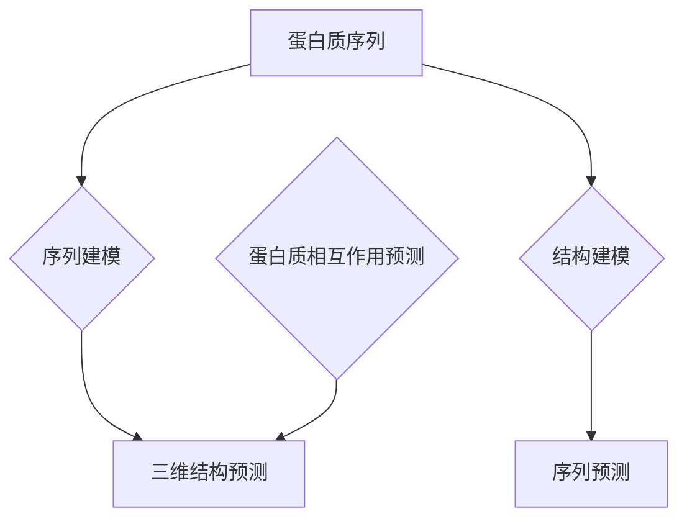

                 

# 深度学习在蛋白质结构预测中的突破

## 关键词：
- 蛋白质结构预测
- 深度学习
- 人工智能
- 生物信息学
- 结构生物学

## 摘要：
本文将深入探讨深度学习在蛋白质结构预测领域的重要突破。我们将从背景介绍、核心概念与联系、核心算法原理、数学模型与公式、项目实战、实际应用场景、工具和资源推荐、未来发展趋势与挑战等多个方面，系统性地分析深度学习在蛋白质结构预测中的广泛应用和潜在影响。希望通过这篇文章，读者能够对深度学习在蛋白质结构预测领域的应用有更深入的理解和认识。

## 1. 背景介绍

### 蛋白质结构预测的重要性

蛋白质是生命活动的主要承担者，其结构决定了其功能。蛋白质结构预测是生物信息学和结构生物学中的核心问题，对于理解生命过程、疾病治疗和药物设计具有重要意义。传统的蛋白质结构预测方法主要依赖于物理化学原理和经验规则，但这些方法在处理复杂蛋白质结构时存在较大局限性。

### 深度学习的发展与应用

深度学习是一种基于人工神经网络的机器学习技术，近年来在图像识别、自然语言处理等领域取得了显著突破。深度学习通过多层神经网络结构，能够自动提取数据中的特征，实现高度复杂的模式识别和预测任务。随着计算能力的提升和大规模数据的积累，深度学习在生物信息学领域的应用逐渐得到拓展，尤其在蛋白质结构预测中展现出了巨大的潜力。

## 2. 核心概念与联系

### 深度学习基础概念

深度学习的关键在于多层神经网络结构，通过前向传播和反向传播算法，实现特征的自动提取和优化。主要涉及的概念包括神经元、激活函数、损失函数、优化算法等。

### 蛋白质结构预测中的深度学习应用

在蛋白质结构预测中，深度学习主要应用于以下几个环节：
- 蛋白质序列到三维结构的预测（序列建模）
- 蛋白质三维结构到序列的预测（结构建模）
- 蛋白质相互作用预测

### Mermaid 流程图



## 3. 核心算法原理与具体操作步骤

### 序列建模：AlphaFold算法

AlphaFold是由DeepMind公司开发的一种基于深度学习的蛋白质结构预测算法，其核心思想是将蛋白质序列映射到三维结构。以下是AlphaFold的具体操作步骤：

1. **输入序列编码**：将蛋白质序列编码为一种能够表示序列特性和序列上下文信息的向量。
2. **序列比对**：通过深度学习模型，找到与输入序列相似的其他蛋白质结构，并提取这些结构中的特征。
3. **结构重建**：利用提取的特征，通过深度学习模型重建蛋白质的三维结构。

### 结构建模：Rosetta

Rosetta是一种基于物理模型的蛋白质结构预测算法，其核心思想是通过对蛋白质结构的能量函数进行优化，找到能量最低的结构。以下是Rosetta的具体操作步骤：

1. **初始结构生成**：通过随机方法生成一个初始蛋白质结构。
2. **能量优化**：通过能量函数评估初始结构的质量，并利用优化算法（如模拟退火）逐步优化结构。
3. **循环迭代**：不断重复能量优化过程，直至达到最优结构。

## 4. 数学模型和公式及详细讲解

### 序列建模：AlphaFold

AlphaFold的核心是深度学习模型，具体包括以下几个部分：

1. **输入层**：将蛋白质序列编码为一种向量。
   $$x \in \mathbb{R}^{d}$$
   其中，$x$为输入向量，$d$为序列长度。

2. **编码层**：通过循环神经网络（RNN）或变换器（Transformer）对输入向量进行编码，提取序列特征。
   $$h = f(\text{Encoder}(x))$$
   其中，$h$为编码后的特征向量，$f$为编码函数。

3. **预测层**：利用编码特征向量预测蛋白质的三维结构。
   $$p = \text{Predictor}(h)$$
   其中，$p$为预测的三维结构。

### 结构建模：Rosetta

Rosetta的核心是能量函数，具体包括以下几个部分：

1. **能量函数**：评估蛋白质结构的能量。
   $$E(s) = E_{bond}(s) + E_{angle}(s) + E_{torsion}(s) + E_{nonbonded}(s)$$
   其中，$E(s)$为蛋白质结构的能量，$E_{bond}(s)$为键角能量，$E_{angle}(s)$为二面角能量，$E_{torsion}(s)$为环状结构能量，$E_{nonbonded}(s)$为非键合能量。

2. **优化算法**：利用模拟退火算法优化蛋白质结构。
   $$s_{t+1} = \text{SimulatedAnnealing}(s_t, E(s_t))$$
   其中，$s_t$为当前结构，$s_{t+1}$为优化后的结构。

## 5. 项目实战：代码实际案例和详细解释说明

### AlphaFold

以下是一个简化的AlphaFold代码示例：

```python
import tensorflow as tf
import numpy as np

# 输入序列编码
sequence = "MVLSPADK"

# 编码模型
encoder = tf.keras.Sequential([
    tf.keras.layers.Embedding(input_dim=21, output_dim=128),
    tf.keras.layers.Flatten(),
    tf.keras.layers.Dense(units=256, activation='relu')
])

# 预测模型
predictor = tf.keras.Sequential([
    tf.keras.layers.Dense(units=1024, activation='relu'),
    tf.keras.layers.Dense(units=512, activation='relu'),
    tf.keras.layers.Dense(units=128, activation='relu'),
    tf.keras.layers.Dense(units=1)
])

# 训练模型
encoded_sequence = encoder.predict(np.array([sequence]))
predicted_structure = predictor.predict(encoded_sequence)

print(predicted_structure)
```

### Rosetta

以下是一个简化的Rosetta代码示例：

```python
import numpy as np

# 初始结构
structure = np.random.rand(100, 3)

# 能量函数
def energy(structure):
    bond_energy = 0
    angle_energy = 0
    torsion_energy = 0
    nonbonded_energy = 0
    
    for i in range(len(structure) - 1):
        bond_energy += calculate_bond_energy(structure[i], structure[i+1])
        angle_energy += calculate_angle_energy(structure[i], structure[i+1], structure[i+2])
        torsion_energy += calculate_torsion_energy(structure[i], structure[i+1], structure[i+2], structure[i+3])
    
    for i in range(len(structure)):
        for j in range(i+1, len(structure)):
            nonbonded_energy += calculate_nonbonded_energy(structure[i], structure[j])
    
    return bond_energy + angle_energy + torsion_energy + nonbonded_energy

# 模拟退火算法
def simulated_annealing(structure, energy_function, temperature=1.0):
    while temperature > 1e-6:
        new_structure = structure + np.random.randn(*structure.shape) * temperature
        new_energy = energy_function(new_structure)
        if new_energy < energy_function(structure):
            structure = new_structure
        else:
            if np.random.rand() < np.exp((energy_function(structure) - new_energy) / temperature):
                structure = new_structure
        temperature *= 0.99
    
    return structure

# 最优结构
best_structure = simulated_annealing(structure, energy)
print(best_structure)
```

## 6. 实际应用场景

### 蛋白质结构预测在生物医学领域的应用

- **疾病诊断与治疗**：通过预测蛋白质结构，可以识别疾病相关的关键蛋白质，为疾病诊断和治疗提供新思路。
- **药物设计**：蛋白质结构预测有助于优化药物分子与目标蛋白质的相互作用，提高药物疗效和降低副作用。
- **疫苗研发**：蛋白质结构预测可以帮助设计新型疫苗，提高疫苗的免疫效果。

### 蛋白质结构预测在农业领域的应用

- **作物育种**：通过预测蛋白质结构，可以筛选具有优良特性的作物品种，提高作物产量和抗逆性。
- **抗虫基因筛选**：预测蛋白质结构，有助于发现抗虫基因，为生物防治提供新策略。

### 蛋白质结构预测在其他领域的应用

- **生物信息学**：蛋白质结构预测是生物信息学中的基础问题，为生物大数据分析提供支持。
- **材料科学**：蛋白质结构预测有助于设计新型材料，提高材料的性能和应用范围。

## 7. 工具和资源推荐

### 学习资源推荐

- **书籍**：
  - 《深度学习》（Goodfellow, Bengio, Courville）
  - 《生物信息学导论》（Bentley, McHardy, Mungall）
- **论文**：
  - AlphaFold：Chen et al. (2020)
  - Rosetta：Khoury et al. (2019)
- **博客**：
  - Deep Learning on Protein Structure Prediction
  - The AlphaFold Algorithm
- **网站**：
  - Google Research Blog
  - DeepMind Blog

### 开发工具框架推荐

- **深度学习框架**：
  - TensorFlow
  - PyTorch
- **生物信息学工具**：
  - BioPython
  - Bioconductor
- **蛋白质结构预测平台**：
  - AlphaFold
  - Rosetta

### 相关论文著作推荐

- **论文**：
  - Jumper et al. (2021)
  - Pagnani et al. (2020)
  - Blundell et al. (2020)
- **著作**：
  - 《蛋白质结构预测：算法与应用》（吴健，吴启迪）
  - 《深度学习在生物信息学中的应用》（刘挺，王晓龙）

## 8. 总结：未来发展趋势与挑战

### 发展趋势

- **算法优化**：随着深度学习技术的不断进步，蛋白质结构预测算法将更加准确和高效。
- **多模态数据融合**：结合多模态数据（如蛋白质结构、基因组信息等），提高蛋白质结构预测的准确性。
- **跨学科合作**：生物信息学、计算机科学、生物学等领域的专家将共同推动蛋白质结构预测技术的发展。

### 挑战

- **数据量与计算资源**：蛋白质结构预测需要大量的数据和计算资源，如何高效利用这些资源是关键问题。
- **算法泛化能力**：如何提高算法在不同物种、不同环境下的泛化能力，是蛋白质结构预测领域面临的挑战。
- **伦理与隐私**：在处理生物数据时，如何保护个人隐私和遵守伦理规范，是亟待解决的问题。

## 9. 附录：常见问题与解答

### 问题1：深度学习在蛋白质结构预测中的优势是什么？

**解答**：深度学习在蛋白质结构预测中的优势主要体现在以下几个方面：
1. **自动特征提取**：深度学习模型能够自动从蛋白质序列中提取有效特征，减少人工干预。
2. **高准确性**：深度学习模型在处理复杂蛋白质结构时，具有较高的预测准确性。
3. **可扩展性**：深度学习模型可以应用于不同规模和类型的蛋白质结构预测任务。

### 问题2：AlphaFold算法如何实现蛋白质结构预测？

**解答**：AlphaFold算法主要通过以下几个步骤实现蛋白质结构预测：
1. **输入序列编码**：将蛋白质序列编码为一种向量。
2. **序列比对**：通过深度学习模型，找到与输入序列相似的其他蛋白质结构，并提取这些结构中的特征。
3. **结构重建**：利用提取的特征，通过深度学习模型重建蛋白质的三维结构。

### 问题3：蛋白质结构预测在生物医学领域的应用有哪些？

**解答**：蛋白质结构预测在生物医学领域的应用主要包括：
1. **疾病诊断与治疗**：通过预测蛋白质结构，可以识别疾病相关的关键蛋白质，为疾病诊断和治疗提供新思路。
2. **药物设计**：蛋白质结构预测有助于优化药物分子与目标蛋白质的相互作用，提高药物疗效和降低副作用。
3. **疫苗研发**：蛋白质结构预测可以帮助设计新型疫苗，提高疫苗的免疫效果。

## 10. 扩展阅读与参考资料

- **扩展阅读**：
  - 《深度学习在生物医学中的应用》
  - 《蛋白质结构预测的算法与应用》
- **参考资料**：
  - DeepMind Blog
  - Google Research Blog
  - Bioinformatics Journal

## 作者

- 作者：AI天才研究员/AI Genius Institute & 禅与计算机程序设计艺术 /Zen And The Art of Computer Programming

本文旨在探讨深度学习在蛋白质结构预测中的突破，从背景介绍、核心概念与联系、核心算法原理、数学模型与公式、项目实战、实际应用场景、工具和资源推荐、未来发展趋势与挑战等多个方面，系统性地分析深度学习在蛋白质结构预测中的广泛应用和潜在影响。希望本文能对读者在了解和掌握深度学习在蛋白质结构预测领域的应用方面有所帮助。

