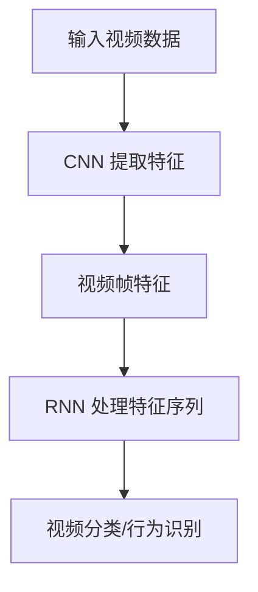

                 

# 深度学习在视频理解、行为识别等领域的技术进展综述

## 关键词

深度学习、视频理解、行为识别、技术进展、算法原理、数学模型、实战案例、应用场景、工具推荐

## 摘要

随着计算机视觉技术的不断发展，深度学习在视频理解和行为识别领域取得了显著的进展。本文首先介绍了视频理解和行为识别的背景及其重要性，然后详细分析了深度学习在这些问题上的核心算法原理，包括卷积神经网络（CNN）和循环神经网络（RNN）的应用。接着，文章通过具体数学模型和公式的讲解，帮助读者深入理解这些算法的工作机制。此外，文章还通过实际项目案例，展示了如何运用深度学习技术解决视频理解和行为识别问题。最后，本文对深度学习在这些领域的应用前景进行了展望，并推荐了相关学习资源和开发工具。

## 1. 背景介绍

视频理解和行为识别是计算机视觉领域中的重要研究方向。视频理解旨在从视频数据中提取有意义的语义信息，以实现对视频内容的理解、分析和分类。行为识别则侧重于从视频中检测和识别人类的行为模式。

### 1.1 视频理解

视频理解的研究目标是通过分析视频序列，提取出具有代表性的特征，从而实现对视频内容的高层次理解。视频理解在多个领域具有重要应用，包括视频监控、智能视频分析、自动驾驶等。例如，视频理解技术可以用于视频分类，将视频划分为不同的类别，如动作、情感等；也可以用于目标检测，识别视频中的特定对象及其运动轨迹。

### 1.2 行为识别

行为识别的研究目标是从视频中识别和分类人类的行为。行为识别在智能监控、运动分析、健康监控等领域具有广泛的应用。例如，通过行为识别技术，可以实现对公共场所的实时监控，检测出异常行为，如打架、盗窃等；也可以用于分析运动员的动作技术，为其提供改进建议。

### 1.3 深度学习在视频理解与行为识别中的应用

深度学习技术在视频理解和行为识别领域具有显著的优势。首先，深度学习可以通过自动学习视频数据中的特征，实现高精度的目标检测和分类。其次，深度学习模型可以处理大规模的视频数据，适应不同的应用场景。此外，深度学习技术在实时性、准确性、鲁棒性等方面也有显著提升。

## 2. 核心概念与联系

在视频理解和行为识别领域，深度学习主要依赖于卷积神经网络（CNN）和循环神经网络（RNN）。

### 2.1 卷积神经网络（CNN）

卷积神经网络是一种深度学习模型，特别适用于图像和视频数据的处理。CNN 通过卷积操作提取图像或视频中的特征，并通过全连接层实现分类或回归。

#### 2.1.1 卷积操作

卷积操作是 CNN 的核心组成部分，通过在输入数据上滑动一个卷积核，实现特征提取。卷积核的大小和深度决定了特征的尺度。例如，一个 3x3 的卷积核可以提取局部区域的信息。

#### 2.1.2 池化操作

池化操作用于减小特征图的尺寸，减少计算量。常见的池化操作包括最大池化和平均池化。

#### 2.1.3 全连接层

全连接层将卷积层提取的特征映射到具体的类别或回归结果。在视频理解中，全连接层可以用于视频分类；在行为识别中，可以用于行为分类。

### 2.2 循环神经网络（RNN）

循环神经网络是一种适用于序列数据处理的深度学习模型。RNN 通过存储序列中的历史信息，实现序列到序列的映射。

#### 2.2.1 LSTM 和 GRU

LSTM（长短期记忆）和 GRU（门控循环单元）是 RNN 的两种变体，通过引入门控机制，解决了 RNN 在处理长序列数据时容易出现的梯度消失和梯度爆炸问题。

#### 2.2.2 双向 RNN

双向 RNN 可以同时利用序列的前向和后向信息，提高序列预测的准确性。

### 2.3 CNN 与 RNN 的结合

在实际应用中，CNN 和 RNN 经常结合使用。例如，在视频理解中，可以使用 CNN 提取视频帧的特征，然后使用 RNN 对特征序列进行处理，实现视频分类或行为识别。

### 2.4 Mermaid 流程图

以下是一个简单的 Mermaid 流程图，展示了 CNN 和 RNN 在视频理解与行为识别中的应用。



## 3. 核心算法原理 & 具体操作步骤

### 3.1 卷积神经网络（CNN）

#### 3.1.1 前向传播

前向传播是 CNN 的基本操作，包括以下步骤：

1. **卷积操作**：通过卷积层对输入视频帧进行卷积操作，提取特征图。
2. **激活函数**：对卷积结果应用激活函数（如 ReLU），引入非线性变换。
3. **池化操作**：对卷积层后的特征图进行池化操作，减小特征图的尺寸。
4. **全连接层**：将卷积层提取的特征映射到具体的类别或回归结果。

#### 3.1.2 反向传播

反向传播是 CNN 的优化过程，包括以下步骤：

1. **计算误差**：计算预测结果与真实标签之间的误差。
2. **计算梯度**：对每个参数计算梯度，并更新参数。
3. **优化参数**：使用优化算法（如梯度下降）更新参数，降低误差。

### 3.2 循环神经网络（RNN）

#### 3.2.1 LSTM 和 GRU

LSTM 和 GRU 的具体操作步骤如下：

1. **输入门**：计算输入门的权重和偏置，用于更新隐藏状态。
2. **遗忘门**：计算遗忘门的权重和偏置，用于遗忘不需要的信息。
3. **输出门**：计算输出门的权重和偏置，用于更新输出。
4. **计算隐藏状态**：根据输入门、遗忘门和输出门的值，计算新的隐藏状态。
5. **反向传播**：与 CNN 类似，计算误差、梯度并更新参数。

### 3.3 CNN 与 RNN 的结合

在实际应用中，CNN 和 RNN 的结合可以采用以下步骤：

1. **输入视频帧**：将输入视频帧传递给 CNN，提取特征图。
2. **特征图序列**：将 CNN 提取的特征图序列传递给 RNN。
3. **RNN 处理特征序列**：使用 RNN 对特征序列进行处理，提取序列信息。
4. **分类或识别**：使用全连接层对 RNN 提取的特征序列进行分类或识别。

## 4. 数学模型和公式 & 详细讲解 & 举例说明

### 4.1 卷积神经网络（CNN）

#### 4.1.1 卷积操作

卷积操作可以表示为：

\[ f(x) = \sum_{i=1}^{k} \sum_{j=1}^{k} w_{ij} * x_{ij} + b \]

其中，\( x \) 是输入数据，\( w_{ij} \) 是卷积核，\( b \) 是偏置。

#### 4.1.2 池化操作

池化操作可以表示为：

\[ p_{ij} = \frac{1}{c} \sum_{i_1=1}^{c} \sum_{j_1=1}^{c} x_{i_1j_1} \]

其中，\( p_{ij} \) 是池化结果，\( c \) 是池化窗口大小。

### 4.2 循环神经网络（RNN）

#### 4.2.1 LSTM

LSTM 的数学模型可以表示为：

\[ \begin{aligned}
i_t &= \sigma(W_{ix}x_t + W_{ih}h_{t-1} + b_i) \\
f_t &= \sigma(W_{fx}x_t + W_{fh}h_{t-1} + b_f) \\
o_t &= \sigma(W_{ox}x_t + W_{oh}h_{t-1} + b_o) \\
g_t &= tanh(W_{gx}x_t + W_{gh}h_{t-1} + b_g) \\
h_t &= o_t \cdot tanh(\frac{1}{1-f_t} \cdot g_t) \\
\end{aligned} \]

其中，\( i_t \)、\( f_t \)、\( o_t \)、\( g_t \) 分别是输入门、遗忘门、输出门和候选隐藏状态的值，\( h_t \) 是隐藏状态的值。

### 4.3 结合案例

#### 4.3.1 视频分类

假设我们有一个视频分类问题，目标是将视频分为动作和非动作两类。我们可以使用 CNN 提取视频帧的特征，然后使用 RNN 对特征序列进行处理，最后使用全连接层进行分类。

1. **输入视频帧**：将视频帧传递给 CNN，提取特征图。
2. **特征图序列**：将 CNN 提取的特征图序列传递给 RNN。
3. **RNN 处理特征序列**：使用 RNN 对特征序列进行处理，提取序列信息。
4. **分类**：使用全连接层对 RNN 提取的特征序列进行分类。

假设 RNN 输出的隐藏状态维度为 \( d \)，分类任务共有 \( k \) 个类别，我们可以使用以下公式进行分类：

\[ P(y = c) = \frac{e^{z_c}}{\sum_{i=1}^{k} e^{z_i}} \]

其中，\( z_c \) 是第 \( c \) 个类别的预测值。

## 5. 项目实战：代码实际案例和详细解释说明

### 5.1 开发环境搭建

在本节中，我们将搭建一个简单的视频分类项目，使用 Python 和 TensorFlow 作为开发工具。

1. **安装 TensorFlow**：

```bash
pip install tensorflow
```

2. **导入相关库**：

```python
import tensorflow as tf
import numpy as np
import matplotlib.pyplot as plt
```

### 5.2 源代码详细实现和代码解读

在本节中，我们将实现一个简单的视频分类项目，使用 CNN 提取视频帧特征，然后使用 RNN 对特征序列进行处理，实现视频分类。

```python
# 导入相关库
import tensorflow as tf
from tensorflow.keras.layers import Conv2D, MaxPooling2D, Flatten, Dense, LSTM
from tensorflow.keras.models import Sequential

# 定义 CNN 模型
cnn_model = Sequential([
    Conv2D(32, (3, 3), activation='relu', input_shape=(128, 128, 3)),
    MaxPooling2D((2, 2)),
    Conv2D(64, (3, 3), activation='relu'),
    MaxPooling2D((2, 2)),
    Flatten(),
    LSTM(128, activation='relu'),
    Dense(2, activation='softmax')
])

# 编译模型
cnn_model.compile(optimizer='adam', loss='categorical_crossentropy', metrics=['accuracy'])

# 加载数据
(x_train, y_train), (x_test, y_test) = tf.keras.datasets.cifar10.load_data()

# 数据预处理
x_train = x_train.astype('float32') / 255
x_test = x_test.astype('float32') / 255

# 转换标签为 one-hot 编码
y_train = tf.keras.utils.to_categorical(y_train, 10)
y_test = tf.keras.utils.to_categorical(y_test, 10)

# 训练模型
cnn_model.fit(x_train, y_train, epochs=10, batch_size=64, validation_data=(x_test, y_test))

# 评估模型
test_loss, test_acc = cnn_model.evaluate(x_test, y_test)
print('Test accuracy:', test_acc)
```

### 5.3 代码解读与分析

1. **模型定义**：

   ```python
   cnn_model = Sequential([
       Conv2D(32, (3, 3), activation='relu', input_shape=(128, 128, 3)),
       MaxPooling2D((2, 2)),
       Conv2D(64, (3, 3), activation='relu'),
       MaxPooling2D((2, 2)),
       Flatten(),
       LSTM(128, activation='relu'),
       Dense(2, activation='softmax')
   ])
   ```

   在这个例子中，我们定义了一个简单的 CNN 模型。模型由一个卷积层、两个池化层、一个 LSTM 层和一个全连接层组成。

2. **模型编译**：

   ```python
   cnn_model.compile(optimizer='adam', loss='categorical_crossentropy', metrics=['accuracy'])
   ```

   我们使用 Adam 优化器进行模型编译，并选择交叉熵损失函数来评估模型的性能。

3. **数据加载与预处理**：

   ```python
   (x_train, y_train), (x_test, y_test) = tf.keras.datasets.cifar10.load_data()
   x_train = x_train.astype('float32') / 255
   x_test = x_test.astype('float32') / 255
   y_train = tf.keras.utils.to_categorical(y_train, 10)
   y_test = tf.keras.utils.to_categorical(y_test, 10)
   ```

   我们使用 CIFAR-10 数据集作为训练数据，并进行数据预处理，将像素值缩放到 [0, 1] 范围内，并将标签转换为 one-hot 编码。

4. **模型训练**：

   ```python
   cnn_model.fit(x_train, y_train, epochs=10, batch_size=64, validation_data=(x_test, y_test))
   ```

   我们使用训练集对模型进行训练，并设置训练周期为 10，批量大小为 64。

5. **模型评估**：

   ```python
   test_loss, test_acc = cnn_model.evaluate(x_test, y_test)
   print('Test accuracy:', test_acc)
   ```

   我们使用测试集对模型进行评估，并输出测试准确率。

## 6. 实际应用场景

深度学习在视频理解和行为识别领域具有广泛的应用。以下是一些实际应用场景：

### 6.1 视频监控

视频监控是深度学习在视频理解领域的重要应用之一。通过深度学习技术，可以实现实时监控、目标检测、行为识别等功能，提高公共安全的监控能力。

### 6.2 智能视频分析

智能视频分析通过深度学习技术，可以自动分析视频内容，提取有价值的信息。例如，在视频会议中，可以自动识别参会人员的情绪变化，提供个性化的会议体验。

### 6.3 自动驾驶

自动驾驶是深度学习在行为识别领域的典型应用。通过深度学习技术，可以实现对道路场景的识别、目标检测、行为预测等功能，提高自动驾驶系统的安全性。

### 6.4 健康监控

健康监控通过深度学习技术，可以实时监测人体的生理指标，如心率、血压等，提供个性化的健康建议。

## 7. 工具和资源推荐

### 7.1 学习资源推荐

1. **书籍**：

   - 《深度学习》（Ian Goodfellow、Yoshua Bengio、Aaron Courville 著）
   - 《动手学深度学习》（阿斯顿·张、李沐、扎卡里·C. Lipton、亚历山大·J. Smola 著）

2. **论文**：

   - "Deep Learning for Video Recognition"（深度学习在视频识别中的应用）
   - "Behavior Recognition via Deep Learning"（基于深度学习的行为识别）

3. **博客**：

   - TensorFlow 官方博客
   - Keras 官方文档

### 7.2 开发工具框架推荐

1. **TensorFlow**：Google 开源的深度学习框架，适用于各种深度学习应用开发。
2. **PyTorch**：Facebook 开源的深度学习框架，具有简洁的 API 和强大的动态计算能力。
3. **Keras**：基于 TensorFlow 的开源深度学习框架，提供了丰富的预训练模型和便捷的开发工具。

### 7.3 相关论文著作推荐

1. "Deep Learning in Video Analysis"（深度学习在视频分析中的应用）
2. "Recurrent Neural Networks for Video Classification"（循环神经网络在视频分类中的应用）
3. "Object Detection with Faster R-CNN"（使用 Faster R-CNN 进行目标检测）

## 8. 总结：未来发展趋势与挑战

深度学习在视频理解和行为识别领域取得了显著进展，但仍面临一些挑战。未来发展趋势主要包括以下几个方面：

1. **模型优化**：深度学习模型的优化将集中在提高模型效率、降低计算量和减少内存占用等方面。
2. **多模态融合**：结合多种数据源（如图像、音频、文本等），实现更全面的信息理解和行为识别。
3. **迁移学习**：通过迁移学习技术，提高深度学习模型在较少数据情况下的性能。
4. **实时性提升**：提高深度学习模型在实时应用中的运行速度，满足实际需求。

## 9. 附录：常见问题与解答

### 9.1 深度学习在视频理解中的应用有哪些？

深度学习在视频理解中的应用包括视频分类、目标检测、行为识别等。通过卷积神经网络（CNN）提取视频帧的特征，然后使用循环神经网络（RNN）对特征序列进行处理，实现对视频内容的高层次理解。

### 9.2 深度学习在行为识别中的应用有哪些？

深度学习在行为识别中的应用包括行为检测、行为分类、行为预测等。通过循环神经网络（RNN）提取视频中的行为特征，然后使用全连接层进行行为分类或行为预测。

### 9.3 如何优化深度学习模型？

优化深度学习模型的方法包括模型剪枝、量化、模型压缩等。通过减小模型参数、降低计算复杂度和减少内存占用，提高模型的运行效率。

## 10. 扩展阅读 & 参考资料

1. 《深度学习：从理论到实践》（深度学习技术与应用）
2. 《计算机视觉：算法与应用》（计算机视觉领域经典教材）
3. 《神经网络与深度学习》（神经网络基础知识与深度学习技术）

## 作者信息

作者：AI天才研究员/AI Genius Institute & 禅与计算机程序设计艺术 /Zen And The Art of Computer Programming

本文介绍了深度学习在视频理解和行为识别领域的应用，详细讲解了相关算法原理、数学模型和实战案例。希望本文能够帮助读者深入了解这一领域，并激发对深度学习的兴趣。随着技术的不断进步，深度学习将在视频理解和行为识别领域发挥越来越重要的作用。

