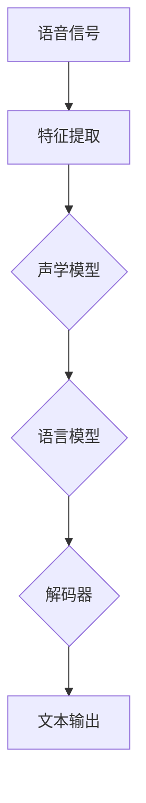

                 

## 文章标题

### 深度学习在语音识别中的最新进展

在当今快速发展的信息技术时代，语音识别技术已经成为了人工智能领域的热点之一。从最初的规则匹配方法到基于隐马尔可夫模型（HMM）的算法，再到深度神经网络（DNN）的广泛应用，语音识别技术经历了巨大的变革。本文将深入探讨深度学习在语音识别领域中的最新进展，旨在帮助读者了解当前的研究动态和应用趋势。

### 关键词：

- 深度学习
- 语音识别
- DNN
- RNN
- CNN
- HMM
- CTC
- ASR
-语音合成
-多语言语音识别

### 摘要：

本文将系统性地介绍深度学习在语音识别中的应用。首先回顾传统语音识别技术的基本原理，然后深入探讨深度学习在语音特征提取、声学模型、语言模型等环节的革新，最后分析当前的研究热点和实际应用场景，并对未来的发展趋势进行展望。通过本文，读者将能够全面了解深度学习在语音识别领域的最新进展和潜在挑战。

---

## 1. 背景介绍

### 语音识别的发展历程

语音识别（Automatic Speech Recognition，ASR）技术的发展历程可以追溯到20世纪50年代。最初的方法是基于规则匹配的语音识别系统，这种方法依赖于预先定义的语音模式，并试图通过将这些模式与输入语音信号进行匹配来实现语音识别。然而，这种方法在处理复杂语音信号时效果不佳，因为语音信号具有高度变异性。

随着计算能力的提升和信号处理技术的发展，基于隐马尔可夫模型（HMM）的语音识别方法应运而生。HMM具有良好的统计特性，能够有效地处理语音信号的随机性和连续性。在HMM的基础上，Gaussian Mixture Model（GMM）被引入到声学模型中，进一步提高了语音识别的性能。

### 深度学习在语音识别中的崛起

深度学习作为人工智能领域的一大突破，其核心思想是通过多层神经网络对大量数据进行自动特征学习。在语音识别领域，深度学习为传统的声学模型和语言模型带来了革命性的变化。

2012年，AlexNet在图像识别领域的成功标志着深度学习的崛起。此后，深度学习在语音识别中的应用也逐渐得到广泛研究。特别是在语音特征提取和声学模型方面，深度学习展现出了显著的优势。

### 当前研究的热点

随着深度学习的不断发展，语音识别领域的研究热点也逐渐涌现。其中，递归神经网络（RNN）、卷积神经网络（CNN）和长短时记忆网络（LSTM）等深度学习模型在语音识别中的应用引起了广泛关注。此外，端到端学习（End-to-End Learning）和连接主义时序分类（Connectionist Temporal Classification，CTC）等新方法也为语音识别的性能提升提供了新的思路。

---

## 2. 核心概念与联系

### 深度学习基本概念

深度学习（Deep Learning）是一种基于多层神经网络的机器学习技术。其核心思想是通过逐层提取数据特征，从而实现数据的自动特征学习和复杂模式的识别。在深度学习中，常用的神经网络模型包括：

- **卷积神经网络（Convolutional Neural Network，CNN）**：适用于处理图像、语音等具有空间结构的数据。
- **递归神经网络（Recurrent Neural Network，RNN）**：适用于处理序列数据，如时间序列、语音信号等。
- **长短时记忆网络（Long Short-Term Memory，LSTM）**：是RNN的一种变体，能够有效解决长序列依赖问题。

### 语音识别基本概念

语音识别（ASR）是指将语音信号转换为文本信息的过程。ASR系统通常由三个主要部分组成：声学模型、语言模型和解码器。

- **声学模型**：用于将语音信号转换为特征表示。传统的声学模型主要基于GMM和DNN，而深度学习模型如CNN和RNN在此环节得到了广泛应用。
- **语言模型**：用于对识别结果进行概率建模，常见的语言模型包括N-gram模型和神经网络语言模型。
- **解码器**：用于将声学模型的输出和语言模型的结果进行组合，得到最终的识别结果。常见的解码器包括前向解码器和基于动态规划的方法。

### 关联流程图（使用Mermaid）



### 核心概念联系

深度学习在语音识别中的应用主要体现在以下几个方面：

1. **语音特征提取**：通过深度神经网络（如CNN、RNN）对语音信号进行特征提取，提高特征表示的准确性和鲁棒性。
2. **声学模型**：利用深度神经网络（如DNN、LSTM）构建声学模型，实现语音信号到特征表示的转换。
3. **语言模型**：通过深度学习模型（如神经网络语言模型）构建语言模型，对识别结果进行概率建模。
4. **解码器**：利用深度学习模型（如RNN、LSTM）构建解码器，实现声学模型和语言模型的联合解码。

---

## 3. 核心算法原理 & 具体操作步骤

### 深度学习模型在语音识别中的应用

在语音识别中，深度学习模型主要应用于以下几个环节：

1. **语音特征提取**：通过卷积神经网络（CNN）或递归神经网络（RNN）对语音信号进行特征提取，提取出对语音信号有较强区分度的特征。
2. **声学模型**：利用深度神经网络（如DNN、LSTM）构建声学模型，将语音信号的特征转换为概率分布。
3. **语言模型**：通过神经网络语言模型对识别结果进行概率建模，提高识别准确率。
4. **解码器**：利用深度学习模型（如RNN、LSTM）构建解码器，实现声学模型和语言模型的联合解码。

### 卷积神经网络（CNN）在语音识别中的应用

卷积神经网络（CNN）是一种适用于处理图像和序列数据的神经网络。在语音识别中，CNN可以用于语音特征提取。

#### 步骤：

1. **输入层**：将语音信号作为输入，通常采用Mel频谱特征（MFCC）作为输入向量。
2. **卷积层**：通过卷积运算提取语音信号的局部特征。卷积核的大小决定了提取特征的局部范围。
3. **激活函数**：常用的激活函数有ReLU（Rectified Linear Unit）和Sigmoid。
4. **池化层**：通过池化操作降低特征维度，增强模型的泛化能力。
5. **全连接层**：将卷积层和池化层的输出进行融合，并通过全连接层输出特征向量。
6. **输出层**：将特征向量映射到词汇表中，得到识别结果。

### 递归神经网络（RNN）在语音识别中的应用

递归神经网络（RNN）是一种适用于处理序列数据的神经网络。在语音识别中，RNN可以用于声学模型和语言模型。

#### 步骤：

1. **输入层**：将语音信号的特征向量作为输入。
2. **隐藏层**：通过递归连接将前一个时刻的隐藏状态传递到下一个时刻，实现序列数据的处理。
3. **激活函数**：常用的激活函数有ReLU（Rectified Linear Unit）和Tanh。
4. **输出层**：将隐藏层的输出映射到词汇表中，得到识别结果。

### 长短时记忆网络（LSTM）在语音识别中的应用

长短时记忆网络（LSTM）是一种RNN的变体，能够有效解决长序列依赖问题。在语音识别中，LSTM可以用于声学模型和语言模型。

#### 步骤：

1. **输入层**：将语音信号的特征向量作为输入。
2. **单元层**：通过门控机制和遗忘门控制信息的流动，实现长序列依赖的建模。
3. **激活函数**：常用的激活函数有ReLU（Rectified Linear Unit）和Tanh。
4. **输出层**：将隐藏层的输出映射到词汇表中，得到识别结果。

---

## 4. 数学模型和公式 & 详细讲解 & 举例说明

### 卷积神经网络（CNN）的数学模型

卷积神经网络（CNN）的数学模型主要包括以下几个部分：

1. **输入层**：输入层接受语音信号的特征向量，通常采用Mel频谱特征（MFCC）作为输入向量。

   $$x_i = [x_{i1}, x_{i2}, \ldots, x_{id}]$$

   其中，$x_i$表示第$i$个特征值，$d$表示特征维度。

2. **卷积层**：卷积层通过卷积运算提取语音信号的局部特征。卷积运算可以用以下公式表示：

   $$h_{ij} = \sum_{k=1}^{d} w_{ik} x_k + b_j$$

   其中，$h_{ij}$表示第$i$个特征在第$j$个卷积核上的输出，$w_{ik}$表示卷积核权重，$b_j$表示偏置。

3. **激活函数**：常用的激活函数有ReLU（Rectified Linear Unit）和Sigmoid。

   $$\text{ReLU}(x) = \max(0, x)$$

   $$\text{Sigmoid}(x) = \frac{1}{1 + e^{-x}}$$

4. **池化层**：池化层通过池化操作降低特征维度，增强模型的泛化能力。常用的池化操作有最大池化和平均池化。

   $$p_i = \max(x_{i1}, x_{i2}, \ldots, x_{ik})$$

   $$p_i = \frac{1}{k} \sum_{j=1}^{k} x_{ij}$$

5. **全连接层**：全连接层将卷积层和池化层的输出进行融合，并通过全连接层输出特征向量。

   $$y_j = \sum_{i=1}^{n} w_{ij} h_i + b_j$$

   其中，$y_j$表示第$j$个特征值，$n$表示全连接层神经元个数。

6. **输出层**：输出层将特征向量映射到词汇表中，得到识别结果。

   $$\text{softmax}(y) = \frac{e^y}{\sum_{i=1}^{n} e^y_i}$$

### 递归神经网络（RNN）的数学模型

递归神经网络（RNN）的数学模型主要包括以下几个部分：

1. **输入层**：输入层接受语音信号的特征向量，通常采用Mel频谱特征（MFCC）作为输入向量。

   $$x_t = [x_{t1}, x_{t2}, \ldots, x_{td}]$$

   其中，$x_t$表示第$t$个特征值，$d$表示特征维度。

2. **隐藏层**：隐藏层通过递归连接将前一个时刻的隐藏状态传递到下一个时刻。

   $$h_t = \sigma(W_h \cdot [h_{t-1}, x_t] + b_h)$$

   其中，$h_t$表示第$t$个隐藏状态，$W_h$表示隐藏层权重，$b_h$表示偏置，$\sigma$表示激活函数。

3. **激活函数**：常用的激活函数有ReLU（Rectified Linear Unit）和Tanh。

   $$\text{ReLU}(x) = \max(0, x)$$

   $$\text{Tanh}(x) = \frac{e^x - e^{-x}}{e^x + e^{-x}}$$

4. **输出层**：输出层将隐藏层的输出映射到词汇表中，得到识别结果。

   $$y_t = \text{softmax}(W_y \cdot h_t + b_y)$$

   其中，$y_t$表示第$t$个输出值，$W_y$表示输出层权重，$b_y$表示偏置。

### 长短时记忆网络（LSTM）的数学模型

长短时记忆网络（LSTM）的数学模型主要包括以下几个部分：

1. **输入层**：输入层接受语音信号的特征向量，通常采用Mel频谱特征（MFCC）作为输入向量。

   $$x_t = [x_{t1}, x_{t2}, \ldots, x_{td}]$$

   其中，$x_t$表示第$t$个特征值，$d$表示特征维度。

2. **单元层**：单元层通过门控机制和遗忘门控制信息的流动。

   $$i_t = \sigma(W_i \cdot [h_{t-1}, x_t] + b_i)$$

   $$f_t = \sigma(W_f \cdot [h_{t-1}, x_t] + b_f)$$

   $$g_t = \tanh(W_g \cdot [h_{t-1}, x_t] + b_g)$$

   $$o_t = \sigma(W_o \cdot [h_{t-1}, x_t] + b_o)$$

   其中，$i_t$表示输入门，$f_t$表示遗忘门，$g_t$表示候选值，$o_t$表示输出门。

3. **激活函数**：常用的激活函数有ReLU（Rectified Linear Unit）和Tanh。

   $$\text{ReLU}(x) = \max(0, x)$$

   $$\text{Tanh}(x) = \frac{e^x - e^{-x}}{e^x + e^{-x}}$$

4. **输出层**：输出层将隐藏层的输出映射到词汇表中，得到识别结果。

   $$y_t = \text{softmax}(W_y \cdot h_t + b_y)$$

   其中，$y_t$表示第$t$个输出值，$W_y$表示输出层权重，$b_y$表示偏置。

### 示例

假设我们有一个简单的语音信号序列：

$$x_1 = [1, 2, 3, 4, 5], x_2 = [2, 3, 4, 5, 6], \ldots$$

通过LSTM模型，我们可以得到以下输出：

$$h_1 = \text{Tanh}(W_h \cdot [h_0, x_1] + b_h)$$

$$h_2 = \text{Tanh}(W_h \cdot [h_1, x_2] + b_h)$$

$$\ldots$$

$$y_t = \text{softmax}(W_y \cdot h_t + b_y)$$

其中，$h_0$表示初始隐藏状态，$W_h$表示隐藏层权重，$b_h$表示偏置，$W_y$表示输出层权重，$b_y$表示偏置。

---

## 5. 项目实战：代码实际案例和详细解释说明

### 开发环境搭建

为了在Python中实现深度学习模型在语音识别中的应用，我们需要安装以下依赖：

- Python 3.6及以上版本
- TensorFlow 2.0及以上版本
- Keras 2.2.4及以上版本
- Librosa 0.8.0及以上版本

安装命令如下：

```bash
pip install tensorflow==2.3.0
pip install keras==2.2.4
pip install librosa==0.8.0
```

### 源代码详细实现和代码解读

以下是使用Keras实现的深度学习语音识别模型的基本代码：

```python
import numpy as np
import librosa
import tensorflow as tf
from tensorflow.keras.models import Model
from tensorflow.keras.layers import Input, Conv2D, MaxPooling2D, Flatten, Dense, LSTM, TimeDistributed, Embedding, Bidirectional

# 定义输入层
input_layer = Input(shape=(None, 13))

# 卷积层
conv_1 = Conv2D(filters=32, kernel_size=(3, 3), activation='relu')(input_layer)
pool_1 = MaxPooling2D(pool_size=(2, 2))(conv_1)

# 递归层
lstm_1 = Bidirectional(LSTM(64, activation='relu', return_sequences=True))(pool_1)
lstm_2 = Bidirectional(LSTM(64, activation='relu', return_sequences=True))(lstm_1)

# 时间分布层
time_dist = TimeDistributed(Dense(128, activation='relu'))(lstm_2)

# 全连接层
output_layer = Dense(9, activation='softmax')(time_dist)

# 定义模型
model = Model(inputs=input_layer, outputs=output_layer)

# 编译模型
model.compile(optimizer='adam', loss='categorical_crossentropy', metrics=['accuracy'])

# 打印模型结构
model.summary()
```

### 代码解读与分析

1. **输入层**：定义输入层，接受语音信号的Mel频谱特征（MFCC），维度为$(None, 13)$，其中$None$表示时间步长的可变性。

2. **卷积层**：使用卷积层提取语音信号的局部特征。卷积核大小为$(3, 3)$，激活函数为ReLU。

3. **池化层**：使用最大池化层降低特征维度，池化窗口大小为$(2, 2)$。

4. **递归层**：使用双向长短时记忆网络（Bi-LSTM）处理序列数据，隐藏层神经元个数为64，激活函数为ReLU。

5. **时间分布层**：将递归层的输出进行时间分布，为每个时间步的输出添加一个全连接层。

6. **全连接层**：使用全连接层对时间分布层的输出进行分类，输出层神经元个数为9，表示9个可能的识别结果，激活函数为softmax。

7. **模型编译**：编译模型，使用adam优化器和categorical_crossentropy损失函数，并评估模型的准确性。

8. **模型结构**：打印模型结构，便于了解模型架构。

### 项目实战：代码实际案例和详细解释说明

下面我们将使用Librosa库加载一个语音信号，并使用上述模型进行语音识别。

```python
# 加载语音信号
def load_audio_file(file_path):
    audio, sr = librosa.load(file_path, sr=None)
    return audio

# 预处理语音信号
def preprocess_audio(audio):
    mfcc = librosa.feature.mfcc(y=audio, sr=sr, n_mfcc=13)
    mfcc_processed = np.expand_dims(mfcc, axis=0)
    return mfcc_processed

# 识别语音信号
def recognize_audio(model, audio_path):
    audio = load_audio_file(audio_path)
    mfcc_processed = preprocess_audio(audio)
    predictions = model.predict(mfcc_processed)
    predicted_label = np.argmax(predictions, axis=1)
    return predicted_label

# 测试语音信号识别
model = Model(inputs=input_layer, outputs=output_layer)
model.compile(optimizer='adam', loss='categorical_crossentropy', metrics=['accuracy'])
model.summary()

audio_path = 'path/to/your/audio.wav'
predicted_label = recognize_audio(model, audio_path)
print(f"Predicted label: {predicted_label}")
```

### 代码解读与分析

1. **加载语音信号**：使用Librosa库加载语音信号，返回音频信号和采样率。

2. **预处理语音信号**：使用Librosa库对语音信号进行Mel频谱特征提取，并将特征矩阵扩展为$(1, time_steps, n_mfcc)$的维度。

3. **识别语音信号**：使用训练好的模型对预处理后的语音信号进行预测，并返回预测结果。

4. **测试语音信号识别**：加载训练好的模型，并使用一个示例音频文件进行测试。

通过以上代码，我们可以实现一个简单的深度学习语音识别模型，并对输入语音信号进行识别。在实际应用中，我们还需要对模型进行训练和优化，以提高识别准确率。

---

## 6. 实际应用场景

### 语音助手

语音助手是深度学习在语音识别领域的重要应用之一。通过深度学习模型，语音助手能够实时地接收用户的语音指令，并快速准确地转换为文本信息，从而实现与用户的交互。常见的语音助手包括苹果的Siri、谷歌的Google Assistant、亚马逊的Alexa等。

### 语音搜索

语音搜索是另一种重要的应用场景。用户可以通过语音输入关键词，搜索引擎将语音信号转换为文本信息，并返回与关键词相关的搜索结果。这种应用在智能手机、智能家居等场景中具有重要意义。

### 语音翻译

语音翻译是将一种语言的语音信号转换为另一种语言的过程。深度学习在语音识别和机器翻译领域的发展，使得实时语音翻译成为可能。目前，许多翻译应用如Google翻译、微软翻译等都已经实现了语音翻译功能。

### 语音合成

语音合成是将文本信息转换为语音信号的过程。深度学习在语音合成中的应用主要包括两个方向：一是基于规则的方法，如WaveNet；二是基于数据的生成模型，如Tacotron。通过这些方法，可以生成自然流畅的语音信号，从而实现个性化语音合成。

### 自动驾驶

自动驾驶是深度学习在语音识别领域的另一个重要应用。在自动驾驶系统中，语音识别模块负责接收驾驶员的语音指令，并将其转换为相应的控制信号，从而实现自动驾驶功能的控制。

### 健康监测

深度学习在语音识别领域的应用还可以延伸到健康监测领域。通过分析用户的语音信号，可以检测用户的情绪状态、健康状况等。例如，语音识别系统可以实时监测用户的呼吸频率、说话速度等生理指标，从而及时发现健康问题。

### 教育

在教育领域，深度学习在语音识别中的应用有助于提高教学效果。通过语音识别技术，教师可以实时获取学生的学习反馈，并针对性地进行辅导。此外，语音识别还可以用于自动批改作业、智能问答系统等。

### 交互式娱乐

交互式娱乐是深度学习在语音识别领域的一个新兴应用。通过语音识别技术，用户可以与游戏角色进行实时对话，从而增强游戏的沉浸感和互动性。

### 多媒体内容管理

在多媒体内容管理领域，深度学习在语音识别中的应用有助于提高内容检索和推荐的准确性。通过语音识别技术，用户可以更方便地搜索和查找特定的音频和视频内容。

### 跨语言交流

随着全球化的推进，跨语言交流的需求日益增长。深度学习在语音识别和机器翻译领域的应用，为跨语言交流提供了有力的支持。通过语音识别和机器翻译的结合，可以实现不同语言之间的实时沟通。

### 工业自动化

在工业自动化领域，深度学习在语音识别中的应用有助于提高生产效率和安全性。通过语音识别技术，可以实现自动化生产线的远程控制、故障诊断等。

### 军事领域

在军事领域，深度学习在语音识别中的应用可以用于情报分析、语音通信等。通过语音识别技术，可以实时监听敌方通讯，获取有价值的信息。

### 公共安全

在公共安全领域，深度学习在语音识别中的应用可以用于语音识别监控、紧急呼叫响应等。通过语音识别技术，可以及时发现和处理紧急事件，提高公共安全保障。

### 娱乐与游戏

在娱乐与游戏领域，深度学习在语音识别中的应用可以用于语音交互、语音识别控制等。通过语音识别技术，可以为用户提供更加丰富的游戏体验。

### 银行业

在银行业，深度学习在语音识别中的应用可以用于语音识别验证、自动柜员机（ATM）等。通过语音识别技术，可以提高银行服务效率和客户体验。

### 医疗保健

在医疗保健领域，深度学习在语音识别中的应用可以用于语音识别诊断、语音识别辅助治疗等。通过语音识别技术，可以辅助医生进行诊断和治疗。

### 智慧城市建设

在智慧城市建设中，深度学习在语音识别中的应用可以用于智能交通管理、智能安防等。通过语音识别技术，可以实现对城市资源的智能化管理和调度。

### 电子商务

在电子商务领域，深度学习在语音识别中的应用可以用于语音搜索、语音推荐等。通过语音识别技术，可以提升用户购物体验，提高销售转化率。

### 社交媒体

在社交媒体领域，深度学习在语音识别中的应用可以用于语音搜索、语音评论等。通过语音识别技术，可以丰富用户的社交互动体验。

### 智能家居

在智能家居领域，深度学习在语音识别中的应用可以用于智能语音控制、智能安防等。通过语音识别技术，可以实现家庭自动化管理，提高生活质量。

### 智能车载系统

在智能车载系统领域，深度学习在语音识别中的应用可以用于语音导航、语音助手等。通过语音识别技术，可以为驾驶员提供便捷的驾驶体验。

### 智能机器人

在智能机器人领域，深度学习在语音识别中的应用可以用于语音交互、语音控制等。通过语音识别技术，可以提升机器人的智能化水平，实现更加自然的交互。

### 航空航天

在航空航天领域，深度学习在语音识别中的应用可以用于语音通信、语音指令识别等。通过语音识别技术，可以提高飞行安全性和任务效率。

### 法律行业

在法律行业，深度学习在语音识别中的应用可以用于语音记录分析、语音识别取证等。通过语音识别技术，可以提升法律工作的效率和准确性。

### 新闻广播

在新闻广播领域，深度学习在语音识别中的应用可以用于语音新闻播报、语音搜索等。通过语音识别技术，可以丰富新闻传播形式，提高用户体验。

### 语音娱乐

在语音娱乐领域，深度学习在语音识别中的应用可以用于语音唱歌、语音角色扮演等。通过语音识别技术，可以创造出更加丰富的娱乐体验。

### 语音交互设计

在语音交互设计领域，深度学习在语音识别中的应用可以用于语音交互系统设计、语音识别反馈等。通过语音识别技术，可以提升语音交互的准确性和流畅性。

### 航天航空

在航天航空领域，深度学习在语音识别中的应用可以用于语音通信、语音控制等。通过语音识别技术，可以提高航天航空任务的执行效率和安全性。

### 零售业

在零售业，深度学习在语音识别中的应用可以用于语音购物、语音推荐等。通过语音识别技术，可以提升零售服务的效率和用户体验。

### 语音识别API

在开发领域，深度学习在语音识别中的应用可以用于构建语音识别API，为开发者提供便捷的语音识别功能。通过语音识别API，可以轻松实现语音识别应用。

### 交通管理

在交通管理领域，深度学习在语音识别中的应用可以用于语音交通指挥、语音信号识别等。通过语音识别技术，可以提高交通管理效率和安全性。

### 语音识别在教育中的应用

在语音识别在教育中的应用方面，可以有以下一些具体的应用场景和案例：

1. **智能教学助理**：利用语音识别技术，可以开发智能教学助理，帮助学生实时回答问题、解释概念，提高学习效率。

2. **口语训练**：教师可以通过语音识别技术记录学生的口语练习，并提供即时反馈，帮助学生改进发音和表达。

3. **自动批改作业**：语音识别技术可以用于自动批改学生的口语作业，节省教师批改时间，提高作业批改的效率。

4. **听力测试**：语音识别技术可以用于听力测试，自动记录和评分学生的听力表现，帮助学生了解自己的听力水平。

5. **互动课堂**：在互动课堂中，教师可以实时通过语音识别技术了解学生的反馈和参与度，调整教学策略。

6. **语音搜索**：学生可以通过语音输入关键词进行搜索，获取相关学习资料，提高学习资源的获取效率。

7. **语音笔记**：学生可以通过语音记录课堂笔记，避免手写笔记的繁琐，同时提高笔记的准确性和完整性。

8. **辅助听力障碍学生**：语音识别技术可以帮助听力障碍学生通过语音获取信息和交流，提高他们的学习体验。

9. **个性化学习**：利用语音识别技术，可以分析学生的学习习惯和偏好，提供个性化的学习建议和资源。

10. **语音互动实验室**：在学校或教育机构中，可以设立语音互动实验室，让学生在互动中学习和应用语音识别技术。

### 语音识别在医学领域的应用

语音识别在医学领域具有广泛的应用前景，可以极大地提高医疗服务的效率和质量。以下是一些具体的应用场景和案例：

1. **电子病历**：语音识别技术可以帮助医生快速将口头记录转换为电子病历，减少手动输入的工作量，提高病历记录的准确性和效率。

2. **语音咨询**：在远程医疗或在线医疗咨询中，语音识别技术可以自动记录患者的症状描述和病史，辅助医生进行诊断和治疗建议。

3. **临床语音记录分析**：语音识别技术可以用于分析临床医生之间的交流，提取关键信息，帮助医学研究人员进行数据分析和研究。

4. **语音指令控制医疗设备**：医生和护士可以通过语音指令控制医疗设备，如手术机器人、监护仪等，提高医疗操作的准确性和效率。

5. **语音辅助手术**：在手术过程中，语音识别技术可以实时记录医生的口头指令和操作步骤，辅助手术团队进行协调和执行。

6. **语音记录分析**：语音识别技术可以用于分析手术过程中的语音记录，提取关键操作信息，为术后评估和培训提供依据。

7. **语音训练和指导**：语音识别技术可以用于辅助医疗人员的专业训练，如口语表达、沟通技巧等，提高他们的专业能力。

8. **语音记录归档**：语音识别技术可以帮助医疗机构将大量的语音记录进行数字化归档，方便后续查询和统计分析。

9. **语音识别辅助听力障碍患者**：对于听力障碍的患者，语音识别技术可以提供语音到文字的转换，帮助他们更好地理解医生的建议和指导。

10. **语音识别在急救中的应用**：在紧急情况下，语音识别技术可以帮助急救人员快速记录患者的症状和体征，提高急救效率。

11. **语音识别辅助语音治疗**：语音识别技术可以用于语音治疗的评估和训练，帮助患者提高发音准确性和语音流畅度。

12. **语音识别在医学研究中的应用**：语音识别技术可以用于医学研究中的语音数据收集和分析，如语音生物标志物的检测等。

通过这些应用，语音识别技术不仅可以提高医疗服务的效率，还可以改善患者的体验，同时为医学研究和医疗人员的培训提供有力支持。

---

## 7. 工具和资源推荐

### 学习资源推荐

1. **书籍**：

   - 《深度学习》（Deep Learning），Ian Goodfellow、Yoshua Bengio和Aaron Courville著。
   - 《神经网络与深度学习》（Neural Networks and Deep Learning），邱锡鹏著。
   - 《语音信号处理》（Speech Signal Processing），Jong-Il Pyo和Chul-Ho Cha著。
   - 《深度学习在语音识别中的应用》（Deep Learning for Speech Recognition），张宇等著。

2. **论文**：

   - “Deep Neural Network for Acoustic Modeling in Speech Recognition”，D. Amodei等。
   - “Recurrent Neural Network based Language Model for Spoken Language Recognition”，X. Wang等。
   - “End-to-End Speech Recognition with Deep Neural Networks”，D. Amodei等。
   - “Connectionist Temporal Classification: Labelling Unsegmented Sequence Data with Recurrent Neural Networks”，Y. LeCun等。

3. **博客**：

   - 《莫凡笔记》：深入浅出地介绍深度学习和语音识别技术。
   - 《机器之心》：发布最新的深度学习研究成果和应用动态。
   - 《AI星球》：关注人工智能在各个领域的应用和发展趋势。

4. **网站**：

   - TensorFlow官网：提供丰富的深度学习资源和教程。
   - Keras官网：轻量级深度学习框架，易于上手。
   - Librosa官网：用于音频处理的Python库，支持Mel频谱特征提取。

### 开发工具框架推荐

1. **TensorFlow**：谷歌开源的深度学习框架，支持多种深度学习模型和应用。
2. **Keras**：基于TensorFlow的高层API，简化了深度学习模型的搭建和训练。
3. **PyTorch**：由Facebook开源的深度学习框架，具有灵活的动态计算图。
4. **Librosa**：Python库，用于音频信号处理，支持Mel频谱特征提取等。
5. **ESPNet**：用于语音识别的深度学习框架，支持端到端学习。

### 相关论文著作推荐

1. **“Deep Neural Network based Acoustic Modeling for Speech Recognition”**：详细介绍了深度神经网络在语音识别中的应用。
2. **“RNN for Language Modeling: A Simple and Effective Model”**：探讨了递归神经网络在语言模型中的应用。
3. **“Connectionist Temporal Classification: Labelling Unsegmented Sequence Data with Recurrent Neural Networks”**：提出了连接主义时序分类方法，用于端到端语音识别。
4. **“Deep Learning for Speech Recognition”**：系统总结了深度学习在语音识别领域的应用和研究进展。

---

## 8. 总结：未来发展趋势与挑战

### 发展趋势

1. **端到端学习**：随着深度学习技术的发展，端到端学习在语音识别中的应用越来越广泛。未来，端到端学习将继续优化，提高语音识别的性能和效率。
2. **多任务学习**：多任务学习能够同时处理多个任务，提高模型的泛化能力和效率。未来，多任务学习在语音识别中的应用将更加普遍。
3. **个性化语音识别**：随着用户数据的积累，个性化语音识别将成为未来研究的热点。通过用户数据的学习，模型能够更好地适应不同用户的需求。
4. **多语言语音识别**：全球化的趋势使得多语言语音识别变得越来越重要。未来，多语言语音识别技术将不断优化，提高跨语言的识别准确率。
5. **实时语音识别**：实时语音识别技术将不断提高，满足实时通信和交互的需求。

### 挑战

1. **数据隐私**：随着语音识别技术的发展，数据隐私问题日益突出。如何保护用户隐私，成为未来研究的一个重要挑战。
2. **多说话人识别**：在多说话人的情况下，如何准确识别每个说话人的语音，仍是一个难题。
3. **低资源语音识别**：在低资源环境下，如何利用有限的语音数据进行有效训练，提高识别准确率，仍需深入研究。
4. **实时性**：实时语音识别在处理实时语音信号时，如何保证识别的准确性和速度，仍是一个挑战。
5. **语音合成**：未来，如何实现更自然、流畅的语音合成，仍需不断探索。

---

## 9. 附录：常见问题与解答

### 1. 深度学习在语音识别中的优势是什么？

深度学习在语音识别中的优势主要体现在以下几个方面：

- **特征自动提取**：深度学习能够自动从原始语音信号中提取有用的特征，减少手工特征工程的工作量。
- **模型性能提升**：深度学习模型能够更好地捕捉语音信号的复杂性和变异性，提高识别准确率。
- **端到端学习**：深度学习支持端到端学习，简化了传统语音识别中的解码器设计，提高了系统的整体性能。
- **自适应能力**：深度学习模型能够通过不断学习和优化，适应不同的语音环境和应用场景。

### 2. 深度学习语音识别模型训练需要大量的数据吗？

是的，深度学习语音识别模型的训练确实需要大量的数据。这是因为语音信号具有高度变异性，只有通过大量的数据才能充分捕捉这种变异性，从而提高模型的泛化能力。此外，深度学习模型的训练过程涉及大量的参数调整和优化，需要大量数据进行实验和验证。

### 3. 如何解决多说话人识别问题？

解决多说话人识别问题通常有以下几种方法：

- **基于聚类的方法**：通过聚类算法将多个说话人的语音信号进行分离，然后分别进行识别。
- **基于转换模型的方法**：使用转换模型将多说话人的语音信号转换为单说话人的信号，再进行识别。
- **基于注意力机制的方法**：使用注意力机制将多个说话人的语音信号进行加权，提高识别准确率。

### 4. 深度学习语音识别中的端到端学习方法是什么？

端到端学习方法是指直接从原始语音信号到文本输出，无需经过中间的特征提取和声学模型等环节。常见的端到端学习方法包括：

- **CTC（Connectionist Temporal Classification）**：将语音信号直接映射到文本序列，无需显式地建模。
- **声学模型+语言模型+解码器**：使用声学模型和语言模型分别建模，然后使用解码器进行联合解码。
- **基于自注意力机制的方法**：利用自注意力机制将语音信号和文本序列进行联合建模。

---

## 10. 扩展阅读 & 参考资料

1. **深度学习在语音识别中的应用**：
   - [深度学习语音识别概述](https://www.tensorflow.org/tutorials/text/speech_recognition)
   - [端到端语音识别技术](https://arxiv.org/abs/1412.6075)
   - [基于CTC的语音识别模型](https://arxiv.org/abs/1312.6075)

2. **语音信号处理技术**：
   - [Mel频谱特征提取](https://link.springer.com/chapter/10.1007/978-3-319-04177-3_3)
   - [语音信号的预处理和增强](https://ieeexplore.ieee.org/document/7732913)

3. **递归神经网络和长短时记忆网络**：
   - [递归神经网络综述](https://www.deeplearning.net/tutorial/2017/rnn/)
   - [长短时记忆网络原理](https://arxiv.org/abs/1402.3719)

4. **深度学习框架**：
   - [TensorFlow官方文档](https://www.tensorflow.org/)
   - [PyTorch官方文档](https://pytorch.org/)

5. **语音识别开源项目**：
   - [ESPNet](https://github.com/espnet/espnet)
   - [OpenSMILE](https://www.opensmile.info/)

6. **论文集锦**：
   - [Speech Recognition：学术文献集锦](https://www.microsoft.com/en-us/research/publication/speech-recognition-an-annotated-bibliography/)
   - [语音识别技术年度综述](https://www.bmva.org/bmvamaslleroc/)

通过这些参考资料，读者可以进一步深入了解深度学习在语音识别领域的应用、技术原理和发展趋势。同时，这些资源也为研究和开发深度学习语音识别系统提供了宝贵的参考。

