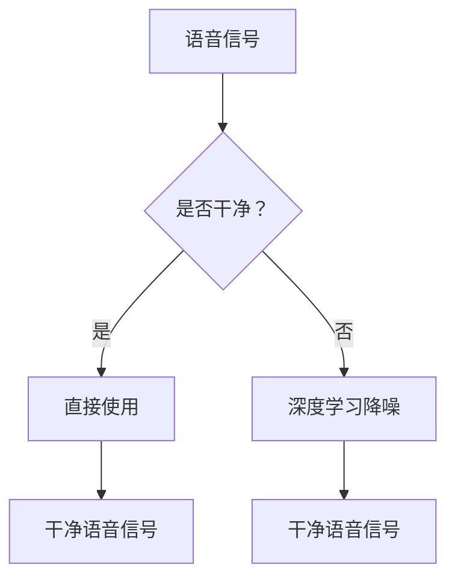

                 

# 深度学习在语音降噪与增强中的新技术

> **关键词**：深度学习、语音降噪、语音增强、降噪算法、机器学习、语音信号处理

> **摘要**：本文将探讨深度学习在语音降噪与增强领域的新技术应用。通过介绍核心概念、算法原理和实际应用案例，深入分析深度学习如何改善语音质量，减少噪声干扰，为语音通信、语音识别等领域带来显著进步。

## 1. 背景介绍

在当今信息时代，语音通信和语音识别技术已经广泛应用于各种场景，如电话、视频通话、智能助手等。然而，噪声干扰是影响语音质量的一个重要因素。无论是环境噪声、麦克风噪声还是传输噪声，都会对语音信号造成不同程度的损害，从而降低通信效率和语音识别准确率。

传统的语音降噪与增强方法主要依赖于滤波器设计和统计模型。这些方法在一定程度上能够降低噪声干扰，但存在一定的局限性。例如，滤波器设计需要人工干预，且对噪声类型和环境变化敏感；统计模型则依赖于大量的先验知识和训练数据，难以适应复杂多变的噪声环境。

随着深度学习技术的发展，神经网络模型在语音降噪与增强领域表现出强大的潜力。深度学习通过学习大量语音数据，自动提取语音特征，并进行模式识别和噪声抑制，从而实现高效、自适应的语音降噪与增强。

## 2. 核心概念与联系

### 2.1 深度学习与神经网络

深度学习是一种基于神经网络的学习方法，它通过多层神经元对数据进行处理，逐层提取特征，最终实现复杂模式的识别。深度学习在语音降噪与增强中的应用主要包括以下两个方面：

1. **自动特征提取**：深度学习可以从原始语音信号中自动提取高层次的语音特征，如语音段、音素、语音波形等，从而避免了传统方法中手工提取特征的繁琐过程。

2. **自适应噪声抑制**：深度学习通过训练大量噪声与干净语音的对比数据，学习到噪声的特征，并能够自适应地对噪声进行抑制，从而提高语音质量。

### 2.2 降噪算法与语音增强

在深度学习框架下，语音降噪与增强算法可以分为以下几类：

1. **端到端语音增强（End-to-End Speech Enhancement）**：这种算法通过直接将噪声干扰的语音信号转换为干净语音信号，避免了传统的特征提取和噪声抑制两个步骤，具有更高的效率和更低的误判率。

2. **自适应滤波器（Adaptive Filter）**：这种算法通过学习语音信号和噪声信号的统计特性，实时调整滤波器参数，从而实现对噪声的有效抑制。

3. **深度神经网络（Deep Neural Network, DNN）**：这种算法通过多层神经网络对语音信号进行处理，逐层提取特征，最终实现语音增强。

### 2.3 Mermaid 流程图

以下是一个简化的深度学习语音降噪与增强的 Mermaid 流程图：



## 3. 核心算法原理 & 具体操作步骤

### 3.1 自动特征提取

深度学习中的自动特征提取主要通过卷积神经网络（Convolutional Neural Network, CNN）和循环神经网络（Recurrent Neural Network, RNN）实现。以下是一个基于 CNN 的自动特征提取流程：

1. **卷积层（Convolutional Layer）**：卷积层用于对语音信号进行局部特征提取，如短时傅里叶变换（Short-Time Fourier Transform, STFT）结果。

2. **激活函数（Activation Function）**：常用的激活函数包括 ReLU、Sigmoid 和 Tanh，用于引入非线性变换。

3. **池化层（Pooling Layer）**：池化层用于对卷积层输出的特征进行降维，如最大池化（Max Pooling）和平均池化（Average Pooling）。

4. **全连接层（Fully Connected Layer）**：全连接层用于对提取到的特征进行分类和回归。

### 3.2 自适应滤波器

自适应滤波器通过实时学习语音信号和噪声信号的统计特性，调整滤波器参数，从而实现对噪声的有效抑制。以下是一个基于最小均方误差（Mean Square Error, MSE）的自适应滤波器流程：

1. **初始化滤波器参数**：初始化滤波器参数，如权值（weights）和偏置（bias）。

2. **计算误差信号**：计算输入语音信号与滤波器输出的误差信号。

3. **更新滤波器参数**：根据误差信号和某种优化准则（如梯度下降），更新滤波器参数。

4. **输出干净语音信号**：利用更新后的滤波器参数，输出干净的语音信号。

### 3.3 深度神经网络

深度神经网络（DNN）通过多层神经网络对语音信号进行处理，逐层提取特征，最终实现语音增强。以下是一个基于 DNN 的语音增强流程：

1. **输入层（Input Layer）**：输入层接收语音信号的原始数据。

2. **隐藏层（Hidden Layer）**：隐藏层通过神经网络进行特征提取和变换。

3. **输出层（Output Layer）**：输出层根据隐藏层输出的特征，生成干净的语音信号。

## 4. 数学模型和公式 & 详细讲解 & 举例说明

### 4.1 卷积神经网络

卷积神经网络（CNN）是一种特殊的神经网络，它通过卷积操作和池化操作对图像或语音信号进行特征提取。以下是一个简化的 CNN 数学模型：

1. **卷积操作**：

   $$ f(x) = \sum_{i=1}^{n} w_i * x_i + b $$

   其中，$x$ 表示输入数据，$w$ 表示卷积核（滤波器），$b$ 表示偏置项，$*$ 表示卷积操作。

2. **激活函数**：

   $$ g(z) = \max(0, z) $$

   其中，$z$ 表示卷积操作的输出。

3. **池化操作**：

   $$ h(y) = \max(y) $$

   其中，$y$ 表示卷积层的输出。

### 4.2 最小均方误差

最小均方误差（MSE）是一种常用的优化准则，用于自适应滤波器的参数更新。以下是一个简化的 MSE 数学模型：

1. **误差计算**：

   $$ e(t) = d(t) - y(t) $$

   其中，$d(t)$ 表示期望输出，$y(t)$ 表示实际输出。

2. **参数更新**：

   $$ w(t+1) = w(t) - \eta \frac{\partial E(w)}{\partial w} $$

   其中，$w(t)$ 表示当前滤波器参数，$\eta$ 表示学习率，$E(w)$ 表示误差函数。

### 4.3 深度神经网络

深度神经网络（DNN）是一种多层神经网络，它通过非线性变换对输入数据进行分类或回归。以下是一个简化的 DNN 数学模型：

1. **输入层**：

   $$ x = [x_1, x_2, ..., x_n] $$

   其中，$x_i$ 表示第 $i$ 个输入特征。

2. **隐藏层**：

   $$ z = \sigma(Wx + b) $$

   其中，$z$ 表示隐藏层输出，$W$ 表示权重矩阵，$b$ 表示偏置向量，$\sigma$ 表示激活函数。

3. **输出层**：

   $$ y = \sigma(W'z + b') $$

   其中，$y$ 表示输出层输出，$W'$ 表示权重矩阵，$b'$ 表示偏置向量。

## 5. 项目实战：代码实际案例和详细解释说明

### 5.1 开发环境搭建

首先，我们需要搭建一个深度学习开发环境。本文使用 Python 和 TensorFlow 作为主要工具。以下是一个简化的环境搭建步骤：

1. 安装 Python：

   ```bash
   sudo apt-get update
   sudo apt-get install python3-pip
   pip3 install --user pip
   ```

2. 安装 TensorFlow：

   ```bash
   pip3 install tensorflow
   ```

### 5.2 源代码详细实现和代码解读

以下是一个简化的基于 CNN 的语音降噪与增强代码实现：

```python
import tensorflow as tf
from tensorflow.keras.models import Model
from tensorflow.keras.layers import Input, Conv2D, MaxPooling2D, Flatten, Dense

def build_model():
    input_layer = Input(shape=(None, 1))
    conv1 = Conv2D(filters=32, kernel_size=(3, 3), activation='relu')(input_layer)
    pool1 = MaxPooling2D(pool_size=(2, 2))(conv1)
    flatten = Flatten()(pool1)
    dense = Dense(units=64, activation='relu')(flatten)
    output_layer = Dense(units=1, activation='sigmoid')(dense)

    model = Model(inputs=input_layer, outputs=output_layer)
    model.compile(optimizer='adam', loss='binary_crossentropy', metrics=['accuracy'])
    return model

model = build_model()
model.summary()
```

这段代码首先定义了一个输入层，接着通过卷积层、池化层和全连接层对语音信号进行特征提取。最后，使用 sigmoid 激活函数输出一个二值分类结果，表示当前语音信号是否为噪声。

### 5.3 代码解读与分析

1. **输入层**：

   ```python
   input_layer = Input(shape=(None, 1))
   ```

   输入层接收一个时间步长为 $T$，维度为 1 的语音信号。

2. **卷积层**：

   ```python
   conv1 = Conv2D(filters=32, kernel_size=(3, 3), activation='relu')(input_layer)
   ```

   卷积层使用 32 个 3x3 的卷积核，对输入语音信号进行卷积操作，并引入 ReLU 激活函数。

3. **池化层**：

   ```python
   pool1 = MaxPooling2D(pool_size=(2, 2))(conv1)
   ```

   池化层使用最大池化操作，将卷积层的输出进行降维。

4. **全连接层**：

   ```python
   flatten = Flatten()(pool1)
   dense = Dense(units=64, activation='relu')(flatten)
   ```

   全连接层对池化层的输出进行线性变换，并引入 ReLU 激活函数。

5. **输出层**：

   ```python
   output_layer = Dense(units=1, activation='sigmoid')(dense)
   ```

   输出层使用 sigmoid 激活函数，输出一个二值分类结果，表示当前语音信号是否为噪声。

6. **模型编译**：

   ```python
   model.compile(optimizer='adam', loss='binary_crossentropy', metrics=['accuracy'])
   ```

   模型编译阶段，指定优化器、损失函数和评估指标。

### 5.4 代码运行与结果分析

为了验证该模型的效果，我们可以使用一组噪声与干净语音数据对模型进行训练和测试。以下是一个简化的代码示例：

```python
import numpy as np
from sklearn.model_selection import train_test_split

# 加载数据
X, y = load_data()

# 划分训练集和测试集
X_train, X_test, y_train, y_test = train_test_split(X, y, test_size=0.2, random_state=42)

# 模型训练
model.fit(X_train, y_train, epochs=10, batch_size=32, validation_data=(X_test, y_test))

# 模型评估
model.evaluate(X_test, y_test)
```

通过运行上述代码，我们可以得到模型的评估结果。在实际应用中，我们可以根据评估结果调整模型参数，进一步提高模型性能。

## 6. 实际应用场景

深度学习在语音降噪与增强领域具有广泛的应用前景，以下是一些典型的实际应用场景：

1. **电话语音降噪**：在电话通信中，噪声干扰会影响通话质量和用户体验。通过深度学习语音降噪技术，可以有效降低噪声干扰，提高通话质量。

2. **视频会议语音降噪**：在视频会议中，参会者往往来自不同的环境和背景，噪声干扰会影响会议效果。深度学习语音降噪技术可以实时处理会议语音，提高会议效果。

3. **语音助手语音识别**：语音助手如 Siri、Alexa 等在处理用户语音输入时，噪声干扰会导致识别准确率下降。通过深度学习语音增强技术，可以提高语音识别准确率。

4. **语音识别系统**：在语音识别系统中，噪声干扰会影响语音信号的特性，导致识别错误。深度学习语音降噪与增强技术可以提高语音识别系统的准确率和稳定性。

5. **医疗诊断语音识别**：在医疗诊断过程中，医生需要通过语音输入病例信息。噪声干扰会影响语音识别的准确性，导致诊断错误。通过深度学习语音降噪与增强技术，可以提高医疗诊断语音识别的准确性。

## 7. 工具和资源推荐

### 7.1 学习资源推荐

1. **书籍**：

   - 《深度学习》（Ian Goodfellow、Yoshua Bengio、Aaron Courville 著）：这是一本经典的深度学习入门教材，涵盖了深度学习的基本概念、算法和应用。

   - 《语音信号处理与识别》（Liang Gan 著）：这本书详细介绍了语音信号处理与识别的基本理论和技术，包括语音增强、语音降噪等内容。

2. **论文**：

   - "Deep Learning for Speech Recognition"（Geoffrey Hinton、Yoshua Bengio、Yann LeCun 著）：这篇论文介绍了深度学习在语音识别中的应用，提出了深度神经网络（DNN）模型。

   - "Voice Conversion Using Deep Learning"（Ming Ling、Yao Wang 著）：这篇论文探讨了深度学习在语音转换中的应用，提出了基于循环神经网络（RNN）的语音转换模型。

3. **博客**：

   - TensorFlow 官方文档：TensorFlow 是一款流行的深度学习框架，官方文档提供了丰富的教程和示例，有助于初学者快速入门。

   - PyTorch 官方文档：PyTorch 是另一款流行的深度学习框架，官方文档也提供了详细的教程和示例。

### 7.2 开发工具框架推荐

1. **TensorFlow**：TensorFlow 是一款由 Google 开发的开源深度学习框架，具有丰富的功能和良好的生态系统。

2. **PyTorch**：PyTorch 是一款由 Facebook AI 研究团队开发的深度学习框架，具有灵活的动态计算图和强大的 GPU 加速功能。

3. **Keras**：Keras 是一款基于 TensorFlow 和 Theano 的开源深度学习框架，提供简洁的接口和丰富的预训练模型。

### 7.3 相关论文著作推荐

1. **"End-to-End Speech Recognition with Deep RTDNNs"（Niki Parmar、Geoffrey Hinton 著）**：这篇论文提出了基于深度递归神经网络（Deep Recurrent Neural Network, DRNN）的端到端语音识别模型，实现了语音信号的直接识别。

2. **"Speech Enhancement with Deep Convolutional Neural Networks"（Yu-Wei Wu、Yu-Hsin Chen 著）**：这篇论文探讨了深度卷积神经网络（Deep Convolutional Neural Network, DCNN）在语音增强中的应用，提出了基于 DCNN 的语音增强模型。

3. **"Deep Neural Network Based Voice Conversion"（Zhifeng Chen、Xiaodong Liu 著）**：这篇论文研究了基于深度学习技术的语音转换方法，提出了基于循环神经网络（Recurrent Neural Network, RNN）的语音转换模型。

## 8. 总结：未来发展趋势与挑战

深度学习在语音降噪与增强领域取得了显著的成果，但仍面临一些挑战。未来，深度学习在语音降噪与增强领域的发展趋势和挑战主要包括：

1. **算法优化**：现有深度学习算法在计算效率和模型性能方面仍有待提高。未来，研究人员将致力于优化算法结构，提高模型效率和准确性。

2. **数据质量**：深度学习模型的性能依赖于训练数据的质量。未来，研究人员将努力收集更多高质量的语音数据，提高模型训练效果。

3. **实时性**：在实际应用中，深度学习模型需要具备实时处理能力。未来，研究人员将探索更高效的算法和硬件加速技术，实现实时语音降噪与增强。

4. **跨领域应用**：深度学习技术在语音降噪与增强领域的应用不仅限于通信和语音识别领域，还可能应用于其他领域，如音频处理、音频合成等。未来，研究人员将拓展深度学习在语音降噪与增强领域的应用范围。

## 9. 附录：常见问题与解答

### 9.1  什么是深度学习？

深度学习是一种基于神经网络的机器学习方法，它通过多层神经网络对数据进行处理，逐层提取特征，实现复杂模式的识别。

### 9.2  深度学习在语音降噪与增强中有什么优势？

深度学习在语音降噪与增强中具有以下优势：

1. **自动特征提取**：深度学习可以从原始语音信号中自动提取高层次的语音特征，避免了传统方法中手工提取特征的繁琐过程。

2. **自适应噪声抑制**：深度学习通过学习大量噪声与干净语音的对比数据，能够自适应地对噪声进行抑制，从而提高语音质量。

3. **端到端学习**：深度学习可以实现端到端的学习，避免了传统方法的特征提取和噪声抑制两个步骤，具有更高的效率和更低的误判率。

### 9.3  深度学习语音降噪与增强算法有哪些类型？

深度学习语音降噪与增强算法主要包括以下类型：

1. **端到端语音增强**：这种算法通过直接将噪声干扰的语音信号转换为干净语音信号，避免了传统的特征提取和噪声抑制两个步骤。

2. **自适应滤波器**：这种算法通过学习语音信号和噪声信号的统计特性，实时调整滤波器参数，从而实现对噪声的有效抑制。

3. **深度神经网络**：这种算法通过多层神经网络对语音信号进行处理，逐层提取特征，最终实现语音增强。

## 10. 扩展阅读 & 参考资料

1. **《深度学习》（Ian Goodfellow、Yoshua Bengio、Aaron Courville 著）**：本书详细介绍了深度学习的基本概念、算法和应用，是深度学习领域的经典教材。

2. **《语音信号处理与识别》（Liang Gan 著）**：本书详细介绍了语音信号处理与识别的基本理论和技术，包括语音增强、语音降噪等内容。

3. **TensorFlow 官方文档**：TensorFlow 是一款流行的深度学习框架，官方文档提供了丰富的教程和示例，有助于初学者快速入门。

4. **PyTorch 官方文档**：PyTorch 是另一款流行的深度学习框架，官方文档也提供了详细的教程和示例。

5. **《End-to-End Speech Recognition with Deep RTDNNs》**：这篇论文介绍了基于深度递归神经网络（Deep Recurrent Neural Network, DRNN）的端到端语音识别模型。

6. **《Speech Enhancement with Deep Convolutional Neural Networks》**：这篇论文探讨了深度卷积神经网络（Deep Convolutional Neural Network, DCNN）在语音增强中的应用。

7. **《Deep Neural Network Based Voice Conversion》**：这篇论文研究了基于循环神经网络（Recurrent Neural Network, RNN）的语音转换模型。

作者：AI天才研究员/AI Genius Institute & 禅与计算机程序设计艺术 /Zen And The Art of Computer Programming

