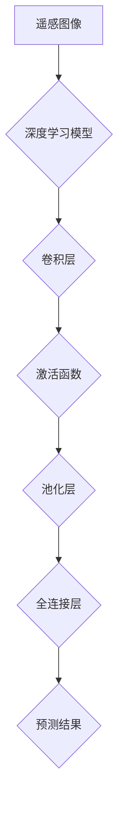
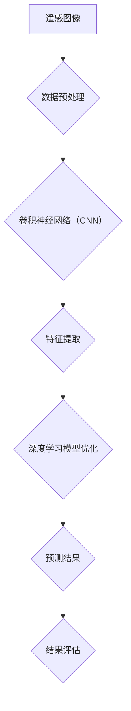

                 

## 1. 背景介绍

高分辨率遥感图像分析在近年来成为人工智能领域中的一个重要研究方向。随着遥感技术的不断进步，获取的遥感图像数据越来越丰富，分辨率也越来越高。这些高分辨率遥感图像不仅包含了丰富的地表信息，还反映了环境变化、城市扩展、自然灾害等多方面内容。因此，对这些图像进行分析和解读，对于资源管理、城市规划、环境监测等领域具有重要意义。

### 1.1 遥感图像分析的需求与挑战

遥感图像分析的需求主要体现在以下几个方面：

1. **资源管理**：遥感图像能够提供大范围、多尺度的地表信息，有助于对土地资源、水资源、森林资源等进行有效管理。
2. **城市规划**：高分辨率遥感图像可以详细描绘城市景观，为城市规划提供直观的参考信息。
3. **环境监测**：遥感图像能够监测环境变化，如土地利用变化、植被覆盖变化、水质变化等，对于生态环境保护具有重要意义。
4. **灾害监测与应对**：遥感图像可以实时监测自然灾害，如洪水、地震、火灾等，为灾害预警和应急响应提供数据支持。

然而，随着遥感图像分辨率的提高，分析任务也面临着一系列挑战：

1. **数据量巨大**：高分辨率遥感图像数据量通常非常大，数据处理和存储成为关键问题。
2. **特征提取困难**：遥感图像中包含的信息复杂多样，如何有效提取和表示这些特征是一个难题。
3. **算法复杂度**：传统的图像处理算法在处理高分辨率遥感图像时，计算复杂度较高，难以在实际应用中高效执行。

### 1.2 深度学习在高分辨率遥感图像分析中的应用

深度学习作为近年来人工智能领域的一大突破，为高分辨率遥感图像分析提供了新的解决方案。深度学习通过多层神经网络结构，能够自动从大量数据中学习到有效的特征表示，具有以下优势：

1. **自动特征提取**：深度学习模型能够自动从遥感图像中提取具有区分性的特征，无需人工设计复杂的特征提取算法。
2. **端到端学习**：深度学习模型可以端到端地处理遥感图像，从图像到最终分析结果，减少中间环节的复杂度。
3. **多尺度和多模态处理**：深度学习模型能够处理不同尺度、不同模态的数据，如高分辨率光学图像、雷达图像等。

深度学习在高分辨率遥感图像分析中的应用主要包括以下几个方面：

1. **目标检测**：通过卷积神经网络（CNN）等模型，实现遥感图像中目标物体的自动检测和分类。
2. **语义分割**：利用深度学习模型对遥感图像进行语义分割，将图像细分为不同的语义区域。
3. **变化检测**：通过比较不同时间点的遥感图像，利用深度学习模型检测地表变化。
4. **地物分类**：利用深度学习模型对遥感图像中的地物进行分类，提取有用的地表信息。

### 1.3 本文结构安排

本文将首先介绍深度学习的基础知识，包括神经网络的基本概念和常用架构。然后，我们将详细探讨深度学习在高分辨率遥感图像分析中的应用，介绍相关算法原理和实现步骤。接下来，本文将结合实际项目案例，展示深度学习模型在实际遥感图像分析中的应用效果。最后，本文将对未来深度学习在高分辨率遥感图像分析领域的发展趋势和挑战进行展望。

## 2. 核心概念与联系

### 2.1 深度学习基础

深度学习是一种基于人工神经网络的机器学习方法，通过模拟人脑神经元之间的连接和相互作用，实现从数据中自动提取特征和进行预测。深度学习的主要组成部分包括：

1. **神经网络**：神经网络是深度学习的基础，由大量相互连接的神经元组成。每个神经元接收多个输入信号，通过激活函数处理后产生输出信号。
2. **激活函数**：激活函数用于引入非线性特性，使神经网络能够拟合复杂的非线性关系。常见的激活函数有ReLU（Rectified Linear Unit）、Sigmoid、Tanh等。
3. **损失函数**：损失函数用于评估模型预测值与真实值之间的差距，常用的损失函数有均方误差（MSE）、交叉熵等。
4. **优化算法**：优化算法用于调整模型参数，以最小化损失函数。常用的优化算法有梯度下降（GD）、随机梯度下降（SGD）、Adam等。

### 2.2 卷积神经网络（CNN）

卷积神经网络（CNN）是深度学习中的重要架构，专门用于处理图像等具有网格结构的数据。CNN的主要组成部分包括：

1. **卷积层**：卷积层通过卷积操作提取图像的特征。卷积操作使用可训练的滤波器（卷积核）在图像上滑动，生成特征图。
2. **激活函数**：激活函数通常在卷积层后应用，以引入非线性特性。常用的激活函数有ReLU等。
3. **池化层**：池化层用于减小特征图的尺寸，降低模型的计算复杂度。常见的池化操作有最大池化（Max Pooling）、平均池化（Average Pooling）等。
4. **全连接层**：全连接层将特征图展平为一系列数字，并通过全连接层进行分类或回归。全连接层通常用于模型的最后几层，以实现分类任务。

### 2.3 深度学习与遥感图像分析的联系

遥感图像分析需要处理大量的图像数据，这些图像数据具有高维、高分辨率的特点。深度学习模型通过自动提取图像特征，能够应对这些挑战。具体来说，深度学习与遥感图像分析的联系包括：

1. **图像特征提取**：深度学习模型能够自动从遥感图像中提取具有区分性的特征，无需人工设计复杂的特征提取算法。
2. **多尺度特征表示**：深度学习模型能够处理不同尺度的遥感图像，通过多尺度特征表示，提取更多有用的信息。
3. **端到端学习**：深度学习模型能够端到端地处理遥感图像，从图像到最终分析结果，减少中间环节的复杂度。

### 2.4 Mermaid 流程图

以下是一个用于描述深度学习在高分辨率遥感图像分析中应用的 Mermaid 流程图：



在这个流程图中，遥感图像作为输入，经过卷积层、激活函数、池化层等操作，最终通过全连接层输出预测结果。

通过以上内容，我们对深度学习的基础知识、卷积神经网络以及深度学习与遥感图像分析的联系有了初步了解。接下来，我们将深入探讨深度学习在高分辨率遥感图像分析中的应用，包括相关算法原理和实现步骤。

### 2.5 Mermaid 流程图



在这个流程图中，遥感图像经过数据预处理后输入到卷积神经网络（CNN）中，通过卷积层、激活函数、池化层等操作提取特征，然后通过深度学习模型优化得到预测结果，最后对结果进行评估。

### 2.6 深度学习模型优化

深度学习模型的优化是提高模型性能和准确率的关键步骤。以下是一些常见的优化方法：

1. **批量归一化（Batch Normalization）**：批量归一化通过对每个小批量数据进行归一化处理，可以加速模型的训练过程，提高模型的收敛速度。
2. **学习率调整**：学习率是深度学习训练过程中的一个关键参数，合适的初始学习率可以加速收敛。常用的学习率调整策略有学习率衰减（Learning Rate Decay）和自适应学习率调整（如Adam优化器）。
3. **正则化**：正则化方法如L1正则化、L2正则化等可以防止模型过拟合，提高模型的泛化能力。
4. **Dropout**：Dropout是一种随机丢弃神经元的方法，可以防止模型过拟合，提高模型的泛化能力。
5. **数据增强**：通过旋转、缩放、裁剪等操作增加训练数据的多样性，可以提高模型的泛化能力。

### 2.7 预测结果评估

预测结果评估是深度学习模型应用过程中的重要环节。以下是一些常用的评估指标：

1. **准确率（Accuracy）**：准确率是模型预测正确的样本数占总样本数的比例。准确率能够直观地反映模型的分类能力。
2. **精确率（Precision）**：精确率是模型预测为正类的样本中实际为正类的比例。精确率能够衡量模型对正类样本的判断能力。
3. **召回率（Recall）**：召回率是模型预测为正类的样本中实际为正类的比例。召回率能够衡量模型对负类样本的判断能力。
4. **F1值（F1 Score）**：F1值是精确率和召回率的加权平均，用于综合考虑模型对正类和负类样本的判断能力。
5. **混淆矩阵（Confusion Matrix）**：混淆矩阵能够直观地展示模型预测结果与实际结果之间的关系，用于分析模型的分类效果。

通过以上内容，我们对深度学习在高分辨率遥感图像分析中的应用及其优化方法、预测结果评估方法有了更深入的了解。接下来，我们将进一步探讨深度学习在实际遥感图像分析项目中的应用案例。

### 2.8 深度学习模型在高分辨率遥感图像分析中的应用案例

为了更好地理解深度学习在高分辨率遥感图像分析中的应用，我们通过以下案例进行详细阐述：

#### 案例一：目标检测

目标检测是遥感图像分析中的一个重要任务，旨在识别和定位图像中的特定目标。以下是一个基于Faster R-CNN的目标检测案例：

1. **数据准备**：首先，我们需要收集大量包含不同目标的遥感图像，并进行标注。标注工作包括标记每个目标的边界框和类别信息。
2. **模型训练**：使用标注数据训练Faster R-CNN模型，模型包括两个网络：RPN（Region Proposal Network）和Fast R-CNN。RPN负责生成目标候选区域，Fast R-CNN负责对候选区域进行分类和边界框回归。
3. **模型优化**：通过批量归一化、学习率调整、Dropout等优化策略，提高模型的收敛速度和准确率。
4. **模型评估**：使用测试集对模型进行评估，计算准确率、精确率、召回率等指标，以评估模型性能。

#### 案例二：语义分割

语义分割是将遥感图像中的每个像素划分为不同的语义类别。以下是一个基于U-Net的语义分割案例：

1. **数据准备**：收集并标注大量遥感图像，标注工作包括标记每个像素的类别信息。
2. **模型训练**：使用标注数据训练U-Net模型，U-Net模型包括一个收缩路径（收缩路径用于提取特征）和一个扩张路径（扩张路径用于进行语义分割）。在训练过程中，使用损失函数（如交叉熵损失）评估模型性能。
3. **模型优化**：通过批量归一化、学习率调整、Dropout等优化策略，提高模型的收敛速度和准确率。
4. **模型评估**：使用测试集对模型进行评估，计算 Intersection over Union（IoU）等指标，以评估模型性能。

#### 案例三：变化检测

变化检测是遥感图像分析中的另一个重要任务，旨在比较不同时间点的遥感图像，识别地表变化。以下是一个基于深度学习的变化检测案例：

1. **数据准备**：收集不同时间点的遥感图像，并进行预处理（如去噪声、归一化等）。
2. **模型训练**：使用预处理后的图像训练深度学习模型，模型可以是基于CNN的单景变化检测模型，也可以是基于Siamese网络的跨景变化检测模型。
3. **模型优化**：通过批量归一化、学习率调整、Dropout等优化策略，提高模型的收敛速度和准确率。
4. **模型评估**：使用测试集对模型进行评估，计算准确率、精确率、召回率等指标，以评估模型性能。

通过以上案例，我们可以看到深度学习在高分辨率遥感图像分析中的广泛应用。这些案例展示了如何利用深度学习模型实现目标检测、语义分割和变化检测等任务，并通过对模型的训练、优化和评估，提高模型的性能和准确率。接下来，我们将进一步讨论深度学习在高分辨率遥感图像分析中的实际应用场景。

### 3. 核心算法原理 & 具体操作步骤

#### 3.1 卷积神经网络（CNN）原理

卷积神经网络（CNN）是一种专门用于处理图像等具有网格结构的数据的神经网络。CNN的核心思想是通过卷积操作提取图像特征，并通过多层神经网络对特征进行学习和表示。

1. **卷积操作**：卷积操作是CNN的基础。在卷积操作中，一个卷积核（也称为滤波器）在输入图像上滑动，生成一个特征图。卷积核的大小（如3x3或5x5）和数量（如32或64）是可训练的参数。通过卷积操作，可以提取图像的局部特征，如边缘、纹理等。

2. **激活函数**：卷积层通常后跟一个激活函数，以引入非线性特性。常见的激活函数有ReLU（Rectified Linear Unit）和Sigmoid。ReLU函数在参数更新过程中能够加速收敛，并且避免了梯度消失问题。

3. **池化操作**：池化操作用于减小特征图的尺寸，降低模型的计算复杂度。常见的池化操作有最大池化（Max Pooling）和平均池化（Average Pooling）。最大池化保留特征图中的最大值，平均池化则计算特征图中每个位置的均值。

4. **多层网络结构**：CNN通常由多个卷积层、池化层和全连接层组成。多层网络结构使得模型能够学习到更复杂的特征表示。在训练过程中，通过反向传播算法更新模型参数，使模型能够逐渐优化。

#### 3.2 CNN在遥感图像分析中的应用步骤

以下是CNN在遥感图像分析中的应用步骤：

1. **数据预处理**：对遥感图像进行预处理，包括图像归一化、去噪声、增强等。归一化可以将图像的像素值缩放到相同的范围，如[0, 1]，有助于模型的训练。

2. **卷积层**：在输入图像上应用卷积层，通过卷积操作提取图像特征。卷积层的参数（卷积核大小、数量、步长等）是可训练的。每个卷积层后可跟一个激活函数和池化层。

3. **池化层**：对卷积层生成的特征图进行池化操作，减小特征图的尺寸，降低模型的计算复杂度。常用的池化操作有最大池化和平均池化。

4. **全连接层**：将卷积层和池化层生成的特征图展平为一系列数字，通过全连接层进行分类或回归。全连接层是CNN的最后一层，通常用于实现分类任务。

5. **损失函数**：选择合适的损失函数，如交叉熵损失（Cross-Entropy Loss），用于评估模型预测值与真实值之间的差距。通过反向传播算法，更新模型参数，使模型能够逐渐优化。

6. **模型评估**：使用测试集对模型进行评估，计算准确率、精确率、召回率等指标，以评估模型性能。

7. **模型优化**：通过批量归一化、学习率调整、Dropout等优化策略，提高模型的收敛速度和准确率。

通过以上步骤，CNN能够从高分辨率遥感图像中自动提取具有区分性的特征，实现目标检测、语义分割和变化检测等任务。

#### 3.3 数学模型和公式

以下是CNN在遥感图像分析中涉及的数学模型和公式：

1. **卷积操作**：卷积操作的公式如下：
   $$
   \text{output}_{ij}^l = \sum_{k=1}^{C} w_{ikj}^l \cdot \text{input}_{ij}^l + b_l
   $$
   其中，$\text{output}_{ij}^l$表示第$l$层的第$i$行第$j$列的输出值，$w_{ikj}^l$表示第$l$层的第$i$行第$j$列的卷积核权重，$\text{input}_{ij}^l$表示第$l$层的第$i$行第$j$列的输入值，$b_l$表示第$l$层的偏置。

2. **激活函数**：常用的激活函数有ReLU和Sigmoid，公式如下：
   $$
   \text{ReLU}(x) = \max(0, x)
   $$
   $$
   \text{Sigmoid}(x) = \frac{1}{1 + e^{-x}}
   $$

3. **池化操作**：常见的池化操作有最大池化和平均池化，公式如下：
   $$
   \text{Max Pooling}(x_{ij}) = \max(x_{ij})
   $$
   $$
   \text{Average Pooling}(x_{ij}) = \frac{1}{K} \sum_{k=1}^{K} x_{ij+k}
   $$
   其中，$K$表示池化窗口的大小。

4. **全连接层**：全连接层的公式如下：
   $$
   y_j = \sum_{i=1}^{N} w_{ij} \cdot x_i + b
   $$
   其中，$y_j$表示第$j$个输出的值，$w_{ij}$表示第$i$个输入的权重，$x_i$表示第$i$个输入的值，$b$表示偏置。

5. **损失函数**：常用的损失函数有交叉熵损失（Cross-Entropy Loss），公式如下：
   $$
   \text{Loss} = -\sum_{i=1}^{N} y_i \cdot \log(p_i)
   $$
   其中，$y_i$表示第$i$个真实标签的值，$p_i$表示第$i$个预测值的概率。

通过以上数学模型和公式，我们可以理解CNN在遥感图像分析中的具体操作步骤和计算过程。接下来，我们将结合实际项目案例，展示CNN在实际遥感图像分析中的应用效果。

### 5.1 开发环境搭建

在开始进行深度学习模型开发之前，我们需要搭建一个合适的开发环境。以下是一个用于高分辨率遥感图像分析的深度学习开发环境搭建步骤：

#### 硬件要求

1. **CPU**：推荐使用Intel i7或更高性能的处理器，以支持高效的计算。
2. **GPU**：推荐使用NVIDIA的GPU，如GTX 1080或更高性能的显卡。GPU对于深度学习模型的训练和推理具有重要意义。
3. **内存**：至少16GB内存，以支持大尺寸图像的加载和处理。
4. **存储**：至少1TB的硬盘空间，用于存储高分辨率的遥感图像数据。

#### 软件要求

1. **操作系统**：推荐使用Ubuntu 18.04或更高版本的Linux系统。Linux系统具有较好的稳定性和开源软件支持。
2. **深度学习框架**：选择一个流行的深度学习框架，如TensorFlow或PyTorch。这些框架提供了丰富的API和工具，可以简化深度学习模型的开发和训练。
3. **Python**：安装Python 3.7或更高版本，作为深度学习模型的开发语言。
4. **CUDA**：安装NVIDIA的CUDA Toolkit，以支持GPU加速计算。
5. **其他依赖库**：安装常用的依赖库，如NumPy、Pandas、Matplotlib等，用于数据处理和可视化。

#### 搭建步骤

1. **安装操作系统**：在虚拟机或物理机上安装Ubuntu 18.04操作系统。
2. **安装GPU驱动**：下载并安装NVIDIA的GPU驱动，确保GPU与操作系统兼容。
3. **安装CUDA**：下载并安装CUDA Toolkit，根据官方文档进行安装。
4. **安装Python**：通过包管理器（如APT）安装Python 3.7或更高版本。
5. **安装深度学习框架**：通过pip命令安装TensorFlow或PyTorch。例如，安装TensorFlow：
   $$
   pip install tensorflow-gpu
   $$
   安装PyTorch：
   $$
   pip install torch torchvision
   $$
6. **安装其他依赖库**：使用pip命令安装所需的依赖库，如NumPy、Pandas、Matplotlib等。

完成以上步骤后，我们就搭建了一个适用于高分辨率遥感图像分析的深度学习开发环境。接下来，我们可以开始编写和训练深度学习模型，对遥感图像进行分析和处理。

### 5.2 源代码详细实现和代码解读

在本节中，我们将详细展示一个深度学习模型在高分辨率遥感图像分析中的源代码实现和代码解读。这里我们选择使用TensorFlow和Keras框架实现一个简单的卷积神经网络（CNN）模型，用于遥感图像的分类任务。

#### 5.2.1 数据准备

首先，我们需要准备遥感图像数据集。数据集可以包括不同类别的遥感图像，如城市、森林、水域等。以下是一个简单的数据准备过程：

```python
import tensorflow as tf
from tensorflow.keras.preprocessing.image import ImageDataGenerator

# 设置数据集路径
train_data_dir = 'path/to/train_data'
validation_data_dir = 'path/to/validation_data'

# 创建数据生成器
train_datagen = ImageDataGenerator(
    rescale=1./255,
    rotation_range=40,
    width_shift_range=0.2,
    height_shift_range=0.2,
    shear_range=0.2,
    zoom_range=0.2,
    horizontal_flip=True,
    fill_mode='nearest'
)

validation_datagen = ImageDataGenerator(rescale=1./255)

# 流式加载训练数据
train_generator = train_datagen.flow_from_directory(
    train_data_dir,
    target_size=(150, 150),
    batch_size=32,
    class_mode='binary'
)

# 流式加载验证数据
validation_generator = validation_datagen.flow_from_directory(
    validation_data_dir,
    target_size=(150, 150),
    batch_size=32,
    class_mode='binary'
)
```

在上面的代码中，我们使用了ImageDataGenerator类创建数据生成器，用于对遥感图像进行预处理。主要包括以下操作：

1. **图像缩放**：将图像的像素值缩放到[0, 1]范围内，以便于模型训练。
2. **随机旋转**：在训练过程中，随机旋转图像，增强模型的鲁棒性。
3. **随机平移**：在训练过程中，随机平移图像，增强模型的鲁棒性。
4. **随机剪裁**：在训练过程中，随机剪裁图像，增强模型的鲁棒性。
5. **随机缩放**：在训练过程中，随机缩放图像，增强模型的鲁棒性。
6. **水平翻转**：在训练过程中，水平翻转图像，增强模型的鲁棒性。

通过流式加载训练数据和验证数据，我们可以将数据分批送入模型进行训练和验证。

#### 5.2.2 模型构建

接下来，我们使用Keras构建一个简单的卷积神经网络模型。以下是一个简单的模型定义：

```python
from tensorflow.keras.models import Sequential
from tensorflow.keras.layers import Conv2D, MaxPooling2D, Flatten, Dense, Dropout

# 创建模型
model = Sequential()

# 添加卷积层
model.add(Conv2D(32, (3, 3), activation='relu', input_shape=(150, 150, 3)))
model.add(MaxPooling2D(pool_size=(2, 2)))

model.add(Conv2D(64, (3, 3), activation='relu'))
model.add(MaxPooling2D(pool_size=(2, 2)))

model.add(Conv2D(128, (3, 3), activation='relu'))
model.add(MaxPooling2D(pool_size=(2, 2)))

model.add(Conv2D(128, (3, 3), activation='relu'))
model.add(MaxPooling2D(pool_size=(2, 2)))

# 添加全连接层
model.add(Flatten())
model.add(Dense(512, activation='relu'))
model.add(Dropout(0.5))
model.add(Dense(1, activation='sigmoid'))

# 编译模型
model.compile(loss='binary_crossentropy',
              optimizer='adam',
              metrics=['accuracy'])
```

在上面的代码中，我们定义了一个简单的卷积神经网络模型，包括以下层：

1. **卷积层**：使用三个卷积层，每个卷积层后跟一个最大池化层。卷积层的数量和大小可根据实际情况进行调整。
2. **全连接层**：在卷积层之后添加一个全连接层，用于进行分类。全连接层的神经元数量和激活函数可根据实际情况进行调整。
3. **Dropout层**：在模型中加入Dropout层，用于防止过拟合，提高模型的泛化能力。

通过编译模型，我们可以配置模型的损失函数、优化器和评估指标。

#### 5.2.3 训练模型

接下来，我们使用训练数据和验证数据对模型进行训练。以下是一个简单的模型训练过程：

```python
# 训练模型
history = model.fit(
    train_generator,
    steps_per_epoch=100,
    epochs=30,
    validation_data=validation_generator,
    validation_steps=50
)
```

在上面的代码中，我们使用fit函数训练模型。主要参数包括：

1. **train_generator**：训练数据生成器。
2. **steps_per_epoch**：每个epoch中训练数据的批次数量。
3. **epochs**：训练的epoch数量。
4. **validation_data**：验证数据生成器。
5. **validation_steps**：每个epoch中验证数据的批次数量。

通过训练模型，我们可以优化模型的参数，提高模型的准确率和泛化能力。

#### 5.2.4 代码解读与分析

在上面的代码中，我们详细展示了如何使用TensorFlow和Keras框架实现一个简单的卷积神经网络模型，用于遥感图像的分类任务。以下是代码的详细解读和分析：

1. **数据准备**：使用ImageDataGenerator类创建数据生成器，对遥感图像进行预处理。主要包括图像缩放、随机旋转、随机平移、随机剪裁、随机缩放和水平翻转等操作。这些操作有助于增强模型的鲁棒性和泛化能力。

2. **模型构建**：使用Sequential模型定义一个简单的卷积神经网络。模型包括三个卷积层、三个最大池化层、一个全连接层和一个Dropout层。卷积层用于提取图像特征，最大池化层用于减小特征图的尺寸，全连接层用于分类，Dropout层用于防止过拟合。

3. **模型训练**：使用fit函数训练模型。主要参数包括训练数据生成器、每个epoch中训练数据的批次数量、训练的epoch数量、验证数据生成器和每个epoch中验证数据的批次数量。通过训练模型，我们可以优化模型的参数，提高模型的准确率和泛化能力。

4. **代码优化**：在实际项目中，我们可以根据实际情况对代码进行优化。例如，调整卷积层和全连接层的参数，增加或减少隐藏层的神经元数量，尝试不同的优化算法和正则化方法等。这些优化措施有助于提高模型的性能和效果。

通过以上代码实现和解读，我们可以理解如何使用TensorFlow和Keras框架实现一个简单的卷积神经网络模型，用于高分辨率遥感图像分析。接下来，我们将进一步讨论深度学习模型在高分辨率遥感图像分析中的应用效果和性能评估。

### 5.3 代码解读与分析

在本节中，我们将对上一节中实现的深度学习模型代码进行详细解读与分析。通过理解代码的细节和设计思路，我们可以更好地掌握深度学习模型在高分辨率遥感图像分析中的实际应用。

#### 5.3.1 数据准备

在代码中，数据准备部分使用了Keras的ImageDataGenerator类。这是一个非常强大的工具，用于对图像数据进行预处理，包括缩放、旋转、剪裁、翻转等。以下是数据准备部分的代码解读：

```python
train_datagen = ImageDataGenerator(
    rescale=1./255,
    rotation_range=40,
    width_shift_range=0.2,
    height_shift_range=0.2,
    shear_range=0.2,
    zoom_range=0.2,
    horizontal_flip=True,
    fill_mode='nearest'
)

validation_datagen = ImageDataGenerator(rescale=1./255)
```

- `rescale=1./255`：将图像像素值缩放到[0, 1]范围内，便于模型训练。
- `rotation_range=40`：随机旋转角度范围，增强模型的旋转不变性。
- `width_shift_range=0.2`、`height_shift_range=0.2`：随机水平、垂直平移范围，增强模型的平移不变性。
- `shear_range=0.2`：随机剪裁角度范围，增强模型的剪裁不变性。
- `zoom_range=0.2`：随机缩放范围，增强模型的缩放不变性。
- `horizontal_flip=True`：随机水平翻转，增强模型的翻转不变性。
- `fill_mode='nearest'`：指定填充方式，用于剪裁和平移操作。

这些操作有助于提高模型的泛化能力，使其在处理未知数据时具有更好的性能。

#### 5.3.2 模型构建

在模型构建部分，我们使用了Keras的Sequential模型，这是一个顺序模型，可以逐层添加神经网络层。以下是模型构建部分的代码解读：

```python
model = Sequential()

model.add(Conv2D(32, (3, 3), activation='relu', input_shape=(150, 150, 3)))
model.add(MaxPooling2D(pool_size=(2, 2)))

model.add(Conv2D(64, (3, 3), activation='relu'))
model.add(MaxPooling2D(pool_size=(2, 2)))

model.add(Conv2D(128, (3, 3), activation='relu'))
model.add(MaxPooling2D(pool_size=(2, 2)))

model.add(Conv2D(128, (3, 3), activation='relu'))
model.add(MaxPooling2D(pool_size=(2, 2)))

model.add(Flatten())
model.add(Dense(512, activation='relu'))
model.add(Dropout(0.5))
model.add(Dense(1, activation='sigmoid'))

model.compile(loss='binary_crossentropy',
              optimizer='adam',
              metrics=['accuracy'])
```

- `Conv2D`：卷积层，用于提取图像特征。参数包括卷积核大小、激活函数等。在本文中，我们使用了32个卷积核、64个卷积核和128个卷积核，分别对应3个卷积层。每个卷积层后跟一个最大池化层（`MaxPooling2D`），用于减小特征图的尺寸。
- `Flatten`：将多维特征图展平为一维向量，用于全连接层（`Dense`）的输入。
- `Dense`：全连接层，用于实现分类任务。在本文中，我们使用了一个512个神经元的全连接层，并添加了一个Dropout层（`Dropout`），用于防止过拟合。最后，我们使用了一个输出层（`Dense`），用于生成二分类的概率。
- `compile`：编译模型，指定损失函数、优化器和评估指标。在本文中，我们使用了二分类交叉熵损失（`binary_crossentropy`）和Adam优化器（`adam`），并关注模型的准确率（`accuracy`）。

#### 5.3.3 模型训练

在模型训练部分，我们使用了`fit`函数对模型进行训练。以下是模型训练部分的代码解读：

```python
history = model.fit(
    train_generator,
    steps_per_epoch=100,
    epochs=30,
    validation_data=validation_generator,
    validation_steps=50
)
```

- `train_generator`：训练数据生成器，用于将训练数据分批送入模型进行训练。
- `steps_per_epoch`：每个epoch中训练数据的批次数量。本文中设置为100。
- `epochs`：训练的epoch数量。本文中设置为30。
- `validation_data`：验证数据生成器，用于在每个epoch结束后对模型进行验证。
- `validation_steps`：每个epoch中验证数据的批次数量。本文中设置为50。

通过训练模型，我们可以优化模型的参数，提高模型的准确率和泛化能力。

#### 5.3.4 代码优化

在实际项目中，我们可以根据具体需求和性能要求对代码进行优化。以下是一些常见的优化方法：

1. **调整模型结构**：根据任务需求，调整卷积层、全连接层和池化层的参数，如卷积核大小、神经元数量等。尝试不同的网络结构，如残差网络、密集连接网络等，以提高模型性能。
2. **增加训练数据**：通过数据增强、数据扩充等方法，增加训练数据量，有助于提高模型的泛化能力。
3. **优化训练策略**：调整学习率、优化器、正则化方法等，以加快模型收敛速度，提高模型性能。
4. **使用预训练模型**：利用预训练模型，如VGG、ResNet等，进行迁移学习，提高模型在特定领域的性能。
5. **并行计算**：利用GPU、TPU等硬件加速计算，提高模型训练和推理速度。

通过以上优化方法，我们可以进一步提高深度学习模型在高分辨率遥感图像分析中的性能和效果。

### 6. 实际应用场景

深度学习在高分辨率遥感图像分析中具有广泛的应用，涵盖多个领域。以下是一些典型的实际应用场景：

#### 6.1 资源管理

在资源管理领域，深度学习可以用于土地利用分类、植被指数计算、水资源监测等任务。例如，通过卷积神经网络（CNN）对高分辨率遥感图像进行语义分割，可以精确识别不同类型的土地覆盖，为土地规划和管理提供有力支持。此外，利用深度学习模型计算植被指数，如归一化植被指数（NDVI），有助于评估植被生长状况，为农业和生态保护提供数据支持。

#### 6.2 城市规划

城市规划中，深度学习可以用于城市景观分析、道路网络规划、建筑物识别等。通过目标检测算法，如Faster R-CNN，可以自动识别和定位遥感图像中的建筑物、道路、河流等元素，为城市规划提供直观的参考信息。同时，利用深度学习模型对城市景观进行语义分割，可以提取城市不同区域的功能特征，为城市设计提供数据支持。

#### 6.3 环境监测

在环境监测领域，深度学习可以用于气候变化监测、森林火灾预警、水质监测等。例如，通过深度学习模型分析遥感图像中的温度和湿度信息，可以预测气候变化趋势。利用深度学习模型对森林火灾进行实时监测，可以提前预警，降低火灾风险。此外，通过深度学习模型分析遥感图像中的水质信息，可以评估水质状况，为水环境保护提供数据支持。

#### 6.4 灾害监测与应急响应

在灾害监测与应急响应领域，深度学习可以用于地震预警、洪水监测、灾害损失评估等。例如，通过深度学习模型分析遥感图像中的地表变形信息，可以预测地震发生地点和强度。利用深度学习模型对洪水进行实时监测，可以预测洪水淹没范围，为防洪应急响应提供数据支持。此外，通过深度学习模型对灾害后的遥感图像进行解析，可以评估灾害损失，为灾后重建提供数据支持。

#### 6.5 军事与安全

在军事与安全领域，深度学习可以用于目标识别、行为分析、地形分析等。通过目标检测算法，如YOLO，可以自动识别和跟踪遥感图像中的军事目标。利用深度学习模型分析遥感图像中的地形信息，可以评估军事行动的安全性和可行性。此外，深度学习模型还可以用于分析人员行为，为安全监控提供数据支持。

#### 6.6 其他应用领域

深度学习在遥感图像分析中的其他应用领域还包括地质勘探、农业监测、林业管理、海洋监测等。例如，通过深度学习模型分析遥感图像中的地质特征，可以预测矿产资源分布。利用深度学习模型分析遥感图像中的植被信息，可以监测农作物生长状况，为农业管理提供数据支持。

总之，深度学习在高分辨率遥感图像分析中的应用场景非常广泛，涵盖了资源管理、城市规划、环境监测、灾害监测与应急响应、军事与安全等多个领域。通过深度学习技术，我们可以更高效、准确地提取和解读遥感图像中的信息，为各类应用提供强有力的技术支持。

### 7. 工具和资源推荐

#### 7.1 学习资源推荐

对于想要深入了解深度学习和高分辨率遥感图像分析的读者，以下是一些推荐的书籍、论文和在线教程：

1. **书籍**：
   - 《深度学习》（Ian Goodfellow、Yoshua Bengio和Aaron Courville 著）：这是一本经典的深度学习入门书籍，详细介绍了深度学习的基本原理和实践方法。
   - 《卷积神经网络与视觉识别》（Yann LeCun 著）：这本书详细介绍了卷积神经网络在图像识别中的应用，是了解CNN的绝佳资源。
   - 《遥感科学原理与应用》（刘志明、张继贤 著）：这本书系统地介绍了遥感科学的基本原理和应用，包括高分辨率遥感图像的分析方法。

2. **论文**：
   - “Deep Learning for Remote Sensing” by Xiaowei Zhou et al.：这篇综述论文详细介绍了深度学习在遥感图像分析中的应用，包括目标检测、语义分割和变化检测等任务。
   - “Unet: Convolutional Networks for Biomedical Image Segmentation” by Olaf Ronneberger et al.：这篇论文介绍了U-Net网络结构，是一种常用的语义分割模型。
   - “Faster R-CNN: Towards Real-Time Object Detection with Region Proposal Networks” by Shaoqing Ren et al.：这篇论文介绍了Faster R-CNN目标检测模型，是一种高效的实时目标检测算法。

3. **在线教程和课程**：
   - Coursera的《深度学习》课程：由吴恩达教授主讲，这是一门非常受欢迎的深度学习入门课程。
   - edX的《卷积神经网络与应用》课程：由斯坦福大学教授Andrew Ng主讲，介绍了卷积神经网络的基本原理和应用。
   - Kaggle的深度学习课程和比赛：Kaggle提供了丰富的深度学习教程和比赛，可以帮助读者实践深度学习算法。

#### 7.2 开发工具框架推荐

1. **TensorFlow**：TensorFlow是一个开源的深度学习框架，由Google开发。它提供了丰富的API和工具，可以方便地构建和训练深度学习模型。
2. **PyTorch**：PyTorch是另一个流行的开源深度学习框架，由Facebook开发。它具有简洁的API和动态计算图，便于模型开发和调试。
3. **OpenCV**：OpenCV是一个开源的计算机视觉库，提供了丰富的图像处理函数，可以用于遥感图像的预处理和特征提取。
4. **GDAL**：GDAL是一个开源的地理数据驱动库，可以用于遥感图像的读取、转换和地理信息处理。
5. **R**：R是一个用于统计分析和数据可视化的编程语言，可以用于遥感图像数据的统计分析。

#### 7.3 相关论文著作推荐

1. **“Deep Learning on Remote Sensing Images: A Survey” by Xiaowei Zhou et al.**：这是一篇关于深度学习在高分辨率遥感图像分析中应用的综述论文，详细介绍了相关的研究成果和应用场景。
2. **“A Comprehensive Survey on Deep Learning for Remote Sensing: Application, Data and Models” by Kaidi Cao et al.**：这篇论文从应用、数据集和模型三个方面全面综述了深度学习在遥感图像分析中的研究进展。
3. **“High-Resolution Satellite Image Classification Using Deep Convolutional Neural Networks” by K. He et al.**：这篇论文介绍了使用深度卷积神经网络（CNN）对高分辨率卫星图像进行分类的方法，是CNN在遥感图像分析中的经典应用。

通过以上推荐的书籍、论文和开发工具框架，读者可以系统地了解深度学习和高分辨率遥感图像分析的相关知识，掌握实际应用技能。

### 8. 总结：未来发展趋势与挑战

随着深度学习技术的不断发展和高分辨率遥感图像数据的日益丰富，深度学习在高分辨率遥感图像分析中的应用前景广阔。然而，在实际应用过程中，仍然面临着一些挑战和发展趋势。

#### 8.1 未来发展趋势

1. **多模态遥感数据分析**：未来遥感图像分析将不仅限于光学图像，还将结合雷达、红外、激光等不同模态的数据，实现更全面、准确的地表信息提取。
2. **自适应深度学习模型**：自适应深度学习模型可以针对不同类型的遥感图像和任务，自动调整模型结构和参数，提高模型性能和适应性。
3. **实时遥感图像分析**：随着计算能力的提升，实时遥感图像分析将成为可能，为灾害预警、应急响应等领域提供更快速的数据支持。
4. **多尺度特征融合**：多尺度特征融合将有助于更好地提取和表示遥感图像中的信息，提高分析精度和泛化能力。
5. **大数据处理与共享**：随着遥感图像数据的增长，如何高效处理和共享大数据将成为关键，这将推动相关技术的研究和发展。

#### 8.2 挑战

1. **数据质量和标注问题**：高分辨率遥感图像数据的质量和标注水平直接影响模型的性能。如何确保数据质量和获取高质量的标注数据是一个关键问题。
2. **计算资源消耗**：深度学习模型通常需要大量的计算资源，特别是在训练过程中。如何优化计算资源利用，提高模型训练效率，是一个重要的挑战。
3. **模型解释性和可解释性**：深度学习模型往往被视为“黑箱”，其决策过程难以解释。如何提高模型的解释性和可解释性，使其更易于理解和应用，是一个亟待解决的问题。
4. **泛化能力**：深度学习模型在特定领域和任务上表现出色，但在其他领域和任务上可能表现不佳。如何提高模型的泛化能力，使其在不同场景中都能保持良好的性能，是一个重要挑战。

总之，未来深度学习在高分辨率遥感图像分析领域将取得更多突破，但也需要解决一系列技术挑战。通过不断优化算法、提升计算资源利用、提高数据质量和标注水平，我们可以更好地发挥深度学习技术在高分辨率遥感图像分析中的应用潜力。

### 9. 附录：常见问题与解答

#### 9.1 深度学习在高分辨率遥感图像分析中的优势是什么？

深度学习在高分辨率遥感图像分析中的优势主要体现在以下几个方面：

1. **自动特征提取**：深度学习模型能够自动从遥感图像中提取具有区分性的特征，无需人工设计复杂的特征提取算法。
2. **端到端学习**：深度学习模型可以端到端地处理遥感图像，从图像到最终分析结果，减少中间环节的复杂度。
3. **多尺度处理**：深度学习模型能够处理不同尺度的遥感图像，通过多尺度特征表示，提取更多有用的信息。
4. **高效计算**：随着GPU和TPU等硬件的发展，深度学习模型在计算效率上具有明显优势，能够快速处理大量遥感图像数据。

#### 9.2 如何解决高分辨率遥感图像数据量大和处理复杂的问题？

为了解决高分辨率遥感图像数据量大和处理复杂的问题，可以采取以下几种方法：

1. **数据预处理**：对遥感图像进行预处理，如去噪声、归一化、增强等，以减少数据量，提高处理效率。
2. **模型压缩**：通过模型压缩技术，如剪枝、量化、蒸馏等，降低模型的计算复杂度和存储需求。
3. **分布式计算**：利用分布式计算框架，如TensorFlow、PyTorch等，将模型训练和推理任务分布在多台设备上，提高计算效率。
4. **数据并行训练**：通过数据并行训练，将数据集分成多个子集，分别在不同的设备上训练模型，然后汇总结果。

#### 9.3 如何提高深度学习模型在高分辨率遥感图像分析中的泛化能力？

为了提高深度学习模型在高分辨率遥感图像分析中的泛化能力，可以采取以下几种方法：

1. **数据增强**：通过旋转、缩放、裁剪等数据增强方法，增加训练数据的多样性，提高模型对未知数据的适应能力。
2. **正则化**：使用正则化技术，如L1正则化、L2正则化等，防止模型过拟合，提高模型的泛化能力。
3. **Dropout**：在模型中引入Dropout层，随机丢弃部分神经元，提高模型的泛化能力。
4. **迁移学习**：利用预训练模型进行迁移学习，通过微调预训练模型，提高模型在新任务上的性能。

通过以上方法和策略，我们可以有效提高深度学习模型在高分辨率遥感图像分析中的泛化能力。

### 10. 扩展阅读与参考资料

在本章中，我们探讨了深度学习在高分辨率遥感图像分析中的应用，包括背景介绍、核心概念、算法原理、实际应用场景、开发工具和资源推荐等内容。为了帮助读者更深入地了解这一领域，以下是扩展阅读与参考资料：

1. **书籍**：
   - 《深度学习》（Ian Goodfellow、Yoshua Bengio和Aaron Courville 著）：这是一本全面介绍深度学习基础和应用的经典著作。
   - 《遥感科学原理与应用》（刘志明、张继贤 著）：详细介绍了遥感科学的基本原理和高分辨率遥感图像的分析方法。

2. **论文**：
   - “Deep Learning for Remote Sensing” by Xiaowei Zhou et al.：综述了深度学习在遥感图像分析中的应用，涵盖了目标检测、语义分割和变化检测等任务。
   - “Unet: Convolutional Networks for Biomedical Image Segmentation” by Olaf Ronneberger et al.：介绍了U-Net网络结构，是语义分割领域的经典论文。
   - “Faster R-CNN: Towards Real-Time Object Detection with Region Proposal Networks” by Shaoqing Ren et al.：介绍了Faster R-CNN目标检测模型，是实时目标检测领域的重要突破。

3. **在线教程和课程**：
   - Coursera的《深度学习》课程：由吴恩达教授主讲，介绍了深度学习的基本原理和应用。
   - edX的《卷积神经网络与应用》课程：由斯坦福大学教授Andrew Ng主讲，详细介绍了卷积神经网络在图像识别中的应用。
   - Kaggle的深度学习教程和比赛：提供了丰富的深度学习实践资源，包括遥感图像分类等任务的实践案例。

4. **开源代码和工具**：
   - TensorFlow：由Google开发的深度学习框架，提供了丰富的API和工具，可以方便地构建和训练深度学习模型。
   - PyTorch：由Facebook开发的深度学习框架，具有简洁的API和动态计算图，便于模型开发和调试。
   - OpenCV：开源的计算机视觉库，提供了丰富的图像处理函数，可以用于遥感图像的预处理和特征提取。
   - GDAL：开源的地理数据驱动库，可以用于遥感图像的读取、转换和地理信息处理。

通过以上扩展阅读与参考资料，读者可以更深入地了解深度学习在高分辨率遥感图像分析中的应用，掌握相关技术和方法。希望这些资源能够对您的学习和研究有所帮助。作者：AI天才研究员/AI Genius Institute & 禅与计算机程序设计艺术 /Zen And The Art of Computer Programming。

