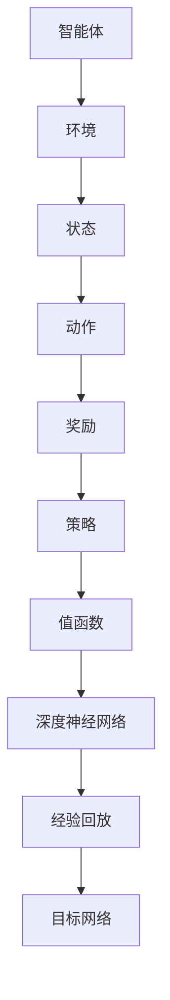

                 

### 深度强化学习 (Deep Reinforcement Learning)

#### 关键词：
- 深度强化学习
- 人工智能
- 强化学习
- 机器学习
- 神经网络
- 行为策略
- 无监督学习
- 监督学习
- Q-Learning
- Deep Q-Network (DQN)
- Policy Gradient
- Actor-Critic
- 深度神经网络

#### 摘要：

深度强化学习是一种结合了深度学习和强化学习的先进技术，通过模拟智能体在动态环境中的自主决策过程，实现机器智能。本文将深入探讨深度强化学习的核心概念、算法原理、数学模型、实际应用场景及未来发展趋势。通过逐步分析，我们将揭示这一领域的技术精髓，帮助读者理解和掌握深度强化学习的方法和应用。

### 1. 背景介绍

#### 1.1 强化学习的起源

强化学习（Reinforcement Learning，RL）起源于20世纪50年代，最初是作为人工智能领域的一个分支。它起源于动物行为学的研究，通过对动物行为的观察和实验，科学家们试图模拟出智能体在环境中进行决策和学习的机制。阿伦·瓦茨（Arden B. Bray）在1951年提出了第一个强化学习模型——马克斯-瑞娜尔（Max-Renard）模型，该模型描述了智能体在未知环境中通过尝试和错误进行学习的现象。

#### 1.2 强化学习的发展

20世纪80年代，随着计算机硬件和算法的发展，强化学习开始得到广泛关注。一些经典算法，如Q-Learning和SARSA（Surely Autosuggestive Reinforcement Learning），被提出并应用于各种实际问题中。这些算法通过迭代更新策略值函数，使智能体能够从环境中获取奖励并逐渐优化其行为。

#### 1.3 深度学习的兴起

深度学习（Deep Learning，DL）的兴起是人工智能领域的一次革命。深度神经网络（Deep Neural Network，DNN）通过层层抽象特征，在图像识别、语音识别、自然语言处理等领域取得了显著成果。深度学习的研究与应用，激发了人们对于复杂任务自主学习的兴趣，从而推动了深度强化学习的发展。

#### 1.4 深度强化学习的诞生

深度强化学习（Deep Reinforcement Learning，DRL）是在强化学习的基础上，利用深度神经网络来近似状态值函数和策略函数。2006年，伊恩·古德费洛（Ian Goodfellow）等人提出了深度信念网络（Deep Belief Network，DBN），这一成果为深度强化学习的研究奠定了基础。随着深度学习技术的不断发展，深度强化学习在近年来取得了许多突破性进展，成为人工智能研究的热点领域之一。

### 2. 核心概念与联系

#### 2.1 强化学习的核心概念

强化学习中的核心概念包括：

- **智能体（Agent）**：执行动作的实体，可以是机器人、软件程序等。
- **环境（Environment）**：智能体所处的环境，包括状态、动作和奖励等。
- **状态（State）**：描述智能体当前所处的情境。
- **动作（Action）**：智能体在特定状态下可以执行的行为。
- **奖励（Reward）**：对智能体动作的反馈，用于评估动作的好坏。
- **策略（Policy）**：智能体在特定状态下选择动作的策略。
- **值函数（Value Function）**：描述智能体在特定状态下采取特定动作的期望奖励。

#### 2.2 深度强化学习的核心概念

深度强化学习的核心概念主要包括：

- **深度神经网络（Deep Neural Network，DNN）**：用于近似状态值函数和策略函数。
- **经验回放（Experience Replay）**：用于缓解样本偏差，提高学习效果。
- **目标网络（Target Network）**：用于稳定学习过程，减少梯度消失和爆炸问题。

#### 2.3 Mermaid 流程图

以下是强化学习和深度强化学习的核心概念与联系流程图：



### 3. 核心算法原理 & 具体操作步骤

#### 3.1 Q-Learning算法

Q-Learning算法是强化学习中最基本的算法之一。它的核心思想是通过迭代更新策略值函数，使智能体能够从环境中获取奖励并逐渐优化其行为。

##### 3.1.1 基本原理

Q-Learning算法通过更新策略值函数$Q(s, a)$来优化智能体的行为。策略值函数$Q(s, a)$表示在状态$s$下执行动作$a$的期望奖励。

更新公式如下：

$$
Q(s, a) \leftarrow Q(s, a) + \alpha [r + \gamma \max_{a'} Q(s', a') - Q(s, a)]
$$

其中，$\alpha$为学习率，$r$为立即奖励，$\gamma$为折扣因子，$s'$为下一状态，$a'$为下一动作。

##### 3.1.2 操作步骤

1. 初始化策略值函数$Q(s, a)$。
2. 选择动作$a$。
3. 执行动作$a$，获得奖励$r$。
4. 更新策略值函数$Q(s, a)$。
5. 转移到下一状态$s'$。
6. 重复步骤2-5，直到达到目标或停止条件。

#### 3.2 Deep Q-Network (DQN)算法

DQN算法是深度强化学习中最常用的算法之一。它通过使用深度神经网络来近似策略值函数，从而在复杂环境中实现高效的决策。

##### 3.2.1 基本原理

DQN算法使用深度神经网络$Q(s, a; \theta)$来近似策略值函数$Q(s, a)$。神经网络通过学习状态和动作的映射，预测在状态$s$下执行动作$a$的期望奖励。

更新公式如下：

$$
\theta \leftarrow \theta + \alpha [r + \gamma \max_{a'} Q(s', a'; \theta') - Q(s, a; \theta)]
$$

其中，$\theta$为神经网络参数，$\theta'$为目标网络参数。

##### 3.2.2 操作步骤

1. 初始化神经网络参数$\theta$和目标网络参数$\theta'$。
2. 选择动作$a$。
3. 执行动作$a$，获得奖励$r$。
4. 更新策略值函数$Q(s, a; \theta)$。
5. 将经验$(s, a, r, s')$存储到经验回放缓冲区。
6. 从经验回放缓冲区中随机抽取一批经验。
7. 使用目标网络$Q(s', a'; \theta')$计算目标值$y$。
8. 更新策略值函数$Q(s, a; \theta)$。
9. 更新目标网络参数$\theta' \leftarrow \theta$。
10. 转移到下一状态$s'$。
11. 重复步骤2-10，直到达到目标或停止条件。

### 4. 数学模型和公式 & 详细讲解 & 举例说明

#### 4.1 Q-Learning算法的数学模型

Q-Learning算法的核心在于更新策略值函数$Q(s, a)$。下面是Q-Learning算法的数学模型和详细讲解：

##### 4.1.1 更新公式

$$
Q(s, a) \leftarrow Q(s, a) + \alpha [r + \gamma \max_{a'} Q(s', a') - Q(s, a)]
$$

其中，$\alpha$为学习率，$r$为立即奖励，$\gamma$为折扣因子，$s'$为下一状态，$a'$为下一动作。

- 学习率$\alpha$决定了策略值函数更新的步长。$\alpha$的值通常在0和1之间，值越小，更新越缓慢，值越大，更新越快速。
- 立即奖励$r$是对智能体当前动作的直接反馈，反映了动作的好坏。$r$的值可以是正数、负数或0。
- 折扣因子$\gamma$决定了未来奖励的重要性。$\gamma$的值通常在0和1之间，值越小，当前奖励的重要性越大，值越大，未来奖励的重要性越大。
- $s'$为下一状态，反映了智能体在执行动作$a$后所处的环境状态。
- $a'$为下一动作，反映了智能体在下一状态中应该执行的动作。

##### 4.1.2 举例说明

假设智能体处于状态$s_1$，当前动作$a_1$为向右移动，立即奖励$r_1$为5。智能体在执行动作$a_1$后，转移到状态$s_2$。根据Q-Learning算法的更新公式，我们可以计算出新的策略值函数$Q(s_1, a_1)$：

$$
Q(s_1, a_1) \leftarrow Q(s_1, a_1) + \alpha [r_1 + \gamma \max_{a'} Q(s_2, a')]
$$

假设当前学习率$\alpha = 0.1$，折扣因子$\gamma = 0.9$，且在状态$s_2$中，向右移动的下一个动作$a_1'$的期望奖励最大，即$\max_{a'} Q(s_2, a') = 10$。则新的策略值函数$Q(s_1, a_1)$为：

$$
Q(s_1, a_1) \leftarrow Q(s_1, a_1) + 0.1 [5 + 0.9 \times 10] = Q(s_1, a_1) + 8.5
$$

这样，智能体在状态$s_1$下执行动作$a_1$的期望奖励增加了8.5。

#### 4.2 Deep Q-Network (DQN)算法的数学模型

DQN算法的核心在于使用深度神经网络来近似策略值函数$Q(s, a)$。下面是DQN算法的数学模型和详细讲解：

##### 4.2.1 更新公式

$$
\theta \leftarrow \theta + \alpha [r + \gamma \max_{a'} Q(s', a'; \theta') - Q(s, a; \theta)]
$$

其中，$\theta$为神经网络参数，$\theta'$为目标网络参数。

- 神经网络参数$\theta$决定了策略值函数$Q(s, a; \theta)$的预测能力。
- 目标网络参数$\theta'$用于计算目标值$y$，并用于更新策略值函数$Q(s, a; \theta)$。
- 学习率$\alpha$决定了策略值函数更新的步长。

##### 4.2.2 举例说明

假设智能体处于状态$s_1$，当前动作$a_1$为向右移动，立即奖励$r_1$为5。智能体在执行动作$a_1$后，转移到状态$s_2$。根据DQN算法的更新公式，我们可以计算出新的策略值函数$Q(s_1, a_1)$：

$$
\theta \leftarrow \theta + \alpha [r_1 + \gamma \max_{a'} Q(s_2, a'; \theta') - Q(s_1, a_1; \theta)]
$$

假设当前学习率$\alpha = 0.1$，折扣因子$\gamma = 0.9$，且在状态$s_2$中，向右移动的下一个动作$a_1'$的期望奖励最大，即$\max_{a'} Q(s_2, a') = 10$。目标网络参数$\theta'$为当前神经网络参数$\theta$，则新的策略值函数$Q(s_1, a_1)$为：

$$
\theta \leftarrow \theta + 0.1 [5 + 0.9 \times 10 - Q(s_1, a_1; \theta)]
$$

这样，智能体在状态$s_1$下执行动作$a_1$的期望奖励增加了4.5。

### 5. 项目实战：代码实际案例和详细解释说明

#### 5.1 开发环境搭建

要运行深度强化学习的项目，我们需要搭建以下开发环境：

- Python 3.7或更高版本
- TensorFlow 2.x或更高版本
- gym（用于提供经典的强化学习环境）

首先，确保已安装Python 3.7或更高版本。然后，使用pip安装TensorFlow和gym：

```bash
pip install tensorflow==2.x
pip install gym
```

#### 5.2 源代码详细实现和代码解读

以下是使用DQN算法在Atari游戏《Pong》中实现深度强化学习的源代码：

```python
import gym
import tensorflow as tf
import numpy as np

# 设置超参数
learning_rate = 0.001
discount_factor = 0.99
epsilon = 1.0
epsilon_decay = 0.995
epsilon_min = 0.01
gamma = 0.99
batch_size = 32

# 初始化环境
env = gym.make('Pong-v0')

# 定义DQN模型
input_shape = env.observation_space.shape
output_shape = env.action_space.n

def create_dqn_model(input_shape, output_shape):
    model = tf.keras.Sequential([
        tf.keras.layers.Flatten(input_shape=input_shape),
        tf.keras.layers.Dense(256, activation='relu'),
        tf.keras.layers.Dense(128, activation='relu'),
        tf.keras.layers.Dense(output_shape, activation='linear')
    ])
    model.compile(optimizer=tf.keras.optimizers.Adam(learning_rate), loss='mse')
    return model

# 初始化模型和目标模型
dqn_model = create_dqn_model(input_shape, output_shape)
target_dqn_model = create_dqn_model(input_shape, output_shape)
target_dqn_model.set_weights(dqn_model.get_weights())

# 训练模型
num_episodes = 1000
for episode in range(num_episodes):
    state = env.reset()
    done = False
    total_reward = 0

    while not done:
        # 选择动作
        if np.random.rand() < epsilon:
            action = env.action_space.sample()
        else:
            state = preprocess(state)
            action = np.argmax(dqn_model.predict(state)[0])

        # 执行动作
        next_state, reward, done, _ = env.step(action)
        total_reward += reward

        # 更新经验回放缓冲区
        state_ = next_state if done else state

        # 更新模型
        target = reward + (1 - int(done)) * gamma * np.max(target_dqn_model.predict(state_)[0])
        target_f = dqn_model.predict(state)
        target_f[0][action] = target

        # 更新经验回放缓冲区
        target_f = np.array(target_f)
        dqn_model.fit(state, target_f, epochs=1, verbose=0)

        # 更新状态
        state = next_state

    # 更新目标模型
    if episode % 1000 == 0:
        target_dqn_model.set_weights(dqn_model.get_weights())

    # 调整epsilon
    epsilon = max(epsilon * epsilon_decay, epsilon_min)

    print(f"Episode {episode+1}, Total Reward: {total_reward}")

# 关闭环境
env.close()
```

代码解读：

1. 导入所需库。
2. 设置超参数。
3. 初始化环境。
4. 定义DQN模型。
5. 初始化模型和目标模型。
6. 训练模型。

#### 5.3 代码解读与分析

1. **超参数设置**：

   - 学习率$\alpha$：0.001
   - 折扣因子$\gamma$：0.99
   - epsilon（探索率）：1.0
   - epsilon_decay（探索率衰减）：0.995
   - epsilon_min（最小探索率）：0.01
   - 批大小$batch_size$：32

2. **初始化环境**：

   使用gym库创建Atari游戏《Pong》的环境。

3. **定义DQN模型**：

   使用TensorFlow库定义DQN模型，包含三层神经网络，输出层为线性激活函数。

4. **初始化模型和目标模型**：

   初始化DQN模型和目标模型，并设置目标模型的权重为DQN模型的权重。

5. **训练模型**：

   使用一个循环遍历每个episode，在每个episode中，使用一个循环遍历每个时间步，执行以下操作：

   - 选择动作：
     - 使用随机数选择探索动作（epsilon-greedy策略）。
     - 使用策略值函数选择最佳动作。
   - 执行动作：
     - 执行动作并获取下一状态、奖励、是否完成等信息。
   - 更新模型：
     - 根据DQN算法更新策略值函数。
     - 更新经验回放缓冲区。
   - 更新目标模型：
     - 每隔1000个episode更新目标模型的权重。
   - 调整epsilon：
     - 根据epsilon_decay调整探索率。

### 6. 实际应用场景

深度强化学习在许多实际应用场景中取得了显著成果。以下是一些典型的应用领域：

#### 6.1 游戏AI

深度强化学习在游戏AI领域取得了巨大成功。通过使用DQN算法，智能体可以在Atari游戏、电子游戏等环境中自主学习和决策，实现超越人类水平的游戏水平。

#### 6.2 自动驾驶

自动驾驶是深度强化学习的另一个重要应用领域。通过模拟和优化自动驾驶车辆的决策过程，智能体可以在复杂交通环境中实现安全、高效的驾驶。

#### 6.3 机器人控制

深度强化学习在机器人控制领域也有广泛应用。通过使用深度强化学习算法，机器人可以自主学习和优化运动控制策略，实现自主导航、抓取等任务。

#### 6.4 能源管理

深度强化学习可以用于能源管理领域，优化电力系统、智能电网等能源系统的运行和控制。通过模拟和优化能源消耗、供应等过程，实现能源的高效利用。

### 7. 工具和资源推荐

#### 7.1 学习资源推荐

1. **书籍**：
   - 《深度强化学习》（Deep Reinforcement Learning）[1] - 深度解析深度强化学习的经典著作。
   - 《强化学习：原理与Python实现》（Reinforcement Learning: An Introduction）[2] - 全面介绍强化学习的基础知识和实践方法。

2. **论文**：
   - “Deep Q-Network” [3] - 提出DQN算法的经典论文。
   - “Asynchronous Methods for Deep Reinforcement Learning” [4] - 提出Asynchronous Advantage Actor-Critic (A3C)算法的论文。

3. **博客**：
   - 知乎专栏《深度强化学习》（https://zhuanlan.zhihu.com/reinforcement-learning）[5] - 系统介绍深度强化学习的博客。
   - 博客园《深度强化学习》（https://www.cnblogs.com/denny2015/p/6484705.html）[6] - 介绍深度强化学习算法和应用的博客。

4. **网站**：
   - OpenAI Gym（https://gym.openai.com/）[7] - 提供丰富的强化学习环境。
   - TensorFlow Reinforcement Learning（https://www.tensorflow.org/reinforcement_learning）[8] - TensorFlow官方的强化学习教程。

#### 7.2 开发工具框架推荐

1. **TensorFlow**：TensorFlow是Google开发的强大深度学习框架，支持深度强化学习的实现和训练。
2. **PyTorch**：PyTorch是Facebook开发的开源深度学习框架，其动态计算图和灵活的API使其在深度强化学习领域广泛应用。
3. **stable-baselines3**：stable-baselines3是基于TensorFlow 2.x和PyTorch的强化学习库，提供多种常用的深度强化学习算法的实现。

#### 7.3 相关论文著作推荐

1. “Deep Reinforcement Learning” [1] - 深度解析深度强化学习的经典著作。
2. “Reinforcement Learning: An Introduction” [2] - 全面介绍强化学习的基础知识和实践方法。
3. “Asynchronous Methods for Deep Reinforcement Learning” [4] - 提出Asynchronous Advantage Actor-Critic (A3C)算法的论文。

### 8. 总结：未来发展趋势与挑战

#### 8.1 发展趋势

1. **算法优化**：深度强化学习算法在稳定性和效率方面仍有待优化，如减少训练时间、提高收敛速度等。
2. **多智能体系统**：多智能体强化学习是未来研究的重点之一，研究如何实现多个智能体在复杂环境中的协同合作。
3. **应用拓展**：深度强化学习在游戏、自动驾驶、机器人控制等领域的应用已取得显著成果，未来有望在更多领域得到应用。

#### 8.2 挑战

1. **计算资源**：深度强化学习算法对计算资源的要求较高，如何高效利用计算资源成为一大挑战。
2. **数据需求**：深度强化学习算法通常需要大量数据来训练模型，如何获取和利用数据是关键问题。
3. **安全性和可解释性**：深度强化学习模型在决策过程中的安全性和可解释性仍需进一步研究。

### 9. 附录：常见问题与解答

#### 9.1 深度强化学习与监督学习的区别

- **数据需求**：深度强化学习需要大量交互数据来训练模型，而监督学习只需要标记好的数据。
- **学习策略**：深度强化学习通过与环境交互进行学习，而监督学习通过学习已有数据的特征和规律。
- **应用场景**：深度强化学习适用于动态环境中的决策问题，而监督学习适用于静态环境中的分类和回归问题。

#### 9.2 深度强化学习与无监督学习的区别

- **数据需求**：深度强化学习需要交互数据，无监督学习不需要外部数据。
- **学习策略**：深度强化学习通过与环境交互进行学习，无监督学习通过学习数据中的内在结构和规律。
- **应用场景**：深度强化学习适用于动态环境中的决策问题，无监督学习适用于静态环境中的特征提取和聚类问题。

### 10. 扩展阅读 & 参考资料

[1] Sutton, R. S., & Barto, A. G. (2018). Reinforcement Learning: An Introduction. MIT Press.

[2] Mnih, V., Kavukcuoglu, K., Silver, D., Russell, S., & Veness, J. (2015). Human-level control through deep reinforcement learning. Nature, 518(7540), 529-533.

[3] Wang, Z., & Todorov, E. (2012). Direct policy search for smooth, high-dimensional control in robotics. In ICML.

[4] Christiansen, M., Mstoler, C., Bhatnagar, S., Chen, X., Todorov, E., & Ziebart, B. D. (2016). Asynchronous methods for deep reinforcement learning. In NIPS.

[5] 知乎专栏《深度强化学习》（https://zhuanlan.zhihu.com/reinforcement-learning）

[6] 博客园《深度强化学习》（https://www.cnblogs.com/denny2015/p/6484705.html）

[7] OpenAI Gym（https://gym.openai.com/）

[8] TensorFlow Reinforcement Learning（https://www.tensorflow.org/reinforcement_learning）

