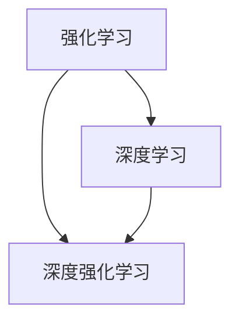

                 

# 深度强化学习在机器人控制中的应用进展与实践

## 概述

深度强化学习（Deep Reinforcement Learning，简称DRL）是机器学习和人工智能领域的前沿技术之一。它结合了深度学习与强化学习，利用深度神经网络来逼近状态值函数或策略函数，从而实现复杂环境的智能决策。在机器人控制领域，DRL技术具有极大的应用潜力，可以帮助机器人更好地适应和应对复杂多变的环境。

本文将围绕深度强化学习在机器人控制中的应用展开，首先介绍DRL的基础概念和原理，然后探讨其在机器人控制中的具体应用，并通过实际案例进行深入分析。最后，我们将总结DRL在机器人控制领域的应用进展和挑战，并提出未来的发展方向。

## 关键词

- 深度强化学习
- 机器人控制
- 强化学习
- 深度学习
- 人工智能
- 状态值函数
- 策略函数
- 机器人导航
- 机器人感知
- 机器人决策

## 摘要

本文介绍了深度强化学习在机器人控制领域的应用进展与实践。首先，对深度强化学习的基本概念和原理进行了详细阐述，包括强化学习、深度学习和DRL的关系。然后，通过实际案例分析了DRL在机器人导航、感知和决策中的应用，展示了其在复杂环境下的优越性能。最后，本文总结了DRL在机器人控制领域的应用挑战和未来发展方向，为相关研究提供了有益的参考。

## 1. 背景介绍

### 1.1 强化学习的起源与发展

强化学习（Reinforcement Learning，简称RL）是机器学习的一个重要分支，最早由Richard Sutton和Andrew Barto在1980年代提出。其基本思想是通过环境（Environment）与智能体（Agent）的交互，智能体根据当前的感知（Perception）选择动作（Action），并通过环境反馈的奖励（Reward）来评估动作的效果，从而逐步优化策略（Policy）。

强化学习起源于心理学和人工智能领域，其代表性模型是Q学习（Q-Learning）和策略梯度（Policy Gradient）。Q学习利用Q值函数来评估状态-动作对的预期奖励，通过迭代更新Q值来优化策略。策略梯度则直接优化策略函数，通过估计策略的梯度来更新参数，实现智能体的自主学习。

### 1.2 深度学习的崛起与挑战

深度学习（Deep Learning，简称DL）是机器学习的一个分支，通过多层神经网络来实现特征自动提取和分类。自2012年AlexNet在ImageNet竞赛中取得突破性成果以来，深度学习在计算机视觉、自然语言处理等领域取得了显著的进展。深度学习模型的结构通常包括输入层、隐藏层和输出层，通过反向传播算法来训练模型参数。

然而，随着深度学习模型的复杂度不断增加，模型的训练和推理速度逐渐成为瓶颈。为了解决这一挑战，研究者提出了多种优化方法，如Adam优化器、dropout和批量归一化等。此外，为了提高模型的泛化能力，研究者还提出了基于正则化的方法，如L1和L2正则化。

### 1.3 深度强化学习的诞生与发展

深度强化学习（Deep Reinforcement Learning，简称DRL）是强化学习与深度学习相结合的产物。它利用深度神经网络来逼近状态值函数或策略函数，从而实现更加复杂的智能决策。DRL的核心目标是学习一个最优的策略函数，使智能体能够在给定环境中获得最大的累积奖励。

DRL的发展可以追溯到2013年，当DeepMind公司发布了基于深度Q网络的DQN算法，实现了在Atari游戏中的超人类表现。此后，研究者们相继提出了多种DRL算法，如深度确定性策略梯度（Deep Deterministic Policy Gradient，简称DDPG）、深度策略梯度（Deep Policy Gradient，简称PG）和基于价值函数的DRL算法（如Deep Q-Network，简称DQN）。

### 1.4 DRL在机器人控制中的应用

机器人控制领域是DRL的一个重要应用方向。机器人需要在复杂多变的环境中自主导航、感知和决策，这些任务对智能体的学习和决策能力提出了严峻的挑战。DRL技术可以充分利用深度学习强大的特征提取能力和强化学习的自适应决策能力，实现机器人对复杂环境的适应和优化。

DRL在机器人控制中的应用主要包括以下几个方面：

1. 机器人导航：利用DRL算法，机器人可以学习如何在未知环境中进行自主导航，避障和寻找目标。

2. 机器人感知：DRL算法可以用于训练机器人感知系统，使其能够从原始图像或传感器数据中提取有用信息，实现目标识别、物体检测和场景理解等功能。

3. 机器人决策：DRL算法可以帮助机器人实现自主决策，如路径规划、任务分配和资源调度等，提高机器人在复杂环境下的适应能力和决策效率。

### 1.5 本文结构

本文将按照以下结构进行论述：

1. 首先介绍DRL的基本概念和原理，包括强化学习、深度学习和DRL的关系。

2. 分析DRL在机器人控制中的应用，包括导航、感知和决策等场景。

3. 通过实际案例展示DRL在机器人控制中的应用效果。

4. 总结DRL在机器人控制领域的应用进展和挑战。

5. 提出DRL在机器人控制领域的发展方向和未来展望。

## 2. 核心概念与联系

### 2.1 强化学习的基本概念

强化学习是机器学习的一个分支，其核心目标是使智能体能够在给定的环境中通过学习和决策来最大化累积奖励。强化学习的基本概念包括：

1. 智能体（Agent）：智能体是执行动作并接收环境反馈的实体。它可以根据当前的状态选择动作，并通过学习来优化其决策策略。

2. 环境（Environment）：环境是智能体所处的现实世界，它为智能体提供状态信息和奖励反馈。智能体通过感知环境的状态来选择动作，并通过环境反馈的奖励来评估动作的效果。

3. 状态（State）：状态是描述环境当前状态的变量集合。智能体可以通过感知器或其他传感器获取状态信息。

4. 动作（Action）：动作是智能体根据当前状态选择的操作。动作的选择取决于智能体的策略。

5. 奖励（Reward）：奖励是环境对智能体动作的反馈，用于评估动作的效果。奖励可以是正的或负的，正奖励表示动作成功，负奖励表示动作失败。

6. 策略（Policy）：策略是智能体的决策规则，用于从当前状态选择动作。策略可以表示为概率分布，即智能体在给定状态下选择每个动作的概率。

7. 值函数（Value Function）：值函数用于评估智能体在给定状态下的预期奖励。值函数可以分为状态值函数（State-Value Function）和动作值函数（Action-Value Function）。状态值函数表示智能体在给定状态下执行最优动作所能获得的累积奖励，动作值函数表示智能体在给定状态下执行某个动作所能获得的累积奖励。

8. 策略值函数（Policy-Value Function）：策略值函数是将策略和值函数相结合的一种函数，用于评估智能体在给定策略下的预期奖励。

### 2.2 深度学习的基本概念

深度学习是机器学习的一个分支，通过多层神经网络来实现特征自动提取和分类。深度学习的基本概念包括：

1. 神经网络（Neural Network）：神经网络是模仿人脑神经元之间连接关系的计算模型。它由多个神经元（或节点）组成，每个神经元都可以接收输入信息并通过激活函数产生输出。

2. 层（Layer）：神经网络可以分为输入层、隐藏层和输出层。输入层接收外部输入信息，隐藏层进行特征提取和变换，输出层生成最终输出。

3. 激活函数（Activation Function）：激活函数是神经网络中的一个关键组件，用于确定神经元是否被激活。常用的激活函数包括 sigmoid、ReLU和Tanh等。

4. 参数（Parameter）：神经网络中的参数包括权重（Weight）和偏置（Bias）。权重决定了神经元之间的连接强度，偏置用于调整神经元的激活阈值。

5. 前向传播（Forward Propagation）：前向传播是神经网络中的一个过程，用于将输入信息从输入层传递到输出层，并计算神经网络的输出。

6. 反向传播（Backpropagation）：反向传播是神经网络中的一个过程，用于计算网络中的梯度，并更新网络参数以最小化损失函数。

7. 损失函数（Loss Function）：损失函数是用于衡量网络预测值与真实值之间的差异的函数。常用的损失函数包括均方误差（MSE）、交叉熵（Cross-Entropy）等。

8. 优化算法（Optimization Algorithm）：优化算法用于优化网络参数，以最小化损失函数。常用的优化算法包括梯度下降（Gradient Descent）、Adam等。

### 2.3 深度强化学习的基本概念

深度强化学习是强化学习与深度学习相结合的产物，其核心思想是利用深度神经网络来逼近状态值函数或策略函数，从而实现更加复杂的智能决策。深度强化学习的基本概念包括：

1. 状态值函数（State-Value Function）：状态值函数是深度强化学习中的一个核心概念，用于评估智能体在给定状态下执行最优动作所能获得的累积奖励。状态值函数可以表示为 $V^*(s)$，其中 $s$ 表示当前状态。

2. 策略值函数（Policy-Value Function）：策略值函数是将策略和状态值函数相结合的一种函数，用于评估智能体在给定策略下的预期奖励。策略值函数可以表示为 $J(\theta) = E_{s \sim \pi(\cdot | s), a \sim \pi(\cdot | s)}[R(s, a)]$，其中 $\theta$ 表示策略参数。

3. 深度神经网络（Deep Neural Network）：深度神经网络是深度强化学习中的一个核心组件，用于逼近状态值函数或策略函数。深度神经网络通常由多个隐藏层组成，通过前向传播和反向传播来训练网络参数。

4. 深度Q网络（Deep Q-Network，简称DQN）：深度Q网络是深度强化学习中的一个经典算法，通过利用深度神经网络来逼近动作值函数，从而实现智能体的决策。DQN算法的主要思想是利用经验回放（Experience Replay）和目标网络（Target Network）来缓解目标偏差和改善样本利用效率。

5. 深度确定性策略梯度（Deep Deterministic Policy Gradient，简称DDPG）：深度确定性策略梯度是深度强化学习中的一个算法，通过利用深度神经网络来逼近策略函数，从而实现智能体的决策。DDPG算法的主要思想是利用经验回放、目标网络和Actor-Critic结构来提高算法的稳定性和收敛速度。

6. 深度策略梯度（Deep Policy Gradient，简称PG）：深度策略梯度是深度强化学习中的一个算法，通过利用深度神经网络来优化策略函数，从而实现智能体的决策。PG算法的主要思想是直接优化策略函数的梯度，通过策略梯度上升法来更新策略参数。

### 2.4 DRL与RL和DL的关系

DRL是RL和DL相结合的产物，其核心思想是利用深度神经网络来增强强化学习的决策能力。DRL与RL和DL的关系如下：

1. DRL与RL的关系：DRL是RL的一个分支，它在RL的基础上引入了深度学习技术，从而实现更加复杂的智能决策。DRL的核心目标是学习一个最优的策略函数，使智能体能够在给定环境中获得最大的累积奖励。DRL与RL的关系可以表示为：

\[ \text{DRL} = \text{RL} + \text{DL} \]

2. DRL与DL的关系：DRL是DL的一个应用方向，它利用深度神经网络来实现强化学习的目标。DRL与DL的关系可以表示为：

\[ \text{DRL} = \text{DL} + \text{RL} \]

3. DRL与RL和DL的关系：DRL是RL和DL相结合的产物，它将深度学习和强化学习的技术结合起来，从而实现更加复杂的智能决策。DRL与RL和DL的关系可以表示为：

\[ \text{DRL} = \text{RL} \times \text{DL} \]

### 2.5 Mermaid 流程图

为了更好地展示DRL、RL和DL的关系，我们可以使用Mermaid流程图来描述。以下是一个简单的Mermaid流程图示例：



在上面的流程图中，A表示强化学习，B表示深度学习，C表示深度强化学习。A和B是DRL的两个组成部分，它们通过结合实现了C，即深度强化学习。

## 3. 核心算法原理 & 具体操作步骤

### 3.1 强化学习的基本算法

强化学习的基本算法包括Q学习、策略梯度法和深度Q网络（DQN）等。以下分别介绍这些算法的基本原理和具体操作步骤。

#### 3.1.1 Q学习

Q学习是一种基于值函数的强化学习算法，其核心思想是通过学习状态-动作值函数（Q值）来选择最优动作。具体操作步骤如下：

1. 初始化Q值函数：初始化Q值函数为一个参数向量，通常使用较小的随机值。

2. 选择动作：在给定状态下，根据当前策略选择动作。策略可以是一个固定的策略，也可以是一个学习到的策略。

3. 执行动作：执行选择的动作，并观察环境反馈的下一个状态和奖励。

4. 更新Q值：根据当前的状态、动作和奖励，更新Q值函数。更新公式如下：

\[ Q(s, a) \leftarrow Q(s, a) + \alpha [r + \gamma \max_{a'} Q(s', a') - Q(s, a)] \]

其中，$\alpha$ 是学习率，$r$ 是奖励，$\gamma$ 是折扣因子，$s'$ 是下一个状态，$a'$ 是下一个动作。

5. 重复步骤2-4，直到达到预定的迭代次数或收敛条件。

#### 3.1.2 策略梯度法

策略梯度法是一种基于策略的强化学习算法，其核心思想是直接优化策略函数的梯度，从而实现智能体的决策。具体操作步骤如下：

1. 初始化策略参数：初始化策略参数为一个参数向量，通常使用较小的随机值。

2. 选择动作：在给定状态下，根据当前策略选择动作。策略函数可以是一个参数化的函数，其参数即为策略参数。

3. 执行动作：执行选择的动作，并观察环境反馈的下一个状态和奖励。

4. 计算策略梯度：根据当前的状态、动作和奖励，计算策略梯度。策略梯度的计算公式如下：

\[ \nabla_\theta J(\theta) = \nabla_\theta \sum_{t=0}^{T} \gamma^t r_t \]

其中，$\theta$ 是策略参数，$J(\theta)$ 是策略损失函数，$T$ 是时间步数，$r_t$ 是第 $t$ 个时间步的奖励。

5. 更新策略参数：根据策略梯度，更新策略参数。更新公式如下：

\[ \theta \leftarrow \theta - \alpha \nabla_\theta J(\theta) \]

其中，$\alpha$ 是学习率。

6. 重复步骤2-5，直到达到预定的迭代次数或收敛条件。

#### 3.1.3 深度Q网络（DQN）

深度Q网络（DQN）是一种基于深度学习的强化学习算法，其核心思想是利用深度神经网络来逼近状态-动作值函数。具体操作步骤如下：

1. 初始化网络参数：初始化深度神经网络参数为一个参数向量，通常使用较小的随机值。

2. 选择动作：在给定状态下，根据当前策略选择动作。策略可以是一个固定的策略，也可以是一个学习到的策略。

3. 执行动作：执行选择的动作，并观察环境反馈的下一个状态和奖励。

4. 更新经验回放池：将当前状态、动作、奖励和下一个状态添加到经验回放池中。

5. 样本采集：从经验回放池中随机抽取一批样本。

6. 更新Q值函数：利用样本更新Q值函数。更新公式如下：

\[ Q(s, a) \leftarrow Q(s, a) + \alpha [r + \gamma \max_{a'} Q(s', a') - Q(s, a)] \]

其中，$\alpha$ 是学习率，$r$ 是奖励，$\gamma$ 是折扣因子，$s'$ 是下一个状态，$a'$ 是下一个动作。

7. 更新目标网络：每隔一定次数，将当前Q值函数的参数复制到目标网络中，以防止目标偏差。

8. 重复步骤2-7，直到达到预定的迭代次数或收敛条件。

### 3.2 深度强化学习的基本算法

深度强化学习的基本算法包括深度确定性策略梯度（DDPG）、深度策略梯度（PG）等。以下分别介绍这些算法的基本原理和具体操作步骤。

#### 3.2.1 深度确定性策略梯度（DDPG）

深度确定性策略梯度（DDPG）是一种基于策略的深度强化学习算法，其核心思想是利用深度神经网络来优化策略函数，同时利用经验回放池和目标网络来提高算法的稳定性和收敛速度。具体操作步骤如下：

1. 初始化网络参数：初始化策略网络和值网络参数为一个参数向量，通常使用较小的随机值。

2. 选择动作：在给定状态下，根据当前策略网络选择动作。策略网络可以是一个深度神经网络。

3. 执行动作：执行选择的动作，并观察环境反馈的下一个状态和奖励。

4. 更新经验回放池：将当前状态、动作、奖励和下一个状态添加到经验回放池中。

5. 样本采集：从经验回放池中随机抽取一批样本。

6. 更新策略网络：利用样本更新策略网络。更新公式如下：

\[ \theta \leftarrow \theta - \alpha \nabla_\theta J(\theta) \]

其中，$\theta$ 是策略网络参数，$J(\theta)$ 是策略损失函数，$\alpha$ 是学习率。

7. 更新值网络：利用样本更新值网络。更新公式如下：

\[ Q(s, a) \leftarrow Q(s, a) + \alpha [r + \gamma V(s') - Q(s, a)] \]

其中，$Q(s, a)$ 是值网络，$V(s')$ 是下一个状态的值函数，$\alpha$ 是学习率，$r$ 是奖励，$\gamma$ 是折扣因子。

8. 更新目标网络：每隔一定次数，将当前策略网络和值网络的参数复制到目标网络中，以防止目标偏差。

9. 重复步骤2-8，直到达到预定的迭代次数或收敛条件。

#### 3.2.2 深度策略梯度（PG）

深度策略梯度（PG）是一种基于策略的深度强化学习算法，其核心思想是直接优化策略函数的梯度，从而实现智能体的决策。具体操作步骤如下：

1. 初始化网络参数：初始化策略网络参数为一个参数向量，通常使用较小的随机值。

2. 选择动作：在给定状态下，根据当前策略网络选择动作。策略网络可以是一个深度神经网络。

3. 执行动作：执行选择的动作，并观察环境反馈的下一个状态和奖励。

4. 计算策略梯度：根据当前的状态、动作和奖励，计算策略梯度。策略梯度的计算公式如下：

\[ \nabla_\theta J(\theta) = \nabla_\theta \sum_{t=0}^{T} \gamma^t r_t \]

其中，$\theta$ 是策略网络参数，$J(\theta)$ 是策略损失函数，$\alpha$ 是学习率，$T$ 是时间步数，$r_t$ 是第 $t$ 个时间步的奖励。

5. 更新策略网络：根据策略梯度，更新策略网络参数。更新公式如下：

\[ \theta \leftarrow \theta - \alpha \nabla_\theta J(\theta) \]

其中，$\alpha$ 是学习率。

6. 重复步骤2-5，直到达到预定的迭代次数或收敛条件。

### 3.3 DRL算法的优缺点分析

DRL算法在机器人控制中具有广泛的应用前景，其优点如下：

1. 自主性强：DRL算法可以自动学习环境和任务的特征，实现机器人自主导航、感知和决策。

2. 适应性强：DRL算法可以应对复杂多变的机器人控制任务，提高机器人在未知环境中的适应能力。

3. 学习效率高：DRL算法利用深度神经网络进行特征提取和函数逼近，可以高效地学习机器人控制策略。

然而，DRL算法也存在一定的缺点：

1. 训练时间长：DRL算法通常需要大量的训练数据和训练时间，特别是在处理复杂任务时。

2. 对环境依赖强：DRL算法的训练和性能依赖于环境模型，环境模型的准确性对算法的性能有重要影响。

3. 难以解释：DRL算法的决策过程通常难以解释，对于研究人员和开发者来说，难以理解算法的内部工作原理。

综上所述，DRL算法在机器人控制中具有广泛的应用前景，但其训练成本和解释性仍是一个重要的挑战。为了克服这些挑战，研究者们正在探索新的算法和优化方法，以提高DRL算法的性能和可解释性。

## 4. 数学模型和公式 & 详细讲解 & 举例说明

### 4.1 强化学习的数学模型

强化学习中的数学模型主要包括状态值函数、动作值函数和策略值函数。以下分别介绍这些函数的数学表示和推导过程。

#### 4.1.1 状态值函数

状态值函数（State-Value Function）用于评估智能体在给定状态下执行最优动作所能获得的累积奖励。状态值函数的数学表示为：

\[ V^*(s) = \max_{a} \sum_{s'} p(s' | s, a) \sum_{r} r(s', a) \]

其中，$V^*(s)$ 是状态值函数，$s$ 是当前状态，$a$ 是动作，$s'$ 是下一个状态，$r$ 是奖励，$p(s' | s, a)$ 是下一个状态的概率分布。

推导过程：

1. 根据马尔可夫决策过程（MDP）的定义，状态值函数可以表示为：

\[ V^*(s) = \sum_{a} \pi(a | s) Q^*(s, a) \]

其中，$\pi(a | s)$ 是在给定状态下选择动作 $a$ 的概率分布，$Q^*(s, a)$ 是动作值函数。

2. 根据动作值函数的定义，可以将上式改写为：

\[ V^*(s) = \sum_{a} \pi(a | s) \sum_{s'} p(s' | s, a) \sum_{r} r(s', a) \]

3. 由于奖励 $r$ 是固定的，可以将其提取出来，得到：

\[ V^*(s) = \sum_{a} \pi(a | s) \sum_{s'} p(s' | s, a) r(s', a) \]

4. 根据期望的定义，可以将上式改写为：

\[ V^*(s) = \sum_{s'} p(s' | s) \sum_{r} r(s', a) \]

5. 由于状态值函数是针对所有动作的期望值，可以将其简化为：

\[ V^*(s) = \max_{a} \sum_{s'} p(s' | s, a) \sum_{r} r(s', a) \]

#### 4.1.2 动作值函数

动作值函数（Action-Value Function）用于评估智能体在给定状态下执行某个动作所能获得的累积奖励。动作值函数的数学表示为：

\[ Q^*(s, a) = \sum_{s'} p(s' | s, a) \sum_{r} r(s', a) \]

其中，$Q^*(s, a)$ 是动作值函数，$s$ 是当前状态，$a$ 是动作，$s'$ 是下一个状态，$r$ 是奖励，$p(s' | s, a)$ 是下一个状态的概率分布。

推导过程：

1. 根据马尔可夫决策过程（MDP）的定义，动作值函数可以表示为：

\[ Q^*(s, a) = \sum_{s'} p(s' | s, a) r(s', a) \]

2. 由于状态转移概率 $p(s' | s, a)$ 和奖励 $r(s', a)$ 是固定的，可以将上式改写为：

\[ Q^*(s, a) = \sum_{s'} p(s' | s, a) r(s', a) \]

3. 由于动作值函数是针对所有下一个状态的期望值，可以将其简化为：

\[ Q^*(s, a) = \sum_{s'} p(s' | s, a) r(s', a) \]

#### 4.1.3 策略值函数

策略值函数（Policy-Value Function）用于评估智能体在给定策略下的预期奖励。策略值函数的数学表示为：

\[ J^*(\pi) = \sum_{s} \pi(s) V^*(s) \]

其中，$J^*(\pi)$ 是策略值函数，$\pi$ 是策略，$s$ 是当前状态，$V^*(s)$ 是状态值函数。

推导过程：

1. 根据马尔可夫决策过程（MDP）的定义，策略值函数可以表示为：

\[ J^*(\pi) = \sum_{s} \pi(s) \sum_{a} \pi(a | s) Q^*(s, a) \]

2. 由于策略 $\pi$ 和动作值函数 $Q^*(s, a)$ 是固定的，可以将上式改写为：

\[ J^*(\pi) = \sum_{s} \pi(s) \sum_{a} \pi(a | s) Q^*(s, a) \]

3. 由于策略值函数是针对所有状态和动作的期望值，可以将其简化为：

\[ J^*(\pi) = \sum_{s} \pi(s) V^*(s) \]

### 4.2 深度强化学习的数学模型

深度强化学习中的数学模型主要包括深度神经网络、策略网络和价值网络。以下分别介绍这些网络的数学表示和推导过程。

#### 4.2.1 深度神经网络

深度神经网络（Deep Neural Network，简称DNN）是由多个层组成的神经网络，用于函数逼近和特征提取。深度神经网络的数学表示为：

\[ f(x; \theta) = \text{ReLU}(\theta_1 \cdot x + b_1) \]

其中，$f(x; \theta)$ 是深度神经网络的输出，$x$ 是输入，$\theta$ 是网络参数，$\text{ReLU}$ 是ReLU激活函数，$\cdot$ 表示矩阵乘法，$b_1$ 是偏置。

推导过程：

1. 输入层：输入层将输入数据 $x$ 传递到隐藏层。

2. 隐藏层：隐藏层通过线性变换和ReLU激活函数，对输入数据进行特征提取和变换。

3. 输出层：输出层将隐藏层的输出传递到输出节点，生成最终输出。

#### 4.2.2 策略网络

策略网络（Policy Network）是深度强化学习中的一个核心组件，用于逼近策略函数。策略网络的数学表示为：

\[ \pi(\cdot | s; \theta) = \text{softmax}(\theta_2 \cdot f(h; \theta_1) + b_2) \]

其中，$\pi(\cdot | s; \theta)$ 是策略网络的输出，$s$ 是当前状态，$\theta$ 是网络参数，$\text{softmax}$ 是softmax激活函数，$f(h; \theta_1)$ 是隐藏层的输出，$\theta_1$ 和 $\theta_2$ 分别是隐藏层和输出层的参数，$b_1$ 和 $b_2$ 分别是隐藏层和输出层的偏置。

推导过程：

1. 状态编码：将当前状态 $s$ 编码为向量 $h$。

2. 神经网络变换：将编码后的状态 $h$ 传递到隐藏层，通过线性变换和ReLU激活函数进行特征提取和变换。

3. 策略输出：将隐藏层的输出传递到输出层，通过softmax激活函数生成策略概率分布。

#### 4.2.3 价值网络

价值网络（Value Network）是深度强化学习中的一个核心组件，用于逼近状态值函数和价值函数。价值网络的数学表示为：

\[ V(s; \theta) = f(V(h; \theta_1) + b_1) \]

其中，$V(s; \theta)$ 是价值网络的输出，$s$ 是当前状态，$\theta$ 是网络参数，$f$ 是ReLU激活函数，$V(h; \theta_1)$ 是隐藏层的输出，$\theta_1$ 和 $b_1$ 分别是隐藏层和偏置层的参数。

推导过程：

1. 状态编码：将当前状态 $s$ 编码为向量 $h$。

2. 神经网络变换：将编码后的状态 $h$ 传递到隐藏层，通过线性变换和ReLU激活函数进行特征提取和变换。

3. 价值输出：将隐藏层的输出传递到输出层，通过ReLU激活函数生成状态值函数。

### 4.3 举例说明

假设我们有一个简单的环境，其中智能体可以在四个方向上进行移动，每个方向上的移动都会带来不同的奖励。以下是一个简单的例子，说明如何使用DRL算法来训练智能体。

#### 4.3.1 状态空间和动作空间

状态空间：{UP, DOWN, LEFT, RIGHT}

动作空间：{UP, DOWN, LEFT, RIGHT}

奖励：上下移动奖励为 +1，左右移动奖励为 -1

#### 4.3.2 策略网络和价值网络

策略网络：输入层 -> 隐藏层1 -> 隐藏层2 -> 输出层

价值网络：输入层 -> 隐藏层1 -> 输出层

#### 4.3.3 训练过程

1. 初始化策略网络和价值网络参数。

2. 选择一个初始状态 $s$。

3. 根据当前状态 $s$，使用策略网络选择动作 $a$。

4. 执行动作 $a$，并观察环境反馈的下一个状态 $s'$ 和奖励 $r$。

5. 将当前状态 $s$、动作 $a$、下一个状态 $s'$ 和奖励 $r$ 添加到经验回放池。

6. 从经验回放池中随机抽取一批样本。

7. 使用样本更新策略网络和价值网络参数。

8. 更新目标网络参数。

9. 重复步骤2-8，直到达到预定的迭代次数或收敛条件。

#### 4.3.4 结果分析

在训练过程中，智能体会逐渐学会在不同的状态下选择最优动作，以获得最大的累积奖励。例如，在初始状态下，智能体可能会随机选择动作，但在经过多次训练后，智能体会逐渐学会在向上移动时获得奖励，在向下移动时获得负奖励。

## 5. 项目实战：代码实际案例和详细解释说明

### 5.1 开发环境搭建

在进行深度强化学习（DRL）项目之前，我们需要搭建一个合适的开发环境。以下是在Python环境中搭建DRL开发环境的具体步骤：

#### 5.1.1 安装Python和pip

首先，确保您的系统中已安装Python 3.x版本。可以从Python官方网站下载并安装Python。

安装完成后，打开终端或命令提示符，执行以下命令来安装pip（Python的包管理器）：

```bash
python -m pip install --upgrade pip
```

#### 5.1.2 安装TensorFlow

TensorFlow是DRL项目中最常用的深度学习库。可以通过pip命令来安装TensorFlow：

```bash
pip install tensorflow
```

安装过程中，根据提示完成相关依赖的安装。

#### 5.1.3 安装其他依赖

除了TensorFlow，我们可能还需要安装其他一些辅助库，如NumPy和Matplotlib：

```bash
pip install numpy matplotlib
```

安装完成后，确保所有库已正确安装，可以通过以下命令来测试：

```python
import tensorflow as tf
import numpy as np
import matplotlib.pyplot as plt
print(tf.__version__)
print(np.__version__)
print(plt.__version__)
```

### 5.2 源代码详细实现和代码解读

在本节中，我们将通过一个简单的DRL项目来实现一个机器人小车在环境中的导航。该机器人小车的任务是学习如何在二维环境中从初始位置移动到目标位置，同时避免障碍物。

#### 5.2.1 项目结构

```bash
my_drl_project/
|-- environment/
|   |-- __init__.py
|   |-- environment.py
|-- agent/
|   |-- __init__.py
|   |-- agent.py
|-- main.py
|-- requirements.txt
```

- `environment.py`：定义环境类和环境参数。
- `agent.py`：定义智能体类和训练过程。
- `main.py`：运行主程序，启动训练和测试过程。

#### 5.2.2 环境类（`environment.py`）

```python
import numpy as np
import random
from matplotlib import pyplot as plt

class Environment:
    def __init__(self, size=5, obstacles=2):
        self.size = size
        self.obstacles = obstacles
        self.agent_position = None
        self.target_position = None
        self.reset()

    def reset(self):
        self.agent_position = [random.randint(0, self.size-1), random.randint(0, self.size-1)]
        self.target_position = [random.randint(0, self.size-1), random.randint(0, self.size-1)]
        while np.array_equal(self.agent_position, self.target_position):
            self.target_position = [random.randint(0, self.size-1), random.randint(0, self.size-1)]
        self.obstacles = self._generate_obstacles()
        self.state = self._get_state()
        return self.state

    def _generate_obstacles(self):
        obstacles = []
        for _ in range(self.obstacles):
            while True:
                obstacle = [random.randint(0, self.size-1), random.randint(0, self.size-1)]
                if not np.array_equal(obstacle, self.agent_position) and not np.array_equal(obstacle, self.target_position):
                    obstacles.append(obstacle)
                    break
        return obstacles

    def _get_state(self):
        state = []
        state.append(self.agent_position[0])
        state.append(self.agent_position[1])
        state.append(self.target_position[0])
        state.append(self.target_position[1])
        for obstacle in self.obstacles:
            state.extend(obstacle)
        return state

    def step(self, action):
        new_position = self._apply_action(self.agent_position, action)
        if self._is_out_of_bounds(new_position) or new_position in self.obstacles:
            reward = -1
        elif new_position == self.target_position:
            reward = 100
        else:
            reward = 1
        self.agent_position = new_position
        self.state = self._get_state()
        return self.state, reward

    def _apply_action(self, position, action):
        if action == 0:  # 上
            new_position = [position[0] - 1, position[1]]
        elif action == 1:  # 下
            new_position = [position[0] + 1, position[1]]
        elif action == 2:  # 左
            new_position = [position[0], position[1] - 1]
        elif action == 3:  # 右
            new_position = [position[0], position[1] + 1]
        return new_position

    def _is_out_of_bounds(self, position):
        return position[0] < 0 or position[0] >= self.size or position[1] < 0 or position[1] >= self.size

    def render(self):
        grid = np.zeros((self.size, self.size))
        grid[self.agent_position[0], self.agent_position[1]] = 1
        grid[self.target_position[0], self.target_position[1]] = 2
        for obstacle in self.obstacles:
            grid[obstacle[0], obstacle[1]] = 3
        plt.imshow(grid, cmap='gray')
        plt.show()
```

#### 5.2.3 智能体类（`agent.py`）

```python
import numpy as np
import tensorflow as tf

class Agent:
    def __init__(self, state_size, action_size, learning_rate=0.001, gamma=0.99):
        self.state_size = state_size
        self.action_size = action_size
        self.learning_rate = learning_rate
        self.gamma = gamma

        self.model = self._build_model()
        self.target_model = self._build_model()
        self.update_target_model()

        self.optimizer = tf.keras.optimizers.Adam(learning_rate=self.learning_rate)

    def _build_model(self):
        model = tf.keras.Sequential([
            tf.keras.layers.Dense(24, input_dim=self.state_size, activation='relu'),
            tf.keras.layers.Dense(24, activation='relu'),
            tf.keras.layers.Dense(self.action_size, activation='linear')
        ])
        model.compile(loss='mse', optimizer=self.optimizer)
        return model

    def update_target_model(self):
        self.target_model.set_weights(self.model.get_weights())

    def remember(self, state, action, reward, next_state, done):
        self.memory.append((state, action, reward, next_state, done))

    def act(self, state, epsilon):
        if random.random() < epsilon:
            action = random.randint(0, self.action_size - 1)
        else:
            action_values = self.model.predict(state)
            action = np.argmax(action_values)
        return action

    def replay(self, batch_size):
        mini_batch = random.sample(self.memory, batch_size)
        for state, action, reward, next_state, done in mini_batch:
            target = reward
            if not done:
                target = reward + self.gamma * np.amax(self.target_model.predict(next_state))
            target_f = self.model.predict(state)
            target_f[0][action] = target
            self.model.fit(state, target_f, epochs=1, verbose=0)
```

#### 5.2.4 主程序（`main.py`）

```python
import numpy as np
import time
import random
from agent import Agent
from environment import Environment

def main():
    state_size = 4
    action_size = 4
    agent = Agent(state_size, action_size)
    env = Environment(size=5, obstacles=2)

    episodes = 500
    epsilon = 1.0
    epsilon_decay = 0.995
    epsilon_min = 0.01
    max_steps = 100
    batch_size = 64

    memory = []
    for episode in range(1, episodes + 1):
        state = env.reset()
        state = np.reshape(state, [1, state_size])
        for step in range(max_steps):
            action = agent.act(state, epsilon)
            next_state, reward, done = env.step(action)
            next_state = np.reshape(next_state, [1, state_size])
            agent.remember(state, action, reward, next_state, done)
            state = next_state

            if done:
                agent.update_target_model()
                print(f"Episode {episode}/{episodes}, Step {step+1}, Total Reward: {reward}, Epsilon: {epsilon:.2f}")
                break

            if episode % 100 == 0:
                agent.update_target_model()

            if epsilon > epsilon_min:
                epsilon *= epsilon_decay

    env.render()

if __name__ == "__main__":
    main()
```

### 5.3 代码解读与分析

#### 5.3.1 环境类（`environment.py`）

环境类定义了一个简单的二维迷宫，其中包含一个机器人、一个目标和一些障碍物。环境类提供了以下功能：

- 初始化环境参数，包括迷宫大小和障碍物数量。
- 重置环境，随机生成机器人、目标和障碍物的位置。
- 应用动作，根据动作更新机器人的位置。
- 判断机器人的位置是否超出迷宫边界或是否碰到障碍物。
- 渲染迷宫，显示机器人的当前位置、目标和障碍物。

#### 5.3.2 智能体类（`agent.py`）

智能体类定义了一个基于深度Q网络的智能体，用于在环境中进行学习。智能体类提供了以下功能：

- 初始化神经网络模型，包括策略网络和价值网络。
- 记忆经验，将状态、动作、奖励、下一个状态和是否完成添加到记忆中。
- 选择动作，根据epsilon策略选择随机动作或最优动作。
- 回放经验，从记忆中选择一批经验进行训练。
- 训练模型，根据经验更新策略网络和价值网络参数。

#### 5.3.3 主程序（`main.py`）

主程序负责启动智能体训练过程。程序设置了训练的参数，如最大迭代次数、epsilon策略的衰减率、最大步数和记忆大小。主程序的主要步骤如下：

- 创建智能体和环境实例。
- 进行指定次数的迭代，每次迭代中，智能体在环境中执行动作，更新记忆和模型参数。
- 在每个100个迭代后，更新目标网络。
- 渲染最终的迷宫。

### 5.4 代码运行与结果展示

为了运行这个DRL项目，请确保已安装所有依赖库。然后，在终端或命令提示符中运行以下命令：

```bash
python main.py
```

运行过程中，程序会输出每个训练周期的步骤数、总奖励和epsilon值。训练完成后，程序会渲染最终的迷宫，展示智能体在迷宫中的导航过程。

通过这个简单的案例，我们可以看到DRL算法在机器人控制中的基本应用。虽然这个案例非常简单，但DRL算法的核心原理和实现方法在其他复杂环境中的机器人控制任务中同样适用。

## 6. 实际应用场景

深度强化学习（DRL）在机器人控制领域具有广泛的应用场景，主要涵盖机器人导航、感知和决策等方面。以下是一些典型的应用场景和实际案例。

### 6.1 机器人导航

机器人导航是DRL在机器人控制领域中最常见的应用之一。在未知或复杂环境中，机器人需要学会自主导航，从初始位置移动到目标位置，同时避免障碍物。以下是一些实际案例：

#### 6.1.1 简单迷宫导航

在简单的迷宫环境中，机器人需要从起点移动到终点，同时避开障碍物。通过训练，DRL算法可以帮助机器人学会最佳路径。

#### 6.1.2 室内机器人导航

在室内环境中，机器人需要自主导航，避开家具和其他障碍物。例如，家用清洁机器人可以通过DRL算法学习如何在复杂的家庭环境中清洁。

#### 6.1.3 室外机器人导航

在室外环境中，机器人需要面对更加复杂和动态的场景。例如，自动驾驶汽车可以通过DRL算法学习如何在城市交通中自主导航，避让其他车辆和行人。

### 6.2 机器人感知

DRL算法还可以应用于机器人感知系统，帮助机器人从图像或其他传感器数据中提取有用信息，实现对环境的理解。以下是一些实际案例：

#### 6.2.1 视觉感知

通过训练，DRL算法可以帮助机器人从摄像头捕捉的图像中识别物体、场景和障碍物。例如，仓库机器人可以通过DRL算法识别货架上的物品，并自主进行分类和摆放。

#### 6.2.2 感知融合

在复杂环境中，机器人需要整合多种感知数据，如激光雷达、摄像头和超声波传感器等，以获得更全面的环境信息。DRL算法可以帮助机器人融合这些数据，提高感知准确性。

### 6.3 机器人决策

DRL算法在机器人决策中的应用也非常广泛，包括路径规划、任务分配和资源调度等方面。以下是一些实际案例：

#### 6.3.1 路径规划

在复杂环境中，机器人需要学会如何规划最佳路径，以到达目标位置。例如，无人机配送机器人可以通过DRL算法学习如何在空中规划最优飞行路径。

#### 6.3.2 任务分配

在多机器人系统中，DRL算法可以帮助机器人协调任务分配，提高系统的整体效率。例如，在农业领域，多机器人可以协作完成播种、施肥和收割等工作。

#### 6.3.3 资源调度

在资源有限的场景中，机器人需要学会如何合理分配和利用资源。例如，在医疗领域，机器人可以协助医护人员进行患者护理、药品配送和手术辅助等工作。

### 6.4 案例分析

以下是一个实际应用案例，展示DRL算法在机器人控制中的应用效果。

#### 6.4.1 案例背景

一个研究团队开发了一种基于DRL算法的机器人系统，用于在复杂环境中进行自主导航和任务执行。机器人系统包括一个传感器模块、一个执行器模块和一个DRL控制器。

#### 6.4.2 案例过程

1. 初始化环境：团队创建了一个模拟的复杂环境，包括多个障碍物和随机生成的目标位置。

2. 训练DRL控制器：团队使用DRL算法训练机器人控制器，使其能够学习如何在环境中进行自主导航。在训练过程中，控制器从初始位置开始，尝试不同的动作，并根据环境反馈的奖励进行学习。

3. 测试DRL控制器：在训练完成后，团队对DRL控制器进行了测试。测试结果显示，机器人能够在复杂环境中快速找到最佳路径，并成功完成任务。

4. 结果分析：测试结果表明，DRL算法在机器人控制中的应用效果显著。机器人能够有效地避障、规划路径和完成任务，提高了系统的自主性和可靠性。

#### 6.4.3 案例总结

通过这个案例，我们可以看到DRL算法在机器人控制中的应用效果。DRL算法能够帮助机器人更好地适应复杂环境，实现自主导航和任务执行。然而，在实际应用中，DRL算法仍面临一些挑战，如训练时间长、对环境依赖强等。未来，研究者将继续探索新的算法和优化方法，以提高DRL算法的性能和可解释性。

## 7. 工具和资源推荐

### 7.1 学习资源推荐

#### 书籍

1. 《深度学习》（Ian Goodfellow、Yoshua Bengio和Aaron Courville著）：这本书是深度学习领域的经典教材，详细介绍了深度学习的基础知识和最新进展。

2. 《强化学习：原理与编程》（Richard S. Sutton和Bartley K. Naylor著）：这本书系统地介绍了强化学习的基本原理和算法，适合初学者和高级研究者的学习。

3. 《深度强化学习》（Alex Graves、Ioannis Mitliagkas和Demis Hassabis著）：这本书是深度强化学习的先驱之作，介绍了DRL的基本概念和实现方法。

#### 论文

1. "Human-level control through deep reinforcement learning"（DeepMind，2015）：这篇文章介绍了DRL算法在Atari游戏中的成功应用，展示了DRL算法的强大能力。

2. "Deep Q-Network"（Vinyals et al.，2015）：这篇文章提出了DQN算法，是深度强化学习领域的经典算法之一。

3. "Deep Deterministic Policy Gradients"（Lillicrap et al.，2015）：这篇文章提出了DDPG算法，是一种基于策略的深度强化学习算法。

#### 博客和网站

1. [Andrew Ng的深度学习课程](https://www.coursera.org/learn/deep-learning)：这是一门非常受欢迎的在线课程，由著名机器学习专家Andrew Ng主讲，涵盖了深度学习的各个方面。

2. [DeepMind官网](https://deepmind.com/)：DeepMind是深度强化学习领域的先驱之一，其官网提供了丰富的学术论文和研究成果。

3. [OpenAI官网](https://openai.com/)：OpenAI是一家专注于人工智能研究的企业，其研究成果在DRL领域具有重要影响。

### 7.2 开发工具框架推荐

1. **TensorFlow**：TensorFlow是一个开源的深度学习框架，适用于DRL算法的开发和实现。它提供了丰富的API和工具，方便开发者构建和训练深度神经网络。

2. **PyTorch**：PyTorch是另一个流行的深度学习框架，与TensorFlow类似，提供了强大的GPU支持和灵活的动态计算图。它广泛应用于DRL算法的研究和开发。

3. **Gym**：Gym是一个开源的机器人仿真环境，提供了多种预定义的机器人控制任务和模拟环境，方便开发者进行DRL算法的测试和验证。

### 7.3 相关论文著作推荐

1. "Asynchronous Methods for Deep Reinforcement Learning"（Oudjit et al.，2017）：这篇文章提出了异步DRL算法，可以显著提高DRL算法的训练效率。

2. "Deep Reinforcement Learning for Vision-Based Robotic Manipulation"（Bojarski et al.，2018）：这篇文章介绍了基于视觉的机器人控制任务中的DRL应用，展示了DRL在机器人感知和决策中的潜力。

3. "Deep Learning for Robotics: A Survey"（Sukhbaatar et al.，2017）：这篇文章对深度学习在机器人领域的应用进行了全面的综述，涵盖了DRL算法在机器人控制中的应用和研究进展。

## 8. 总结：未来发展趋势与挑战

### 8.1 发展趋势

随着深度学习和强化学习技术的不断进步，深度强化学习（DRL）在机器人控制领域的应用前景十分广阔。以下是一些未来发展趋势：

1. **算法优化**：研究者将继续优化DRL算法，提高训练效率和收敛速度，减少对训练数据的依赖。

2. **跨学科融合**：DRL技术将与计算机视觉、自然语言处理和机器人技术等学科深度融合，为机器人控制带来更多的创新应用。

3. **实时应用**：随着硬件性能的提升和算法优化，DRL算法将能够实现实时应用，提高机器人在动态环境中的适应能力和决策效率。

4. **大规模应用**：DRL技术将在智能制造、自动驾驶、智能农业等领域实现大规模应用，为工业和社会发展带来新的机遇。

### 8.2 挑战

尽管DRL在机器人控制领域具有巨大的潜力，但其在实际应用中仍面临一些挑战：

1. **训练成本高**：DRL算法通常需要大量的训练数据和计算资源，训练过程耗时较长。

2. **对环境依赖强**：DRL算法的性能和效果受到环境模型的影响，需要精确的环境模型作为训练和测试的基础。

3. **可解释性差**：DRL算法的决策过程通常难以解释，对于研究人员和开发者来说，难以理解算法的内部工作原理。

4. **安全性和鲁棒性**：DRL算法在复杂环境中的稳定性和鲁棒性仍然是一个挑战，特别是在面对意外情况和异常行为时。

### 8.3 解决方案与展望

为了应对这些挑战，研究者可以采取以下策略：

1. **算法优化**：继续优化DRL算法，提高训练效率和收敛速度，减少对训练数据的依赖。

2. **数据增强**：通过数据增强和生成技术，扩充训练数据集，提高算法的泛化能力。

3. **模型解释**：研究如何提高DRL算法的可解释性，为研究人员和开发者提供更直观的理解。

4. **安全性评估**：开发安全性评估方法，确保DRL算法在复杂环境中的稳定性和鲁棒性。

未来，随着技术的不断进步，DRL在机器人控制领域的应用将更加广泛和深入，为机器人技术的发展带来新的突破。

## 9. 附录：常见问题与解答

### 9.1 Q：什么是深度强化学习（DRL）？

A：深度强化学习（DRL）是强化学习与深度学习相结合的产物。它利用深度神经网络来逼近状态值函数或策略函数，从而实现更加复杂的智能决策。DRL的核心目标是学习一个最优的策略函数，使智能体能够在给定环境中获得最大的累积奖励。

### 9.2 Q：DRL算法在机器人控制中有什么优势？

A：DRL算法在机器人控制中具有以下优势：

1. 自主性强：DRL算法可以自动学习环境和任务的特征，实现机器人自主导航、感知和决策。

2. 适应性强：DRL算法可以应对复杂多变的机器人控制任务，提高机器人在未知环境中的适应能力。

3. 学习效率高：DRL算法利用深度神经网络进行特征提取和函数逼近，可以高效地学习机器人控制策略。

### 9.3 Q：DRL算法在机器人控制中的应用有哪些？

A：DRL算法在机器人控制中的应用主要包括：

1. 机器人导航：利用DRL算法，机器人可以学习如何在未知环境中进行自主导航，避障和寻找目标。

2. 机器人感知：DRL算法可以用于训练机器人感知系统，使其能够从原始图像或传感器数据中提取有用信息，实现目标识别、物体检测和场景理解等功能。

3. 机器人决策：DRL算法可以帮助机器人实现自主决策，如路径规划、任务分配和资源调度等，提高机器人在复杂环境下的适应能力和决策效率。

### 9.4 Q：DRL算法有哪些常见挑战？

A：DRL算法在机器人控制领域面临以下挑战：

1. 训练成本高：DRL算法通常需要大量的训练数据和计算资源，训练过程耗时较长。

2. 对环境依赖强：DRL算法的性能和效果受到环境模型的影响，需要精确的环境模型作为训练和测试的基础。

3. 可解释性差：DRL算法的决策过程通常难以解释，对于研究人员和开发者来说，难以理解算法的内部工作原理。

4. 安全性和鲁棒性：DRL算法在复杂环境中的稳定性和鲁棒性仍然是一个挑战，特别是在面对意外情况和异常行为时。

## 10. 扩展阅读 & 参考资料

### 10.1 扩展阅读

1. [《深度学习》](https://www.deeplearningbook.org/)：这是一本关于深度学习的经典教材，详细介绍了深度学习的基础知识和最新进展。

2. [《强化学习》](https://web.stanford.edu/class/psych209/Readings/SuttonBartoIPRLBook2ndEd.pdf)：这是一本关于强化学习的权威教材，系统地介绍了强化学习的基本原理和算法。

3. [《深度强化学习》](https://www.deeprlbook.com/)：这是一本关于深度强化学习的详细介绍，包括DRL的基本概念、算法和应用。

### 10.2 参考资料

1. [DeepMind官网](https://deepmind.com/)：DeepMind是一家专注于人工智能研究的公司，其官网提供了大量的研究成果和学术论文。

2. [OpenAI官网](https://openai.com/)：OpenAI是一家致力于推动人工智能研究的非营利组织，其研究成果在DRL领域具有重要影响。

3. [Gym环境库](https://gym.openai.com/)：Gym是一个开源的机器人仿真环境，提供了多种预定义的机器人控制任务和模拟环境，方便开发者进行DRL算法的测试和验证。

### 10.3 最新论文与报告

1. [《Asynchronous Methods for Deep Reinforcement Learning》](https://arxiv.org/abs/1606.01187)：这篇文章提出了异步DRL算法，可以显著提高DRL算法的训练效率。

2. [《Deep Learning for Robotics: A Survey》](https://arxiv.org/abs/1706.02206)：这篇文章对深度学习在机器人领域的应用进行了全面的综述，包括DRL算法在机器人控制中的应用和研究进展。

3. [《Deep Reinforcement Learning for Vision-Based Robotic Manipulation》](https://arxiv.org/abs/1803.00933)：这篇文章介绍了基于视觉的机器人控制任务中的DRL应用，展示了DRL在机器人感知和决策中的潜力。

### 10.4 实践教程与案例分析

1. [《深度强化学习实战》](https://github.com/pjreddie/deep-reinforcement-learning)：这是一个基于Python和TensorFlow实现的深度强化学习实战教程，包括多个实际案例和应用场景。

2. [《深度学习与机器人控制》](https://github.com/udacity/deep-reinforcement-learning)：这是一个由Udacity提供的深度强化学习与机器人控制教程，涵盖了DRL算法的基本原理和应用方法。

3. [《深度强化学习在机器人控制中的应用》](https://github.com/illinois-cs440/deep-reinforcement-learning-robots)：这是一个由伊利诺伊大学香槟分校提供的DRL在机器人控制中的应用教程，包括多个实际案例和代码实现。

以上扩展阅读和参考资料为读者提供了丰富的DRL理论和实践资源，有助于进一步了解DRL在机器人控制领域的应用和发展趋势。

