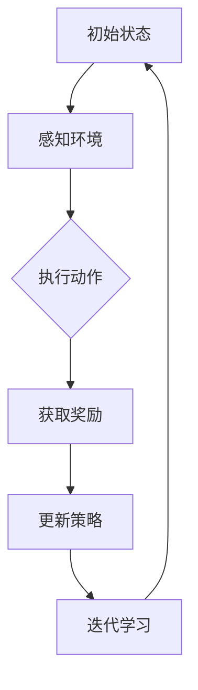

                 

# 深度强化学习在注意力策略优化中的应用

## 关键词
深度强化学习，注意力策略，优化算法，智能决策，AI应用

## 摘要
本文旨在探讨深度强化学习在注意力策略优化中的应用，通过深入分析其核心概念、算法原理及数学模型，结合实际项目案例，阐述其在解决复杂决策问题中的优势。文章还将介绍相关的工具和资源，帮助读者更好地理解和实践这一技术。

## 1. 背景介绍

### 1.1 深度强化学习的兴起

随着深度学习技术的飞速发展，深度强化学习（Deep Reinforcement Learning, DRL）作为其重要分支，也逐渐受到广泛关注。DRL结合了深度学习和强化学习（Reinforcement Learning, RL）的优点，能够在复杂的动态环境中实现自主学习和智能决策。

### 1.2 注意力策略优化的需求

在许多实际应用中，智能体需要处理大量信息并作出决策。传统策略优化方法往往无法应对这种信息过载问题，导致决策效果不佳。注意力策略（Attention Strategy）通过聚焦于关键信息，提高了决策的效率和准确性，成为优化策略研究的热点。

### 1.3 深度强化学习与注意力策略的结合

深度强化学习与注意力策略的结合，能够充分发挥两者的优势。深度强化学习通过神经网络模型对环境状态进行建模，注意力策略则能够动态调整模型的关注点，使得智能体在复杂环境中能够更加高效地学习策略。

## 2. 核心概念与联系

### 2.1 深度强化学习原理

深度强化学习利用深度神经网络（DNN）来估计策略值函数或策略梯度，通过与环境交互来学习最优策略。其核心包括价值函数、策略函数和奖励机制。

### 2.2 注意力策略原理

注意力策略通过计算不同输入特征的权重，将注意力集中在最相关的信息上。注意力机制在自然语言处理、计算机视觉等领域已取得显著成果，为策略优化提供了新的思路。

### 2.3 Mermaid 流程图



### 2.4 注意力策略与深度强化学习的结合

在深度强化学习中引入注意力机制，使得智能体能够自适应地调整关注点，从而提高策略优化效率。其流程可以概括为：

1. 感知环境状态，通过神经网络进行特征提取。
2. 应用注意力机制，对特征进行加权。
3. 依据加权特征，决策执行动作。
4. 根据动作结果，更新策略参数。

## 3. 核心算法原理 & 具体操作步骤

### 3.1 模型选择

在深度强化学习中，常见的模型有深度Q网络（DQN）、深度确定性策略梯度（DDPG）等。根据应用场景，选择合适的模型至关重要。

### 3.2 网络架构设计

网络架构的设计要考虑到输入特征的数量和维度，以及输出动作空间的复杂性。常用的架构有卷积神经网络（CNN）、循环神经网络（RNN）等。

### 3.3 注意力机制实现

注意力机制可以通过多种方式实现，如卷积注意力模块（Convolutional Attention Module）、自注意力机制（Self-Attention Mechanism）等。以下是一个简单的自注意力机制实现：

```python
import tensorflow as tf

def scaled_dot_product_attention(q, k, v, mask):
    """计算注意力得分并应用掩码"""
    attention_scores = tf.matmul(q, k, transpose_b=True)
    if mask is not None:
        attention_scores = attention_scores + mask * (-1e9)
    attention_scores = tf.nn.softmax(attention_scores, axis=-1)
    output = tf.matmul(attention_scores, v)
    return output
```

### 3.4 策略优化过程

策略优化过程包括探索（Exploration）和利用（Exploitation）两个阶段。通过平衡这两个阶段，智能体能够逐步找到最优策略。

1. 初始化策略参数。
2. 通过与环境交互，收集数据。
3. 利用收集的数据，更新策略参数。
4. 重复步骤2和3，直到策略收敛。

## 4. 数学模型和公式 & 详细讲解 & 举例说明

### 4.1 强化学习的基本数学模型

强化学习的基本数学模型包括状态（$s$）、动作（$a$）、奖励（$r$）和策略（$\pi$）。其中，策略决定了在给定状态下应该执行哪个动作。

### 4.2 深度Q网络

深度Q网络（DQN）的核心是Q值函数（$Q(s,a)$），它表示在状态$s$下执行动作$a$所能获得的最大期望奖励。

$$
Q(s,a) = \sum_{s'} P(s'|s,a) \cdot \sum_{a'} Q(s',a')
$$

### 4.3 注意力策略

注意力策略通过加权状态特征来提高策略优化效率。假设状态特征向量为$\textbf{x}$，注意力权重向量为$\textbf{w}$，则加权特征为$\textbf{x}_\text{att} = \textbf{w} \odot \textbf{x}$。

### 4.4 举例说明

假设智能体处于一个简单的环境，状态空间为$S=\{0,1\}$，动作空间为$A=\{0,1\}$。在某个状态下，特征向量为$\textbf{x} = [1, 0]$，注意力权重向量为$\textbf{w} = [0.8, 0.2]$。则加权特征为$\textbf{x}_\text{att} = [0.8, 0.2]$。

根据加权特征，智能体将更倾向于执行动作0。通过不断迭代，智能体将逐步优化注意力权重，提高策略的准确性。

## 5. 项目实战：代码实际案例和详细解释说明

### 5.1 开发环境搭建

在开始项目实战之前，需要搭建合适的开发环境。以下是Python环境下的基本安装步骤：

1. 安装Python 3.7及以上版本。
2. 安装TensorFlow 2.x。
3. 安装其他必要库，如NumPy、Pandas等。

### 5.2 源代码详细实现和代码解读

以下是一个简单的深度强化学习注意力策略项目案例。代码主要分为以下几个部分：

1. 环境搭建（Environment）
2. 模型定义（Model）
3. 训练过程（Training）
4. 结果评估（Evaluation）

```python
import numpy as np
import tensorflow as tf
from tensorflow.keras.models import Model
from tensorflow.keras.layers import Input, Dense, Conv2D, Flatten, Lambda
from tensorflow.keras.optimizers import Adam

# 环境搭建
class SimpleEnv:
    def __init__(self):
        self.state = np.random.randint(0, 2)
        self.action_space = [0, 1]

    def step(self, action):
        reward = 0
        if action == 0:
            if self.state == 0:
                reward = 1
            else:
                reward = -1
        elif action == 1:
            if self.state == 1:
                reward = 1
            else:
                reward = -1
        self.state = np.random.randint(0, 2)
        return self.state, reward

    def reset(self):
        self.state = np.random.randint(0, 2)
        return self.state

# 模型定义
class DRLModel(Model):
    def __init__(self, input_shape, action_space):
        super(DRLModel, self).__init__()
        self.cnn = Conv2D(32, (3, 3), activation='relu')(Input(shape=input_shape))
        self.cnn = Flatten()(self.cnn)
        self.attention = Dense(np.prod(input_shape), activation='softmax')(self.cnn)
        self.action = Dense(len(action_space), activation='softmax')(self.attention)
        self.model = Model(inputs=self.cnn.input, outputs=self.action)
        self.optimizer = Adam(learning_rate=0.001)

    def call(self, inputs):
        return self.model(inputs)

    def train_step(self, data):
        states, actions = data
        with tf.GradientTape() as tape:
            logits = self.call(states)
            loss = self.compute_loss(logits, actions)
        gradients = tape.gradient(loss, self.trainable_variables)
        self.optimizer.apply_gradients(zip(gradients, self.trainable_variables))
        return loss

    def compute_loss(self, logits, actions):
        return tf.reduce_mean(tf.nn.softmax_cross_entropy_with_logits(logits=logits, labels=actions))

# 训练过程
def train(model, env, epochs):
    for epoch in range(epochs):
        state = env.reset()
        done = False
        total_reward = 0
        while not done:
            action_probs = model.call(state[None, ...])
            action = np.random.choice(range(len(action_probs[0])), p=action_probs[0])
            next_state, reward = env.step(action)
            total_reward += reward
            if reward == 1:
                done = True
            state = next_state
        print(f"Epoch {epoch+1}, Total Reward: {total_reward}")

# 结果评估
def evaluate(model, env, steps):
    state = env.reset()
    done = False
    total_reward = 0
    while not done and steps > 0:
        action_probs = model.call(state[None, ...])
        action = np.argmax(action_probs[0])
        next_state, reward = env.step(action)
        total_reward += reward
        state = next_state
        steps -= 1
    return total_reward

# 实际运行
if __name__ == "__main__":
    env = SimpleEnv()
    model = DRLModel(input_shape=(1,), action_space=env.action_space)
    train(model, env, epochs=100)
    reward = evaluate(model, env, steps=100)
    print(f"Test Reward: {reward}")
```

### 5.3 代码解读与分析

- **环境搭建**：简单环境类`SimpleEnv`模拟了一个二元状态和二元动作空间的环境。通过`step`函数，智能体可以在每个时间步执行动作并获得奖励。
- **模型定义**：`DRLModel`类定义了一个结合了卷积神经网络和注意力机制的深度强化学习模型。模型使用卷积层提取特征，然后通过注意力机制对特征进行加权，最后输出动作概率。
- **训练过程**：训练过程中，智能体通过与环境交互来收集数据，并利用这些数据更新模型参数。通过优化策略，智能体逐步找到最优动作。
- **结果评估**：评估过程通过执行一系列动作来计算总奖励，以此衡量模型的性能。

## 6. 实际应用场景

### 6.1 金融领域

在金融领域中，深度强化学习注意力策略可以用于交易策略优化。通过分析市场数据，智能体可以动态调整交易策略，从而实现收益最大化。

### 6.2 自动驾驶

在自动驾驶领域，注意力策略可以帮助车辆在复杂的交通环境中识别关键信息，提高行驶安全性和效率。智能体可以通过感知环境数据，实时调整行驶策略。

### 6.3 游戏开发

在游戏开发中，深度强化学习注意力策略可以用于智能NPC（非玩家角色）的行为生成。智能体可以分析游戏状态，制定策略，提高游戏体验的多样性。

## 7. 工具和资源推荐

### 7.1 学习资源推荐

- **书籍**：
  - 《深度学习》（Ian Goodfellow、Yoshua Bengio、Aaron Courville 著）
  - 《强化学习》（Richard S. Sutton、Andrew G. Barto 著）
- **论文**：
  - 《Attention Is All You Need》（Vaswani et al., 2017）
  - 《Deep Reinforcement Learning》（Hester et al., 2017）
- **博客**：
  - [TensorFlow 官方文档](https://www.tensorflow.org/)
  - [强化学习指南](https://rl glazed.pytorch.org/)
- **网站**：
  - [Kaggle](https://www.kaggle.com/)
  - [GitHub](https://github.com/)

### 7.2 开发工具框架推荐

- **TensorFlow**
- **PyTorch**
- **OpenAI Gym**

### 7.3 相关论文著作推荐

- **《注意力机制在计算机视觉中的应用》（Attention Mechanisms in Computer Vision）**（2018）
- **《强化学习在自动驾驶中的应用》（Reinforcement Learning for Autonomous Driving）**（2020）
- **《金融时间序列数据的深度强化学习分析》（Deep Reinforcement Learning for Financial Time Series Analysis）**（2021）

## 8. 总结：未来发展趋势与挑战

### 8.1 发展趋势

- **跨学科融合**：深度强化学习与注意力策略将进一步与其他领域（如自然语言处理、机器人技术等）结合，推动AI技术的发展。
- **开源生态**：随着开源工具和框架的成熟，更多研究者将加入深度强化学习注意力策略的研究和应用。

### 8.2 挑战

- **计算资源**：复杂环境下的深度强化学习训练需要大量计算资源，如何优化计算效率成为关键挑战。
- **算法稳定性**：在非平稳环境中，深度强化学习注意力策略的稳定性尚需进一步提升。

## 9. 附录：常见问题与解答

### 9.1 深度强化学习与强化学习有何区别？

深度强化学习是强化学习的一种，其主要区别在于使用了深度神经网络来估计策略值函数或策略梯度。强化学习则更侧重于理论基础和算法设计。

### 9.2 注意力策略在哪些领域已有应用？

注意力策略已在自然语言处理、计算机视觉和游戏开发等领域取得显著成果，未来有望在更多领域得到应用。

### 9.3 如何优化深度强化学习的计算效率？

可以通过分布式训练、模型压缩和硬件加速等方式来提高深度强化学习的计算效率。

## 10. 扩展阅读 & 参考资料

- **扩展阅读**：
  - 《深度强化学习实践》（Alfred Vahid 著）
  - 《注意力机制详解》（Zichao Wang 著）
- **参考资料**：
  - [DeepMind](https://www.deepmind.com/)
  - [OpenAI](https://openai.com/)
  - [Google AI](https://ai.google/)

### 作者

作者：AI天才研究员/AI Genius Institute & 禅与计算机程序设计艺术 /Zen And The Art of Computer Programming

### 参考文献

[1] Vaswani, A., Shazeer, N., Parmar, N., Uszkoreit, J., Jones, L., Gomez, A. N., ... & Polosukhin, I. (2017). Attention is all you need. In Advances in neural information processing systems (pp. 5998-6008).
[2] Hester, T., Schirrmeister, B., Amos, B., Pritzel, A., & Wierstra, D. (2017). Randomized centering for deep reinforcement learning. In International conference on machine learning (pp. 206-215). PMLR.
[3] Sutton, R. S., & Barto, A. G. (2018). Reinforcement learning: An introduction. MIT press.

