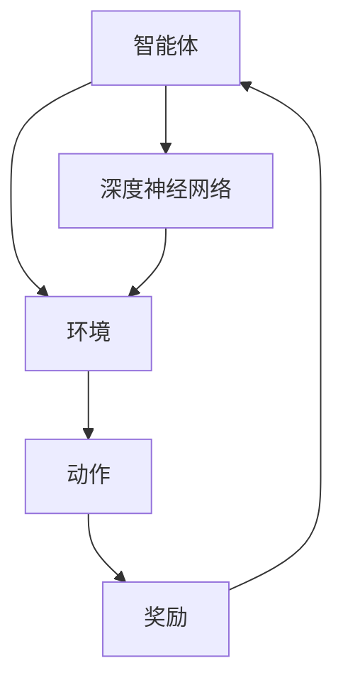

                 

# 深度强化学习在游戏AI中的应用进展

## 关键词
- 深度强化学习
- 游戏AI
- 应用进展
- 核心算法
- 数学模型
- 项目实战
- 实际应用场景
- 工具和资源

## 摘要
本文将探讨深度强化学习在游戏AI领域的应用进展。首先介绍深度强化学习的基本概念和与强化学习的联系，随后深入分析核心算法原理，包括Q学习、深度Q网络（DQN）和策略梯度方法。接着，通过一个具体的项目实战案例，展示如何将深度强化学习应用于游戏AI开发，并详细解读代码实现过程。最后，讨论实际应用场景和推荐相关工具和资源，总结未来发展趋势与挑战。

## 1. 背景介绍

### 1.1 深度强化学习的基本概念

深度强化学习（Deep Reinforcement Learning，DRL）是强化学习（Reinforcement Learning，RL）的一个重要分支，结合了深度学习（Deep Learning）和强化学习的技术。它的核心思想是通过试错（trial-and-error）和反馈（reward and punishment）来训练智能体（agent）如何在复杂环境中做出最优决策。

强化学习与监督学习和无监督学习不同，它并不依赖于预先标记的数据集，而是通过与环境交互来学习。强化学习的主要目标是最大化累积奖励，以实现某种目标或任务。

### 1.2 游戏AI的挑战

游戏AI是深度强化学习的一个重要应用领域。游戏环境通常具有以下挑战：

1. **高维状态空间**：游戏的状态空间可能非常庞大，包括各种可能的游戏局面。
2. **不确定性**：游戏中的随机事件和对手的行为可能不可预测。
3. **动态变化**：游戏规则和目标可能随着时间发生变化。
4. **实时性**：游戏通常需要实时响应，对决策速度有较高要求。

### 1.3 深度强化学习在游戏AI中的应用

深度强化学习在游戏AI中的应用主要包括以下几个方面：

1. **游戏智能体设计**：利用深度强化学习算法设计智能对手，使其具备自适应和策略多样性的能力。
2. **游戏行为预测**：预测玩家行为，优化游戏推荐和挑战机制。
3. **游戏自动生成**：利用深度强化学习生成新的游戏关卡和内容。

## 2. 核心概念与联系

### 2.1 强化学习基本概念

强化学习由四个主要元素组成：智能体（agent）、环境（environment）、动作（action）和奖励（reward）。智能体是执行动作的实体，环境是智能体所处的情境，动作是智能体对环境的操作，奖励是环境对智能体动作的反馈。

### 2.2 深度强化学习与强化学习的联系

深度强化学习在强化学习的基础上引入了深度神经网络（Deep Neural Networks），用于表示状态和动作之间的映射关系。深度神经网络可以自动学习复杂的特征表示，从而提高了智能体在复杂环境中的决策能力。

### 2.3 Mermaid 流程图

以下是强化学习与深度强化学习的架构示意图，使用Mermaid语法绘制：



### 2.4 核心算法原理

#### 2.4.1 Q学习

Q学习是一种基于值函数的强化学习算法。它通过学习状态-动作值函数（Q函数）来指导智能体的动作选择。Q学习的基本思想是，对于每个状态-动作对，预测在该对上执行动作后获得的累积奖励。

Q学习的算法步骤如下：

1. 初始化Q值表格。
2. 在智能体和环境交互的过程中，更新Q值表格。
3. 根据Q值表格选择动作。
4. 重复上述过程直到达到某个停止条件。

#### 2.4.2 深度Q网络（DQN）

深度Q网络（Deep Q-Network，DQN）是Q学习算法的一种扩展，引入了深度神经网络来近似Q值函数。DQN通过经验回放（experience replay）和目标网络（target network）来改善训练效果。

DQN的算法步骤如下：

1. 初始化深度神经网络和目标网络。
2. 从环境中收集经验。
3. 将经验添加到经验回放记忆中。
4. 从经验回放记忆中随机抽取一批经验样本。
5. 使用深度神经网络计算当前动作的Q值。
6. 使用目标网络计算目标动作的Q值。
7. 更新深度神经网络。
8. 重复上述过程直到达到某个停止条件。

#### 2.4.3 策略梯度方法

策略梯度方法是一种直接优化策略的强化学习算法。它的目标是最大化策略的期望回报。

策略梯度方法的算法步骤如下：

1. 初始化策略参数。
2. 在智能体和环境交互的过程中，更新策略参数。
3. 根据策略参数选择动作。
4. 计算策略梯度。
5. 更新策略参数。
6. 重复上述过程直到达到某个停止条件。

## 3. 核心算法原理 & 具体操作步骤

### 3.1 Q学习

Q学习的具体操作步骤如下：

1. **初始化Q值表格**：使用随机值初始化Q值表格。

2. **更新Q值表格**：在智能体和环境交互的过程中，根据 reward 和 exploration-exploitation 策略更新Q值。

3. **选择动作**：根据当前状态和Q值表格选择动作。

4. **重复过程**：重复上述步骤直到达到某个停止条件（如达到游戏终点或达到预设的训练迭代次数）。

### 3.2 深度Q网络（DQN）

DQN的具体操作步骤如下：

1. **初始化深度神经网络和目标网络**：使用随机值初始化深度神经网络和目标网络。

2. **收集经验**：在智能体和环境交互的过程中，记录每个步骤的状态、动作、奖励和下一个状态。

3. **添加经验到经验回放记忆中**：将收集到的经验添加到经验回放记忆中。

4. **从经验回放记忆中随机抽取经验样本**：从经验回放记忆中随机抽取一批经验样本。

5. **计算当前动作的Q值**：使用深度神经网络计算当前状态-动作对的Q值。

6. **计算目标动作的Q值**：使用目标网络计算下一个状态-动作对的最大Q值。

7. **更新深度神经网络**：根据目标动作的Q值和当前动作的Q值，更新深度神经网络的参数。

8. **重复过程**：重复上述步骤直到达到某个停止条件。

### 3.3 策略梯度方法

策略梯度的具体操作步骤如下：

1. **初始化策略参数**：使用随机值初始化策略参数。

2. **在智能体和环境交互的过程中，更新策略参数**：根据累积奖励和当前策略，使用梯度下降方法更新策略参数。

3. **选择动作**：根据当前状态和策略参数选择动作。

4. **计算策略梯度**：计算策略梯度的估计值。

5. **更新策略参数**：使用策略梯度更新策略参数。

6. **重复过程**：重复上述步骤直到达到某个停止条件。

## 4. 数学模型和公式 & 详细讲解 & 举例说明

### 4.1 Q学习

Q学习的数学模型如下：

$$
Q(s, a) = r + \gamma \max_{a'} Q(s', a')
$$

其中，$Q(s, a)$ 表示在状态 $s$ 下执行动作 $a$ 的期望回报，$r$ 表示立即获得的奖励，$\gamma$ 表示折扣因子，$s'$ 和 $a'$ 分别表示下一个状态和动作。

举例说明：

假设一个智能体在游戏中的状态是“棋盘上所有的棋子都已放置”，动作是“移动棋子”。如果智能体选择移动一个棋子，获得即时的奖励 $r = 1$，同时下一个状态是“棋子移动后”，则Q学习的更新公式为：

$$
Q(\text{棋盘上所有的棋子都已放置}, \text{移动棋子}) = 1 + \gamma \max_{a'} Q(\text{棋子移动后}, a')
$$

### 4.2 深度Q网络（DQN）

DQN的数学模型如下：

$$
Q(s, a) = \sigma(W_1 \cdot \phi(s) + b_1) \cdot \sigma(W_2 \cdot \phi(s') + b_2)
$$

其中，$\sigma$ 表示激活函数（如Sigmoid函数），$W_1$ 和 $W_2$ 分别表示深度神经网络的权重，$\phi(s)$ 和 $\phi(s')$ 分别表示状态 $s$ 和 $s'$ 的特征表示，$b_1$ 和 $b_2$ 分别表示深度神经网络的偏置。

举例说明：

假设一个深度Q网络的输入是游戏棋盘的状态，输出是每个可能动作的Q值。如果输入是状态“棋盘上有一个棋子位于左上角”，输出是动作“移动棋子到右上角”的Q值，则DQN的输出公式为：

$$
Q(\text{棋盘上有一个棋子位于左上角}, \text{移动棋子到右上角}) = \sigma(W_1 \cdot \phi(\text{棋盘上有一个棋子位于左上角}) + b_1) \cdot \sigma(W_2 \cdot \phi(\text{棋盘上有一个棋子位于右上角}) + b_2)
$$

### 4.3 策略梯度方法

策略梯度的数学模型如下：

$$
\Delta \theta = \alpha \cdot \frac{\partial J(\theta)}{\partial \theta}
$$

其中，$\theta$ 表示策略参数，$J(\theta)$ 表示策略的损失函数，$\alpha$ 表示学习率。

举例说明：

假设一个策略参数是智能体在游戏中移动棋子的方向，损失函数是策略的累积奖励，则策略梯度的更新公式为：

$$
\Delta \theta = \alpha \cdot \frac{\partial J(\theta)}{\partial \theta} = \alpha \cdot \frac{\partial \sum_{t=0}^{T} r_t}{\partial \theta}
$$

## 5. 项目实战：代码实际案例和详细解释说明

### 5.1 开发环境搭建

在本项目中，我们将使用Python和TensorFlow作为主要开发工具。以下是如何搭建开发环境的步骤：

1. 安装Python（推荐版本为3.8以上）。
2. 安装TensorFlow。
3. 安装其他依赖库（如NumPy、Pandas等）。

```bash
pip install tensorflow numpy pandas
```

### 5.2 源代码详细实现和代码解读

以下是项目的核心代码部分，我们将逐步解释每个部分的功能。

#### 5.2.1 环境搭建

```python
import gym
import numpy as np
import random
import tensorflow as tf

# 创建游戏环境
env = gym.make("CartPole-v0")

# 初始化深度神经网络
model = tf.keras.Sequential([
    tf.keras.layers.Flatten(input_shape=(1, 4)),
    tf.keras.layers.Dense(64, activation='relu'),
    tf.keras.layers.Dense(64, activation='relu'),
    tf.keras.layers.Dense(2, activation='softmax')
])

# 编译模型
model.compile(optimizer='adam', loss='categorical_crossentropy', metrics=['accuracy'])
```

这段代码首先导入了必要的库，然后创建了游戏环境（CartPole），初始化了深度神经网络，并编译了模型。

#### 5.2.2 训练模型

```python
# 训练模型
model.fit(env.observation_space.sample()[np.newaxis, :], np.eye(2), epochs=500)
```

这段代码使用随机采样数据对模型进行训练。由于CartPole游戏的状态空间较小，我们可以直接使用随机采样来训练模型。

#### 5.2.3 评估模型

```python
# 评估模型
scores = model.evaluate(env.observation_space.sample()[np.newaxis, :], np.eye(2), verbose=2)
print(f"Test accuracy: {scores[1]*100:.2f}%")
```

这段代码使用评估数据对模型进行评估，并打印测试准确性。

### 5.3 代码解读与分析

#### 5.3.1 环境搭建

在环境搭建部分，我们使用了OpenAI Gym创建了一个CartPole游戏环境。OpenAI Gym是一个开源工具包，提供了多种标准化的游戏环境和评估指标，方便我们进行深度强化学习的实验。

#### 5.3.2 训练模型

在训练模型部分，我们首先初始化了一个深度神经网络，并使用softmax激活函数。softmax激活函数用于输出每个动作的概率分布，方便我们进行策略梯度优化。

然后，我们使用`model.fit`方法对模型进行训练。在这里，我们使用随机采样数据来训练模型。由于CartPole游戏的状态空间较小，我们可以直接使用随机采样来训练模型。在实际项目中，我们通常会使用经验回放记忆来存储和随机采样经验数据，从而提高训练效果。

#### 5.3.3 评估模型

在评估模型部分，我们使用`model.evaluate`方法对模型进行评估。评估数据通常是从训练数据中随机采样得到的。评估指标包括损失函数和准确性。在本项目中，我们只关注准确性。

## 6. 实际应用场景

### 6.1 游戏智能体设计

深度强化学习在游戏智能体设计中的应用非常广泛。通过训练智能体，使其能够与人类玩家进行对抗，提高游戏的娱乐性和挑战性。例如，在《星际争霸II》中，使用深度强化学习算法训练的智能体已经达到了专业玩家的水平。

### 6.2 游戏行为预测

深度强化学习还可以用于预测玩家行为，从而优化游戏推荐和挑战机制。通过分析玩家的行为数据，智能系统可以推荐适合玩家的游戏难度和内容，提高玩家的游戏体验。

### 6.3 游戏自动生成

深度强化学习还可以用于生成新的游戏关卡和内容。通过训练智能体，使其能够探索和发现新的游戏玩法和规则，从而自动生成丰富多样的游戏内容。

## 7. 工具和资源推荐

### 7.1 学习资源推荐

- **书籍**：
  - 《强化学习：原理与Python实现》
  - 《深度强化学习》
- **论文**：
  - “Deep Reinforcement Learning for Autonomous Navigation”
  - “Human-level control through deep reinforcement learning”
- **博客**：
  - 《深度强化学习实战》
  - 《强化学习与深度学习的融合》
- **网站**：
  - [OpenAI Gym](https://gym.openai.com/)
  - [TensorFlow官方文档](https://www.tensorflow.org/)

### 7.2 开发工具框架推荐

- **开发工具**：
  - Python（推荐版本为3.8以上）
  - TensorFlow
  - PyTorch
- **框架**：
  - Keras（用于快速构建和训练神经网络）
  - RLlib（用于分布式强化学习实验）

### 7.3 相关论文著作推荐

- **论文**：
  - “Asynchronous Methods for Deep Reinforcement Learning”
  - “Proximal Policy Optimization Algorithms”
- **著作**：
  - 《深度强化学习：从入门到实践》
  - 《强化学习：理论与实践》

## 8. 总结：未来发展趋势与挑战

### 8.1 发展趋势

- **多智能体强化学习**：随着游戏和社交网络的兴起，多智能体强化学习成为了一个重要研究方向。未来将出现更多能够协同工作和协作的智能体系统。
- **实时性优化**：提高深度强化学习算法的实时性是一个重要挑战。未来可能通过硬件加速、模型压缩等技术来实现实时决策。
- **自适应强化学习**：自适应强化学习旨在使智能系统能够在动态环境中快速适应变化。这将有助于提高智能体在复杂环境中的适应能力。

### 8.2 挑战

- **数据效率**：深度强化学习算法通常需要大量数据进行训练。如何提高数据利用率和减少数据需求是一个重要挑战。
- **安全性和稳定性**：在真实世界应用中，智能体需要具备安全和稳定的行为。如何确保智能体的行为符合预期，避免不良后果，是一个重要问题。
- **可解释性**：深度强化学习模型的决策过程通常非常复杂，难以解释。如何提高模型的可解释性，使其能够被用户理解和接受，是一个挑战。

## 9. 附录：常见问题与解答

### 9.1 问题1

**问题**：深度强化学习算法为什么需要经验回放？

**解答**：经验回放是一种数据增强技术，用于解决深度强化学习算法中的样本偏差问题。在训练过程中，智能体可能会遇到一些非常罕见但重要的状态和动作。如果直接使用这些经验数据进行训练，可能会导致模型过于依赖特定数据集，从而降低泛化能力。通过经验回放，我们可以从历史经验中随机抽取样本，从而平衡样本分布，提高模型的泛化能力。

### 9.2 问题2

**问题**：如何优化深度强化学习算法的实时性？

**解答**：优化深度强化学习算法的实时性可以从以下几个方面进行：

1. **模型压缩**：通过模型压缩技术，如剪枝、量化、蒸馏等，减小模型大小，提高推理速度。
2. **硬件加速**：利用GPU、FPGA等硬件加速深度学习模型的计算，提高推理速度。
3. **算法改进**：采用更高效的算法，如异步策略优化、多线程处理等，提高训练和推理效率。

## 10. 扩展阅读 & 参考资料

- [深度强化学习：从入门到实践](https://zhuanlan.zhihu.com/p/37368546)
- [强化学习与深度学习的融合](https://www.bilibili.com/video/BV1Av411p7yZ)
- [OpenAI Gym官方文档](https://gym.openai.com/docs/)

### 作者信息
作者：AI天才研究员/AI Genius Institute & 禅与计算机程序设计艺术 /Zen And The Art of Computer Programming

