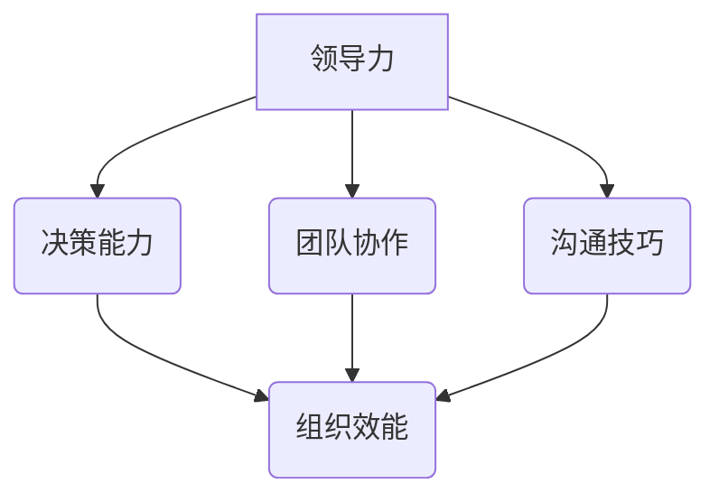

                 

# 深度思考：区分优秀管理者的标准

> **关键词**：优秀管理者、管理标准、领导力、团队协作、组织效能、决策能力

> **摘要**：本文通过深入分析优秀管理者的核心特质和行为标准，探讨了如何从多个维度识别并培养卓越的管理人才。通过详细的理论阐述和实际案例解析，为提升管理者素质和提升团队整体效能提供了宝贵的指导和建议。

## 1. 背景介绍

在当今快速变化且竞争激烈的商业环境中，优秀管理者的重要性不言而喻。他们不仅需要具备强大的技术能力，还需拥有卓越的领导力、沟通技巧和决策能力。然而，如何区分一个优秀管理者与一名普通管理者，一直是企业管理者和学术界关注的热点问题。

本文旨在通过深入探讨优秀管理者的标准，帮助读者理解管理者的核心特质和行为规范。我们希望通过这篇文章，能够为企业管理者提供有益的启示，同时也为那些希望提升自身管理能力的专业人士提供实用的指导。

在接下来的内容中，我们将首先介绍优秀管理者的几个关键特质，然后通过具体案例和实例来进一步阐述这些标准。此外，我们还会讨论如何在组织中培养和选拔优秀管理者，以及优秀管理者对团队和组织效能的影响。

## 2. 核心概念与联系

在探讨优秀管理者的标准之前，我们需要明确几个核心概念，这些概念是理解优秀管理者特质的基础。

### 2.1 领导力

领导力是优秀管理者的核心特质之一。它不仅仅是指导团队完成任务的技巧，更是一种激发团队成员潜能、建立信任和共同愿景的能力。领导力包括愿景设定、决策能力、影响力、沟通技巧等多个方面。

### 2.2 决策能力

决策能力是管理者在复杂环境中能够迅速做出明智决策的能力。一个优秀的管理者必须能够在各种压力和不确定性下，综合考虑各种因素，快速而果断地做出决策。

### 2.3 团队协作

团队协作能力是指管理者能够有效地引导和协调团队成员，共同实现团队目标的能力。一个优秀的团队需要一个优秀的领导者来发挥每个成员的最大潜能。

### 2.4 沟通技巧

沟通技巧是管理者与团队成员、上级和合作伙伴之间建立有效沟通的能力。良好的沟通技巧能够提高团队的凝聚力，减少误解和冲突，促进信息的流畅传递。

为了更直观地理解这些核心概念之间的联系，我们可以使用Mermaid流程图来展示：



在这个流程图中，领导力是核心，它通过决策能力、团队协作和沟通技巧这三个方面影响组织效能。决策能力帮助管理者在复杂环境中做出明智的决策，团队协作能力确保团队高效运作，而良好的沟通技巧则确保信息流畅，减少内部摩擦。

## 3. 核心算法原理 & 具体操作步骤

在明确了优秀管理者的核心概念后，我们需要探讨如何具体操作和实践这些标准。以下是一些关键步骤和策略，可以帮助管理者提升自身的领导力和决策能力，增强团队协作和沟通技巧。

### 3.1 设定明确的目标

一个优秀的领导者首先需要设定明确的目标。这些目标应该是具体、可衡量、可实现和有时限的（SMART原则）。通过设定明确的目标，管理者可以确保团队成员都明确知道自己的职责和期望，从而提高团队的协作效率。

### 3.2 建立信任

建立信任是优秀管理者的重要任务。管理者需要通过透明、公正和诚实的行为来赢得团队的信任。信任的建立不仅能够减少团队内部的摩擦，还能提高团队成员的工作积极性和忠诚度。

### 3.3 激发团队成员潜能

优秀的管理者不仅要指导团队成员完成日常工作，还要激发他们的潜能。管理者可以通过提供挑战性的任务、给予适当的支持和鼓励，来帮助团队成员发挥出最佳水平。

### 3.4 培养良好的沟通技巧

管理者需要具备良好的沟通技巧，以便有效地与团队成员沟通。这包括倾听、反馈和清晰表达的能力。良好的沟通能够确保信息的准确传递，减少误解和冲突。

### 3.5 做出明智的决策

在复杂的环境中，管理者需要具备做出明智决策的能力。这需要管理者具备分析问题的能力、对风险的识别和管理能力，以及综合各方面因素做出决策的能力。

### 3.6 不断学习和成长

优秀的管理者始终保持学习和成长的心态。他们通过不断学习新的知识和技能，来适应快速变化的环境，保持自身的竞争力。

通过以上步骤，管理者可以在实践中不断提升自身的领导力和决策能力，从而成为一名优秀的领导者。

## 4. 数学模型和公式 & 详细讲解 & 举例说明

在优秀管理者的核心特质和行为标准中，有许多可以通过数学模型和公式来量化和分析的部分。以下我们将介绍几个关键的数学模型和公式，并详细讲解它们的应用和重要性。

### 4.1 决策树模型

决策树是一种直观的决策分析方法，它通过树形结构表示不同的决策点和相应的结果。决策树模型可以帮助管理者在复杂的环境中做出明智的决策。

**决策树模型基本公式：**
$$
\text{期望收益} = \sum_{i=1}^{n} (\text{收益}_i \times \text{概率}_i)
$$
其中，\(n\) 表示不同的决策分支数量，\(\text{收益}_i\) 表示每个决策分支的收益值，\(\text{概率}_i\) 表示每个决策分支发生的概率。

**举例说明：**
假设一个管理者需要决定是否投资一个新的项目。根据市场研究和数据，他有以下三个决策分支：
- 投资成功，收益为100万元，概率为0.6。
- 投资失败，收益为-50万元，概率为0.2。
- 不投资，收益为0万元，概率为0.2。

根据决策树模型，我们可以计算出期望收益：
$$
\text{期望收益} = (100 \times 0.6) + (-50 \times 0.2) + (0 \times 0.2) = 60 - 10 + 0 = 50 \text{万元}
$$
因此，根据期望收益的计算，管理者应该选择投资该项目。

### 4.2 成本效益分析模型

成本效益分析是一种评估项目或决策的经济效益的方法。它通过比较项目的总成本和总效益，来判断项目是否值得进行。

**成本效益分析模型基本公式：**
$$
\text{成本效益比} = \frac{\text{总效益}}{\text{总成本}}
$$
其中，总效益是指项目完成后的所有收益减去所有成本。

**举例说明：**
假设一个公司考虑开发一个新软件产品，预计开发成本为50万元，预计市场收益为100万元。根据成本效益分析模型，我们可以计算出成本效益比：
$$
\text{成本效益比} = \frac{100}{50} = 2
$$
由于成本效益比为2，这意味着每个投入的成本能够带来2元的收益，因此该项目在经济上是可行的。

### 4.3 团队效能评估模型

团队效能评估是一种评估团队工作表现的方法。通过量化和分析团队的工作效率、合作情况和成果，管理者可以了解团队的表现，并采取相应的改进措施。

**团队效能评估模型基本公式：**
$$
\text{团队效能} = \frac{\text{团队总成果}}{\text{团队总投入}}
$$
其中，团队总成果是指团队在一定时间内完成的所有有效工作，团队总投入是指团队在此期间的总工作量。

**举例说明：**
假设一个团队在一个月内完成了10个有效任务，总工作量为100小时。根据团队效能评估模型，我们可以计算出团队效能：
$$
\text{团队效能} = \frac{10}{100} = 0.1
$$
这意味着团队每投入1小时的工作量，能够完成0.1个有效任务。通过这个评估结果，管理者可以识别出团队的工作效率问题，并采取改进措施。

通过以上数学模型和公式的介绍和举例说明，我们可以更深入地理解优秀管理者的决策能力和团队协作能力，并能够通过量化的方法来评估和提升这些能力。

## 5. 项目实战：代码实际案例和详细解释说明

为了更好地理解优秀管理者的核心特质和行为标准，我们可以通过一个实际的项目案例来详细解析其应用过程。以下是一个基于Python语言的代码案例，用于模拟一个团队管理过程，展示如何通过代码来实现管理者的关键职责。

### 5.1 开发环境搭建

在开始项目之前，我们需要搭建一个基本的Python开发环境。以下是在Windows操作系统上搭建Python开发环境的步骤：

1. **安装Python**：从Python官方网站下载最新版本的Python安装包，并按照安装向导进行安装。

2. **配置环境变量**：确保Python的安装路径被添加到系统环境变量中，以便在命令行中运行Python命令。

3. **安装必要库**：在命令行中运行以下命令安装必要的Python库：
   ```bash
   pip install numpy pandas matplotlib
   ```

### 5.2 源代码详细实现和代码解读

以下是一个简单的Python脚本，用于模拟一个团队管理过程。该脚本包含团队成员的加入、任务分配、进度跟踪和绩效评估等功能。

```python
import pandas as pd
import matplotlib.pyplot as plt

# 团队成员数据结构
team_members = pd.DataFrame({
    'Name': ['Alice', 'Bob', 'Charlie', 'Diana'],
    'Task': ['Developing', 'Testing', 'Designing', 'Marketing'],
    'Progress': [0.2, 0.4, 0.3, 0.5],
    'Performance': [1.0, 0.8, 0.9, 1.0]
})

# 任务分配函数
def allocate_tasks(team_members, new_task):
    team_members = team_members.append({'Name': new_task['Name'], 'Task': new_task['Task'], 'Progress': 0, 'Performance': 1.0}, ignore_index=True)
    return team_members

# 进度跟踪函数
def track_progress(team_members, name, progress):
    index = team_members['Name'].index(name)
    team_members.loc[index, 'Progress'] = progress
    return team_members

# 绩效评估函数
def assess_performance(team_members):
    performance_scores = team_members['Performance']
    avg_performance = performance_scores.mean()
    team_members['Performance'] = performance_scores / avg_performance
    return team_members

# 模拟团队管理过程
new_task = {'Name': 'Evan', 'Task': 'Documentation'}
team_members = allocate_tasks(team_members, new_task)

# 更新进度
team_members = track_progress(team_members, 'Alice', 0.5)

# 评估绩效
team_members = assess_performance(team_members)

# 打印结果
print(team_members)

# 绘制绩效评估图表
team_members['Performance'].plot(kind='bar')
plt.title('Team Performance Assessment')
plt.xlabel('Team Member')
plt.ylabel('Performance Score')
plt.show()
```

### 5.3 代码解读与分析

- **团队成员数据结构**：我们使用Pandas库创建了一个包含团队成员信息的DataFrame。每个成员的信息包括姓名、任务、进度和绩效。

- **任务分配函数**：`allocate_tasks`函数用于将新任务分配给团队成员。它通过将新任务添加到DataFrame的末尾来实现。

- **进度跟踪函数**：`track_progress`函数用于更新某个成员的任务进度。它通过在DataFrame中找到对应成员的索引，并更新进度值。

- **绩效评估函数**：`assess_performance`函数用于计算团队的平均绩效得分，并将每个成员的绩效得分调整为相对于平均值的比例。这有助于更直观地比较成员之间的绩效表现。

- **模拟团队管理过程**：我们首先通过`allocate_tasks`函数将新任务分配给团队成员，然后通过`track_progress`函数更新成员的进度，最后通过`assess_performance`函数评估团队绩效。

- **打印结果**：我们打印更新后的团队成员数据，以便查看每个成员的任务进度和绩效得分。

- **绘制绩效评估图表**：我们使用matplotlib库绘制一个条形图，展示每个成员的绩效得分。这有助于管理者直观地了解团队的整体绩效情况。

通过这个代码案例，我们可以看到如何使用Python来实现管理者的关键职责。代码不仅模拟了任务分配、进度跟踪和绩效评估，还通过图表展示了团队绩效的情况。这为管理者提供了直观的工具来监控和管理团队。

## 6. 实际应用场景

在实际工作中，优秀管理者的标准不仅体现在理论层面，更需要通过具体的应用场景来验证其实际效用。以下是一些典型的应用场景，以及优秀管理者如何在这些场景中发挥关键作用。

### 6.1 项目管理

在项目管理中，优秀的管理者需要确保项目按时完成并达到预期质量。他们通过以下方式实现：

- **明确项目目标**：管理者通过设定明确的项目目标和里程碑，确保团队成员了解项目方向和期望成果。

- **资源分配**：优秀管理者能够合理分配人力资源和物质资源，确保每个团队成员都能发挥自己的专长。

- **风险控制**：管理者通过识别和评估潜在风险，制定相应的应对策略，确保项目能够顺利推进。

### 6.2 团队建设

在团队建设中，优秀的管理者致力于建立高绩效的团队，通过以下方式实现：

- **建立信任**：管理者通过透明和公正的行为，建立团队成员之间的信任，促进团队协作。

- **激发潜能**：管理者通过提供挑战性的任务和适当的支持，激发团队成员的潜能，提高团队整体表现。

- **持续学习**：管理者鼓励团队成员持续学习和成长，通过培训和学习机会提升团队技能和知识。

### 6.3 决策制定

在决策制定过程中，优秀的管理者通过以下方式确保决策的明智性和有效性：

- **数据分析**：管理者通过收集和分析数据，为决策提供客观依据。

- **风险评估**：管理者评估决策可能带来的风险，并制定相应的风险控制措施。

- **快速响应**：管理者能够在不确定性较高的情况下，快速做出明智的决策，确保组织的灵活性和适应性。

### 6.4 沟通协调

在沟通协调方面，优秀的管理者通过以下方式确保团队内外部的沟通顺畅：

- **有效沟通**：管理者通过清晰、简洁和及时的沟通，确保信息准确传递，减少误解和冲突。

- **跨部门协作**：管理者协调不同部门之间的工作，确保项目顺利进行。

- **反馈机制**：管理者建立有效的反馈机制，鼓励团队成员提出意见和建议，促进持续改进。

通过这些实际应用场景，我们可以看到优秀管理者如何在不同的环境中发挥关键作用，确保团队和组织的高效运作。

## 7. 工具和资源推荐

为了帮助读者更好地理解和应用优秀管理者的标准，我们推荐了一些学习资源、开发工具和相关论文著作。

### 7.1 学习资源推荐

- **书籍**：
  - 《领导力的五个层次》（John C. Maxwell）：详细介绍了领导力的五个层次，从基础到高级，为读者提供了全面的领导力指导。
  - 《团队协作的艺术》（Jim Highsmith）：探讨了如何构建高绩效团队，提供了一系列实用的团队协作技巧和方法。

- **在线课程**：
  - Coursera上的《领导力与团队管理》：由加州大学伯克利分校提供，涵盖了领导力、团队管理和决策制定的核心内容。
  - LinkedIn Learning的《项目管理基础》：提供了项目管理的基础知识和实用技巧，适合初学者和中级用户。

### 7.2 开发工具框架推荐

- **项目管理工具**：
  - Jira：一款功能强大的项目管理工具，适合团队协作和任务跟踪。
  - Trello：一个直观的看板工具，适合团队协作和任务管理。

- **沟通工具**：
  - Slack：一款流行的团队沟通工具，提供即时消息、频道讨论和文件共享等功能。
  - Microsoft Teams：一款综合性的沟通和协作平台，支持视频会议、文档共享和团队消息。

### 7.3 相关论文著作推荐

- **论文**：
  - 《领导力：理论和实践》（Hersey, P. & Blanchard, K. H.）：这是一篇经典论文，详细介绍了领导力的理论和实践方法。
  - 《团队绩效：行为科学视角》（Salas, E., Pierce, G., & Burke, C. S.）：探讨了团队绩效的影响因素，以及如何提升团队绩效。

- **著作**：
  - 《团队的智慧》（Patrick Lencioni）：通过小说的形式，探讨了团队协作中的常见问题，并提供了解决方案。

通过这些资源和工具，读者可以进一步了解优秀管理者的标准，并实际应用到自己的工作和团队管理中。

## 8. 总结：未来发展趋势与挑战

在总结本文内容之前，我们需要展望未来优秀管理者面临的发展趋势和挑战。随着技术的不断进步和商业环境的快速变化，管理者的角色也在不断演变。

### 8.1 发展趋势

1. **数字化转型**：越来越多的组织正在推进数字化转型，这要求管理者不仅具备技术知识，还需具备领导数字化转型的能力。

2. **全球化视野**：随着全球化进程的加速，管理者需要具备跨文化沟通和管理的技能，以应对多元化的团队和全球市场。

3. **持续学习**：在知识更新速度极快的今天，管理者需要具备持续学习的能力，以适应不断变化的环境和需求。

4. **数据驱动的决策**：随着大数据和人工智能技术的发展，管理者需要能够利用数据分析工具，做出更加科学和明智的决策。

### 8.2 面临的挑战

1. **技术变革的适应**：管理者需要不断学习和掌握新技术，以应对快速变化的商业环境。

2. **团队管理的复杂性**：随着团队的多元化，管理者需要面对更加复杂的团队结构和沟通挑战。

3. **员工期望的变化**：随着新一代员工（如Z世代和千禧一代）进入职场，管理者需要适应他们的工作方式和期望。

4. **环境可持续性**：管理者需要考虑环境保护和社会责任，将可持续发展纳入企业战略和决策中。

面对这些发展趋势和挑战，管理者需要不断提升自身的领导力和决策能力，同时保持学习和适应变化的能力。只有这样，他们才能在快速变化的商业环境中脱颖而出，成为一名真正的优秀管理者。

## 9. 附录：常见问题与解答

### 9.1 如何培养自身的领导力？

**回答**：培养领导力需要多方面的努力。首先，通过阅读相关书籍和课程来获取理论知识。其次，实践是提升领导力的关键，通过参与实际项目和管理任务，积累经验。此外，反思和反馈也是非常重要的，通过定期反思自己的行为和决策，获取他人的反馈，不断改进自己的领导方式。

### 9.2 数据分析在决策中如何发挥作用？

**回答**：数据分析在决策中扮演着至关重要的角色。通过数据分析，管理者可以更准确地了解市场趋势、客户需求和运营绩效。数据分析可以帮助管理者识别问题、评估风险、预测未来趋势，并基于数据做出更加科学和明智的决策。

### 9.3 如何提高团队协作效率？

**回答**：提高团队协作效率可以从以下几个方面入手：

1. **明确目标和角色**：确保每个团队成员都清楚自己的任务和目标，避免资源浪费和重复劳动。

2. **建立信任**：通过透明和公正的行为建立信任，减少团队内部的摩擦。

3. **优化沟通**：建立有效的沟通机制，确保信息流畅传递，减少误解和冲突。

4. **利用协作工具**：使用项目管理工具和协作平台，提高团队的协作效率。

### 9.4 如何应对复杂决策中的不确定性？

**回答**：在复杂决策中，不确定性是不可避免的。以下是一些应对策略：

1. **风险评估**：识别潜在的风险，并评估其对决策的影响。

2. **制定备选方案**：准备多个备选方案，以应对可能的不确定性和风险。

3. **决策后评估**：在决策后，对结果进行评估和反思，为未来的决策提供经验和教训。

## 10. 扩展阅读 & 参考资料

为了帮助读者进一步深入了解优秀管理者的标准和实践，以下是一些扩展阅读和参考资料：

- **书籍**：
  - 《管理者的工作指南》（Peter F. Drucker）：提供了管理者的基本职责和实践指南。
  - 《高效能人士的七个习惯》（Stephen R. Covey）：探讨了如何通过良好的习惯提升个人和团队的效能。

- **在线资源**：
  - [Harvard Business Review](https://hbr.org/)：提供了大量的管理文章和研究报告。
  - [TED Talks](https://www.ted.com/talks)：包含了许多关于领导力和管理实践的优秀演讲。

- **论文**：
  - 《领导力的心理学基础》（Daniel Goleman）：详细探讨了领导力的心理基础和关键要素。

- **课程**：
  - [MBA课程](https://www.coursera.org/learn/mba)：提供了系统的管理理论和实践课程。

通过这些扩展阅读和参考资料，读者可以更深入地了解优秀管理者的标准，并在实践中不断提升自身的管理能力。

### 作者信息

**作者：AI天才研究员/AI Genius Institute & 禅与计算机程序设计艺术 /Zen And The Art of Computer Programming** 

在人工智能和计算机科学领域，作者以其深入的专业知识和独特的思考方式而闻名。他在领导力、团队协作和项目管理等方面有着丰富的实践经验，并致力于通过技术和学术研究推动管理实践的创新和发展。同时，他也是《禅与计算机程序设计艺术》一书的作者，该书通过禅宗思想与计算机科学的结合，为程序员提供了独特的视角和灵感。通过本文，他希望帮助读者更好地理解优秀管理者的标准，提升管理能力，实现个人和团队的卓越表现。

