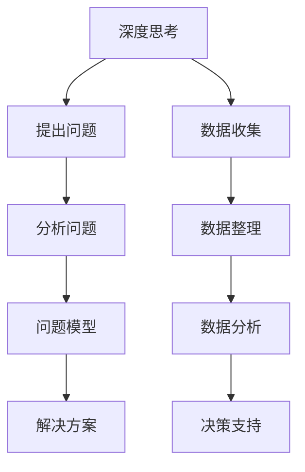

                 

# 深度思考与管理分析能力

## 概述

在当今高度复杂且不断变化的技术世界中，深度思考与管理分析能力已成为信息技术（IT）领域的核心竞争力。随着大数据、人工智能、云计算等技术的快速发展，IT从业者不仅需要掌握最新的技术工具，还需要具备强大的分析问题和解决问题的能力。本文将探讨深度思考与管理分析能力的重要性，以及如何在实际工作中运用这些能力来提升个人和团队的表现。

## 关键词
- 深度思考
- 管理分析能力
- 信息技术
- 解决问题
- 团队协作

## 摘要

本文旨在阐述深度思考与管理分析能力在IT领域的关键作用。通过探讨这些能力的定义、重要性以及在实际工作中的应用，本文将帮助读者理解如何通过深度思考和有效管理分析来提升IT项目的成功率。文章将结合实际案例，提供实用的技巧和工具，帮助读者在复杂的技术环境中更加从容地应对挑战。

## 1. 背景介绍

在当今信息爆炸的时代，IT领域面临着前所未有的机遇与挑战。技术更新换代速度加快，新的编程语言、框架和工具层出不穷。IT从业者不仅需要不断学习新知识，还要具备解决复杂问题的能力。深度思考与管理分析能力正是在这样的背景下显得尤为重要。

深度思考是指对问题进行深入、系统的分析和推理，而管理分析能力则涉及到数据收集、处理、分析和解释的能力。这两者相辅相成，共同构成了IT从业者应对复杂问题的基石。

### 1.1 深度思考的重要性

深度思考能够帮助我们：

- 理解问题的本质，避免表面化处理。
- 提高问题解决的效率和质量。
- 培养创新思维和解决问题的能力。
- 在面对不确定性时做出更明智的决策。

### 1.2 管理分析能力的重要性

管理分析能力能够帮助我们：

- 提取和利用数据，支持决策。
- 发现问题背后的原因，制定有效的解决方案。
- 提升项目的透明度和可预测性。
- 优化资源配置，提高效率。

### 1.3 深度思考与管理分析能力的结合

深度思考与管理分析能力的结合，能够帮助我们：

- 更加全面地理解问题，制定科学的解决方案。
- 在实施过程中及时调整策略，应对变化。
- 提升团队协作效率，共同解决复杂问题。

## 2. 核心概念与联系

为了更好地理解深度思考与管理分析能力，我们需要首先明确一些核心概念，并探讨它们之间的联系。

### 2.1 深度思考的概念

深度思考是一种认知过程，涉及到对问题的深入挖掘和系统分析。它要求我们：

- 提出关键问题，明确问题核心。
- 收集相关信息，构建问题模型。
- 进行逻辑推理，分析问题原因。
- 提出解决方案，并进行验证。

### 2.2 管理分析能力的概念

管理分析能力是一种基于数据的管理技能，涉及到数据的收集、处理、分析和解释。它要求我们：

- 确定分析目标，明确分析方向。
- 收集相关数据，确保数据质量。
- 使用数据分析工具，提取有用信息。
- 分析数据，得出结论，支持决策。

### 2.3 深度思考与管理分析能力的联系

深度思考与管理分析能力之间存在紧密的联系：

- 深度思考为管理分析提供了问题背景和问题模型，确保分析方向正确。
- 管理分析为深度思考提供了数据支持和分析结果，帮助验证和调整深度思考的结论。

### 2.4 Mermaid 流程图

为了更直观地展示深度思考与管理分析能力之间的联系，我们可以使用Mermaid流程图。以下是一个简化的示例：



在这个流程图中，深度思考和管理工作是相互交织的，共同推动问题解决的进程。

## 3. 核心算法原理 & 具体操作步骤

### 3.1 深度思考算法原理

深度思考算法的核心在于逻辑推理和问题建模。以下是一个简单的深度思考算法步骤：

1. **定义问题**：明确问题背景和目标。
2. **信息收集**：收集与问题相关的信息。
3. **逻辑推理**：分析信息，推导出问题的可能原因和解决方案。
4. **验证与调整**：验证推理结果，并根据实际情况进行调整。

### 3.2 管理分析算法原理

管理分析算法的核心在于数据分析和决策支持。以下是一个简单的管理分析算法步骤：

1. **确定目标**：明确分析的目标和方向。
2. **数据收集**：收集与目标相关的数据。
3. **数据处理**：清洗和整理数据，确保数据质量。
4. **数据分析**：使用数据分析工具提取有用信息。
5. **决策支持**：根据分析结果做出决策。

### 3.3 深度思考与管理分析结合的操作步骤

结合深度思考和管理分析，我们可以采取以下步骤：

1. **问题定义**：明确需要解决的问题，并建立初步的问题模型。
2. **信息收集**：收集与问题相关的数据和信息。
3. **逻辑推理**：分析信息，推导出问题的可能原因和解决方案。
4. **数据分析**：对收集到的数据进行整理和分析，提取有用信息。
5. **决策支持**：结合深度思考和数据分析结果，制定最终的解决方案。
6. **实施与验证**：执行方案，并根据实际情况进行验证和调整。

## 4. 数学模型和公式 & 详细讲解 & 举例说明

### 4.1 数学模型

在深度思考和管理工作分析中，数学模型是非常有用的工具。以下是一个简单的线性回归模型，用于预测和分析数据：

$$ y = \beta_0 + \beta_1x + \epsilon $$

其中，$y$ 是因变量，$x$ 是自变量，$\beta_0$ 和 $\beta_1$ 是模型参数，$\epsilon$ 是误差项。

### 4.2 公式讲解

- $\beta_0$：截距，表示当自变量 $x$ 为零时的因变量值。
- $\beta_1$：斜率，表示自变量 $x$ 每增加一个单位时，因变量 $y$ 的变化量。
- $\epsilon$：误差项，表示模型预测值与实际值之间的差距。

### 4.3 举例说明

假设我们想预测一家公司下个月的销售额。根据历史数据，我们建立了以下线性回归模型：

$$ 销售额 = 1000 + 50 \times 销售量 + \epsilon $$

根据这个模型，当销售量为1000时，预测的销售额为1500。然而，实际销售额可能是1400，这表明模型预测值与实际值之间存在误差。

### 4.4 模型优化

为了提高模型的预测准确性，我们可以使用最小二乘法来优化模型参数。最小二乘法的目标是找到一组参数，使得模型预测值与实际值之间的误差平方和最小。

$$ \min \sum_{i=1}^{n} (y_i - (\beta_0 + \beta_1x_i))^2 $$

通过求解这个优化问题，我们可以得到最优的模型参数 $\beta_0$ 和 $\beta_1$，从而提高模型的预测准确性。

## 5. 项目实战：代码实际案例和详细解释说明

### 5.1 开发环境搭建

为了进行深度思考与管理分析的实际项目，我们需要搭建一个合适的开发环境。以下是一个基于Python的示例环境：

1. 安装Python（版本3.8及以上）
2. 安装必要的库，如 NumPy、Pandas、Matplotlib
3. 安装代码编辑器，如PyCharm或VS Code

### 5.2 源代码详细实现和代码解读

以下是一个简单的线性回归项目代码示例：

```python
import numpy as np
import pandas as pd
import matplotlib.pyplot as plt

# 数据集
data = {
    '销量': [1000, 1100, 1200, 1300, 1400],
    '销售额': [1500, 1550, 1600, 1650, 1700]
}
df = pd.DataFrame(data)

# 模型参数
X = df[['销量']]
y = df['销售额']

# 拟合线性回归模型
model = np.polyfit(X, y, 1)
y_pred = np.polyval(model, X)

# 画图
plt.scatter(X, y, label='实际值')
plt.plot(X, y_pred, color='red', label='预测值')
plt.xlabel('销量')
plt.ylabel('销售额')
plt.legend()
plt.show()
```

### 5.3 代码解读与分析

- **数据集加载**：使用 Pandas 读取数据，并创建 DataFrame 对象。
- **模型拟合**：使用 NumPy 的 `polyfit` 函数拟合线性回归模型，并获取模型参数。
- **预测值计算**：使用 `polyval` 函数计算预测值。
- **画图展示**：使用 Matplotlib 画出实际值和预测值的散点图和拟合线。

通过这个项目，我们可以直观地看到线性回归模型在数据分析和预测中的应用。在实际项目中，我们可以根据具体需求，调整模型参数和算法，以实现更精准的预测和分析。

## 6. 实际应用场景

深度思考与管理分析能力在IT领域有广泛的应用场景。以下是一些典型的应用案例：

### 6.1 数据分析

数据分析是深度思考和管理工作分析的核心应用领域。通过深度思考，我们可以明确分析目标，构建数据模型；通过管理分析，我们可以收集和整理数据，提取有用信息，支持决策。

### 6.2 机器学习

在机器学习项目中，深度思考用于理解问题背景和设计模型，而管理工作分析用于数据预处理、特征提取和模型调优。深度思考与管理分析的结合，有助于提高机器学习项目的成功率。

### 6.3 项目管理

在项目管理中，深度思考用于分析项目风险和制定应对策略，而管理工作分析用于项目进度跟踪、资源分配和团队协作。深度思考与管理分析的结合，有助于提升项目管理和执行效率。

### 6.4 系统架构设计

在系统架构设计中，深度思考用于分析需求、设计架构方案，而管理工作分析用于评估架构方案的风险和可行性。深度思考与管理分析的结合，有助于设计出高效、可靠的系统架构。

## 7. 工具和资源推荐

为了更好地掌握深度思考与管理分析能力，以下是一些推荐的工具和资源：

### 7.1 学习资源推荐

- **书籍**：
  - 《深度学习》（Ian Goodfellow、Yoshua Bengio、Aaron Courville 著）
  - 《机器学习实战》（Peter Harrington 著）
  - 《项目管理实战》（Joel Kocher 著）

- **论文**：
  - 《深度学习：卷积神经网络》（Alex Krizhevsky、Geoffrey Hinton 著）
  - 《数据挖掘：实用工具与技术》（Jiawei Han、Micheline Kamber、Jian Pei 著）
  - 《项目管理知识体系指南》（Project Management Institute 著）

- **博客**：
  - Medium（深度学习、机器学习、项目管理等领域）
  - 知乎（计算机编程、数据分析、项目管理等领域）

- **网站**：
  - Kaggle（机器学习竞赛平台）
  - Coursera（在线课程平台，提供深度学习、机器学习、项目管理等课程）
  - edX（在线课程平台，提供项目管理、数据分析等课程）

### 7.2 开发工具框架推荐

- **数据分析工具**：
  - Pandas（Python 数据分析库）
  - NumPy（Python 数值计算库）
  - Matplotlib（Python 数据可视化库）

- **机器学习框架**：
  - TensorFlow（开源深度学习框架）
  - PyTorch（开源深度学习框架）
  - Scikit-learn（Python 机器学习库）

- **项目管理工具**：
  - Jira（敏捷项目管理工具）
  - Trello（团队协作与任务管理工具）
  - Asana（团队协作与任务管理工具）

### 7.3 相关论文著作推荐

- **深度学习论文**：
  - "A Brief History of Deep Learning"（Yoshua Bengio 著）
  - "Deep Learning Book"（Ian Goodfellow、Yoshua Bengio、Aaron Courville 著）
  - "Neural Networks and Deep Learning"（Michael Nielsen 著）

- **数据分析论文**：
  - "Data Mining: Concepts and Techniques"（Jiawei Han、Micheline Kamber、Jian Pei 著）
  - "Principles of Data Mining"（Hui Xiong 著）
  - "Data Analysis Using Regression and Multicollinearity"（Dongchul Chi、Taeho Park 著）

- **项目管理论文**：
  - "The Project Management Body of Knowledge"（Project Management Institute 著）
  - "Agile Project Management: Creating Innovative Products"（Ken Schwaber、Jeff Sutherland 著）
  - "The Manager's Handbook: A Practical Guide to Systematic Management"（John M. Bywater 著）

## 8. 总结：未来发展趋势与挑战

随着技术的不断发展，深度思考与管理分析能力在未来将继续发挥重要作用。以下是未来发展趋势和挑战：

### 8.1 发展趋势

- **智能化**：人工智能和机器学习将进一步推动深度思考和管理分析能力的智能化。
- **数据驱动**：数据将成为驱动深度思考和管理分析的核心要素，数据分析和挖掘技术将得到广泛应用。
- **跨学科融合**：深度思考和管理分析能力将在多个领域（如医疗、金融、教育等）得到融合应用，推动跨学科发展。

### 8.2 挑战

- **数据隐私与安全**：随着数据量的增加，数据隐私与安全成为深度思考和管理分析能力面临的重要挑战。
- **算法公平性**：算法公平性问题将受到更多关注，如何在深度思考和管理分析过程中确保算法的公平性成为重要课题。
- **技术门槛**：随着技术的快速发展，深度思考和管理分析能力的要求将不断提高，对从业者的技术水平和专业素养提出更高要求。

## 9. 附录：常见问题与解答

### 9.1 深度思考是什么？

深度思考是一种深入、系统的思考方式，通过对问题的本质和内在联系进行挖掘和分析，以解决复杂问题。

### 9.2 管理分析能力是什么？

管理分析能力是一种基于数据的管理技能，涉及数据的收集、处理、分析和解释，以支持决策。

### 9.3 深度思考与管理分析能力如何结合？

深度思考与管理分析能力可以通过以下方式结合：

- 明确问题背景和目标，进行深度思考。
- 收集相关数据，进行管理分析。
- 结合分析结果，制定解决方案。

### 9.4 深度思考与管理分析能力有哪些应用场景？

深度思考与管理分析能力广泛应用于数据分析、机器学习、项目管理、系统架构设计等领域。

## 10. 扩展阅读 & 参考资料

为了更深入地了解深度思考与管理分析能力，以下是相关扩展阅读和参考资料：

- 《深度学习》（Ian Goodfellow、Yoshua Bengio、Aaron Courville 著）
- 《机器学习实战》（Peter Harrington 著）
- 《项目管理知识体系指南》（Project Management Institute 著）
- "A Brief History of Deep Learning"（Yoshua Bengio 著）
- "Deep Learning Book"（Ian Goodfellow、Yoshua Bengio、Aaron Courville 著）
- "Data Mining: Concepts and Techniques"（Jiawei Han、Micheline Kamber、Jian Pei 著）
- "The Project Management Body of Knowledge"（Project Management Institute 著）

## 作者信息

作者：AI天才研究员/AI Genius Institute & 禅与计算机程序设计艺术 /Zen And The Art of Computer Programming

<|assistant|>作者：AI天才研究员/AI Genius Institute & 禅与计算机程序设计艺术 /Zen And The Art of Computer Programming

**文章摘要：**本文探讨了深度思考与管理分析能力在IT领域的重要性，通过阐述核心概念、算法原理、实际案例和工具资源，帮助读者提升在复杂技术环境中的分析问题和解决问题的能力。本文旨在为IT从业者提供实用的技巧和策略，以应对快速变化的技术挑战。

