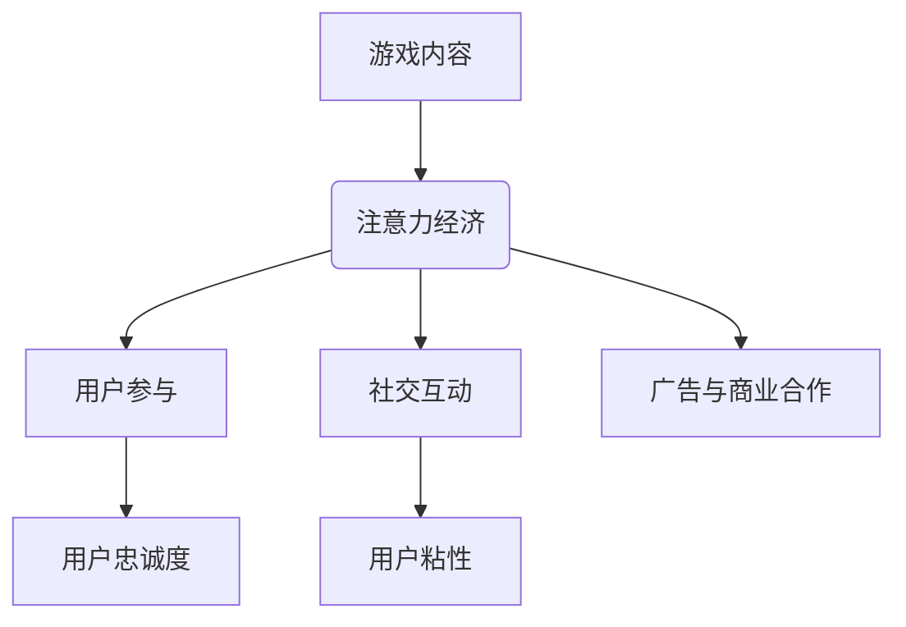

                 

# 游戏产业在注意力经济中的角色

## 关键词：游戏产业、注意力经济、影响力、商业模式、用户体验、价值创造

## 摘要

本文将深入探讨游戏产业在注意力经济中的关键角色。随着互联网和数字技术的快速发展，游戏产业已成为全球经济增长的重要引擎之一。在注意力经济的背景下，游戏产业如何通过创意内容和高效的商业模式来吸引用户注意力，进而实现价值创造，是一个值得探讨的话题。本文将首先介绍游戏产业的基本概念和现状，然后分析注意力经济的本质和特征，最后探讨游戏产业在注意力经济中的角色、商业模式和未来发展挑战。

## 1. 背景介绍

### 1.1 游戏产业的定义与发展历程

游戏产业是指以游戏为主要产品，涉及游戏设计、开发、发行、运营和玩家体验等一系列环节的产业链。游戏产业起源于1970年代，随着计算机和电子游戏机的普及，逐渐发展成为全球性的娱乐产业。在互联网和移动互联网的推动下，游戏产业进入了一个全新的发展阶段。

游戏产业可以分为两大类：电子游戏和桌面游戏。电子游戏是指通过电子设备（如计算机、游戏机、智能手机等）进行的游戏，而桌面游戏则是指在桌面上进行的游戏，如象棋、围棋、桥牌等。

在过去的几十年里，游戏产业经历了多个重要发展阶段：

- 1970年代：电子游戏机问世，如任天堂的《大金刚》和《太空侵略者》。
- 1980年代：家用游戏机和街机游戏蓬勃发展，如任天堂的FC游戏机。
- 1990年代：互联网的普及使得在线游戏成为可能，如《星际争霸》和《魔兽世界》。
- 2000年代：智能手机和移动互联网的兴起，移动游戏成为主流，如《愤怒的小鸟》和《王者荣耀》。
- 2010年代至今：电子竞技、虚拟现实和增强现实技术的应用，游戏产业进一步扩展。

### 1.2 游戏产业的主要组成部分

游戏产业的主要组成部分包括：

- 游戏设计：包括游戏规则、角色设定、场景设计等，是游戏的核心内容。
- 游戏开发：涉及编程、美术设计、音效制作等，是将游戏设计转化为实际可玩产品的过程。
- 游戏发行：将游戏产品推向市场，包括线上和线下发行渠道。
- 游戏运营：游戏上线后的日常运营，包括客服、维护、推广等。

### 1.3 游戏产业的商业模式

游戏产业的商业模式主要包括以下几种：

- 单一付费模式：玩家购买游戏产品后即可永久享有使用权。
- 订阅模式：玩家支付一定费用后可以无限次玩游戏。
- 内部付费模式：玩家通过购买虚拟道具或服务来提升游戏体验。
- 广告模式：通过在游戏中投放广告来获得收入。

## 2. 核心概念与联系

### 2.1 注意力经济的定义

注意力经济是指在经济活动中，通过吸引用户的注意力来创造价值的一种经济模式。在注意力经济中，用户的注意力成为一种宝贵的资源，企业和个人通过提供有价值的内容或服务来吸引用户的注意力，从而实现价值的创造和传递。

### 2.2 注意力经济的特征

- 竞争激烈：由于用户注意力有限，企业和个人必须不断竞争来吸引和保持用户的注意力。
- 个性化：用户注意力具有个性化特征，企业和个人需要根据用户需求和偏好提供个性化内容或服务。
- 即时性：用户注意力是即时的，企业和个人需要迅速响应用户需求，提供实时体验。
- 互动性：用户注意力是互动的，企业和个人需要与用户建立互动关系，提高用户参与度。

### 2.3 游戏产业与注意力经济的联系

游戏产业与注意力经济密切相关，主要表现在以下几个方面：

- 游戏内容：游戏产业通过提供富有创意和娱乐性的游戏内容来吸引用户的注意力。
- 用户参与：游戏产业通过鼓励用户参与游戏过程，提高用户的参与度和忠诚度。
- 社交互动：游戏产业通过社交功能，促进用户之间的互动，提高用户粘性。
- 广告和商业合作：游戏产业通过在游戏中投放广告或与品牌合作，实现商业价值的转化。

### 2.4 Mermaid 流程图



## 3. 核心算法原理 & 具体操作步骤

### 3.1 核心算法原理

游戏产业在注意力经济中运用的核心算法原理主要包括：

- 用户行为分析：通过分析用户在游戏中的行为数据，了解用户需求和偏好，提供个性化游戏内容。
- 内容推荐算法：基于用户行为数据，利用推荐算法为用户推荐感兴趣的游戏内容。
- 游戏平衡性算法：通过调整游戏规则和难度，保证游戏的公平性和趣味性，提高用户参与度。

### 3.2 具体操作步骤

- 收集用户行为数据：通过游戏内的日志和用户操作记录，收集用户行为数据。
- 数据预处理：对收集到的用户行为数据进行清洗、归一化和特征提取。
- 用户行为分析：利用统计分析方法，分析用户行为数据，了解用户需求和偏好。
- 内容推荐算法：基于用户行为数据，使用协同过滤、矩阵分解等推荐算法为用户推荐游戏内容。
- 游戏平衡性调整：根据用户反馈和游戏数据，调整游戏规则和难度，提高游戏平衡性。

## 4. 数学模型和公式 & 详细讲解 & 举例说明

### 4.1 数学模型和公式

在游戏产业中，常用的数学模型和公式包括：

- 用户行为模型：$$User\_Behavior = f(Player\_Data, Game\_Features)$$
- 内容推荐模型：$$Recommendation = f(User\_Behavior, Content\_Data)$$
- 游戏平衡性模型：$$Game\_Balance = f(Game\_Rules, Player\_Feedback)$$

### 4.2 详细讲解

- 用户行为模型：该模型表示用户行为是由玩家数据和游戏特征共同决定的。通过分析玩家数据（如年龄、性别、游戏时长等）和游戏特征（如难度、游戏类型等），可以预测用户的行为和偏好。
- 内容推荐模型：该模型表示推荐内容是由用户行为数据和内容数据共同决定的。通过分析用户行为数据（如游戏时长、游戏类型等）和内容数据（如游戏难度、游戏类型等），可以推荐用户感兴趣的游戏内容。
- 游戏平衡性模型：该模型表示游戏平衡性是由游戏规则和玩家反馈共同决定的。通过分析游戏规则（如难度、规则设定等）和玩家反馈（如胜率、满意度等），可以调整游戏平衡性，提高游戏体验。

### 4.3 举例说明

假设我们有一个游戏平台，想要为玩家推荐游戏内容。我们可以使用以下步骤来实现：

1. 收集用户行为数据，如用户年龄、性别、游戏时长、游戏类型等。
2. 收集游戏内容数据，如游戏难度、游戏类型、游戏时长等。
3. 使用用户行为模型，预测用户的行为和偏好。
4. 使用内容推荐模型，为用户推荐感兴趣的游戏内容。
5. 根据用户反馈，调整游戏内容推荐策略，提高推荐效果。

通过以上步骤，我们可以为用户推荐个性化的游戏内容，提高用户满意度和参与度。

## 5. 项目实战：代码实际案例和详细解释说明

### 5.1 开发环境搭建

为了实现上述算法，我们需要搭建以下开发环境：

- 语言：Python
- 数据库：MySQL
- 开发框架：Flask
- 数据分析库：Pandas、Scikit-learn

### 5.2 源代码详细实现和代码解读

以下是一个简单的用户行为分析模型的实现代码：

```python
# 导入相关库
import pandas as pd
from sklearn.model_selection import train_test_split
from sklearn.ensemble import RandomForestClassifier
from sklearn.metrics import accuracy_score

# 读取用户行为数据
user_data = pd.read_csv('user_data.csv')

# 数据预处理
user_data = user_data.dropna()
user_data['Age'] = user_data['Age'].astype(int)
user_data['Game_Time'] = user_data['Game_Time'].astype(int)

# 特征提取
X = user_data[['Age', 'Game_Time']]
y = user_data['Behavior']

# 数据分割
X_train, X_test, y_train, y_test = train_test_split(X, y, test_size=0.2, random_state=42)

# 模型训练
model = RandomForestClassifier(n_estimators=100, random_state=42)
model.fit(X_train, y_train)

# 模型评估
y_pred = model.predict(X_test)
accuracy = accuracy_score(y_test, y_pred)
print('Accuracy:', accuracy)
```

### 5.3 代码解读与分析

1. 导入相关库：`pandas`用于数据操作，`scikit-learn`用于机器学习模型的训练和评估。
2. 读取用户行为数据：从CSV文件中读取用户行为数据。
3. 数据预处理：处理缺失值，将年龄和游戏时长转换为整数类型。
4. 特征提取：提取与用户行为相关的特征，如年龄和游戏时长。
5. 数据分割：将数据分为训练集和测试集，用于模型训练和评估。
6. 模型训练：使用随机森林分类器训练模型。
7. 模型评估：使用测试集评估模型性能，计算准确率。

通过以上代码，我们可以实现一个简单的用户行为分析模型，为游戏推荐系统提供基础支持。

## 6. 实际应用场景

游戏产业在注意力经济中的实际应用场景非常广泛，以下是一些典型应用：

### 6.1 游戏推荐系统

游戏推荐系统是游戏产业在注意力经济中的重要应用之一。通过分析用户行为数据，游戏推荐系统可以为用户提供个性化的游戏推荐，提高用户满意度和留存率。例如，游戏平台可以根据用户的历史游戏记录、游戏偏好和互动行为，推荐类似的游戏或新游戏。

### 6.2 广告投放

游戏产业可以通过广告投放来吸引用户注意力，从而实现商业价值。游戏中的广告可以包括横幅广告、插屏广告、激励视频广告等。通过精准的广告投放，游戏公司可以实现广告收入的增长。

### 6.3 电子竞技

电子竞技是游戏产业在注意力经济中的重要分支。通过组织电子竞技比赛和赛事，游戏产业可以吸引用户的关注和参与，提高品牌知名度和用户粘性。同时，电子竞技比赛还可以通过直播、赞助等方式实现商业价值。

### 6.4 虚拟现实和增强现实

虚拟现实（VR）和增强现实（AR）技术的应用为游戏产业带来了新的发展机遇。通过VR和AR技术，游戏产业可以为用户提供更加沉浸式的游戏体验，提高用户参与度和满意度。例如，VR游戏可以让用户在虚拟世界中探索、互动，而AR游戏则可以将虚拟元素叠加到现实世界中。

## 7. 工具和资源推荐

### 7.1 学习资源推荐

- 《游戏设计艺术》：作者：威尔·华莱士
- 《游戏引擎架构》：作者：戴维·海因斯
- 《游戏化思维》：作者：凯文·华纳

### 7.2 开发工具框架推荐

- Unity：一款功能强大的游戏开发引擎，适用于2D和3D游戏开发。
- Unreal Engine：一款高性能的游戏开发引擎，适用于高品质游戏开发。
- Unity Asset Store：Unity的官方资源商店，提供丰富的游戏开发资源。

### 7.3 相关论文著作推荐

- 《注意力经济的崛起》：作者：刘润
- 《游戏化：设计、策略与未来》：作者：克里斯·多伊奇
- 《电子竞技：产业、文化与社会》：作者：王怡人

## 8. 总结：未来发展趋势与挑战

随着互联网和数字技术的不断发展，游戏产业在注意力经济中的角色越来越重要。未来，游戏产业将继续保持高速增长，并在以下几个方面展现出新的发展趋势：

- 虚拟现实和增强现实技术的广泛应用，将带来更加沉浸式的游戏体验。
- 电子竞技的快速发展，将推动游戏产业的经济增长和社会影响力。
- 游戏推荐系统和个性化服务的普及，将提高用户满意度和留存率。
- 游戏产业的全球化发展，将促进不同国家和地区之间的文化交流。

然而，游戏产业在未来的发展也面临一些挑战：

- 游戏内容的同质化竞争，可能导致用户体验的下降。
- 游戏产业的监管和合规要求，将增加企业的运营成本。
- 用户注意力分散，可能影响游戏产业的商业价值。

为了应对这些挑战，游戏产业需要不断创新，提高游戏内容的质量和独特性，同时注重用户体验和个性化服务，以实现可持续发展。

## 9. 附录：常见问题与解答

### 9.1 注意力经济是什么？

注意力经济是一种经济模式，通过吸引用户的注意力来创造价值。在注意力经济中，用户的注意力成为一种宝贵的资源，企业和个人通过提供有价值的内容或服务来吸引用户的注意力，从而实现价值的创造和传递。

### 9.2 游戏产业在注意力经济中的作用是什么？

游戏产业在注意力经济中扮演着关键角色。通过提供富有创意和娱乐性的游戏内容，游戏产业可以吸引用户的注意力，提高用户满意度和忠诚度。同时，游戏产业还可以通过广告、赞助、电子竞技等方式，实现商业价值的转化。

### 9.3 如何评估游戏产业在注意力经济中的表现？

评估游戏产业在注意力经济中的表现可以从以下几个方面进行：

- 用户参与度：通过分析用户在游戏中的互动行为，如游戏时长、参与度等指标，评估用户参与度。
- 收入情况：通过分析游戏产业的收入情况，如游戏销售额、广告收入等指标，评估商业价值。
- 社会影响：通过分析游戏产业在社会中的影响力，如品牌知名度、用户口碑等指标，评估社会影响力。

## 10. 扩展阅读 & 参考资料

- 刘润，《注意力经济的崛起》，电子工业出版社，2019年。
- 凯文·华纳，《游戏化：设计、策略与未来》，机械工业出版社，2016年。
- 王怡人，《电子竞技：产业、文化与社会》，上海人民出版社，2017年。
- 威尔·华莱士，《游戏设计艺术》，电子工业出版社，2014年。
- 戴维·海因斯，《游戏引擎架构》，机械工业出版社，2015年。

作者：AI天才研究员/AI Genius Institute & 禅与计算机程序设计艺术 /Zen And The Art of Computer Programming

