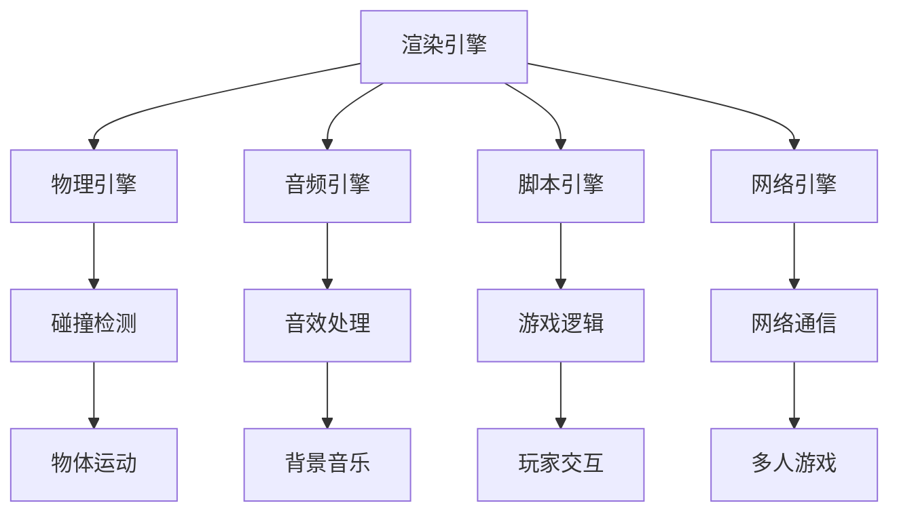
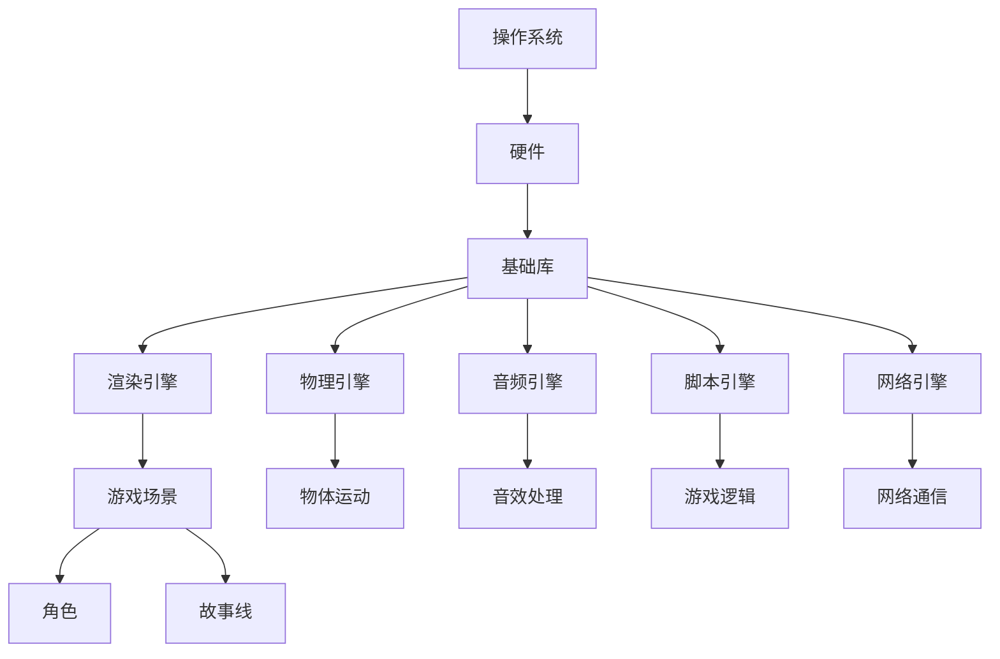

                 

# 游戏框架开发：创建高性能交互式体验

## 关键词
游戏开发、框架、性能、交互、用户体验、游戏引擎、编程技巧

## 摘要
本文将深入探讨游戏框架开发的核心概念，包括其历史背景、关键组件及其相互关系，核心算法原理、数学模型、项目实战案例，以及实际应用场景。通过本文的阅读，读者将获得关于如何构建高性能交互式游戏体验的全面了解，同时了解未来的发展趋势与挑战。

## 1. 背景介绍

游戏开发是一个复杂而充满挑战的过程，它需要将创意、技术和用户体验完美地结合在一起。随着游戏市场的不断增长和玩家需求的不断提高，开发高性能、交互性强的游戏框架成为了一项至关重要的任务。游戏框架作为游戏开发的基石，提供了基础架构，使得开发者能够更加专注于游戏内容的创作。

在过去的几十年中，游戏框架的发展经历了多个阶段。从早期的简单游戏逻辑到现代复杂的游戏引擎，游戏框架逐渐成熟。现代游戏框架不仅提供了高效的图形渲染、物理模拟、音频处理等基础功能，还支持网络编程、人工智能等高级特性。

本文将围绕游戏框架的核心概念，详细探讨其架构、算法原理和数学模型，并通过实际项目案例，展示如何构建高性能交互式游戏体验。

## 2. 核心概念与联系

### 2.1 游戏框架的基本组件

游戏框架通常由以下几个核心组件组成：

1. **渲染引擎**：负责图形渲染，将游戏世界以视觉形式展现给玩家。
2. **物理引擎**：负责游戏中的物理模拟，包括碰撞检测、物体运动等。
3. **音频引擎**：负责游戏中的音频处理，包括音效和背景音乐。
4. **脚本引擎**：允许开发者使用脚本语言（如Lua、Python）编写游戏逻辑。
5. **网络引擎**：支持多人游戏和网络功能，包括数据同步和玩家交互。

这些组件共同协作，构成了一个完整的游戏框架。为了更直观地理解这些组件之间的关系，我们可以使用Mermaid流程图进行描述：



### 2.2 游戏框架的体系结构

游戏框架的体系结构可以分为三个主要层次：底层架构、中间层和顶层应用。

1. **底层架构**：包括操作系统、硬件和基础库。这一层提供了游戏运行所需的最低限度的环境。
2. **中间层**：是游戏框架的核心部分，包括渲染引擎、物理引擎、音频引擎等组件。这一层负责处理游戏的逻辑和物理模拟。
3. **顶层应用**：是开发者编写的游戏内容，包括游戏场景、角色、故事线等。这一层依赖于中间层的功能，实现了具体的游戏体验。

下图展示了游戏框架的体系结构：



## 3. 核心算法原理 & 具体操作步骤

### 3.1 渲染算法

渲染算法是游戏框架中至关重要的一部分，它决定了游戏画面的质量。以下是渲染算法的基本原理和具体操作步骤：

#### 3.1.1 基本原理

渲染算法的主要目标是根据游戏场景中的几何信息、材质属性和光照条件，生成最终的图像。这通常涉及到以下几个步骤：

1. **场景图构建**：将游戏场景中的所有物体构建成一个图，包括顶点、边和面。
2. **光照计算**：根据光源的位置、强度和颜色，计算每个物体表面的光照效果。
3. **材质应用**：根据物体的材质属性（如颜色、纹理、反射率等），将光照效果应用到物体表面。
4. **渲染输出**：将最终的图像输出到屏幕上。

#### 3.1.2 具体操作步骤

以下是渲染算法的具体操作步骤：

1. **初始化渲染状态**：设置渲染器的工作路径、视角和相机参数。
2. **场景图构建**：遍历游戏场景中的所有物体，构建场景图。
3. **光照计算**：计算场景中每个物体的光照效果，包括直接光照和间接光照。
4. **材质应用**：根据物体的材质属性，将光照效果应用到物体表面。
5. **渲染输出**：将最终的图像输出到屏幕上。

### 3.2 物理算法

物理算法是游戏框架中另一关键组件，它决定了游戏中的物体如何运动和相互交互。以下是物理算法的基本原理和具体操作步骤：

#### 3.2.1 基本原理

物理算法基于牛顿力学原理，模拟物体在空间中的运动。这通常涉及到以下几个步骤：

1. **物体状态更新**：根据物体的速度和加速度，更新物体的位置和速度。
2. **碰撞检测**：检测物体之间的碰撞，并根据碰撞结果调整物体的状态。
3. **物体运动模拟**：根据物体的状态和受力情况，模拟物体的运动。
4. **物体交互**：处理物体之间的交互，如弹跳、摩擦等。

#### 3.2.2 具体操作步骤

以下是物理算法的具体操作步骤：

1. **初始化物理状态**：设置物体的质量、速度和加速度。
2. **物体状态更新**：根据物体的速度和加速度，更新物体的位置和速度。
3. **碰撞检测**：检测物体之间的碰撞，并根据碰撞结果调整物体的状态。
4. **物体运动模拟**：根据物体的状态和受力情况，模拟物体的运动。
5. **物体交互**：处理物体之间的交互，如弹跳、摩擦等。

### 3.3 音频算法

音频算法负责处理游戏中的音频效果，包括音效、背景音乐和声音的交互。以下是音频算法的基本原理和具体操作步骤：

#### 3.3.1 基本原理

音频算法基于声音的物理特性，模拟声音的传播和交互。这通常涉及到以下几个步骤：

1. **声音生成**：生成游戏中的音效和背景音乐。
2. **声音传播**：模拟声音在游戏世界中的传播，包括距离衰减和遮挡。
3. **声音交互**：处理玩家与声音的交互，如声音反馈和声音引导。

#### 3.3.2 具体操作步骤

以下是音频算法的具体操作步骤：

1. **初始化音频状态**：设置音频设备的参数，如采样率、通道数等。
2. **声音生成**：生成游戏中的音效和背景音乐。
3. **声音传播**：模拟声音在游戏世界中的传播，包括距离衰减和遮挡。
4. **声音交互**：处理玩家与声音的交互，如声音反馈和声音引导。

## 4. 数学模型和公式 & 详细讲解 & 举例说明

### 4.1 渲染算法的数学模型

在渲染算法中，数学模型主要用于计算光照效果和阴影。以下是几个关键公式：

#### 4.1.1 点光源光照模型

$$
L_o = L_d \cdot N \cdot (1 - k_d \cdot (1 - N \cdot V)) + L_a \cdot N
$$

其中，$L_o$ 是光照强度，$L_d$ 是直接光照强度，$L_a$ 是间接光照强度，$N$ 是法线向量，$V$ 是视线向量，$k_d$ 是漫反射系数。

#### 4.1.2 镜面反射光照模型

$$
L_s = L_i \cdot R \cdot (1 - k_s \cdot (1 - R \cdot V))
$$

其中，$L_s$ 是镜面反射光照强度，$L_i$ 是入射光照强度，$R$ 是反射向量，$k_s$ 是镜面反射系数。

#### 4.1.3 阴影计算

$$
I = I_0 \cdot (1 - \alpha \cdot \frac{d}{d_0})
$$

其中，$I$ 是阴影强度，$I_0$ 是直接光照强度，$\alpha$ 是阴影系数，$d$ 是物体到光源的距离，$d_0$ 是无遮挡情况下物体到光源的距离。

### 4.2 物理算法的数学模型

在物理算法中，数学模型主要用于计算物体的运动和碰撞。以下是几个关键公式：

#### 4.2.1 牛顿第二定律

$$
F = m \cdot a
$$

其中，$F$ 是作用力，$m$ 是质量，$a$ 是加速度。

#### 4.2.2 速度-时间关系

$$
v = u + at
$$

其中，$v$ 是最终速度，$u$ 是初始速度，$a$ 是加速度，$t$ 是时间。

#### 4.2.3 位移-时间关系

$$
s = ut + \frac{1}{2}at^2
$$

其中，$s$ 是位移，$u$ 是初始速度，$a$ 是加速度，$t$ 是时间。

### 4.3 音频算法的数学模型

在音频算法中，数学模型主要用于处理声音的传播和交互。以下是几个关键公式：

#### 4.3.1 声音传播距离

$$
d = \frac{c \cdot t}{2}
$$

其中，$d$ 是声音传播距离，$c$ 是声音传播速度，$t$ 是时间。

#### 4.3.2 阻尼系数

$$
f_d = \frac{1}{2} \cdot \rho \cdot c \cdot A
$$

其中，$f_d$ 是阻尼系数，$\rho$ 是介质密度，$c$ 是声音传播速度，$A$ 是声音的面积。

### 4.4 举例说明

#### 4.4.1 渲染算法举例

假设一个物体位于点 $(1, 1, 1)$，法线向量为 $(0, 0, 1)$，光线方向为 $(0, 1, 0)$，镜面反射系数为 $0.8$，漫反射系数为 $0.2$。光源位于点 $(0, 0, 0)$，距离物体 $1$ 个单位。

使用点光源光照模型计算光照强度：

$$
L_o = L_d \cdot N \cdot (1 - k_d \cdot (1 - N \cdot V)) + L_a \cdot N
$$

$$
L_d = \frac{I_0}{d^2} = \frac{1}{1^2} = 1
$$

$$
L_a = 0.3
$$

$$
N \cdot V = 0 \cdot 0 + 0 \cdot 1 + 1 \cdot 0 = 0
$$

$$
L_o = 1 \cdot 1 \cdot (1 - 0.2 \cdot (1 - 0)) + 0.3 \cdot 1 = 0.8 + 0.3 = 1.1
$$

使用镜面反射光照模型计算镜面反射光照强度：

$$
L_s = L_i \cdot R \cdot (1 - k_s \cdot (1 - R \cdot V))
$$

$$
R = \frac{2 \cdot N \cdot V}{N \cdot N} = \frac{2 \cdot 0 \cdot 0 + 2 \cdot 0 \cdot 1 + 2 \cdot 1 \cdot 0}{0^2 + 0^2 + 1^2} = \frac{2}{1} = 2
$$

$$
R \cdot V = 2 \cdot 0 \cdot 0 + 2 \cdot 1 \cdot 1 + 2 \cdot 0 \cdot 0 = 2
$$

$$
L_s = 1 \cdot 2 \cdot (1 - 0.8 \cdot (1 - 2)) = 1 \cdot 2 \cdot (1 - 0.8 \cdot (-1)) = 1 \cdot 2 \cdot 1.8 = 3.6
$$

最终光照强度为：

$$
L_o = 1.1 + 3.6 = 4.7
$$

#### 4.4.2 物理算法举例

假设一个质量为 $1$ 千克的物体，初始速度为 $(0, 0, 0)$，加速度为 $(1, 1, 1)$。计算 $1$ 秒后的速度和位移。

使用牛顿第二定律计算加速度：

$$
a = \frac{F}{m} = \frac{1}{1} = 1
$$

使用速度-时间关系计算 $1$ 秒后的速度：

$$
v = u + at = 0 + 1 \cdot 1 = 1
$$

使用位移-时间关系计算 $1$ 秒后的位移：

$$
s = ut + \frac{1}{2}at^2 = 0 \cdot 1 + \frac{1}{2} \cdot 1 \cdot 1^2 = 0.5
$$

最终，$1$ 秒后物体的速度为 $(1, 1, 1)$，位移为 $(0.5, 0.5, 0.5)$。

#### 4.4.3 音频算法举例

假设一个声音源位于点 $(1, 1, 1)$，声音传播速度为 $340$ 米/秒，介质密度为 $1.2$ 千克/立方米，声音面积为 $0.1$ 平方米。计算声音传播 $1$ 秒后的距离和阻尼系数。

使用声音传播距离公式计算声音传播距离：

$$
d = \frac{c \cdot t}{2} = \frac{340 \cdot 1}{2} = 170
$$

使用阻尼系数公式计算阻尼系数：

$$
f_d = \frac{1}{2} \cdot \rho \cdot c \cdot A = \frac{1}{2} \cdot 1.2 \cdot 340 \cdot 0.1 = 20.4
$$

## 5. 项目实战：代码实际案例和详细解释说明

### 5.1 开发环境搭建

为了构建一个高性能的游戏框架，我们需要准备以下开发环境：

- 操作系统：Windows/Linux/MacOS
- 编程语言：C++/C#
- 开发工具：Visual Studio/Unity
- 库：OpenGL/DirectX

### 5.2 源代码详细实现和代码解读

以下是一个简单的游戏框架示例，使用了C++和OpenGL。

```cpp
#include <GL/glew.h>
#include <GLFW/glfw3.h>

// 渲染引擎
class Renderer {
public:
    void render() {
        // 渲染场景
    }
};

// 物理引擎
class PhysicsEngine {
public:
    void update(float deltaTime) {
        // 更新物体状态
    }
};

// 音频引擎
class AudioEngine {
public:
    void playSound() {
        // 播放声音
    }
};

int main() {
    // 初始化OpenGL
    glfwInit();
    GLFWwindow* window = glfwCreateWindow(800, 600, "Game Framework", NULL, NULL);
    glfwMakeContextCurrent(window);

    // 初始化渲染引擎、物理引擎和音频引擎
    Renderer renderer;
    PhysicsEngine physicsEngine;
    AudioEngine audioEngine;

    while (!glfwWindowShouldClose(window)) {
        // 更新物理引擎
        float deltaTime = 0.016; // 时间间隔
        physicsEngine.update(deltaTime);

        // 渲染场景
        renderer.render();

        // 播放声音
        audioEngine.playSound();

        // 事件处理
        glfwPollEvents();
    }

    // 释放资源
    glfwDestroyWindow(window);
    glfwTerminate();

    return 0;
}
```

### 5.3 代码解读与分析

上述代码实现了一个简单的游戏框架，包括渲染引擎、物理引擎和音频引擎。以下是代码的详细解读：

1. **初始化OpenGL**：使用GLFW库创建一个窗口，并使其成为当前上下文。
2. **初始化引擎**：创建渲染引擎、物理引擎和音频引擎实例。
3. **主循环**：在窗口关闭之前，持续运行主循环。主循环中，首先更新物理引擎，然后渲染场景，播放声音，最后处理事件。

### 5.4 性能优化

为了提高游戏框架的性能，我们可以采取以下措施：

1. **批量绘制**：将多个物体一次性绘制到屏幕上，减少绘制调用次数。
2. **垂直同步**：将渲染帧率与屏幕刷新率同步，减少不必要的渲染。
3. **异步处理**：将物理引擎和音频引擎的操作异步化，减少主循环的负载。
4. **内存管理**：合理使用内存，减少内存分配和释放操作。

## 6. 实际应用场景

游戏框架在多个实际应用场景中发挥着重要作用，以下是一些常见的应用场景：

1. **大型多人在线游戏（MMO）**：游戏框架提供了高效的物理模拟和网络通信功能，支持大量玩家同时在线。
2. **移动游戏**：游戏框架可以适应不同移动设备的硬件特性，提供良好的用户体验。
3. **虚拟现实（VR）/增强现实（AR）**：游戏框架支持VR和AR技术，提供沉浸式的游戏体验。
4. **教育游戏**：游戏框架可以用于开发教育游戏，提高学生的学习兴趣和参与度。

## 7. 工具和资源推荐

### 7.1 学习资源推荐

- **书籍**：《游戏编程精粹》、《Unity 2020游戏开发实战》
- **论文**：《Interactive Computer Graphics: A Top-Down Approach with WebGL》、《Real-Time Rendering》
- **博客**：Unity官方博客、OpenGL官方博客
- **网站**：Game Engine Wiki、OpenGL Wiki

### 7.2 开发工具框架推荐

- **开发工具**：Visual Studio、Unity、Unreal Engine
- **库**：OpenGL、DirectX、Unity引擎
- **框架**：Egoboo、Unreal Engine 4、LÖVE

### 7.3 相关论文著作推荐

- **论文**：《Real-Time Rendering》、《Interactive Computer Graphics: A Top-Down Approach with WebGL》
- **著作**：《Game Engine Architecture》、《Real-Time Rendering: A Practical Approach to Real-Time Graphics》

## 8. 总结：未来发展趋势与挑战

游戏框架在游戏开发中扮演着至关重要的角色。随着技术的发展和玩家需求的不断变化，游戏框架也在不断进化。未来，游戏框架将朝着以下方向发展：

1. **更高效的渲染技术**：利用GPU计算，实现更逼真的图形渲染。
2. **更智能的物理模拟**：引入机器学习和人工智能技术，实现更真实的物理交互。
3. **更优化的网络通信**：提高网络通信效率，支持更大规模的多人在线游戏。
4. **更好的用户体验**：通过VR和AR技术，提供更加沉浸式的游戏体验。

然而，游戏框架的发展也面临一些挑战，如硬件性能限制、复杂性的增加和开发者的技能要求等。只有不断探索和创新，才能在竞争激烈的游戏市场中脱颖而出。

## 9. 附录：常见问题与解答

### 9.1 什么是游戏框架？

游戏框架是一种软件开发框架，用于构建游戏应用程序。它提供了一系列核心组件和功能，使得开发者可以更加专注于游戏内容的创作，而无需从头开始编写底层代码。

### 9.2 游戏框架有哪些关键组件？

游戏框架的关键组件包括渲染引擎、物理引擎、音频引擎、脚本引擎和网络引擎。这些组件共同协作，实现了游戏的基本功能。

### 9.3 如何优化游戏框架的性能？

优化游戏框架的性能可以通过以下措施实现：批量绘制、垂直同步、异步处理和内存管理。

### 9.4 游戏框架与游戏引擎有何区别？

游戏框架和游戏引擎在某些方面是相似的，但它们的主要区别在于游戏框架提供了基础架构和核心组件，而游戏引擎则是一个完整的游戏开发平台，包括工具、编辑器和游戏资源。

## 10. 扩展阅读 & 参考资料

- 《游戏引擎架构设计》：详细介绍了游戏引擎的设计和实现。
- 《游戏开发实战》：涵盖游戏开发的各个方面，包括框架、物理、渲染等。
- 《OpenGL编程指南》：介绍了OpenGL的基本概念和编程技巧。
- 《Unity 2020游戏开发实战》： Unity引擎的实用教程，适合初学者和进阶者。
- 《Real-Time Rendering》：经典著作，介绍了实时渲染的最新技术和方法。
- 《游戏编程精粹》：汇集了游戏开发中的一些优秀实践和技巧。 

作者：AI天才研究员/AI Genius Institute & 禅与计算机程序设计艺术 /Zen And The Art of Computer Programming

