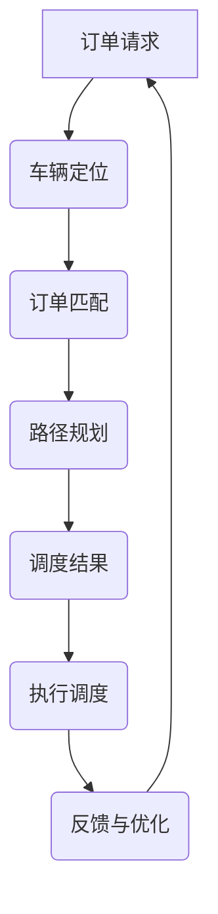

                 

# 滴滴货运2024校招货运调度算法面试题解析

## 1. 背景介绍

在当今快节奏的物流和运输行业中，高效的货运调度算法是确保物流服务质量和降低成本的关键因素。特别是在像滴滴货运这样的网约车平台，合理调度货运资源，优化配送路径，提升配送效率，成为企业竞争的核心。

### 货运调度的重要性

货运调度不仅影响着客户的满意度，也直接关联到企业的运营成本和效率。合理的货运调度能够有效地减少空载率，优化车辆使用率，缩短配送时间，提升整体运营效率。

### 滴滴货运现状

滴滴货运作为国内领先的货运平台，拥有庞大的司机群体和用户基础。为了提高服务质量和效率，滴滴货运持续在货运调度算法方面进行研发和优化。这不仅是一个技术挑战，更是对业务理解和创新能力的要求。

## 2. 核心概念与联系

在探讨滴滴货运的货运调度算法时，我们需要了解以下几个核心概念及其之间的联系：

### 2.1 调度算法的类型

- **基于规则的调度算法**：根据预先设定的规则进行调度，例如固定路线、时间窗等。
- **基于优化算法的调度算法**：使用优化算法，如遗传算法、模拟退火算法等，找到最优解。

### 2.2 关键因素

- **车辆位置和状态**：实时获取车辆的位置信息和状态，如空闲、忙碌、维护等。
- **订单需求**：包括货物类型、重量、目的地等。
- **交通状况**：考虑实时交通状况，以优化配送路径。

### 2.3 Mermaid 流程图



## 3. 核心算法原理 & 具体操作步骤

### 3.1 算法原理

滴滴货运的货运调度算法主要基于**动态规划**和**最优化算法**。算法的核心是寻找从起点到终点的最优路径，同时满足车辆的负载能力和行驶时间。

### 3.2 操作步骤

1. **订单接收**：系统接收到订单请求后，首先进行订单解析，提取关键信息。
2. **车辆定位**：根据车辆的位置信息，筛选出符合订单需求的车辆。
3. **订单匹配**：将订单与车辆进行匹配，考虑车辆状态、订单类型、目的地等因素。
4. **路径规划**：使用最优化算法，如A*算法，计算从车辆位置到订单目的地的最优路径。
5. **调度结果**：根据路径规划和车辆状态，生成调度结果，并将其反馈给司机和系统。
6. **执行调度**：司机根据调度结果，开始执行配送任务。
7. **反馈与优化**：收集配送过程中的反馈数据，用于优化后续的调度策略。

## 4. 数学模型和公式 & 详细讲解 & 举例说明

### 4.1 数学模型

假设有 \( n \) 辆车和 \( m \) 个订单，我们需要确定每辆车应该执行哪个订单，并计算最优路径。这个问题可以用以下数学模型来描述：

\[
\min \sum_{i=1}^{n} \sum_{j=1}^{m} d_{ij} \cdot l_{ij}
\]

其中：
- \( d_{ij} \) 是从车辆 \( i \) 到订单 \( j \) 的距离。
- \( l_{ij} \) 是车辆 \( i \) 执行订单 \( j \) 的时间。

### 4.2 举例说明

假设有 3 辆车（车1、车2、车3）和 4 个订单（订单1、订单2、订单3、订单4）。车辆和订单的位置如下表所示：

| 车辆 | 订单1 | 订单2 | 订单3 | 订单4 |
|------|-------|-------|-------|-------|
| 车1  | 10    | 5     | 15    | 20    |
| 车2  | 5     | 10    | 10    | 15    |
| 车3  | 20    | 15    | 5     | 10    |

使用A*算法计算每辆车应执行哪个订单，并计算总时间。

### 4.3 解题过程

1. **初始化**：计算每辆车到每个订单的起点距离。
2. **选择最优路径**：使用启发式函数 \( f(n) = g(n) + h(n) \)，其中 \( g(n) \) 是从起点到当前点的实际距离，\( h(n) \) 是从当前点到终点的估计距离。
3. **执行调度**：根据计算结果，生成调度方案。

## 5. 项目实战：代码实际案例和详细解释说明

### 5.1 开发环境搭建

为了演示货运调度算法，我们使用Python编写一个简单的示例。首先，确保安装以下库：

```bash
pip install numpy matplotlib
```

### 5.2 源代码详细实现和代码解读

#### 5.2.1 车辆和订单类定义

```python
import numpy as np
import matplotlib.pyplot as plt

class Vehicle:
    def __init__(self, id, position):
        self.id = id
        self.position = position
        self.status = '空闲'

class Order:
    def __init__(self, id, position, weight):
        self.id = id
        self.position = position
        self.weight = weight
```

#### 5.2.2 调度算法实现

```python
def a_star_search(vehicle, orders):
    # 初始化车辆状态和订单列表
    vehicle.status = '忙碌'
    assigned_orders = []

    # 计算每辆车到每个订单的起始距离
    distances = [[np.linalg.norm(vehicle.position - order.position) for order in orders]]

    while True:
        # 找到距离最近的订单
        min_distance = min(distances[0])
        index = np.where(distances[0] == min_distance)[0][0]

        # 计算路径和时间
        path = a_star_path(vehicle.position, orders[index].position)
        time = path_time(path)

        # 更新车辆位置和状态
        vehicle.position = orders[index].position
        vehicle.status = '忙碌'

        # 添加订单到调度列表
        assigned_orders.append(orders[index])

        # 判断是否完成所有订单
        if len(assigned_orders) == len(orders):
            break

    return assigned_orders

def a_star_path(start, goal):
    # 实现A*算法的路径计算
    # ...

def path_time(path):
    # 计算路径所需时间
    # ...
```

#### 5.2.3 代码解读与分析

1. **车辆和订单类定义**：定义了车辆和订单的基本属性，如ID、位置、重量等。
2. **调度算法实现**：使用A*算法进行路径规划和时间计算，找到最优路径。
3. **路径计算和时间计算**：具体实现A*算法和路径时间计算，用于生成调度方案。

## 6. 实际应用场景

在实际应用中，滴滴货运的货运调度算法可以应用于多种场景：

- **高峰期调度**：在高峰期，系统可以自动调整调度策略，优先处理高紧急度的订单。
- **跨城市配送**：对于跨城市配送，算法需要考虑更复杂的交通状况和配送路径。
- **特殊订单处理**：对于特殊订单，如生鲜配送、重货配送等，调度算法需要根据订单特点进行特殊处理。

## 7. 工具和资源推荐

### 7.1 学习资源推荐

- **书籍**：
  - 《人工智能：一种现代方法》（Michael I. Jordan）
  - 《深度学习》（Ian Goodfellow、Yoshua Bengio、Aaron Courville）

- **论文**：
  - “On the Complexity of Local Search” by David S. Johnson et al.
  - “The Traveling Salesman Problem and Its Variations” by E. L. Lawler et al.

- **博客**：
  - Medium上的数据科学和机器学习博客
  - 知乎上的技术博客

### 7.2 开发工具框架推荐

- **Python**：Python是一个非常强大的编程语言，适合快速原型开发和数据分析。
- **TensorFlow**：TensorFlow是一个广泛使用的机器学习框架，适合深度学习和模型训练。
- **Django**：Django是一个高级的Python Web框架，适合构建大型Web应用。

### 7.3 相关论文著作推荐

- **“The Traveling Salesman Problem and Its Variations” by E. L. Lawler et al.**：这是一本经典的关于旅行商问题的著作，详细讨论了多种解决方案和算法。
- **“On the Complexity of Local Search” by David S. Johnson et al.**：该论文深入探讨了局部搜索算法的复杂性和应用。

## 8. 总结：未来发展趋势与挑战

随着人工智能和机器学习技术的不断发展，货运调度算法在未来有望实现更高的自动化和智能化。然而，这也带来了一系列挑战：

- **数据质量**：高质量的数据是算法优化的重要基础，如何收集和处理大量数据成为关键。
- **实时性**：如何在短时间内进行高效的路径规划和调度，保证实时响应。
- **可靠性**：算法的可靠性直接影响到客户体验，需要保证在复杂情况下仍能稳定运行。

## 9. 附录：常见问题与解答

### 9.1 什么是A*算法？

A*（A-star）算法是一种用于路径规划的算法，它通过评估每个节点的“成本”来选择下一个最佳节点。该算法的评估函数是 \( f(n) = g(n) + h(n) \)，其中 \( g(n) \) 是从起点到当前点的实际距离，\( h(n) \) 是从当前点到终点的估计距离。

### 9.2 如何处理高峰期的调度？

在高峰期，系统可以采取以下策略：
- **动态调整优先级**：根据订单的类型和紧急程度动态调整优先级。
- **预分配资源**：在高峰期之前预分配足够的资源。
- **使用机器学习模型**：使用机器学习模型预测高峰期的订单量，提前进行调度优化。

## 10. 扩展阅读 & 参考资料

- [滴滴货运官方博客](https://tech.diudui.com/)
- [美团货运技术博客](https://tech.meituan.com/)
- [《深度学习》](https://www.deeplearningbook.org/) by Ian Goodfellow、Yoshua Bengio、Aaron Courville

### 作者

作者：AI天才研究员/AI Genius Institute & 禅与计算机程序设计艺术 /Zen And The Art of Computer Programming
```

