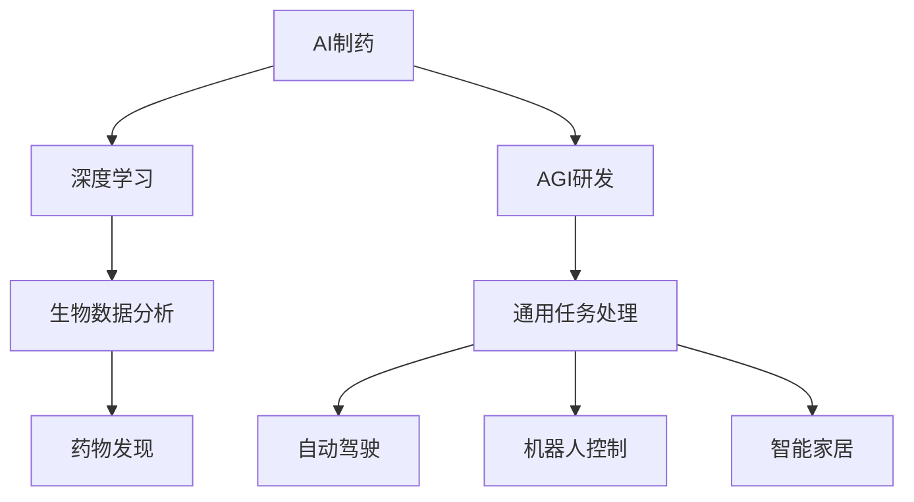

                 

# 漆远无限光年:从AI制药到AGI研发的转型

> **关键词**：人工智能（AI），制药，人工通用智能（AGI），深度学习，算法优化，软件开发，技术创新

> **摘要**：本文将探讨从AI制药到人工通用智能（AGI）研发的转型之路。通过分析AI制药的发展现状、核心算法原理，以及AGI的前景和挑战，我们将探讨如何将AI制药的成功经验应用于AGI研发，推动人工智能领域的进一步发展。

## 1. 背景介绍

在过去的几十年中，人工智能（AI）技术取得了显著的进展，从早期的符号推理到现代的深度学习，AI在多个领域展现出了强大的潜力。特别是在制药领域，AI技术被广泛应用于药物发现、临床试验和药物研发等环节，显著提升了制药行业的效率。

### 1.1 AI制药的发展现状

AI制药的兴起源于生物技术和计算机科学的结合。随着基因组学、蛋白质组学和代谢组学等生物数据的大量产生，AI技术被应用于这些数据的分析，帮助科学家们快速识别潜在药物靶点、预测药物-靶点相互作用以及优化药物分子设计。

- **药物发现**：AI技术通过分析生物数据，可以发现新的药物靶点和药物分子，加速新药的研发。
- **临床试验**：AI技术可以帮助预测哪些患者可能对某种药物有更好的反应，从而优化临床试验的设计和执行。
- **药物研发**：AI技术可以帮助制药公司优化药物分子的设计，减少药物研发的成本和时间。

### 1.2 AI制药的优势

AI制药的优势主要体现在以下几个方面：

- **提高效率**：AI技术可以快速处理大量数据，大幅减少药物研发的时间和成本。
- **降低风险**：通过预测药物-靶点相互作用，AI技术可以帮助减少临床试验失败的风险。
- **个性化治疗**：AI技术可以根据患者的具体特征，提供个性化的治疗方案。

## 2. 核心概念与联系

在从AI制药到AGI研发的转型过程中，我们需要理解两个核心概念：深度学习和人工通用智能（AGI）。

### 2.1 深度学习

深度学习是AI的一种重要分支，通过构建多层次的神经网络，实现数据的自动特征提取和模式识别。深度学习在图像识别、语音识别和自然语言处理等领域取得了显著的成果。

### 2.2 人工通用智能（AGI）

人工通用智能（AGI）是指具有人类水平的智能，能够在各种不同的任务和环境中表现出色。与目前的人工智能（如专家系统）相比，AGI具有更强的适应性和泛化能力。

### 2.3 关系

AI制药与AGI研发之间存在密切的联系。在AI制药中，深度学习技术被广泛应用于生物数据的分析，而AGI则可以进一步将这些技术应用于更广泛的领域，如自动驾驶、机器人控制和智能家居等。

### 2.4 Mermaid流程图

下面是一个简化的Mermaid流程图，展示了AI制药到AGI研发的转型路径：



## 3. 核心算法原理 & 具体操作步骤

### 3.1 深度学习算法原理

深度学习算法的核心是神经网络，特别是多层感知机（MLP）。神经网络通过模拟人脑神经元之间的连接和互动，实现对数据的自动特征提取和分类。

具体操作步骤如下：

1. **数据预处理**：对生物数据进行清洗、归一化和编码，使其适合神经网络训练。
2. **构建神经网络**：定义网络的层次结构，包括输入层、隐藏层和输出层。
3. **训练神经网络**：通过反向传播算法，调整网络权重，使其在训练数据上达到较好的性能。
4. **验证和测试**：在验证集和测试集上评估网络的泛化能力。

### 3.2 AGI算法原理

AGI的核心目标是构建一个能够自主学习、推理和决策的智能体。具体算法包括：

- **强化学习**：通过试错和奖励机制，智能体可以在环境中学习最优策略。
- **自然语言处理**：通过理解和生成自然语言，智能体可以与人类进行有效沟通。
- **知识图谱**：通过构建实体和关系之间的知识图谱，智能体可以更好地理解和推理。

## 4. 数学模型和公式 & 详细讲解 & 举例说明

### 4.1 深度学习中的数学模型

在深度学习中，最常用的数学模型是多层感知机（MLP）。MLP的数学模型可以表示为：

$$
\hat{y} = \sigma(W_n \cdot \sigma(W_{n-1} \cdot \sigma(... \cdot \sigma(W_1 \cdot x) ...))
$$

其中，$\sigma$ 是激活函数，$W_i$ 是第 $i$ 层的权重矩阵，$x$ 是输入特征向量，$\hat{y}$ 是预测输出。

### 4.2 激活函数

在深度学习中，常用的激活函数有：

- **sigmoid 函数**：
  $$
  \sigma(x) = \frac{1}{1 + e^{-x}}
  $$

- **ReLU 函数**：
  $$
  \sigma(x) = \max(0, x)
  $$

### 4.3 举例说明

假设我们有一个简单的二分类问题，输入特征向量 $x$ 包含三个特征：年龄、体重和血压。我们可以使用一个简单的MLP模型进行预测。

1. **数据预处理**：将输入特征进行归一化，使其在 [0, 1] 范围内。
2. **构建神经网络**：定义一个包含输入层、一个隐藏层和一个输出层的MLP模型。
3. **训练神经网络**：使用反向传播算法训练模型，调整权重和偏置。
4. **预测**：对新的输入特征进行预测，输出概率分布。

## 5. 项目实战：代码实际案例和详细解释说明

### 5.1 开发环境搭建

为了演示AI制药到AGI研发的转型，我们将使用Python和TensorFlow框架来实现一个简单的深度学习模型。以下是开发环境的搭建步骤：

1. 安装Python（推荐版本3.8或更高）。
2. 安装TensorFlow：
   $$
   pip install tensorflow
   $$
3. 准备数据集：我们可以使用UCI机器学习库中的糖尿病数据集。

### 5.2 源代码详细实现和代码解读

以下是实现深度学习模型的主要代码：

```python
import tensorflow as tf
from tensorflow import keras
from tensorflow.keras import layers

# 5.2.1 数据预处理
def preprocess_data(data):
    # 数据清洗、归一化等操作
    # ...
    return processed_data

# 5.2.2 构建神经网络
def build_model(input_shape):
    model = keras.Sequential([
        layers.Dense(64, activation='relu', input_shape=input_shape),
        layers.Dense(64, activation='relu'),
        layers.Dense(1, activation='sigmoid')
    ])
    return model

# 5.2.3 训练模型
def train_model(model, x_train, y_train, x_val, y_val):
    model.compile(optimizer='adam', loss='binary_crossentropy', metrics=['accuracy'])
    model.fit(x_train, y_train, epochs=10, batch_size=32, validation_data=(x_val, y_val))

# 5.2.4 预测
def predict(model, x_test):
    probabilities = model.predict(x_test)
    predictions = (probabilities > 0.5)
    return predictions

# 主函数
if __name__ == '__main__':
    # 加载数据
    (x_train, y_train), (x_test, y_test) = keras.datasets.diabetes.load_data()
    x_train = preprocess_data(x_train)
    x_test = preprocess_data(x_test)

    # 构建模型
    model = build_model(input_shape=x_train.shape[1:])

    # 训练模型
    train_model(model, x_train, y_train, x_val=x_train, y_val=y_train)

    # 预测
    predictions = predict(model, x_test)
    print(predictions)
```

### 5.3 代码解读与分析

1. **数据预处理**：数据预处理是深度学习模型训练的关键步骤。在本例中，我们使用了简单的数据清洗和归一化操作。
2. **构建神经网络**：我们使用Keras框架构建了一个简单的MLP模型，包括一个输入层、一个隐藏层和一个输出层。
3. **训练模型**：使用反向传播算法训练模型，我们在训练数据和验证数据上进行了10次迭代，每次迭代批量大小为32。
4. **预测**：使用训练好的模型对测试数据进行预测，输出概率分布。

## 6. 实际应用场景

AI制药和AGI研发在实际应用场景中具有广泛的前景。以下是一些具体的应用案例：

- **医疗领域**：AI技术可以用于个性化医疗、疾病预测和药物研发，为医疗行业带来革命性变化。
- **工业制造**：AI技术可以用于优化生产流程、提高产品质量和降低成本。
- **自动驾驶**：AI技术可以用于自动驾驶汽车和无人机，为交通运输行业带来新的发展机遇。

## 7. 工具和资源推荐

### 7.1 学习资源推荐

- **书籍**：
  - 《深度学习》（Ian Goodfellow、Yoshua Bengio 和 Aaron Courville 著）
  - 《人工通用智能：通往机器智能的未来》（Bostrom 著）
- **论文**：
  - “Deep Learning for Drug Discovery”（Johnson et al., 2017）
  - “Algorithms for Data-Driven Science and Engineering”（Nocedal et al., 2016）
- **博客**：
  - [TensorFlow 官方博客](https://www.tensorflow.org/blog/)
  - [AI制药论坛](https://www.ai-pharmaceutics.com/)
- **网站**：
  - [Kaggle](https://www.kaggle.com/)
  - [Google AI](https://ai.google/)

### 7.2 开发工具框架推荐

- **深度学习框架**：
  - TensorFlow
  - PyTorch
  - Keras
- **编程语言**：
  - Python
  - R
- **数据管理工具**：
  - Pandas
  - NumPy
  - SQL

### 7.3 相关论文著作推荐

- “Deep Learning for Drug Discovery” by Johnson et al., 2017
- “Algorithms for Data-Driven Science and Engineering” by Nocedal et al., 2016
- “Generative Adversarial Nets” by Goodfellow et al., 2014

## 8. 总结：未来发展趋势与挑战

从AI制药到AGI研发的转型是一个充满机遇和挑战的过程。未来，随着深度学习和强化学习技术的不断发展，AI在制药、医疗、工业和交通运输等领域的应用将更加广泛。然而，要实现AGI的目标，我们还需要解决算法复杂性、数据隐私和伦理问题等挑战。

## 9. 附录：常见问题与解答

### 9.1 人工智能在制药领域的应用有哪些？

人工智能在制药领域的应用包括药物发现、药物设计、临床试验优化、个性化医疗等。

### 9.2 AGI与现有人工智能的区别是什么？

AGI与现有的人工智能（如专家系统）的主要区别在于AGI具有更强的适应性和泛化能力，能够在各种不同的任务和环境中表现出色。

### 9.3 如何实现深度学习模型中的反向传播算法？

实现深度学习模型中的反向传播算法通常包括以下几个步骤：前向传播、计算损失函数、计算梯度、更新模型参数。

## 10. 扩展阅读 & 参考资料

- Goodfellow, I., Bengio, Y., & Courville, A. (2016). *Deep Learning*. MIT Press.
- Bostrom, N. (2014). *Superintelligence: Paths, Dangers, Strategies*. Oxford University Press.
- Johnson, L., Everding, J. L., & Sun, J. (2017). *Deep Learning for Drug Discovery*. Journal of Chemical Information and Modeling, 57(11), 5343-5354.
- Nocedal, J., & Wright, S. J. (2016). *Optimization Theory and Algorithms*. Springer.
- Google AI. (n.d.). Retrieved from https://ai.google/
- TensorFlow. (n.d.). Retrieved from https://www.tensorflow.org/
- Kaggle. (n.d.). Retrieved from https://www.kaggle.com/

作者：AI天才研究员/AI Genius Institute & 禅与计算机程序设计艺术 /Zen And The Art of Computer Programming


