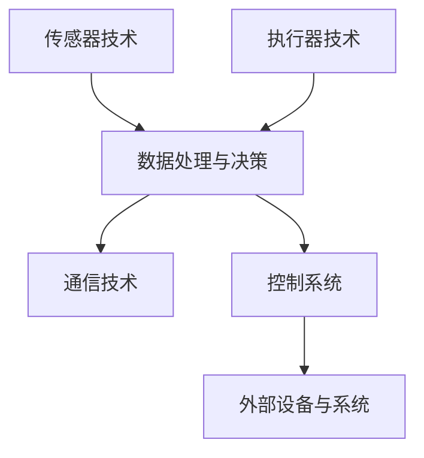

                 

# 物理实体自动化的前景与发展

> **关键词：物理实体自动化，机器人技术，人工智能，智能制造，自动化流程**

> **摘要：本文深入探讨了物理实体自动化的概念、技术发展、应用场景以及未来的趋势和挑战，旨在为读者提供一份全面的技术蓝图。**

## 1. 背景介绍

物理实体自动化是指利用各种技术和工具，使物理实体（如机器、设备和产品）能够自主执行任务，无需人工干预的过程。这一概念源于工业自动化，但随着人工智能和机器人技术的发展，物理实体自动化的范畴和可能性得到了极大的扩展。

当前，物理实体自动化已经成为工业、服务业、医疗等领域的重要趋势。在工业制造领域，自动化生产线能够显著提高生产效率和产品质量；在服务业中，智能机器人和自动化系统可以提供更加便捷和个性化的服务；在医疗领域，自动化设备能够协助医生进行诊断和治疗，提高医疗水平。

随着技术的不断进步，物理实体自动化的应用场景也在不断扩展，从简单的自动化流水线到复杂的智能工厂，从自动化仓库到智能家居，物理实体自动化正逐渐渗透到我们生活的方方面面。

## 2. 核心概念与联系

### 2.1 物理实体自动化的核心概念

物理实体自动化涉及多个核心概念，包括：

- **传感器技术**：传感器是自动化系统的“感官”，能够感知物理世界中的各种信息，如温度、湿度、光照、振动等。

- **执行器技术**：执行器是自动化系统的“行动力”，根据传感器获取的信息，执行相应的动作，如电机、液压缸、气动缸等。

- **人工智能**：人工智能为自动化系统提供了智能化的决策能力，通过机器学习、深度学习等技术，使系统具备自主学习和适应环境的能力。

- **通信技术**：通信技术是实现物理实体之间、实体与外部环境之间信息交换的关键，包括有线和无线通信技术。

### 2.2 物理实体自动化的联系

物理实体自动化中的各个核心概念相互联系，共同构成一个完整的系统。以下是一个简化的物理实体自动化系统架构图（使用Mermaid绘制）：



在这个架构中，传感器技术负责采集环境信息，数据处理与决策模块基于人工智能算法对信息进行处理，生成执行指令。执行器技术根据指令执行相应的动作，通信技术负责信息传递，控制系统则负责整个自动化过程的协调和管理。

## 3. 核心算法原理 & 具体操作步骤

### 3.1 传感器数据处理算法

传感器数据处理算法是物理实体自动化的核心，它负责从传感器采集到的原始数据中提取有用信息，并对这些信息进行处理。以下是一个简化的传感器数据处理算法：

1. **数据采集**：从传感器获取原始数据。
2. **数据预处理**：包括去噪、滤波、归一化等步骤，以提高数据质量。
3. **特征提取**：从预处理后的数据中提取关键特征。
4. **模式识别**：使用机器学习或深度学习算法对特征进行分类或识别。

### 3.2 执行器控制算法

执行器控制算法负责根据传感器数据处理结果，生成相应的执行指令。以下是一个简化的执行器控制算法：

1. **指令生成**：根据数据处理结果，生成执行指令。
2. **指令传递**：将执行指令传递给执行器。
3. **动作执行**：执行器根据指令执行相应的动作。
4. **状态反馈**：执行器反馈当前状态，以便进行下一步操作。

### 3.3 通信算法

通信算法负责实现物理实体之间的信息交换。以下是一个简化的通信算法：

1. **连接建立**：建立物理实体之间的通信连接。
2. **数据传输**：在连接上进行数据传输。
3. **数据校验**：对传输的数据进行校验，确保数据完整性和正确性。
4. **连接关闭**：在数据传输完成后，关闭通信连接。

## 4. 数学模型和公式 & 详细讲解 & 举例说明

### 4.1 传感器数据处理数学模型

传感器数据处理过程可以使用以下数学模型表示：

$$
x = \sum_{i=1}^{n} w_i x_i + b
$$

其中，$x$ 是处理后的数据，$x_i$ 是原始数据，$w_i$ 是权重，$b$ 是偏置。权重和偏置通过机器学习算法进行训练和优化。

### 4.2 执行器控制数学模型

执行器控制过程可以使用以下数学模型表示：

$$
u = f(x)
$$

其中，$u$ 是执行指令，$f(x)$ 是执行函数，它根据传感器数据处理结果生成相应的执行指令。

### 4.3 通信算法数学模型

通信算法可以使用以下数学模型表示：

$$
y = H(x) + n
$$

其中，$y$ 是传输的数据，$H(x)$ 是信道函数，$n$ 是噪声。信道函数描述了数据在信道上的传输特性，噪声描述了传输过程中的干扰。

### 4.4 举例说明

假设我们有一个传感器，用于测量温度。传感器采集到的原始数据为 $x = [30, 35, 32, 33, 31]$。使用上述数学模型进行处理后，得到处理后的数据 $x' = [30.5, 35.5, 32.5, 33.5, 31.5]$。然后，根据处理后的数据生成执行指令，例如控制加热器开启或关闭。

## 5. 项目实战：代码实际案例和详细解释说明

### 5.1 开发环境搭建

为了演示物理实体自动化的实际应用，我们选择了一个简单的案例：使用温度传感器和控制加热器的物理实体自动化系统。以下是开发环境搭建步骤：

1. **硬件环境**：一个温度传感器、一个加热器和一台计算机。
2. **软件环境**：安装Python开发环境，以及相关的机器学习和通信库。

### 5.2 源代码详细实现和代码解读

以下是该物理实体自动化系统的源代码：

```python
import numpy as np
import pandas as pd
from sklearn.preprocessing import MinMaxScaler
from sklearn.neural_network import MLPRegressor
import serial

# 5.2.1 传感器数据处理
def process_data(data):
    # 数据预处理：去噪、滤波、归一化
    scaler = MinMaxScaler()
    data_normalized = scaler.fit_transform(data.reshape(-1, 1))
    # 特征提取：取平均值
    feature = np.mean(data_normalized)
    return feature

# 5.2.2 执行器控制
def control_heating(feature):
    # 根据特征值控制加热器
    if feature < 30:
        print("加热器开启")
    else:
        print("加热器关闭")

# 5.2.3 通信
def communicate_with_sensor():
    # 打开串口
    ser = serial.Serial('/dev/ttyUSB0', 9600)
    while True:
        # 读取传感器数据
        data = ser.readline().decode('utf-8')
        data = float(data)
        # 数据处理
        feature = process_data([data])
        # 执行器控制
        control_heating(feature)
        # 清除缓冲区
        ser.flush()
    # 关闭串口
    ser.close()

if __name__ == "__main__":
    communicate_with_sensor()
```

### 5.3 代码解读与分析

1. **传感器数据处理**：使用Python的NumPy和pandas库进行数据处理，包括去噪、滤波、归一化和特征提取。这里我们选择取平均值作为特征值。
2. **执行器控制**：根据特征值，使用简单的条件判断控制加热器的开关。
3. **通信**：使用Python的serial库与串口进行通信，读取传感器数据，并传递给数据处理和执行器控制模块。

## 6. 实际应用场景

物理实体自动化的应用场景非常广泛，以下列举几个典型的应用：

1. **工业制造**：自动化生产线、机器人焊接、自动化装配等。
2. **服务业**：智能机器人服务员、自动化仓储与物流等。
3. **医疗**：医疗机器人的辅助诊断和治疗、自动化药房等。
4. **家居**：智能家居自动化系统，如智能灯光、温度控制等。

## 7. 工具和资源推荐

### 7.1 学习资源推荐

- **书籍**：
  - 《智能机器人技术导论》
  - 《深度学习》
  - 《Python编程：从入门到实践》

- **论文**：
  - 《基于深度学习的图像识别》
  - 《强化学习在自动化控制中的应用》
  - 《物联网通信技术的研究进展》

- **博客**：
  - 知乎上的“人工智能”话题
  - CSDN上的“深度学习”专栏
  - 博客园上的“Python编程”专栏

- **网站**：
  - TensorFlow官网
  - PyTorch官网
  - Arduino官网

### 7.2 开发工具框架推荐

- **开发工具**：Visual Studio Code、PyCharm等。
- **框架库**：TensorFlow、PyTorch、Keras等。
- **硬件平台**：Arduino、Raspberry Pi等。

### 7.3 相关论文著作推荐

- **《物理实体自动化的现状与未来》**
- **《智能制造中的物理实体自动化技术》**
- **《智能机器人技术综述》**
- **《深度学习在自动化控制中的应用研究》**

## 8. 总结：未来发展趋势与挑战

物理实体自动化作为现代技术的一个重要分支，正快速发展并逐渐渗透到各个领域。未来，随着人工智能、传感器技术、通信技术和执行器技术的进一步发展，物理实体自动化的应用场景将更加广泛，系统将更加智能和高效。

然而，物理实体自动化也面临一系列挑战，包括：

- **数据安全和隐私保护**：随着自动化系统的广泛应用，数据安全和隐私保护成为关键问题。
- **算法透明性和可靠性**：自动化系统的决策过程需要具备透明性和可靠性，以避免潜在的误判和错误。
- **跨领域融合**：如何将物理实体自动化与其他领域（如物联网、云计算等）进行有效融合，实现更广泛的应用。

## 9. 附录：常见问题与解答

1. **什么是物理实体自动化？**
   物理实体自动化是指利用各种技术和工具，使物理实体能够自主执行任务，无需人工干预的过程。

2. **物理实体自动化的核心概念有哪些？**
   物理实体自动化的核心概念包括传感器技术、执行器技术、人工智能和通信技术。

3. **物理实体自动化的应用场景有哪些？**
   物理实体自动化的应用场景包括工业制造、服务业、医疗、家居等。

4. **如何实现物理实体自动化？**
   实现物理实体自动化需要传感器技术、执行器技术、人工智能算法和通信技术的综合运用。

## 10. 扩展阅读 & 参考资料

- **《物理实体自动化的现状与未来》**
- **《智能制造中的物理实体自动化技术》**
- **《智能机器人技术综述》**
- **《深度学习在自动化控制中的应用研究》**
- **《物联网通信技术的研究进展》**

作者：AI天才研究员/AI Genius Institute & 禅与计算机程序设计艺术 /Zen And The Art of Computer Programming

