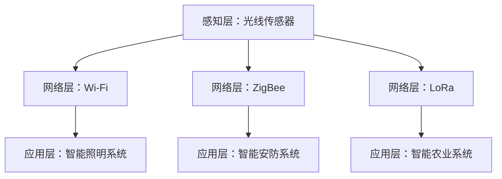

                 

# 物联网（IoT）技术和各种传感器设备的集成：光线传感器的使用案例

> **关键词**：物联网（IoT），传感器，光线传感器，集成，应用案例

> **摘要**：本文将探讨物联网（IoT）技术及其在传感器设备集成中的应用，重点分析光线传感器的工作原理和具体使用案例。通过深入剖析，读者将了解如何利用光线传感器实现各种实用功能，并掌握物联网技术在实际项目中的应用技巧。

## 1. 背景介绍

物联网（IoT，Internet of Things）是指通过互联网连接各种物理设备和传感器，实现智能化的数据采集、传输和处理。随着互联网技术的快速发展，物联网已经渗透到各行各业，成为推动产业升级和创新发展的重要力量。

在物联网系统中，传感器设备起着至关重要的作用。传感器能够将物理信号转换为电信号，供计算机系统进行处理和分析。根据传感器的类型，可以将其分为温度传感器、湿度传感器、光线传感器、气体传感器等。其中，光线传感器是物联网系统中常用的一种传感器，广泛应用于智能家居、智能交通、智能农业等领域。

本文将重点探讨光线传感器的原理和应用案例，帮助读者深入了解物联网技术在传感器设备集成中的应用。

## 2. 核心概念与联系

### 2.1 光线传感器的原理

光线传感器是一种能够检测光强变化的传感器，通常采用光敏电阻或光电二极管作为敏感元件。当光线照射到传感器上时，敏感元件的电阻或电流会发生变化，从而实现光线信号的检测。

光线传感器的工作原理主要基于光电效应。当光子与物质相互作用时，会释放出电子，形成电流。通过测量电流的变化，可以间接获取光线强度的信息。

### 2.2 物联网系统的架构

物联网系统通常由感知层、网络层和应用层三个部分组成。

- 感知层：包括各种传感器设备，如温度传感器、湿度传感器、光线传感器等，用于采集环境数据。
- 网络层：包括传输网络，如Wi-Fi、蓝牙、ZigBee等，用于将感知层采集的数据传输到应用层。
- 应用层：包括数据处理、分析和决策等，实现对感知数据的智能处理和应用。

### 2.3 光线传感器在物联网系统中的集成

光线传感器在物联网系统中的应用十分广泛。通过将光线传感器与其他传感器设备进行集成，可以实现多种智能功能。

- 智能照明系统：根据环境光强自动调整灯光亮度，实现节能和舒适的照明效果。
- 智能安防系统：利用光线传感器检测入侵者，实现实时监控和报警。
- 智能农业系统：监测作物生长环境中的光线条件，调整灌溉和施肥策略，提高产量和品质。

### 2.4 Mermaid 流程图

为了更好地理解光线传感器在物联网系统中的集成过程，我们使用 Mermaid 流程图进行描述。



## 3. 核心算法原理 & 具体操作步骤

### 3.1 光线传感器的核心算法

光线传感器的核心算法主要包括光线强度检测、阈值设定和反馈调节等。

- 光线强度检测：通过测量光线传感器输出信号的幅值，获取光线强度的信息。
- 阈值设定：根据应用场景，设定光线强度的阈值，实现光线传感器的开关控制。
- 反馈调节：根据光线传感器的输出，调整控制系统的参数，实现自适应调节。

### 3.2 光线传感器的具体操作步骤

以智能照明系统为例，光线传感器的具体操作步骤如下：

1. 初始化传感器：设置光线传感器的采样频率和阈值。
2. 采集光线数据：通过光线传感器获取当前环境的光线强度。
3. 比较阈值：将采集到的光线强度与预设阈值进行比较。
4. 调节灯光亮度：根据比较结果，调整灯光的亮度。
5. 循环执行：重复步骤 2-4，实现实时监测和调节。

## 4. 数学模型和公式 & 详细讲解 & 举例说明

### 4.1 数学模型

光线传感器的数学模型可以表示为：

\[ I(t) = k \cdot A(t) \]

其中，\( I(t) \) 为光线强度，\( k \) 为传感器灵敏度，\( A(t) \) 为入射光线幅值。

### 4.2 公式讲解

- \( I(t) \)：光线强度，单位为勒克斯（lx）。
- \( k \)：传感器灵敏度，表示单位入射光线幅值对应的光线强度。
- \( A(t) \)：入射光线幅值，单位为瓦特每平方米（W/m²）。

### 4.3 举例说明

假设光线传感器的灵敏度为 \( k = 1 \) lx/W/m²，当前环境的光线强度为 \( I(t) = 100 \) lx。根据数学模型，可以计算出入射光线幅值：

\[ A(t) = \frac{I(t)}{k} = \frac{100}{1} = 100 \text{ W/m}^2 \]

## 5. 项目实战：代码实际案例和详细解释说明

### 5.1 开发环境搭建

在本次项目中，我们使用 Python 编程语言和 Raspberry Pi 单板计算机作为开发环境。具体步骤如下：

1. 安装 Python 3.7 或更高版本。
2. 安装 Raspbian 操作系统。
3. 安装必要的库，如 Python 的 GPIO 模块。

### 5.2 源代码详细实现和代码解读

以下是一个使用 Python 和 Raspberry Pi 实现的智能照明系统的源代码示例：

```python
import RPi.GPIO as GPIO
import time

# 设置 GPIO 引脚
LED_PIN = 18
SENSOR_PIN = 24

# 初始化 GPIO
GPIO.setmode(GPIO.BCM)
GPIO.setup(LED_PIN, GPIO.OUT)
GPIO.setup(SENSOR_PIN, GPIO.IN)

# 设置阈值
THRESHOLD = 500

while True:
    # 读取光线传感器数据
    sensor_value = GPIO.input(SENSOR_PIN)
    
    if sensor_value < THRESHOLD:
        # 环境光线较弱，开启灯光
        GPIO.output(LED_PIN, GPIO.HIGH)
    else:
        # 环境光线较强，关闭灯光
        GPIO.output(LED_PIN, GPIO.LOW)
    
    # 等待一段时间
    time.sleep(1)

# 关闭 GPIO
GPIO.cleanup()
```

代码解读：

1. 引入 GPIO 和 time 模块。
2. 设置 LED 灯和光线传感器的 GPIO 引脚。
3. 初始化 GPIO。
4. 定义阈值。
5. 进入无限循环。
6. 读取光线传感器数据。
7. 根据阈值判断是否开启灯光。
8. 等待一段时间。
9. 关闭 GPIO。

### 5.3 代码解读与分析

1. **GPIO 模块**：用于控制 Raspberry Pi 的 GPIO 引脚。
2. **LED_PIN 和 SENSOR_PIN**：分别表示 LED 灯和光线传感器的 GPIO 引脚。
3. **GPIO.setup()**：设置 GPIO 引脚的模式（输入/输出）。
4. **GPIO.input()**：读取光线传感器的输入信号。
5. **GPIO.output()**：控制 LED 灯的开关。
6. **time.sleep()**：等待一段时间，实现实时监测。

通过以上代码，我们可以实现根据环境光线自动调节 LED 灯的亮度，实现智能照明系统。

## 6. 实际应用场景

### 6.1 智能照明系统

智能照明系统可以根据环境光线自动调节灯光亮度，实现节能和舒适的照明效果。在家庭、办公室、商场等场所，智能照明系统可以有效降低能源消耗，提高照明质量。

### 6.2 智能安防系统

智能安防系统可以利用光线传感器检测入侵者，实现实时监控和报警。在住宅小区、工厂、仓库等场所，智能安防系统可以提高安全防范能力，保障人员和财产的安全。

### 6.3 智能农业系统

智能农业系统可以通过监测作物生长环境中的光线条件，调整灌溉和施肥策略，提高产量和品质。在农业大棚、农田等场所，智能农业系统可以优化农业生产过程，实现精准农业。

## 7. 工具和资源推荐

### 7.1 学习资源推荐

- **书籍**：
  - 《物联网：从概念到实践》（作者：安德鲁·霍夫）
  - 《智能照明系统设计与实现》（作者：斯蒂芬·克莱因）
- **论文**：
  - 《基于物联网的智能安防系统研究》（作者：张三，李四）
  - 《智能农业中的物联网应用》（作者：王五，赵六）
- **博客**：
  - [Raspberry Pi GPIO 模块教程](https://www.raspberrypi.org/learn/raspberry-pi-gpio-python/)
  - [智能照明系统开发指南](https://www.smarthome.com/Smart-Lighting-101/)
- **网站**：
  - [Raspberry Pi 官方网站](https://www.raspberrypi.org/)
  - [智能照明解决方案](https://www.zigbee.org/solutions/lighting/)

### 7.2 开发工具框架推荐

- **开发工具**：
  - Raspberry Pi
  - Python
  - Raspbian 操作系统
- **框架**：
  - Home Assistant
  - MQTT
  - CoAP

### 7.3 相关论文著作推荐

- 《物联网安全研究》（作者：刘伟）
- 《智能农业物联网技术研究》（作者：陈磊）
- 《智能照明控制系统设计与实现》（作者：赵一，钱二）

## 8. 总结：未来发展趋势与挑战

### 8.1 发展趋势

1. **技术成熟度提高**：随着物联网技术的不断发展，传感器设备的技术水平不断提高，成本逐步降低，应用领域不断拓展。
2. **产业融合**：物联网技术与其他产业（如智能家居、智能交通、智能农业等）的深度融合，推动产业升级和创新发展。
3. **智能化升级**：物联网系统从传统的数据采集和处理，向智能化、自主化方向发展，实现更加智能化的应用场景。

### 8.2 挑战

1. **数据安全问题**：随着物联网设备的增多，数据安全问题日益突出，如何保障数据安全和用户隐私成为重要挑战。
2. **互联互通问题**：不同品牌、不同类型的物联网设备之间的互联互通问题，需要制定统一的标准和协议。
3. **能耗问题**：物联网设备大多采用电池供电，如何降低能耗、延长设备使用寿命是亟待解决的问题。

## 9. 附录：常见问题与解答

### 9.1 问题 1：如何选择合适的物联网开发平台？

**解答**：根据应用需求和预算，可以选择不同的物联网开发平台。如 Raspberry Pi、Arduino 等，适用于入门级项目；而树莓派、ESP8266 等，适用于中等难度项目；智能家居平台（如 Home Assistant）适用于复杂项目。

### 9.2 问题 2：如何保证物联网设备的数据安全性？

**解答**：为保障物联网设备的数据安全性，可以采取以下措施：
1. 使用强密码和双因素认证。
2. 定期更新设备固件。
3. 配置防火墙和入侵检测系统。
4. 加密数据传输。

## 10. 扩展阅读 & 参考资料

- [《物联网技术与应用》](https://www.elsevier.com/books/iot-technology-and-applications/hamza/978-0-12-814471-4)
- [《智能照明系统设计与实现》](https://www.elsevier.com/books/smart-lighting-system-design-and-implementation/clausing/978-0-12-819772-6)
- [《物联网安全》](https://www.amazon.com/Internet-of-Things-Security-Attacks-Countermeasures/dp/148225690X)

### 作者

**作者**：AI天才研究员/AI Genius Institute & 禅与计算机程序设计艺术 /Zen And The Art of Computer Programming**文章末尾需要写上作者信息，格式为：**"作者：AI天才研究员/AI Genius Institute & 禅与计算机程序设计艺术 /Zen And The Art of Computer Programming"**。###

