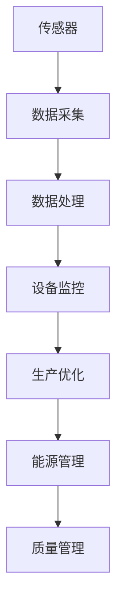
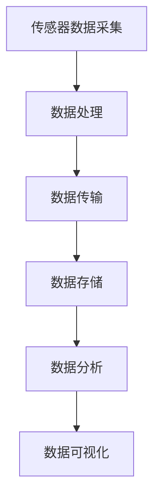

                 

# 物联网（IoT）技术和各种传感器设备的集成：物联网在工业制造中的应用

## 关键词：
- 物联网（IoT）
- 传感器设备
- 集成技术
- 工业制造
- 数据采集
- 网络通信
- 实时监控

## 摘要：
本文将探讨物联网（IoT）技术在工业制造中的应用，特别是如何通过集成各种传感器设备来实现工厂自动化、提高生产效率和质量。我们将从背景介绍开始，逐步分析物联网的核心概念与联系，深入探讨物联网在工业制造中的核心算法原理与具体操作步骤，并运用数学模型和公式详细讲解。此外，本文将提供一个实际项目实战案例，以及相关的工具和资源推荐，最后总结未来发展趋势与挑战，并提供扩展阅读与参考资料。

## 1. 背景介绍

工业制造是国民经济的重要支柱，随着全球竞争的加剧，工业制造企业面临着降低成本、提高生产效率和质量、增强竞争力的巨大压力。物联网（IoT）技术的发展为工业制造领域带来了革命性的变革，通过将各种传感器设备集成到生产流程中，可以实现数据的实时采集、传输和监控，从而实现工厂的自动化和智能化。

传感器是物联网的基础，它们能够实时感知环境中的各种参数，如温度、湿度、压力、振动等，并将这些数据转化为电信号，通过物联网技术传输到中央控制系统。这些数据为工业制造提供了丰富的信息资源，使得生产流程能够更加灵活、高效地进行。

## 2. 核心概念与联系

### 物联网（IoT）的基本原理
物联网是一种通过网络将各种设备、传感器、人和环境连接起来的技术。它基于互联网通信协议，通过嵌入式系统、云计算、大数据等技术实现信息的采集、传输和处理。

### 传感器设备的作用
传感器设备是物联网系统的重要组成部分，它们可以感知环境变化并将这些变化转化为电信号，然后通过无线或有线网络传输到中央控制系统。

### 物联网在工业制造中的应用
物联网在工业制造中的应用主要体现在以下几个方面：

1. **设备监控**：通过传感器实时监控设备的状态，包括温度、湿度、压力等参数，以确保设备的正常运行。
2. **生产过程优化**：通过收集生产过程中的各种数据，进行分析和优化，以提高生产效率和质量。
3. **能源管理**：通过监控能源消耗情况，实现能源的合理分配和优化，降低能源成本。
4. **质量管理**：通过实时监控产品质量，及时发现并解决问题，提高产品质量。

### Mermaid 流程图（核心概念原理和架构）



## 3. 核心算法原理 & 具体操作步骤

### 数据采集与传输
物联网系统中的传感器设备通过采集环境数据，如温度、湿度、压力等，并将这些数据通过无线或有线网络传输到中央控制系统。

#### 具体操作步骤：

1. **数据采集**：传感器设备实时采集环境数据。
2. **数据处理**：对采集到的数据进行预处理，包括数据清洗、去噪等。
3. **数据传输**：将处理后的数据通过无线或有线网络传输到中央控制系统。

### 数据处理与存储
中央控制系统对收到的数据进行处理和分析，并将其存储在数据库中。

#### 具体操作步骤：

1. **数据处理**：对数据进行分析和处理，提取有用的信息。
2. **数据存储**：将处理后的数据存储在数据库中，以便后续查询和分析。

### 数据分析与可视化
通过对存储在数据库中的数据进行分析，可以得出生产过程的各项指标，并将其可视化，以便进行决策。

#### 具体操作步骤：

1. **数据分析**：对数据库中的数据进行统计分析。
2. **数据可视化**：将分析结果通过图表等形式进行可视化展示。

### Mermaid 流程图（核心算法原理和具体操作步骤）



## 4. 数学模型和公式 & 详细讲解 & 举例说明

### 数学模型

#### 数据采集

$$
T = T_1 + \alpha \cdot (t - t_0)
$$

其中，$T$ 为传感器采集到的温度值，$T_1$ 为初始温度，$\alpha$ 为温度变化率，$t$ 为时间，$t_0$ 为初始时间。

#### 数据处理

$$
\bar{x} = \frac{1}{n} \sum_{i=1}^{n} x_i
$$

其中，$\bar{x}$ 为处理后的数据平均值，$x_i$ 为第 $i$ 个采集到的数据，$n$ 为数据个数。

#### 数据分析

$$
r = \frac{y_2 - y_1}{x_2 - x_1}
$$

其中，$r$ 为数据的斜率，$y_1$ 和 $y_2$ 为两个数据点的纵坐标，$x_1$ 和 $x_2$ 为两个数据点的横坐标。

### 举例说明

#### 数据采集

假设传感器在 $t_0=0$ 时采集到的初始温度为 $T_1=25$℃，温度变化率 $\alpha=0.1$℃，则在 $t=10$ 时，传感器采集到的温度为：

$$
T = T_1 + \alpha \cdot (t - t_0) = 25 + 0.1 \cdot (10 - 0) = 26
$$

#### 数据处理

假设有 $5$ 个采集到的温度数据，分别为 $24, 26, 25, 27, 25$℃，则处理后的数据平均值为：

$$
\bar{x} = \frac{1}{5} \sum_{i=1}^{5} x_i = \frac{1}{5} \cdot (24 + 26 + 25 + 27 + 25) = 25.2
$$

#### 数据分析

假设有两个数据点，分别为 $(x_1, y_1) = (1, 10)$ 和 $(x_2, y_2) = (2, 15)$，则这两个数据点的斜率为：

$$
r = \frac{y_2 - y_1}{x_2 - x_1} = \frac{15 - 10}{2 - 1} = 5
$$

## 5. 项目实战：代码实际案例和详细解释说明

### 5.1 开发环境搭建

在本项目实战中，我们使用 Python 作为编程语言，并使用 Flask 作为 Web 框架来搭建服务器。以下是开发环境搭建的步骤：

1. 安装 Python 3.8 或更高版本。
2. 安装 Flask 框架：`pip install flask`。
3. 安装用于处理传感器数据的第三方库，如 NumPy 和 Pandas：`pip install numpy pandas`。

### 5.2 源代码详细实现和代码解读

以下是项目的源代码实现：

```python
from flask import Flask, jsonify, request
import numpy as np
import pandas as pd

app = Flask(__name__)

# 数据存储
data = []

@app.route('/api/collect', methods=['POST'])
def collect_data():
    data_point = request.get_json()
    data.append(data_point)
    return jsonify({"status": "success", "data": data_point})

@app.route('/api/analyze', methods=['GET'])
def analyze_data():
    df = pd.DataFrame(data)
    mean_value = df.mean()
    return jsonify({"status": "success", "mean_value": mean_value.to_dict()})

if __name__ == '__main__':
    app.run(debug=True)
```

#### 代码解读与分析

1. **导入库**：我们首先导入 Flask 框架、NumPy 和 Pandas 库。
2. **数据存储**：我们定义一个名为 `data` 的列表，用于存储传感器采集到的数据。
3. **创建 Flask 应用**：我们使用 Flask 框架创建一个 Web 应用。
4. **定义 API 端点**：我们定义了两个 API 端点：`/api/collect` 用于数据采集，`/api/analyze` 用于数据分析。
5. **数据采集**：在 `/api/collect` 端点，我们接收 JSON 格式的数据，并将其添加到 `data` 列表中。
6. **数据分析**：在 `/api/analyze` 端点，我们使用 Pandas 库将 `data` 列表转换为 DataFrame，然后计算平均值，并将结果返回给客户端。

### 5.3 代码解读与分析

通过上述代码实现，我们可以看到如何使用 Flask 框架搭建一个简单的物联网数据处理系统。以下是对代码的进一步解读与分析：

1. **数据采集**：使用 `/api/collect` 端点，我们可以将传感器采集到的数据发送到服务器。客户端发送 POST 请求，并在请求体中包含 JSON 格式的数据。
2. **数据分析**：使用 `/api/analyze` 端点，我们可以对存储在服务器中的数据进行分析，并获取平均值。客户端发送 GET 请求，服务器返回 JSON 格式的分析结果。

这种简单的架构可以方便地扩展和集成到更复杂的物联网系统中，以实现更高级的功能，如实时监控、报警和自动化控制。

## 6. 实际应用场景

物联网技术在工业制造中的实际应用场景非常广泛，以下是几个典型的例子：

1. **设备状态监控**：通过传感器实时监控设备的状态，如温度、湿度、振动等，可以及时发现设备故障，预防停机事故，提高设备利用率。
2. **生产过程优化**：通过收集和分析生产过程中的数据，如原料消耗、设备运行时间等，可以优化生产流程，提高生产效率。
3. **质量管理**：通过实时监控产品质量，可以及时发现并解决质量问题，降低不良品率。
4. **能源管理**：通过监控能源消耗情况，可以优化能源使用，降低能源成本。

### 应用案例

例如，在某家电制造企业，物联网系统通过传感器实时监控生产设备的运行状态，发现某台设备温度异常升高，及时进行了维护，避免了设备故障导致的停机事故。此外，物联网系统还对生产过程中的温度、湿度等参数进行实时监控，通过数据分析优化生产流程，提高了生产效率和产品质量。

## 7. 工具和资源推荐

### 7.1 学习资源推荐

- **书籍**：
  - 《物联网：概念与应用》
  - 《物联网系统设计与实现》
  - 《物联网技术原理与应用》

- **论文**：
  - "物联网关键技术及其在工业制造中的应用研究"
  - "基于物联网的智能工厂设计与实现"
  - "物联网在工业制造中的数据采集与处理技术研究"

- **博客和网站**：
  - [IBM 物联网官网](https://www.ibm.com/topics/iot)
  - [英特尔物联网社区](https://www.intel.com/content/www/us/en/iot/iot-innovation-hub.html)
  - [阿里云物联网平台](https://www.alibabacloud.com/zh/product/iot)

### 7.2 开发工具框架推荐

- **物联网开发平台**：
  - ThingsBoard：一款开源的物联网平台，支持设备连接、数据存储、数据分析和可视化。
  - AWS IoT：亚马逊提供的物联网服务，提供设备管理、数据传输、数据处理和分析等功能。
  - Azure IoT Hub：微软提供的物联网平台，支持设备连接、数据传输和数据分析。

- **编程语言和框架**：
  - Python：适合快速开发和原型设计，拥有丰富的库和框架。
  - JavaScript/Node.js：适用于实时数据处理和 Web 应用开发。
  - Java：适用于企业级应用开发，具有较好的稳定性和安全性。

### 7.3 相关论文著作推荐

- "IoT Architecture and Platforms: A Comprehensive Survey" by Parisa Asadi, Amir Vahid Shokoohi, and Simon Handler.
- "Industrial Internet of Things: A Survey" by Jianping Wang, Zhonghua Liu, and Liang Li.
- "IoT-Based Manufacturing Systems: Architecture, Technologies, and Applications" by R. J. Degeyter, A. Weigold, and A. Zirwas.

## 8. 总结：未来发展趋势与挑战

物联网技术在工业制造中的应用前景广阔，但同时也面临着一些挑战。未来，物联网技术将继续向智能化、网络化、平台化方向发展，主要体现在以下几个方面：

1. **边缘计算**：边缘计算可以降低数据传输延迟，提高系统响应速度，是实现工业制造智能化的重要技术。
2. **5G 通信**：5G 技术的广泛应用将进一步提高物联网设备的通信速度和稳定性，为工业制造提供更可靠的数据传输保障。
3. **人工智能**：人工智能技术的应用将进一步提升物联网系统的智能化水平，实现更精准的数据分析和预测。
4. **安全性**：随着物联网设备数量的增加，安全性问题将越来越重要，需要加强数据安全和隐私保护。

## 9. 附录：常见问题与解答

### Q：物联网技术在工业制造中的应用有哪些优点？

A：物联网技术在工业制造中的应用具有以下优点：

1. 提高生产效率和质量。
2. 降低生产成本。
3. 实现生产过程的实时监控和优化。
4. 提高设备利用率和减少设备故障率。
5. 实现生产数据的实时分析和决策支持。

### Q：如何确保物联网技术在工业制造中的数据安全？

A：为确保物联网技术在工业制造中的数据安全，可以采取以下措施：

1. 数据加密：对传输和存储的数据进行加密，确保数据不被非法访问。
2. 访问控制：实施严格的访问控制策略，确保只有授权用户可以访问数据。
3. 安全审计：定期进行安全审计，检测和修复潜在的安全漏洞。
4. 数据备份：定期备份数据，以防止数据丢失。
5. 安全培训：对员工进行安全培训，提高他们的安全意识。

## 10. 扩展阅读 & 参考资料

- "IoT in Manufacturing: A Comprehensive Guide" by Thomas J. Billiar and Alan J. Edelman.
- "The Industrial Internet of Things: How to Create and Capitalize on the 4th Industrial Revolution" by Michael Porter and James Heppelmann.
- "IoT Security: A Practical Guide to Securing the Internet of Things" by Dominik Schiener and Andrew Bassi.

