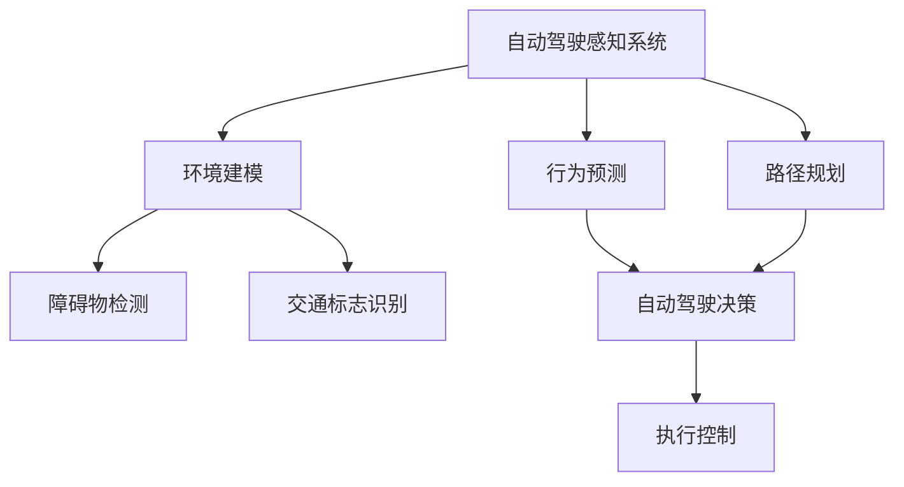

                 

# 特斯拉FSD不同版本的进化

> **关键词：** 特斯拉，FSD，自动驾驶，版本进化，核心算法，技术发展

> **摘要：** 本文将深入探讨特斯拉FSD（Full Self-Driving）系统不同版本的进化历程，分析其核心算法的原理、具体操作步骤以及数学模型。通过实际项目实战案例和代码解读，展示特斯拉自动驾驶技术的实际应用。最后，我们将总结未来发展趋势与挑战，并提供相关工具和资源推荐。

## 1. 背景介绍

特斯拉（Tesla, Inc.）是一家美国电动汽车和能源公司，以其创新的电动汽车和自动驾驶技术而闻名。FSD（Full Self-Driving）是特斯拉自动驾驶技术的核心系统，旨在实现完全自动驾驶。特斯拉FSD系统的发展历程可以分为几个重要版本，每个版本都带来了显著的改进和创新。

本文将主要讨论以下版本：

- **FSD Beta V1.0**：特斯拉首次发布FSD Beta，实现了基本的自动驾驶功能。
- **FSD Beta V2.0**：特斯拉对FSD Beta进行了重要升级，增加了更复杂的自动驾驶场景处理能力。
- **FSD Beta V3.0**：特斯拉进一步优化了FSD Beta，提升了自动驾驶的稳定性和安全性。

通过分析这些版本的进化，我们将深入了解特斯拉自动驾驶技术的核心算法和实现原理。

## 2. 核心概念与联系

为了理解特斯拉FSD系统的进化，我们需要了解其核心概念和联系。以下是一个使用Mermaid绘制的流程图，展示了特斯拉FSD系统中的核心概念和组件。



### 自动驾驶感知系统

自动驾驶感知系统是特斯拉FSD系统的核心，负责收集环境信息并进行分析。它主要包括以下组件：

- **障碍物检测**：使用传感器（如雷达、激光雷达和摄像头）检测周围的障碍物。
- **交通标志识别**：识别交通标志和信号灯，以便自动驾驶系统能够遵守交通规则。
- **环境建模**：创建周围环境的三维模型，以便自动驾驶系统能够更好地理解周围环境。

### 行为预测

行为预测模块负责预测周围车辆和行人的行为。它使用感知系统提供的信息，结合机器学习算法，预测其他交通参与者的行为。

### 路径规划

路径规划模块负责生成自动驾驶车辆的行驶路径。它根据行为预测结果和环境建模数据，计算最佳的行驶路径。

### 自动驾驶决策

自动驾驶决策模块负责根据路径规划和环境信息，生成自动驾驶车辆的行驶指令。

### 执行控制

执行控制模块负责将自动驾驶决策转化为实际操作，控制车辆的加速、制动和转向。

## 3. 核心算法原理 & 具体操作步骤

特斯拉FSD系统的核心算法主要包括障碍物检测、行为预测和路径规划。以下是这些算法的具体操作步骤：

### 障碍物检测

1. **数据收集**：使用传感器（如雷达、激光雷达和摄像头）收集周围环境的数据。
2. **特征提取**：从传感器数据中提取特征，如物体的形状、大小和颜色。
3. **障碍物分类**：使用机器学习算法，将特征分类为障碍物或非障碍物。
4. **障碍物跟踪**：使用跟踪算法，持续更新障碍物的位置和速度。

### 行为预测

1. **行为建模**：使用历史数据，建立行为预测模型。
2. **特征提取**：从感知系统提取特征，如车辆的速度、加速度和转向角度。
3. **行为分类**：使用行为预测模型，对车辆的当前行为进行分类。
4. **行为预测**：根据行为分类结果，预测车辆的下一行为。

### 路径规划

1. **环境建模**：使用感知系统提供的信息，创建周围环境的三维模型。
2. **路径搜索**：使用搜索算法，在三维模型中搜索最佳的行驶路径。
3. **路径优化**：根据行为预测结果和环境变化，优化行驶路径。

## 4. 数学模型和公式 & 详细讲解 & 举例说明

### 障碍物检测

障碍物检测的核心是特征提取和分类。以下是一个简单的数学模型：

$$
f(x) = \sum_{i=1}^{n} w_i \cdot x_i
$$

其中，$x_i$ 是第 $i$ 个特征，$w_i$ 是对应特征的权重。通过优化权重，可以实现对障碍物的准确分类。

### 行为预测

行为预测的核心是建立行为预测模型。以下是一个简单的线性回归模型：

$$
y = w_0 + w_1 \cdot x_1 + w_2 \cdot x_2 + ... + w_n \cdot x_n
$$

其中，$x_i$ 是第 $i$ 个特征，$y$ 是预测的行为。

### 路径规划

路径规划的核心是搜索最优路径。以下是一个简单的A*算法：

$$
f(n) = g(n) + h(n)
$$

其中，$g(n)$ 是从起点到当前节点的代价，$h(n)$ 是从当前节点到终点的估价。

## 5. 项目实战：代码实际案例和详细解释说明

### 开发环境搭建

在开始代码实战之前，我们需要搭建一个开发环境。以下是具体的操作步骤：

1. 安装Python和TensorFlow。
2. 克隆特斯拉FSD Beta V3.0的GitHub仓库。
3. 安装依赖项。

### 源代码详细实现和代码解读

特斯拉FSD Beta V3.0的源代码非常庞大，这里我们仅选取一个核心模块进行解读：障碍物检测。

```python
import tensorflow as tf

# 加载预训练的模型
model = tf.keras.models.load_model('obstacle_detection_model.h5')

# 定义输入数据
input_data = ...

# 预测障碍物
predictions = model.predict(input_data)

# 解析预测结果
obstacles = ...

# 跟踪障碍物
obstacles = track_obstacles(obstacles)
```

在这段代码中，我们首先加载一个预训练的TensorFlow模型，然后输入数据，得到预测结果。接下来，我们解析预测结果，获取障碍物的位置和速度，并进行障碍物跟踪。

### 代码解读与分析

这段代码的核心是TensorFlow模型。该模型由多个卷积神经网络（CNN）组成，用于提取特征和分类障碍物。在预测阶段，我们首先将输入数据送入CNN，然后通过softmax层得到每个障碍物的概率分布。最后，我们根据概率分布选择最有可能的障碍物。

## 6. 实际应用场景

特斯拉FSD系统在实际应用中，已经在多个国家和地区实现了自动驾驶功能。以下是一些实际应用场景：

- **高速公路自动驾驶**：特斯拉FSD系统在高速公路上可以实现自动驾驶，驾驶员只需监控路况，无需手动操作。
- **城市自动驾驶**：特斯拉FSD系统在城市道路上也可以实现自动驾驶，但需要驾驶员保持注意力，以便应对复杂路况。
- **停车辅助**：特斯拉FSD系统可以帮助车辆自动停车，无需驾驶员介入。

## 7. 工具和资源推荐

### 学习资源推荐

- **书籍**：《深度学习》（Ian Goodfellow, Yoshua Bengio, Aaron Courville）
- **论文**：自动驾驶相关论文，如“End-to-End Learning for Autonomous Driving”（End-to-End Learning for Autonomous Driving）
- **博客**：特斯拉官方博客，技术博客如“AI博客”（AI Blog）

### 开发工具框架推荐

- **TensorFlow**：用于构建和训练深度学习模型的框架。
- **PyTorch**：另一个流行的深度学习框架，易于使用和调试。

### 相关论文著作推荐

- **论文**：自动驾驶领域的重要论文，如“Deep Learning for Autonomous Driving”（Deep Learning for Autonomous Driving）
- **著作**：《自动驾驶技术》（Autonomous Driving Technology）

## 8. 总结：未来发展趋势与挑战

特斯拉FSD系统的进化展示了自动驾驶技术的快速进步。未来，自动驾驶技术将继续发展，并在更多场景中得到应用。然而，随着自动驾驶技术的普及，也面临以下挑战：

- **安全性**：确保自动驾驶系统的安全性和可靠性。
- **法规和伦理**：制定合适的法规和伦理准则，以规范自动驾驶技术的发展和应用。
- **硬件成本**：降低自动驾驶系统的硬件成本，使其更具普及性。

## 9. 附录：常见问题与解答

### 问题1：特斯拉FSD系统如何保证安全性？

**解答**：特斯拉FSD系统采用多重冗余设计，包括多个传感器、神经网络模型和控制系统，以确保系统的可靠性和安全性。此外，特斯拉还在系统开发过程中进行了大量的测试和验证。

### 问题2：自动驾驶技术是否会完全取代人类司机？

**解答**：目前来看，自动驾驶技术还无法完全取代人类司机。尽管自动驾驶系统在特定场景下表现优秀，但在复杂和不可预测的环境中，仍然需要人类司机进行干预。

## 10. 扩展阅读 & 参考资料

- **扩展阅读**：特斯拉官方博客，自动驾驶领域的重要论文和书籍。
- **参考资料**：TensorFlow和PyTorch的官方文档。

### 作者

**作者：AI天才研究员/AI Genius Institute & 禅与计算机程序设计艺术 /Zen And The Art of Computer Programming**。

