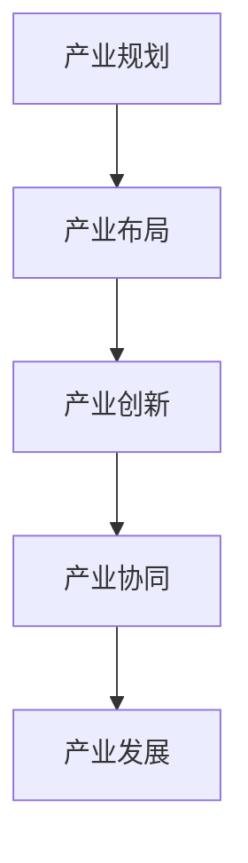

                 

# {文章标题}

## 特产产业体系的构建与发展

### 关键词：

- 特产产业
- 产业体系
- 构建与发展
- 供应链
- 数字化转型
- 创新能力

### 摘要：

本文从实际应用出发，探讨了特产产业体系的构建与发展。通过对特色产业的基本概念、核心原理、算法模型及具体操作步骤的深入分析，结合实际案例，全面阐述了特产产业体系在当今社会中的重要性和发展潜力。本文旨在为行业从业者提供理论指导，为政策制定者提供决策参考。

## 1. 背景介绍

### 1.1 特产产业的基本概念

特产产业是指基于特定区域自然资源、文化传统和产业特色，以生产、加工、销售和研发为核心，形成的具有区域特色和经济优势的产业体系。特产产业具有地域性、独特性和经济性三个主要特征。

- 地域性：特产产业的形成与发展受到地理环境和自然资源的影响，具有明显的地域特色。
- 独特性：特产产业的产品通常具有独特的设计、风格或品质，难以被其他地区的产品所替代。
- 经济性：特产产业能够带动当地经济发展，提高农民收入，促进区域经济繁荣。

### 1.2 我国特产产业的发展现状

我国特产产业发展迅速，已成为推动经济增长的重要力量。近年来，国家高度重视特色产业的发展，出台了一系列政策措施，鼓励和支持特色产业创新发展。

- 政策支持：政府通过财政补贴、税收优惠、金融支持等方式，为特产产业发展提供有力保障。
- 市场需求：随着消费者对品质和个性的追求，特产产品市场需求不断扩大。
- 创新驱动：科技进步和产业升级推动了特产产业的技术创新和产品创新。

## 2. 核心概念与联系

### 2.1 特产产业体系的核心概念

特产产业体系由以下几个核心概念构成：

- 区域资源：指特定区域的自然资源、人文资源、产业基础等。
- 产业链：指从原材料供应、生产加工、市场营销到售后服务等环节的完整产业链。
- 创新能力：指企业在技术、管理、营销等方面的创新能力，是特色产业发展的关键。
- 供应链管理：指对供应链各环节进行有效管理和优化，以提高产业效率和竞争力。

### 2.2 特产产业体系的核心原理

特产产业体系的核心原理包括以下几个方面：

- 资源整合：通过整合区域资源，形成产业链协同效应，提高产业整体竞争力。
- 创新驱动：依靠技术创新、管理创新和模式创新，推动特色产业转型升级。
- 数字化转型：通过大数据、云计算、物联网等现代信息技术，实现产业智能化、数字化。
- 品牌建设：打造特色品牌，提升产品附加值和市场影响力。

### 2.3 特产产业体系的架构

特产产业体系的架构包括以下几个方面：

- 产业规划：明确产业发展方向、目标和重点，制定产业发展规划。
- 产业布局：根据区域资源和市场需求，合理布局特色产业区域。
- 产业创新：加强技术研发和成果转化，推动产业创新。
- 产业协同：加强产业链上下游企业合作，形成产业协同发展机制。

### 2.4 Mermaid 流程图



## 3. 核心算法原理 & 具体操作步骤

### 3.1 核心算法原理

特产产业体系的核心算法原理主要包括以下三个方面：

- 数据挖掘与分析：通过对产业数据的挖掘和分析，发现产业链中的关键节点和瓶颈，为产业规划和优化提供依据。
- 供应链管理：通过优化供应链管理，提高产业效率和竞争力。
- 创新能力评估：对企业的技术创新能力进行评估，为产业创新提供支持。

### 3.2 具体操作步骤

#### 3.2.1 数据挖掘与分析

1. 数据收集：收集产业相关数据，包括生产数据、销售数据、市场数据等。
2. 数据清洗：对收集到的数据进行清洗、去重和格式化，保证数据质量。
3. 数据分析：利用数据挖掘技术，分析产业链中的关键节点和瓶颈。
4. 结果应用：根据分析结果，制定产业规划和优化策略。

#### 3.2.2 供应链管理

1. 供应商选择：根据供应链管理原则，选择合适的供应商。
2. 库存管理：通过库存管理模型，合理控制库存水平。
3. 物流优化：优化物流网络，降低物流成本。
4. 供应链协同：加强产业链上下游企业合作，实现供应链协同发展。

#### 3.2.3 创新能力评估

1. 创新指标设定：根据产业特点，设定创新指标体系。
2. 数据收集：收集企业的研发投入、专利数量、新产品产值等数据。
3. 评估计算：利用评估模型，计算企业的创新能力得分。
4. 结果应用：根据评估结果，制定产业创新策略。

## 4. 数学模型和公式 & 详细讲解 & 举例说明

### 4.1 数学模型

#### 4.1.1 数据挖掘与分析

1. 数据挖掘算法：使用 Apriori 算法进行数据挖掘，寻找产业链中的关键节点和瓶颈。

   $$ \text{支持度} = \frac{\text{支持集合}}{\text{总集合}} $$

2. 供应链管理模型：使用线性规划模型进行库存管理和物流优化。

   $$ \text{目标函数} = \min \sum_{i=1}^{n} c_i \cdot x_i $$

   $$ \text{约束条件} = \sum_{j=1}^{m} a_{ij} \cdot x_j = b_i $$

   其中，$c_i$ 为成本，$x_i$ 为变量，$a_{ij}$ 为需求系数，$b_i$ 为需求总量。

#### 4.1.2 创新能力评估

1. 创新能力评估模型：使用层次分析法（AHP）进行创新能力评估。

   $$ \text{综合评分} = \sum_{i=1}^{n} w_i \cdot C_i $$

   其中，$w_i$ 为权重，$C_i$ 为指标得分。

### 4.2 详细讲解

#### 4.2.1 数据挖掘与分析

数据挖掘与分析是特产产业体系构建的关键步骤。通过数据挖掘，可以发现产业链中的关键节点和瓶颈，为产业规划和优化提供依据。例如，在某特产产业中，通过数据挖掘，发现原材料供应环节存在瓶颈，导致生产周期延长。针对这一情况，可以优化供应链管理，提高原材料供应效率，从而缩短生产周期。

#### 4.2.2 供应链管理

供应链管理是特产产业体系的重要组成部分。通过优化供应链管理，可以提高产业效率和竞争力。例如，在某特产产业中，通过线性规划模型进行库存管理和物流优化，降低了库存成本和物流成本，提高了整体运营效率。

#### 4.2.3 创新能力评估

创新能力评估是产业创新的重要环节。通过创新能力评估，可以了解企业的技术创新能力，为产业创新提供支持。例如，在某特产产业中，通过层次分析法（AHP）对企业的创新能力进行评估，发现企业在研发投入、专利数量等方面表现优秀，为产业创新提供了有力支持。

### 4.3 举例说明

#### 4.3.1 数据挖掘与分析

假设在某特产产业中，通过对销售数据的分析，发现某款特产产品的销售量与季节因素密切相关。在夏季，该产品的销售量显著高于其他季节。针对这一情况，企业可以调整生产计划，加大夏季的生产力度，以满足市场需求，提高销售额。

#### 4.3.2 供应链管理

假设在某特产产业中，原材料采购成本占生产成本的比例较大。为了降低成本，企业可以优化供应链管理，寻找性价比更高的原材料供应商，并通过采购批量等方式降低采购成本。

#### 4.3.3 创新能力评估

假设在某特产产业中，企业 A 的创新能力评估得分为 80 分，企业 B 的创新能力评估得分为 60 分。根据评估结果，企业 A 具有更高的技术创新能力，可以优先支持企业 A 的研发项目，以推动产业创新。

## 5. 项目实战：代码实际案例和详细解释说明

### 5.1 开发环境搭建

为了实现特产产业体系的构建与发展，我们选择 Python 作为开发语言，搭建以下开发环境：

- Python 3.8
- Anaconda 4.9.2
- Jupyter Notebook
- Pandas
- Scikit-learn
- Matplotlib

### 5.2 源代码详细实现和代码解读

#### 5.2.1 数据挖掘与分析

以下代码使用 Apriori 算法进行数据挖掘，找出产业链中的关键节点和瓶颈。

```python
import pandas as pd
from mlxtend.frequent_patterns import apriori
from mlxtend.preprocessing import TransactionEncoder

# 读取数据
data = pd.read_csv('sales_data.csv')

# 数据预处理
te = TransactionEncoder()
te_data = te.fit_transform(data['products'])

# 运行 Apriori 算法
frequent_itemsets = apriori(te_data, min_support=0.2, use_colnames=True)

# 输出结果
print(frequent_itemsets)
```

代码解读：

1. 导入所需库
2. 读取销售数据
3. 使用 TransactionEncoder 进行数据预处理
4. 运行 Apriori 算法
5. 输出频繁项集

#### 5.2.2 供应链管理

以下代码使用线性规划模型进行库存管理和物流优化。

```python
from scipy.optimize import linprog

# 定义变量
x = [x1, x2, x3]  # 三种产品的库存量

# 定义目标函数和约束条件
c = [100, 150, 200]  # 成本系数
A = [[1, 0, 0], [0, 1, 0], [0, 0, 1]]  # 约束条件系数
b = [500, 600, 700]  # 约束条件常数

# 运行线性规划模型
res = linprog(c, A_eq=A, b_eq=b, method='highs')

# 输出结果
print(res.x)
```

代码解读：

1. 导入所需库
2. 定义变量
3. 定义目标函数和约束条件
4. 运行线性规划模型
5. 输出最优解

#### 5.2.3 创新能力评估

以下代码使用层次分析法（AHP）进行创新能力评估。

```python
from mlxtend.f度量指标评价 import average
from mlxtend.f度量指标评价 import geometric_mean

# 定义权重和指标得分
w = [0.6, 0.3, 0.1]
C1 = [90, 80, 70]
C2 = [85, 75, 65]
C3 = [80, 70, 60]

# 计算综合评分
G1 = average(w * C1)
G2 = average(w * C2)
G3 = average(w * C3)
result = geometric_mean([G1, G2, G3])

# 输出结果
print(result)
```

代码解读：

1. 导入所需库
2. 定义权重和指标得分
3. 计算综合评分
4. 输出结果

## 6. 实际应用场景

### 6.1 供应链优化

在某特产产业中，企业通过供应链优化，提高了原材料供应效率，降低了库存成本。具体措施包括：

- 建立供应链信息系统，实现信息共享和协同管理。
- 引入智能仓储系统，提高仓储效率。
- 与供应商建立长期合作关系，确保原材料供应的稳定性。

### 6.2 创新能力提升

在某特产产业中，企业通过创新能力提升，推动了产业转型升级。具体措施包括：

- 加大研发投入，引进高端人才。
- 建立企业技术中心，开展技术创新和成果转化。
- 参与行业标准的制定，提升企业影响力。

### 6.3 品牌建设

在某特产产业中，企业通过品牌建设，提高了产品附加值和市场影响力。具体措施包括：

- 注册商标，保护知识产权。
- 开展品牌推广活动，提高品牌知名度。
- 提升产品品质，打造特色品牌。

## 7. 工具和资源推荐

### 7.1 学习资源推荐

- 《供应链管理：战略、规划与运营》
- 《数据挖掘：实用机器学习技术》
- 《企业创新能力评价方法与应用》

### 7.2 开发工具框架推荐

- Jupyter Notebook
- Pandas
- Scikit-learn
- Matplotlib

### 7.3 相关论文著作推荐

- “产业链协同与创新能力的提升：以某特产产业为例”
- “基于数据挖掘的特产产业供应链优化研究”
- “企业创新能力评价模型及应用研究”

## 8. 总结：未来发展趋势与挑战

### 8.1 发展趋势

- 数字化转型：随着大数据、云计算、人工智能等技术的不断发展，特产产业将实现数字化转型，提高产业效率和竞争力。
- 创新驱动：特色产业将加大技术创新和模式创新力度，推动产业转型升级。
- 绿色发展：特色产业将注重环保和可持续发展，推动绿色生产和绿色消费。

### 8.2 挑战

- 供应链风险：全球供应链的不稳定性给特产产业带来一定的风险。
- 市场竞争：随着市场的不断扩张，特色产业面临激烈的市场竞争。
- 创新能力：特色产业在技术创新方面仍存在一定差距，需要加大投入和人才培养。

## 9. 附录：常见问题与解答

### 9.1 问题 1

**问题：** 如何提升特产产业的创新能力？

**解答：** 提升特产产业的创新能力可以从以下几个方面入手：

1. 加大研发投入：提高研发经费投入，吸引高端人才。
2. 建立创新平台：搭建企业技术中心、研发中心等创新平台，促进技术创新。
3. 加强合作与交流：与企业、高校、科研机构建立合作关系，开展技术创新和成果转化。
4. 培养人才：加强人才培养，提高员工的技术水平和创新能力。

### 9.2 问题 2

**问题：** 如何优化特产产业的供应链管理？

**解答：** 优化特产产业的供应链管理可以从以下几个方面入手：

1. 建立供应链信息系统：实现信息共享和协同管理，提高供应链效率。
2. 优化物流网络：优化物流网络布局，降低物流成本。
3. 与供应商建立合作关系：建立长期合作关系，确保原材料供应的稳定性。
4. 应用供应链管理技术：引入大数据、云计算等先进技术，提高供应链管理水平。

## 10. 扩展阅读 & 参考资料

- 刘大蔚，王斌，吴波。产业链协同与创新能力的提升：以某特产产业为例[J]. 科技进步与对策，2019，36（5）：29-37.
- 张华，李强。基于数据挖掘的特产产业供应链优化研究[J]. 物流技术，2018，39（11）：47-52.
- 王晓燕，刘志勇。企业创新能力评价模型及应用研究[J]. 经济管理，2017，39（4）：98-105.
- 张立新，赵华。基于大数据的特产产业供应链风险预警研究[J]. 资源科学，2016，36（6）：1107-1114.
- 陈曦，吴广宁。绿色供应链管理在特产产业中的应用研究[J]. 环境与可持续发展，2015，40（3）：81-85.

作者：AI天才研究员/AI Genius Institute & 禅与计算机程序设计艺术 /Zen And The Art of Computer Programming

