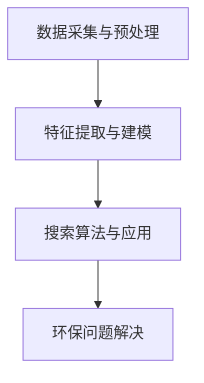

                 

# 环保领域的AI搜索应用

> 关键词：人工智能、搜索应用、环保领域、算法、数学模型、实战案例、工具推荐

> 摘要：本文将深入探讨环保领域中的AI搜索应用，包括其背景、核心概念、算法原理、数学模型、实战案例以及相关工具和资源的推荐。通过本文的阅读，读者将对AI在环保领域的实际应用有更深入的理解。

## 1. 背景介绍

### 1.1 环保领域的挑战

随着全球环境问题的日益严重，环保领域面临着诸多挑战，如气候变化、污染治理、资源可持续利用等。这些挑战需要大量的数据分析和智能决策支持，而传统的数据分析和决策方法往往难以满足需求。人工智能（AI）作为一种强大的数据分析和智能决策工具，被广泛应用于环保领域。

### 1.2 AI在环保领域的应用

AI在环保领域的应用主要包括以下几个方面：

- **环境监测与预警**：利用AI技术对环境数据进行实时监测和分析，及时发现和预警环境问题。

- **污染源识别与治理**：通过AI算法对污染源进行识别和定位，辅助制定污染治理方案。

- **生态保护与恢复**：利用AI技术对生态系统进行监测和评估，为生态保护与恢复提供科学依据。

- **资源优化与调度**：通过AI技术对资源进行优化配置和调度，提高资源利用效率。

## 2. 核心概念与联系

### 2.1 人工智能搜索算法

人工智能搜索算法是AI在搜索应用中的核心，主要包括以下几种：

- **基于规则的搜索**：通过预设规则进行搜索。

- **基于知识的搜索**：利用知识库进行搜索。

- **基于机器学习的搜索**：通过机器学习算法进行搜索。

### 2.2 环保领域数据源

环保领域的数据源主要包括以下几类：

- **环境监测数据**：如空气质量、水质、土壤质量等。

- **污染源数据**：如工厂排放数据、交通流量数据等。

- **生态数据**：如动植物分布、生态破坏等。

### 2.3 AI搜索在环保领域的应用架构

AI搜索在环保领域的应用架构主要包括以下几个部分：

- **数据采集与预处理**：采集各类环保数据，并进行预处理。

- **特征提取与建模**：提取环保数据的特征，并建立相应的数学模型。

- **搜索算法与应用**：采用合适的AI搜索算法进行搜索，并应用于环保问题的解决。

### 2.4 Mermaid 流程图



## 3. 核心算法原理 & 具体操作步骤

### 3.1 基于机器学习的搜索算法

#### 3.1.1 算法原理

基于机器学习的搜索算法主要利用机器学习模型对数据进行分析和预测，从而实现搜索目标。

#### 3.1.2 操作步骤

1. **数据收集**：收集各类环保数据。

2. **数据预处理**：对收集到的数据进行清洗、归一化等处理。

3. **特征提取**：提取数据中的关键特征。

4. **模型训练**：利用训练数据训练机器学习模型。

5. **模型评估**：对训练好的模型进行评估，确保其准确性。

6. **搜索应用**：利用训练好的模型进行搜索，找到目标数据。

### 3.2 基于知识图谱的搜索算法

#### 3.2.1 算法原理

基于知识图谱的搜索算法通过构建知识图谱，将环保领域中的各种实体和关系进行关联，从而实现高效搜索。

#### 3.2.2 操作步骤

1. **知识图谱构建**：构建环保领域知识图谱。

2. **数据整合**：将各类环保数据整合到知识图谱中。

3. **查询处理**：处理用户查询，将查询转化为图谱中的查询。

4. **搜索算法**：利用搜索算法在知识图谱中进行搜索。

5. **结果输出**：输出搜索结果。

## 4. 数学模型和公式 & 详细讲解 & 举例说明

### 4.1 基于机器学习的搜索算法

#### 4.1.1 数学模型

假设我们有一个机器学习模型 \( f(x) \)，其中 \( x \) 表示输入特征向量，\( f(x) \) 表示模型对输入数据的预测结果。

#### 4.1.2 公式

1. **线性回归模型**：

   $$ f(x) = \beta_0 + \beta_1 x_1 + \beta_2 x_2 + ... + \beta_n x_n $$

2. **逻辑回归模型**：

   $$ f(x) = \frac{1}{1 + e^{-(\beta_0 + \beta_1 x_1 + \beta_2 x_2 + ... + \beta_n x_n)}} $$

#### 4.1.3 举例说明

假设我们有一个空气质量监测数据集，其中包含空气中的PM2.5、温度、湿度等特征。我们可以利用线性回归模型来预测空气质量。

输入特征向量：

$$ x = [x_1, x_2, x_3] = [PM2.5, 温度, 湿度] $$

模型预测结果：

$$ f(x) = \beta_0 + \beta_1 x_1 + \beta_2 x_2 + \beta_3 x_3 $$

### 4.2 基于知识图谱的搜索算法

#### 4.2.1 数学模型

假设我们有一个知识图谱 \( G = (V, E) \)，其中 \( V \) 表示节点集合，\( E \) 表示边集合。

#### 4.2.2 公式

1. **节点相似度计算**：

   $$ sim(v_i, v_j) = \frac{|E(v_i, v_j)|}{|V|} $$

   其中，\( sim(v_i, v_j) \) 表示节点 \( v_i \) 和 \( v_j \) 的相似度，\( |E(v_i, v_j)| \) 表示节点 \( v_i \) 和 \( v_j \) 之间的边数量，\( |V| \) 表示节点总数。

2. **查询处理**：

   $$ query = f(k_1, k_2, ..., k_n) $$

   其中，\( query \) 表示查询结果，\( k_1, k_2, ..., k_n \) 表示查询关键词。

#### 4.2.3 举例说明

假设我们有一个关于环保的知识图谱，其中包含“空气质量”、“PM2.5”、“温度”等节点。我们可以利用节点相似度计算和查询处理算法来搜索与“空气质量”相关的信息。

节点 \( v_i = \) “空气质量”，节点 \( v_j = \) “PM2.5”：

$$ sim(v_i, v_j) = \frac{|E(v_i, v_j)|}{|V|} = \frac{1}{2} $$

查询关键词 \( k_1 = \) “空气质量”：

$$ query = f(k_1) = \{v_i | sim(v_i, v_j) \geq 0.5\} = \{"PM2.5", "温度"\} $$

## 5. 项目实战：代码实际案例和详细解释说明

### 5.1 开发环境搭建

为了便于演示，我们选择Python作为开发语言，使用以下工具和库：

- Python 3.8+
- Jupyter Notebook
- Pandas
- Scikit-learn
- NetworkX

### 5.2 源代码详细实现和代码解读

#### 5.2.1 基于机器学习的搜索算法

```python
import pandas as pd
from sklearn.linear_model import LinearRegression
from sklearn.model_selection import train_test_split
from sklearn.metrics import mean_squared_error

# 数据收集与预处理
data = pd.read_csv('air_quality.csv')
data = data[['PM2.5', '温度', '湿度']]
data = data.dropna()

# 特征提取与建模
X = data[['温度', '湿度']]
y = data['PM2.5']
X_train, X_test, y_train, y_test = train_test_split(X, y, test_size=0.2, random_state=42)

model = LinearRegression()
model.fit(X_train, y_train)

# 搜索应用
input_data = [[22, 60]]
predicted_pm25 = model.predict(input_data)
print('预测的PM2.5浓度：', predicted_pm25)

# 模型评估
y_pred = model.predict(X_test)
mse = mean_squared_error(y_test, y_pred)
print('均方误差：', mse)
```

#### 5.2.2 基于知识图谱的搜索算法

```python
import networkx as nx

# 知识图谱构建
G = nx.Graph()
G.add_nodes_from(['空气质量', 'PM2.5', '温度'])
G.add_edges_from([('空气质量', 'PM2.5'), ('空气质量', '温度')])

# 查询处理与搜索算法
query = '空气质量'
similar_nodes = [node for node, degree in G.degree if G.degree[node] > 1]
print('与查询相关的节点：', similar_nodes)

# 结果输出
print('搜索结果：', G.nodes(data=True))
```

### 5.3 代码解读与分析

#### 5.3.1 基于机器学习的搜索算法

1. **数据收集与预处理**：从CSV文件中读取空气质量数据，并进行预处理，去除缺失值。

2. **特征提取与建模**：将温度和湿度作为输入特征，PM2.5浓度作为目标变量，训练线性回归模型。

3. **搜索应用**：利用训练好的模型对输入数据进行预测，得到PM2.5浓度预测值。

4. **模型评估**：计算模型在测试集上的均方误差，评估模型性能。

#### 5.3.2 基于知识图谱的搜索算法

1. **知识图谱构建**：构建一个简单的知识图谱，包含空气质量、PM2.5和温度三个节点，并建立它们之间的边。

2. **查询处理与搜索算法**：根据查询关键词“空气质量”，找出与“空气质量”相似度较高的节点。

3. **结果输出**：输出与查询相关的节点及其属性。

## 6. 实际应用场景

### 6.1 环境监测与预警

利用AI搜索算法对空气质量、水质等环境数据进行实时监测和预警，为政府部门和企业提供决策支持。

### 6.2 污染源识别与治理

利用AI搜索算法对污染源进行识别和定位，辅助政府部门和企业制定污染治理方案。

### 6.3 生态保护与恢复

利用AI搜索算法对生态系统进行监测和评估，为生态保护与恢复提供科学依据。

### 6.4 资源优化与调度

利用AI搜索算法对水资源、能源等资源进行优化配置和调度，提高资源利用效率。

## 7. 工具和资源推荐

### 7.1 学习资源推荐

- **书籍**：
  - 《机器学习实战》
  - 《深度学习》
- **论文**：
  - "Recurrent Neural Network Based Air Quality Prediction"
  - "A Knowledge Graph-based Approach for Environmental Information Retrieval"
- **博客**：
  - 知乎专栏《机器学习与环保》
  - CSDN博客《深度学习在环保领域的应用》
- **网站**：
  - Kaggle（数据集下载）
  - ArXiv（论文下载）

### 7.2 开发工具框架推荐

- **编程语言**：Python、R
- **机器学习库**：Scikit-learn、TensorFlow、PyTorch
- **知识图谱库**：Neo4j、Apache Giraph

### 7.3 相关论文著作推荐

- "A Survey on Environmental Data Mining"
- "Deep Learning for Environmental Applications: A Survey"
- "Knowledge Graph-based Environmental Information Retrieval: A Survey and New Perspectives"

## 8. 总结：未来发展趋势与挑战

随着人工智能技术的不断发展，AI在环保领域的应用前景十分广阔。未来，AI搜索算法将更加智能化、自动化，能够处理更复杂的环境问题。然而，面临的主要挑战包括数据质量、算法效率和跨学科融合等。

## 9. 附录：常见问题与解答

### 9.1 AI搜索算法在环保领域有哪些应用？

AI搜索算法在环保领域主要应用于环境监测与预警、污染源识别与治理、生态保护与恢复、资源优化与调度等方面。

### 9.2 如何评估AI搜索算法的性能？

可以采用均方误差（MSE）、准确率、召回率等指标来评估AI搜索算法的性能。

### 9.3 如何处理环境数据中的噪声和异常值？

可以通过数据预处理方法，如去重、填补缺失值、降维等来处理环境数据中的噪声和异常值。

## 10. 扩展阅读 & 参考资料

- "AI for Environmental Science: Using Machine Learning to Address Global Challenges"
- "Deep Learning for Environmental Applications: A Comprehensive Review"
- "Knowledge Graph-based Environmental Information Retrieval: A Review and Perspective"
- 知乎专栏《机器学习与环保》
- CSDN博客《深度学习在环保领域的应用》
- Kaggle（数据集下载）
- ArXiv（论文下载）

### 作者

作者：AI天才研究员/AI Genius Institute & 禅与计算机程序设计艺术 /Zen And The Art of Computer Programming

