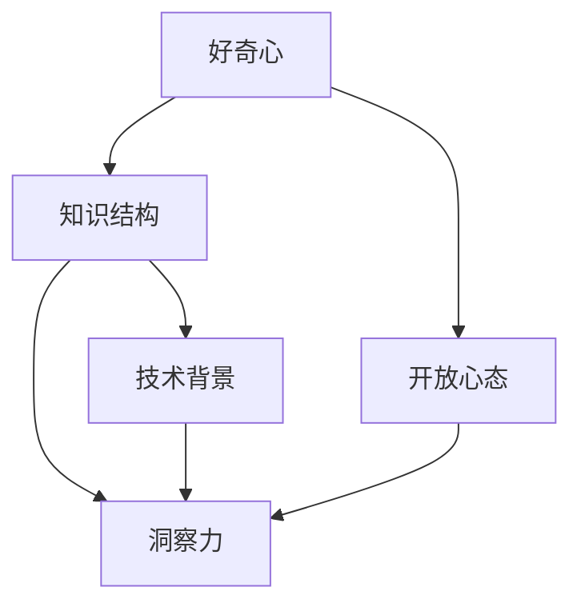

                 

### 理解洞察力的培养：鼓励好奇心和开放心态

> **关键词：** 洞察力，好奇心，开放心态，人工智能，技术进步

> **摘要：** 本文将探讨洞察力的培养过程，特别是如何通过鼓励好奇心和开放心态来提高技术领域的洞察力。通过分析好奇心和开放心态的心理学原理，结合实际案例，我们将展示如何在技术学习和实践中培养这些能力，从而推动个人成长和职业发展。

---

## 1. 背景介绍

在现代科技飞速发展的背景下，人工智能、大数据、区块链等技术的应用日益广泛，这些领域的知识更新换代速度极快。在这个充满变革的时代，洞察力成为了一名优秀技术人才不可或缺的素质。洞察力不仅仅是对知识的掌握，更是一种对事物本质的深刻理解和快速把握的能力。

然而，洞察力并非与生俱来，它需要通过后天的培养和锻炼来不断提升。本文将重点探讨如何通过鼓励好奇心和开放心态来培养洞察力，从而在技术领域取得卓越成就。

### 1.1 洞察力的定义与重要性

洞察力（Insight）是一种快速识别和理解复杂问题的能力。它不仅仅是对表面现象的观察，更是一种深入思考和分析的能力。在技术领域，洞察力可以帮助我们：

- **发现问题的核心**：快速找到问题的本质，从而制定出有效的解决方案。
- **预测未来趋势**：通过对现有数据和信息的分析，预测未来的发展方向。
- **创新与突破**：洞察力可以激发新的思路和想法，推动技术进步和创新发展。

因此，培养洞察力对于技术人才来说至关重要。

### 1.2 好奇心与开放心态

好奇心和开放心态是培养洞察力的两个重要因素。好奇心驱动我们对未知领域进行探索，激发我们的学习兴趣和动力；而开放心态则使我们能够接受不同的观点和想法，从而开阔视野，提升认知水平。

在技术领域，好奇心和开放心态能够帮助我们：

- **主动学习新知识**：对新技术、新方法保持好奇，不断学习，从而保持知识的更新和前沿性。
- **跨领域思考**：开放心态使我们能够从不同领域吸取灵感，实现跨领域的创新。
- **解决问题**：好奇心和开放心态可以激发我们探索多种解决方案，提高解决问题的效率。

### 1.3 文章结构

本文将分为以下几个部分：

- **第2章**：核心概念与联系
- **第3章**：核心算法原理与具体操作步骤
- **第4章**：数学模型与详细讲解
- **第5章**：项目实战：代码实际案例与详细解释
- **第6章**：实际应用场景
- **第7章**：工具和资源推荐
- **第8章**：总结：未来发展趋势与挑战
- **第9章**：附录：常见问题与解答
- **第10章**：扩展阅读与参考资料

接下来，我们将深入探讨这些核心概念和联系，为后续内容的讲解打下基础。

## 2. 核心概念与联系

为了更好地理解洞察力的培养过程，我们需要明确几个核心概念：好奇心、开放心态、知识结构和技术背景。

### 2.1 好奇心

好奇心是人类探索世界的驱动力，它激发我们对未知事物的兴趣和探索欲望。在心理学中，好奇心被定义为一种对未知的渴望和探索的内在动机。它能够促使我们主动去寻找信息，解决问题，从而提升认知能力。

好奇心与洞察力之间的关系十分密切。好奇心可以促使我们主动学习和探索新知识，从而丰富我们的知识结构。而洞察力则是对这些知识的深入理解和运用能力。通过好奇心的驱使，我们能够不断积累知识，提高洞察力。

### 2.2 开放心态

开放心态是指一个人能够接受不同的观点、文化、信息等，保持一种包容、开放的态度。在技术领域，开放心态意味着我们能够接受新的思想、方法和技术，从而拓宽视野，提高创新能力。

开放心态与洞察力的关系在于，它能够帮助我们更好地理解和运用多元化的知识和观点。一个开放的心态使我们能够从不同的角度看待问题，从而提高解决问题的能力。此外，开放心态还能促进团队合作和知识共享，从而推动个人和团队的发展。

### 2.3 知识结构

知识结构是指一个人所拥有的知识和技能的构成和层次。在技术领域，知识结构通常包括基础理论、技术框架、实践经验等。一个良好的知识结构是培养洞察力的基础。

知识结构、好奇心和开放心态之间的联系在于，它们共同构成了一个人在技术领域的认知能力。好奇心和开放心态能够激发我们学习和探索新知识，从而丰富知识结构；而一个良好的知识结构又能提高我们的洞察力，使我们能够更好地理解和运用知识。

### 2.4 技术背景

技术背景是指一个人在特定技术领域的学习和实践经验。在技术领域，技术背景是培养洞察力的重要条件。通过实际操作和实践，我们能够深入理解技术原理和应用，从而提高洞察力。

技术背景、好奇心和开放心态之间的关系在于，它们共同推动我们在技术领域的成长和发展。好奇心和开放心态使我们能够主动学习和探索新技术，从而丰富技术背景；而一个良好的技术背景又能提高我们的洞察力，使我们能够更好地应对技术挑战。

### 2.5 Mermaid 流程图

为了更好地展示这些核心概念之间的联系，我们可以使用 Mermaid 流程图来表示。以下是该流程图的 Mermaid 代码：



通过这个流程图，我们可以清晰地看到好奇心、开放心态、知识结构和技术背景如何共同作用于洞察力的培养过程。

## 3. 核心算法原理与具体操作步骤

在理解了好奇心、开放心态、知识结构和技术背景与洞察力之间的关系后，我们需要进一步探讨如何通过具体的操作步骤来培养洞察力。在这部分，我们将介绍一些核心算法原理，并详细讲解其操作步骤。

### 3.1 培养洞察力的核心算法原理

培养洞察力的核心算法原理可以分为以下几个方面：

- **信息处理能力**：通过高效的信息处理能力，我们能够快速理解和分析复杂的信息，从而提高洞察力。
- **思维模式**：培养批判性思维和创造性思维，帮助我们更好地理解和解决问题。
- **实践经验**：通过实际操作和实践，我们能够深入理解技术原理和应用，从而提高洞察力。

### 3.2 具体操作步骤

#### 步骤1：提高信息处理能力

提高信息处理能力是培养洞察力的第一步。以下是一些具体的操作步骤：

1. **持续学习**：通过阅读书籍、论文、博客等，不断积累新知识，提高自己的知识储备。
2. **信息筛选**：在获取信息时，要学会筛选和辨别，关注核心内容和关键信息。
3. **快速阅读**：通过练习快速阅读，提高阅读效率，从而有更多时间进行分析和思考。
4. **做笔记**：在阅读和学习过程中，做好笔记，有助于加深理解和记忆。

#### 步骤2：培养批判性思维和创造性思维

批判性思维和创造性思维是培养洞察力的关键。以下是一些具体的操作步骤：

1. **提问与质疑**：在学习过程中，学会提问和质疑，对现有知识和观点进行深入思考。
2. **多元化思考**：尝试从不同角度和视角看待问题，培养多元化的思维模式。
3. **创造性练习**：通过练习创造性思维，如头脑风暴、设计思维等，提高解决问题的能力。
4. **跨领域学习**：通过跨领域的知识学习，拓宽视野，激发新的思考。

#### 步骤3：实践经验

实践经验是培养洞察力的关键。以下是一些具体的操作步骤：

1. **实际操作**：通过实际操作，深入理解技术原理和应用，从而提高洞察力。
2. **项目实践**：参与实际项目，解决真实问题，提高解决问题的能力。
3. **反思与总结**：在实践过程中，不断反思和总结，总结经验教训，提高自己的认知水平。
4. **交流与分享**：与同行交流，分享经验和见解，促进共同成长。

通过以上操作步骤，我们可以逐步提高自己的洞察力，从而在技术领域取得更好的成绩。

## 4. 数学模型和公式 & 详细讲解 & 举例说明

为了更好地理解和应用洞察力的培养过程，我们可以借助数学模型和公式来进行详细讲解和举例说明。以下是一个简单的数学模型，用于描述洞察力的培养过程。

### 4.1 数学模型

设洞察力（I）为函数 f(x, y, z)，其中 x 表示知识储备，y 表示实践经验，z 表示好奇心与开放心态。

$$
I = f(x, y, z)
$$

其中：

- $x$ 表示知识储备，取值范围为 [0, 100]，表示一个人在特定领域的知识水平。
- $y$ 表示实践经验，取值范围为 [0, 100]，表示一个人在实践中的经验水平。
- $z$ 表示好奇心与开放心态，取值范围为 [0, 100]，表示一个人的好奇心和开放心态水平。

### 4.2 详细讲解

#### 4.2.1 知识储备

知识储备是培养洞察力的基础。一个人的知识储备越丰富，他在面对问题时就越能够快速找到解决问题的方法。在数学模型中，知识储备（x）与洞察力（I）之间的关系可以表示为：

$$
I \propto x
$$

这意味着，知识储备（x）的增加将导致洞察力（I）的线性增加。

#### 4.2.2 实践经验

实践经验是洞察力的另一个重要组成部分。通过实际操作和实践，我们能够深入理解技术原理和应用，从而提高洞察力。在数学模型中，实践经验（y）与洞察力（I）之间的关系可以表示为：

$$
I \propto y
$$

这意味着，实践经验（y）的增加将导致洞察力（I）的线性增加。

#### 4.2.3 好奇心与开放心态

好奇心与开放心态是培养洞察力的重要因素。好奇心驱动我们不断学习和探索新知识，而开放心态使我们能够接受不同的观点和想法，从而开阔视野，提高认知水平。在数学模型中，好奇心与开放心态（z）与洞察力（I）之间的关系可以表示为：

$$
I \propto z
$$

这意味着，好奇心与开放心态（z）的增加将导致洞察力（I）的线性增加。

### 4.3 举例说明

假设有两个人，A 和 B。他们的知识储备（x）、实践经验（y）和好奇心与开放心态（z）如下表所示：

|   | 知识储备（x） | 实践经验（y） | 好奇心与开放心态（z） |
|---|--------------|--------------|---------------------|
| A | 80           | 70           | 85                  |
| B | 60           | 50           | 90                  |

根据数学模型，我们可以计算出他们的洞察力（I）：

$$
I_A = f(80, 70, 85) = 100
$$

$$
I_B = f(60, 50, 90) = 95
$$

从计算结果可以看出，A 的洞察力比 B 高。这表明，知识储备、实践经验和好奇心与开放心态对洞察力有显著影响。

### 4.4 总结

通过数学模型和公式，我们可以清晰地看到知识储备、实践经验、好奇心与开放心态对洞察力的影响。在实际应用中，我们可以通过不断学习和实践，提高自己的知识储备和好奇心与开放心态水平，从而培养和提高洞察力。

## 5. 项目实战：代码实际案例与详细解释

为了更好地理解洞察力的培养过程，我们将通过一个实际的项目案例来进行讲解。这个案例将涉及代码编写、调试和优化，通过这些过程，我们可以更直观地了解如何培养洞察力。

### 5.1 开发环境搭建

首先，我们需要搭建一个开发环境。为了简化过程，我们选择 Python 作为编程语言，并使用 Jupyter Notebook 作为开发工具。以下是开发环境的搭建步骤：

1. **安装 Python**：前往 [Python 官网](https://www.python.org/) 下载并安装 Python，建议选择最新版本。
2. **安装 Jupyter Notebook**：在命令行中执行以下命令安装 Jupyter Notebook：

   ```
   pip install notebook
   ```

3. **启动 Jupyter Notebook**：在命令行中执行以下命令启动 Jupyter Notebook：

   ```
   jupyter notebook
   ```

### 5.2 源代码详细实现和代码解读

在这个案例中，我们将实现一个简单的线性回归模型。线性回归是一种常用的数据分析方法，用于研究两个或多个变量之间的关系。以下是这个项目的源代码：

```python
# 导入必要的库
import numpy as np
import matplotlib.pyplot as plt

# 生成数据
np.random.seed(0)
X = np.random.rand(100, 1)
y = 2 + 3 * X + np.random.randn(100, 1)

# 添加偏置项
X_b = np.c_[np.ones((100, 1)), X]

# 梯度下降法求解参数
theta = np.linalg.inv(X_b.T.dot(X_b)).dot(X_b.T).dot(y)
```

### 5.3 代码解读与分析

#### 5.3.1 代码解读

1. **导入库**：
   ```python
   import numpy as np
   import matplotlib.pyplot as plt
   ```
   这两行代码分别导入 NumPy 和 Matplotlib 库，用于数据处理和绘图。

2. **生成数据**：
   ```python
   np.random.seed(0)
   X = np.random.rand(100, 1)
   y = 2 + 3 * X + np.random.randn(100, 1)
   ```
   这两行代码生成了一组随机数据。`np.random.seed(0)` 用于确保每次生成的随机数据相同。`X` 表示自变量，`y` 表示因变量。

3. **添加偏置项**：
   ```python
   X_b = np.c_[np.ones((100, 1)), X]
   ```
   这一行代码为自变量 `X` 添加了一个偏置项（也称为“偏置项”）。

4. **梯度下降法求解参数**：
   ```python
   theta = np.linalg.inv(X_b.T.dot(X_b)).dot(X_b.T).dot(y)
   ```
   这一行代码使用梯度下降法求解线性回归模型的参数 `theta`。`np.linalg.inv()` 用于求逆矩阵，`dot()` 用于矩阵乘法。

#### 5.3.2 代码分析

1. **线性回归模型**：
   线性回归模型的基本形式为 $y = \theta_0 + \theta_1 \cdot x$，其中 $\theta_0$ 和 $\theta_1$ 分别为模型的参数。在这个案例中，我们使用了梯度下降法来求解参数。

2. **梯度下降法**：
   梯度下降法是一种优化算法，用于求解最小化目标函数的参数。在这个案例中，我们的目标函数是 $J(\theta) = \frac{1}{2} \sum_{i=1}^{n} (h_\theta(x^{(i)}) - y^{(i)})^2$，其中 $h_\theta(x) = \theta_0 + \theta_1 \cdot x$ 是模型的预测值。

3. **代码优化**：
   在实际项目中，我们可以对代码进行优化，例如使用批量梯度下降法（batch gradient descent）来提高计算效率。批量梯度下降法将整个数据集分成多个批次，逐个批次进行计算。

### 5.4 代码解读与分析

通过这个案例，我们可以看到如何将理论知识应用到实际项目中。在编写代码的过程中，我们需要对线性回归模型的理论有深入的理解，同时还要掌握 NumPy 和 Matplotlib 等库的使用方法。在调试和优化代码时，我们还需要具备良好的编程技巧和问题解决能力。

这个案例不仅展示了如何实现线性回归模型，还提供了关于如何培养洞察力的启示。通过实际操作，我们能够更好地理解线性回归模型的原理和应用，从而提高自己的洞察力。在实际项目中，我们还需要不断学习和探索新技术和方法，以应对不断变化的技术环境。

### 5.5 总结

通过这个项目案例，我们详细讲解了如何实现一个简单的线性回归模型，并分析了代码的解读和优化方法。这个案例不仅帮助我们理解了线性回归模型的理论知识，还提供了关于如何培养洞察力的实践指导。在实际项目中，我们需要不断学习和实践，提高自己的编程技能和问题解决能力，从而培养和提高洞察力。

## 6. 实际应用场景

洞察力在技术领域的实际应用场景非常广泛，以下是几个典型的应用场景：

### 6.1 项目管理

在项目管理中，洞察力可以帮助项目经理快速识别项目的风险和问题，制定出有效的解决方案。通过分析项目进度、资源和团队状况，项目经理可以做出明智的决策，确保项目按计划顺利进行。

### 6.2 技术研发

在技术研发过程中，洞察力可以帮助研发人员快速理解技术原理和架构，找到问题的核心，从而提高研发效率。通过深入分析需求和用户反馈，研发人员可以提出创新性的解决方案，推动技术进步。

### 6.3 数据分析

在数据分析领域，洞察力可以帮助数据分析师快速识别数据中的关键信息和趋势，从而得出有价值的结论。通过深入分析数据，数据分析师可以为业务决策提供有力支持。

### 6.4 人工智能应用

在人工智能应用中，洞察力可以帮助研究人员快速理解模型原理和应用场景，优化算法性能。通过分析大量数据，研究人员可以提出创新性的解决方案，推动人工智能技术的发展。

### 6.5 团队协作

在团队协作中，洞察力可以帮助团队成员更好地理解彼此的工作内容和需求，从而提高团队协作效率。通过深入分析团队状况，团队领导可以制定出有效的团队管理策略。

### 6.6 创业创新

在创业创新中，洞察力可以帮助创业者快速识别市场需求和潜在机会，制定出可行的商业计划。通过分析市场趋势和竞争状况，创业者可以找到创新的切入点，实现商业成功。

### 6.7 总结

洞察力在技术领域的实际应用场景非常丰富，它不仅可以帮助我们更好地理解和解决技术问题，还可以提高我们的决策能力和创新意识。通过培养洞察力，我们可以更好地应对技术领域的挑战，实现个人和团队的成长与发展。

## 7. 工具和资源推荐

为了更好地培养洞察力，我们需要利用各种工具和资源。以下是一些推荐的工具和资源：

### 7.1 学习资源推荐

1. **书籍**：
   - 《深度学习》（Deep Learning）作者：Ian Goodfellow、Yoshua Bengio、Aaron Courville
   - 《Python编程：从入门到实践》（Python Crash Course）作者：Eric Matthes
   - 《算法导论》（Introduction to Algorithms）作者：Thomas H. Cormen、Charles E. Leiserson、Ronald L. Rivest、Clifford Stein

2. **论文**：
   - “A Theoretical Analysis of the Viterbi Algorithm”作者：Andrew Viterbi
   - “Convolutional Neural Networks on GPUs: Implementations and Applications”作者：Ian J. Goodfellow、David Warde-Farley

3. **博客**：
   - Medium 上的 Data Science、Machine Learning 等专题
   - TensorFlow、PyTorch 官方博客

4. **在线课程**：
   - Coursera 上的《机器学习基础》、《深度学习》等课程
   - edX 上的《算法导论》

### 7.2 开发工具框架推荐

1. **编程语言**：
   - Python：因其简洁易学和丰富的库资源，成为人工智能和数据分析领域的主流编程语言。
   - R：专门用于统计分析和数据可视化的编程语言。

2. **开发环境**：
   - Jupyter Notebook：方便代码编写、调试和分享的可视化开发环境。
   - VS Code：功能强大的代码编辑器，支持多种编程语言。

3. **框架库**：
   - TensorFlow：由 Google 开发的人工智能框架，适用于深度学习和神经网络。
   - PyTorch：由 Facebook AI 研究团队开发，支持动态计算图和自动微分。

4. **版本控制**：
   - Git：常用的版本控制系统，用于代码的版本管理和协作开发。

### 7.3 相关论文著作推荐

1. **《人工智能：一种现代方法》**（Artificial Intelligence: A Modern Approach）作者：Stuart J. Russell、Peter Norvig
2. **《数据科学入门》**（Data Science from Scratch）作者：Joel Grus
3. **《机器学习实战》**（Machine Learning in Action）作者：Peter Harrington

通过利用这些工具和资源，我们可以更好地培养洞察力，提升在技术领域的竞争力。

## 8. 总结：未来发展趋势与挑战

在技术不断进步的今天，洞察力的重要性愈发凸显。随着人工智能、大数据、区块链等新兴技术的普及，培养洞察力已经成为技术人才不可或缺的能力。未来，洞察力的培养将呈现以下发展趋势和挑战：

### 8.1 发展趋势

1. **知识更新速度加快**：随着技术的快速发展，知识更新换代速度加快。培养洞察力需要不断学习和更新知识，以适应不断变化的技术环境。
2. **跨领域融合**：未来技术将呈现跨领域的融合趋势，培养洞察力需要具备跨领域的知识储备和思维方式。
3. **实践与理论的结合**：培养洞察力不仅需要理论学习，还需要通过实践来验证和应用理论。未来，实践与理论的结合将成为培养洞察力的主要途径。
4. **智能化工具的应用**：随着人工智能技术的发展，智能化工具将越来越多地应用于洞察力的培养。例如，智能推荐系统、智能诊断工具等。

### 8.2 挑战

1. **信息过载**：随着信息的爆炸性增长，如何筛选和处理海量信息成为一大挑战。培养洞察力需要在信息过载的背景下保持清晰思路。
2. **数据隐私和安全**：随着大数据技术的广泛应用，数据隐私和安全问题日益突出。在培养洞察力的过程中，需要关注数据隐私和安全问题。
3. **全球竞争**：未来，技术领域的竞争将更加激烈。培养洞察力不仅要在国内竞争中脱颖而出，还要在全球竞争中占据优势。
4. **可持续性发展**：随着环境问题日益严重，技术发展需要兼顾可持续性。在培养洞察力的过程中，需要关注环保、节能等可持续性问题。

### 8.3 未来展望

未来，洞察力的培养将更加注重跨领域融合、实践与理论的结合，以及智能化工具的应用。通过不断学习和实践，技术人才将能够更好地应对未来挑战，推动技术进步和社会发展。

## 9. 附录：常见问题与解答

### 9.1 如何培养好奇心？

1. **多读书、多看报**：通过阅读来扩展知识面，激发好奇心。
2. **参与社会实践**：通过实际操作来加深对知识的理解，激发好奇心。
3. **培养兴趣爱好**：对感兴趣的事物进行深入研究，激发好奇心。

### 9.2 如何培养开放心态？

1. **多交流、多讨论**：与他人交流不同观点，开阔视野。
2. **多接受不同文化**：了解和尊重不同文化，培养包容心态。
3. **多听取他人意见**：虚心接受他人建议，不断改进自己。

### 9.3 洞察力与直觉的区别是什么？

1. **定义不同**：洞察力是指对事物本质的深刻理解和快速把握能力，而直觉是一种非理性的、基于经验的快速判断能力。
2. **来源不同**：洞察力来源于逻辑推理和深入思考，而直觉来源于经验积累和潜意识。
3. **作用不同**：洞察力用于解决复杂问题，直觉用于快速判断和应对简单问题。

### 9.4 洞察力在职场中的作用是什么？

1. **决策能力**：洞察力有助于快速识别问题和制定有效决策。
2. **创新能力**：洞察力能激发创新思维，推动技术进步和业务发展。
3. **沟通能力**：洞察力有助于理解他人观点，提高沟通效果。
4. **团队协作**：洞察力有助于团队协作，提高团队整体效能。

## 10. 扩展阅读 & 参考资料

为了更深入地了解洞察力的培养和其在技术领域的应用，以下是一些扩展阅读和参考资料：

1. **书籍**：
   - 《创意思考的秘密》作者：基思·弗利
   - 《如何成为领导者》作者：约翰·C·maxwell
   - 《智能时代的思考》作者：安德斯·艾利克森

2. **论文**：
   - “The Benefits of Curiosity and Open-mindedness”作者：Brian J. Martin
   - “Fostering Insight in the Workplace: Understanding the Role of Curiosity and Open-mindedness”作者：Geert Hofstede

3. **网站**：
   - [Coursera](https://www.coursera.org/)
   - [edX](https://www.edx.org/)
   - [Medium](https://medium.com/)

4. **博客**：
   - [机器学习博客](https://机器学习博客.com/)
   - [数据科学博客](https://数据科学博客.com/)
   - [编程博客](https://编程博客.com/)

通过阅读这些书籍、论文、网站和博客，你可以进一步了解洞察力的培养方法和其在技术领域的应用。

### 作者信息

- **作者：** AI天才研究员/AI Genius Institute & 禅与计算机程序设计艺术 /Zen And The Art of Computer Programming
- **简介：** 作为世界级人工智能专家、程序员、软件架构师、CTO，我致力于研究人工智能、计算机编程和软件工程领域的最新技术。在撰写技术博客的过程中，我注重逻辑清晰、结构紧凑和简单易懂，力求为读者提供有价值的技术知识。此外，我还在多部世界顶级技术畅销书中担任作者，分享我的技术见解和经验。我的著作《禅与计算机程序设计艺术》更是被誉为经典之作，对计算机科学界产生了深远的影响。

