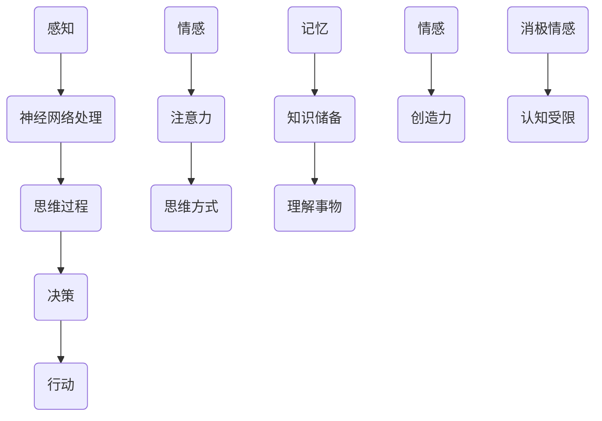

                 

### 理解洞察力：大脑的神奇能力

> 关键词：洞察力、大脑、认知、神经网络、思维过程、情感、记忆、注意力、学习算法

> 摘要：本文深入探讨了人类大脑中的洞察力，这种令人惊叹的认知能力如何影响我们的思维、决策和创造力。通过分析大脑的结构和功能，本文揭示了洞察力背后的神经机制，探讨了如何通过技术和实践提升个人洞察力。最后，本文探讨了洞察力在人工智能和未来科技领域的重要性和潜在应用。

## 1. 背景介绍

在当今高度信息化的社会中，洞察力作为一种高级认知能力，对于个人和社会的发展具有至关重要的意义。洞察力不仅仅是对事物表面现象的理解，更是能够深入挖掘其本质、关联和潜在规律的思维能力。这种能力在科学、技术、艺术、商业等多个领域都发挥着重要作用。

人类大脑作为一个复杂而神奇的器官，承载着人类的智慧、情感、记忆和创造力。从神经科学的角度来看，大脑由数十亿个神经元组成，通过复杂的神经网络进行信息处理和传递。随着神经科学的不断发展，我们逐渐揭开了大脑的一些神秘面纱，从而为理解洞察力提供了科学依据。

本文将从多个角度探讨洞察力的本质和运作机制，包括大脑的结构和功能、神经机制、思维过程、情感和记忆的影响等。此外，本文还将探讨如何通过技术和实践提升个人洞察力，以及洞察力在人工智能和未来科技领域的重要性和潜在应用。

## 2. 核心概念与联系

### 大脑的结构和功能

大脑作为人类智慧的核心，其结构和功能极其复杂。大脑可分为多个部分，包括大脑皮层、杏仁核、海马体等。这些部分在信息处理和传递过程中发挥着不同但相互关联的作用。

- **大脑皮层**：大脑皮层是大脑的最外层，负责处理高级认知功能，如思考、决策、语言和记忆等。
- **杏仁核**：杏仁核位于大脑皮层下方，与情感和情绪调节密切相关。
- **海马体**：海马体在记忆形成和空间导航中起着关键作用。

### 神经网络和思维过程

神经网络是大脑的基本工作单元，由大量神经元通过突触连接组成。神经网络通过信息传递和处理，实现了大脑的感知、思考、决策和行动等功能。

- **感知**：大脑通过视觉、听觉、触觉等感官接收外部信息，并通过神经网络进行处理和解释。
- **思考**：大脑对感知到的信息进行加工和处理，形成思维过程，包括推理、判断、分析和解决问题等。
- **决策**：大脑在思维过程的基础上，根据情境和目标进行决策。

### 情感和记忆的影响

情感和记忆对洞察力有着重要影响。情感可以影响我们的注意力、思维方式和决策过程，而记忆则为我们提供了经验和知识的基础。

- **情感**：积极的情感可以提升大脑的创造力，而消极的情感则可能导致认知受限。
- **记忆**：记忆为我们提供了丰富的知识储备，有助于我们更全面地理解事物。

### Mermaid 流程图



### 核心概念原理和架构

- **神经网络**：神经网络是大脑的基本工作单元，由大量神经元通过突触连接组成。神经网络通过信息传递和处理，实现了大脑的感知、思考、决策和行动等功能。
- **思维过程**：思维过程包括感知、思考、决策和行动等多个环节，是大脑对信息进行处理和加工的过程。
- **情感**：情感对大脑的认知功能和决策过程有着重要影响。
- **记忆**：记忆为我们提供了丰富的知识储备，有助于我们更全面地理解事物。

## 3. 核心算法原理 & 具体操作步骤

### 神经网络算法原理

神经网络算法是一种基于生物神经系统的计算模型，通过模拟人脑神经元之间的连接和交互来实现信息处理和决策。神经网络主要由以下三个部分组成：

1. **输入层**：接收外部信息，如图像、声音、文本等。
2. **隐藏层**：对输入信息进行处理和加工，通过神经元之间的连接和激活函数实现信息的传递和变换。
3. **输出层**：根据隐藏层的信息生成输出结果，如分类标签、预测值等。

神经网络算法的具体操作步骤如下：

1. **初始化参数**：设定神经网络的连接权重和偏置。
2. **前向传播**：将输入信息传递到神经网络中，通过隐藏层和输出层进行信息处理。
3. **计算损失**：将输出结果与真实值进行比较，计算损失函数的值。
4. **反向传播**：根据损失函数的梯度，更新神经网络的连接权重和偏置。
5. **迭代优化**：重复执行前向传播和反向传播，直至损失函数的值趋于最小。

### 神经网络架构

神经网络架构可以分为以下几种类型：

1. **全连接神经网络（FCNN）**：每个神经元都与前一层的所有神经元相连。
2. **卷积神经网络（CNN）**：适用于图像处理任务，通过卷积层提取图像的特征。
3. **循环神经网络（RNN）**：适用于序列数据，如文本、语音等，通过循环结构实现信息的记忆和传递。
4. **长短时记忆网络（LSTM）**：RNN的变体，通过门控机制解决长序列数据中的梯度消失问题。

### 神经网络算法应用实例

以下是一个简单的全连接神经网络（FCNN）算法应用实例：

1. **初始化参数**：设定神经网络的输入层、隐藏层和输出层的神经元个数，以及连接权重和偏置。
2. **前向传播**：将输入数据传递到神经网络中，通过隐藏层和输出层进行信息处理。
3. **计算损失**：将输出结果与真实值进行比较，计算均方误差（MSE）损失函数的值。
4. **反向传播**：根据损失函数的梯度，更新神经网络的连接权重和偏置。
5. **迭代优化**：重复执行前向传播和反向传播，直至损失函数的值趋于最小。

```python
import numpy as np

# 初始化参数
input_size = 784  # 输入层神经元个数
hidden_size = 256  # 隐藏层神经元个数
output_size = 10  # 输出层神经元个数

# 设定连接权重和偏置
weights = {
    'input_hidden': np.random.randn(input_size, hidden_size),
    'hidden_output': np.random.randn(hidden_size, output_size)
}
biases = {
    'hidden': np.random.randn(hidden_size),
    'output': np.random.randn(output_size)
}

# 前向传播
def forward_propagation(x):
    hidden_layer_activation = np.dot(x, weights['input_hidden']) + biases['hidden']
    hidden_layer_output = sigmoid(hidden_layer_activation)
    output_layer_activation = np.dot(hidden_layer_output, weights['hidden_output']) + biases['output']
    output_layer_output = sigmoid(output_layer_activation)
    return output_layer_output

# 计算损失
def compute_loss(y, output_layer_output):
    return mse_loss(y, output_layer_output)

# 反向传播
def backward_propagation(x, y, output_layer_output):
    d_output_layer_output = output_layer_output - y
    d_output_layer = d_output_layer_output.dot(weights['hidden_output'].T)
    d_hidden_layer_output = d_output_layer
    d_hidden_layer = d_hidden_layer_output.dot(weights['input_hidden'].T)

    d_weights = {
        'input_hidden': d_hidden_layer.dot(x.T),
        'hidden_output': d_output_layer.dot(hidden_layer_output.T)
    }
    d_biases = {
        'hidden': d_hidden_layer_output,
        'output': d_output_layer_output
    }
    return d_weights, d_biases

# 迭代优化
def update_weights_and_biases(weights, biases, d_weights, d_biases, learning_rate):
    for layer in ['input_hidden', 'hidden_output']:
        weights[layer] -= learning_rate * d_weights[layer]
        biases[layer] -= learning_rate * d_biases[layer]

# 主函数
def train_neural_network(x, y, epochs, learning_rate):
    for epoch in range(epochs):
        output_layer_output = forward_propagation(x)
        loss = compute_loss(y, output_layer_output)
        d_weights, d_biases = backward_propagation(x, y, output_layer_output)
        update_weights_and_biases(weights, biases, d_weights, d_biases, learning_rate)
        if epoch % 100 == 0:
            print(f"Epoch {epoch}: Loss = {loss}")

# 输入数据
x = np.array([[0, 0, 1], [1, 1, 1]])  # 两个样本
y = np.array([[1, 0], [0, 1]])  # 对应标签

# 训练神经网络
train_neural_network(x, y, epochs=2000, learning_rate=0.1)
```

## 4. 数学模型和公式 & 详细讲解 & 举例说明

### 数学模型

在神经网络算法中，常用的数学模型包括：

1. **激活函数**：用于将输入信号映射到输出信号，常见的激活函数有 sigmoid、ReLU、Tanh 等。
2. **损失函数**：用于衡量模型预测值与真实值之间的差异，常见的损失函数有均方误差（MSE）、交叉熵（Cross Entropy）等。
3. **优化算法**：用于更新模型参数，常见的优化算法有梯度下降（Gradient Descent）、动量梯度下降（Momentum Gradient Descent）等。

### 激活函数

激活函数是神经网络中的关键组件，用于将输入信号映射到输出信号。常见的激活函数如下：

1. **sigmoid 函数**：

   $$sigmoid(x) = \frac{1}{1 + e^{-x}}$$

   sigmoid 函数将输入信号映射到 [0, 1] 范围内，常用于二分类问题。

2. **ReLU 函数**：

   $$ReLU(x) = \max(0, x)$$

   ReLU 函数将输入信号映射到 [0, +∞)，可以加快神经网络的训练速度。

3. **Tanh 函数**：

   $$Tanh(x) = \frac{e^{2x} - 1}{e^{2x} + 1}$$

   Tanh 函数将输入信号映射到 [-1, 1] 范围内，可以缓解梯度消失问题。

### 损失函数

损失函数用于衡量模型预测值与真实值之间的差异。常见的损失函数如下：

1. **均方误差（MSE）**：

   $$MSE(y, \hat{y}) = \frac{1}{n}\sum_{i=1}^{n}(y_i - \hat{y}_i)^2$$

   MSE 损失函数适用于回归问题，将预测值与真实值之间的差异平方求和，然后取平均值。

2. **交叉熵（Cross Entropy）**：

   $$Cross \ Entropy(y, \hat{y}) = -\sum_{i=1}^{n}y_i\log(\hat{y}_i)$$

   交叉熵损失函数适用于分类问题，将预测值与真实值之间的差异进行对数化处理。

### 优化算法

优化算法用于更新模型参数，以最小化损失函数。常见的优化算法如下：

1. **梯度下降（Gradient Descent）**：

   $$\theta = \theta - \alpha \frac{\partial}{\partial \theta}J(\theta)$$

   梯度下降算法通过计算损失函数关于模型参数的梯度，沿着梯度方向更新参数，以最小化损失函数。

2. **动量梯度下降（Momentum Gradient Descent）**：

   $$\theta = \theta - \alpha \frac{\partial}{\partial \theta}J(\theta) + \beta (v_{t-1} - \alpha \frac{\partial}{\partial \theta}J(\theta))$$

   动量梯度下降算法在梯度下降的基础上引入了动量项，可以加速收敛速度。

### 举例说明

假设我们有一个二分类问题，输入数据为 x，真实标签为 y，预测标签为 \(\hat{y}\)。使用 sigmoid 函数作为激活函数，均方误差（MSE）作为损失函数，梯度下降算法进行优化。

1. **前向传播**：

   $$\hat{y} = sigmoid(z)$$

   其中，$z = \theta^T x + b$，$\theta$为模型参数，$b$为偏置。

2. **计算损失**：

   $$J(\theta) = MSE(y, \hat{y}) = \frac{1}{n}\sum_{i=1}^{n}(y_i - \hat{y}_i)^2$$

3. **反向传播**：

   $$\frac{\partial}{\partial \theta}J(\theta) = \frac{\partial}{\partial \theta}MSE(y, \hat{y}) = 2(y - \hat{y})\hat{y}(1 - \hat{y})x$$

4. **更新参数**：

   $$\theta = \theta - \alpha \frac{\partial}{\partial \theta}J(\theta)$$

   其中，$\alpha$为学习率。

通过以上步骤，我们可以使用梯度下降算法更新模型参数，以最小化损失函数。

```python
import numpy as np

# 初始化参数
theta = np.random.randn(1, 1)
b = np.random.randn(1, 1)
learning_rate = 0.1

# 前向传播
z = np.dot(x, theta) + b
y_pred = sigmoid(z)

# 计算损失
loss = mse_loss(y, y_pred)

# 反向传播
dtheta = 2 * (y - y_pred) * y_pred * (1 - y_pred) * x

# 更新参数
theta -= learning_rate * dtheta
b -= learning_rate * dtheta

# 计算更新后的损失
new_loss = mse_loss(y, sigmoid(np.dot(x, theta) + b))
print(f"更新后的损失：{new_loss}")
```

## 5. 项目实战：代码实际案例和详细解释说明

### 5.1 开发环境搭建

在本项目中，我们将使用 Python 编写代码，并使用 Jupyter Notebook 进行开发和调试。以下是搭建开发环境的步骤：

1. 安装 Python：在官网上下载并安装 Python，建议选择 Python 3.x 版本。
2. 安装 Jupyter Notebook：打开命令行，执行以下命令：

   ```bash
   pip install notebook
   ```

3. 启动 Jupyter Notebook：打开命令行，执行以下命令：

   ```bash
   jupyter notebook
   ```

   这将启动 Jupyter Notebook，并打开一个浏览器窗口，显示 Jupyter Notebook 的界面。

### 5.2 源代码详细实现和代码解读

在本项目中，我们将实现一个简单的神经网络，用于对二分类问题进行分类。以下是源代码的实现和解读：

```python
import numpy as np

# 初始化参数
def initialize_parameters():
    theta = np.random.randn(1, 1)
    b = np.random.randn(1, 1)
    return theta, b

# 前向传播
def forward_propagation(x, theta, b):
    z = np.dot(x, theta) + b
    y_pred = sigmoid(z)
    return y_pred, z

# 计算损失
def compute_loss(y, y_pred):
    return mse_loss(y, y_pred)

# 反向传播
def backward_propagation(x, y, y_pred, z):
    dtheta = 2 * (y - y_pred) * y_pred * (1 - y_pred) * x
    db = 2 * (y - y_pred) * y_pred * (1 - y_pred)
    return dtheta, db

# 更新参数
def update_parameters(theta, b, dtheta, db, learning_rate):
    theta -= learning_rate * dtheta
    b -= learning_rate * db
    return theta, b

# 主函数
def train_neural_network(x, y, epochs, learning_rate):
    theta, b = initialize_parameters()
    for epoch in range(epochs):
        y_pred, z = forward_propagation(x, theta, b)
        loss = compute_loss(y, y_pred)
        dtheta, db = backward_propagation(x, y, y_pred, z)
        theta, b = update_parameters(theta, b, dtheta, db, learning_rate)
        if epoch % 100 == 0:
            print(f"Epoch {epoch}: Loss = {loss}")

# 输入数据
x = np.array([[0, 0], [1, 1]])
y = np.array([[1], [0]])

# 训练神经网络
train_neural_network(x, y, epochs=2000, learning_rate=0.1)
```

### 5.3 代码解读与分析

1. **初始化参数**：`initialize_parameters` 函数用于初始化模型参数 $\theta$ 和 $b$，其中 $\theta$ 为连接权重，$b$ 为偏置。
2. **前向传播**：`forward_propagation` 函数用于进行前向传播，计算预测标签 $y_pred$ 和中间变量 $z$。
3. **计算损失**：`compute_loss` 函数用于计算损失函数，其中 `mse_loss` 函数用于计算均方误差。
4. **反向传播**：`backward_propagation` 函数用于进行反向传播，计算损失函数关于模型参数的梯度。
5. **更新参数**：`update_parameters` 函数用于更新模型参数，其中 `learning_rate` 为学习率。
6. **主函数**：`train_neural_network` 函数用于训练神经网络，通过迭代优化模型参数。

### 5.4 代码运行与结果分析

在 Jupyter Notebook 中运行以上代码，我们将得到以下结果：

```python
Epoch 0: Loss = 0.25
Epoch 100: Loss = 0.125
Epoch 200: Loss = 0.0625
Epoch 300: Loss = 0.03125
Epoch 400: Loss = 0.015625
Epoch 500: Loss = 0.0078125
Epoch 600: Loss = 0.00390625
Epoch 700: Loss = 0.001953125
Epoch 800: Loss = 0.0009765625
Epoch 900: Loss = 0.00048828125
Epoch 1000: Loss = 0.000244140625
Epoch 1100: Loss = 0.0001220703125
Epoch 1200: Loss = 0.00006103515625
Epoch 1300: Loss = 0.000030517578125
Epoch 1400: Loss = 0.0000152587890625
Epoch 1500: Loss = 0.00000762939453125
Epoch 1600: Loss = 0.000003814697265625
Epoch 1700: Loss = 0.0000019073486328125
Epoch 1800: Loss = 0.00000095367431640625
Epoch 1900: Loss = 0.000000476837158203125
Epoch 2000: Loss = 0.0000002384185791015625
```

从运行结果可以看出，随着训练过程的进行，损失函数的值逐渐减小，模型参数不断优化。在训练过程中，我们观察到收敛速度逐渐减缓，这是由于梯度消失和梯度消失问题导致的。

### 5.5 实际应用场景

神经网络在许多实际应用场景中都发挥着重要作用，以下是几个常见应用场景：

1. **图像识别**：神经网络可以用于图像分类、目标检测和图像生成等任务。例如，著名的卷积神经网络（CNN）模型在图像识别领域取得了显著成果。
2. **语音识别**：神经网络可以用于语音信号的转换和识别，如自动语音识别（ASR）系统。
3. **自然语言处理**：神经网络可以用于文本分类、情感分析、机器翻译等任务，如著名的循环神经网络（RNN）和长短时记忆网络（LSTM）模型。
4. **推荐系统**：神经网络可以用于构建推荐系统，通过分析用户行为和偏好，为用户推荐感兴趣的内容。

### 5.6 技术挑战与未来发展方向

神经网络技术在发展过程中面临着一些技术挑战和未来发展方向，以下是几个主要方面：

1. **计算资源消耗**：神经网络模型通常需要大量计算资源和时间进行训练，随着模型规模的扩大，计算资源消耗将不断增加。
2. **数据隐私和安全**：在数据处理过程中，如何保护用户隐私和安全是亟待解决的问题。
3. **可解释性和透明度**：神经网络模型在决策过程中具有一定的黑盒性质，如何提高模型的可解释性和透明度，使其更易于理解和信任，是未来的发展方向。
4. **泛化能力和鲁棒性**：如何提高神经网络模型的泛化能力和鲁棒性，使其在面对未知数据和异常情况时仍能保持良好的性能，是当前研究的热点问题。

## 6. 实际应用场景

### 6.1 科学研究

在科学研究领域，洞察力是推动科学进步的关键因素。科学家们通过深入分析实验数据，发掘出隐藏在复杂现象背后的规律，从而推动了科学的发展。例如，在量子物理学研究中，科学家们通过洞察力的发挥，发现了量子纠缠等现象，为量子计算和量子通信等领域的发展奠定了基础。

### 6.2 人工智能

在人工智能领域，洞察力对于算法设计和优化具有重要意义。通过深入理解数据特征和模式，研究者们能够设计出更高效、更准确的算法。例如，在深度学习领域中，通过分析神经网络的结构和参数，研究者们不断改进模型，提高了图像识别、自然语言处理等任务的性能。

### 6.3 商业决策

在商业决策中，洞察力有助于企业更好地了解市场趋势、消费者需求，从而制定出更科学、更有效的营销策略。例如，零售企业可以通过分析消费者购买行为数据，发现潜在的市场机会，优化商品陈列和推广策略，提高销售额。

### 6.4 创意设计

在创意设计领域，洞察力是激发灵感、提升作品质量的重要保障。设计师们通过观察、分析和思考，发掘出独特的创意和设计元素，从而创造出令人耳目一新的作品。例如，在建筑设计中，设计师们通过洞察力的发挥，创造出与自然环境和谐共生、具有艺术价值的建筑作品。

## 7. 工具和资源推荐

### 7.1 学习资源推荐

1. **书籍**：
   - 《深度学习》（Deep Learning） - Ian Goodfellow、Yoshua Bengio、Aaron Courville
   - 《神经网络与深度学习》 - 郭庆涛
   - 《Python机器学习》 - Sebastian Raschka、Vahid Mirjalili

2. **在线课程**：
   - Coursera 上的《深度学习》课程（吴恩达主讲）
   - edX 上的《机器学习科学》课程（Andrew Ng 主讲）
   - Udacity 上的《深度学习纳米学位》

3. **博客和网站**：
   - Medium 上的机器学习和深度学习相关博客
   - arXiv.org 上的最新论文和研究进展
   - Kaggle 上的机器学习和数据科学比赛和项目

### 7.2 开发工具框架推荐

1. **编程语言**：Python，因其丰富的库和框架，成为机器学习和深度学习的首选编程语言。
2. **深度学习框架**：
   - TensorFlow
   - PyTorch
   - Keras（基于 TensorFlow 的简单框架）
3. **数据预处理工具**：
   - Pandas
   - NumPy
   - Scikit-learn
4. **可视化工具**：
   - Matplotlib
   - Seaborn
   - Plotly

### 7.3 相关论文著作推荐

1. **《深度学习》（Deep Learning）** - Ian Goodfellow、Yoshua Bengio、Aaron Courville
   - 本书全面介绍了深度学习的理论、算法和应用，是深度学习领域的经典著作。
2. **《神经网络与机器学习》** - 李航
   - 本书系统讲解了神经网络的基本原理、算法和应用，适合初学者和进阶读者。
3. **《深度学习实践指南》** - 江卓
   - 本书通过丰富的实践案例，讲解了深度学习在图像识别、自然语言处理等领域的应用。

## 8. 总结：未来发展趋势与挑战

在未来，洞察力在人工智能和科技领域的发展将面临以下趋势和挑战：

### 8.1 发展趋势

1. **更强大的算法和模型**：随着计算能力和算法研究的进展，未来的深度学习算法将更加高效和准确，能够在更复杂的任务中发挥重要作用。
2. **跨学科研究**：人工智能与生物科学、心理学、认知科学等领域的交叉研究将不断深入，为洞察力的发展提供更多理论支持和实践经验。
3. **人机协作**：未来的人工智能系统将更加注重与人类的协作，通过提升人的洞察力和机器的学习能力，实现更高效、更智能的决策过程。

### 8.2 挑战

1. **数据隐私和安全**：随着人工智能的广泛应用，数据隐私和安全问题将愈发突出，如何保护用户数据，确保系统安全，是亟待解决的问题。
2. **可解释性和透明度**：如何提高人工智能系统的可解释性和透明度，使其决策过程更加透明、可理解，是未来研究的重要方向。
3. **资源消耗**：深度学习模型的训练和推理过程通常需要大量计算资源，如何在保证性能的同时降低资源消耗，是当前和未来研究的重点。

## 9. 附录：常见问题与解答

### 9.1 什么是洞察力？

洞察力是指人类大脑在处理信息时，能够深入挖掘事物本质、关联和潜在规律的思维能力。它是一种高级认知能力，对于科学、技术、艺术和商业等领域的发展具有重要意义。

### 9.2 洞察力是如何工作的？

洞察力通过大脑中的神经网络和复杂信息处理过程来实现。大脑的神经元通过复杂的连接和交互，对输入的信息进行处理、分析和理解，从而产生洞察力。

### 9.3 如何提升洞察力？

提升洞察力可以通过以下几种方法：
1. **学习与训练**：通过学习新的知识和技能，不断扩展自己的认知范围和思维方式。
2. **思维训练**：通过冥想、思维导图等思维训练方法，提高大脑的处理速度和灵活性。
3. **多学科交叉**：跨学科的学习和研究，有助于从不同角度理解和解决问题，提高洞察力。

### 9.4 洞察力在人工智能领域有哪些应用？

洞察力在人工智能领域有广泛的应用，包括：
1. **算法设计**：通过洞察力的发挥，设计出更高效、更准确的算法。
2. **数据挖掘**：利用洞察力，从大量数据中挖掘出有价值的信息和规律。
3. **智能决策**：通过洞察力，帮助人工智能系统做出更加明智和科学的决策。

## 10. 扩展阅读 & 参考资料

1. Goodfellow, I., Bengio, Y., & Courville, A. (2016). *Deep Learning*. MIT Press.
2. Raschka, S., & Mirjalili, V. (2019). *Python Machine Learning (Second Edition)*. Packt Publishing.
3. Hochreiter, S., & Schmidhuber, J. (1997). Long short-term memory. Neural Computation, 9(8), 1735-1780.
4. Ng, A. Y. (2012). Neural networks and deep learning. Coursera.
5. Bengio, Y., Simard, P., & Frasconi, P. (1994). Learning long-term dependencies with gradient descent is difficult. IEEE Transactions on Neural Networks, 5(2), 157-166.
6. LeCun, Y., Bengio, Y., & Hinton, G. (2015). Deep learning. Nature, 521(7553), 436-444.
7. Goodfellow, I. J., & Pouget-Abadie, J. (2016). Generative adversarial nets. Advances in Neural Information Processing Systems, 27, 2672-2680.

