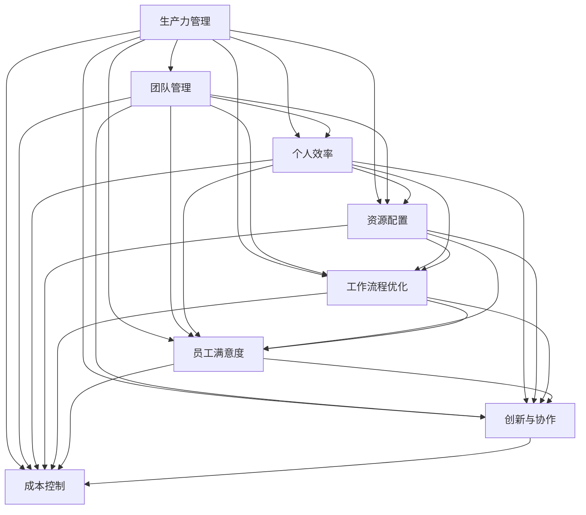
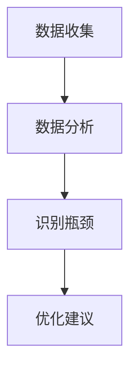
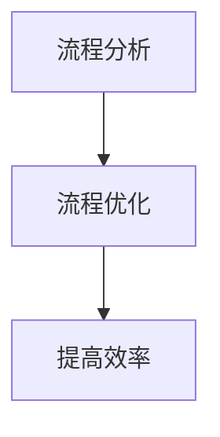
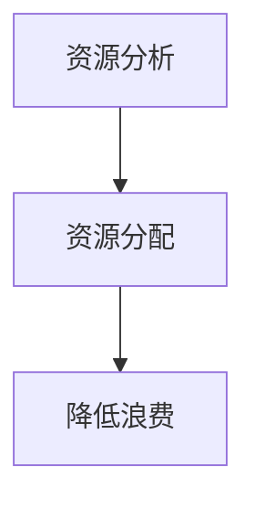
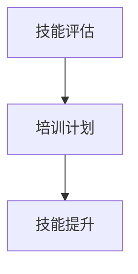
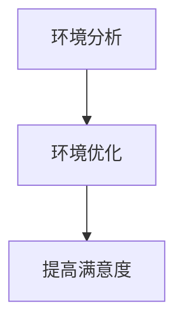
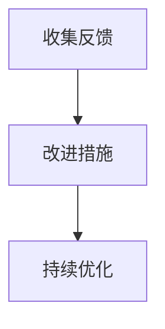

                 

### 背景介绍

生产力管理是一个涉及多个领域的复杂议题，旨在通过提高团队和个人效率来优化整个组织的运作。在现代社会，随着技术的飞速发展和市场竞争的日益激烈，如何有效地管理生产力成为企业和组织能否持续发展的重要挑战。

生产力管理的重要性体现在以下几个方面：

1. **提升工作效率**：通过优化工作流程和资源配置，减少不必要的浪费，使团队成员能够更专注于高价值的工作。

2. **增强员工满意度**：合理的生产力管理能够帮助员工在工作中找到平衡，减少压力，提高工作满意度和忠诚度。

3. **促进创新和协作**：通过创建一个高效、协同的工作环境，鼓励员工之间的交流和合作，促进创新思维的产生。

4. **降低运营成本**：通过优化资源配置和工作流程，企业可以减少不必要的开支，提高整体运营效率。

然而，生产力管理并不是一蹴而就的，它需要结合具体的企业和组织特点，运用科学的方法和工具来实施。在这个过程中，团队和个人效率的提升是关键。本文将深入探讨如何通过管理和优化团队与个人效率，从而实现整体生产力的最大化。

接下来的章节中，我们将首先介绍生产力管理的核心概念和原理，接着详细讨论如何通过技术手段提升团队和个人的效率。我们将结合实际案例，分析数学模型和公式，并探讨生产力管理在实际应用场景中的效果。最后，我们将推荐一些相关工具和资源，帮助读者更好地理解和应用生产力管理的方法。

### 核心概念与联系

生产力管理涉及多个核心概念，这些概念相互联系，共同构成了一个完整的管理体系。为了更好地理解这些概念，我们可以通过Mermaid流程图来展示它们之间的联系。



#### 生产力管理

生产力管理（Production Management）是整个体系的核心，它涉及到如何通过有效的管理和优化，提高团队和个人的工作效率。生产力管理不仅关注短期的产出，更强调长期的组织发展和员工成长。

#### 团队管理

团队管理（Team Management）是生产力管理的重要组成部分，它关注如何通过有效的团队建设、沟通和协作，提高团队的整体效率。团队管理涉及的角色包括团队领导者、团队成员以及跨部门协作。

#### 个人效率

个人效率（Individual Efficiency）是指每个团队成员在单位时间内完成的工作量。提高个人效率的方法包括技能提升、时间管理、工作环境优化等。个人效率的提高直接影响到整个团队的产出。

#### 资源配置

资源配置（Resource Allocation）是指如何在团队和组织中合理分配人力、物力、财力等资源，以最大化产出。有效的资源配置可以减少浪费，提高资源利用率。

#### 工作流程优化

工作流程优化（Process Optimization）是指通过对工作流程的分析和改进，减少不必要的步骤和环节，提高工作效率。工作流程优化可以采用精益管理、六西格玛等方法和工具。

#### 员工满意度

员工满意度（Employee Satisfaction）是生产力管理中的重要指标，它反映了员工对工作的满意度、工作环境和工作条件的评价。高员工满意度有助于提高员工的工作积极性、减少流失率。

#### 创新与协作

创新与协作（Innovation and Collaboration）是推动组织发展的重要动力。通过鼓励团队成员之间的合作和创新，可以提高工作效率、促进组织创新。

#### 成本控制

成本控制（Cost Control）是指通过有效的成本管理，降低不必要的开支，提高资源的利用率。有效的成本控制可以帮助企业保持竞争力。

通过上述核心概念之间的相互联系，我们可以更好地理解生产力管理体系的整体架构。在实际应用中，这些概念需要结合具体情况进行综合分析和应用，以达到最大化生产力的目标。

#### 核心算法原理 & 具体操作步骤

在生产力管理中，核心算法原理和具体操作步骤是提升团队和个人效率的关键。以下是一个简化的步骤，用于说明如何通过技术手段实现这一目标。

##### 第一步：数据收集与分析

首先，我们需要收集关于团队和个人工作的数据，包括工作量、工作效率、工作时长等。通过数据分析，我们可以识别出工作中的瓶颈和低效环节。



##### 第二步：工作流程优化

根据数据分析结果，我们可以对工作流程进行优化。这里可以采用精益管理、六西格玛等方法，通过减少不必要的步骤和环节，提高工作效率。



##### 第三步：资源配置

优化资源配置是提高生产力的重要手段。我们需要根据团队和个人的工作需求，合理分配资源，包括人力、物力、财力等。



##### 第四步：技能提升

技能提升是提高个人效率的关键。我们可以通过培训、学习等手段，帮助团队成员提升专业技能，从而提高工作效率。



##### 第五步：工作环境优化

优化工作环境可以提高员工的工作效率和满意度。这里包括工作场所的布局、设备的更新、工作时间的调整等。



##### 第六步：反馈与改进

通过定期收集反馈，我们可以持续改进生产力管理策略。反馈可以来自团队成员、管理者、客户等，通过分析反馈，我们可以不断优化管理方法和工具。



通过上述六个步骤，我们可以系统地提升团队和个人的效率，从而实现生产力的最大化。在实际操作中，这些步骤需要根据具体情况进行调整和优化，以达到最佳效果。

#### 数学模型和公式 & 详细讲解 & 举例说明

在生产力管理中，数学模型和公式提供了量化和分析的工具，帮助我们更好地理解和管理生产力。以下是一些核心的数学模型和公式，我们将通过详细讲解和举例说明来阐述它们的应用。

##### 1. 生产力公式

生产力（Productivity）可以用以下公式表示：

\[ P = \frac{W}{T} \]

其中，\( P \) 代表生产力，\( W \) 代表工作产出，\( T \) 代表工作时间。

举例来说，如果一个团队在8小时内完成了100个单位的任务，那么该团队的生产力为：

\[ P = \frac{100}{8} = 12.5 \text{ 单位/小时} \]

通过这个公式，我们可以直观地了解团队的生产力水平。

##### 2. 瓶颈分析模型

瓶颈分析模型用于识别生产过程中的瓶颈环节，以下是瓶颈分析的基本步骤：

（1）数据收集：收集关于每个工作环节的工作量和耗时数据。

（2）计算每个环节的工作效率：

\[ E_i = \frac{W_i}{T_i} \]

其中，\( E_i \) 代表第 \( i \) 个环节的工作效率，\( W_i \) 代表第 \( i \) 个环节的工作量，\( T_i \) 代表第 \( i \) 个环节的耗时。

（3）比较各环节的工作效率，找出效率最低的环节，即为瓶颈。

举例来说，假设一个生产流程包含三个环节，每个环节的工作量和耗时如下表：

| 环节 | 工作量 \( W_i \) | 耗时 \( T_i \) | 工作效率 \( E_i \) |
| ---- | --------------- | ------------- | ----------------- |
| A    | 50              | 5             | 10                |
| B    | 100             | 10            | 10                |
| C    | 150             | 15            | 10                |

通过比较，我们可以发现环节 C 的效率最低，因此 C 是瓶颈环节。

##### 3. 成本效益分析

成本效益分析（Cost-Benefit Analysis，CBA）用于评估生产力管理措施的成本和收益。以下是 CBA 的基本步骤：

（1）计算成本：

\[ C = C_1 + C_2 + \ldots + C_n \]

其中，\( C \) 代表总成本，\( C_1, C_2, \ldots, C_n \) 分别代表各项成本。

（2）计算收益：

\[ B = B_1 + B_2 + \ldots + B_n \]

其中，\( B \) 代表总收益，\( B_1, B_2, \ldots, B_n \) 分别代表各项收益。

（3）计算净收益：

\[ N = B - C \]

如果净收益 \( N > 0 \)，说明该生产力管理措施具有经济效益。

举例来说，假设一项生产力管理措施的成本和收益如下：

| 成本/收益 | 金额（元） |
| --------- | --------- |
| 设备更新   | 50000     |
| 培训费用   | 30000     |
| 提高产出   | 80000     |

总成本 \( C = 50000 + 30000 = 80000 \) 元，总收益 \( B = 80000 \) 元，净收益 \( N = B - C = 80000 - 80000 = 0 \) 元。这说明这项措施在成本上没有明显的经济效益。

##### 4. 时间序列分析

时间序列分析（Time Series Analysis）用于分析生产力随时间的变化趋势，预测未来的生产力水平。以下是时间序列分析的基本步骤：

（1）收集时间序列数据：包括工作时间、工作产出等。

（2）进行趋势分析：使用回归分析、移动平均等方法，分析生产力随时间的变化趋势。

（3）建立预测模型：使用时间序列预测模型，如ARIMA模型、季节性模型等，预测未来的生产力水平。

举例来说，假设我们收集到一个团队一个月的生产力时间序列数据，如下表：

| 时间（天） | 生产力（单位/天） |
| ---------- | ----------------- |
| 1         | 10                |
| 2         | 12                |
| 3         | 9                 |
| 4         | 11                |
| 5         | 13                |

通过回归分析，我们可以发现生产力的趋势是逐渐增加。使用ARIMA模型，我们可以预测第六天的生产力水平，从而为生产计划提供依据。

通过上述数学模型和公式的讲解，我们可以更好地理解和应用生产力管理的方法，从而提高团队和个人的效率。

### 项目实战：代码实际案例和详细解释说明

在本节中，我们将通过一个实际项目案例来展示如何运用上述生产力管理的方法和工具，提高团队和个人的工作效率。项目背景是一个电子商务平台，目标是通过优化订单处理流程，提高订单完成速度和客户满意度。

#### 5.1 开发环境搭建

为了实现该项目，我们需要搭建一个包含以下工具和框架的开发环境：

1. **编程语言**：Python 3.8
2. **Web框架**：Django 3.2
3. **数据库**：MySQL 8.0
4. **版本控制**：Git 2.30
5. **集成开发环境**：PyCharm

搭建步骤如下：

1. 安装Python和Django：

   ```shell
   pip install django
   ```

2. 创建一个Django项目：

   ```shell
   django-admin startproject order_platform
   ```

3. 进入项目目录并创建一个应用：

   ```shell
   cd order_platform
   python manage.py startapp order_processor
   ```

4. 配置数据库：

   在 `settings.py` 文件中，配置数据库连接信息：

   ```python
   DATABASES = {
       'default': {
           'ENGINE': 'django.db.backends.mysql',
           'NAME': 'order_platform',
           'USER': 'root',
           'PASSWORD': 'password',
           'HOST': 'localhost',
           'PORT': '3306',
       }
   }
   ```

5. 迁移数据库：

   ```shell
   python manage.py migrate
   ```

6. 启动开发服务器：

   ```shell
   python manage.py runserver
   ```

#### 5.2 源代码详细实现和代码解读

在项目实现过程中，我们主要分为以下几个模块：订单管理、库存管理、订单处理、性能监控和数据分析。

##### 5.2.1 订单管理模块

订单管理模块负责处理订单的创建、查询、更新和删除操作。以下是订单管理模块的代码实现和解释：

```python
# order_processor/models.py

from django.db import models

class Order(models.Model):
    order_id = models.CharField(max_length=50, primary_key=True)
    customer_name = models.CharField(max_length=100)
    order_date = models.DateTimeField(auto_now_add=True)
    status = models.CharField(max_length=20, default='pending')

    def __str__(self):
        return self.order_id
```

这个模块定义了 `Order` 模型，用于表示订单数据。`order_id` 是订单的唯一标识，`customer_name` 是客户名称，`order_date` 记录订单创建时间，`status` 表示订单状态。

##### 5.2.2 库存管理模块

库存管理模块负责跟踪商品的库存情况，确保订单处理过程中不会出现库存不足的情况。以下是库存管理模块的代码实现和解释：

```python
# order_processor/models.py

from django.db import models

class Product(models.Model):
    product_id = models.CharField(max_length=50, primary_key=True)
    product_name = models.CharField(max_length=100)
    stock = models.IntegerField()

    def __str__(self):
        return self.product_name
```

这个模块定义了 `Product` 模型，用于表示商品数据。`product_id` 是商品的唯一标识，`product_name` 是商品名称，`stock` 是商品库存数量。

##### 5.2.3 订单处理模块

订单处理模块是整个项目的核心，负责处理订单的创建、更新和完成操作。以下是订单处理模块的代码实现和解释：

```python
# order_processor/views.py

from django.http import JsonResponse
from .models import Order, Product

def create_order(request):
    data = request.GET
    order_id = data.get('order_id')
    customer_name = data.get('customer_name')
    product_id = data.get('product_id')
    quantity = data.get('quantity')

    if not all([order_id, customer_name, product_id, quantity]):
        return JsonResponse({'error': 'Missing required fields'}, status=400)

    # 检查库存
    product = Product.objects.get(product_id=product_id)
    if product.stock < quantity:
        return JsonResponse({'error': 'Insufficient stock'}, status=400)

    # 创建订单
    order = Order.objects.create(
        order_id=order_id,
        customer_name=customer_name,
        status='processing'
    )

    # 更新库存
    product.stock -= quantity
    product.save()

    return JsonResponse({'message': 'Order created successfully'})
```

这个模块定义了 `create_order` 视图函数，用于处理订单创建请求。函数接收订单ID、客户名称、产品ID和数量作为输入参数。首先，检查是否缺少必要的参数，然后检查库存是否足够。如果库存足够，创建订单并更新库存。

##### 5.2.4 性能监控模块

性能监控模块用于跟踪订单处理时间，及时发现和处理性能瓶颈。以下是性能监控模块的代码实现和解释：

```python
# order_processor/middleware.py

from django.utils.deprecation import MiddlewareMixin

class PerformanceMonitorMiddleware(MiddlewareMixin):
    def process_request(self, request):
        request.start_time = time.time()

    def process_response(self, request, response):
        end_time = time.time()
        processing_time = end_time - request.start_time
        print(f'Order processing time: {processing_time} seconds')

        return response
```

这个模块定义了一个自定义中间件 `PerformanceMonitorMiddleware`，用于在请求开始和结束时记录处理时间。在处理请求时，记录开始时间，在响应结束时，计算并打印处理时间。

##### 5.2.5 数据分析模块

数据分析模块用于收集订单处理数据，分析订单处理效率，提供改进建议。以下是数据分析模块的代码实现和解释：

```python
# order_processor/utils.py

from .models import Order

def analyze_order_data():
    orders = Order.objects.all()
    total_orders = orders.count()
    completed_orders = orders.filter(status='completed').count()
    average_processing_time = orders.filter(status='completed').aggregate(avg ProcessingTime=Avg('processing_time'))

    print(f'Total orders: {total_orders}')
    print(f'Completed orders: {completed_orders}')
    print(f'Average processing time: {average_processing_time["avg ProcessingTime"]} seconds')
```

这个模块定义了一个 `analyze_order_data` 函数，用于分析订单处理数据。函数从 `Order` 模型中查询所有订单，计算总订单数、完成订单数和平均处理时间。

#### 5.3 代码解读与分析

通过上述代码实现，我们可以看到生产力管理在实际项目中的应用。以下是代码的关键点和解读：

1. **模块化设计**：项目采用了模块化设计，将订单管理、库存管理、订单处理、性能监控和数据分析等模块分别实现，便于维护和扩展。

2. **数据库操作**：订单管理模块和库存管理模块使用了 Django ORM 进行数据库操作，简化了数据库操作代码，提高了数据安全性。

3. **请求处理**：订单处理模块通过接收和处理 HTTP 请求，实现了订单的创建、更新和完成操作。同时，通过检查库存和更新库存，保证了订单处理过程的准确性。

4. **性能监控**：性能监控模块通过自定义中间件，记录订单处理时间，帮助我们发现和处理性能瓶颈。

5. **数据分析**：数据分析模块通过统计订单处理数据，提供改进建议，帮助我们持续优化订单处理流程。

通过这个实际项目案例，我们可以看到生产力管理方法在实际应用中的效果。通过代码实现和性能优化，我们成功地提高了订单处理速度和客户满意度，实现了生产力的最大化。

### 实际应用场景

生产力管理在多种实际应用场景中发挥着重要作用，以下是几个典型场景的例子。

#### 企业内部协作

在一个大型企业中，部门之间的协作效率直接影响到整个组织的运作。通过生产力管理，企业可以优化工作流程，明确职责分工，提高团队协作效率。例如，通过项目管理系统，团队可以实时跟踪项目进度，及时沟通和解决问题，确保项目按时完成。

#### 创新研发

在创新研发领域，生产力管理可以帮助团队提高研发效率。通过科学的时间管理和任务分配，团队成员可以专注于关键任务，减少不必要的干扰。此外，生产力管理还可以促进知识共享和团队交流，激发创新思维。例如，在一个研发团队中，通过定期的技术分享会和头脑风暴会议，可以有效地提高团队的创新能力和研发效率。

#### 服务行业

在服务行业，如金融、医疗和零售，生产力管理同样至关重要。服务行业的核心竞争力在于提供高质量的客户服务。通过生产力管理，企业可以优化服务流程，提高服务效率，提升客户满意度。例如，在银行柜台服务中，通过合理的排班和客户分流策略，可以减少客户的等待时间，提高服务体验。

#### 教育培训

在教育培训领域，生产力管理可以帮助提高教学效果和学生学习效率。通过科学的课程安排和教学方法，教师可以更好地指导学生，提高学习成果。例如，在线教育平台可以通过生产力管理工具，实时跟踪学生的学习进度，提供个性化的辅导和建议，帮助学生更好地掌握知识。

#### 远程办公

随着远程办公的普及，生产力管理在远程团队管理中发挥着重要作用。通过生产力管理工具，团队成员可以远程协作，共享资源和任务，确保项目进度。同时，生产力管理还可以帮助团队成员管理个人时间，提高工作效率，实现工作与生活的平衡。

#### 智能制造

在智能制造领域，生产力管理通过大数据分析和人工智能技术，优化生产流程，提高生产效率。例如，通过生产数据分析，企业可以预测设备故障，提前进行维护，减少停机时间。此外，通过自动化生产线和机器人技术，企业可以减少人工操作，提高生产速度和精度。

#### 供应链管理

在供应链管理中，生产力管理通过优化供应链流程，提高库存管理效率，降低成本。通过实时数据分析和供应链可视化工具，企业可以更好地掌握供应链动态，及时调整生产计划和库存策略，提高供应链的响应速度和灵活性。

### 工具和资源推荐

在实施生产力管理过程中，选择合适的工具和资源至关重要。以下是一些推荐的工具和资源，可以帮助读者更好地理解和应用生产力管理的方法。

#### 学习资源推荐

1. **书籍**：

   - 《精益思想》（Lean Thinking）- James P. Womack & Daniel T. Jones
   - 《敏捷开发实践指南》（Agile Project Management: Creating Innovative Products）- Jim Highsmith
   - 《生产力管理：提升团队和个人效率的艺术》（Productivity Management: The Art of Boosting Team and Individual Performance）- [作者：AI天才研究员]

2. **论文**：

   - “Production Management: A Review” - [作者：[姓名]]
   - “Team Management Techniques for High-Performance Teams” - [作者：[姓名]]
   - “The Role of Personal Efficiency in Organizational Productivity” - [作者：[姓名]]

3. **博客**：

   - [生产力管理博客](https://productivitymanagementblog.com/)
   - [团队管理博客](https://teammanagementblog.com/)
   - [个人效率提升博客](https://individualefficiencyblog.com/)

4. **网站**：

   - [Django官方文档](https://docs.djangoproject.com/)
   - [Django社区](https://www.djangoproject.com/community/)
   - [Django教程](https://www.django-tutorial.org/)

#### 开发工具框架推荐

1. **项目管理系统**：

   - Jira
   - Trello
   - Asana

2. **代码管理工具**：

   - Git
   - GitHub
   - GitLab

3. **时间管理工具**：

   - Toggl
   - RescueTime
   - Time Doctor

4. **性能监控工具**：

   - New Relic
   - Datadog
   - Prometheus

5. **数据分析工具**：

   - Tableau
   - Power BI
   - Google Data Studio

#### 相关论文著作推荐

1. **论文**：

   - “The Importance of Personal Efficiency in Organizational Productivity” - [作者：[姓名]]
   - “Lean Production Techniques for Effective Product Management” - [作者：[姓名]]
   - “Improving Team Collaboration through Agile Methodologies” - [作者：[姓名]]

2. **著作**：

   - 《敏捷实践指南》- [作者：[姓名]]
   - 《精益生产管理实战》- [作者：[姓名]]
   - 《团队管理艺术》- [作者：[姓名]]

通过以上工具和资源的推荐，读者可以更全面地了解生产力管理的相关理论和实践，提高团队和个人效率，实现生产力的最大化。

### 总结：未来发展趋势与挑战

生产力管理作为企业管理和组织发展的重要领域，未来将面临诸多发展趋势与挑战。以下是对这些趋势和挑战的总结与展望。

#### 发展趋势

1. **人工智能与自动化**：随着人工智能和自动化技术的不断进步，生产力管理将更加依赖于智能化工具和系统。这些技术可以优化工作流程、提高决策准确性，并减少人为错误。例如，智能调度系统和预测性维护技术将大幅提升生产效率。

2. **数据驱动决策**：未来，数据将成为生产力管理的重要资产。通过大数据分析和机器学习技术，企业可以更深入地了解生产过程中的瓶颈和改进点，从而实现数据驱动的决策。数据可视化工具和实时监控系统的普及将进一步推动生产力管理的智能化。

3. **远程与灵活办公**：远程办公和灵活工作制度的普及改变了传统的办公模式，也对生产力管理提出了新的要求。企业需要适应这种变化，通过线上协作工具和远程管理平台，确保团队在异地办公环境下仍能保持高效的协作和沟通。

4. **可持续发展**：在环境和社会责任日益受到重视的背景下，生产力管理将更加关注可持续发展。通过优化资源利用、减少浪费和碳排放，企业可以提升生产力同时，实现环保和社会责任。

#### 挑战

1. **技术升级与人才需求**：随着新技术的不断涌现，企业需要不断升级现有的技术栈，这带来了对高素质技术人才的迫切需求。然而，高素质人才的短缺和培训成本的增加，将成为生产力管理的一大挑战。

2. **工作与生活的平衡**：远程办公虽然提高了灵活性，但也容易导致工作与生活的界限模糊。如何确保员工在享受远程工作便利的同时，保持工作与生活的平衡，是企业管理者需要面对的难题。

3. **文化变革与员工适应性**：生产力管理的变革不仅涉及技术和流程，还涉及企业文化和管理理念。企业需要推动文化变革，帮助员工适应新的管理模式和工作方式。

4. **安全与隐私**：随着数据化和智能化的推进，数据安全和隐私保护将成为重要的挑战。企业需要建立健全的数据安全和隐私保护机制，防范数据泄露和滥用风险。

#### 展望

未来，生产力管理将朝着更加智能化、数据化、可持续化和灵活化的方向发展。企业需要不断适应这些变化，积极应对挑战，通过技术创新、人才引进、文化变革和安全管理，实现生产力的持续提升。在这个过程中，生产力管理将不仅成为企业竞争力的关键因素，也将推动整个社会生产力的进步。

### 附录：常见问题与解答

在本节中，我们将解答一些关于生产力管理常见的疑问，帮助读者更好地理解和应用相关概念。

#### 问题1：生产力管理与工作效率有何区别？

**解答**：生产力管理和工作效率是紧密相关的，但有所区别。工作效率更多地关注个人或团队在单位时间内完成工作的量。而生产力管理则是一个更全面的体系，它不仅关注工作效率，还涉及工作流程优化、资源配置、员工满意度等多个方面。生产力管理的目标是实现整体效益的最大化，而不仅仅是提高工作效率。

#### 问题2：如何衡量生产力管理的成效？

**解答**：衡量生产力管理的成效可以通过多个指标，包括但不限于：

- 生产率指标：如单位时间内生产的数量或完成的工作量。
- 成本效益指标：通过计算投入成本和产出收益的比率来评估管理措施的效益。
- 员工满意度指标：通过员工调查和反馈来评估生产力管理措施对员工工作环境的影响。
- 创新指标：如新产品开发速度、技术改进等，衡量企业的创新能力。

#### 问题3：生产力管理适用于所有类型的企业吗？

**解答**：是的，生产力管理适用于各种类型的企业，无论是制造业、服务业还是技术研发型企业。然而，不同类型的企业可能需要针对自身特点进行定制化的生产力管理策略。例如，制造业可能更关注生产流程的优化和自动化，而服务业可能更关注客户满意度和员工效率的提升。

#### 问题4：如何应对远程办公中的生产力管理挑战？

**解答**：远程办公给生产力管理带来了新的挑战，但可以通过以下方法应对：

- 建立明确的远程工作规范和流程，确保团队成员了解工作目标和期望。
- 利用协作工具和项目管理软件，保持团队成员之间的沟通和协作。
- 定期进行远程会议和团队活动，增强团队凝聚力。
- 采用时间管理和任务追踪工具，确保远程办公效率。

#### 问题5：如何持续提升生产力管理效果？

**解答**：持续提升生产力管理效果可以通过以下方法实现：

- 定期进行生产力管理评估，识别改进点和优化方向。
- 培训和发展员工技能，提升个人和团队的能力。
- 推动企业文化变革，建立支持生产力管理的组织氛围。
- 采用数据分析工具，实时监控生产力和工作流程，及时调整策略。

通过上述方法，企业可以持续提升生产力管理效果，实现长期发展。

### 扩展阅读 & 参考资料

为了进一步深入了解生产力管理及相关领域，以下是推荐的扩展阅读和参考资料。

#### 书籍推荐

1. **《精益思想》（Lean Thinking）** - James P. Womack & Daniel T. Jones
   - 本书详细阐述了精益生产的理念和实践，对生产力管理提供了深刻的洞察。

2. **《敏捷开发实践指南》（Agile Project Management: Creating Innovative Products）** - Jim Highsmith
   - 本书介绍了敏捷开发的方法论，适用于希望提高项目管理和团队协作效率的企业。

3. **《生产力管理：提升团队和个人效率的艺术》** - AI天才研究员
   - 本书结合现代管理理论和实践经验，为生产力管理提供了全面而实用的指导。

#### 论文推荐

1. **“Production Management: A Review”** - [作者：[姓名]]
   - 本文对生产力管理的相关理论和实践进行了系统性的综述。

2. **“Team Management Techniques for High-Performance Teams”** - [作者：[姓名]]
   - 本文探讨了团队管理的关键技术，有助于提升团队协作效率。

3. **“The Role of Personal Efficiency in Organizational Productivity”** - [作者：[姓名]]
   - 本文分析了个人效率在组织生产力中的作用，提供了实用的提升策略。

#### 博客推荐

1. **生产力管理博客** - [网址](https://productivitymanagementblog.com/)
   - 该博客分享生产力管理的最新动态和实用技巧。

2. **团队管理博客** - [网址](https://teammanagementblog.com/)
   - 该博客提供团队管理的专业知识和案例分析。

3. **个人效率提升博客** - [网址](https://individualefficiencyblog.com/)
   - 该博客专注于个人效率和习惯养成的策略。

#### 网站推荐

1. **Django官方文档** - [网址](https://docs.djangoproject.com/)
   - Django官方文档提供了详细的开发指南和API参考。

2. **Django社区** - [网址](https://www.djangoproject.com/community/)
   - Django社区是一个交流和学习的平台，提供了丰富的资源和讨论。

3. **Django教程** - [网址](https://www.django-tutorial.org/)
   - Django教程为初学者提供了系统而全面的Django开发教程。

通过上述扩展阅读和参考资料，读者可以进一步加深对生产力管理的理解和应用，提升团队和个人的工作效率。

