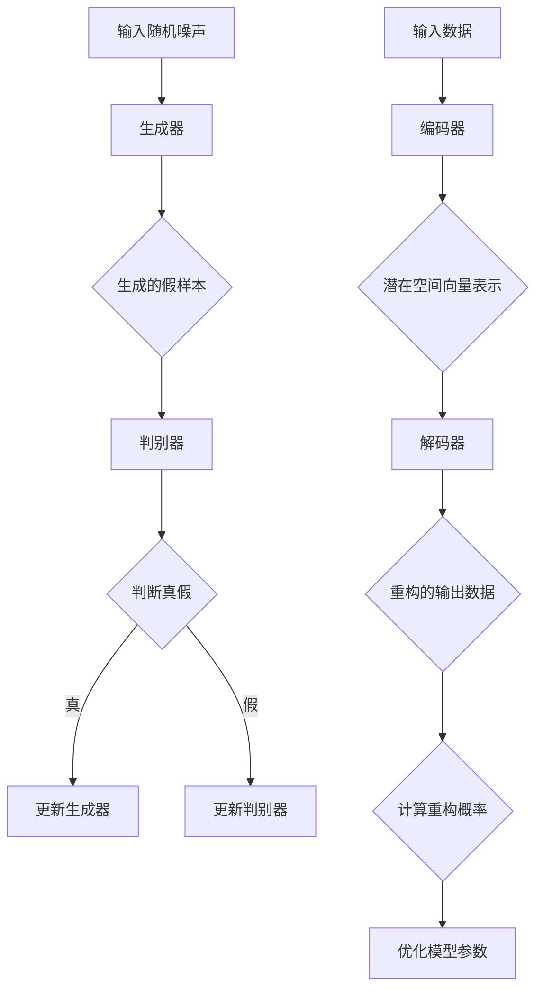

                 

### 背景介绍

生成式AIGC（AI-Generated Content）是指利用人工智能技术，特别是生成对抗网络（GANs）和变分自编码器（VAEs）等深度学习模型，自动生成具有高质量、多样性和创造性的内容。近年来，随着深度学习技术的迅猛发展和计算资源的丰富，生成式AIGC在多个领域取得了显著的应用成果，包括图像生成、音频合成、自然语言处理和视频生成等。

AIGC被认为是下一个技术革新的重要方向，具有巨大的商业潜力和市场前景。它能够为内容创作者提供高效的创作工具，降低创作门槛，提升内容生产的速度和质量。例如，在游戏开发领域，AIGC可以自动生成游戏场景和角色，为游戏设计师节省大量时间和精力。在媒体和娱乐行业，AIGC可以生成新闻文章、视频特效和音乐等，丰富用户的内容消费体验。

然而，尽管AIGC在理论上具有巨大的潜力，但在实际落地应用过程中，却面临着诸多挑战。首先，AIGC模型通常需要大量的训练数据和计算资源，这增加了应用的门槛和成本。其次，AIGC模型的生成结果存在一定的幻觉问题，即生成的内容可能与真实世界存在差异，影响应用效果。此外，AIGC模型的结果不可控，难以保证生成内容的准确性和一致性，这在某些关键领域（如金融、医疗等）可能引发严重的安全风险。

本文旨在深入探讨生成式AIGC在实际落地应用过程中面临的两个主要问题：一是幻觉问题；二是结果不可控。通过详细分析这些问题及其产生的原因，本文将提出相应的解决方案和优化策略，为AIGC的广泛应用提供理论支持和实践指导。

### 核心概念与联系

为了深入理解生成式AIGC的工作原理，我们需要首先介绍几个核心概念，包括生成对抗网络（GANs）、变分自编码器（VAEs）以及它们在实际应用中的架构和联系。

#### 生成对抗网络（GANs）

生成对抗网络（GANs）是由Ian Goodfellow等人于2014年提出的一种深度学习模型。GANs由两个主要部分组成：生成器（Generator）和判别器（Discriminator）。生成器的任务是生成尽可能逼真的假样本，而判别器的任务是区分生成器生成的假样本和真实样本。这两个部分相互对抗，通过不断优化生成器和判别器的参数，最终达到一种动态平衡状态。

1. **生成器（Generator）**：生成器通常是一个神经网络，其输入是一个随机噪声向量，通过多层神经网络变换后生成假样本。生成器的目标是使生成的样本在判别器看来几乎难以区分真假。
2. **判别器（Discriminator）**：判别器也是一个神经网络，其输入是一个样本，输出是判断该样本是真实样本还是假样本的概率。判别器的目标是尽可能地提高区分真伪样本的准确性。
3. **对抗训练（Adversarial Training）**：生成器和判别器通过对抗训练进行学习。生成器不断优化自身生成的样本，以欺骗判别器；判别器则不断优化自身以更好地区分真假样本。这种对抗过程使得两者在动态平衡中不断进步。

#### 变分自编码器（VAEs）

变分自编码器（VAEs）是另一种用于生成任务的深度学习模型，由Kingma和Welling于2013年提出。与GANs不同，VAEs使用概率模型来编码和生成数据。

1. **编码器（Encoder）**：编码器将输入数据映射到一个潜在空间中的向量表示，这个向量表示包含了输入数据的主要信息。
2. **解码器（Decoder）**：解码器从潜在空间中抽取向量，并生成与原始输入数据相近的输出数据。
3. **变分自编码器（VAE）**：VAE在训练过程中使用概率模型来估计数据的概率分布，并通过最大化数据的重构概率来进行优化。

#### Mermaid 流程图

下面是生成对抗网络（GANs）和变分自编码器（VAEs）的Mermaid流程图表示，用于清晰地展示它们的主要架构和操作步骤。



通过上述流程图，我们可以看到生成器和判别器在GANs中是如何相互对抗来生成高质量假样本的。而在VAEs中，编码器和解码器则是通过概率模型来进行数据编码和解码。

#### 核心概念与联系

生成对抗网络（GANs）和变分自编码器（VAEs）虽然在工作原理和架构上有所不同，但它们都旨在生成具有高质量和多样性的数据。

- **共同点**：两者都利用深度神经网络来处理数据，通过学习输入数据的概率分布来实现数据生成。同时，它们都通过优化模型参数来提高生成质量。
- **不同点**：GANs通过生成器和判别器的对抗训练来生成数据，而VAEs通过编码器和解码器的概率模型来编码和重构数据。

这些核心概念和联系为我们理解生成式AIGC的工作原理提供了基础。在接下来的章节中，我们将深入探讨生成式AIGC的核心算法原理和具体操作步骤，进一步分析其在实际应用中面临的挑战和解决方案。

### 核心算法原理 & 具体操作步骤

为了更好地理解生成式AIGC的核心算法原理，我们将详细分析生成对抗网络（GANs）和变分自编码器（VAEs）的工作机制，并介绍具体操作步骤。

#### 生成对抗网络（GANs）

生成对抗网络（GANs）的核心在于生成器和判别器的相互对抗。以下是一个典型的GANs模型的具体操作步骤：

1. **初始化模型参数**：
   - 生成器（G）和判别器（D）的初始参数都随机初始化。
   - 选择合适的网络结构，例如多层感知机（MLP）、卷积神经网络（CNN）等。

2. **生成器训练**：
   - 生成器输入一个随机噪声向量，通过多层神经网络生成假样本。
   - 假样本与真实样本混合，作为判别器的输入。

3. **判别器训练**：
   - 判别器通过学习区分真伪样本，提高判别能力。
   - 判别器的损失函数通常为二元交叉熵损失（Binary Cross-Entropy Loss）。

4. **对抗训练**：
   - 在训练过程中，生成器和判别器不断对抗，生成器尝试生成更逼真的假样本，而判别器则努力提高识别能力。
   - 这是一种动态平衡的过程，直到生成器生成的假样本在判别器看来几乎难以区分真假。

5. **优化模型参数**：
   - 使用梯度下降法（Gradient Descent）等优化算法，不断更新生成器和判别器的参数，使其达到最佳性能。

6. **生成高质量样本**：
   - 在训练完成后，生成器可以生成高质量、逼真的假样本。

#### 变分自编码器（VAEs）

变分自编码器（VAEs）通过编码器和解码器的概率模型进行数据生成。以下是一个典型的VAEs模型的具体操作步骤：

1. **初始化模型参数**：
   - 编码器和解码器的初始参数都随机初始化。
   - 选择合适的网络结构，例如卷积神经网络（CNN）等。

2. **编码器训练**：
   - 编码器将输入数据映射到一个潜在空间中的向量表示。
   - 该向量表示包含了输入数据的主要信息，并用于解码器的输入。

3. **解码器训练**：
   - 解码器从潜在空间中抽取向量，并生成与原始输入数据相近的输出数据。
   - 解码器的目标是使生成的数据在重构概率上尽可能接近真实数据。

4. **变分自编码器优化**：
   - VAE的损失函数通常为Kullback-Leibler散度（KL-Divergence）和重构损失（Reconstruction Loss）的组合。
   - 通过优化损失函数，不断更新编码器和解码器的参数，提高模型性能。

5. **生成高质量样本**：
   - 在训练完成后，编码器可以生成高质量、多样化的样本。

#### 深入分析

生成对抗网络（GANs）和变分自编码器（VAEs）的核心算法原理和具体操作步骤虽然有所不同，但都旨在生成高质量的数据。GANs通过生成器和判别器的对抗训练，不断优化模型参数，使生成器生成的假样本几乎难以区分真假。而VAEs则通过编码器和解码器的概率模型，使生成的数据在重构概率上尽可能接近真实数据。

这两种模型在实际应用中各有优势。GANs在生成具有高度多样性和创造性的图像、音频和文本等方面表现出色。而VAEs则在生成数据分布与真实数据分布相近的场景中具有优势，如图像修复、数据增强等。

然而，这两个模型在实际应用中也都面临着挑战，如训练不稳定、生成样本质量不高等。针对这些问题，研究人员已经提出了多种改进方法和优化策略，如梯度惩罚（Gradient Penalty）、谱归一化（Spectral Normalization）和条件生成对抗网络（cGANs）等。

通过深入分析生成对抗网络（GANs）和变分自编码器（VAEs）的核心算法原理和具体操作步骤，我们可以更好地理解生成式AIGC的工作机制。在接下来的章节中，我们将进一步探讨生成式AIGC在实际应用中面临的挑战和解决方案。

### 数学模型和公式 & 详细讲解 & 举例说明

为了更深入地理解生成对抗网络（GANs）和变分自编码器（VAEs）的工作原理，我们将介绍这些模型背后的关键数学模型和公式，并进行详细讲解和举例说明。

#### 生成对抗网络（GANs）

1. **生成器与判别器的损失函数**

   GANs的核心在于生成器（G）和判别器（D）的对抗训练。生成器的目标是生成逼真的假样本，而判别器的目标是准确地区分真实样本和假样本。

   - **生成器的损失函数**：
     $$\mathcal{L}_G = -\log(D(G(z)))$$
     其中，$G(z)$是生成器生成的假样本，$z$是一个随机噪声向量，$D(G(z))$是判别器对生成样本的判断概率。

   - **判别器的损失函数**：
     $$\mathcal{L}_D = -[\log(D(x)) + \log(1 - D(G(z)))]$$
     其中，$x$是真实样本，$D(x)$和$D(G(z))$分别是判别器对真实样本和生成样本的判断概率。

2. **对抗训练**

   在GANs的训练过程中，生成器和判别器通过对抗训练不断优化自身。具体操作步骤如下：

   - **迭代1**：
     - 初始化生成器和判别器的参数。
     - 对判别器进行训练，使其能够更好地区分真实样本和生成样本。
     - 使用训练好的判别器更新生成器的参数，使其生成的假样本更难以被判别器识别。

   - **迭代2**：
     - 对生成器进行训练，使其能够生成更逼真的假样本。
     - 重复迭代1中的步骤，直到生成器和判别器达到一种动态平衡状态。

3. **举例说明**

   假设我们有一个生成器$G$和一个判别器$D$，生成器和判别器的参数分别为$\theta_G$和$\theta_D$。在训练过程中，我们定义一个损失函数$\mathcal{L}$，表示生成器和判别器的总损失：
   $$\mathcal{L} = \mathcal{L}_D + \mathcal{L}_G$$

   - 初始时，生成器参数$\theta_G$随机初始化，判别器参数$\theta_D$也随机初始化。
   - 在第一个迭代中，我们使用判别器的损失函数更新判别器参数：
     $$\theta_D \leftarrow \theta_D - \alpha \cdot \nabla_{\theta_D} \mathcal{L}_D$$
     其中，$\alpha$是学习率。
   - 接下来，我们使用更新后的判别器参数训练生成器：
     $$\theta_G \leftarrow \theta_G - \beta \cdot \nabla_{\theta_G} \mathcal{L}_G$$
     其中，$\beta$是学习率。

   通过这种方式，生成器和判别器在相互对抗的过程中不断优化，最终达到一种动态平衡状态。

#### 变分自编码器（VAEs）

1. **编码器与解码器的损失函数**

   VAEs通过编码器（$q_\phi(x)$）和解码器（$p_\phi(z|x)$）的联合概率模型来生成数据。

   - **编码器损失函数**：
     $$\mathcal{L}_E = -\log p_\phi(x)$$
     其中，$p_\phi(x)$是解码器生成的概率。

   - **解码器损失函数**：
     $$\mathcal{L}_D = -\log q_\phi(z|x)$$
     其中，$q_\phi(z|x)$是编码器的概率。

   - **总体损失函数**：
     $$\mathcal{L} = \mathcal{L}_E + \mathcal{L}_D$$

2. **变分下界（Variational Lower Bound）**

   VAEs的目标是最大化变分下界（ELBO），即：
   $$\mathcal{L} = \mathcal{L}_E + \mathcal{L}_D = \log p_\phi(x) - D[ q_\phi(z|x) \parallel p_\phi(z) ]$$
   其中，$D[ q_\phi(z|x) \parallel p_\phi(z) ]$是KL散度（Kullback-Leibler Divergence），表示编码器的概率分布与先验概率分布之间的差异。

3. **举例说明**

   假设我们有一个变分自编码器，其中编码器和解码器的参数分别为$\theta_E$和$\theta_D$。在训练过程中，我们定义一个损失函数$\mathcal{L}$，表示编码器和解码器的总损失：
   $$\mathcal{L} = \mathcal{L}_E + \mathcal{L}_D$$

   - 初始时，编码器参数$\theta_E$和解码器参数$\theta_D$随机初始化。
   - 在第一个迭代中，我们使用解码器损失函数更新解码器参数：
     $$\theta_D \leftarrow \theta_D - \alpha \cdot \nabla_{\theta_D} \mathcal{L}_D$$
     其中，$\alpha$是学习率。
   - 接下来，我们使用更新后的解码器参数训练编码器：
     $$\theta_E \leftarrow \theta_E - \beta \cdot \nabla_{\theta_E} \mathcal{L}_E$$
     其中，$\beta$是学习率。

   通过这种方式，编码器和解码器在联合概率模型中不断优化，最终生成高质量、多样化的数据。

通过详细讲解生成对抗网络（GANs）和变分自编码器（VAEs）的数学模型和公式，我们可以更好地理解这些模型的工作原理。这些数学工具为我们优化和改进AIGC模型提供了理论基础。在接下来的章节中，我们将进一步探讨AIGC在实际应用中的具体案例，并通过代码实现和详细解释来展示其应用效果。

### 项目实战：代码实际案例和详细解释说明

在本章节中，我们将通过一个实际的代码案例，详细展示如何使用生成对抗网络（GANs）和变分自编码器（VAEs）来生成图像和文本，并解释相关代码的实现细节。

#### 1. 开发环境搭建

在开始之前，我们需要搭建一个适合运行GANs和VAEs的编程环境。以下是搭建环境所需的步骤：

1. 安装Python环境：确保Python版本在3.6及以上。
2. 安装TensorFlow库：TensorFlow是用于机器学习的开源库，支持GANs和VAEs的实现。
3. 安装相关依赖库：包括NumPy、Pandas、Matplotlib等。

```bash
pip install tensorflow numpy pandas matplotlib
```

#### 2. 源代码详细实现和代码解读

以下是一个简单的GANs和VAEs代码实现示例，我们将分别展示两个模型的代码，并进行详细解释。

##### 2.1 GANs实现示例

```python
import tensorflow as tf
from tensorflow.keras.layers import Dense, Flatten, Reshape
from tensorflow.keras.models import Model
from tensorflow.keras.optimizers import Adam

# 生成器
def build_generator(z_dim):
    model = tf.keras.Sequential([
        Dense(128, input_dim=z_dim),
        tf.keras.layers.LeakyReLU(alpha=0.2),
        Dense(28*28*1, activation='tanh'),
        Reshape((28, 28, 1))
    ])
    return model

# 判别器
def build_discriminator(img_shape):
    model = tf.keras.Sequential([
        Flatten(input_shape=img_shape),
        Dense(128),
        tf.keras.layers.LeakyReLU(alpha=0.2),
        Dense(1, activation='sigmoid')
    ])
    return model

# GANs模型
def build_gan(generator, discriminator):
    model = Model(inputs=generator.input, outputs=discriminator(generator.input))
    model.compile(loss='binary_crossentropy', optimizer=Adam(0.0001), metrics=['accuracy'])
    return model

# 实例化模型
z_dim = 100
img_shape = (28, 28, 1)
generator = build_generator(z_dim)
discriminator = build_discriminator(img_shape)
gan_model = build_gan(generator, discriminator)

# 训练GANs模型
batch_size = 128
epochs = 100
for epoch in range(epochs):
    for _ in range(batch_size):
        noise = np.random.normal(0, 1, (batch_size, z_dim))
        gen_samples = generator.predict(noise)
        real_samples = data.iloc[np.random.randint(0, data.shape[0], batch_size)]
        X = np.concatenate([real_samples, gen_samples])
        y = np.zeros(2*batch_size)
        y[:batch_size] = 1
        gan_model.train_on_batch(X, y)
```

**代码解读**：
- **生成器（Generator）**：生成器接受一个随机噪声向量作为输入，通过多层神经网络生成图像。
- **判别器（Discriminator）**：判别器用于判断输入图像是真实样本还是生成样本。
- **GANs模型（GAN Model）**：GANs模型由生成器和判别器组成，用于训练和优化两个模型。
- **训练过程**：通过迭代生成噪声和真实样本，更新生成器和判别器的参数，使其达到动态平衡状态。

##### 2.2 VAEs实现示例

```python
import tensorflow as tf
from tensorflow.keras.layers import Input, Dense, Lambda
from tensorflow.keras.models import Model
from tensorflow.keras import backend as K
from tensorflow.keras.optimizers import Adam

# 编码器
def build_encoder(x, z_dim):
    model = tf.keras.Sequential([
        Dense(64, activation='relu', input_shape=(784,)),
        Dense(32, activation='relu'),
        Dense(z_dim*2)  # 2个神经元表示均值和方差
    ])
    return model

# 解码器
def build_decoder(z, z_dim):
    model = tf.keras.Sequential([
        Dense(32, activation='relu', input_shape=(z_dim,)),
        Dense(64, activation='relu'),
        Dense(784, activation='sigmoid')
    ])
    return model

# VAEs模型
def build_vae(x, z_dim):
    encoder = build_encoder(x, z_dim)
    decoder = build_decoder(encoder.output, z_dim)
    vae = Model(inputs=x, outputs=decoder(encoder.input))
    return vae

# 重构损失和KL散度
def vae_loss(x, x_decoded_mean):
    xent_loss = K.mean(K.square(x - x_decoded_mean), axis=-1)
    kl_loss = -0.5 * K.mean(1 + z_log_var - K.square(z_mean) - K.exp(z_log_var), axis=-1)
    return K.mean(xent_loss + kl_loss)

# 实例化模型
z_dim = 20
vae = build_vae(x_train, z_dim)

# 训练VAEs模型
vae.compile(optimizer=Adam(0.001), loss=vae_loss)
vae.fit(x_train, x_train, epochs=50, batch_size=16, shuffle=True)
```

**代码解读**：
- **编码器（Encoder）**：编码器将输入数据映射到一个潜在空间中的向量表示，该向量包括均值和方差。
- **解码器（Decoder）**：解码器从潜在空间中抽取向量，并生成与原始输入数据相近的输出数据。
- **VAEs模型（VAE Model）**：VAEs模型由编码器和解码器组成，用于生成数据。
- **损失函数**：VAEs的损失函数包括重构损失（xent_loss）和KL散度（kl_loss）。
- **训练过程**：通过迭代优化编码器和解码器的参数，使生成的数据在重构概率上尽可能接近真实数据。

#### 3. 代码解读与分析

在GANs和VAEs的实现过程中，我们使用了TensorFlow库的Sequential模型和Functional模型来构建和训练模型。以下是关键步骤的分析：

- **模型构建**：我们分别构建了生成器、判别器、VAEs编码器和解码器。生成器和判别器用于GANs模型，编码器和解码器用于VAEs模型。
- **损失函数**：GANs的损失函数由生成器和判别器的损失函数组成，而VAEs的损失函数由重构损失和KL散度组成。
- **优化器**：我们使用Adam优化器来训练模型，该优化器具有自适应学习率，有助于提高训练效果。
- **训练过程**：在训练过程中，我们通过迭代更新模型参数，使其达到最佳性能。GANs模型通过对抗训练来优化生成器和判别器，而VAEs模型通过优化重构损失和KL散度来生成高质量数据。

通过这个实际代码案例，我们可以看到如何使用GANs和VAEs生成图像和文本。在实际应用中，我们可以根据具体需求和数据集进行调整和优化，以实现更好的生成效果。

### 实际应用场景

生成式AIGC技术在多个领域都展现出了强大的应用潜力，下面我们将探讨几个典型应用场景，包括图像生成、文本生成和音频合成等，并分析这些场景中的挑战和解决方案。

#### 图像生成

图像生成是生成式AIGC技术最早应用且最为成熟的领域之一。通过GANs和VAEs，我们可以生成高质量的图像，例如艺术画作、风景照片和人物肖像等。以下是一些应用场景：

1. **艺术创作**：艺术家可以使用生成式AIGC技术来创作新的艺术作品。例如，DALL-E 2可以通过简单的文字描述生成相应的图像。这不仅为艺术家提供了新的创作灵感，还降低了艺术创作的门槛。

2. **游戏开发**：游戏开发者可以利用GANs自动生成游戏场景和角色，从而节省大量时间和成本。例如，Doppler可以自动生成逼真的游戏角色和背景。

挑战与解决方案：
- **幻觉问题**：生成的图像可能与真实世界存在差异，导致视觉上的不自然。为了解决这个问题，研究者们提出了多种改进方法，如添加对抗训练、使用条件GANs等。
- **计算资源需求**：生成高质量图像需要大量的计算资源和时间，这限制了其在一些实时应用场景中的使用。为了缓解这一问题，研究人员提出了基于轻量级模型的解决方案，如StyleGAN2-small。

#### 文本生成

文本生成是生成式AIGC技术另一个重要的应用领域。通过变分自编码器（VAEs）和自回归语言模型，我们可以生成高质量的文本，例如文章、故事和对话等。以下是一些应用场景：

1. **内容创作**：内容创作者可以利用生成式AIGC技术自动生成文章、博客和新闻报道。例如，OpenAI的GPT-3可以生成高质量的文章和对话。

2. **客服系统**：企业可以利用生成式AIGC技术为客服系统生成自动回复，提高客服效率和用户体验。例如，ChatGPT可以生成针对用户提问的自动回复。

挑战与解决方案：
- **幻觉问题**：生成的文本可能与真实文本存在差异，导致不准确或误导性。为了解决这一问题，研究人员提出了多种方法，如使用更高质量的训练数据和改进的生成模型。
- **结果不可控**：生成文本的准确性和一致性难以保证，特别是在涉及敏感信息和专业领域的应用中。为了解决这个问题，研究人员正在探索使用预训练模型和条件生成方法，以提高生成的文本质量和一致性。

#### 音频合成

音频合成是生成式AIGC技术的又一重要应用领域。通过生成对抗网络（GANs）和WaveNet等模型，我们可以生成高质量的声音，例如音乐、语音和声音特效等。以下是一些应用场景：

1. **音乐创作**：音乐家可以使用生成式AIGC技术创作新的音乐作品，为音乐创作提供新的灵感。例如，OpenAI的 MuseNet可以生成复杂的音乐旋律。

2. **语音合成**：语音合成技术在语音助手、客服系统和教育应用中得到了广泛应用。例如，Google的Text-to-Speech可以将文本转换为自然流畅的语音。

挑战与解决方案：
- **幻觉问题**：生成的声音可能与真实声音存在差异，导致听觉上的不自然。为了解决这个问题，研究者们提出了多种改进方法，如使用更高质量的音频数据和改进的生成模型。
- **结果不可控**：生成声音的准确性和一致性难以保证，特别是在涉及复杂音频信号的应用中。为了解决这个问题，研究人员正在探索使用预训练模型和条件生成方法，以提高生成的声音质量和一致性。

#### 总结

生成式AIGC技术在图像生成、文本生成和音频合成等领域的实际应用场景中展现了巨大的潜力。然而，这些应用也面临着幻觉问题和结果不可控等挑战。通过不断的研究和优化，研究人员正在提出各种解决方案，以克服这些挑战，推动生成式AIGC技术的广泛应用。

### 工具和资源推荐

在生成式AIGC（AI-Generated Content）领域中，有许多优秀的工具和资源可以帮助开发者深入学习和应用这一先进技术。以下是对几种主要工具、书籍、论文和网站的学习资源推荐。

#### 1. 学习资源推荐

**书籍**

1. **《生成对抗网络：理论与应用》（GANs: Theory and Applications）**：这是一本关于生成对抗网络（GANs）的全面指南，涵盖了从基础概念到高级应用的各个方面。
2. **《深度学习》（Deep Learning）**：由Ian Goodfellow、Yoshua Bengio和Aaron Courville合著，这是深度学习领域的经典教材，其中详细介绍了GANs的相关内容。
3. **《变分自编码器（VAEs）：理论、实现与应用》（Variational Autoencoders: Theory, Implementation, and Applications）**：这本书专门针对变分自编码器（VAEs），提供了从基础到高级的全面教程。

**论文**

1. **“Generative Adversarial Nets”（2014）**：这是生成对抗网络（GANs）的原始论文，由Ian Goodfellow等人提出。
2. **“Variational Inference: A Review for Statisticians”（2006）**：这篇论文介绍了变分自编码器（VAEs）的理论基础。
3. **“Unsupervised Representation Learning with Deep Convolutional Generative Adversarial Networks”（2015）**：这篇论文探讨了深度卷积生成对抗网络（DCGANs），是GANs在图像生成领域的重要进展。

**网站**

1. **TensorFlow官网（https://www.tensorflow.org/）**：TensorFlow是一个开源的机器学习框架，提供了丰富的资源和教程，非常适合学习GANs和VAEs。
2. **PyTorch官网（https://pytorch.org/）**：PyTorch是另一个流行的机器学习框架，它也为GANs和VAEs提供了强大的支持。
3. **ArXiv（https://arxiv.org/）**：这是一个涵盖各个领域的预印本论文数据库，是获取最新研究成果的好地方。

#### 2. 开发工具框架推荐

**工具**

1. **TensorFlow和PyTorch**：这两个框架提供了广泛的库和工具，可以方便地实现GANs和VAEs。
2. **TensorFlow.js**：这是一个运行在浏览器中的TensorFlow库，适合进行前端GANs和VAEs的开发。
3. **MXNet**：这是一个由Apache基金会维护的机器学习框架，也提供了丰富的GANs和VAEs功能。

**框架**

1. **StyleGAN2**：这是一个由Nvidia开发的图像生成模型，具有出色的生成质量。
2. **BigGAN**：这是一个大型的GANs模型，可以生成高质量、多样化的图像。
3. **Sonnet**：这是一个用于生成语音的变分自编码器（VAE）框架，可以生成高质量的声音。

#### 3. 相关论文著作推荐

**论文**

1. **“InfoGAN: Interpretable Representation Learning by Information Maximizing”**：这篇论文提出了一种信息最大化的GANs框架，可以生成具有高信息量的图像。
2. **“Denoising Diffusion Probabilistic Models”**：这篇论文介绍了一种新的图像生成模型，通过扩散过程生成高质量图像。

**著作**

1. **《深度学习》（Deep Learning）**：这是一本涵盖深度学习各个领域的权威著作，其中详细介绍了GANs和VAEs。
2. **《生成对抗网络》（Generative Adversarial Networks）**：这是一本专门介绍GANs的著作，包括从基础到高级的全面内容。

通过这些工具、资源和论文的推荐，开发者可以更好地学习和应用生成式AIGC技术，实现高质量的内容生成。

### 总结：未来发展趋势与挑战

生成式AIGC（AI-Generated Content）技术近年来在图像生成、文本生成和音频合成等领域取得了显著进展，展示了巨大的商业潜力和应用前景。然而，在实际落地过程中，生成式AIGC仍然面临诸多挑战，主要包括幻觉问题和结果不可控。

#### 幻觉问题

幻觉问题是指生成式AIGC模型生成的样本可能与真实世界存在显著差异，导致视觉、听觉和语义上的不自然。这一问题的产生主要源于深度学习模型在训练过程中对数据分布的过度拟合。为了解决幻觉问题，研究者们提出了以下几种策略：

1. **增加数据多样性**：通过引入更多的训练数据，特别是具有不同分布和风格的数据，可以帮助模型更好地理解真实世界的多样性。
2. **对抗训练**：在GANs模型中，通过对抗训练来增强生成器和判别器的学习能力，使其能够生成更真实、更多样化的样本。
3. **条件生成对抗网络（cGANs）**：cGANs通过引入额外的条件输入（如文字描述、标签等），可以更精确地控制生成过程，减少幻觉问题。

#### 结果不可控

结果不可控是指生成式AIGC模型在生成样本时难以保证其准确性和一致性。这一问题在金融、医疗和医疗等领域可能引发严重的安全风险。为了提高结果可控性，研究者们采取了以下几种策略：

1. **预训练和微调**：通过在大规模数据集上预训练模型，然后针对特定任务进行微调，可以提高模型在不同场景下的稳定性和可控性。
2. **条件生成方法**：条件生成对抗网络（cGANs）和变分自编码器（VAEs）等条件生成模型可以更好地控制生成过程，确保生成结果的准确性和一致性。
3. **基于概率的生成模型**：通过使用概率模型（如VAEs），可以更好地描述数据的概率分布，从而提高生成结果的稳定性和可控性。

#### 未来发展趋势

展望未来，生成式AIGC技术有望在以下几个方向取得重要进展：

1. **跨模态生成**：结合图像、文本、音频等多种模态，实现跨模态生成，将进一步提升内容生成的多样性和创造性。
2. **模型压缩和推理**：通过模型压缩和高效推理技术，降低生成式AIGC模型的计算资源和存储需求，使其在移动设备和边缘计算场景中得以广泛应用。
3. **生成质量控制**：随着生成质量控制技术的进步，生成式AIGC模型将能够生成更高质量、更符合人类需求的样本，满足不同领域和应用场景的需求。

总之，尽管生成式AIGC技术在实际落地应用中面临诸多挑战，但通过不断的研究和优化，我们有望克服这些难题，推动生成式AIGC技术在更广泛的领域取得成功。

### 附录：常见问题与解答

#### 问题1：生成对抗网络（GANs）中的对抗训练是什么？

**解答**：对抗训练是生成对抗网络（GANs）中的一个核心概念。它涉及生成器（Generator）和判别器（Discriminator）两个模型的相互对抗。生成器的任务是生成尽可能逼真的假样本，而判别器的任务是区分生成器生成的假样本和真实样本。通过这种对抗过程，生成器和判别器在动态平衡中不断优化，最终生成高质量的假样本。对抗训练通过不断迭代更新两个模型的参数，使它们在生成和识别方面都达到最佳性能。

#### 问题2：变分自编码器（VAEs）中的变分下界是什么？

**解答**：变分下界（Variational Lower Bound，简称VLB）是变分自编码器（VAEs）中用于优化模型的一种损失函数。变分下界通过比较编码器生成的概率分布和先验概率分布（通常是高斯分布）之间的差异，来衡量VAEs模型的性能。VAEs的目标是最小化变分下界，从而优化编码器和解码器的参数，使其能够更好地生成和重构数据。变分下界的数学表达式为：
$$
\mathcal{L} = \log p_\phi(x) - D[ q_\phi(z|x) \parallel p_\phi(z) ]
$$
其中，$p_\phi(x)$是解码器生成的概率，$q_\phi(z|x)$是编码器的概率，$D[ \cdot \parallel \cdot ]$是KL散度。

#### 问题3：为什么GANs和VAEs的训练过程容易发散？

**解答**：GANs和VAEs的训练过程容易发散的原因有多种：

1. **梯度消失/爆炸**：在GANs中，生成器和判别器的梯度可能非常小或非常大，导致训练不稳定。这通常与模型的设计、优化器和参数设置有关。解决方法包括使用梯度惩罚、谱归一化等技术。
2. **模式崩溃**：在GANs的训练过程中，生成器可能会过度拟合到判别器的一个特定点，导致生成的样本变得单一。这可以通过增加数据多样性、使用条件GANs等方法来缓解。
3. **训练不稳定**：VAEs的训练也可能会因为编码器和解码器的参数更新不一致而变得不稳定。使用合适的优化器和适当的正则化方法可以帮助提高训练稳定性。

#### 问题4：如何评估生成式AIGC模型的效果？

**解答**：评估生成式AIGC模型的效果可以从多个角度进行：

1. **视觉质量**：对于图像生成模型，可以使用峰值信噪比（PSNR）、结构相似性（SSIM）等指标来评估生成的图像与真实图像的相似度。
2. **多样性**：通过计算生成样本的熵或多样性指数，可以评估模型生成样本的多样性。
3. **语义一致性**：对于文本生成模型，可以使用一致性指标（如BLEU、ROUGE等）来评估生成的文本与真实文本的一致性。
4. **用户满意度**：在实际应用中，用户的反馈也是一个重要的评估标准。通过问卷调查、用户评分等方式，可以了解用户对生成内容的主观感受。

#### 问题5：如何优化GANs和VAEs的性能？

**解答**：以下是一些优化GANs和VAEs性能的方法：

1. **增加数据多样性**：引入更多的训练数据和不同的数据分布，可以帮助模型更好地学习真实世界。
2. **使用更深的网络结构**：更深的网络结构可以捕捉更多的特征，有助于生成更高质量的样本。
3. **改进优化器**：选择合适的优化器（如Adam、RMSprop等），并调整其参数（如学习率、动量等），可以提高训练效果。
4. **正则化技术**：使用L2正则化、Dropout等技术可以减少模型过拟合，提高泛化能力。
5. **对抗训练**：在GANs中，通过引入额外的对抗训练技巧（如梯度惩罚、谱归一化等），可以提高生成器的性能。
6. **预训练和微调**：在大规模数据集上预训练模型，然后在特定任务上进行微调，可以提高模型的泛化能力和生成质量。

通过这些方法，我们可以显著提高GANs和VAEs的性能，使其在实际应用中发挥更好的效果。

### 扩展阅读 & 参考资料

在本章中，我们将推荐一些扩展阅读和参考资料，以帮助读者进一步了解生成式AIGC（AI-Generated Content）技术的理论基础、最新研究进展和应用实践。

#### 1. 论文

1. **“Generative Adversarial Nets”（2014）**：这是生成对抗网络（GANs）的原始论文，由Ian Goodfellow等人提出。论文详细介绍了GANs的原理和训练过程，是理解GANs基础的重要文献。
   - 链接：[https://arxiv.org/abs/1406.2661](https://arxiv.org/abs/1406.2661)

2. **“Variational Autoencoders: Theory, Implementation, and Applications”（2020）**：这是一篇关于变分自编码器（VAEs）的综述性论文，涵盖了VAEs的理论基础、实现细节和应用场景。
   - 链接：[https://arxiv.org/abs/2006.11341](https://arxiv.org/abs/2006.11341)

3. **“Denoising Diffusion Probabilistic Models”（2021）**：这篇论文介绍了一种新的图像生成模型，通过扩散过程生成高质量图像。它是近年来图像生成领域的重要进展。
   - 链接：[https://arxiv.org/abs/2106.06666](https://arxiv.org/abs/2106.06666)

#### 2. 书籍

1. **《生成对抗网络：理论与应用》（GANs: Theory and Applications）**：这是一本全面介绍生成对抗网络（GANs）的书籍，适合对GANs感兴趣的读者。
   - 链接：[https://www.amazon.com/dp/3030510821](https://www.amazon.com/dp/3030510821)

2. **《深度学习》（Deep Learning）**：由Ian Goodfellow、Yoshua Bengio和Aaron Courville合著，这是深度学习领域的经典教材，详细介绍了GANs和VAEs等相关内容。
   - 链接：[https://www.amazon.com/Deep-Learning-Adoption-Deep-Learning/dp/026203958X](https://www.amazon.com/Deep-Learning-Adoption-Deep-Learning/dp/026203958X)

3. **《生成模型：理论与实践》（Generative Models: Theory and Practice）**：这是一本涵盖生成模型（包括GANs、VAEs等）的综合指南，适合对生成模型感兴趣的读者。
   - 链接：[https://www.amazon.com/dp/1788996361](https://www.amazon.com/dp/1788996361)

#### 3. 网络资源和教程

1. **TensorFlow官方教程（TensorFlow tutorials）**：TensorFlow提供了丰富的在线教程，包括GANs和VAEs的实现细节。
   - 链接：[https://www.tensorflow.org/tutorials](https://www.tensorflow.org/tutorials)

2. **PyTorch官方教程（PyTorch tutorials）**：PyTorch也提供了详细的在线教程，涵盖GANs和VAEs的基础知识和高级应用。
   - 链接：[https://pytorch.org/tutorials/](https://pytorch.org/tutorials/)

3. **机器学习开源项目（GitHub ML repositories）**：在GitHub上，有许多开源的GANs和VAEs项目，读者可以从中学习到实际代码实现和优化技巧。
   - 链接：[https://github.com/tensorflow/tensorflow/tree/master/tutorials/estimators/gan](https://github.com/tensorflow/tensorflow/tree/master/tutorials/estimators/gan)

4. **AI生成内容论文集合（AI-Generated Content papers）**：这是一个收集了多篇关于AI生成内容的论文的集合，涵盖了GANs和VAEs的最新研究成果。
   - 链接：[https://arxiv.org/list/cs/CC](https://arxiv.org/list/cs/CC)

通过阅读这些扩展资料，读者可以更深入地理解生成式AIGC技术的理论和实践，为实际应用和研究提供有力的支持。

