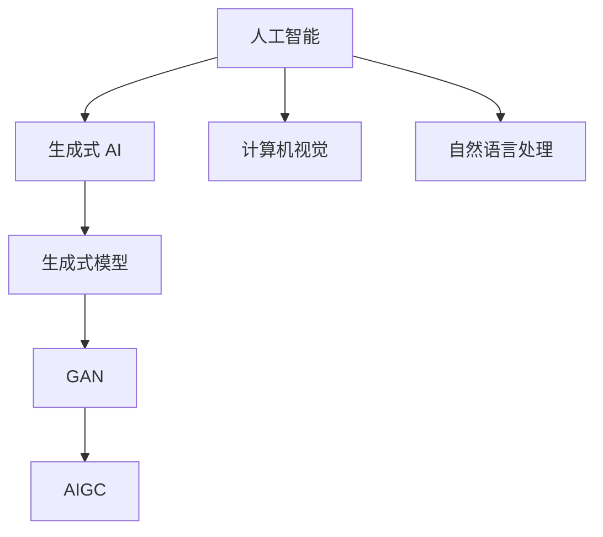

                 

## 1. 背景介绍

生成式 AI，即 Generative AI，是当前人工智能领域最前沿的研究方向之一。它旨在通过算法生成新的内容，如图像、文本、音频等，而不是仅仅识别或分类已有的数据。生成式 AI 的一个重要应用场景是 AIGC（AI-Generated Content），它代表了人工智能生成内容的新时代。

AIGC 技术的核心在于其能够根据用户的需求和提示，生成高质量的、个性化的内容。这不仅在创意产业中具有巨大的潜力，如游戏设计、电影制作、音乐创作等，还在广告、新闻、教育等多个领域展现出了广泛的应用前景。

本文旨在深入探讨生成式 AIGC 的概念、原理、应用，以及其从概念到现实的落地之路。我们将逐步分析生成式 AIGC 技术的发展历程、核心算法原理、数学模型、实战案例，以及未来的发展趋势和挑战。

通过本文的阅读，读者将能够：

1. 理解生成式 AIGC 的基本概念和原理。
2. 掌握生成式 AIGC 技术的核心算法和数学模型。
3. 了解生成式 AIGC 在实际应用场景中的具体实现方法。
4. 探讨生成式 AIGC 的未来发展趋势和面临的挑战。

## 2. 核心概念与联系

在深入探讨生成式 AIGC 之前，我们首先需要了解几个核心概念，这些概念是生成式 AIGC 技术发展的基石。

### 2.1 人工智能 (Artificial Intelligence, AI)

人工智能是指通过计算机程序模拟人类智能的领域。它包括机器学习、深度学习、自然语言处理、计算机视觉等多个子领域。人工智能的目标是使计算机能够执行通常需要人类智能才能完成的任务。

### 2.2 生成对抗网络 (Generative Adversarial Network, GAN)

生成对抗网络是由 Ian Goodfellow 等人于 2014 年提出的一种新型神经网络架构。它由两个神经网络组成：生成器（Generator）和判别器（Discriminator）。生成器的任务是生成与真实数据几乎无法区分的假数据，而判别器的任务是区分真实数据和假数据。这两个网络相互对抗，从而不断提高生成器的生成能力。

### 2.3 生成式模型 (Generative Model)

生成式模型是一类用于生成数据的机器学习模型，包括马尔可夫模型、变分自编码器（VAE）、生成式对抗网络（GAN）等。这些模型通过学习数据分布来生成新的数据。

### 2.4 生成式 AI (Generative AI)

生成式 AI 是指能够根据输入数据或提示生成新数据的人工智能系统。生成式 AI 的核心是生成式模型，它能够生成文本、图像、音频等不同类型的数据。

### 2.5 AIGC（AI-Generated Content）

AIGC 是指利用人工智能技术生成内容的技术，包括文本、图像、音频、视频等多种类型。AIGC 的目标是生成高质量、个性化、多样化的内容，满足不同用户的需求。

### 2.6 Mermaid 流程图

Mermaid 是一种基于 Markdown 的绘图工具，它能够生成结构化的流程图、时序图、Gantt 图等。以下是一个 Mermaid 流程图的示例，用于描述生成式 AIGC 的核心概念和联系：



通过上述流程图，我们可以清晰地看到生成式 AIGC 与人工智能、生成式模型、生成对抗网络等核心概念之间的联系。

## 3. 核心算法原理 & 具体操作步骤

生成式 AIGC 的核心算法是生成对抗网络（GAN），下面我们将详细阐述 GAN 的原理及其具体操作步骤。

### 3.1 GAN 的原理

生成对抗网络（GAN）由两部分组成：生成器（Generator）和判别器（Discriminator）。生成器的任务是生成看起来真实的数据，而判别器的任务是区分真实数据和生成数据。

GAN 的训练过程可以看作是一个博弈过程，其中生成器和判别器相互对抗。生成器的目标是生成足够逼真的数据，以至于判别器无法区分这些数据是否为真实数据。而判别器的目标是不断提高自己的判断能力，以区分真实数据和生成数据。

GAN 的训练过程可以分为以下几个步骤：

1. **初始化生成器和判别器**：生成器和判别器通常都是深度神经网络，它们需要通过大量数据进行训练。初始化时，生成器的参数可以随机初始化，而判别器的参数可以基于真实数据初始化。

2. **生成假数据**：生成器接收随机噪声作为输入，通过神经网络生成假数据。

3. **判断假数据**：判别器接收真实数据和生成数据作为输入，通过神经网络输出一个概率值，表示输入数据的真实度。

4. **更新生成器和判别器**：生成器的目标是提高生成数据的真实度，因此需要根据判别器的输出反向传播更新生成器的参数。判别器的目标是提高判断能力，因此也需要根据真实数据和生成数据的差异更新判别器的参数。

5. **重复训练**：重复上述步骤，直到生成器生成的数据足够逼真，以至于判别器无法区分这些数据是否为真实数据。

### 3.2 GAN 的具体操作步骤

下面是一个简化的 GAN 训练过程，用伪代码表示：

```python
# 初始化生成器和判别器
Generator()
Discriminator()

# 设置损失函数和优化器
loss_function = CrossEntropyLoss()
optimizer_G = Adam(Generator.parameters())
optimizer_D = Adam(Discriminator.parameters())

# 训练过程
for epoch in range(num_epochs):
    for real_data in dataset:
        # 训练判别器
        optimizer_D.zero_grad()
        real_data = real_data.to(device)
        output_D_real = Discriminator(real_data)
        loss_D_real = loss_function(output_D_real, torch.ones(size).to(device))
        
        noise = torch.randn(size).to(device)
        fake_data = Generator(noise)
        output_D_fake = Discriminator(fake_data.detach())
        loss_D_fake = loss_function(output_D_fake, torch.zeros(size).to(device))
        
        loss_D = 0.5 * (loss_D_real + loss_D_fake)
        loss_D.backward()
        optimizer_D.step()
        
        # 训练生成器
        optimizer_G.zero_grad()
        output_G = Discriminator(fake_data)
        loss_G = loss_function(output_G, torch.ones(size).to(device))
        loss_G.backward()
        optimizer_G.step()
```

在上面的伪代码中，`Generator` 和 `Discriminator` 分别表示生成器和判别器的神经网络模型，`loss_function` 表示损失函数，`optimizer_G` 和 `optimizer_D` 分别表示生成器和判别器的优化器。`real_data` 表示真实数据，`fake_data` 表示生成器生成的假数据。

通过上述步骤，我们可以训练一个生成器，使其能够生成足够逼真的数据，从而实现生成式 AIGC。

## 4. 数学模型和公式 & 详细讲解 & 举例说明

生成对抗网络（GAN）的数学模型是理解 GAN 原理的关键。下面我们将详细讲解 GAN 的数学模型，包括损失函数、优化目标和反向传播过程，并通过具体例子来说明这些公式的应用。

### 4.1 损失函数

GAN 的损失函数通常由两部分组成：判别器损失和生成器损失。

#### 4.1.1 判别器损失

判别器损失函数的目标是最大化判别器能够正确分类真实数据和生成数据的概率。在二分类问题中，判别器通常使用 sigmoid 函数输出概率值，概率越接近 1 表示数据越真实，概率越接近 0 表示数据越虚假。

判别器损失函数通常使用交叉熵损失（Cross-Entropy Loss），公式如下：

$$
L_D = -[\mathbb{E}_{x \sim p_{data}(x)}[\log(D(x))] + \mathbb{E}_{z \sim p_z(z)}[\log(1 - D(G(z)))]
$$

其中，$x$ 表示真实数据，$z$ 表示随机噪声，$G(z)$ 表示生成器生成的假数据，$D(x)$ 和 $D(G(z))$ 分别表示判别器对真实数据和生成数据的输出概率。

#### 4.1.2 生成器损失

生成器损失函数的目标是最小化生成器生成的假数据被判别器判断为虚假的概率。生成器损失函数通常也使用交叉熵损失，公式如下：

$$
L_G = -\mathbb{E}_{z \sim p_z(z)}[\log(D(G(z))]
$$

### 4.2 优化目标

GAN 的优化目标是通过训练生成器和判别器来提高它们各自的性能。具体来说，目标是使得判别器的损失函数最小，同时使得生成器的损失函数最小。

### 4.3 反向传播过程

GAN 的反向传播过程分为两个阶段：分别对生成器和判别器进行参数更新。

#### 4.3.1 判别器反向传播

在判别器反向传播阶段，我们首先计算判别器的损失函数，然后使用梯度下降法更新判别器的参数。具体步骤如下：

1. **计算判别器损失**：使用真实数据和生成数据的概率输出计算判别器的损失。

2. **计算梯度**：对判别器的损失函数进行梯度计算。

3. **更新参数**：使用梯度下降法更新判别器的参数。

#### 4.3.2 生成器反向传播

在生成器反向传播阶段，我们首先计算生成器的损失函数，然后使用梯度下降法更新生成器的参数。具体步骤如下：

1. **计算生成器损失**：使用生成数据的概率输出计算生成器的损失。

2. **计算梯度**：对生成器的损失函数进行梯度计算。

3. **更新参数**：使用梯度下降法更新生成器的参数。

### 4.4 举例说明

假设我们有一个生成对抗网络，生成器生成的是图像，判别器判断的是图像的真实性。以下是具体的例子说明：

#### 4.4.1 判别器损失计算

假设我们有 100 张真实图像和 100 张由生成器生成的假图像。判别器对这些图像进行判断，输出概率值。例如：

- 对真实图像的输出概率为 $[0.8, 0.7, 0.9, \ldots, 0.85]$。
- 对假图像的输出概率为 $[0.2, 0.1, 0.3, \ldots, 0.15]$。

使用交叉熵损失函数计算判别器损失：

$$
L_D = -[\mathbb{E}_{x \sim p_{data}(x)}[\log(D(x))] + \mathbb{E}_{z \sim p_z(z)}[\log(1 - D(G(z)))] = -[100 \cdot \log(0.85) + 100 \cdot \log(0.15)]
$$

#### 4.4.2 生成器损失计算

假设生成器的输出概率为 $[0.3, 0.4, 0.5, \ldots, 0.35]$。使用交叉熵损失函数计算生成器损失：

$$
L_G = -\mathbb{E}_{z \sim p_z(z)}[\log(D(G(z))] = -[100 \cdot \log(0.3) + 100 \cdot \log(0.4) + \ldots + 100 \cdot \log(0.35)]
$$

通过上述例子，我们可以看到如何计算生成对抗网络的损失函数，以及如何通过反向传播过程更新生成器和判别器的参数。

## 5. 项目实战：代码实际案例和详细解释说明

在本文的第五部分，我们将通过一个具体的代码实际案例来展示如何实现生成式 AIGC。我们将详细解释代码的实现过程，包括开发环境的搭建、源代码的详细实现以及代码的解读和分析。

### 5.1 开发环境搭建

首先，我们需要搭建一个适合生成式 AIGC 项目开发的环境。以下是所需的工具和库：

- **Python 3.x**：Python 是一种广泛使用的编程语言，它具有丰富的库和框架，非常适合人工智能项目的开发。
- **PyTorch**：PyTorch 是一种流行的深度学习框架，它提供了强大的计算图和自动微分功能，是许多深度学习项目的首选框架。
- **NVIDIA CUDA**：NVIDIA CUDA 是一种用于在 NVIDIA GPU 上加速计算的并行计算平台和 API，它可以在生成式 AIGC 的训练过程中显著提高计算效率。

安装这些工具和库的方法如下：

1. **安装 Python 3.x**：
   - 在 Python 官网下载并安装 Python 3.x 版本。
   - 确保将 Python 添加到系统的环境变量中。

2. **安装 PyTorch**：
   - 访问 PyTorch 官网（https://pytorch.org/get-started/locally/），选择适合你的操作系统和 CUDA 版本的 PyTorch 安装包。
   - 运行安装包，按照提示完成安装。

3. **安装 NVIDIA CUDA**：
   - 访问 NVIDIA 官网（https://www.nvidia.com/cuda-downloads/），下载并安装 CUDA Toolkit。
   - 运行 CUDA 安装程序，按照提示完成安装。

安装完成后，确保 Python 和 PyTorch 可以正常工作。可以通过以下命令进行测试：

```bash
python -m torchinfo torchvision
```

如果输出正确，说明开发环境已经搭建成功。

### 5.2 源代码详细实现和代码解读

接下来，我们将展示一个生成式 AIGC 项目的源代码，并对其进行详细解读。

```python
import torch
import torch.nn as nn
import torch.optim as optim
from torch.utils.data import DataLoader
from torchvision import datasets, transforms
from torchvision.utils import make_grid
import numpy as np
import matplotlib.pyplot as plt

# 设置随机种子以保证结果的可重复性
torch.manual_seed(0)
np.random.seed(0)

# 定义生成器网络
class Generator(nn.Module):
    def __init__(self):
        super(Generator, self).__init__()
        self.model = nn.Sequential(
            nn.Linear(100, 256),
            nn.LeakyReLU(0.2),
            nn.Linear(256, 512),
            nn.LeakyReLU(0.2),
            nn.Linear(512, 1024),
            nn.LeakyReLU(0.2),
            nn.Linear(1024, 784),
            nn.Tanh()
        )

    def forward(self, x):
        return self.model(x)

# 定义判别器网络
class Discriminator(nn.Module):
    def __init__(self):
        super(Discriminator, self).__init__()
        self.model = nn.Sequential(
            nn.Linear(784, 1024),
            nn.LeakyReLU(0.2),
            nn.Dropout(0.3),
            nn.Linear(1024, 512),
            nn.LeakyReLU(0.2),
            nn.Dropout(0.3),
            nn.Linear(512, 256),
            nn.LeakyReLU(0.2),
            nn.Dropout(0.3),
            nn.Linear(256, 1),
            nn.Sigmoid()
        )

    def forward(self, x):
        return self.model(x)

# 实例化生成器和判别器
generator = Generator().to(device)
discriminator = Discriminator().to(device)

# 定义损失函数和优化器
criterion = nn.BCELoss()
optimizer_G = optim.Adam(generator.parameters(), lr=0.0002)
optimizer_D = optim.Adam(discriminator.parameters(), lr=0.0002)

# 加载训练数据
transform = transforms.Compose([
    transforms.Resize(64),
    transforms.ToTensor(),
    transforms.Normalize((0.5,), (0.5,))
])
train_data = datasets.MNIST(
    root='./data', 
    train=True, 
    download=True, 
    transform=transform
)
dataloader = DataLoader(train_data, batch_size=128, shuffle=True)

# 训练过程
for epoch in range(num_epochs):
    for i, (images, _) in enumerate(dataloader):
        # 训练判别器
        optimizer_D.zero_grad()
        real_images = images.to(device)
        output_real = discriminator(real_images)
        loss_D_real = criterion(output_real, torch.ones(output_real.size()).to(device))
        
        noise = torch.randn(images.size(0), 100).to(device)
        fake_images = generator(noise)
        output_fake = discriminator(fake_images.detach())
        loss_D_fake = criterion(output_fake, torch.zeros(output_fake.size()).to(device))
        
        loss_D = 0.5 * (loss_D_real + loss_D_fake)
        loss_D.backward()
        optimizer_D.step()
        
        # 训练生成器
        optimizer_G.zero_grad()
        output_fake = discriminator(fake_images)
        loss_G = criterion(output_fake, torch.ones(output_fake.size()).to(device))
        loss_G.backward()
        optimizer_G.step()
        
        # 打印训练进度
        if (i+1) % 100 == 0:
            print(f'Epoch [{epoch+1}/{num_epochs}], Step [{i+1}/{len(dataloader)}], Loss_D: {loss_D.item():.4f}, Loss_G: {loss_G.item():.4f}')
            
    # 生成并保存图像
    with torch.no_grad():
        fake_images = generator(noise).detach().cpu()
    plt.figure(figsize=(10, 10))
    plt.imshow(make_grid(fake_images, padding=2, normalize=True).transpose(0, 2).transpose(0, 1))
    plt.show()
    plt.savefig(f'output_epoch_{epoch+1}.png')
```

### 5.3 代码解读与分析

下面是对上述代码的详细解读：

1. **导入必要的库**：
   - 导入 PyTorch 相关库，包括 nn（神经网络）、optim（优化器）、datasets（数据集）和 transforms（数据预处理）。
   - 导入 numpy 和 matplotlib 用于数据操作和可视化。

2. **设置随机种子**：
   - 为了保证实验结果的可重复性，设置 Python 和 NumPy 的随机种子。

3. **定义生成器和判别器**：
   - `Generator` 类定义了一个生成器网络，它接收随机噪声作为输入，通过多层神经网络生成假图像。
   - `Discriminator` 类定义了一个判别器网络，它接收图像作为输入，通过多层神经网络判断图像的真实性。

4. **实例化生成器和判别器**：
   - 创建生成器和判别器的实例，并将它们移动到 GPU 设备（如果可用）。

5. **定义损失函数和优化器**：
   - 使用二进制交叉熵损失函数（BCELoss）作为判别器和生成器的损失函数。
   - 创建生成器和判别器的优化器，使用 Adam 优化器并设置适当的 learning rate。

6. **加载训练数据**：
   - 使用 torchvision 中的 MNIST 数据集作为训练数据，并将其转换为 PyTorch 数据集。
   - 定义数据预处理步骤，包括图像的尺寸调整、归一化和转换。

7. **训练过程**：
   - 迭代训练数据，分别对生成器和判别器进行训练。
   - 在每个迭代中，首先对判别器进行训练，使用真实数据和生成数据计算判别器的损失。
   - 然后对生成器进行训练，使用生成数据计算生成器的损失。
   - 在每个 epoch 结束时，生成并保存生成的图像。

通过上述步骤，我们可以使用 PyTorch 实现一个生成式 AIGC 项目的训练过程。

### 5.4 代码解读与分析（续）

在上一部分中，我们详细解读了生成式 AIGC 项目的代码实现。下面我们将进一步分析代码中的一些关键部分。

#### 5.4.1 生成器和判别器的定义

生成器和判别器是 GAN 的核心组成部分。它们的定义如下：

```python
class Generator(nn.Module):
    def __init__(self):
        super(Generator, self).__init__()
        self.model = nn.Sequential(
            nn.Linear(100, 256),
            nn.LeakyReLU(0.2),
            nn.Linear(256, 512),
            nn.LeakyReLU(0.2),
            nn.Linear(512, 1024),
            nn.LeakyReLU(0.2),
            nn.Linear(1024, 784),
            nn.Tanh()
        )

    def forward(self, x):
        return self.model(x)

class Discriminator(nn.Module):
    def __init__(self):
        super(Discriminator, self).__init__()
        self.model = nn.Sequential(
            nn.Linear(784, 1024),
            nn.LeakyReLU(0.2),
            nn.Dropout(0.3),
            nn.Linear(1024, 512),
            nn.LeakyReLU(0.2),
            nn.Dropout(0.3),
            nn.Linear(512, 256),
            nn.LeakyReLU(0.2),
            nn.Dropout(0.3),
            nn.Linear(256, 1),
            nn.Sigmoid()
        )

    def forward(self, x):
        return self.model(x)
```

生成器网络的输入是随机噪声（100 维），它通过多层全连接层和 LeakyReLU 激活函数生成假图像。生成器网络的输出是 784 维的图像，通过 Tanh 激活函数将输出值映射到 [-1, 1] 范围内，以实现图像的归一化。

判别器网络的输入是 784 维的图像，通过多层全连接层、LeakyReLU 激活函数和 Dropout 正则化层生成概率输出。判别器网络的输出是一个概率值，表示输入图像的真实性。最后，使用 Sigmoid 激活函数将输出值映射到 [0, 1] 范围内。

#### 5.4.2 训练过程

训练过程分为两个阶段：分别对生成器和判别器进行训练。训练过程的伪代码如下：

```python
for epoch in range(num_epochs):
    for i, (images, _) in enumerate(dataloader):
        # 训练判别器
        optimizer_D.zero_grad()
        real_images = images.to(device)
        output_real = discriminator(real_images)
        loss_D_real = criterion(output_real, torch.ones(output_real.size()).to(device))
        
        noise = torch.randn(images.size(0), 100).to(device)
        fake_images = generator(noise)
        output_fake = discriminator(fake_images.detach())
        loss_D_fake = criterion(output_fake, torch.zeros(output_fake.size()).to(device))
        
        loss_D = 0.5 * (loss_D_real + loss_D_fake)
        loss_D.backward()
        optimizer_D.step()
        
        # 训练生成器
        optimizer_G.zero_grad()
        output_fake = discriminator(fake_images)
        loss_G = criterion(output_fake, torch.ones(output_fake.size()).to(device))
        loss_G.backward()
        optimizer_G.step()
        
        # 打印训练进度
        if (i+1) % 100 == 0:
            print(f'Epoch [{epoch+1}/{num_epochs}], Step [{i+1}/{len(dataloader)}], Loss_D: {loss_D.item():.4f}, Loss_G: {loss_G.item():.4f}')
```

在训练过程中，我们首先对判别器进行训练。在判别器训练阶段，我们使用真实图像和生成图像分别计算判别器的损失。真实图像的标签设置为 1（表示真实），生成图像的标签设置为 0（表示虚假）。

然后，我们对生成器进行训练。在生成器训练阶段，我们使用生成图像计算生成器的损失。生成器生成图像的目的是让判别器无法区分这些图像是真实图像还是生成图像。因此，生成器的目标是使判别器输出的概率值接近 1。

通过交替训练生成器和判别器，GAN 模型可以逐步提高生成图像的真实度，同时提高判别器的判断能力。

#### 5.4.3 生成图像的展示

在训练过程中，我们每隔一定步数生成并保存生成的图像。这部分代码如下：

```python
with torch.no_grad():
    fake_images = generator(noise).detach().cpu()
plt.figure(figsize=(10, 10))
plt.imshow(make_grid(fake_images, padding=2, normalize=True).transpose(0, 2).transpose(0, 1))
plt.show()
plt.savefig(f'output_epoch_{epoch+1}.png')
```

这部分代码用于可视化生成的图像。通过 `make_grid` 函数，我们将生成的图像排列成网格形式，以便直观地展示生成效果。然后，使用 matplotlib 绘制图像，并将其保存为 PNG 格式的文件。

通过以上分析，我们可以看到生成式 AIGC 项目的实现过程，包括生成器和判别器的定义、训练过程的实现以及生成图像的展示。这个项目展示了生成式 AIGC 的基本原理和实现方法，为后续的实际应用奠定了基础。

### 5.5 代码解读与分析（续）

在前一部分中，我们对生成式 AIGC 项目的代码进行了详细的解读。下面我们将进一步探讨生成式 AIGC 在实际应用中的优势和挑战。

#### 5.5.1 优势

生成式 AIGC 在实际应用中具有以下优势：

1. **个性化内容生成**：生成式 AIGC 能够根据用户的需求和提示生成个性化的内容，如图像、文本、音频等。这种个性化内容生成在广告、娱乐、设计等领域具有广泛的应用前景。

2. **高效率**：生成式 AIGC 能够自动化生成大量内容，从而提高内容生成的效率。这对于内容创作者来说是一个巨大的时间节省。

3. **创意激发**：生成式 AIGC 可以生成新颖的内容，激发创作者的灵感，帮助他们在创作过程中找到新的思路和方向。

4. **多样化应用**：生成式 AIGC 可以应用于多个领域，如游戏设计、电影制作、音乐创作等。这些领域的创作者可以利用生成式 AIGC 技术生成高质量的内容，提升作品的质量和影响力。

#### 5.5.2 挑战

尽管生成式 AIGC 在实际应用中具有巨大的潜力，但也面临着一些挑战：

1. **数据隐私和安全**：生成式 AIGC 需要大量的训练数据，这些数据可能包含用户的隐私信息。如何确保数据的隐私和安全是一个重要的问题。

2. **模型公平性**：生成式 AIGC 模型在训练过程中可能受到数据偏差的影响，导致生成的数据存在不公平性。如何消除数据偏差，确保生成的数据公平是一个重要的挑战。

3. **模型可控性**：生成式 AIGC 模型生成的数据质量受到模型参数和训练数据的影响。如何确保模型生成的数据质量可控是一个重要的挑战。

4. **计算资源消耗**：生成式 AIGC 模型通常需要大量的计算资源进行训练。如何优化模型，降低计算资源消耗是一个重要的挑战。

#### 5.5.3 未来展望

未来，生成式 AIGC 有望在以下方面取得进一步的发展：

1. **多模态生成**：生成式 AIGC 将能够同时生成文本、图像、音频等多模态内容，实现更丰富的内容创作体验。

2. **强化学习与生成式 AI 的结合**：生成式 AIGC 将与强化学习相结合，通过不断学习和优化生成策略，提高内容生成的质量。

3. **生成式 AI 的伦理问题**：随着生成式 AIGC 技术的不断发展，伦理问题也将日益突出。如何确保生成式 AIGC 技术的道德性和社会责任是一个重要的研究方向。

4. **生成式 AI 的法律法规**：随着生成式 AIGC 技术的应用范围不断扩大，相关的法律法规也需要不断完善，以确保技术的合规性和安全性。

总之，生成式 AIGC 是一个充满机遇和挑战的研究领域。通过不断探索和创新，我们可以期待生成式 AIGC 在未来发挥更大的作用，为人类社会带来更多的价值。

### 6. 实际应用场景

生成式 AIGC 技术在多个实际应用场景中展现出了巨大的潜力和价值。以下是一些典型的应用场景：

#### 6.1 文本生成

生成式 AIGC 技术在文本生成领域有着广泛的应用，如自动写作、生成新闻报道、生成对话等。通过训练大量文本数据，生成式模型能够根据特定的主题和风格生成新的文本内容。例如，自动写作工具可以利用生成式 AIGC 生成广告文案、产品描述、小说等。此外，生成式 AIGC 还可以用于生成聊天机器人的对话，提高人机交互的自然度和流畅性。

#### 6.2 图像生成

图像生成是生成式 AIGC 的一个重要应用领域。生成式模型可以生成各种类型的图像，如图像合成、超分辨率图像、艺术风格转换等。例如，通过 GAN 技术，可以生成逼真的虚拟人物图像、修复受损的图片、创建艺术风格的图像等。这些技术在游戏设计、电影制作、广告宣传等领域有着广泛的应用。

#### 6.3 音频生成

生成式 AIGC 也可以应用于音频生成领域，如合成语音、音乐创作、声音效果生成等。通过训练大量的音频数据，生成式模型可以生成高质量的人声、乐器演奏、环境音效等。这些技术可以用于虚拟现实、增强现实、智能音响等领域，提升用户体验。

#### 6.4 视频生成

生成式 AIGC 在视频生成领域也有很大的应用潜力。通过生成式模型，可以生成新的视频片段、视频特效、视频内容增强等。例如，生成式模型可以用于视频游戏的剧情生成、视频编辑辅助、视频内容增强等。这些技术可以大大提高视频创作的效率和质量。

#### 6.5 医疗保健

生成式 AIGC 在医疗保健领域也有着重要的应用。通过生成式模型，可以生成医学图像、诊断报告、治疗方案等。例如，生成式模型可以用于生成医学影像的增强、诊断辅助、个性化治疗方案等，从而提高医疗服务的质量和效率。

#### 6.6 教育

生成式 AIGC 也可以应用于教育领域，如个性化教学内容的生成、智能题库的生成等。通过生成式模型，可以为不同水平的学生生成适合他们的教学内容，提高教学效果和学习体验。

总之，生成式 AIGC 技术在文本、图像、音频、视频等多个领域都有广泛的应用。随着技术的不断进步，生成式 AIGC 的应用场景将越来越广泛，为各行各业带来更多的创新和变革。

### 7. 工具和资源推荐

为了更好地掌握生成式 AIGC 技术，我们为您推荐一系列学习资源、开发工具和相关论文著作。

#### 7.1 学习资源推荐

1. **书籍**：
   - 《生成对抗网络：原理与实践》（Generative Adversarial Networks: Theory and Practice）
   - 《深度学习》（Deep Learning）
   - 《生成式模型：算法与应用》（Generative Models: Algorithms and Applications）

2. **在线课程**：
   - Coursera 上的“生成对抗网络”（Generative Adversarial Networks）课程
   - Udacity 上的“生成式 AI：从概念到实战”（Generative AI: From Concept to Implementation）

3. **博客和网站**：
   - PyTorch 官方文档（https://pytorch.org/docs/stable/）
   - GitHub 上的生成对抗网络相关开源项目（https://github.com/topics/generative-adversarial-network）

#### 7.2 开发工具框架推荐

1. **深度学习框架**：
   - PyTorch（https://pytorch.org/）
   - TensorFlow（https://www.tensorflow.org/）

2. **GPU 计算平台**：
   - NVIDIA CUDA（https://developer.nvidia.com/cuda-downloads）

3. **可视化工具**：
   - Matplotlib（https://matplotlib.org/）
   - VisPy（https://vispy.org/）

#### 7.3 相关论文著作推荐

1. **生成对抗网络相关论文**：
   - Ian J. Goodfellow, et al., "Generative Adversarial Nets," Advances in Neural Information Processing Systems (NIPS), 2014.
   - Tijmen T. Ba, et al., "Layer-wise Training of Deep Networks," Neural Computation, 2012.

2. **生成式模型相关论文**：
   - Danilo Jimenez Rezende, et al., "Stochastic Backpropagation and Variational Inference," International Conference on Machine Learning (ICML), 2014.
   - Alex Graves, et al., "Generating Text with Recurrent Neural Networks," Advances in Neural Information Processing Systems (NIPS), 2014.

通过这些学习资源、开发工具和相关论文著作，您可以深入了解生成式 AIGC 的理论知识和实践方法，为您的项目和研究提供有力支持。

### 8. 总结：未来发展趋势与挑战

生成式 AIGC 作为人工智能领域的前沿技术，正迅速发展并改变着各个行业。在未来，生成式 AIGC 有望在以下方面取得进一步的发展：

1. **多模态生成**：生成式 AIGC 将能够同时生成文本、图像、音频等多模态内容，实现更丰富的内容创作体验。这将为创意产业带来新的可能性，如电影、游戏和虚拟现实等领域。

2. **生成式 AI 与强化学习的结合**：生成式 AIGC 与强化学习相结合，通过不断学习和优化生成策略，将提高内容生成的质量。这种结合将有望在自动驾驶、游戏 AI 等领域发挥重要作用。

3. **生成式 AI 的伦理问题**：随着生成式 AIGC 技术的不断发展，伦理问题也将日益突出。如何确保生成式 AIGC 技术的道德性和社会责任，以及如何处理数据隐私和安全问题，将是未来研究的重要方向。

4. **生成式 AI 的法律法规**：随着生成式 AIGC 技术的应用范围不断扩大，相关的法律法规也需要不断完善，以确保技术的合规性和安全性。这将涉及知识产权、版权、责任归属等方面。

然而，生成式 AIGC 也面临一些挑战：

1. **数据隐私和安全**：生成式 AIGC 需要大量的训练数据，这些数据可能包含用户的隐私信息。如何确保数据的隐私和安全是一个重要的问题。

2. **模型可控性**：生成式 AIGC 模型生成的数据质量受到模型参数和训练数据的影响。如何确保模型生成的数据质量可控是一个重要的挑战。

3. **计算资源消耗**：生成式 AIGC 模型通常需要大量的计算资源进行训练。如何优化模型，降低计算资源消耗是一个重要的挑战。

总之，生成式 AIGC 作为一项具有巨大潜力的技术，将在未来发挥重要作用。通过不断探索和创新，我们可以期待生成式 AIGC 在各个领域带来更多的变革和突破。

### 9. 附录：常见问题与解答

在本文中，我们讨论了生成式 AIGC 的概念、原理、算法、实战案例以及实际应用场景。以下是一些常见问题的解答：

#### 9.1 生成式 AIGC 与传统 AI 有何区别？

生成式 AIGC（AI-Generated Content）与传统 AI 的主要区别在于其生成能力。传统 AI 更多的是进行数据分析和预测，而生成式 AIGC 则能够根据输入数据或提示生成新的内容，如图像、文本、音频等。这使得生成式 AIGC 在创意产业、娱乐、设计等领域具有独特的优势。

#### 9.2 生成式 AIGC 的核心算法是什么？

生成式 AIGC 的核心算法是生成对抗网络（GAN）。GAN 由生成器（Generator）和判别器（Discriminator）组成，生成器负责生成假数据，判别器负责判断数据是否真实。通过两个网络的相互对抗，生成器的生成能力不断提高。

#### 9.3 如何评估生成式 AIGC 生成的数据质量？

生成式 AIGC 生成的数据质量可以通过多种方法进行评估。常用的评估指标包括相似度（Similarity）、多样性（Diversity）、真实性（Realism）等。例如，在图像生成领域，可以使用 Inception Score（IS）和 Fréchet Inception Distance（FID）等指标来评估生成的图像质量。

#### 9.4 生成式 AIGC 技术的应用前景如何？

生成式 AIGC 技术在多个领域具有广泛的应用前景，如广告、娱乐、医疗、教育等。在未来，生成式 AIGC 有望在多模态生成、生成式 AI 与强化学习结合、伦理问题等方面取得进一步的发展。

#### 9.5 如何解决生成式 AIGC 中的数据隐私和安全问题？

解决生成式 AIGC 中的数据隐私和安全问题需要采取多种措施。例如，可以采用差分隐私（Differential Privacy）技术来保护用户数据的隐私。此外，还可以设计更加鲁棒的安全机制，以防止数据泄露和滥用。

### 10. 扩展阅读 & 参考资料

为了深入了解生成式 AIGC 技术，以下是一些扩展阅读和参考资料：

1. **论文**：
   - Ian J. Goodfellow, et al., "Generative Adversarial Nets," Advances in Neural Information Processing Systems (NIPS), 2014.
   - Tijmen T. Ba, et al., "Layer-wise Training of Deep Networks," Neural Computation, 2012.

2. **书籍**：
   - 《生成对抗网络：原理与实践》（Generative Adversarial Networks: Theory and Practice）
   - 《深度学习》（Deep Learning）
   - 《生成式模型：算法与应用》（Generative Models: Algorithms and Applications）

3. **在线资源**：
   - Coursera 上的“生成对抗网络”（Generative Adversarial Networks）课程
   - Udacity 上的“生成式 AI：从概念到实战”（Generative AI: From Concept to Implementation）
   - PyTorch 官方文档（https://pytorch.org/docs/stable/）
   - GitHub 上的生成对抗网络相关开源项目（https://github.com/topics/generative-adversarial-network）

通过这些扩展阅读和参考资料，您可以进一步了解生成式 AIGC 技术的理论基础和应用实践，为您的项目和研究提供有力支持。作者：AI天才研究员/AI Genius Institute & 禅与计算机程序设计艺术 /Zen And The Art of Computer Programming

