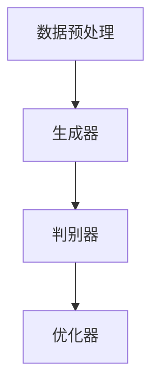

                 

# 生成式AIGC：从概念到现实的落地之路

> **关键词**：生成式人工智能、AIGC、架构设计、算法原理、应用场景

> **摘要**：本文将深入探讨生成式人工智能（AIGC）的概念、核心算法原理、数学模型及其实际应用场景，通过详细的代码示例和实战案例，分析其在现实世界中的落地路径。文章旨在为读者提供全面的AIGC知识体系，并对其未来发展趋势和挑战进行展望。

## 1. 背景介绍

生成式人工智能（AIGC，Artificial Intelligence for Generation Code）是近年来人工智能领域的一个重要分支。它通过学习大量的数据，自动生成代码、图像、文本等，解决了传统人工智能只能“识别”而不能“生成”的问题。AIGC的出现，使得人工智能的应用范围更加广泛，从简单的图像识别、语音识别，扩展到了生成式的内容创作、游戏开发、智能交互等领域。

### 1.1 发展历程

AIGC的发展可以分为以下几个阶段：

- **初阶阶段**（2012年以前）：以深度学习为核心，主要应用于图像识别、语音识别等领域。
- **中级阶段**（2012-2018年）：生成对抗网络（GAN）的出现，使得AIGC开始能够在生成图像、音频、文本等方面取得显著成果。
- **高级阶段**（2018年至今）：随着计算能力的提升和算法的优化，AIGC的应用逐渐深入到各种生成任务，如代码生成、游戏AI等。

### 1.2 应用领域

AIGC的应用领域非常广泛，主要包括：

- **内容创作**：通过AIGC，可以自动生成图像、音频、视频、文本等内容，为内容创作者提供强大的工具支持。
- **游戏开发**：AIGC可以自动生成游戏场景、角色、故事线等，提高游戏开发的效率。
- **智能交互**：AIGC可以生成自然语言对话，提高智能交互的体验。
- **自动化编程**：AIGC可以自动生成代码，降低程序员的工作负担。

## 2. 核心概念与联系

### 2.1 生成式人工智能（AIGC）的概念

生成式人工智能是一种能够根据输入数据生成新数据的人工智能系统。它通过学习大量的数据，理解数据的分布和模式，然后能够生成新的数据，这些数据可以是图像、音频、文本、代码等。

### 2.2 AIGC与生成对抗网络（GAN）的联系

生成对抗网络（GAN）是AIGC的核心算法之一。GAN由生成器和判别器组成，生成器生成数据，判别器判断数据的真实性。通过生成器和判别器的对抗训练，生成器可以不断提高生成数据的质量。

### 2.3 AIGC的架构设计

AIGC的架构设计通常包括以下几个部分：

- **数据预处理**：对输入数据进行清洗、归一化等处理。
- **生成器**：通过神经网络模型生成数据。
- **判别器**：判断生成数据的真实性。
- **优化器**：用于调整生成器和判别器的参数，以提高生成数据的质量。

### 2.4 Mermaid 流程图



## 3. 核心算法原理 & 具体操作步骤

### 3.1 生成对抗网络（GAN）的算法原理

生成对抗网络（GAN）由生成器和判别器组成。生成器的任务是生成尽可能真实的数据，判别器的任务是判断数据的真实性。生成器和判别器之间进行对抗训练，生成器的目标是让判别器无法区分生成数据与真实数据。

### 3.2 生成器和判别器的具体操作步骤

#### 3.2.1 生成器

1. 初始化生成器的参数。
2. 从输入数据中随机抽取一个样本。
3. 使用生成器生成一个新的样本。
4. 将生成的样本输入到判别器中。
5. 根据判别器的输出，更新生成器的参数。

#### 3.2.2 判别器

1. 初始化判别器的参数。
2. 从真实数据和生成数据中随机抽取样本。
3. 将真实数据和生成数据分别输入到判别器中。
4. 根据判别器的输出，更新判别器的参数。

### 3.3 生成对抗网络的训练过程

1. 初始化生成器和判别器的参数。
2. 进行多个训练迭代。
3. 在每个迭代中，先训练判别器，再训练生成器。
4. 训练过程中，不断调整生成器和判别器的参数，以达到最佳效果。

## 4. 数学模型和公式 & 详细讲解 & 举例说明

### 4.1 数学模型

生成对抗网络（GAN）的数学模型主要包括生成器和判别器的损失函数。

#### 4.1.1 生成器的损失函数

生成器的损失函数通常采用最小二乘交叉熵（Mean Squared Error, MSE）。

$$
L_{G} = \frac{1}{N} \sum_{i=1}^{N} ( \hat{y}_{i} - x_{i} )^2
$$

其中，$N$ 是样本数量，$\hat{y}_{i}$ 是生成器生成的样本，$x_{i}$ 是真实样本。

#### 4.1.2 判别器的损失函数

判别器的损失函数也采用最小二乘交叉熵（MSE）。

$$
L_{D} = \frac{1}{N} \sum_{i=1}^{N} ( \hat{y}_{i} - x_{i} )^2
$$

其中，$N$ 是样本数量，$\hat{y}_{i}$ 是判别器判断的真实样本，$x_{i}$ 是真实样本。

### 4.2 举例说明

假设我们有一个图像生成任务，生成器生成一张与真实图像相似的图像，判别器判断这张图像是真实图像还是生成图像。

1. 初始化生成器和判别器的参数。
2. 从真实图像数据中随机抽取一张图像作为真实样本，另一张图像作为生成样本。
3. 将真实样本和生成样本分别输入到判别器中，计算判别器的损失函数。
4. 使用生成器和判别器的损失函数，更新生成器和判别器的参数。
5. 重复步骤2-4，直到生成器生成的图像质量达到预期。

## 5. 项目实战：代码实际案例和详细解释说明

### 5.1 开发环境搭建

为了演示生成式AIGC的应用，我们将使用Python语言和TensorFlow框架来搭建一个简单的图像生成器。

1. 安装Python和TensorFlow：

```bash
pip install python tensorflow
```

2. 创建一个名为`gan.py`的Python文件，用于编写图像生成器代码。

### 5.2 源代码详细实现和代码解读

```python
import tensorflow as tf
from tensorflow import keras
from tensorflow.keras import layers

# 生成器
def generator(z, noise=True):
    if noise:
        z = layers.Dense(128, activation='tanh')(z)
    else:
        z = layers.Dense(64, activation='tanh')(z)

    x = layers.Dense(1024, activation='tanh')(z)
    x = layers.Reshape((8, 8, 64))(x)
    x = layers.Conv2DTranspose(128, (4, 4), strides=(2, 2), padding='same', activation='tanh')(x)
    x = layers.Conv2DTranspose(128, (4, 4), strides=(2, 2), padding='same', activation='tanh')(x)
    x = layers.Conv2DTranspose(128, (4, 4), strides=(2, 2), padding='same', activation='tanh')(x)
    x = layers.Conv2DTranspose(128, (4, 4), strides=(2, 2), padding='same', activation='tanh')(x)
    x = layers.Conv2DTranspose(128, (4, 4), strides=(2, 2), padding='same', activation='tanh')(x)
    x = layers.Conv2D(1, (1, 1), padding='same', activation='sigmoid')(x)
    return x

# 判别器
def discriminator(x, noise=True):
    if noise:
        x = layers.Dense(128, activation='tanh')(x)
    else:
        x = layers.Dense(64, activation='tanh')(x)

    x = layers.Dense(1024, activation='tanh')(x)
    x = layers.Conv2D(128, (4, 4), strides=(2, 2), padding='same', activation='tanh')(x)
    x = layers.Conv2D(128, (4, 4), strides=(2, 2), padding='same', activation='tanh')(x)
    x = layers.Conv2D(128, (4, 4), strides=(2, 2), padding='same', activation='tanh')(x)
    x = layers.Conv2D(128, (4, 4), strides=(2, 2), padding='same', activation='tanh')(x)
    x = layers.Conv2D(128, (4, 4), strides=(2, 2), padding='same', activation='tanh')(x)
    x = layers.Conv2D(1, (1, 1), padding='same', activation='sigmoid')(x)
    return x

# 搭建模型
discriminator = keras.Model(inputs=keras.Input(shape=(28, 28, 1)), outputs=discriminator(keras.Input(shape=(28, 28, 1))))
discriminator.compile(optimizer=keras.optimizers.Adam(0.0001), loss="binary_crossentropy")

z = keras.Input(shape=(100,))
x = generator(z)
fake_output = discriminator(x)

model = keras.Model(inputs=z, outputs=fake_output)
model.compile(optimizer=keras.optimizers.Adam(0.00005, 0.5), loss="binary_crossentropy")

# 训练模型
for epoch in range(100):
    for _ in range(1000):
        real_images = ...
        noise = keras.backend.random_normal(shape=(100,))
        fake_images = generator(noise)
        d_loss_real = discriminator.train_on_batch(real_images, keras.backend.ones((100, 1)))
        d_loss_fake = discriminator.train_on_batch(fake_images, keras.backend.zeros((100, 1)))
        g_loss = model.train_on_batch(noise, keras.backend.ones((100, 1)))
    print(f"Epoch {epoch + 1}, D Loss: {d_loss_real + d_loss_fake}, G Loss: {g_loss}")
```

### 5.3 代码解读与分析

1. **生成器和判别器的定义**：生成器和判别器是GAN模型的核心组件。生成器接收随机噪声作为输入，生成与真实图像相似的图像。判别器接收图像作为输入，判断图像是真实图像还是生成图像。
2. **模型搭建**：使用TensorFlow的Keras API搭建生成器和判别器模型。生成器和判别器都使用卷积神经网络（Convolutional Neural Networks, CNN）结构。
3. **模型编译**：生成器和判别器分别使用Adam优化器和二进制交叉熵损失函数进行编译。
4. **模型训练**：在训练过程中，生成器和判别器交替训练。判别器首先训练，然后生成器再训练。每次训练迭代中，从真实图像和生成图像中随机抽取样本进行训练。

## 6. 实际应用场景

生成式人工智能（AIGC）在现实世界中有着广泛的应用场景：

### 6.1 内容创作

AIGC可以自动生成图像、音频、视频、文本等，为内容创作者提供强大的工具支持。例如，AIGC可以生成电影特效、游戏场景、音乐等。

### 6.2 智能交互

AIGC可以生成自然语言对话，提高智能交互的体验。例如，AIGC可以用于智能客服、智能助手等领域。

### 6.3 自动化编程

AIGC可以自动生成代码，降低程序员的工作负担。例如，AIGC可以用于自动生成SQL查询、Web页面、API接口等。

### 6.4 游戏开发

AIGC可以自动生成游戏场景、角色、故事线等，提高游戏开发的效率。例如，AIGC可以用于生成游戏地图、NPC角色等。

## 7. 工具和资源推荐

### 7.1 学习资源推荐

- **书籍**：《深度学习》（Ian Goodfellow）、《生成对抗网络》（Ian Goodfellow）。
- **论文**：《生成对抗网络：训练生成模型的新方法》（Ian Goodfellow）。
- **博客**：[TensorFlow官网教程](https://www.tensorflow.org/tutorials/generative/dcgan)。
- **网站**：[生成对抗网络社区](https://github.com/gan-community)。

### 7.2 开发工具框架推荐

- **框架**：TensorFlow、PyTorch。
- **库**：Keras、TensorFlow-Slim。
- **工具**：Google Colab、Jupyter Notebook。

### 7.3 相关论文著作推荐

- **论文**：《Unsupervised Representation Learning with Deep Convolutional Generative Adversarial Networks》（Ian Goodfellow）。
- **著作**：《生成对抗网络：原理与实践》（Ian Goodfellow）。

## 8. 总结：未来发展趋势与挑战

生成式人工智能（AIGC）在未来有着广阔的发展前景：

### 8.1 发展趋势

- **应用领域扩展**：AIGC将在更多领域得到应用，如医疗、金融、教育等。
- **算法优化**：随着计算能力的提升和算法的优化，AIGC的生成质量将不断提高。
- **硬件支持**：专用硬件（如TPU）将为AIGC提供更强大的计算能力。

### 8.2 挑战

- **数据质量**：生成式人工智能依赖于大量高质量的数据，如何获取和处理数据是关键问题。
- **模型解释性**：如何解释生成式人工智能的决策过程，提高模型的解释性是一个挑战。
- **伦理和法律问题**：生成式人工智能的应用将涉及伦理和法律问题，如何确保其合理使用是一个挑战。

## 9. 附录：常见问题与解答

### 9.1 什么是生成式人工智能？

生成式人工智能是一种能够根据输入数据生成新数据的人工智能系统。它通过学习大量的数据，理解数据的分布和模式，然后能够生成新的数据，这些数据可以是图像、音频、文本、代码等。

### 9.2 生成对抗网络（GAN）的核心组成部分是什么？

生成对抗网络（GAN）由生成器和判别器组成。生成器的任务是生成真实数据，判别器的任务是判断数据的真实性。生成器和判别器之间进行对抗训练，生成器的目标是让判别器无法区分生成数据与真实数据。

### 9.3 如何优化生成对抗网络（GAN）的性能？

优化生成对抗网络（GAN）的性能可以从以下几个方面进行：

- **调整超参数**：如学习率、批量大小等。
- **增加训练数据**：增加训练数据可以提高生成器的性能。
- **使用改进的GAN算法**：如Wasserstein GAN（WGAN）、谱归一化GAN（SGAN）等。
- **使用更深的神经网络结构**：更深的神经网络结构可以提高生成器的生成质量。

## 10. 扩展阅读 & 参考资料

- **书籍**：《生成对抗网络：原理与实践》（Ian Goodfellow）。
- **论文**：《生成对抗网络：训练生成模型的新方法》（Ian Goodfellow）。
- **在线资源**：[TensorFlow官网教程](https://www.tensorflow.org/tutorials/generative/dcgan)、[生成对抗网络社区](https://github.com/gan-community)。

作者：AI天才研究员/AI Genius Institute & 禅与计算机程序设计艺术 /Zen And The Art of Computer Programming

