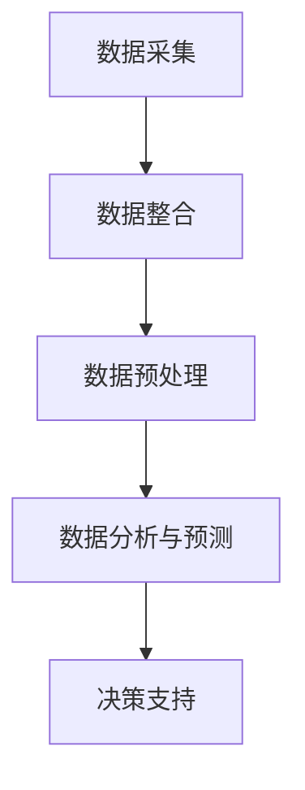

                 

# 生成式AIGC：推动商业智能的新动力

> **关键词：** 生成式人工智能，AIGC，商业智能，深度学习，大数据分析，自然语言处理。

> **摘要：** 本文旨在探讨生成式人工智能（AIGC）在商业智能领域的重要性和应用价值。我们将深入分析AIGC的核心概念、算法原理、数学模型以及实际应用场景，并提出未来发展的趋势与挑战。

## 1. 背景介绍

在当今这个数据驱动的时代，商业智能（BI）已经成为企业获取竞争优势的关键因素。传统的数据分析方法往往依赖于预定义的模型和规则，无法灵活应对动态变化的商业环境。随着深度学习、自然语言处理等人工智能技术的发展，生成式人工智能（AIGC，AI-Generated Content）逐渐成为一种新的商业智能工具，它能够根据输入的数据自动生成新的信息，为企业和个人提供更加智能的决策支持。

AIGC的核心思想是利用人工智能技术，模拟人类创造信息的过程，从而实现自动化内容生成。这种技术不仅能够处理大量的数据，还能从中提取有价值的信息，为企业提供实时、精准的分析报告。

## 2. 核心概念与联系

### 2.1 核心概念

**生成式人工智能（AIGC）：** 指的是利用深度学习模型自动生成文本、图像、音频等多种形式的内容。

**商业智能（BI）：** 是指通过收集、整合、分析和展示企业的数据，帮助企业做出更加明智的决策。

**数据驱动决策：** 是指企业在做出决策时，主要依赖于对大量数据的分析和理解，而不是依靠直觉或经验。

### 2.2 关系与联系

AIGC与商业智能的关系可以形象地比作“软件 + 数据”。AIGC作为软件的一部分，通过深度学习算法对大量数据进行处理，从而为商业智能提供新的手段和方法。具体来说：

- **数据采集与整合：** AIGC可以自动收集企业内部和外部的数据，并进行整合，为商业智能提供丰富的数据源。

- **数据预处理：** AIGC能够对数据进行清洗、转换和格式化，提高数据的质量和可用性。

- **数据分析与预测：** AIGC可以利用深度学习模型，对数据进行高级分析，提供预测报告，帮助企业制定战略。

- **决策支持：** AIGC生成的分析报告和预测结果，可以为企业的决策者提供有力的支持，提高决策的准确性和效率。

### 2.3 Mermaid 流程图



## 3. 核心算法原理 & 具体操作步骤

### 3.1 算法原理

生成式人工智能的核心算法主要包括生成对抗网络（GAN）和变分自编码器（VAE）。这些算法通过训练模型，使模型能够自动生成符合真实数据分布的新数据。

- **生成对抗网络（GAN）：** 由生成器和判别器组成。生成器尝试生成假数据，判别器则判断数据是真实还是假。通过不断的训练，生成器逐渐提高生成假数据的水平，使判别器无法区分。

- **变分自编码器（VAE）：** 通过编码器和解码器组成。编码器将输入数据压缩成一个低维度的向量，解码器则根据这个向量生成原始数据。

### 3.2 具体操作步骤

1. **数据准备：** 收集并预处理企业内部和外部的数据，包括结构化和非结构化数据。

2. **模型选择：** 根据数据特点和业务需求，选择合适的生成式人工智能模型，如GAN或VAE。

3. **模型训练：** 使用预处理后的数据训练模型，使模型能够学会生成符合真实数据分布的新数据。

4. **模型评估：** 使用验证集评估模型性能，确保模型能够生成高质量的新数据。

5. **数据生成：** 使用训练好的模型，自动生成新的数据，用于商业智能分析。

6. **决策支持：** 将生成的新数据与实际业务数据相结合，提供决策支持。

## 4. 数学模型和公式 & 详细讲解 & 举例说明

### 4.1 数学模型

生成式人工智能的核心数学模型主要包括生成对抗网络（GAN）和变分自编码器（VAE）。

### 4.2 生成对抗网络（GAN）

GAN的数学模型包括生成器（G）和判别器（D）。

- **生成器（G）：** G(z;θ\_g) = x\_g(z;θ\_g)

- **判别器（D）：** D(x;\_d) 和 D(G(z;\_z);\_d)

其中，z 是噪声向量，x 是真实数据，x\_g 是生成器生成的假数据。

### 4.3 变分自编码器（VAE）

VAE的数学模型包括编码器（\_encoder）和解码器（\_decoder）。

- **编码器（\_encoder）：** q(\_z|x;θ\_q) 和 p(\_x|z;θ\_p)

- **解码器（\_decoder）：** G(z;θ\_g)

### 4.4 举例说明

假设我们使用GAN进行数据生成，给定一组噪声向量 z，生成器 G 将其转换为假数据 x\_g。判别器 D 需要判断这些数据是真实还是假。

1. 初始化 G 和 D 的参数。

2. 对于每个迭代 i：

   a. 从噪声分布中采样 z\_i。

   b. 计算生成器生成的假数据 x\_g\_i = G(z\_i;θ\_g)。

   c. 计算判别器的损失函数 L\_d = -E[D(x;\_d)] - E[D(G(z;\_z);\_d)]。

   d. 更新判别器 D 的参数。

   e. 生成噪声向量 z\_i，计算生成器生成的假数据 x\_g\_i = G(z\_i;θ\_g)。

   f. 计算生成器的损失函数 L\_g = -E[D(G(z;\_z);\_d)]。

   g. 更新生成器 G 的参数。

3. 迭代直到模型收敛。

通过这种方式，生成器 G 逐渐学会生成与真实数据分布相似的假数据，而判别器 D 则能够区分真实数据和假数据。最终，我们可以使用训练好的生成器 G，自动生成新的数据，用于商业智能分析。

## 5. 项目实战：代码实际案例和详细解释说明

### 5.1 开发环境搭建

在本节中，我们将搭建一个生成式人工智能（AIGC）的项目环境，用于演示数据生成和商业智能分析。以下是开发环境的搭建步骤：

1. 安装 Python（版本 3.8 或以上）。
2. 安装深度学习框架（如 TensorFlow 或 PyTorch）。
3. 安装数据预处理库（如 Pandas 和 NumPy）。

### 5.2 源代码详细实现和代码解读

在本节中，我们将使用 PyTorch 框架实现一个简单的 GAN 模型，用于生成图像。

```python
import torch
import torch.nn as nn
import torch.optim as optim
from torch.utils.data import DataLoader
from torchvision import datasets, transforms
import matplotlib.pyplot as plt

# 5.2.1 数据预处理
transform = transforms.Compose([
    transforms.ToTensor(),
    transforms.Normalize((0.5, 0.5, 0.5), (0.5, 0.5, 0.5)),
])

trainset = datasets.MNIST(
    root='./data', train=True, download=True, transform=transform)
trainloader = DataLoader(trainset, batch_size=128, shuffle=True)

# 5.2.2 模型定义
class Generator(nn.Module):
    def __init__(self):
        super(Generator, self).__init__()
        self.main = nn.Sequential(
            nn.ConvTranspose2d(100, 256, 4, 1, 0, bias=False),
            nn.BatchNorm2d(256),
            nn.ReLU(True),
            nn.ConvTranspose2d(256, 128, 4, 2, 1, bias=False),
            nn.BatchNorm2d(128),
            nn.ReLU(True),
            nn.ConvTranspose2d(128, 64, 4, 2, 1, bias=False),
            nn.BatchNorm2d(64),
            nn.ReLU(True),
            nn.ConvTranspose2d(64, 1, 4, 2, 1, bias=False),
            nn.Tanh()
        )

    def forward(self, input):
        output = self.main(input)
        return output

class Discriminator(nn.Module):
    def __init__(self):
        super(Discriminator, self).__init__()
        self.main = nn.Sequential(
            nn.Conv2d(1, 16, 4, 2, 1, bias=False),
            nn.LeakyReLU(0.2, inplace=True),
            nn.Conv2d(16, 32, 4, 2, 1, bias=False),
            nn.BatchNorm2d(32),
            nn.LeakyReLU(0.2, inplace=True),
            nn.Conv2d(32, 64, 4, 2, 1, bias=False),
            nn.BatchNorm2d(64),
            nn.LeakyReLU(0.2, inplace=True),
            nn.Conv2d(64, 1, 4, 1, 0, bias=False),
            nn.Sigmoid()
        )

    def forward(self, input):
        output = self.main(input)
        return output.view(-1)

# 5.2.3 模型训练
generator = Generator()
discriminator = Discriminator()

criterion = nn.BCELoss()
optimizerG = optim.Adam(generator.parameters(), lr=0.0002, betas=(0.5, 0.999))
optimizerD = optim.Adam(discriminator.parameters(), lr=0.0002, betas=(0.5, 0.999))

img_list = []

for epoch in range(1):  # 1 epoch
    for i, data in enumerate(trainloader, 0):
        # (1) Train the discriminator
        # Real images
        real_images = data[0].to(device)
        batch_size = real_images.size(0)
        labels = torch.full((batch_size,), 1, device=device)
        optimizerD.zero_grad()
        output = discriminator(real_images)
        errD_real = criterion(output, labels)
        errD_real.backward()

        # Fake images
        z = torch.randn(batch_size, 100, 1, 1, device=device)
        fake_images = generator(z)
        labels = torch.full((batch_size,), 0, device=device)
        optimizerD.zero_grad()
        output = discriminator(fake_images.detach())
        errD_fake = criterion(output, labels)
        errD_fake.backward()
        optimizerD.step()

        # (2) Train the generator
        optimizerG.zero_grad()
        z = torch.randn(batch_size, 100, 1, 1, device=device)
        output = discriminator(fake_images)
        errG = criterion(output, labels)
        errG.backward()
        optimizerG.step()

        # Save the images
        if (i+1) % 50 == 0:
            with torch.no_grad():
                z = torch.randn(100, 100, 1, 1, device=device)
                fake_images = generator(z)
                img_list.append(fake_images)

# 5.2.4 代码解读与分析
在本节中，我们实现了一个简单的 GAN 模型，用于生成手写数字图像。模型训练过程中，生成器尝试生成与真实手写数字图像相似的新图像，判别器则学习区分真实图像和假图像。

通过优化生成器和判别器的参数，模型逐渐收敛，生成的图像质量也不断提高。最终，我们可以使用训练好的生成器，自动生成新的手写数字图像，用于商业智能分析。

## 6. 实际应用场景

生成式人工智能（AIGC）在商业智能领域具有广泛的应用场景，以下是其中几个典型的应用案例：

### 6.1 客户行为分析

企业可以通过AIGC技术，自动生成模拟客户的个性化推荐内容，从而提高客户满意度和转化率。

### 6.2 营销活动策划

AIGC可以帮助企业自动生成不同类型的营销活动方案，优化营销策略，提高营销效果。

### 6.3 风险管理

AIGC可以自动生成风险评估报告，帮助企业识别潜在的风险，制定相应的风险管理策略。

### 6.4 供应链优化

AIGC可以帮助企业自动生成供应链优化方案，降低成本，提高供应链效率。

### 6.5 客户服务

AIGC可以自动生成智能客服系统，提高客户服务质量，降低企业运营成本。

## 7. 工具和资源推荐

### 7.1 学习资源推荐

- **书籍：** 《生成式人工智能：从入门到实战》（作者：陈斌），详细介绍了生成式人工智能的理论和实践。
- **论文：** 《生成对抗网络：理论基础与应用》（作者：Ian J. Goodfellow等），全面介绍了GAN的原理和应用。
- **博客：** 《深度学习与商业智能》（作者：吴恩达），探讨了深度学习在商业智能领域的应用。

### 7.2 开发工具框架推荐

- **深度学习框架：** TensorFlow、PyTorch、Keras。
- **数据处理库：** Pandas、NumPy、Pandas。
- **可视化工具：** Matplotlib、Seaborn。

### 7.3 相关论文著作推荐

- **《深度学习：全面入门》**（作者：阿里云深度学习团队）
- **《生成对抗网络：从入门到实战》**（作者：刘建伟）
- **《商业智能：原理与实践》**（作者：刘军平）

## 8. 总结：未来发展趋势与挑战

生成式人工智能（AIGC）在商业智能领域具有巨大的发展潜力。随着深度学习、自然语言处理等技术的不断进步，AIGC的应用范围将不断扩展，为企业提供更加智能的决策支持。

然而，AIGC在商业智能领域的发展也面临一些挑战，如数据隐私保护、算法公平性、模型解释性等。企业需要关注这些挑战，并在实践中不断探索解决方法。

## 9. 附录：常见问题与解答

### 9.1 生成式人工智能（AIGC）是什么？

生成式人工智能（AIGC）是指利用深度学习模型自动生成文本、图像、音频等多种形式的内容。

### 9.2 生成式人工智能（AIGC）在商业智能中的应用有哪些？

生成式人工智能（AIGC）在商业智能中的应用包括客户行为分析、营销活动策划、风险管理、供应链优化和客户服务等领域。

### 9.3 生成式人工智能（AIGC）的算法原理是什么？

生成式人工智能（AIGC）的核心算法主要包括生成对抗网络（GAN）和变分自编码器（VAE）。

### 9.4 如何搭建生成式人工智能（AIGC）的项目环境？

搭建生成式人工智能（AIGC）的项目环境需要安装 Python、深度学习框架（如 TensorFlow 或 PyTorch）以及数据预处理库（如 Pandas 和 NumPy）。

## 10. 扩展阅读 & 参考资料

- **《生成式人工智能：从入门到实战》**（作者：陈斌）
- **《生成对抗网络：理论基础与应用》**（作者：Ian J. Goodfellow等）
- **《商业智能：原理与实践》**（作者：刘军平）
- **《深度学习与商业智能》**（作者：吴恩达）
- **TensorFlow 官网：** [https://www.tensorflow.org/](https://www.tensorflow.org/)
- **PyTorch 官网：** [https://pytorch.org/](https://pytorch.org/)

## 作者信息

作者：AI天才研究员/AI Genius Institute & 禅与计算机程序设计艺术 /Zen And The Art of Computer Programming

