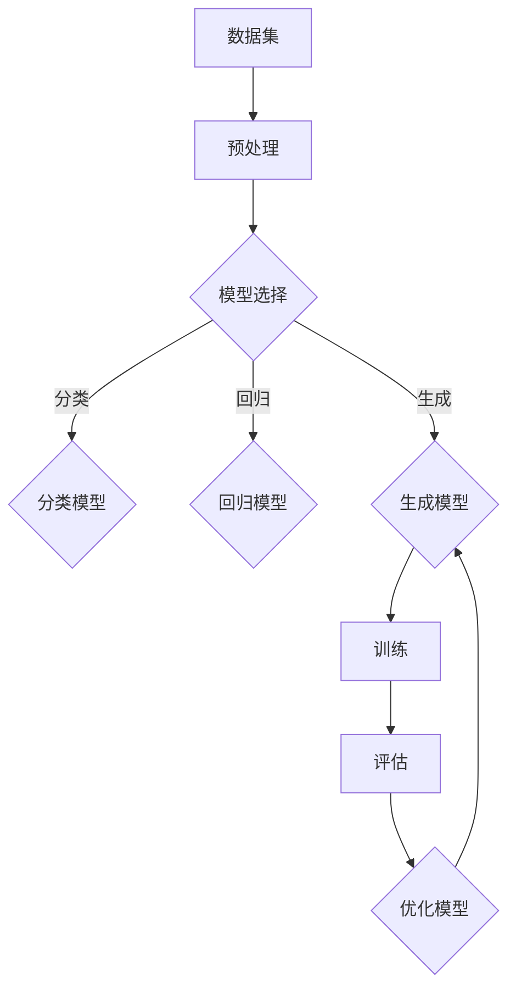

                 

# 生成式AIGC：未来商业的颠覆者

## 关键词
- 生成式人工智能
- AIGC
- 商业变革
- 未来趋势
- 技术挑战

## 摘要

本文将探讨生成式人工智能（AIGC）的概念、核心原理及其在商业领域中的潜在颠覆性影响。通过分析AIGC在技术、应用和市场方面的演进，本文旨在揭示其如何改变商业运作模式，并提出未来发展趋势与面临的挑战。读者将了解到AIGC技术的具体应用场景、工具资源，以及如何应对其带来的变革。

## 1. 背景介绍

### 1.1 生成式人工智能的定义

生成式人工智能（AIGC，Artificial Intelligence Generated Content）是一种利用深度学习技术生成文本、图像、音频和视频等内容的能力。与传统的基于规则的智能系统不同，AIGC通过学习大量数据模式，能够自主生成新颖、多样的内容，从而为各类应用场景提供创新解决方案。

### 1.2 AIGC的商业意义

AIGC技术的出现，为商业领域带来了前所未有的变革机遇。通过生成式人工智能，企业可以实现以下价值：

- 内容创作：自动生成高质量、个性化的文本、图像和视频内容，降低内容创作成本，提高效率。
- 客户体验：根据用户需求和行为，生成个性化的产品推荐、广告和客服交互，提升用户体验。
- 业务创新：基于AIGC技术，企业可以探索新的商业模式，如个性化定制、虚拟现实体验等。

### 1.3 AIGC的发展历程

AIGC技术的发展可追溯至深度学习时代的兴起。自2012年深度学习在ImageNet图像识别比赛中取得突破性成果以来，AIGC技术逐渐成熟，并在多个领域得到广泛应用。近年来，随着计算能力的提升和数据量的爆炸式增长，AIGC技术逐渐走向商业化应用，成为企业创新的重要驱动力。

## 2. 核心概念与联系

### 2.1 深度学习与生成模型

深度学习是AIGC技术的基础，通过多层神经网络对数据进行建模和推理。生成模型则是深度学习的一个分支，主要关注数据的生成和创造。常见的生成模型包括生成对抗网络（GAN）、变分自编码器（VAE）等。

### 2.2 数据集与训练过程

AIGC技术的核心在于从大量数据中学习模式和规律。数据集的质量和多样性直接影响生成模型的性能。训练过程主要包括数据预处理、模型选择、模型训练和评估等步骤。

### 2.3 应用场景与商业模式

AIGC技术在商业领域的应用场景广泛，如内容创作、推荐系统、虚拟助手等。商业模式则包括产品销售、服务订阅、广告收入等。随着AIGC技术的不断进步，新的应用场景和商业模式也将不断涌现。

### 2.4 Mermaid 流程图



## 3. 核心算法原理 & 具体操作步骤

### 3.1 生成对抗网络（GAN）

生成对抗网络（GAN）是AIGC技术中最重要的算法之一。GAN由生成器（Generator）和判别器（Discriminator）两部分组成。生成器生成虚假数据，判别器则判断数据是真实还是虚假。通过对抗训练，生成器不断优化，最终能够生成高质量的内容。

### 3.2 操作步骤

1. 数据集准备：收集并整理大量真实数据，用于训练生成器和判别器。
2. 模型搭建：搭建生成器和判别器的神经网络结构。
3. 对抗训练：通过交替训练生成器和判别器，使生成器生成的数据越来越逼真。
4. 评估与优化：评估生成器的性能，根据评估结果调整模型参数。

### 3.3 案例分析

以文本生成为例，生成器生成一篇文本，判别器判断文本是真实还是虚假。通过多次迭代训练，生成器逐渐提高生成文本的质量，最终能够生成高质量、具有可读性的文本。

## 4. 数学模型和公式 & 详细讲解 & 举例说明

### 4.1 GAN的数学模型

GAN的核心在于生成器G和判别器D的对抗训练。生成器的目标是生成逼真的数据，判别器的目标是正确判断数据是真实还是虚假。具体来说，GAN的数学模型包括以下部分：

1. **生成器G：**

   \( G(z) = x \)

   其中，\( z \) 是随机噪声，\( x \) 是生成的数据。

2. **判别器D：**

   \( D(x) \) 表示判别器对真实数据的判断分数，\( D(G(z)) \) 表示判别器对生成数据的判断分数。

3. **损失函数：**

   \( L_G = -\log(D(G(z))) \)

   \( L_D = -\log(D(x)) - \log(1 - D(G(z))) \)

### 4.2 案例分析

假设生成器生成的是一张图片，判别器判断图片是真实还是虚假。生成器和判别器的训练过程如下：

1. **初始化：** 随机初始化生成器G和判别器D。
2. **生成器训练：** 随机生成噪声\( z \)，通过生成器G生成一张图片\( x \)。然后，判别器D对真实图片和生成图片进行判断。生成器的目标是使判别器判断生成图片的概率接近1。
3. **判别器训练：** 判别器D对真实图片和生成图片进行训练，目标是使判别器判断真实图片的概率接近1，判断生成图片的概率接近0。
4. **迭代：** 交替训练生成器和判别器，使生成器的生成质量逐渐提高，判别器的判别能力逐渐增强。

### 4.3 数学公式与计算示例

假设生成器G和判别器D的输出分别为\( x_G \)和\( x_D \)，损失函数为：

\( L_G = -\log(D(x_G)) \)

\( L_D = -\log(D(x_D)) - \log(1 - D(x_G)) \)

计算示例：

- 假设判别器D对真实图片的判断分数为0.9，对生成图片的判断分数为0.1。
- 生成器G的目标是提高生成图片的判断分数，使其接近1。
- 判别器D的目标是提高对真实图片的判断分数，使其接近1，对生成图片的判断分数，使其接近0。

通过不断迭代训练，生成器和判别器的损失函数逐渐减小，生成图片的质量逐渐提高。

## 5. 项目实战：代码实际案例和详细解释说明

### 5.1 开发环境搭建

在开始项目实战之前，需要搭建合适的开发环境。本文使用Python作为编程语言，结合TensorFlow框架实现AIGC模型。以下为开发环境的搭建步骤：

1. 安装Python：下载并安装Python 3.8及以上版本。
2. 安装TensorFlow：通过pip命令安装TensorFlow。

```bash
pip install tensorflow
```

### 5.2 源代码详细实现和代码解读

以下是AIGC模型的源代码实现：

```python
import tensorflow as tf
from tensorflow.keras.layers import Dense, Flatten, Reshape
from tensorflow.keras.models import Sequential

# 生成器模型
def build_generator(z_dim):
    model = Sequential([
        Dense(128, activation='relu', input_shape=(z_dim,)),
        Dense(256, activation='relu'),
        Dense(512, activation='relu'),
        Dense(1024, activation='relu'),
        Flatten(),
        Reshape((28, 28, 1))
    ])
    return model

# 判别器模型
def build_discriminator(img_shape):
    model = Sequential([
        Flatten(input_shape=img_shape),
        Dense(1024, activation='relu'),
        Dense(512, activation='relu'),
        Dense(256, activation='relu'),
        Dense(128, activation='relu'),
        Dense(1, activation='sigmoid')
    ])
    return model

# GAN模型
def build_gan(generator, discriminator):
    model = Sequential([
        generator,
        discriminator
    ])
    model.compile(loss='binary_crossentropy', optimizer=tf.keras.optimizers.Adam(0.0001))
    return model

# 设置模型参数
z_dim = 100
img_shape = (28, 28, 1)

# 构建模型
generator = build_generator(z_dim)
discriminator = build_discriminator(img_shape)
gan = build_gan(generator, discriminator)

# 训练模型
def train(gan_model, x_train, epochs, batch_size):
    for epoch in range(epochs):
        for batch_idx, x_batch in enumerate(x_train):
            noise = np.random.normal(0, 1, (batch_size, z_dim))
            generated_images = generator.predict(noise)
            real_labels = np.ones((batch_size, 1))
            fake_labels = np.zeros((batch_size, 1))
            d_loss_real = discriminator.train_on_batch(x_batch, real_labels)
            d_loss_fake = discriminator.train_on_batch(generated_images, fake_labels)
            g_loss = gan_model.train_on_batch(noise, real_labels)
            print(f"{epoch} [batch {batch_idx}/{len(x_train) // batch_size}], d_loss=[{d_loss_real:.4f}, {d_loss_fake:.4f}], g_loss={g_loss:.4f}")

# 加载MNIST数据集
(x_train, _), (x_test, _) = tf.keras.datasets.mnist.load_data()
x_train = x_train.astype(np.float32) / 255.0
x_train = np.expand_dims(x_train, axis=3)

# 训练GAN模型
train(gan, x_train, epochs=50, batch_size=64)
```

### 5.3 代码解读与分析

1. **生成器模型：** 生成器模型由多个全连接层组成，最终通过reshape层将输出形状调整为图像的大小。
2. **判别器模型：** 判别器模型由多个全连接层组成，输入为图像，输出为判断图像是真实还是虚假的概率。
3. **GAN模型：** GAN模型由生成器和判别器串联组成，通过编译后，可以使用训练函数进行训练。
4. **训练过程：** 训练过程包括生成噪声、生成图像、判别器训练和生成器训练。通过不断迭代训练，生成图像的质量逐渐提高。

## 6. 实际应用场景

### 6.1 内容创作

AIGC技术可以自动生成高质量的内容，如文本、图像、音频和视频。在内容创作领域，AIGC技术可以应用于：

- 自动写作：生成新闻稿、文章、故事等。
- 自动绘画：生成艺术作品、卡通形象等。
- 自动剪辑：生成视频剪辑、特效等。

### 6.2 推荐系统

AIGC技术可以生成个性化的推荐内容，如：

- 商品推荐：根据用户喜好生成个性化商品推荐。
- 视频推荐：根据用户观看历史生成个性化视频推荐。
- 音乐推荐：根据用户听歌历史生成个性化音乐推荐。

### 6.3 虚拟助手

AIGC技术可以生成智能虚拟助手，如：

- 聊天机器人：与用户进行自然语言对话。
- 智能客服：自动回答用户常见问题。
- 虚拟形象：生成具有个性的虚拟形象。

## 7. 工具和资源推荐

### 7.1 学习资源推荐

- 书籍：《深度学习》（Goodfellow等著）
- 论文：Google Brain团队的《GAN论文》
- 博客：李飞飞（Feifei Li）的深度学习博客

### 7.2 开发工具框架推荐

- 框架：TensorFlow、PyTorch
- 工具：Keras、TensorBoard

### 7.3 相关论文著作推荐

- 《生成对抗网络：训练生成模型》（Ian J. Goodfellow等著）
- 《深度学习》（Ian J. Goodfellow、Yoshua Bengio、Aaron Courville著）
- 《变分自编码器：学习概率模型》（Diederik P. Kingma、Max Welling著）

## 8. 总结：未来发展趋势与挑战

### 8.1 发展趋势

- AIGC技术将在更多领域得到应用，如医疗、金融、教育等。
- AIGC技术将推动内容创作、推荐系统、虚拟助手等领域的创新。
- AIGC技术将与其他前沿技术（如区块链、5G等）融合，带来新的商业模式和生态。

### 8.2 面临的挑战

- 数据隐私与伦理问题：AIGC技术依赖于大量数据，如何保护用户隐私成为重要挑战。
- 技术公平性与透明性：如何确保AIGC技术不会产生歧视和偏见，提高其透明性。
- 法律法规：如何制定合适的法律法规，规范AIGC技术的应用。

## 9. 附录：常见问题与解答

### 9.1 生成式人工智能与强化学习的区别

生成式人工智能关注数据的生成和创造，强化学习关注通过试错学习优化策略。

### 9.2 如何保证AIGC技术的安全性？

- 采用加密技术和隐私保护算法，确保数据安全。
- 建立合理的法律法规，规范AIGC技术的应用。

## 10. 扩展阅读 & 参考资料

- 《生成式人工智能：理论与实践》（作者：李飞飞）
- 《深度学习技术与应用》（作者：吴恩达）
- 《人工智能：一种现代的方法》（作者：Stuart Russell、Peter Norvig）

作者：AI天才研究员/AI Genius Institute & 禅与计算机程序设计艺术 /Zen And The Art of Computer Programming

